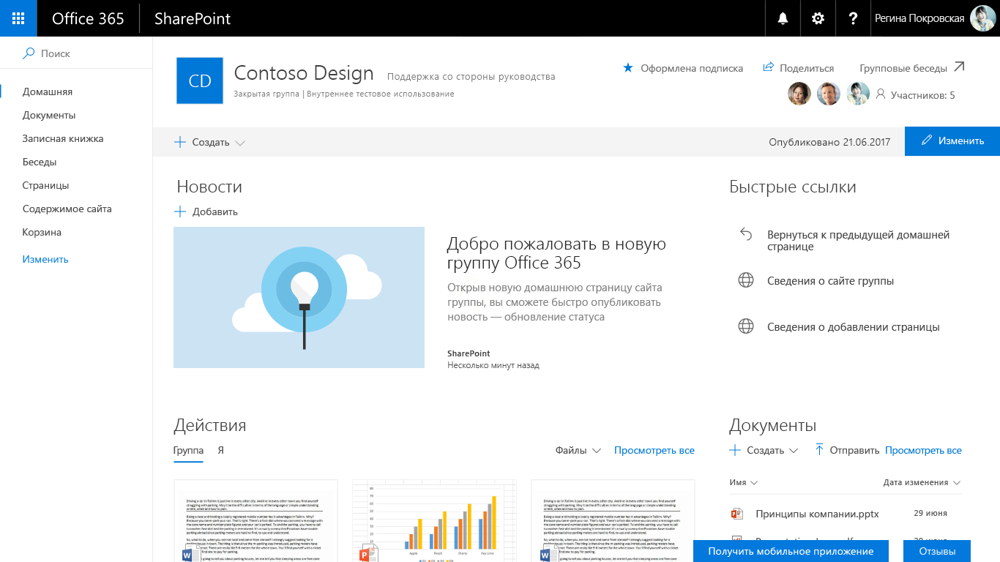
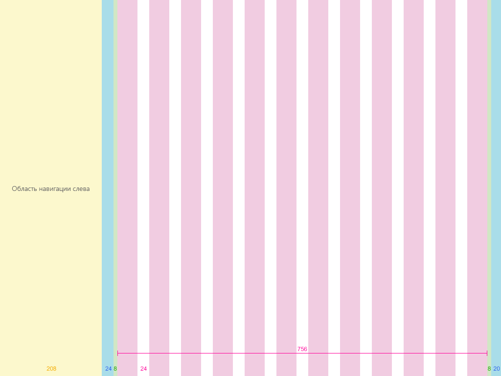
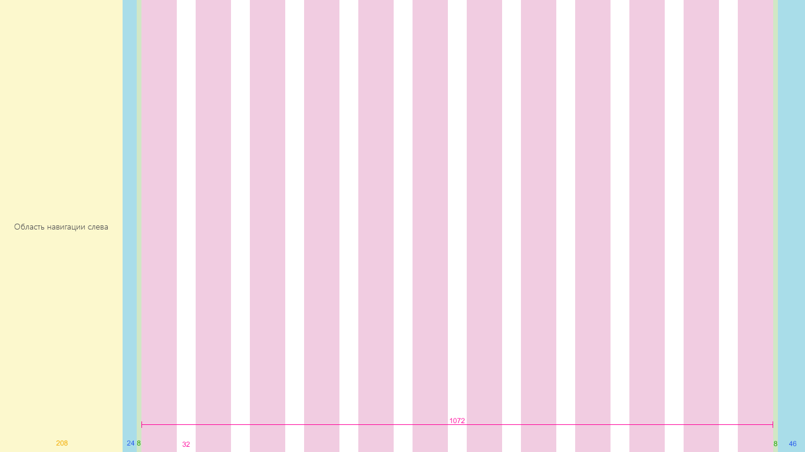
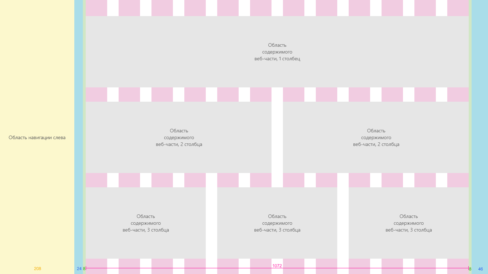
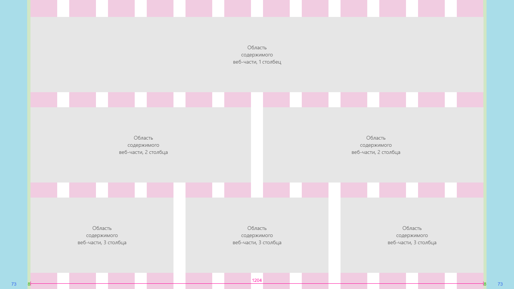
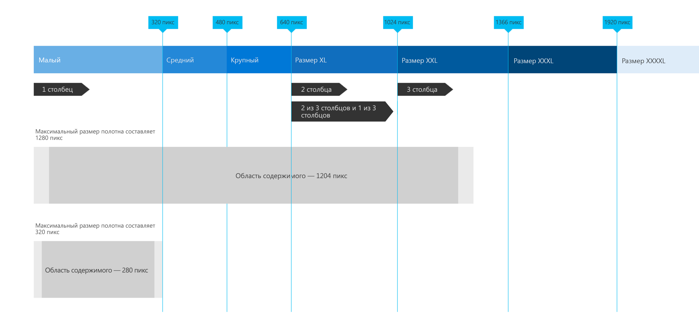

# Сетка SharePoint и адаптивный дизайн
 
Адаптивные интерфейсы легко масштабируются на различных устройствах, чтобы содержимое лучше отображалась на экранах разных размеров. Адаптивный дизайн также избавляет от необходимости создавать несколько версий страниц сайта для поддержки различных устройств.  

В рекомендациях по проектированию адаптивных страниц в среде разработки SharePoint используется система адаптивной сетки, основанная на [Office UI Fabric](https://developer.microsoft.com/ru-RU/fabric). В этой статье описаны базовая система сетки страниц и пограничные значения, или ключевые размеры экрана, при использовании которых будет меняться разметка страниц. 

## Сетки типов страниц 

Для каждой страницы в среде разработки SharePoint могут действовать собственные правила касательно применения адаптивной сетки Fabric. Благодаря этому каждая страница будет хорошо выглядеть независимо от того, для какого устройства она разработана, а интерфейс будет оптимизирован для соответствующей среды. Базовая сетка в классических средах SharePoint представляет собой структуру из 12 столбцов. Количество столбцов и интервал между ними регулируются в соответствии с шириной экрана. 

В приведенных ниже разделах представлена базовая структура сетки, применяемая на страницах SharePoint разных типов, чтобы помочь вам лучше понять, как сетка регулируется в соответствии с потребностями интерфейса и устройства.

 

### Сайты групп

Область контента для сайта группы закреплена в левой части экрана. На сайтах групп область навигации расположена слева, поэтому при добавлении веб-частей на сетку и перестраивании страницы она не перекрывается. Максимальная ширина области контента на сайте группы — 1204 пикселя, а минимальный размер — 320 пикселей для поддержки мобильных устройств.

 

В приведенных ниже примерах показано, как сетка регулируется с учетом основных пограничных значений на сайте группы.

#### Маленькая (320 x 568)
Маленькая сетка содержит один столбец по центру с полями по 20 пикселей слева и справа.

 

#### Средняя (480 x 854)
Средняя сетка содержит 12 столбцов с интервалами по 16 пикселей.

 

#### Крупная (640 x 1024)
Крупная сетка содержит 12 столбцов с интервалами по 24 пикселя.

 

#### XL (1024 x 768)
Сетка размера XL содержит 12 столбцов с интервалами по 24 пикселя.

 

#### XXL (1366 x 768)
Сетка размера XXL содержит 12 столбцов с интервалами по 32 пикселя.

 

#### XXXL (1920 x 1080)
Сетка размера XXXL содержит 12 столбцов с интервалами по 32 пикселя.

 

#### Страницы с несколькими столбцами и веб-части на сайтах групп
Веб-части масштабируются по горизонтали в зависимости от разметки страницы. Ниже показано, как размер веб-части корректируется, чтобы поместилась область навигации слева.

### Сайты для общения

На сайтах для общения область навигации расположена вверху, а область контента — по центру. Максимальная ширина области контента на сайте для общения — 1204 пикселей, а минимальный размер — 320 пикселей для поддержки мобильных устройств.

 

В приведенных ниже примерах показано, как сетка регулируется с учетом основных пограничных значений на сайте для общения.

#### Маленькая (320 x 568)
Маленькая сетка содержит один столбец по центру с полями по 20 пикселей слева и справа.

 

#### Средняя (480 x 854)
Средняя сетка содержит 12 столбцов с интервалами по 16 пикселей.

 

#### Крупная (640 x 1024)
Крупная сетка содержит 12 столбцов с интервалами по 24 пикселя.

 

#### XL (1024 x 768)
Сетка размера XL содержит 12 столбцов с интервалами по 24 пикселя.

 

#### XXL (1366 x 768)
Сетка размера XXL содержит 12 столбцов с интервалами по 32 пикселя.

 

#### XXXL (1920 x 1080)
Сетка размера XXXL содержит 12 столбцов с интервалами по 32 пикселя.

 

#### Страницы с несколькими столбцами и веб-части на сайтах для общения
Веб-части масштабируются по горизонтали в зависимости от разметки страницы. Ниже показаны сайт для общения и веб-части для макетов с 1–3 столбцами.

## Пограничные значения 

Чтобы страница правильно перестраивалась на экранах всех размеров, пользовательский интерфейс SharePoint должен адаптировать разметку с учетом следующих пограничных значений ширины: 

- 320 пкс
- 1024 пкс
- 1366 пкс
- 1920 пкс
 
При использовании этих пограничных значений следует учитывать, как сместится контент после оптимизации окна просмотра в соответствии с ближайшим пограничным значением. Обратите внимание, что эта схема представлена в иллюстративных целях и не является точной.

 

Адаптивная сетка на сайтах групп и сайтах для общения регулируется при переходе от больших пограничных значений к значениям для мобильных приложений. Так сайт корректируется для устройства и размера его экрана. В приведенной ниже таблице описаны размеры сетки при различных пограничных значениях для размеров экранов популярных устройств.

| Ширина окна | Устройство                  | Пограничное значение | Столбцы | Интервал | Максимальное количество столбцов для раздела |
|:-------------|:------------------------|:-----------|:-------:|:------:|:-----------------------:|
| 320          | iPhone 5/SE, 320 x 568     | Малый      | 1       | Н/д    | 1                       |
| 480          | Устройство с 6-дюймовым экраном               | Средний     | 1       | Н/д    | 1                       |
| 640          | Устройство с 8-дюймовым экраном               | Крупный      | 12      | 16     | 2                       |
| 768          | iPad с книжной ориентацией, 768 x 1024  | Крупный      | 12      | 24     | 2                       |
| 1024         | iPad с альбомной ориентацией, 1024 x 768 | Размер XL    | 12      | 24     | 3                       |
| 1368         | Surface Pro 3, 1368 x 912  | Размер XXL   | 12      | 32     | 3                       |
| 1440         | Surface Pro 4, 1440 x 960  | Размер XXL   | 12      | 32     | 3                       |
| 1600         | Веб-браузер, 1600 x 900            | Размер XXL   | 12      | 32     | 3                       |
| 1920         | Веб-браузер, 1920 x 1080           | Размер XXXL  | 12      | 32     | 3                       |

 

## См. также

- [Набор инструментов и ресурсы для дизайна](https://developer.microsoft.com/ru-RU/fabric#/resources)
- [Принципы дизайна SharePoint](design-guidance-overview.md)

