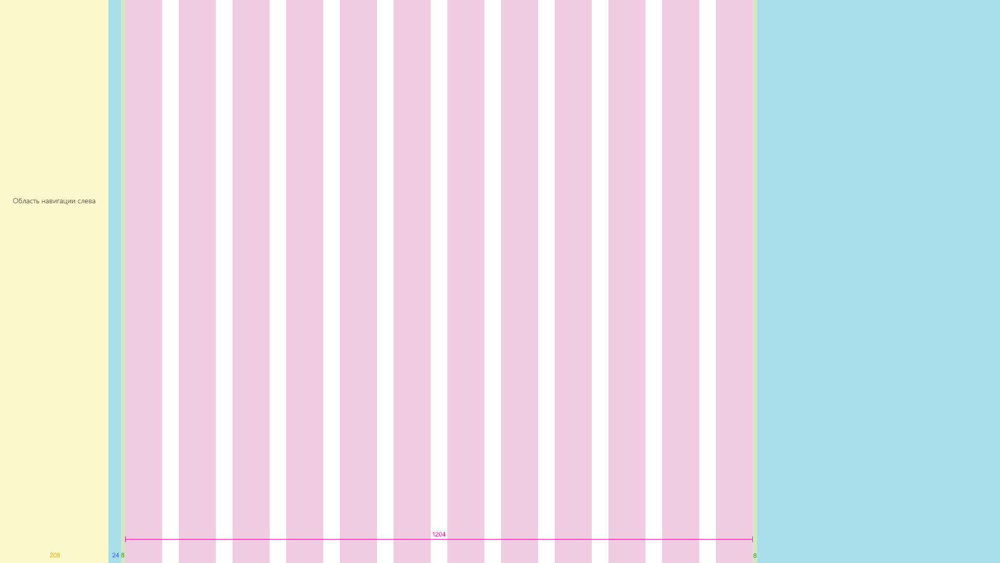

# Сетка SharePoint и адаптивный дизайнSharePoint grid and responsive design
 
Адаптивные интерфейсы легко масштабируются на различных устройствах, чтобы содержимое лучше отображалась на экранах разных размеров.Responsive experiences seamlessly scale across devices, to better display your content on a range of different screen sizes. Адаптивный дизайн также избавляет от необходимости создавать несколько версий страниц сайта для поддержки различных устройств.Responsive design also eliminates the need to build multiple versions of your site pages to support different devices.  

В рекомендациях по проектированию адаптивных страниц в среде разработки SharePoint используется система адаптивной сетки, основанная на [Office UI Fabric](https://developer.microsoft.com/ru-RU/fabric).The design guidance for responsive pages in the SharePoint authoring environment incorporates a responsive grid system that is based on [Office UI Fabric](https://developer.microsoft.com/ru-RU/fabric). В этой статье описаны базовая система сетки страниц и пограничные значения, или ключевые размеры экрана, при использовании которых будет меняться разметка страниц.This article describes the underlying page grid system and the breakpoints, or key screen sizes where the layout of the pages will change. 

## Сетки типов страницPage type grids 

Для каждой страницы в среде разработки SharePoint могут действовать собственные правила касательно применения адаптивной сетки Fabric.Each page type in the SharePoint authoring experience can have its own rules for how it applies the Fabric responsive grid. Благодаря этому каждая страница будет хорошо выглядеть независимо от того, для какого устройства она разработана, а интерфейс будет оптимизирован для соответствующей среды.This is to ensure that each page looks great, regardless of what device it's designed for, and that the experience is optimized for that environment. Базовая сетка в классических средах SharePoint представляет собой структуру из 12 столбцов.The basic grid in the SharePoint desktop experiences is a 12 column structure. Количество столбцов и интервал между ними регулируются в соответствии с шириной экрана.The number of columns and gutter width will adjust based on the screen width. 

В приведенных ниже разделах представлена базовая структура сетки, применяемая на страницах SharePoint разных типов, чтобы помочь вам лучше понять, как сетка регулируется в соответствии с потребностями интерфейса и устройства.The following sections show the basic grid structure applied across different types of SharePoint pages, to help you better understand how the grid adjusts to support the experience and device needs.

 

### Сайты группTeam sites

Область контента для сайта группы закреплена в левой части экрана.The content area for a team site is locked to the left. На сайтах групп область навигации расположена слева, поэтому при добавлении веб-частей на сетку и перестраивании страницы она не перекрывается.Team sites have a left navigation, therefore the space web parts occupy on the gird and the reflow behavior respects the space given to the navigation. Максимальная ширина области контента на сайте группы — 1204 пикселя, а минимальный размер — 320 пикселей для поддержки мобильных устройств.The max width of the content area of a Team site is 1204px and the minimum size is 320px for mobile support.

 

В приведенных ниже примерах показано, как сетка регулируется с учетом основных пограничных значений на сайте группы.The following examples show how the grid adjusts between key breakpoints on a team site.

#### Маленькая (320 x 568)Small 320 x 568
Маленькая сетка содержит один столбец по центру с полями по 20 пикселей слева и справа.The small size has a single centered column area, with 20px margins left and right.

 

#### Средняя (480 x 854)Medium 480 x 854
Средняя сетка содержит 12 столбцов с интервалами по 16 пикселей.The medium size has 12 columns, with 16px gutters.

 

#### Крупная (640 x 1024)Large 640 x 1024
Крупная сетка содержит 12 столбцов с интервалами по 24 пикселя.The large size has 12 columns, with 24px gutters.

 

#### XL (1024 x 768)XL 1024 x 768
Сетка размера XL содержит 12 столбцов с интервалами по 24 пикселя.The XL size has 12 columns, with 24px gutters.

 

#### XXL (1366 x 768)XXL 1366 x 768
Сетка размера XXL содержит 12 столбцов с интервалами по 32 пикселя.The XXL size has 12 columns, with 32px gutters.

 

#### XXXL (1920 x 1080)XXXL 1920 x 1080
Сетка размера XXXL содержит 12 столбцов с интервалами по 32 пикселя.The XXXL size has 12 columns, with 32px gutters.

 

#### Страницы с несколькими столбцами и веб-части на сайтах группTeam site multicolumn pages and web parts
Веб-части масштабируются по горизонтали в зависимости от разметки страницы.Web parts will scale horizontally depending on the page layout. Ниже показано, как размер веб-части корректируется, чтобы поместилась область навигации слева.The following example shows how the size of a web part adjusts to accommodate the left navigation.

### Сайты для общенияCommunication sites

На сайтах для общения область навигации расположена вверху, а область контента — по центру.Communication sites have a top navigation and a centered content area. Максимальная ширина области контента на сайте для общения — 1204 пикселей, а минимальный размер — 320 пикселей для поддержки мобильных устройств.The maximum width of the content area of a communication site is 1204px and the minimum size is 320px for mobile support.

 

В приведенных ниже примерах показано, как сетка регулируется с учетом основных пограничных значений на сайте для общения.The following examples show how the grid adjusts between key breakpoints on a communication site.

#### Маленькая (320 x 568)Small 320 x 568
Маленькая сетка содержит один столбец по центру с полями по 20 пикселей слева и справа.The small size has a single centered column area, with 20px margins left and right.

 

#### Средняя (480 x 854)Medium 480 x 854
Средняя сетка содержит 12 столбцов с интервалами по 16 пикселей.The medium size has 12 columns, with 16px gutters.

 

#### Крупная (640 x 1024)Large 640 x 1024
Крупная сетка содержит 12 столбцов с интервалами по 24 пикселя.The large size has 12 columns, with 24px gutters.

 

#### XL (1024 x 768)XL 1024 x 768
Сетка размера XL содержит 12 столбцов с интервалами по 24 пикселя.The XL size has 12 columns, with 24px gutters.

 

#### XXL (1366 x 768)XXL 1366 x 768
Сетка размера XXL содержит 12 столбцов с интервалами по 32 пикселя.The XXL size has 12 columns, with 32px gutters.

 

#### XXXL (1920 x 1080)XXXL 1920 x 1080
Сетка размера XXXL содержит 12 столбцов с интервалами по 32 пикселя.The XXXL size has 12 columns, with 32px gutters.

 

#### Страницы с несколькими столбцами и веб-части на сайтах для общенияCommunication site multicolumn pages and web parts
Веб-части масштабируются по горизонтали в зависимости от разметки страницы.Web parts will scale horizontally depending on the page layout. Ниже показаны сайт для общения и веб-части для макетов с 1–3 столбцами.This example shows a communcation site and web parts for single to three column layouts.

## Пограничные значенияBreakpoints 

Чтобы страница правильно перестраивалась на экранах всех размеров, пользовательский интерфейс SharePoint должен адаптировать разметку с учетом следующих пограничных значений ширины:To create a smooth flowing experience between screen sizes, the SharePoint UI should adapt layouts for the following breakpoint widths: 

- 320 пкс320 px
- 1024 пкс1024 px
- 1366 пкс1366 px
- 1920 пкс1920 px
 
При использовании этих пограничных значений следует учитывать, как сместится контент после оптимизации окна просмотра в соответствии с ближайшим пограничным значением.Within these breakpoints, you should take into consideration how your content will shift when the viewport size becomes optimized for the nearest breakpoint. Обратите внимание, что эта схема представлена в иллюстративных целях и не является точной.Note that this diagram is for illustration only and is not pixel accurate.

 

Адаптивная сетка на сайтах групп и сайтах для общения регулируется при переходе от больших пограничных значений к значениям для мобильных приложений.The responsive grid for both team sites and communication sites adjusts when going from large breakpoints to mobile breakpoints. Так сайт корректируется для устройства и размера его экрана.This optimizes the site for the device and screen size. В приведенной ниже таблице описаны размеры сетки при различных пограничных значениях для размеров экранов популярных устройств.The following table describes the grid sizes at various breakpoints based on popular device sizes.

| Ширина окнаWindow width | УстройствоDevice                  | Пограничное значениеBreakpoint | СтолбцыColumns | ИнтервалGutter | Максимальное количество столбцов для разделаMax columns per section |
|:-------------|:------------------------|:-----------|:-------:|:------:|:-----------------------:|
| 320320          | iPhone 5/SE, 320 x 568iPhone 5/SE,320x568     | МалыйSmall      | 11       | Н/дN/A    | 11                       |
| 480480          | Устройство с 6-дюймовым экраном6" device               | СреднийMedium     | 11       | Н/дN/A    | 11                       |
| 640640          | Устройство с 8-дюймовым экраном8" device               | КрупныйLarge      | 121.2      | 161.6     | 22                       |
| 768768          | iPad с книжной ориентацией, 768 x 1024iPad portrait 768x1024  | КрупныйLarge      | 121.2      | 242.4     | 22                       |
| 1024Default: 1024         | iPad с альбомной ориентацией, 1024 x 768iPad landscape 1024x768 | Размер XLX-Large    | 121.2      | 242.4     | 33                       |
| 13681368         | Surface Pro 3, 1368 x 912Surface Pro 3 1368x912  | Размер XXLXX-Large   | 121.2      | 323.2     | 33                       |
| 14401440         | Surface Pro 4, 1440 x 960Surface Pro 4 1440x960  | Размер XXLXX-Large   | 121.2      | 323.2     | 33                       |
| 16001600         | Веб-браузер, 1600 x 900Web 1600x900            | Размер XXLXX-Large   | 121.2      | 323.2     | 33                       |
| 19201920         | Веб-браузер, 1920 x 1080Web 1920x1080           | Размер XXXLXXX-Large  | 121.2      | 323.2     | 33                       |

 

## См. такжеSee also

- [Набор инструментов и ресурсы для дизайнаDesign toolkit and assets](https://developer.microsoft.com/ru-RU/fabric#/resources)
- [Принципы дизайна SharePointDesigning great SharePoint experiences](design-guidance-overview.md)

