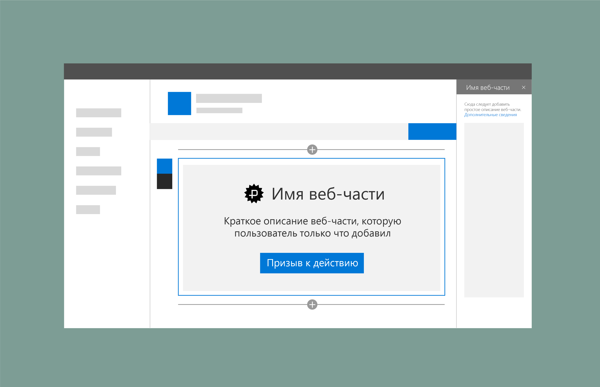

# Заполнители и резервные элементы в веб-частях SharePointPlaceholders and fallbacks in SharePoint web parts

В веб-части SharePoint можно добавлять заполнители, которые могут использоваться как резервные элементы, если не удается загрузить контент или данные для веб-части.You can add placeholders to SharePoint web parts that can also be used as a fallback if an issue occurs loading content or data for a web part. Название и описание веб-части автоматически добавляются из метаданных веб-части.The web part name and description are automatically added from the metadata submitted with the web part. 

Вы можете добавить кнопку для возврата в состояние, позволяющее настроить веб-часть.You an add a button that  users can select to return to a state where they can configure the web part.

## См. такжеSee also

- [Разработка прекрасных решений для SharePointDesigning great SharePoint experiences](design-guidance-overview.md)