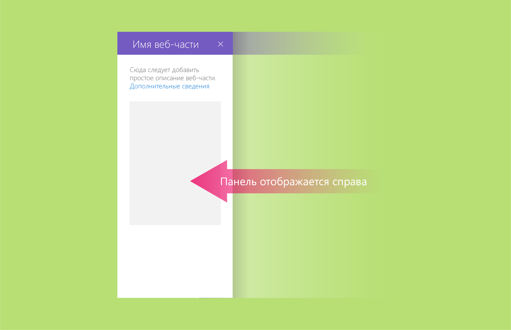
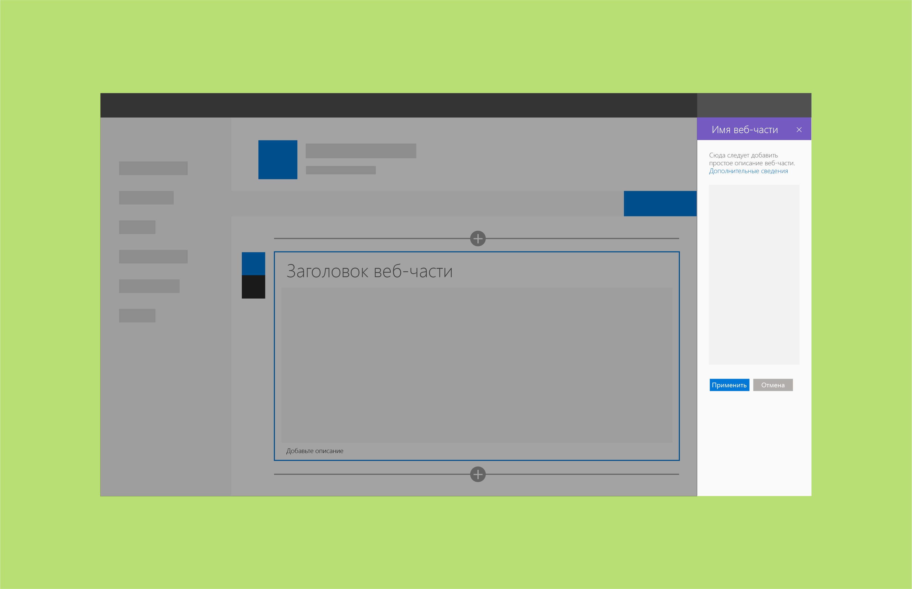
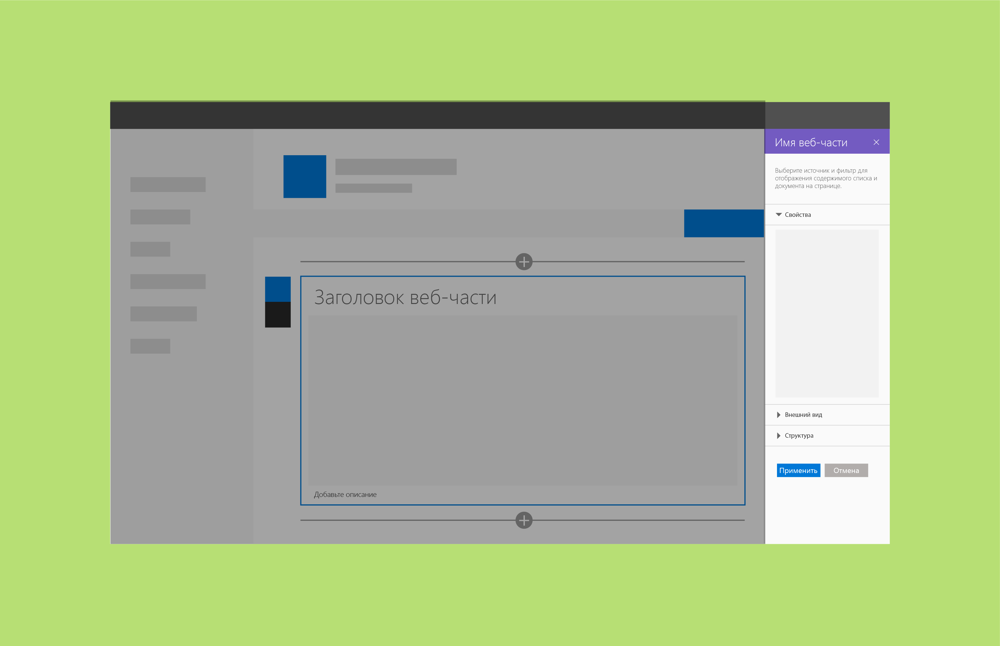
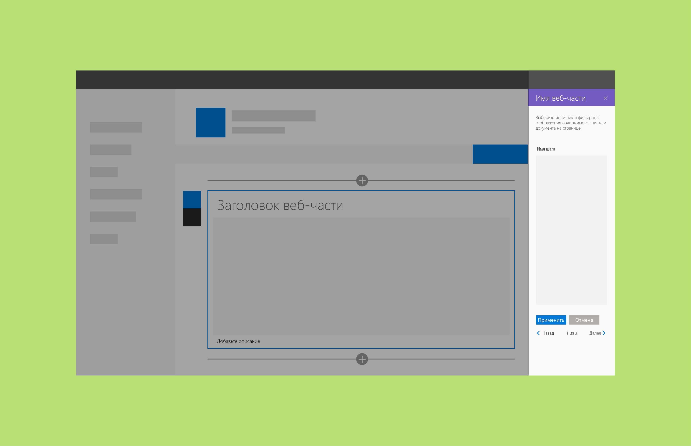

# Реактивные и нереактивные веб-части SharePoint

Реактивные веб-части работают только на стороне клиента. Нереактивные веб-части содержат элементы, для работы которых необходим сервер. Рекомендуем создавать реактивные веб-части SharePoint, так как они больше соответствуют модели пользовательского интерфейса и принципам WYSIWYG для разработки. Однако в некоторых случаях создавать реактивные веб-части может быть невозможно или невыгодно.

## Реактивные веб-части

Реактивные веб-части полностью размещаются на стороне клиента. Это означает, что каждый компонент, настроенный в области свойств, будет отражать изменения, внесенные в веб-части на странице. Например, в веб-части "Список дел" при снятии флажка "Выполненные задачи" скрывается соответствующее представление в веб-части.

## Нереактивные веб-части
Нереактивные веб-части работают не только на стороне клиента. Как правило, одному или нескольким свойствам требуется выполнить вызов, чтобы задать, получить или сохранить данные на сервере. Для нереактивных веб-частей следует включить кнопку **Применить** в нижней части области свойств.

Вы также можете назначить кнопке **Применить** более конкретное действие. <!-- Is this a reference to an image? (design-wp-pp-non-reactive.png) -->

В приведенных ниже примерах показаны нереактивные веб-части в контексте [трех структур областей свойств](design-a-web-part.md).

**Пример одиночной области**

**Пример групп элементов "аккордеон"**

**Пример области с пошаговым представлением**

