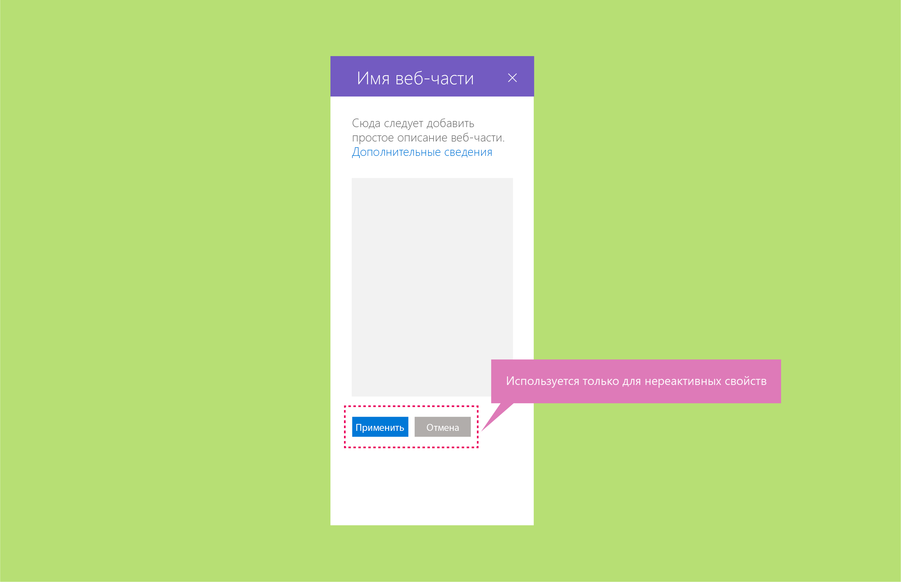

# Реактивные и нереактивные веб-части SharePointReactive and nonreactive SharePoint web parts

Реактивные веб-части работают только на стороне клиента. Нереактивные веб-части содержат элементы, для работы которых необходим сервер.Reactive web parts are client-side only; nonreactive web parts have elements that require a server to operate. Рекомендуем создавать реактивные веб-части SharePoint, так как они больше соответствуют модели пользовательского интерфейса и принципам WYSIWYG для разработки.We recommend that you build your SharePoint web parts to be reactive, because that best fits the UX model and WYSIWYG principles for authoring. Однако в некоторых случаях создавать реактивные веб-части может быть невозможно или невыгодно.However, it might not be possible or cost-effective in all cases to build reactive web parts.

## Реактивные веб-частиReactive vs non-reactive web parts

Реактивные веб-части полностью размещаются на стороне клиента.Reactive web parts are fully client-side web parts. Это означает, что каждый компонент, настроенный в области свойств, будет отражать изменения, внесенные в веб-части на странице.This means that each component configured in the property pane will reflect the change made within the web part on the page. Например, в веб-части "Список дел" при снятии флажка "Выполненные задачи" скрывается соответствующее представление в веб-части.For example, for the To-Do List web part, unchecking “Completed Tasks” will hide this view in the web part.

## Нереактивные веб-частиNonreactive web parts
Нереактивные веб-части работают не только на стороне клиента. Как правило, одному или нескольким свойствам требуется выполнить вызов, чтобы задать, получить или сохранить данные на сервере.Non-reactive web parts are not fully client side and generally one or more properties need to make a call to set/pull or store data on a server. In this case, you should enable the Apply and Cancel buttons at the bottom of the properties pane. Для нереактивных веб-частей следует включить кнопку **Применить** в нижней части области свойств.For nonreactive web parts, you should enable the **Apply** button at the bottom of the property pane.

Вы также можете назначить кнопке **Применить** более конкретное действие.You can also customize the **Apply** button to be a more specific action. <!-- Is this a reference to an image? (design-wp-pp-non-reactive.png) -->

В приведенных ниже примерах показаны нереактивные веб-части в контексте [трех структур областей свойств](design-a-web-part.md).The following examples show nonreactive web parts in the context of the [three property pane structures](design-a-web-part.md).

**Пример одиночной области****Single pane example**

**Пример групп элементов "аккордеон"****Accordion groups example**

**Пример области с пошаговым представлением****Steps pane example**

