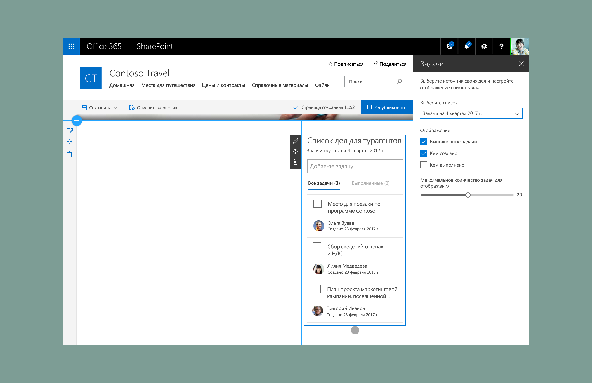

# Демонстрация оформления веб-части SharePoint: создание области свойств со списком дел

В этой статье описано создание веб-части со списком дел. В этом примере используется одиночная [область свойств](design-a-web-part.md). Это [реактивная](reactive-and-nonreactive-web-parts.md) веб-часть, основанная на адаптивной сетке [Office UI Fabric](https://dev.office.com/fabric#/).

1. Добавьте описание, чтобы пользователи могли узнать больше о веб-части и ее свойствах.

    В этом примере задано описание "Выберите источник своих дел и настройте отображение списка задач".
    
    

2. Добавьте [компонент раскрывающегося списка](http://dev.office.com/fabric#/components/dropdown) Fabric, подключенный к списку.

    

3. Добавьте [компонент флажка](http://dev.office.com/fabric#/components/checkbox) Fabric для отображения выполненных задач.

    

4. Добавьте еще два флажка для управления параметрами отображения.

    

5. Добавьте [ползунок](http://dev.office.com/fabric#/components/slider) Fabric для отображения максимального количества элементов.

    

6. Затем автор страницы выбирает список или вручную добавляет задачи для предварительного заполнения списка дел в веб-части.

      

7. В веб-части отображается индикатор загрузки элементов на страницу.

    

8. Загружаются элементы из списка.

    

    После загрузки новые задачи плавно появляются с использованием компонентов анимации из Office UI Fabric.

    

9. Область свойств управляет пользовательским интерфейсом. Задачи с включенными сводками отображаются с помощью флажков отображения в области свойств. 

    

## Адаптивные представления

В приведенном ниже примере показано представление с 2 из 3 столбцов в веб-части.

В приведенном ниже примере показано представление с 1 из 3 столбцов в веб-части.

В приведенном ниже примере показано мобильное (доступное только для чтения) представление веб-части.

