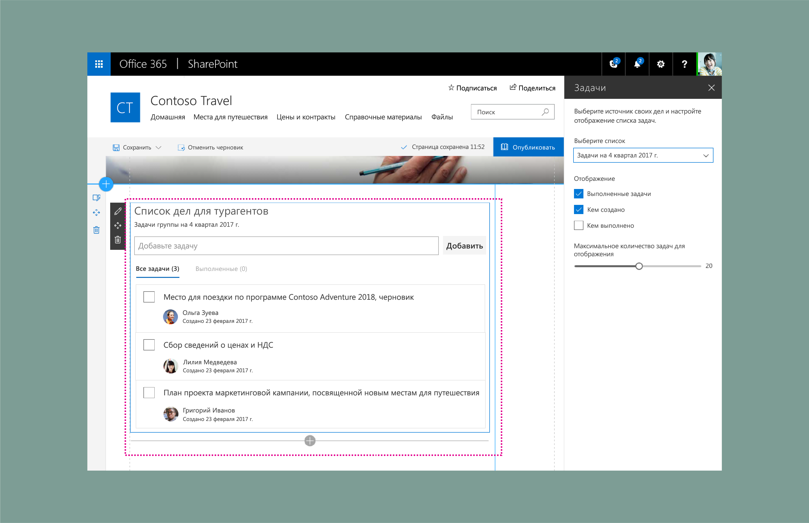

# Демонстрация дизайна веб-части SharePoint: создание области свойств со списком дел

В этой статье описано создание веб-части со списком дел. В этом примере используется [одиночная область свойств](design-a-web-part.md). Это [реактивная](reactive-and-nonreactive-web-parts.md) веб-часть, основанная на адаптивной сетке [Office UI Fabric](https://developer.microsoft.com/ru-RU/fabric).

## Создание веб-части "Список дел"

1. Добавьте описание, чтобы пользователи могли узнать больше о веб-части и ее свойствах.

    В этом примере задано описание "Выберите источник своих дел и настройте отображение списка задач".
    
    

     

2. Добавьте [компонент раскрывающегося списка](https://developer.microsoft.com/ru-RU/fabric#/components/dropdown) Fabric, подключенный к списку.

    

     

3. Добавьте [компонент флажка](https://developer.microsoft.com/ru-RU/fabric#/components/checkbox) Fabric для отображения выполненных задач.

    

     

4. Добавьте еще два флажка для управления параметрами отображения.

    

     

5. Добавьте [ползунок](https://developer.microsoft.com/ru-RU/fabric#/components/slider) Fabric для отображения максимального количества элементов.

    

     

6. После этого автор страницы выбирает список или вручную добавляет задачи для предварительного заполнения веб-части "Список дел".

    

     

    

     

    

     

7. Веб-часть показывает индикатор загрузки элементов на страницу.

    

     

8. Загружаются элементы из списка.

    

     

    После загрузки новые задачи плавно появляются на экране. Для этого используются компоненты анимации из Office UI Fabric.

    

     

9. Область свойств управляет пользовательским интерфейсом. Задачи с включенными сводками отображаются с помощью флажков отображения в области свойств. 

    

     

## Адаптивные представления

В приведенном ниже примере показано представление с 2 из 3 столбцов в веб-части.

 

В приведенном ниже примере показано представление с 1 из 3 столбцов в веб-части.

 

В приведенном ниже примере показано мобильное (доступное только для чтения) представление веб-части.

 

## См. также

- [Разработка прекрасных решений для SharePoint](design-guidance-overview.md)