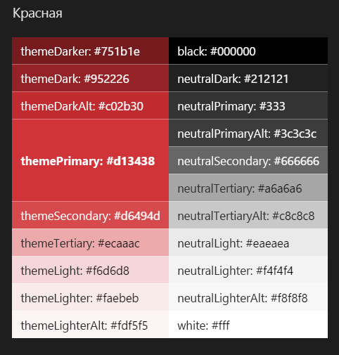
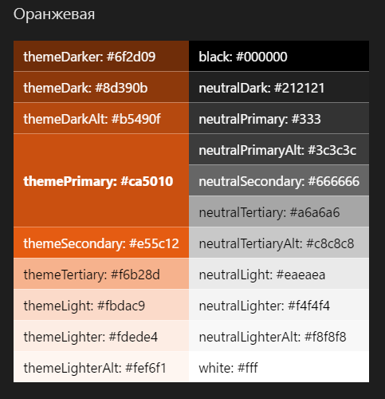
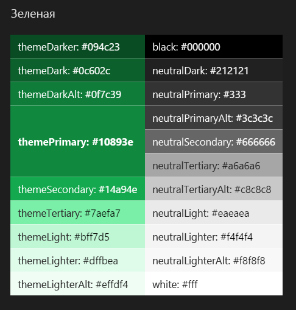
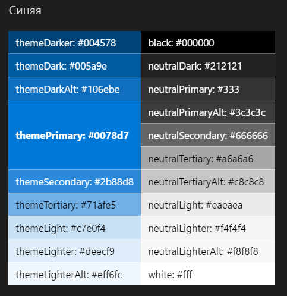
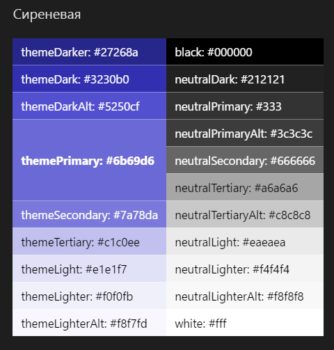
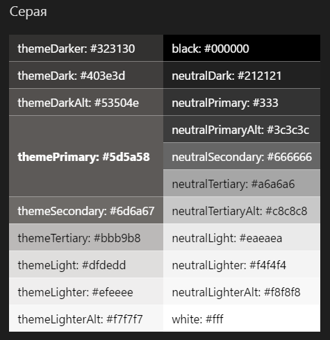

# Темы и цвета в SharePointSharePoint themes and colors

Как и палитра торговой марки Microsoft, темы SharePoint основаны на фирменном стиле Майкрософт, но в то же время обеспечивают гибкость, позволяющую поддерживать ваши отношения с клиентами без лишних ограничений.Like the Microsoft brand palette, the SharePoint themes are designed to build on the Microsoft brand, while at the same time allow for flexibility to enliven our partnerships without dominating them. Они раскрывают общие цели и особенности, а также отражают многообразие и возможности оптимизации среды SharePoint.They reveal our shared goals and personality and reflect our diversity and ability to optimize the SharePoint experience.

 

## ТемыThemes

Приведенные ниже принципы дизайна легли в основу текущих тем и цветовой палитры SharePoint.The following design principles helped form the current SharePoint themes and color palette.

**Управляемые**.**Guided** Наша система управления темами работает на глобальном уровне, поэтому пользователи могут вносить одинаковые изменения на разных сайтах, без проблем оптимизируя их.Our theming system works at a global level so that updates can be made consistently across each site, allowing users to optimize their websites effortlessly. Наша система настройки темы работает в управляемой среде, что ускоряет оптимизацию успешных результатов.Our theming system operates in a controlled environment so that successful outcomes can be optimized quickly.

**Продуманные и эффективные**.**Smart and efficient** Наша система настройки темы ускоряет создание сайтов, используя интеллектуальные алгоритмы для подбора наиболее привлекательных вариантов.Our theming system expedites the site creation process by using smart algorithms to generate options that maximize aesthetic choices.

**Профессиональные**.**Professional** Наши темы имеют профессиональный внешний вид, который гарантирует целостность и передает индивидуальность наших корпоративных клиентов.Our themes embody a professional look and feel that ensures coherency and conveys the brand of our enterprise audiences.

**Доступные**.**Accessible** Встроенное средство проверки читаемости обеспечивает универсальный дизайн на всех уровнях стандартных тем.Our built-in accessibility checker ensures universal design at all levels of default themes. Для пользователей, предпочитающих настраивать темы, мы предоставляем полезные рекомендации по созданию доступного оформления.For users who decide to customize, we provide helpful guidelines to design for accessibility.

## ЦветаColors

Цветовая палитра SharePoint оптимизирована для различных экранов и устройств, а также обеспечивает достаточную гибкость, позволяющую вам учитывать свой фирменный стиль.The SharePoint color palette has been optimized for screens and devices, and to provide enough flexibility to ensure continuity with your brand. Цвета, предоставленные средой SharePoint, также гарантируют доступность и удобочитаемость.The SharePoint-provided colors also guarantee accessible and legible experiences.

### КраснаяRed

 

<table>
<tr>
<td style="color:white; background-color:#751b1e">themeDarker: #751b1ethemeDarker: #751b1e</td>
<td style="color:white; background-color:#000000">black: #000000black: #000000</td>
</tr>
<tr>
<td style="color:white; background-color:#952226">themeDark: #952226themeDark: #952226</td>
<td style="color:white; background-color:#212121">neutralDark: #212121neutralDark: #212121</td>
</tr>
<tr>
<td style="color:white; background-color:#c02b30">themeDarkAlt: #c02b30themeDarkAlt: #c02b30</td>
<td style="color:white; background-color:#333">neutralPrimary: #333neutralPrimary: #333</td>
</tr>
<tr>
<td rowspan="3" style="font-weight:bold; vertical-align:middle; color:white; background-color:#d13438">themePrimary: #d13438themePrimary: #d13438</td>
<td style="color:white; background-color:#3c3c3c">neutralPrimaryAlt: #3c3c3cneutralPrimaryAlt: #3c3c3c</td>
</tr>
<tr>
<td style="color:white; background-color:#666666">neutralSecondary: #666666neutralSecondary: #666666</td>
</tr>
<tr>
<td style="color:black; background-color:#a6a6a6">neutralTertiary: #a6a6a6neutralTertiary: #a6a6a6</td>
</tr>
<tr>
<td style="color:white; background-color:#d6494d">themeSecondary: #d6494dthemeSecondary: #d6494d</td>
<td style="color:black; background-color:#c8c8c8">neutralTertiaryAlt: #c8c8c8neutralTertiaryAlt: #c8c8c8</td>
</tr>
<tr>
<td style="color:black; background-color:#ecaaac">themeTertiary: #ecaaacthemeTertiary: #ecaaac</td>
<td style="color:black; background-color:#eaeaea">neutralLight: #eaeaeaneutralLight: #eaeaea</td>
</tr>
<tr>
<td style="color:black; background-color:#f6d6d8">themeLight: #f6d6d8themeLight: #f6d6d8</td>
<td style="color:black; background-color:#f4f4f4">neutralLighter: #f4f4f4neutralLighter: #f4f4f4</td></tr>
<tr>
<td style="color:black; background-color:#faebeb">themeLighter: #faebebthemeLighter: #faebeb</td>
<td style="color:black; background-color:#f8f8f8">neutralLighterAlt: #f8f8f8neutralLighterAlt: #f8f8f8</td>
</tr>
<tr>
<td style="color:black; background-color:#fdf5f5">themeLighterAlt: #fdf5f5themeLighterAlt: #fdf5f5</td>
<td style="color:black; background-color:#fff">white: #fffwhite: #fff</td>
</tr>
</table>

 

### ОранжеваяOrange

 

<table>
<tr>
<td style="color:white; background-color:#6f2d09">themeDarker: #6f2d09themeDarker: #6f2d09</td>
<td style="color:white; background-color:#000000">black: #000000black: #000000</td>
</tr>
<tr>
<td style="color:white; background-color:#8d390b">themeDark: #8d390bthemeDark: #8d390b</td>
<td style="color:white; background-color:#212121">neutralDark: #212121neutralDark: #212121</td>
</tr>
<tr>
<td style="color:white; background-color:#b5490f">themeDarkAlt: #b5490fthemeDarkAlt: #b5490f</td>
<td style="color:white; background-color:#333">neutralPrimary: #333neutralPrimary: #333</td>
</tr>
<tr>
<td rowspan="3" style="font-weight:bold; vertical-align:middle; color:white; background-color:#ca5010">themePrimary: #ca5010themePrimary: #ca5010</td>
<td style="color:white; background-color:#3c3c3c">neutralPrimaryAlt: #3c3c3cneutralPrimaryAlt: #3c3c3c</td>
</tr>
<tr>
<td style="color:white; background-color:#666666">neutralSecondary: #666666neutralSecondary: #666666</td>
</tr>
<tr>
<td style="color:black; background-color:#a6a6a6">neutralTertiary: #a6a6a6neutralTertiary: #a6a6a6</td>
</tr>
<tr>
<td style="color:white; background-color:#e55c12">themeSecondary: #e55c12themeSecondary: #e55c12</td>
<td style="color:black; background-color:#c8c8c8">neutralTertiaryAlt: #c8c8c8neutralTertiaryAlt: #c8c8c8</td>
</tr>
<tr>
<td style="color:black; background-color:#f6b28d">themeTertiary: #f6b28dthemeTertiary: #f6b28d</td>
<td style="color:black; background-color:#eaeaea">neutralLight: #eaeaeaneutralLight: #eaeaea</td>
</tr>
<tr>
<td style="color:black; background-color:#fbdac9">themeLight: #fbdac9themeLight: #fbdac9</td>
<td style="color:black; background-color:#f4f4f4">neutralLighter: #f4f4f4neutralLighter: #f4f4f4</td>
</tr>
<tr>
<td style="color:black; background-color:#fdede4">themeLighter: #fdede4themeLighter: #fdede4</td>
<td style="color:black; background-color:#f8f8f8">neutralLighterAlt: #f8f8f8neutralLighterAlt: #f8f8f8</td>
</tr>
<tr>
<td style="color:black; background-color:#fef6f1">themeLighterAlt: #fef6f1themeLighterAlt: #fef6f1</td>
<td style="color:black; background-color:#fff">white: #fffwhite: #fff</td>
</tr>
</table>

 

### ЗеленаяGreen

 

<table>
<tr>
<td style="color:white; background-color:#094c23">themeDarker: #094c23themeDarker: #094c23</td>
<td style="color:white; background-color:#000000">black: #000000black: #000000</td>
</tr>
<tr>
<td style="color:white; background-color:#0c602c">themeDark: #0c602cthemeDark: #0c602c</td>
<td style="color:white; background-color:#212121">neutralDark: #212121neutralDark: #212121</td>
</tr>
<tr>
<td style="color:white; background-color:#0f7c39">themeDarkAlt: #0f7c39themeDarkAlt: #0f7c39</td>
<td style="color:white; background-color:#333">neutralPrimary: #333neutralPrimary: #333</td>
</tr>
<tr>
<td rowspan="3" style="font-weight:bold; vertical-align:middle; color:white; background-color:#10893e">themePrimary: #10893ethemePrimary: #10893e</td>
<td style="color:white; background-color:#3c3c3c">neutralPrimaryAlt: #3c3c3cneutralPrimaryAlt: #3c3c3c</td>
</tr>
<tr>
<td style="color:white; background-color:#666666">neutralSecondary: #666666neutralSecondary: #666666</td>
</tr>
<tr>
<td style="color:black; background-color:#a6a6a6">neutralTertiary: #a6a6a6neutralTertiary: #a6a6a6</td>
</tr>
<tr>
<td style="color:white; background-color:#14a94e">themeSecondary: #14a94ethemeSecondary: #14a94e</td>
<td style="color:black; background-color:#c8c8c8">neutralTertiaryAlt: #c8c8c8neutralTertiaryAlt: #c8c8c8</td>
</tr>
<tr>
<td style="color:black; background-color:#7aefa7">themeTertiary: #7aefa7themeTertiary: #7aefa7</td>
<td style="color:black; background-color:#eaeaea">neutralLight: #eaeaeaneutralLight: #eaeaea</td>
</tr>
<tr>
<td style="color:black; background-color:#bff7d5">themeLight: #bff7d5themeLight: #bff7d5</td>
<td style="color:black; background-color:#f4f4f4">neutralLighter: #f4f4f4neutralLighter: #f4f4f4</td>
</tr>
<tr>
<td style="color:black; background-color:#dffbea">themeLighter: #dffbeathemeLighter: #dffbea</td>
<td style="color:black; background-color:#f8f8f8">neutralLighterAlt: #f8f8f8neutralLighterAlt: #f8f8f8</td>
</tr>
<tr>
<td style="color:black; background-color:#effdf4">themeLighterAlt: #effdf4themeLighterAlt: #effdf4</td>
<td style="color:black; background-color:#fff">white: #fffwhite: #fff</td>
</tr>
</table>

 

### СиняяBlue

 

<table>
<tr>
<td style="color:white; background-color:#004578">themeDarker: #004578themeDarker: #004578</td>
<td style="color:white; background-color:#000000">black: #000000black: #000000</td>
</tr>
<tr>
<td style="color:white; background-color:#005a9e">themeDark: #005a9ethemeDark: #005a9e</td>
<td style="color:white; background-color:#212121">neutralDark: #212121neutralDark: #212121</td>
</tr>
<tr>
<td style="color:white; background-color:#106ebe">themeDarkAlt: #106ebethemeDarkAlt: #106ebe</td>
<td style="color:white; background-color:#333">neutralPrimary: #333neutralPrimary: #333</td>
</tr>
<tr>
<td rowspan="3" style="font-weight:bold; vertical-align:middle; color:white; background-color:#0078d7">themePrimary: #0078d7themePrimary: #0078d7</td>
<td style="color:white; background-color:#3c3c3c">neutralPrimaryAlt: #3c3c3cneutralPrimaryAlt: #3c3c3c</td>
</tr>
<tr>
<td style="color:white; background-color:#666666">neutralSecondary: #666666neutralSecondary: #666666</td>
</tr>
<tr>
<td style="color:black; background-color:#a6a6a6">neutralTertiary: #a6a6a6neutralTertiary: #a6a6a6</td>
</tr>
<tr>
<td style="color:white; background-color:#2b88d8">themeSecondary: #2b88d8themeSecondary: #2b88d8</td>
<td style="color:black; background-color:#c8c8c8">neutralTertiaryAlt: #c8c8c8neutralTertiaryAlt: #c8c8c8</td>
</tr>
<tr>
<td style="color:black; background-color:#71afe5">themeTertiary: #71afe5themeTertiary: #71afe5</td>
<td style="color:black; background-color:#eaeaea">neutralLight: #eaeaeaneutralLight: #eaeaea</td>
</tr>
<tr>
<td style="color:black; background-color:#c7e0f4">themeLight: #c7e0f4themeLight: #c7e0f4</td>
<td style="color:black; background-color:#f4f4f4">neutralLighter: #f4f4f4neutralLighter: #f4f4f4</td>
</tr>
<tr>
<td style="color:black; background-color:#deecf9">themeLighter: #deecf9themeLighter: #deecf9</td>
<td style="color:black; background-color:#f8f8f8">neutralLighterAlt: #f8f8f8neutralLighterAlt: #f8f8f8</td>
</tr>
<tr>
<td style="color:black; background-color:#eff6fc">themeLighterAlt: #eff6fcthemeLighterAlt: #eff6fc</td>
<td style="color:black; background-color:#fff">white: #fffwhite: #fff</td>
</tr>
</table>

 

### СиреневаяPurple

 

<table>
<tr>
<td style="color:white; background-color:#27268a">themeDarker: #27268athemeDarker: #27268a</td>
<td style="color:white; background-color:#000000">black: #000000black: #000000</td>
</tr>
<tr>
<td style="color:white; background-color:#3230b0">themeDark: #3230b0themeDark: #3230b0</td>
<td style="color:white; background-color:#212121">neutralDark: #212121neutralDark: #212121</td>
</tr>
<tr>
<td style="color:white; background-color:#5250cf">themeDarkAlt: #5250cfthemeDarkAlt: #5250cf</td>
<td style="color:white; background-color:#333">neutralPrimary: #333neutralPrimary: #333</td>
</tr>
<tr>
<td rowspan="3" style="font-weight:bold; vertical-align:middle; color:white; background-color:#6b69d6">themePrimary: #6b69d6themePrimary: #6b69d6</td>
<td style="color:white; background-color:#3c3c3c">neutralPrimaryAlt: #3c3c3cneutralPrimaryAlt: #3c3c3c</td>
</tr>
<tr>
<td style="color:white; background-color:#666666">neutralSecondary: #666666neutralSecondary: #666666</td>
</tr>
<tr>
<td style="color:black; background-color:#a6a6a6">neutralTertiary: #a6a6a6neutralTertiary: #a6a6a6</td>
</tr>
<tr>
<td style="color:white; background-color:#7a78da">themeSecondary: #7a78dathemeSecondary: #7a78da</td>
<td style="color:black; background-color:#c8c8c8">neutralTertiaryAlt: #c8c8c8neutralTertiaryAlt: #c8c8c8</td>
</tr>
<tr>
<td style="color:black; background-color:#c1c0ee">themeTertiary: #c1c0eethemeTertiary: #c1c0ee</td>
<td style="color:black; background-color:#eaeaea">neutralLight: #eaeaeaneutralLight: #eaeaea</td>
</tr>
<tr>
<td style="color:black; background-color:#e1e1f7">themeLight: #e1e1f7themeLight: #e1e1f7</td>
<td style="color:black; background-color:#f4f4f4">neutralLighter: #f4f4f4neutralLighter: #f4f4f4</td>
</tr>
<tr>
<td style="color:black; background-color:#f0f0fb">themeLighter: #f0f0fbthemeLighter: #f0f0fb</td>
<td style="color:black; background-color:#f8f8f8">neutralLighterAlt: #f8f8f8neutralLighterAlt: #f8f8f8</td>
</tr>
<tr>
<td style="color:black; background-color:#f8f7fd">themeLighterAlt: #f8f7fdthemeLighterAlt: #f8f7fd</td>
<td style="color:black; background-color:#fff">white: #fffwhite: #fff</td>
</tr>
</table>

 

### СераяGray

 

<table>
<tr>
<td style="color:white; background-color:#323130">themeDarker: #323130themeDarker: #323130</td>
<td style="color:white; background-color:#000000">black: #000000black: #000000</td>
</tr>
<tr>
<td style="color:white; background-color:#403e3d">themeDark: #403e3dthemeDark: #403e3d</td>
<td style="color:white; background-color:#212121">neutralDark: #212121neutralDark: #212121</td>
</tr>
<tr>
<td style="color:white; background-color:#53504e">themeDarkAlt: #53504ethemeDarkAlt: #53504e</td>
<td style="color:white; background-color:#333">neutralPrimary: #333neutralPrimary: #333</td>
</tr>
<tr>
<td rowspan="3" style="font-weight:bold; vertical-align:middle; color:white; background-color:#5d5a58">themePrimary: #5d5a58themePrimary: #5d5a58</td>
<td style="color:white; background-color:#3c3c3c">neutralPrimaryAlt: #3c3c3cneutralPrimaryAlt: #3c3c3c</td>
</tr>
<tr>
<td style="color:white; background-color:#666666">neutralSecondary: #666666neutralSecondary: #666666</td>
</tr>
<tr>
<td style="color:black; background-color:#a6a6a6">neutralTertiary: #a6a6a6neutralTertiary: #a6a6a6</td>
</tr>
<tr>
<td style="color:white; background-color:#6d6a67">themeSecondary: #6d6a67themeSecondary: #6d6a67</td>
<td style="color:black; background-color:#c8c8c8">neutralTertiaryAlt: #c8c8c8neutralTertiaryAlt: #c8c8c8</td>
</tr>
<tr>
<td style="color:black; background-color:#bbb9b8">themeTertiary: #bbb9b8themeTertiary: #bbb9b8</td>
<td style="color:black; background-color:#eaeaea">neutralLight: #eaeaeaneutralLight: #eaeaea</td>
</tr>
<tr>
<td style="color:black; background-color:#dfdedd">themeLight: #dfdeddthemeLight: #dfdedd</td>
<td style="color:black; background-color:#f4f4f4">neutralLighter: #f4f4f4neutralLighter: #f4f4f4</td>
</tr>
<tr>
<td style="color:black; background-color:#efeeee">themeLighter: #efeeeethemeLighter: #efeeee</td>
<td style="color:black; background-color:#f8f8f8">neutralLighterAlt: #f8f8f8neutralLighterAlt: #f8f8f8</td>
</tr>
<tr>
<td style="color:black; background-color:#f7f7f7">themeLighterAlt: #f7f7f7themeLighterAlt: #f7f7f7</td>
<td style="color:black; background-color:#fff">white: #fffwhite: #fff</td>
</tr>
</table>

 

## См. такжеSee also

- [Специальные возможностиAccessibility](accessibility.md)
- [Принципы дизайна SharePointDesigning great SharePoint experiences](design-guidance-overview.md)
