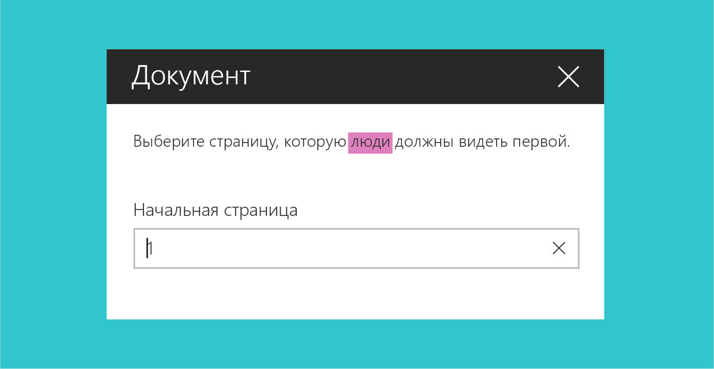

# Рекомендации по составлению текста пользовательского интерфейса для веб-частей SharePoint
 
Один из аспектов создания эффективных веб-частей в SharePoint — использование простого, понятного и краткого текста в пользовательском интерфейсе. Если вы добавили простой и понятный текст, пользователи смогут быстро выполнять навигацию по интерфейсу и находить интересующее их содержимое. В этой статье представлены рекомендации по написанию текста пользовательского интерфейса для ключевых областей веб-частей SharePoint.

## Написание прописными буквами

Используйте регистр предложений (первая буква первого слова — прописная, а остальные буквы — строчные) для всех элементов пользовательского интерфейса, включая кнопки, заголовки и метки элементов управления. 

Всегда начинайте с прописной буквы следующее:

- Первое слово нового предложения.
- Слово после точки в названии или заголовке. Пример: "Этап 1. Указание сведений об учетной записи".
- Имена собственные, например имена людей, названия городов и т. д. 
 

## Знаки препинания

Соблюдайте основные правила пунктуации во избежание грамматических ошибок в интерфейсе. В приведенной ниже таблице представлены рекомендации и напоминания о том, какие знаки препинания следует использовать и почему.

| Знаки препинания  | Рекомендации                                                                                                                                                       | Пример                                                                                                        |
|--------------|----------------------------------------------------------------------------------------------------------------------------------------------------------------|----------------------------------------------------------------------------------------------------------------|
| Двоеточие (:)   | Ставьте двоеточия в начале списка в описании веб-части. Не используйте их в метках пользовательского интерфейса.                                                           | Выберите один из следующих разделов: "Коты", "Собаки", "Кенгуру".                                                                 |
| Запятая (,)   | Ставьте серии запятых при перечислении.                                                                                                           | Мне нравятся коты, птицы, собаки.                                                                                  |
| Многоточие (…) | Используйте многоточие для сокращения и в строках индикаторов хода выполнения. Не ставьте многоточия, чтобы показать, что пользователю нужно сделать выбор.          | Сокращение: "Автор последнего изменения: Артем Кузн…" Индикатор хода выполнения: "Отправка…"                                       |
| Точка (.)  | Не ставьте точки в конце названий, заголовков и меток. Не используйте точки для элементов в переключателях и флажков. В описаниях используйте точки обычным образом. | Выберите содержимое, которое требуется выделить, и его внешний вид. Используйте фильтр при выборе. |

## Стиль речи

Чтобы обеспечить тесное и долгосрочное сотрудничество со своей аудиторией, важно подобрать правильный стиль общения. Старайтесь использовать понятную, приветливую и непринужденную речь. Стиль общения с аудиторией влияет на то, как пользователи будут работать с сайтом и содержимым, а также на то, какую пользу они извлекут из этого.

**Рекомендуется:**

- Использовать непринужденный, разговорный тон в пользовательском интерфейсе. 
- Использовать краткие формы. Например, пишите "чтобы" вместо "для того чтобы".
- Прочитать текст пользовательского интерфейса вслух, чтобы оценить стиль. Это похоже на повседневное общение?
- Использовать простые слова. 
- Избегать технических подробностей, если они не имеют отношения к взаимодействию с пользователем. 
- Использовать слово "пожалуйста", только если веб-часть создает неудобства для пользователя. Не злоупотребляйте этим словом.
- Использовать фразы "приносим извинения" и "к сожалению" только в сообщениях об ошибках SharePoint, которые создают для пользователя серьезные проблемы. 

**Не рекомендуется:**

- Загромождать текст пользовательского интерфейса излишними повторениями. Каждое слово должно быть осмысленным. 

## Местоимения

По возможности избегайте местоимений в элементах пользовательского интерфейса. Если мысль можно так же хорошо выразить без местоимений, не используйте их.

Если дизайн подразумевает использование местоимений, следуйте приведенным ниже рекомендациям по их правильному использованию.

**Рекомендуется:**

- Использовать второе лицо ("вы" или "ваше"), когда вы представляете что-то, принадлежащее пользователю. Примеры: "ваши черновики" или "ваши изображения".
- Использовать первое лицо ("я" или "мое") в пользовательском интерфейсе, где пользователь дает указания службе. Пример: "Сообщать мне, когда кто-то отвечает на мою запись".
- По возможности избегать некрасивых конструкций, таких как "он/она" или "его/ее". В идеале предложение должно быть полностью нейтральным.
- Избегать местоимения "им". Вместо этого используйте такие слова, как "кто-то" или "люди". Пример: "Введите имя пользователя и домен, чтобы предоставить другому человеку разрешение на использование этого компьютера".

**Не рекомендуется:**

- Использовать отсылки в третьем лице, так как они звучат отстраненно. Вместо фразы "Пользователи могут менять структуру" используйте фразу "Вы можете менять структуру".

## Сообщения об ошибках

Ошибки могут возникать в любой программе или службе. Сообщения об ошибках могут влиять на общую удовлетворенность пользователя продуктом. Хорошее сообщение об ошибке должно:

- ясно передавать суть и причину проблемы;
- содержать рекомендации по обходному решению или устранению проблемы;
- иметь сочувственный тон.

<!-- You might need to explain how to show empathy in an error message, without using "sorry". -->

Ниже представлен пример сообщения об ошибке, возникающей, когда пользователь пытается изменить страницу, полученную для изменения другим пользователем.

| В данный момент редактирование невозможно                                                |
|-------------------------------------------------------------------------|
| Другой пользователь уже редактирует эту страницу. Повторите попытку через несколько минут. |

## Ссылки на справочные статьи

Постарайтесь продуманно разместить ссылки на справочные статьи. Подумайте, в каких случаях пользователю может потребоваться помощь, и вставьте ссылку на справочную статью рядом с соответствующим элементом управления. Ниже указаны некоторые ключевые факторы, о которых следует помнить при размещении ссылок на справочные статьи в пользовательском интерфейсе.

**Рекомендуется:**

- Указывать в продукте конкретные ссылки на справку. Целевая статья должна быть подходящей. Когда пользователь открывает статью, он должен иметь возможность найти нужные сведения. 
- Использовать естественный язык для гиперссылок.  

<!-- You might want to provide an example of "natural" language. -->

**Не рекомендуется:**

- Помещать ссылку на справочную статью рядом с каждым элементом пользовательского интерфейса. Это создает много визуальных помех.
- Включать несколько ссылок, указывающих на одно и то же расположение, в один интерфейс.
- Использовать фразу "щелкните здесь" в тексте гиперссылки. 

## Текст подсказок

Текст подсказки, или "призрачный" текст, — это текстовый элемент, отображаемый в элементе управления (как правило, текстовом поле), чтобы помочь пользователю взаимодействовать с пользовательским интерфейсом. Текст подсказки сообщает, какие сведения должен указать пользователь. Например, в нем могут упоминаться ограничения для полей или приводиться примеры.

**Рекомендуется:**

- Использовать текст подсказок умеренно и только в тех случаях, когда это поможет пользователю. Не для всех элементов пользовательского интерфейса требуется текст подсказки. Для некоторых сложных полей текст подсказки может предоставить дополнительный контекст и внести ясность. Например, если у вас есть поле, в котором пользователь должен указать защищенный URL-адрес, то текст подсказки "https://www.example.com" может быть полезнее, чем **Введите здесь защищенный URL-адрес**.

**Не рекомендуется:**

- Повторять метку. Например, если у вас есть текстовое поле с меткой **Имя**, то текст подсказки **Введите имя** будет излишним и может запутать пользователя.

Приведенный ниже текст подсказки используется во внедряемой веб-части. Текстовое поле может принимать защищенный адрес веб-сайта или код внедрения объекта iframe. В тексте показаны оба варианта. 

