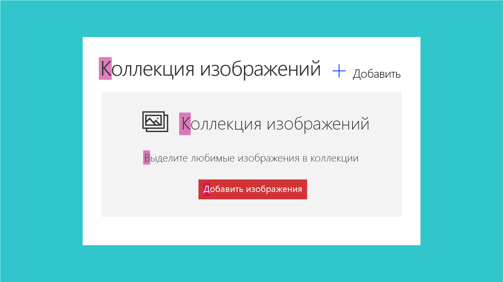
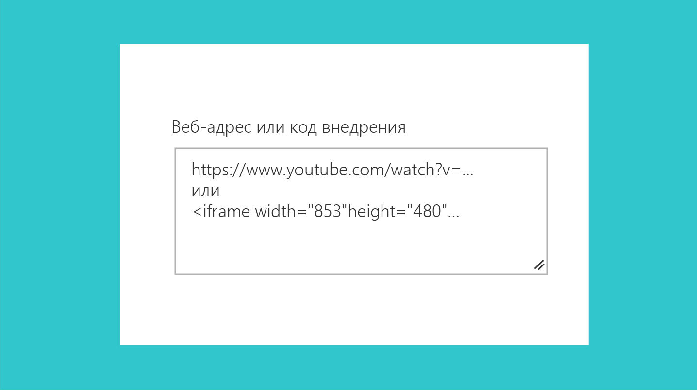

# Рекомендации по составлению текста пользовательского интерфейса для веб-частей SharePointUI text guidelines for SharePoint web parts
 
Один из аспектов создания эффективных веб-частей в SharePoint — использование простого, понятного и краткого текста в пользовательском интерфейсе.One aspect of creating effective web parts in SharePoint is to use simple, understandable, and concise UI text. Если вы добавили простой и понятный текст, пользователи смогут быстро выполнять навигацию по интерфейсу и находить интересующее их содержимое.By keeping your message clear and easy to understand, you ensure that customers move through your experiences quickly and can identify the content they are looking for. В этой статье представлены рекомендации по написанию текста пользовательского интерфейса для ключевых областей веб-частей SharePoint.This article provide guidance for writing UI text for key areas within SharePoint web parts.

## Написание прописными буквамиCapitalization

Используйте регистр предложений (первая буква первого слова — прописная, а остальные буквы — строчные) для всех элементов пользовательского интерфейса, включая кнопки, заголовки и метки элементов управления.Use sentence casing (first letter of first word is capitalized, the rest all lowercase) for all UI elements, including buttons, page titles, and control labels. 

Всегда начинайте с прописной буквы следующее:Always capitalize:

- Первое слово нового предложения.The first word of a new sentence.
- Слово после точки в названии или заголовке.The word following a colon in a title or heading. Пример: "Этап 1. Указание сведений об учетной записи".For example, "Step 1: Begin by entering your account information".
- Имена собственные, например имена людей, названия городов и т. д.Proper nouns, such as names of people, cities, and so on. 
 

## Знаки препинанияPunctuation

Соблюдайте основные правила пунктуации во избежание грамматических ошибок в интерфейсе.Follow the basic rules of punctuation to avoid grammatical errors in your experience. В приведенной ниже таблице представлены рекомендации и напоминания о том, какие знаки препинания следует использовать и почему.The following table provides guidance and reminders about what punctuation to use to use when, and why.

| Знаки препинанияPunctuation  | РекомендацииGuidance                                                                                                                                                       | ПримерExample                                                                                                        |
|--------------|----------------------------------------------------------------------------------------------------------------------------------------------------------------|----------------------------------------------------------------------------------------------------------------|
| Двоеточие (:)Colons (:)   | Ставьте двоеточия в начале списка в описании веб-части.Use colons if you are introducing a list in the web part description. Не используйте их в метках пользовательского интерфейса.Don't use colons in UI labels.                                                           | Выберите один из следующих разделов: "Коты", "Собаки", "Кенгуру".Choose one of the following: Cats, Dogs, Quokkas                                                                 |
| Запятая (,)Commas (,)   | Ставьте серии запятых при перечислении.Use serial commas (including before the word "and").                                                                                                           | Мне нравятся коты, птицы, собаки.I like cats, birds, and dogs.                                                                                  |
| Многоточие (…)Ellipses (…) | Используйте многоточие для сокращения и в строках индикаторов хода выполнения.Use ellipses to show truncation and for progress indicator strings. Не ставьте многоточия, чтобы показать, что пользователю нужно сделать выбор.Do not use ellipses to indicate that the user must make further choices.          | Сокращение: "Автор последнего изменения: Артем Кузн…"Truncation: Last modified by John Armstr… Индикатор хода выполнения: "Отправка…"Progress indicator: Uploading…                                       |
| Точка (.)Periods (.)  | Не ставьте точки в конце названий, заголовков и меток.Don't use periods in titles, headings, or labels. Не используйте точки для элементов в переключателях и флажков.Don't use periods for radio button options or checkboxes. В описаниях используйте точки обычным образом.Use periods as you normally would for descriptions. | Выберите содержимое, которое требуется выделить, и его внешний вид.Select the content you want to highlight and how you want it displayed. Используйте фильтр при выборе.Use a filter to narrow your selection. |

## Стиль речиVoice and tone

Чтобы обеспечить тесное и долгосрочное сотрудничество со своей аудиторией, важно подобрать правильный стиль общения.Crafting the right tone in your product communication is essential to building a strong, lasting relationship with your audience. Старайтесь использовать понятную, приветливую и непринужденную речь.Try to keep your words crisp and clear, warm and relaxed, and approachable. Стиль общения с аудиторией влияет на то, как пользователи будут работать с сайтом и содержимым, а также на то, какую пользу они извлекут из этого.How you talk to your audience influences how they will engage with your site and content, and how much value they will derive from it.

**Рекомендуется:****Do**

- Использовать непринужденный, разговорный тон в пользовательском интерфейсе.Use a casual, conversational tone in the UI. 
- Использовать краткие формы.Use contractions. Например, пишите "чтобы" вместо "для того чтобы".For example, use "can't" instead of "cannot".
- Прочитать текст пользовательского интерфейса вслух, чтобы оценить стиль.Read your UI text out loud to test the tone. Это похоже на повседневное общение?Does it sound like everyday language?
- Использовать простые слова.Use simple words. 
- Избегать технических подробностей, если они не имеют отношения к взаимодействию с пользователем.Remove technical details if they're not relevant to the user experience. 
- Использовать слово "пожалуйста", только если веб-часть создает неудобства для пользователя.Use "Please" only if you are inconveniencing the user. Не злоупотребляйте этим словом.Avoid overuse.
- Использовать фразы "приносим извинения" и "к сожалению" только в сообщениях об ошибках SharePoint, которые создают для пользователя серьезные проблемы.Use "Sorry" only in error messages in SharePoint that result in serious problems for the customer. 

**Не рекомендуется:****Don't**

- Загромождать текст пользовательского интерфейса излишними повторениями.Clutter the UI text with unnecessary repetition. Каждое слово должно быть осмысленным.Make every word meaningful. 

## МестоименияPronouns

По возможности избегайте местоимений в элементах пользовательского интерфейса.Avoid pronouns in UI elements if possible. Если мысль можно так же хорошо выразить без местоимений, не используйте их.If you can say something equally well without using a pronoun, don't use it.

Если дизайн подразумевает использование местоимений, следуйте приведенным ниже рекомендациям по их правильному использованию.If your design does warrant using pronouns, apply the following guidelines to make sure that you're using them correctly.

**Рекомендуется:****Do**

- Использовать второе лицо ("вы" или "ваше"), когда вы представляете что-то, принадлежащее пользователю.Use second person ("you" or "your") when you're presenting something that belongs to the user. Примеры: "ваши черновики" или "ваши изображения".For example, "Your drafts" or "Your images".
- Использовать первое лицо ("я" или "мое") в пользовательском интерфейсе, где пользователь дает указания службе.Use first person ("me" or "my") for UI in which the user instructs the service to do something. Пример: "Сообщать мне, когда кто-то отвечает на мою запись".For example, "Alert me when someone responds to my post."
- По возможности избегать некрасивых конструкций, таких как "он/она" или "его/ее".Use "they" or "their" as a singular possessive modifier to avoid awkward "he/she" or "his/her" constructs. В идеале предложение должно быть полностью нейтральным.Ideally, rewrite the sentence as plural if possible.
- Избегать местоимения "им". Вместо этого используйте такие слова, как "кто-то" или "люди".Avoid using "them"; instead, use words like "someone" or "people". Пример: "Введите имя пользователя и домен, чтобы предоставить другому человеку разрешение на использование этого компьютера".For example, "Enter a user name and domain to give someone permission to use this PC."

**Не рекомендуется:****Don't**

- Использовать отсылки в третьем лице, так как они звучат отстраненно.Use third person references, as they sound impersonal and can create a disconnected customer experience. Вместо фразы "Пользователи могут менять структуру" используйте фразу "Вы можете менять структуру".Instead of saying "Users can change the layout", use a phrase like "You can change the layout".

## Сообщения об ошибкахError messages

Ошибки могут возникать в любой программе или службе.Error conditions are inherent in any software or service. Сообщения об ошибках могут влиять на общую удовлетворенность пользователя продуктом.Your error messages can affect the overall user satisfaction with the product. Хорошее сообщение об ошибке должно:A good error message should do the following:

- ясно передавать суть и причину проблемы;Clearly identify what happened and why.
- содержать рекомендации по обходному решению или устранению проблемы;Provide a workaround or resolution suggestions.
- иметь сочувственный тон.Show empathy.

<!-- You might need to explain how to show empathy in an error message, without using "sorry". -->

Ниже представлен пример сообщения об ошибке, возникающей, когда пользователь пытается изменить страницу, полученную для изменения другим пользователем.The following is an example of an error message that occurs when a user tries to edit a page that's checked out by another user.

| В данный момент редактирование невозможноYou can't edit right now                                                |
|-------------------------------------------------------------------------|
| Другой пользователь уже редактирует эту страницу.User is currently editing this page. Повторите попытку через несколько минут.Please try again in a few minutes. |

## Ссылки на справочные статьиLinks to help articles

Постарайтесь продуманно разместить ссылки на справочные статьи.Make an effort to link strategically to help articles. Подумайте, в каких случаях пользователю может потребоваться помощь, и вставьте ссылку на справочную статью рядом с соответствующим элементом управления.Try to anticipate where the user might need help, and then include a link to the help article close to that UI element. Ниже указаны некоторые ключевые факторы, о которых следует помнить при размещении ссылок на справочные статьи в пользовательском интерфейсе.The following are some key things to remember when you place help article links in your UI.

**Рекомендуется:****Do**

- Указывать в продукте конкретные ссылки на справку.Keep the in-product help links specific. Целевая статья должна быть подходящей.Ensure that the target article is appropriate. Когда пользователь открывает статью, он должен иметь возможность найти нужные сведения.When the user opens the article, they should be able to locate the information they need. 
- Использовать естественный язык для гиперссылок.Use natural language for your hyperlinks.  

<!-- You might want to provide an example of "natural" language. -->

**Не рекомендуется:****Don't**

- Помещать ссылку на справочную статью рядом с каждым элементом пользовательского интерфейса.Put a help article link next to every UI element. Это создает много визуальных помех.This will result in visual noise.
- Включать несколько ссылок, указывающих на одно и то же расположение, в один интерфейс.Include multiple links that go to the same target in the same UI.
- Использовать фразу "щелкните здесь" в тексте гиперссылки.Use "click here" for the text for your hyperlink. 

## Текст подсказокHint text

Текст подсказки, или "призрачный" текст, — это текстовый элемент, отображаемый в элементе управления (как правило, текстовом поле), чтобы помочь пользователю взаимодействовать с пользовательским интерфейсом.Hint text, or ghost text, is the text element you display in a UI element, typically a textbox, to help the user interact with the UI. Текст подсказки сообщает, какие сведения должен указать пользователь.The hint text gives information about what the user should enter. Например, в нем могут упоминаться ограничения для полей или приводиться примеры.For example, it might mention field restrictions or show an example.

**Рекомендуется:****Do**

- Использовать текст подсказок умеренно и только в тех случаях, когда это поможет пользователю.Use hint text sparingly, and only if it will help the user. Не для всех элементов пользовательского интерфейса требуется текст подсказки.Not all UI elements require hint text. Для некоторых сложных полей текст подсказки может предоставить дополнительный контекст и внести ясность.For some complex fields, hint text can help provide more context and clarity. Например, если у вас есть поле, в котором пользователь должен указать защищенный URL-адрес, то текст подсказки "https://www.example.com" может быть полезнее, чем **Введите здесь защищенный URL-адрес**.For example, if you have a field that requires the user to enter a secured URL, the hint text https://www.example.com might be more helpful than the text **Enter secure URL here.**

**Не рекомендуется:****Don't**

- Повторять метку.Repeat the label. Например, если у вас есть текстовое поле с меткой **Имя**, то текст подсказки **Введите имя** будет излишним и может запутать пользователя.For example, if you have a text box with the label **Name**, the hint text **Enter name** is redundant and potentially confusing.

Приведенный ниже текст подсказки используется во внедряемой веб-части.The following hint text is for the embed web part. Текстовое поле может принимать защищенный адрес веб-сайта или код внедрения объекта iframe.The text field can accept a secure website address or an iframe embed code. В тексте показаны оба варианта.The text shows an example of both. 

