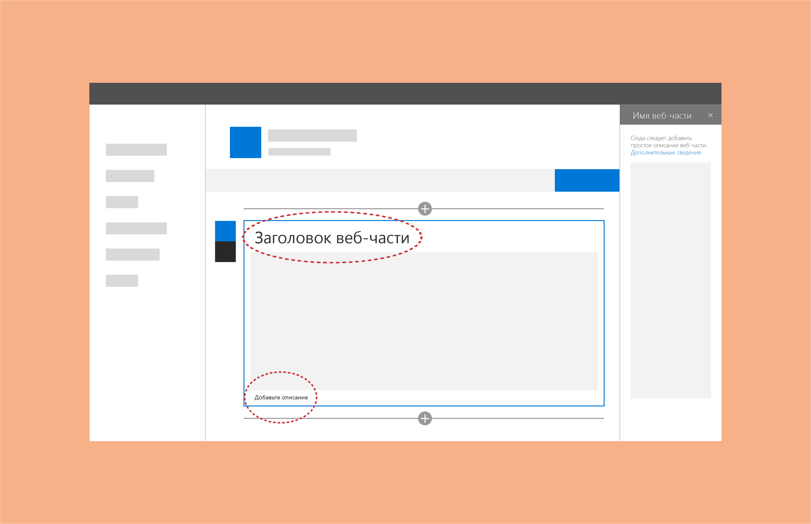

# Заголовки и описания веб-частей SharePointTitles and descriptions for SharePoint web parts

Вы можете добавлять заголовки и описания к веб-частям, чтобы пользователям было легче понять их назначение.You can add titles and descriptions to web parts to help users understand their purpose. Это полезно в тех случаях, когда страница содержит множество различных веб-частей.This is helpful when a page contains a range of web parts. Некоторым веб-частям (например, веб-частям изображений) заголовок может быть не нужен, но до или после области контента может потребоваться описание.Some web parts (like image web parts) might not need a title, but might need a description before or after the content area. Не рассчитывайте, что пользователи поймут контекст веб-части без заголовка или описания либо добавят их самостоятельно.Don't assume that users will understand the context of the web part without either a title or a description, and don't assume that users will include titles or descriptions themselves. 
 
Один из вариантов — подключить заголовок и описание к свойствам конфигурации веб-части.One option is to connect the title and description to the configuration properties of your web part. Благодаря этому веб-части будут изначально заполнены контентом, соответствующим конфигурации.This ensures that your web parts are prepopulated with content that makes the most sense based on the configuration. 
 
Например, если у вас есть веб-часть, запрашивающая библиотеку документов с учетом недавно добавленных элементов, то по умолчанию можно использовать заголовок "Последние документы".For example, if you have a web part that queries a document library based on recently added items, you might want to use "Recent documents" for the default title.

Как для заголовка, так и для описания автор страницы может переопределять стандартный замещающий текст и настраивать отображение в соответствии с создаваемой страницей.For both the title and description, the author of the page can override the default placeholder text and customize them based on what makes the most sense for the page they're creating. 

