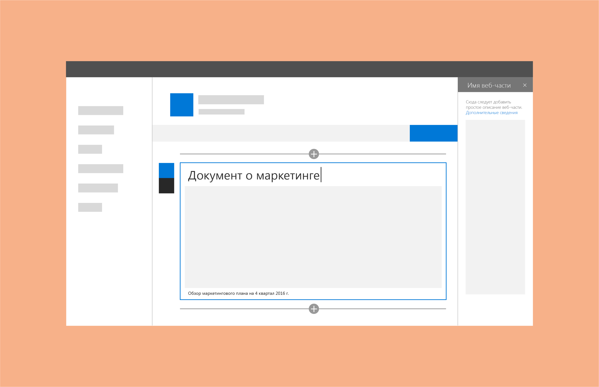

# Названия и описания веб-частей SharePoint

Вы можете добавлять названия и описания к веб-частям, чтобы пользователям было легче понять их назначение. Это полезно, когда страница содержит несколько веб-частей. Некоторым веб-частям (например, веб-частям изображений) не нужно название, но нужно описание до или после области контента. Не рассчитывайте, что пользователи поймут смысл веб-части без названия или описания либо добавят их самостоятельно. 
 
Один из вариантов — подключить название и описание к свойствам конфигурации веб-части. Благодаря этому веб-части будут изначально заполнены контентом, соответствующим конфигурации. 
 
Например, если у вас есть веб-часть, запрашивающая библиотеку документов с учетом недавно добавленных элементов, то по умолчанию можно использовать название "Последние документы".

 

Как для названия, так и для описания автор страницы может переопределять стандартный замещающий текст и настраивать отображение в соответствии с создаваемой страницей. 

## См. также

- [Разработка прекрасных решений для SharePoint](design-guidance-overview.md)