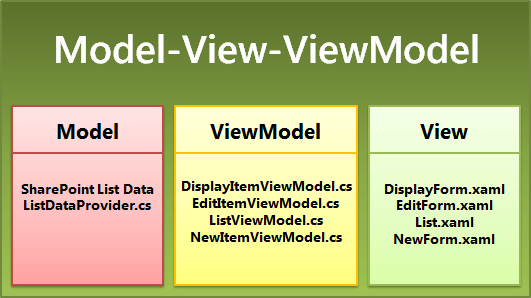

# Архитектура шаблона приложения списка SharePoint для Windows Phone
Основные сведения о шаблоне разработки проектах, созданных на основе шаблона приложения списка SharePoint для Windows Phone. Шаблон приложения списка SharePoint для Windows Phone, установленных с Windows Phone SharePoint Software Development Kit предназначен для создания на основе шаблона, отделяющий части проекта в различных компонентов приложения для Windows Phone. Шаблон не работать над созданием классы и файлы для установки шаблона, что позволяет разработчикам сосредоточиться на расширение создаются проекты на основе их определенным требованиям, бизнес-логику и данные.
  
    
    

## Шаблон приложения списка SharePoint для Windows Phone и шаблон проектирования MVVM

Шаблон приложения списка SharePoint для Windows Phone создается проект Visual Studio 2010 для приложения на основе Silverlight Windows Phone, разработанных в соответствии с шаблон разработки программного обеспечения, известных как шаблон Модели-View-ViewModel (MVVM). Шаблоне MVVM — это способ организации и compartmentalizing контролируемый слоев, которые могут быть независимо друг от друга разработки, тестирования и изменения кода в проекте. Это особенно эффективно разработки шаблон для проектов Windows Presentation Foundation (WPF) и Silverlight, поскольку другие преимущества шаблон обеспечивает уровень представления приложениям с менее жесткого зависимостями от структуры данных, что позволяет разработчикам адаптировать уровень представления для различных контекстах (как, например, Web браузеры, интерфейсов мобильных устройств или приложения для настольных систем) сохраняя же базовых структур данных.
  
    
    
В отличие от более простой подход с сказать, написание весь код управления данными в файлы кода, связанные с конкретной XAML-файлов в приложение Silverlight, организация проектов в соответствии с шаблоне MVVM состоит из дополнительных начальной вложений из объем работ по планированию и разработке необходимых классов, модель наследования и способы взаимодействия между компонентами сопоставляться с шаблоном. В этом первоначальной настройки и разработки работа с шаблоном автоматически, что позволяет настраивать и расширять проекта для быстрой разработки функциональное приложение MVVM отвечает за шаблона приложения списка SharePoint для Windows Phone.
  
    
    
Три основных компонентов или уровней шаблоне MVVM это представление, модели и ViewModel. В проектах, созданных на основе шаблона приложения списка SharePoint для Windows Phone эти компоненты, реализуются посредством различных файлов проекта, как показано на рисунке 1.
  
    
    

**На рисунке 1. Файлы приложения списка SharePoint для Windows Phone в шаблоне MVVM**

  
    
    

  
    
    

  
    
    
В следующих разделах описывается некоторые сведения, относящиеся к реализации этих компонентов в шаблоне приложения списка SharePoint для Windows Phone.
  
    
    

### Компонент модели

Компонент модели в шаблоне MVVM ссылается на классы и структуры, используемые для представления данных для приложения. Для приложения на основе списка SharePoint в список и его элементы, качестве базовые данные. В приложения списка Windows Phone SharePoint класс **ListDataProvider** обрабатывает операции модели объектов клиента стандартных SharePoint для подключения к списку SharePoint; Например, создание экземпляра класса **ClientContext** и установка его свойств. Точное реализацию класса **ListDataProvider** в шаблоне зависят от параметров, определенных в действия мастера приложений для телефона SharePoint при создании проекта на основе шаблона.
  
    
    
Базовый класс **ListDataProviderBase** (в Microsoft.SharePoint.Phone.Application.dll), от которого наследуется класс **ListDataProvider** реализует механизм кэширования для данных списка SharePoint. При извлечении элементов списка с сервера, кэшированных классом **ListDataProvider** в локальной памяти, выделенный для приложения телефона и при необходимости эти элементы в приложении кэша сначала проверяется для сохранения ресурсов и сократить число обращений к серверу.
  
    
    
Если вы хотите укажите точности данных для извлечения или фильтрации данных, полученных из списка SharePoint, можно изменить код в класс **ListDataProvider** (в файле ListDataProvider.cs). Части файла, который необходимо скорее изменить для следующих целей: метод **LoadDataFromServer** и реализация класса static **CamlQueryBuilder**. Собственный класс могут быть производными от класса **ListDataProviderBase**. При этом, убедитесь, что для реализации абстрактных методов из базового класса, **LoadData** и **LoadItem**и также реализации **Context** свойство члена базового класса, предоставляя подходящий **get** метод доступа к данным.
  
    
    

### Компонент представления

Компонент представления в шаблоне MVVM относится к пользовательского интерфейса (UI) приложения. В приложении Windows Phone на основе Silverlight обеспечить компонент представления достаточный с XAML-файлов для объявления и уточнение элементы пользовательского интерфейса и файлы кода, связанные с их XAML-файлов, которые реализуют обработчики событий и другой код для определения способа взаимодействия пользователей с элементы пользовательского интерфейса.
  
    
    
Очень важно для проведения различия между двумя смысле слова «вид» в контексте разработки приложений списка SharePoint для Windows Phone. Список SharePoint связан с одного или нескольких представлений, как, например, представление всех элементов по умолчанию для списка или текущей событий представления для списка на основе шаблона списка календаря. Эти представления представляют способа организации и отображаются элементы списка в списке SharePoint. В зависимости от типа списка SharePoint (и на ли настраиваемые представления были добавлены в список) целевой для вашего приложения, представлений, связанный со списком, например все задачи или текущие события, которые доступны для можно выбрать для включения в свое приложение в мастере приложений SharePoint телефона при создании проекта из шаблона. При включении данного представления, шаблон создает элемент управления **PivotItem** (содержится в элементе управления **Pivot** ) для отображения в представлении списка.
  
    
    
В этом смысле word «вид» является отличаются от смысле слово применительно к представления в шаблоне. В проекте на основе шаблона приложения списка SharePoint для Windows Phone представлений, (реализованные в виде XAML-файлов в папке представления проекта) концептуально обратитесь к компонент представления шаблоне MVVM. То есть представления в проекте представляют уровень представления для данных (или модели) для данного объекта. В этом случае сущность является списка SharePoint или элемент списка SharePoint.
  
    
    
Несмотря на то, что соответствует представлению по умолчанию, связанного со списком SharePoint, понятий различие между представление по умолчанию списка SharePoint и представления списка, по-прежнему следует хранить формы, так как формы списка в проекте не обязательно сопоставление по умолчанию представление списка на сервере можно назвать формы списка (List.xaml) в проекте. Если, например, необходимо изменить представление списка по умолчанию на сервере (, сказать, определяющее порядок сортировки заданного или отображение определенных полей и не другими пользователями), изменения не отображаются в XAML, составляющих формы списка в проекте. Задать порядок элементов, приведенных в списке формы в вашем приложении соответствии с выбором в мастере приложений SharePoint телефона (или на основании последующие настройки формы списка), вне зависимости от порядка, настроенных для представления по умолчанию, связанного со списком SharePoint на сервере.
  
    
    
Форма списка представляет представление (или уровень представления) для списка SharePoint. Другие три файла представления относятся к отдельные элементы списка, и их можно назвать (обычно) соответствуют формы, доступные из меню элемента списка для элемента списка в SharePoint.
  
    
    

- Форма просмотра (DisplayForm.xaml) соответствует форме Просмотр элемента (DispForm.aspx) для списка SharePoint. Эта форма представляет представления для отдельного элемента в список SharePoint.
    
  
- Форма редактирования (EditForm.xaml) соответствует форма изменения элемента (EditForm.aspx) для списка SharePoint. Эта форма представлена для данного элемента как его, открытой для редактирования.
    
  
- Файл формы (NewForm.xaml) соответствует форме нового элемента (NewForm.aspx) для списка SharePoint. Эта форма представлена для заданного элемента, который должен быть создан и добавлен в список.
    
  
Форма списка всегда включается по умолчанию в проекте на основе шаблона приложения списка SharePoint для Windows Phone. XAML-файлов для других форм в папке представления проекта создаются на основе списка операций (New, отображения или редактирования), выбранные в мастере приложений SharePoint телефона.
  
    
    

### Компонент ViewModel

Компонент ViewModel в шаблоне MVVM предназначен для использования в качестве типа broker для упрощения взаимодействия между представления и компоненты модели при отделение компонент представления из компонента модели, проще изменить одно или другое без негативного воздействия на другое. Строго сферой компоненте ViewModel может считаться частью уровень представления, так как часто содержит логику для базовых данных для представления в компоненте представления «настройки». В проектах, созданных на основе шаблона приложения списка SharePoint для Windows Phone, ViewModels Реализуйте код для привязки данных списков SharePoint возвращенная компонент модели (то есть, из объекта класса **ListDataProvider** ) к элементам управления пользовательского интерфейса в части компонента представления (например, форме редактирования). В зависимости от типа элемента управления, используемый для отображения данных из списка и типа данных (то есть ли тип поля для элемента списка — текст или числовые данные или что-то вроде поле выбора SharePoint), ViewModel сначала обрабатывает или преобразует данные таким образом, чтобы она связана для указанного элемента управления пользовательского интерфейса.
  
    
    
В частности, ViewModel классов в проекте (как, например, класс **EditItemViewModel** ) являются производными от базового класса **ViewModelBase** (в Microsoft.SharePoint.Phone.Application.dll), который реализует интерфейс **INotifyPropertyChanged**, чтобы определить пользовательский интерфейс приложения элементы управления Silverlight можно обновить при измените значения в базовых данных и может применяться к данным (переход в обратном направлении) изменения значений, хранящихся в элементы управления пользовательского интерфейса (если двунаправленной или "двустороннее" привязки, настроенных для элемента управления).
  
    
    
На рисунке 2 показано упрощенное представление иерархия наследования класса для класса **EditItemViewModel** и привязки для указанного элемента управления пользовательского интерфейса в форме редактирования с соответствующее поле в ViewModel.
  
    
    

**На рисунке 2. Классы EditItemViewModel и EditForm**

  
    
    

  
    
    

  
    
    
Класс **EditForm** (который представляет компонент представления в шаблоне MVVM) определенного и реализации в два файла, файл EditForm.xaml и соответствующий файл выделенным кодом, EditForm.xaml.cs. В файле EditForm.xaml.cs класса **EditItemViewModel** (представляющие компоненте ViewModel шаблоне MVVM) привязан к представлением в файле EditForm.xaml.cs путем установки свойства **DataContext** класса **EditForm** объект класса **EditItemViewModel**.
  
    
    
Разработки программного обеспечения на основе на шаблоне MVVM часто ограничить business логику и проверки процедур в компоненте модель шаблона. В проектах, созданных на основе шаблона приложения списка SharePoint для Windows Phone, тем не менее, некоторые операции, которые обычно считаются частью компонента модели были реализованы в компоненте ViewModel, чтобы сделать его более удобным для разработчиков для расширения проекты, но при этом немного Размытие концептуальные различие между на уровне данных (модель) и уровень представления (ViewModel). Например классы ViewModel для редактирования и создания элементов списка (то есть классы **EditItemViewModel** и **NewItemViewModel** ) предоставлять метод **Validate** , который разработчики могут переопределить для реализации проверки данных, введенных с пользователи. (Сведения о реализации проверки данных с помощью этих ViewModels можно [как: реализация бизнес-логики и данных проверок в приложении Windows Phone для SharePoint](how-to-implement-business-logic-and-data-validation-in-a-windows-phone-app-for-s.md)... MD)
  
    
    

    
> [!NOTE]
> [!Примечание] Объект **ListDataProvider** только загружает данные с сервера. Другие операции, такие как **Add**, **Update**и **Delete**, выполняются в ViewModel, последующим вызовом обновления для обновления данных ViewModel с сервера. Такой подход позволяет сократить засорение кода. 
  
    
    

## Файл App.xaml и модель приложения Silverlight

Файл App.xaml и его файл выделенным кодом App.xaml.cs, являются стандартные компоненты управляемого приложения Silverlight. Приложения, использующие управляемого интерфейса API для Silverlight необходимо включить класс, производный от класса Silverlight  [приложения](http://msdn.microsoft.com/en-us/library/system.windows.application%28VS.95%29.aspx) для реализации модели приложения Silverlight. Класс **Application** поддерживает события жизненным циклом приложения и средства для управления ресурсами, такими как изображения, строк и шаблоны XAML.
  
    
    
Сведения о типах изменений, можно выполнить в файл App.xaml.cs в проектах можно [как: хранения и извлечения SharePoint списка элементов на Windows Phone](how-to-store-and-retrieve-sharepoint-list-items-on-a-windows-phone.md) на Реализация обработчиков событий в файл App.xaml.cs, чтобы сохранить приложения состояние сведения и [как: используйте несколько списков SharePoint в приложении Windows Phone](how-to-use-multiple-sharepoint-lists-in-a-windows-phone-app.md) на создание экземпляра и настройка дополнительных объектов **ListDataProvider** в App.xaml.cs.
  
    
    

## См. также

-  [С использованием шаблона Model-View-ViewModel](http://msdn.microsoft.com/en-us/library/hh821028.aspx)
    
  
-  [Архитектура управления PIVOT для Windows Phone](http://msdn.microsoft.com/en-us/library/ff941097%28VS.92%29.aspx)
    
  
-  [Модель приложения Silverlight](http://msdn.microsoft.com/en-us/library/cc872869%28VS.95%29.aspx)
    
  
-  [Разработка приложения Windows Phone с помощью шаблоне MVVM](http://msdn.microsoft.com/en-us/library/hh848247.aspx)
    
  
-  [Приложений WPF с помощью шаблона разработки Model-View-ViewModel](http://msdn.microsoft.com/en-us/magazine/dd419663.aspx)
    
  
-  [Windows Phone SDK 8.0](http://www.microsoft.com/en-us/download/details.aspx?id=35471)
    
  
-  [Пакет SDK Microsoft SharePoint для Windows Phone 8](http://www.microsoft.com/en-us/download/details.aspx?id=36818)
    
  
-  [Пакет SDK Microsoft SharePoint для Windows Phone 7.1](http://www.microsoft.com/en-us/download/details.aspx?id=30476)
    
  

