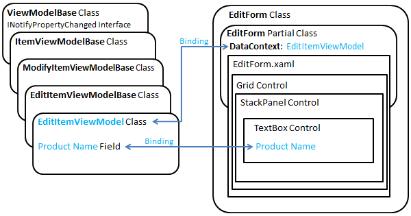

# Архитектура шаблона приложения списка SharePoint для Windows PhoneArchitecture of the Windows Phone SharePoint List Application template
Основные сведения о шаблоне разработки проектах, созданных на основе шаблона приложения списка SharePoint для Windows Phone. Шаблон приложения списка SharePoint для Windows Phone, установленных с Windows Phone SharePoint Software Development Kit предназначен для создания на основе шаблона, отделяющий части проекта в различных компонентов приложения для Windows Phone. Шаблон не работать над созданием классы и файлы для установки шаблона, что позволяет разработчикам сосредоточиться на расширение создаются проекты на основе их определенным требованиям, бизнес-логику и данные.Understand the design pattern of projects created from the Windows Phone SharePoint List Application template. The Windows Phone SharePoint List Application template installed by the Windows Phone SharePoint Software Development Kit has been designed to generate Windows Phone apps based on a pattern that separates parts of the project into different components. The template does the work of creating the classes and files to establish the pattern, allowing developers to focus on extending generated projects based on their particular requirements, business logic, and data.
  
    
    

## Шаблон приложения списка SharePoint для Windows Phone и шаблон проектирования MVVMThe Windows Phone SharePoint List Application template and the MVVM design pattern

Шаблон приложения списка SharePoint для Windows Phone создается проект Visual Studio 2010 для приложения на основе Silverlight Windows Phone, разработанных в соответствии с шаблон разработки программного обеспечения, известных как шаблон Модели-View-ViewModel (MVVM). Шаблоне MVVM — это способ организации и compartmentalizing контролируемый слоев, которые могут быть независимо друг от друга разработки, тестирования и изменения кода в проекте. Это особенно эффективно разработки шаблон для проектов Windows Presentation Foundation (WPF) и Silverlight, поскольку другие преимущества шаблон обеспечивает уровень представления приложениям с менее жесткого зависимостями от структуры данных, что позволяет разработчикам адаптировать уровень представления для различных контекстах (как, например, Web браузеры, интерфейсов мобильных устройств или приложения для настольных систем) сохраняя же базовых структур данных.The Windows Phone SharePoint List Application template generates a Visual Studio 2010 project for a Silverlight-based Windows Phone app developed according to a software design pattern known as the View-Model-ViewModel (MVVM) pattern. The MVVM pattern is a way of organizing and compartmentalizing code in a project into manageable layers, which can be independently developed, tested, and modified. It is a particularly effective development pattern for Windows Presentation Foundation (WPF) and Silverlight projects because, among other benefits, the pattern allows for the presentation layer of a given application to have a less rigid dependency on the structure of underlying data, freeing developers to adapt the presentation layer for different contexts (as, for instance, Web browsers, mobile device interfaces, or desktop applications) while retaining the same underlying data structures.
  
    
    
В отличие от более простой подход с сказать, написание весь код управления данными в файлы кода, связанные с конкретной XAML-файлов в приложение Silverlight, организация проектов в соответствии с шаблоне MVVM состоит из дополнительных начальной вложений из объем работ по планированию и разработке необходимых классов, модель наследования и способы взаимодействия между компонентами сопоставляться с шаблоном. В этом первоначальной настройки и разработки работа с шаблоном автоматически, что позволяет настраивать и расширять проекта для быстрой разработки функциональное приложение MVVM отвечает за шаблона приложения списка SharePoint для Windows Phone.As opposed to a simpler approach of, say, writing all of your data-management code in the code-behind files associated with particular XAML files in a Silverlight application, organizing a project according to the MVVM pattern involves an additional initial investment of effort to plan and develop the necessary classes, the inheritance model, and the methods of communication between the components of the pattern. The Windows Phone SharePoint List Application template takes care of this initial configuration and development work to set up the pattern for you, allowing you to customize and extend the project to develop a functional MVVM application quickly.
  
    
    
Три основных компонентов или уровней шаблоне MVVM это представление, модели и ViewModel. В проектах, созданных на основе шаблона приложения списка SharePoint для Windows Phone эти компоненты, реализуются посредством различных файлов проекта, как показано на рисунке 1.The three main components or layers of the MVVM pattern are the View, the Model, and the ViewModel. In projects based on the Windows Phone SharePoint List Application template, these components are implemented by various project files, as shown in Figure 1.
  
    
    

**На рисунке 1. Файлы приложения списка SharePoint для Windows Phone в шаблоне MVVM****Figure 1. Windows Phone SharePoint List Application files in the MVVM pattern**

  
    
    

  
    
    

  
    
    
В следующих разделах описывается некоторые сведения, относящиеся к реализации этих компонентов в шаблоне приложения списка SharePoint для Windows Phone.The following sections explain some of the details related to the implementation of these components in the Windows Phone SharePoint List Application template.
  
    
    

### Компонент моделиThe Model component

Компонент модели в шаблоне MVVM ссылается на классы и структуры, используемые для представления данных для приложения. Для приложения на основе списка SharePoint в список и его элементы, качестве базовые данные. В приложения списка Windows Phone SharePoint класс **ListDataProvider** обрабатывает операции модели объектов клиента стандартных SharePoint для подключения к списку SharePoint; Например, создание экземпляра класса **ClientContext** и установка его свойств. Точное реализацию класса **ListDataProvider** в шаблоне зависят от параметров, определенных в действия мастера приложений для телефона SharePoint при создании проекта на основе шаблона.The Model component in the MVVM pattern refers to the classes and structures used to represent the data for an application. For an app based on a SharePoint list, the list and its items serve as the underlying data. In the Windows Phone SharePoint List Application, the **ListDataProvider** class handles the standard SharePoint client object model operations for connecting to a SharePoint list; for example, creating an instance of the **ClientContext** class and setting its properties. The exact implementation details of the **ListDataProvider** class in the template depend on the options specified in the steps of the SharePoint Phone Application Wizard when you create a project based on the template.
  
    
    
Базовый класс **ListDataProviderBase** (в Microsoft.SharePoint.Phone.Application.dll), от которого наследуется класс **ListDataProvider** реализует механизм кэширования для данных списка SharePoint. При извлечении элементов списка с сервера, кэшированных классом **ListDataProvider** в локальной памяти, выделенный для приложения телефона и при необходимости эти элементы в приложении кэша сначала проверяется для сохранения ресурсов и сократить число обращений к серверу.The base class, **ListDataProviderBase** (in the Microsoft.SharePoint.Phone.Application.dll), from which the **ListDataProvider** class is derived implements a caching mechanism for SharePoint list data. When list items are retrieved from the server, they are cached by the **ListDataProvider** class in the local memory allocated to the phone app and when those items are needed in the app, the cache is checked first in order to conserve resources and reduce trips to the server.
  
    
    
Если вы хотите укажите точности данных для извлечения или фильтрации данных, полученных из списка SharePoint, можно изменить код в класс **ListDataProvider** (в файле ListDataProvider.cs). Части файла, который необходимо скорее изменить для следующих целей: метод **LoadDataFromServer** и реализация класса static **CamlQueryBuilder**. Собственный класс могут быть производными от класса **ListDataProviderBase**. При этом, убедитесь, что для реализации абстрактных методов из базового класса, **LoadData** и **LoadItem**и также реализации **Context** свойство члена базового класса, предоставляя подходящий **get** метод доступа к данным.If you want to filter the data retrieved from the SharePoint list or specify exactly what data to retrieve, you can modify the code in the **ListDataProvider** class (in the ListDataProvider.cs file). The parts of the file you would most likely modify for these purposes are the **LoadDataFromServer** method and the implementation of the static **CamlQueryBuilder** class. You can also derive your own class from the **ListDataProviderBase** class. If you do so, be sure to implement the abstract methods from the base class, **LoadData** and **LoadItem**, and also implement the **Context** property member of the base class, providing a suitable **get** accessor method.
  
    
    

### Компонент представленияThe View component

Компонент представления в шаблоне MVVM относится к пользовательского интерфейса (UI) приложения. В приложении Windows Phone на основе Silverlight обеспечить компонент представления достаточный с XAML-файлов для объявления и уточнение элементы пользовательского интерфейса и файлы кода, связанные с их XAML-файлов, которые реализуют обработчики событий и другой код для определения способа взаимодействия пользователей с элементы пользовательского интерфейса.The View component in the MVVM pattern refers to the user interface (UI) of an app. In Silverlight-based Windows Phone app, the View component is constituted by XAML files for declaring and qualifying UI elements and code-behind files associated with those XAML files that implement event handlers and other code to determine how users interact with the UI elements.
  
    
    
Очень важно для проведения различия между двумя смысле слова «вид» в контексте разработки приложений списка SharePoint для Windows Phone. Список SharePoint связан с одного или нескольких представлений, как, например, представление всех элементов по умолчанию для списка или текущей событий представления для списка на основе шаблона списка календаря. Эти представления представляют способа организации и отображаются элементы списка в списке SharePoint. В зависимости от типа списка SharePoint (и на ли настраиваемые представления были добавлены в список) целевой для вашего приложения, представлений, связанный со списком, например все задачи или текущие события, которые доступны для можно выбрать для включения в свое приложение в мастере приложений SharePoint телефона при создании проекта из шаблона. При включении данного представления, шаблон создает элемент управления **PivotItem** (содержится в элементе управления **Pivot** ) для отображения в представлении списка.It is important to distinguish between two senses of the word "view" in the context of developing SharePoint list apps for Windows Phone. A SharePoint list is associated with one or more views, as, for example, the default All Items view for a list, or the Current Events view for a list based on the Calendar list template. These views represent ways of organizing and displaying list items in a SharePoint list. Depending on the kind of SharePoint list (and on whether custom views have been added to the list) you target for your app, the views associated with the list, such as All Tasks or Current Events, are made available for you to choose to include in your app in the SharePoint Phone Application Wizard when you create a project from the template. If you include a given view, the template generates a **PivotItem** control (contained within a **Pivot** control) to render the view of the list.
  
    
    
В этом смысле word «вид» является отличаются от смысле слово применительно к представления в шаблоне. В проекте на основе шаблона приложения списка SharePoint для Windows Phone представлений, (реализованные в виде XAML-файлов в папке представления проекта) концептуально обратитесь к компонент представления шаблоне MVVM. То есть представления в проекте представляют уровень представления для данных (или модели) для данного объекта. В этом случае сущность является списка SharePoint или элемент списка SharePoint.This sense of the word "view" is to be distinguished from the sense of the word as it applies to the Views in the template. In a project based on the Windows Phone SharePoint List Application template, the Views (implemented as XAML files in the Views folder of the project) refer conceptually to the View component of the MVVM pattern. That is, the Views in the project represent the presentation layer for the data (or, Model) of a given entity. In this case, the entity is either a SharePoint list or a SharePoint list item.
  
    
    
Несмотря на то, что соответствует представлению по умолчанию, связанного со списком SharePoint, понятий различие между представление по умолчанию списка SharePoint и представления списка, по-прежнему следует хранить формы, так как формы списка в проекте не обязательно сопоставление по умолчанию представление списка на сервере можно назвать формы списка (List.xaml) в проекте. Если, например, необходимо изменить представление списка по умолчанию на сервере (, сказать, определяющее порядок сортировки заданного или отображение определенных полей и не другими пользователями), изменения не отображаются в XAML, составляющих формы списка в проекте. Задать порядок элементов, приведенных в списке формы в вашем приложении соответствии с выбором в мастере приложений SharePoint телефона (или на основании последующие настройки формы списка), вне зависимости от порядка, настроенных для представления по умолчанию, связанного со списком SharePoint на сервере.Although the List form (List.xaml) in the project can be said to correspond to the default view associated with a SharePoint list, the conceptual distinction between the default view of a SharePoint list and the View as represented by the List form should still be maintained, because the List form in the project doesn't necessarily map to the default view of the list on the server. If, for example, you modify the default list view on the server (by, say, specifying a given sort order or displaying certain fields and not others), the modifications will not be represented in the XAML that constitutes the List form in the project. You set the order of the items as they are shown in the List form in your app based on your choices in the SharePoint Phone Application Wizard (or based on your subsequent customizations of the List form), regardless of the order configured for the default view associated with the SharePoint list on the server.
  
    
    
Форма списка представляет представление (или уровень представления) для списка SharePoint. Другие три файла представления относятся к отдельные элементы списка, и их можно назвать (обычно) соответствуют формы, доступные из меню элемента списка для элемента списка в SharePoint.The List form represents the View (or presentation layer) for the SharePoint list. The other three View files pertain to individual list items, and they can be said to correspond to the forms available (generally) from the list item menu for a list item in SharePoint.
  
    
    

- Форма просмотра (DisplayForm.xaml) соответствует форме Просмотр элемента (DispForm.aspx) для списка SharePoint. Эта форма представляет представления для отдельного элемента в список SharePoint.The Display form (DisplayForm.xaml) corresponds to the View Item form (DispForm.aspx) for a SharePoint list. This form presents a View for an individual item in a SharePoint list.
    
  
- Форма редактирования (EditForm.xaml) соответствует форма изменения элемента (EditForm.aspx) для списка SharePoint. Эта форма представлена для данного элемента как его, открытой для редактирования.The Edit form (EditForm.xaml) corresponds to the Edit Item form (EditForm.aspx) for a SharePoint list. This form presents a View for a given item as it is exposed for editing.
    
  
- Файл формы (NewForm.xaml) соответствует форме нового элемента (NewForm.aspx) для списка SharePoint. Эта форма представлена для заданного элемента, который должен быть создан и добавлен в список.The New form (NewForm.xaml) file corresponds to the New Item form (NewForm.aspx) for a SharePoint list. This form presents a View for a given item that is to be created and added to the list.
    
  
Форма списка всегда включается по умолчанию в проекте на основе шаблона приложения списка SharePoint для Windows Phone. XAML-файлов для других форм в папке представления проекта создаются на основе списка операций (New, отображения или редактирования), выбранные в мастере приложений SharePoint телефона.The List form is always included by default in a project based on the Windows Phone SharePoint List Application template. The XAML files for the other forms in the Views folder of the project are generated based on the list operations (New, Display, or Edit) selected in the SharePoint Phone Application Wizard.
  
    
    

### Компонент ViewModelThe ViewModel component

Компонент ViewModel в шаблоне MVVM предназначен для использования в качестве типа broker для упрощения взаимодействия между представления и компоненты модели при отделение компонент представления из компонента модели, проще изменить одно или другое без негативного воздействия на другое. Строго сферой компоненте ViewModel может считаться частью уровень представления, так как часто содержит логику для базовых данных для представления в компоненте представления «настройки». В проектах, созданных на основе шаблона приложения списка SharePoint для Windows Phone, ViewModels Реализуйте код для привязки данных списков SharePoint возвращенная компонент модели (то есть, из объекта класса **ListDataProvider** ) к элементам управления пользовательского интерфейса в части компонента представления (например, форме редактирования). В зависимости от типа элемента управления, используемый для отображения данных из списка и типа данных (то есть ли тип поля для элемента списка — текст или числовые данные или что-то вроде поле выбора SharePoint), ViewModel сначала обрабатывает или преобразует данные таким образом, чтобы она связана для указанного элемента управления пользовательского интерфейса.The ViewModel component in the MVVM pattern is intended to serve as a kind of broker to facilitate the interactions between the View component and the Model component, while decoupling the View component from the Model component so it is easier to change one or the other without adversely affecting the other. Strictly speaking, the ViewModel component could be considered part of the presentation layer, because it often includes logic for "shaping" underlying data for presentation in the View component. In projects based on the Windows Phone SharePoint List Application template, the ViewModels implement the code for binding SharePoint list data retrieved from the Model component (that is, from an object of the **ListDataProvider** class) to UI controls in a part of the View component (for example, the Edit form). Depending on the kind of control used to display the data from the list and the type of data (that is, whether the field type for the list item is text or numerical data or something like a SharePoint Choice field), the ViewModel first processes or converts the data such that it can be bound to a given UI control.
  
    
    
В частности, ViewModel классов в проекте (как, например, класс **EditItemViewModel** ) являются производными от базового класса **ViewModelBase** (в Microsoft.SharePoint.Phone.Application.dll), который реализует интерфейс **INotifyPropertyChanged**, чтобы определить пользовательский интерфейс приложения элементы управления Silverlight можно обновить при измените значения в базовых данных и может применяться к данным (переход в обратном направлении) изменения значений, хранящихся в элементы управления пользовательского интерфейса (если двунаправленной или "двустороннее" привязки, настроенных для элемента управления).In particular, the ViewModel classes in the project (as, for example, the **EditItemViewModel** class) are derived from a base class, **ViewModelBase** (in the Microsoft.SharePoint.Phone.Application.dll), which implements the **INotifyPropertyChanged** interface so that the Silverlight controls constituting the user interface of the app can be updated when values in the underlying data change, and (going in the other direction) changes to the values stored in UI controls can be applied to the underlying data (if bi-directional, or "two-way", binding is configured for a control).
  
    
    
На рисунке 2 показано упрощенное представление иерархия наследования класса для класса **EditItemViewModel** и привязки для указанного элемента управления пользовательского интерфейса в форме редактирования с соответствующее поле в ViewModel.Figure 2 shows a simplified representation of the class inheritance hierarchy for the **EditItemViewModel** class and the binding for a given UI control in the Edit form with the corresponding field in the ViewModel.
  
    
    

**На рисунке 2. Классы EditItemViewModel и EditForm****Figure 2. The EditItemViewModel and EditForm classes**

  
    
    

  
    
    

  
    
    
Класс **EditForm** (который представляет компонент представления в шаблоне MVVM) определенного и реализации в два файла, файл EditForm.xaml и соответствующий файл выделенным кодом, EditForm.xaml.cs. В файле EditForm.xaml.cs класса **EditItemViewModel** (представляющие компоненте ViewModel шаблоне MVVM) привязан к представлением в файле EditForm.xaml.cs путем установки свойства **DataContext** класса **EditForm** объект класса **EditItemViewModel**.The **EditForm** class (which represents the View component from the MVVM pattern) is defined and implemented by two files, the EditForm.xaml file and its associated code-behind file, EditForm.xaml.cs. In the EditForm.xaml.cs file, the **EditItemViewModel** class (representing the ViewModel component of the MVVM pattern) is bound to the View in the EditForm.xaml.cs file by setting the **DataContext** property of the **EditForm** class to an object of the **EditItemViewModel** class.
  
    
    
Разработки программного обеспечения на основе на шаблоне MVVM часто ограничить business логику и проверки процедур в компоненте модель шаблона.Software designs based on the MVVM pattern often confine business logic and validation routines to the Model component of the pattern. В проектах, созданных на основе шаблона приложения списка SharePoint для Windows Phone, тем не менее, некоторые операции, которые обычно считаются частью компонента модели были реализованы в компоненте ViewModel, чтобы сделать его более удобным для разработчиков для расширения проекты, но при этом немного Размытие концептуальные различие между на уровне данных (модель) и уровень представления (ViewModel).In projects based on the Windows Phone SharePoint List Application template, however, some operations that are typically considered part of the Model component have been implemented in the ViewModel component to make it more convenient for developers to extend the projects, at the cost of slightly blurring the conceptual distinction between the data layer (Model) and the presentation layer (ViewModel). Например классы ViewModel для редактирования и создания элементов списка (то есть классы **EditItemViewModel** и **NewItemViewModel** ) предоставлять метод **Validate** , который разработчики могут переопределить для реализации проверки данных, введенных с пользователи.For example, the ViewModel classes for editing and creating list items (that is, the **EditItemViewModel** and **NewItemViewModel** classes) expose a **Validate** method that developers can override to implement validation of data entered by users. (Сведения о реализации проверки данных с помощью этих ViewModels можно [как: реализация бизнес-логики и данных проверок в приложении Windows Phone для SharePoint](how-to-implement-business-logic-and-data-validation-in-a-windows-phone-app-for-s.md)... MD)(For information on implementing data validation with these ViewModels, see [How to: Implement business logic and data validation in a Windows Phone app for SharePoint](how-to-implement-business-logic-and-data-validation-in-a-windows-phone-app-for-s.md)..md)
  
    
    

    
> **Примечание:** Объект **ListDataProvider** только загружает данные с сервера.**Note:** The **ListDataProvider** object only loads the data from server. Других операций, например, **Добавление**, **обновление**и **Удаление**, выполняются в ViewModel, за которым следует вызова обновления для обновления данных ViewModel с сервера.Other operations, such as **Add**, **Update**, and **Delete**, are performed in the ViewModel itself, followed by a refresh call to update the ViewModel data from the server. Такой подход позволяет сократить засорение кода.This design reduces cluttering of the code. 
  
    
    

## Файл App.xaml и модель приложения SilverlightThe App.xaml file and the Silverlight application model

Файл App.xaml и его файл выделенным кодом App.xaml.cs, являются стандартные компоненты управляемого приложения Silverlight. Приложения, использующие управляемого интерфейса API для Silverlight необходимо включить класс, производный от класса Silverlight  [приложения](http://msdn.microsoft.com/en-us/library/system.windows.application%28VS.95%29.aspx) для реализации модели приложения Silverlight. Класс **Application** поддерживает события жизненным циклом приложения и средства для управления ресурсами, такими как изображения, строк и шаблоны XAML.The App.xaml file and its associated code-behind file, App.xaml.cs, are standard components of a managed Silverlight application. Applications that use the managed API for Silverlight must include a class derived from the Silverlight  [Application](http://msdn.microsoft.com/en-us/library/system.windows.application%28VS.95%29.aspx) class, in order to implement the Silverlight application model. The **Application** class supports application life-cycle events and facilities for managing resources like images, strings, and XAML templates.
  
    
    
Сведения о типах изменений, можно выполнить в файл App.xaml.cs в проектах можно [как: хранения и извлечения SharePoint списка элементов на Windows Phone](how-to-store-and-retrieve-sharepoint-list-items-on-a-windows-phone.md) на Реализация обработчиков событий в файл App.xaml.cs, чтобы сохранить приложения состояние сведения и [как: используйте несколько списков SharePoint в приложении Windows Phone](how-to-use-multiple-sharepoint-lists-in-a-windows-phone-app.md) на создание экземпляра и настройка дополнительных объектов **ListDataProvider** в App.xaml.cs.For information about the kinds of modifications you might make to the App.xaml.cs file in your projects, see  [How to: Store and retrieve SharePoint list items on a Windows Phone](how-to-store-and-retrieve-sharepoint-list-items-on-a-windows-phone.md) on implementing event handlers in the App.xaml.cs file to preserve application state information, and [How to: Use multiple SharePoint lists in a Windows Phone app](how-to-use-multiple-sharepoint-lists-in-a-windows-phone-app.md) on instantiating and configuring additional **ListDataProvider** objects in App.xaml.cs.
  
    
    

## Дополнительные ресурсыAdditional resources

-  [С использованием шаблона Model-View-ViewModelUsing the Model-View-ViewModel Pattern](http://msdn.microsoft.com/en-us/library/hh821028.aspx)
    
  
-  [Архитектура управления PIVOT для Windows PhonePivot Control Architecture for Windows Phone](http://msdn.microsoft.com/en-us/library/ff941097%28VS.92%29.aspx)
    
  
-  [Модель приложения SilverlightSilverlight Application Model](http://msdn.microsoft.com/en-us/library/cc872869%28VS.95%29.aspx)
    
  
-  [Разработка приложения Windows Phone с помощью шаблоне MVVMDeveloping a Windows Phone Application using the MVVM Pattern](http://msdn.microsoft.com/en-us/library/hh848247.aspx)
    
  
-  [Приложений WPF с помощью шаблона разработки Model-View-ViewModelWPF Apps With The Model-View-ViewModel Design Pattern](http://msdn.microsoft.com/en-us/magazine/dd419663.aspx)
    
  
-  [Windows Phone SDK 8.0Windows Phone SDK 8.0](http://www.microsoft.com/en-us/download/details.aspx?id=35471)
    
  
-  [Пакет SDK Microsoft SharePoint для Windows Phone 8Microsoft SharePoint SDK for Windows Phone 8](http://www.microsoft.com/en-us/download/details.aspx?id=36818)
    
  
-  [Пакет SDK Microsoft SharePoint для Windows Phone 7.1Microsoft SharePoint SDK for Windows Phone 7.1](http://www.microsoft.com/en-us/download/details.aspx?id=30476)
    
  

