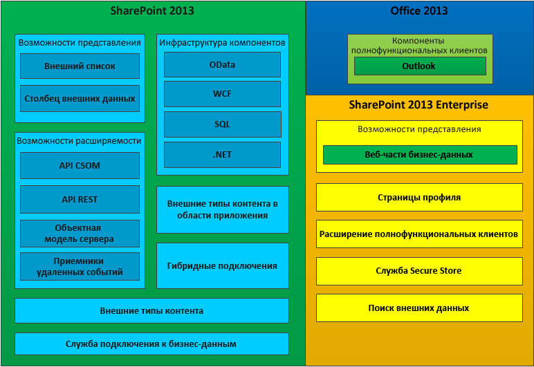

# Business Connectivity Services в SharePointBusiness Connectivity Services in SharePoint
Информация о службах Службы Business Connectivity Services (BCS), их назначении и требованиях для разработки приложений BCS в SharePoint. Вы можете использовать SharePoint в качестве концентратора для создания высокопроизводительных решений для совместной работы, которые могут работать с различными внешними системами. Службы Business Connectivity Services (BCS) предоставляет инфраструктуру, которая включает SharePoint для переноса данных из внешних систем в центральную. Благодаря гибким и расширяемым средствам для описания источника данных внешних систем и методу взаимодействия с ними, BCS дает веские основания для использования SharePoint в качестве центрального интерфейса для работы с устаревшими бизнес-системами в дополнение к новым Надстройки SharePoint.Learn what Business Connectivity Services (BCS) is, what you can do with it, and the information you need to get started developing BCS applications in SharePoint. You can use SharePoint as a hub for creating rich productivity and collaboration solutions that can work with a variety of external systems. Business Connectivity Services (BCS) provides the infrastructure that enables SharePoint to bring data from those external systems into a central system. By providing a flexible and extensible means to describe the external system data source and how to interact with it, BCS makes a compelling argument for using SharePoint as the central interface for working with legacy business systems in addition to new SharePoint Add-ins.
  
    
    

## Возможности BCSWhat can BCS do?

Службы BCS предоставляют механизмы, упрощающие для опытных пользователей, разработчиков и ИТ-специалистов подразделений выполнение перечисленных ниже задач.BCS provides mechanisms to enable experienced users, developers, and business unit IT professionals to do the following much more easily:
  
    
    

- Отображение внешних данных из корпоративных приложений, веб-служб и служб OData в SharePoint и полнофункциональных клиентских приложениях Office.Reveal external data from enterprise applications, web services, and OData services in SharePoint and in rich-client Office applications.
    
  
- Добавление функций и возможностей в стиле Office (например, контактов, задач и встреч) ко внешним данным и службам.Provide Office-type behaviors (such as Contacts, Tasks, and Appointments) and capabilities to external data and services.
    
  
- Обеспечение полного взаимодействия с данными, включая возможности выполнения обратной записи из приложений Office и SharePoint Server в базовые данные внешней системы и бизнес-объекты.Provide complete interaction with the data, including write-back capabilities from Office applications and SharePoint Server to the underlying external system data and business objects.
    
  
- Обеспечение автономного использования внешних данных и процессов.Enable offline use of external data and processes.
    
  
- Соединение неструктурированного мира документов и людей и соответствующие структурированные данные, которые заблокированы во внешних системах.Bridge the unstructured world of documents and people and the appropriate structured data that is locked in external systems.
    
  

## Компоненты BCSComponents of BCS

На рис. 1 показаны функции, которые включены в SharePoint и Office 2013.Figure 1 shows the features that are included in SharePoint and Office 2013.
  
    
    

**Рис. 1. Набор функций служб Business Connectivity Services****Figure 1. Business Connectivity Services feature set**

  
    
    

  
    
    

  
    
    

  
    
    

  
    
    

## Использование внешних типов контента в BCSUsing external content types in BCS

Внешние типы контента являются ядром BCS. Они позволяют управлять и повторно использовать метаданные и поведения бизнес-элемента, например клиента или заказа, из центрального расположения. Они позволяют пользователям более осмысленно взаимодействовать с этими внешними данными и процессами.External content types are the core of BCS. They enable you to manage and reuse the metadata and behaviors of a business entity, such as Customer or Order, from a central location. They enable users to interact with that external data and process it in a more meaningful way.
  
    
    
В качестве примера рассмотрим такой бизнес-элемент как клиент. Вы хотите поместить данные из собственной базы данных и работать с ней в SharePoint. Вам также необходимо иметь возможность позволять своим продавцам пользоваться данными в автономном режиме в Outlook 2013. Либо вы хотите, чтобы пользователь имел возможность выбрать клиента из списка клиентов в документе с контактной информацией клиента внутри Microsoft Word. Для того чтобы все это осуществить, вы можете создать единый внешний тип контента и затем повторно использовать его при необходимости.For example, consider a business entity, such as a customer. You want to be able to pull data from your proprietary database and work with it in SharePoint. You also want to be able to allow your field salespeople to take data offline in Outlook 2013. Or, you might want the user to be able to choose a customer from a list of customers in an orders contract document inside Microsoft Word. To make all this possible, you can create a single external content type and then reuse it anywhere you need it.
  
    
    
Дополнительную информацию по использованию внешних типов контента в BCS можно узнать в статье  [Внешние типы контента в SharePoint](external-content-types-in-sharepoint.md).For more information about using external content types in BCS, see  [External content types in SharePoint](external-content-types-in-sharepoint.md).
  
    
    

## Разработка решений с использованием BCSDeveloping solutions using BCS

В SharePoint можно построить широкий спектр решений с помощью BCS. Сюда относятся простые решения, которые основываются на собственных возможностях с небольшой настройкой или без нее, промежуточные решения, которые подразумевают пользовательские функции в SharePoint и Office 2013, и дополнительные решения, которые включают сложные сценарии и большие приложения, расширяющие их функционал. Дополнительные решения предполагают написание кода с использованием Visual Studio. Они могут быть полными комплексными приложениями или повторно используемыми компонентами на основе кода, которые включены в промежуточное решение.You can build a broad spectrum of solutions in SharePoint by using BCS. These include simple solutions that rely on native capabilities with little or no customization, intermediate solutions that involve customizing features in SharePoint and Office 2013, and advanced solutions that enable complex scenarios and rich applications that extend their functionality. Advanced solutions involve writing code using Visual Studio. They can be either complete end-to-end solutions, or reusable code-based components that are included in an intermediate solution.
  
    
    
BCS позволяет бизнес-пользователям быстро и легко решать широкий круг потребностей во внешних данных за счет использования веб-браузера и клиентского приложения Microsoft Office, например Word или Excel. Без необходимости написания кода пользователи могут собрать составные решения за счет функций BCS, например внешних списков и столбцы внешних данных и повторно используемых компонентов BCS, которые создаются разработчиками и утверждаются ИТ, в клиентских приложениях Office и сайтах SharePoint. Эти решения включают бизнес-пользователей (и их команды), которые позволяют работать с внешними данными так же легко, как с данными SharePoint, в автономном режиме или с подключением к Интернету либо напрямую в Office 2013.BCS empowers business users to quickly and easily address a broad array of external data needs by using a web browser and a Microsoft Office client application, such as Word or Excel. Without writing code, users can assemble composite solutions by using BCS features, such as external lists and external data columns, and reusable BCS components, which are created by developers and approved by IT, in Office client applications and SharePoint sites. These solutions enable business users (and their teams) to work with external data as easily as with SharePoint data, either offline or connected, or directly in Office 2013.
  
    
    
Дополнительную информацию о начале работы можно узнать в статье  [Настройка среды разработки для BCS в SharePoint](setting-up-a-development-environment-for-bcs-in-sharepoint.md).For information about how to get started, see  [Setting up a development environment for BCS in SharePoint](setting-up-a-development-environment-for-bcs-in-sharepoint.md).
  
    
    

## Использование OData с помощью служб Business Connectivity Services в SharePointUsing OData with Business Connectivity Services in SharePoint

Протокол открытых данных (OData)  это веб-протокол, позволяющий раскрывать данные в Интернете с помощью таких технологий, как HTTP, Нотация объектов JavaScript (JSON) и AtomPub. Доступ к данным осуществляется через специально созданные URL-адреса. Данная архитектура позволяет вам взаимодействовать с данными, используя различные технологии.The Open Data Protocol (OData) is a web protocol that lets you expose data to the web using technologies such as HTTP, JavaScript Object Notation (JSON), and AtomPub. Access to the data is through specially constructed URLs. This architecture lets you interact with data using a variety of technologies.
  
    
    
Более подробную информацию можно узнать в статье  [Использование источников OData со службами Business Connectivity Services в SharePoint](using-odata-sources-with-business-connectivity-services-in-sharepoint.md).For more information, see  [Using OData sources with Business Connectivity Services in SharePoint](using-odata-sources-with-business-connectivity-services-in-sharepoint.md).
  
    
    

## В этом разделе:In this section

-  [Новые возможности служб Business Connectivity Services в SharePointWhat's new in Business Connectivity Services in SharePoint](what-s-new-in-business-connectivity-services-in-sharepoint.md)
    
  
-  [Начало работы со службами Business Connectivity Services в SharePointGet started with Business Connectivity Services in SharePoint](get-started-with-business-connectivity-services-in-sharepoint.md)
    
  
-  [Внешние типы контента в SharePointExternal content types in SharePoint](external-content-types-in-sharepoint.md)
    
  
-  [Использование источников OData со службами Business Connectivity Services в SharePointUsing OData sources with Business Connectivity Services in SharePoint](using-odata-sources-with-business-connectivity-services-in-sharepoint.md)
    
  
-  [Внешние события и оповещения в SharePointExternal events and alerts in SharePoint](external-events-and-alerts-in-sharepoint.md)
    
  
-  [Добавьте в пределах внешних типов контента в SharePointAdd-in-scoped external content types in SharePoint](add-in-scoped-external-content-types-in-sharepoint.md)
    
  
-  [Начало работы с помощью клиентской объектной модели с внешними данными в SharePointGet started using the client object model with external data in SharePoint](get-started-using-the-client-object-model-with-external-data-in-sharepoint.md)
    
  
-  [Справочник по программистов Business Connectivity Services для SharePointBusiness Connectivity Services programmers reference for SharePoint](business-connectivity-services-programmers-reference-for-sharepoint.md)
    
  

## См. такжеSee also

-  [Добавление возможностей SharePointAdd SharePoint capabilities](add-sharepoint-capabilities.md)
    
  
-  [Настройка среды разработки для BCS в SharePointSetting up a development environment for BCS in SharePoint](setting-up-a-development-environment-for-bcs-in-sharepoint.md)
    
  
-  [Обзор разработки решений с помощью SharePointSharePoint development overview](sharepoint-development-overview.md)
    
  

