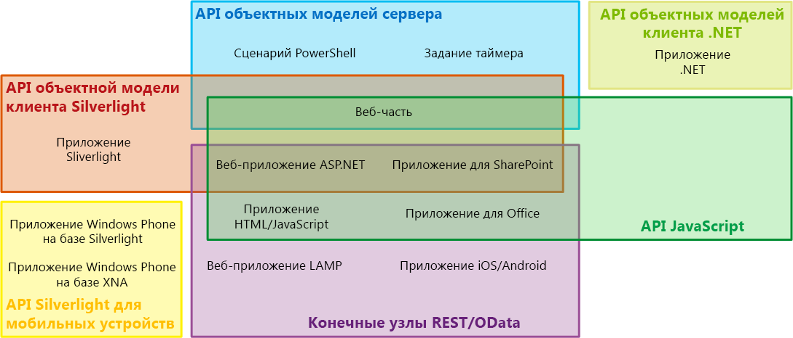
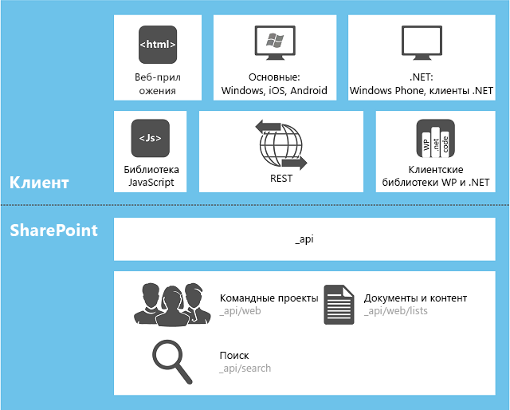

# Выбор правильного набора API в SharePointChoose the right API set in SharePoint
Сведения о нескольких наборах API, включенных в SharePoint, в том числе для серверной объектной модели, различных клиентских объектных моделей и веб-службы REST или OData.Learn about the several sets of APIs that are provided in SharePoint, including the server object model and the various client object models, and the REST/OData web service.
    
    

## Факторы, определяющие, какой набор API нужно использоватьFactors that determine which API set to use

Доступ к платформе SharePoint можно получить с помощью нескольких наборов интерфейсов API. Какой из них использовать, зависит от следующих факторов:You can choose from several sets of APIs to access the SharePoint platform. Which one you use depends on the following factors:
  
    
    

- **Тип приложения.** Можно использовать, помимо прочего, следующие не взаимоисключающие типы: Надстройка SharePoint, веб-часть на странице SharePoint, приложение Silverlight, которое запускается на клиентском компьютере или клиентском мобильном устройстве, приложение ASP.NET, которое представлено в SharePoint благодаря IFrame, код JavaScript, который выполняется на странице веб-сайта SharePoint, страница приложения SharePoint, приложение Microsoft .NET Framework, которое выполняется на клиентском компьютере, сценарий Windows PowerShell и задание таймера, которое выполняется на сервере SharePoint.**The type of application.** The possibilities include, but are not limited to, the following, which are not mutually exclusive categories: an SharePoint Add-in, a Web Part on a SharePoint page, a Silverlight application running on either a client computer or a client mobile device, an ASP.NET application exposed in SharePoint by an IFrame, JavaScript running in a SharePoint site page, a SharePoint application page, a Microsoft .NET Framework application running on a client computer, a Windows PowerShell script, and a timer job running on a SharePoint server.
    
  
- **Ваши навыки.** Вы удивитесь, но в SharePoint можно создавать приложения, не вникая особо в программирование для SharePoint. Можно сразу приступить к разработке приложений для SharePoint, имея опыт работы с одной из следующих моделей программирования:**Your existing skills.** To a surprising degree, you can create applications in SharePoint without needing to learn a lot about SharePoint programming. You can jump right into SharePoint development if you already have experience in any of the following programming models:
    
  - JavaScriptJavaScript
    
  
  - ASP.NETASP.NET
    
  
  - REST или ODataREST/OData
    
  
  - .NET Framework.NET Framework
    
  
  - Windows PhoneWindows Phone
    
  
  - SilverlightSilverlight
    
  
  - Windows PowerShellWindows PowerShell
    
  
- **Устройство, на котором выполняется код.** Можно использовать сервер фермы SharePoint, внешний сервер (например, облачный сервер), клиентский компьютер и мобильное устройство.**The device on which the code runs.** The possibilities include a server in the SharePoint farm, an external server such as a server in the cloud, a client computer, and a mobile device.
    
  
В этом разделе предлагается обзор различных наборов интерфейсов API, предоставляемых в SharePoint. На рисунке 1 показано, какие наборы интерфейсов API можно использовать для разработки каждого из 13 стандартных приложений для SharePoint. В большинстве случаев для этого доступны несколько интерфейсов API.This topic provides an overview of the various API sets that are provided by SharePoint. Figure 1 shows which sets of APIs can be used to develop each of 13 common SharePoint-related applications. For many applications, you can choose from more than one API.
  
    
    

**Рисунок 1. Выбранные типы расширений SharePoint и наборы интерфейсов API для SharePoint****Figure 1. Selected SharePoint extension types and SharePoint sets of APIs**

  
    
    

  
    
    

  
    
    

  
    
    
В таблице ниже представлены рекомендации о том, какой набор API использовать для списка выбранных стандартных проектов расширений SharePoint. В оставшихся разделах статьи описаны различные наборы интерфейсов API.The following table provides guidance on which set of APIs to use for a selected list of common SharePoint extensibility projects. The remaining sections of this topic describe the various sets of APIs.
  
    
    

|**Что нужно сделать****If you want to do this ...**|**Какой интерфейс API подойдет****... use these APIs**|
|:-----|:-----|
|Создать веб-приложение ASP.NET, выполняющее операции создания, чтения, обновления и удаления (CRUD) данных SharePoint или внешних данных, подключаемых в SharePoint через внешний тип контента Службы Microsoft Business Connectivity Services (BCS), с использованием брандмауэра.Create an ASP.NET web application that performs create/read/update/deleted (CRUD) operations across a firewall on SharePoint data or external data that is surfaced in SharePoint by a Microsoft Business Connectivity Services (BCS) external content type    |Клиентская объектная модель JavaScript.JavaScript client object model    |
|Создать веб-приложение ASP.NET, выполняющее операции CRUD с данными SharePoint или внешними данными, подключаемыми в SharePoint с использованием внешнего типа контента BCS, не вызывая SharePoint через брандмауэр.Create an ASP.NET web application that performs CRUD operations on SharePoint data or external data that is surfaced in SharePoint by a BCS external content type, but does not have to call SharePoint across a firewall    |Клиентская объектная модель .NET Framework или Silverlight, а также конечные точки REST или OData..NET Framework client object model, Silverlight client object model, or REST/OData endpoints    |
|Создать веб-приложение LAMP, выполняющее операции CRUD с данными SharePoint или внешними данными, подключаемыми в SharePoint с использованием внешнего типа контента BCS.Create a LAMP web application that performs CRUD operations on SharePoint data or external data that is surfaced in SharePoint by a BCS external content type    |Конечные точки REST или OData.REST/OData endpoints    |
|Создать приложение для Windows Phone, выполняющее операции CRUD с данными SharePoint.Create a Windows Phone app that performs CRUD operations on SharePoint data    |Клиентская объектная модель для мобильных устройств.Mobile client object model    |
|Создать приложение для Windows Phone, использующее службу push-уведомлений (Майкрософт), чтобы оповещать мобильное устройство о событиях в SharePoint.Create a Windows Phone app that uses the Microsoft Push Notification Service to alert the mobile device of events in SharePoint    |Клиентская объектная модель для мобильных устройств и серверная объектная модель.Mobile client object model and the server object model    |
|Создать приложение для iOS или Android, выполняющее операции CRUD с данными SharePoint.Create an iOS or Android app that performs CRUD operations on SharePoint data    |конечные точки REST и OData;REST/OData endpoints    |
|Создать приложение .NET Framework, выполняющее операции CRUD с данными SharePoint.Create a .NET Framework application that performs CRUD operations on SharePoint data    |Клиентская объектная модель .NET Framework..NET Framework client object model    |
|Создать приложение Silverlight, выполняющее операции CRUD с данными SharePoint.Create a Silverlight application that performs CRUD operations on SharePoint data    |Клиентская объектная модель SilverlightSilverlight client object model    |
|Создать приложение HTML или JavaScript, выполняющее операции CRUD с данными SharePoint.Create an HTML/JavaScript application that performs CRUD operations on SharePoint data    |Клиентская объектная модель JavaScript.JavaScript client object model    |
|Создать Надстройка Office, совместимое с SharePoint.Create an Office Add-in that works with SharePoint    |Клиентская объектная модель JavaScript.JavaScript client object model    |
|Создать пользовательскую команду Windows PowerShell.Create a custom Windows PowerShell command    |Объектная модель сервераServer object model    |
|Создать задание таймера.Create a timer job    |Серверная объектная модель.Server object model    |
|Создать расширение центра администрирования.Create an extension of Central Administration    |Серверная объектная модель.Server object model    |
|Создать единую фирменную символику для всей ферме SharePoint.Create consistent branding across an entire SharePoint farm    |Объектная модель сервераServer object model    |
|Создать пользовательскую веб-часть, страницу приложения или пользовательский элемент управления ASP.NET.Create a custom Web Part, application page, or ASP.NET user control    |Серверная объектная модельServer object model    **Важно!** Если функции, которые вы планируете предложить клиентам, не рассчитаны на администрирование с помощью SharePoint за пределами семейства веб-сайтов, то вместо использования серверной объектной модели рекомендуем создать надстройку SharePoint, включающую удаленное веб-приложение ASP.NET с необходимыми настраиваемыми веб-частями и пользовательскими элементами управления.If the functionality you want to offer customers is not oriented to SharePoint administration at a scope broader than site collection, we recommend that, instead of using the server object model, you create an SharePoint Add-in that includes a remote ASP.NET web application with custom Web Parts and user controls as needed. See the top two rows of this table. Обратите внимание на первые две строки этой таблицы.See the top two rows of this table.           |
   

## Серверная объектная модельServer object model

Серверная объектная модель управляемых классов содержит самый большой набор интерфейсов API. На уровне SharePoint Foundation 2013 в ее состав входят классы и элементы, обеспечивающие программный способ управления базовым сайтом, и структура списка SharePoint Foundation. Большая часть этих классов находится в пространстве имен  [Microsoft.SharePoint](https://msdn.microsoft.com/library/Microsoft.SharePoint.aspx) . Кроме того, с помощью серверной объектной модели можно расширить возможности практически каждого компонента SharePoint Foundation, в том числе рабочих процессов, оповещений, веб-частей, базового поиска и Службы Microsoft Business Connectivity Services (BCS). Серверная объектная модель также содержит расширенный набор интерфейсов API, чтобы обеспечить расширение возможностей системы администрирования и безопасности SharePoint Foundation, в том числе резервного копирования, диагностики работоспособности фермы, ведения журнала, управления веб-приложениями и фермой, обновления версии, развертывания, кэширования и настройки Windows PowerShell.The largest set of APIs is in the server object model of managed classes. At the level of SharePoint Foundation 2013, this object model includes classes and members that enable programmatic control of the basic site and list structure of SharePoint Foundation. Most of these classes are in the  [Microsoft.SharePoint](https://msdn.microsoft.com/library/Microsoft.SharePoint.aspx) namespace. In addition, you can extend almost every SharePoint Foundation component by using the server object model, including workflows, alerts, Web Parts, basic search, and Microsoft Business Connectivity Services (BCS). The server object model also includes an extensive set of APIs enable extensions of the administration and security system of SharePoint Foundation, including backup, farm health and diagnostics, logging, farm and web application management, upgrade, deployment, caching, and Windows PowerShell customization.
  
    
    
На уровне SharePoint добавляется намного больше классов для программирования управления корпоративным информационным содержимым (ECM), профилей пользователей, таксономии, расширенного поиска и других функций SharePoint.At the level of SharePoint Server 2013, many more classes are added to enable programming of Enterprise Content Management (ECM), user profiles, taxonomy, advanced search, and other features of SharePoint Server 2013.
  
    
    
Можно использовать  [LINQ to Objects](http://msdn.microsoft.com/ru-ru/library/bb397919.aspx), чтобы отправлять запросы к любой коллекции **IEnumerable**, но  [Поставщик LINQ to SharePoint](http://msdn.microsoft.com/library/3fa2dc5f-d308-4337-aefd-191a5df8dbbe%28Office.15%29.aspx) позволяет отправлять прямые запросы к спискам в базах данных контента SharePoint. Строго говоря, этот поставщик недоступен в случае любого другого набора интерфейсов API, упомянутого в этой статье. Но использование синтаксиса LINQ возможно с большинством других наборов.You can use  [LINQ to Objects](http://msdn.microsoft.com/ru-ru/library/bb397919.aspx) to query any **IEnumerable** collection in memory, but a [LINQ to SharePoint provider](http://msdn.microsoft.com/library/3fa2dc5f-d308-4337-aefd-191a5df8dbbe%28Office.15%29.aspx) enables direct querying of the lists in the SharePoint content databases. Strictly speaking, this provider is not available with any other set of APIs discussed in this topic; however, there are ways to use LINQ syntax in most of the others.
  
    
    
Сборки, определяющие встроенные серверные классы, устанавливаются в глобальный кэш сборок каждого сервера при установке SharePoint. Когда программирование выполняется для серверной объектной модели, сборки устанавливаются как решения ферм в глобальный кэш сборок.The assemblies that define the built-in server-side classes are installed to the global assembly cache of each server when SharePoint is installed. When you program against the server object model, your assemblies are installed as farm solutions to the global assembly cache.
  
    
    

> **Примечание.** Вместо новых изолированных решений в SharePoint теперь рекомендуется разрабатывать надстройки SharePoint, но изолированные решения все еще можно устанавливать в семействах веб-сайтов в SharePoint.**Note:** Developing new sandboxed solutions against SharePoint is deprecated in favor of developing SharePoint Add-ins, but sandboxed solutions can still be installed to site collections on SharePoint. Сборки этих решений остаются в пакете, пока они не используются. При использовании они временно устанавливаются в папке на сервере.Developing new spusercode against sp15allshort is deprecated in favor of developing spappplural, but spusercode can still be installed to site collections on sp15allshort. The assemblies of these solutions remain in the package except when they are actually in use, at which time they are temporarily installed to a folder on the server. For more information, see Where are Assemblies in Sandboxed Solutions Deployed?. Дополнительные сведения см. в статье [Где развертываются сборки изолированных решений?](http://msdn.microsoft.com/library/dadbb20b-1bf7-442c-9eeb-bd9f01dbda45%28Office.15%29.aspx).For more information, see  [Where are Assemblies in Sandboxed Solutions Deployed?](http://msdn.microsoft.com/library/dadbb20b-1bf7-442c-9eeb-bd9f01dbda45%28Office.15%29.aspx). 
  
    
    

### Ограничения на использование серверной объектной моделиLimitations on when you can use the server object model

Настраиваемая логика Надстройки SharePoint всегда распространяется "вниз" (к клиенту), "вверх" (в облако) или "через" (к определенному серверу, не входящему в ферму SharePoint). Во всех этих моделях распространения необходимо использовать одну из клиентских объектных моделей либо конечные точки REST или OData. (Вы не можете использовать серверную объектную модель в Надстройка SharePoint.) Например, если приложение содержит страницы с размещением в SharePoint, они могут получать доступ к данным SharePoint с помощью клиентской объектной модели JavaScript. На таких страницах также могут быть представлены приложения Silverlight, использующие клиентскую объектную модель Silverlight SharePoint. Дополнительные сведения о Надстройки SharePoint см. в статье  [Важные аспекты архитектуры и разработки надстройки SharePoint](http://msdn.microsoft.com/library/ae96572b-8f06-4fd3-854f-fc312f7f2d88%28Office.15%29.aspx).Custom logic in SharePoint Add-ins is always distributed "down" to the client or "up" to the cloud (or "over" to some server outside the SharePoint farm). In all of these distribution models, one of the client object models or the REST/OData endpoints must be used. (You cannot use the server object model in an SharePoint Add-in.) For example, if the app contains SharePoint-hosted pages, those pages can access SharePoint data by using the JavaScript client object model. Such pages could also expose Silverlight applications that use the SharePoint Silverlight client object model. For more information about SharePoint Add-ins, see  [Important aspects of the SharePoint Add-in architecture and development landscape](http://msdn.microsoft.com/library/ae96572b-8f06-4fd3-854f-fc312f7f2d88%28Office.15%29.aspx).
  
    
    

## Клиентские объектные модели для управляемого кодаClient object models for managed code

В SharePoint используются три клиентские объектные модели для управляемого кода: Silverlight, .NET и модель для мобильных устройств.SharePoint has three client object models for managed code: .NET, Silverlight, and mobile.
  
    
    

### Клиентская объектная модель .NET.NET client object model

Объектная модель SharePoint для .NET Framework используется в приложениях .NET Framework, которые работают с клиентом Windows, отличном от телефона. Таким клиентом можно считать любое из следующих устройств:The SharePoint object model for .NET Framework is used in .NET Framework applications that run on a non-phone Windows client. Any of the following counts as such a client:
  
    
    

- компьютер пользователя;A user's computer
    
  
- сервер, не входящий в ферму SharePoint;A server that is external to the SharePoint farm
    
  
- веб-роль или рабочая роль в Microsoft Azure;A web role or worker role on Microsoft Azure
    
  
Практически каждому классу на основном сайте и в объектной модели сервера списков соответствует класс в клиентской объектной модели .NET Framework.Almost every class in the core site and list server object model has a corresponding class in the .NET Framework client object model. Кроме того, клиентская объектная модель .NET Framework предоставляет полный набор API для расширения других компонентов, включая некоторые функции SharePoint, например ECM, таксономию, профили пользователей, расширенный поиск, аналитика, службы BCS и другие.Almost every class in the core site and list server object model has a corresponding class in the .NET Framework client object model. In addition, the .NET Framework client object model exposes a full set of APIs for extending other features, including some SharePoint Server 2013 features such as ECM, taxonomy, user profiles, advanced search, analytics, BCS, and others.
  
    
    
Для повышения производительности строки кода, написанные с помощью клиентской объектной модели .NET Framework, отправляются на сервер SharePoint в виде пакетов. Там эти строки преобразовываются в серверный код, который выполняется. Затем запрашиваемые результаты и информация о новом состоянии всех переменных возвращаются клиенту. Как разработчик вы определяете, будет ли код пакета выполняться синхронно или асинхронно. (В случае синхронного выполнения приложение .NET Framework сначала подождет, пока будут возвращены результаты с сервера. При асинхронном выполнении сразу же продолжится обработка на стороне клиента, а пользовательский интерфейс не перестанет отвечать.)To improve performance, lines of code written against in the .NET Framework client object model are sent to the SharePoint server in batches where they are converted to server-side code and executed. The queried results, and the new state of all variables, are then returned to the client. You as the developer determine whether a batch runs synchronously or asynchronously. (In a synchronous batch, the .NET Framework application waits for the returned results from the server before continuing; in an asynchronous batch, client-side processing continues immediately and the client user interface (UI) remains responsive.)
  
    
    
Чтобы запрашивать любой объект **IEnumerable**, в том числе объекты SharePoint, которые реализуют **IEnumerable**, вы можете использовать синтаксис запросов LINQ в клиентском коде. Но для этого необходимо использовать  [LINQ to Objects](http://msdn.microsoft.com/ru-ru/library/bb397919.aspx), а не  [поставщик LINQ to SharePoint](http://msdn.microsoft.com/library/3fa2dc5f-d308-4337-aefd-191a5df8dbbe%28Office.15%29.aspx), так как документация последнего не подходит для клиентского кода.You can use LINQ query syntax in your client code to query any **IEnumerable** object, including SharePoint objects that implement **IEnumerable**. However, when you do this, you are using  [LINQ to Objects](http://msdn.microsoft.com/ru-ru/library/bb397919.aspx), not the  [LINQ to SharePoint provider](http://msdn.microsoft.com/library/3fa2dc5f-d308-4337-aefd-191a5df8dbbe%28Office.15%29.aspx), so documentation of the latter is not relevant to client-side code.
  
    
    
Сборки для клиентской объектной модели .NET Framework должны устанавливаться на клиенте. Они входят в состав распространяемого пакета, который можно получить на странице  [Клиентские компоненты SharePoint](http://www.microsoft.com/en-us/download/details.aspx?id=35585).The assemblies for the .NET Framework client object model must be installed on the client. They are included in a redistributable package that you can obtain on the  [SharePoint Client Components](http://www.microsoft.com/en-us/download/details.aspx?id=35585).
  
    
    
Примеры использования объектной модели .NET Framework см. в статье [Выполнение базовых операций с использованием кода библиотеки клиента в SharePoint](http://msdn.microsoft.com/library/5a69c9e3-73bf-4ed5-bc19-182056bdb394%28Office.15%29.aspx).For examples of using the .NET Framework object model, see  [Complete basic operations using SharePoint client library code](http://msdn.microsoft.com/library/5a69c9e3-73bf-4ed5-bc19-182056bdb394%28Office.15%29.aspx).
  
    
    

> **Примечание.** Вы также можете использовать конечные точки SharePoint REST или OData в приложении .NET Framework.**Note:** You can also use the SharePoint REST/OData endpoints in a .NET Framework application. Сравнение клиентской объектной модели .NET Framework с конечными точками SharePoint REST и OData представлено в разделе [Конечные точки REST и OData](#RESTOData) далее в этой статье.Note You can also use the SharePoint REST/OData endpoints in a .NET Framework application. For a comparison of the .NET Framework client object model with the SharePoint REST/OData endpoints, see the section  [REST/OData endpoints](#RESTOData) later in this article.
  
    
    

### Клиентская объектная модель SilverlightSilverlight client object model

Объектная модель SharePoint для Silverlight используется в приложениях Silverlight независимо от места сохранения компилированного XAP-файла. Это может быть библиотека на веб-сайте SharePoint, на клиентском компьютере, в облачном хранилище или на внешнем сервере. Обычно приложение Silverlight подключается в SharePoint в объекте  [SilverlightWebPart](https://msdn.microsoft.com/library/Microsoft.SharePoint.WebPartPages.SilverlightWebPart.aspx) . Клиентская объектная модель Silverlight в SharePoint практически идентична клиентской объектной модели .NET Framework и предусматривает поддержку тех же областей расширений. Главное отличие состоит в том, что в версии Silverlight все пакеты команд отправляются на сервер асинхронно, чтобы элементы пользовательского интерфейса приложения оставались активны.The SharePoint object model for Silverlight is used in Silverlight applications, regardless of where the compiled .xap file is persisted. It may be in an assets library on a SharePoint website, on a client computer, in cloud storage, or on an external server. Typically, a Silverlight application is surfaced in SharePoint in a  [SilverlightWebPart](https://msdn.microsoft.com/library/Microsoft.SharePoint.WebPartPages.SilverlightWebPart.aspx) object. The Silverlight client object model in SharePoint is nearly identical to the .NET Framework client object model, and it includes support for the same extensibility areas. The principal difference is that in the Silverlight version, all batches of commands are sent to the server asynchronously so that the UI of the application remains active.
  
    
    
Сборки для клиентской объектной модели Silverlight сохраняются на каждом сервере SharePoint в папке %ProgramFiles%\\Common Files\\Microsoft Shared\\web server extensions\\15\\TEMPLATE\\LAYOUTS\\ClientBin. Их не нужно устанавливать на компьютер, на котором установлено приложение Silverlight, хотя это предусмотрено. Кроме того, вы их можете сохранить в XAP-файл приложения.The assemblies for the Silverlight client object model are persisted on every SharePoint server at %ProgramFiles%\\Common Files\\Microsoft Shared\\web server extensions\\15\\TEMPLATE\\LAYOUTS\\ClientBin. They do not have to be installed on the computer that is running the Silverlight application, although you have the option of doing so. Also, you can package them into the .xap file of the application.
  
    
    
XAP-файлы Silverlight можно включить в Надстройки SharePoint, в том числе в приложения с размещением в SharePoint. В последнем случае выполняется развертывание XAP-файла в библиотеке на сайте приложения. (Дополнительные сведения о сайтах приложения см в статье  [Хост-сайты, сайты надстроек и компоненты SharePoint в SharePoint](http://msdn.microsoft.com/library/b791cdf5-8aa2-47fa-bc4c-aee437354759%28Office.15%29.aspx).) Поэтому благодаря приложению Silverlight можно включить настраиваемый код SharePoint в состав любого приложения, так как настраиваемый серверный код недопустим в Надстройки SharePoint. Это также позволяет разработчикам Silverlight использовать свои навыки для создания приложений SharePoint, почти не тратя время на обучение.Silverlight .xap files can be included in SharePoint Add-ins, including SharePoint-hosted apps. In the latter case, the .xap file is deployed to a library on the app web. (For more information about app webs, see  [Host webs, add-in webs, and SharePoint components in SharePoint](http://msdn.microsoft.com/library/b791cdf5-8aa2-47fa-bc4c-aee437354759%28Office.15%29.aspx).) This makes a Silverlight application a useful way of including custom SharePoint code in an app, because custom server-side code is not allowed in SharePoint Add-ins. It also enables Silverlight developers to use their existing skills to create SharePoint applications with a minimal learning curve.
  
    
    

> **Примечание.** Вы также можете использовать конечные точки SharePoint REST или OData в приложении Silverlight.**Note:** You can also use the SharePoint REST/OData endpoints in a Silverlight application. Сравнение клиентской объектной модели Silverlight с конечными точками SharePoint REST и OData представлено в разделе [Конечные точки REST и OData](#RESTOData) далее в этой статье.Note You can also use the SharePoint REST/OData endpoints in a Silverlight application. For a comparison of the Silverlight client object model with the SharePoint REST/OData endpoints, see the section  [REST/OData endpoints](#RESTOData) later in this article.
  
    
    

### Объектная модель для мобильных устройствMobile object model

Специальная версия клиентской объектной модели Silverlight доступна для устройств Windows Phone. Она содержит дополнительные интерфейсы API, которые подходят только для телефонов. Например, интерфейсы API, позволяющие регистрацию телефона для получения сообщений службы push-уведомлений (Майкрософт). Эта модель поддерживает все основные функции SharePoint. Но поддержка не распространяется на дополнительные расширения, которые поддерживаются двумя другими клиентскими объектными моделями для управляемого кода. Для доступа к этим дополнительным функциям используйте конечные точки REST или OData SharePoint в мобильном приложении. См. раздел  [Конечные точки REST или OData](#RESTOData) далее в этой статье.A special version of the Silverlight client object model is available for Windows Phone devices. It includes some additional APIs that are relevant only to telephones, such as APIs that enable a phone app to register for notifications from the Microsoft Push Notification Service. It supports all core SharePoint functionality; however, it does not provide support for any of the non-core extensibility areas that are supported by the other two client object models for managed code. To access those additional areas, use the SharePoint REST/OData endpoints in your mobile app. See the section  [REST/OData endpoints](#RESTOData) later in this article.
  
    
    
Сборки для объектной модели для мобильных устройств сохраняются на каждом сервере SharePoint в папке %ProgramFiles%\\Common Files\\Microsoft Shared\\web server extensions\\15\\TEMPLATE\\LAYOUTS\\ClientBin. Их необходимо поместить в XAP-файл приложения для Windows Phone.The assemblies for the mobile object model are persisted on every SharePoint server at %ProgramFiles%\\Common Files\\Microsoft Shared\\web server extensions\\15\\TEMPLATE\\LAYOUTS\\ClientBin. You package them into the .xap file of your Windows Phone application.
  
    
    

## Объектная модель JavaScriptJavaScript object model

В SharePoint предоставлена объектная модель JavaScript, которую можно использовать во встроенном сценарии или отдельных JS-файлах. В ней предусмотрены те же функции, что и в клиентских объектных моделях .NET Framework и Silverlight. Как и клиентская объектная модель Silverlight, объектная модель JavaScript позволяет включить настраиваемый код SharePoint в состав любого приложения, так как настраиваемый код недопустим в Надстройки SharePoint. Это также позволяет веб-разработчикам использовать свои навыки работы с JavaScript, чтобы создавать приложения для SharePoint, почти не тратя время на обучение.SharePoint provides a JavaScript object model for use in either inline script or separate .js files. It includes all the same functionality as the .NET Framework and Silverlight client object models. Like the Silverlight client object model, the JavaScript object model is a useful way of including custom SharePoint code in an app, because custom server-side code is not allowed in SharePoint Add-ins. It also enables web developers to use their existing JavaScript skills to create SharePoint applications with a minimal learning curve.
  
    
    
Как и клиентские объектные модели для управляемого кода, инфраструктура JavaScript для SharePoint взаимодействует с серверами фермы с помощью пакетов с кодом, который всегда выполняется асинхронно. Кроме того, сейчас возможно получать доступ к данным SharePoint на разных доменах с помощью JavaScript (но только к данным одного и того же родительского семейства веб-сайтов), что было недопустимо в предыдущих версиях SharePoint. Дополнительные сведения см. в статье  [Обращение к данным SharePoint из надстроек с помощью междоменной библиотеки](http://msdn.microsoft.com/library/bc37ff5c-1285-40af-98ae-01286696242d%28Office.15%29.aspx). Данные возвращаются с сервера с помощью Нотация объектов JavaScript (JSON).Just like the managed-code client object models, the JavaScript infrastructure for SharePoint interacts with the farm servers in batches. These batches always run asynchronously. In addition, it is now possible to access SharePoint data across domains in JavaScript (but only data that is within the same parent site collection), which was not allowed in previous versions of SharePoint. For more information, see  [Access SharePoint data from add-ins using the cross-domain library](http://msdn.microsoft.com/library/bc37ff5c-1285-40af-98ae-01286696242d%28Office.15%29.aspx). Data is returned from the server in JavaScript Object Notation (JSON).
  
    
    
Объектная модель JavaScript определяется в наборе JS-файлов, размещенных в папке %ProgramFiles%\\Common Files\\Microsoft Shared\\web server extensions\\15\\TEMPLATE\\LAYOUTS на каждом сервере.The JavaScript object model is defined in a set of *.js files located at %ProgramFiles%\\Common Files\\Microsoft Shared\\web server extensions\\15\\TEMPLATE\\LAYOUTS on each server.
  
    
    
Примеры использования объектной модели .NET Framework см. в статье [Выполнение базовых операций с использованием кода библиотеки JavaScript в SharePoint](http://msdn.microsoft.com/library/29089af8-dbc0-49b7-a1a0-9e311f49c826%28Office.15%29.aspx).For examples of using the .NET Framework object model, see  [Complete basic operations using JavaScript library code in SharePoint](http://msdn.microsoft.com/library/29089af8-dbc0-49b7-a1a0-9e311f49c826%28Office.15%29.aspx).
  
    
    

> **Примечание.** Вы также можете использовать конечные точки SharePoint REST или OData в приложении JavaScript.**Note:** You can also use the SharePoint REST/OData endpoints in a JavaScript application. Сравнение клиентской объектной модели JavaScript с конечными точками REST и OData в SharePoint представлено в следующем разделе, [Конечные точки REST и OData](#RESTOData).Note You can also use the SharePoint REST/OData endpoints in a JavaScript application. For a comparison of the JavaScript client object model with SharePoint's REST/OData endpoints, see the following section,  [REST/OData endpoints](#RESTOData). 
  
    
    

## Конечные точки REST и ODataREST/OData endpoints

В случае сценариев, при которых необходимо получить доступ к объектам SharePoint со стороны клиентских технологий, которые не используют JavaScript и не созданы на платформах .NET Framework или Silverlight, SharePoint обеспечивает реализацию веб-службы передачи репрезентативного состояния (REST), использующей  [протокол ODatal](http://www.odata.org/) для выполнения операций CRUD с данными списков SharePoint. Кроме того, почти каждый интерфейс API клиентской объектной модели имеет соответствующую конечную точку REST. Это позволяет коду напрямую взаимодействовать с артефактами SharePoint с помощью любой технологии, поддерживающей стандартные HTTP-запросы и отклики. Чтобы использовать возможности REST, встроенные в SharePoint, код создает запрос RESTful HTTP для конечной точки, соответствующей необходимому интерфейсу API клиентской объектной модели. Веб-служба client.svc обрабатывает HTTP-запрос и направляет отклик в формате Atom или JSON.For scenarios in which you need to access SharePoint entities from client technologies that do not use JavaScript and are not built on the .NET Framework or Silverlight platforms, SharePoint provides an implementation of a Representational State Transfer (REST) web service that uses the  [OData protocol](http://www.odata.org/) to perform CRUD operations on SharePoint list data. In addition, almost every API in the client object models has a corresponding REST endpoint. This enables your code to interact directly with SharePoint artifacts by using any technology that supports standard HTTP requests and responses. To use the REST capabilities that are built into SharePoint, your code constructs a RESTful HTTP request to an endpoint that corresponds to the desired client object model API. The client.svc web service handles the HTTP request and serves a response in either Atom or JSON format.
  
    
    
Дополнительные сведения об использовании веб-службы REST или OData см. в статье  [Программирование с использованием службы SharePoint REST](http://msdn.microsoft.com/library/d4b5c277-ed50-420c-8a9b-860342284b72%28Office.15%29.aspx), примеры  в статье  [Выполнение базовых операций с использованием конечных точек SharePoint REST](http://msdn.microsoft.com/library/e3000415-50a0-426e-b304-b7de18f2f7d9%28Office.15%29.aspx).For more information about using the REST/OData web service, see the node  [Use OData query operations in SharePoint REST requests](http://msdn.microsoft.com/library/d4b5c277-ed50-420c-8a9b-860342284b72%28Office.15%29.aspx); for examples, see the topic  [Complete basic operations using SharePoint REST endpoints](http://msdn.microsoft.com/library/e3000415-50a0-426e-b304-b7de18f2f7d9%28Office.15%29.aspx).
  
    
    

### Сравнение программирования с помощью REST или OData с программированием с помощью клиентской объектной моделиComparing REST/OData programming with client object model programming

В некоторых случаях, возможно, лучше использовать конечные точки REST даже в приложениях, для которых доступна объектная модель SharePoint. Это в первую очередь касается разработчиков, не имеющих опыта разработки для Windows. В таблице ниже сравниваются основные функции этих типов программирования при создании приложения на платформе Windows или платформе, поддерживающей JavaScript.In some situations, it might be preferable to use the REST endpoints even in applications for which a SharePoint object model is available, especially for developers who do not have Windows development experience. The following table provides a comparison of the major features of these programming choices for a developer creating an application on a Windows platform or with a platform that supports JavaScript.
  
    
    

|**Функция****Feature**|**Объектная модель .NET Framework или Silverlight****.NET Framework or Silverlight object models**|**Объектная модель JavaScript****JavaScript object model**|**Конечные точки REST или OData, вызываемые с помощью платформы Windows или JavaScript****REST/OData endpoints called from a Windows platform or JavaScript**|
|:-----|:-----|:-----|:-----|
|Объектно-ориентированное программированиеObject-oriented programming    |ДаYes    |ДаYes    |НетNo    |
|Пакетная обработкаBatch processing    |ДаYes    |ДаYes    |ДаYes    |
|Интерфейсы API для условной обработки и обработки исключенийAPIs for conditional processing and exception handling    |ДаYes    |НетNo    |НетNo    |
|Доступность синтаксиса LINQAvailability of LINQ syntax    |ДаYes    |НетNo    |НетNo    |
|Объединение данных списков из различных веб-приложений SharePointCombining list data from different SharePoint web applications    |ДаYes    |НетNo    |ДаYes    |
|Знание разработчиками, использующим REST или ODataFamiliarity to experienced REST/OData developers    |НетNo    |НетNo    |ДаYes    |
|Сходство с программированием не для Windows или с помощью JavaScriptSimilarity to non-Windows programming or JavaScript programming    |НетNo    |ДаYes    |ДаYes    |
|Строгая типизация полей элементов спискаStrong typing for list item fields    |Нет (если не использовать LINQ)No (except with LINQ)    |НетNo    |Да (в случае платформы Windows)          Нет (в случае JavaScript)Yes, from Windows platform          No, from JavaScript    |
|Использование jQuery, Knockout и других библиотек JavaScriptLeveraging jQuery, Knockout, and other JavaScript libraries    |НетNo    |ДаYes    |Нет (в случае платформы Windows)          Да (в случае JavaScript)No, from Windows platform          Yes, from JavaScript    |
   

## Платформа WCF Data ServicesWCF Data Services Framework

Предпочитаете использовать синтаксис LINQ в клиентских приложениях .NET Framework или Silverlight? SharePoint поддерживает  [WCF Data Services](http://msdn.microsoft.com/ru-ru/library/cc668792.aspx) как поставщика LINQ. Можно ориентироваться на файл listdata.svc для доступа к данным списка, как в ранних версиях SharePoint Foundation, или на тот же файл client.svc, который поддерживает интерфейс OData, чтобы получить доступ ко всем объектам SharePoint (в дополнение к данным списка). Дополнительные сведения см. в статье [Запрос SharePoint Foundation с помощью служб данных ADO.NET](http://msdn.microsoft.com/library/3e3e16f7-620a-4710-a3f3-19d0236f4b4a%28Office.15%29.aspx).If you prefer to use LINQ syntax in .NET Framework or Silverlight client applications, SharePoint supports  [WCF Data Services](http://msdn.microsoft.com/ru-ru/library/cc668792.aspx) as a LINQ provider. You can target either the listdata.svc (for list data only) as in earlier versions of SharePoint Foundation, or you can target the same client.svc that supports the OData interface for access to all SharePoint entities in addition to list data. For more information, see [Query SharePoint Foundation with ADO.NET Data Services](http://msdn.microsoft.com/library/3e3e16f7-620a-4710-a3f3-19d0236f4b4a%28Office.15%29.aspx).
  
    
    
На рисунке 2 показаны отношения между различными клиентскими интерфейсами API, клиентскими приложениями и SharePoint. URL-адреса _api*  URL-адреса конечных точек REST, связанные с фермой. Дополнительные сведения см. в статье  [Дополнительные сведения о службе REST в SharePoint 15](http://msdn.microsoft.com/library/2de035a0-ac75-43bd-9665-5c5a59c4c590%28Office.15%29.aspx#bk_learnmore).Figure 2 illustrates the relationship of the various client APIs, various types of client applications, and SharePoint. The various _api* URLs are the farm-relative URLs for the REST endpoints. For more information, see the topic  [Learning more about the SharePoint 15 REST service](http://msdn.microsoft.com/library/2de035a0-ac75-43bd-9665-5c5a59c4c590%28Office.15%29.aspx#bk_learnmore).
  
    
    

**Рисунок 2. Клиентские приложения и интерфейсы API в SharePoint****Figure 2. Client applications and APIs in SharePoint**

  
    
    

  
    
    

  
    
    

  
    
    

  
    
    

## Нерекомендуемые наборы интерфейсов APIDeprecated API sets

Платформа SharePoint до сих пор поддерживает обратную совместимость двух наборов API, но мы не рекомендуем их использовать в новых проектах. Эти наборы относятся к  [веб-службам ASP.NET (asmx)](http://msdn.microsoft.com/library/c587ee90-1f88-43f3-b1a7-5f3072d038f8%28Office.15%29.aspx) и [прямым RPC-вызовам файла owssvr.dll](http://msdn.microsoft.com/library/4aa5c82b-90fb-4be5-b30c-d35ecae42a81%28Office.15%29.aspx).Two API sets are still supported in the SharePoint framework for backward compatibility, but we recommend that you not use them for new projects: the  [ASP.NET (asmx) web services](http://msdn.microsoft.com/library/c587ee90-1f88-43f3-b1a7-5f3072d038f8%28Office.15%29.aspx), and  [direct Remote Procedure Calls (RPC) calls to the owssvr.dll](http://msdn.microsoft.com/library/4aa5c82b-90fb-4be5-b30c-d35ecae42a81%28Office.15%29.aspx) file.
  
    
    

## Дополнительные ресурсыAdditional resources

-  [Обзор разработки решений с помощью SharePointSharePoint development overview](sharepoint-development-overview.md)
    
  
-  [Модели программирования в SharePointProgramming models in SharePoint](programming-models-in-sharepoint.md)
    
  
-  [Сравнение надстроек SharePoint с решениями SharePointSharePoint Add-ins compared with SharePoint solutions](sharepoint-add-ins-compared-with-sharepoint-solutions.md)
    
  
-  [Программирование с использованием службы SharePoint RESTUse OData query operations in SharePoint REST requests](http://msdn.microsoft.com/library/d4b5c277-ed50-420c-8a9b-860342284b72%28Office.15%29.aspx)
    
  
-  [Выполнение базовых операций с использованием конечных точек SharePoint RESTComplete basic operations using SharePoint REST endpoints](http://msdn.microsoft.com/library/e3000415-50a0-426e-b304-b7de18f2f7d9%28Office.15%29.aspx)
    
  
-  [Выполнение базовых операций с использованием кода библиотеки клиента в SharePointComplete basic operations using SharePoint client library code](http://msdn.microsoft.com/library/5a69c9e3-73bf-4ed5-bc19-182056bdb394%28Office.15%29.aspx)
    
  
-  [Выполнение базовых операций с использованием кода библиотеки JavaScript в SharePointComplete basic operations using JavaScript library code in SharePoint](http://msdn.microsoft.com/library/29089af8-dbc0-49b7-a1a0-9e311f49c826%28Office.15%29.aspx)
    
  
-  [Запрос SharePoint Foundation с помощью служб данных ADO.NETQuery SharePoint Foundation with ADO.NET Data Services](http://msdn.microsoft.com/library/3e3e16f7-620a-4710-a3f3-19d0236f4b4a%28Office.15%29.aspx)
    
  

  
    
    
