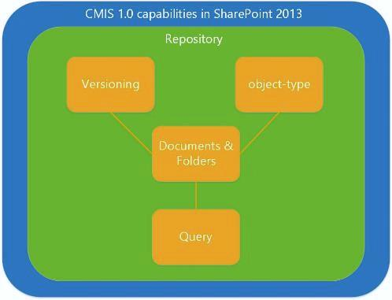

# Служб взаимодействия управления контентом (CMIS) в SharePointContent Management Interoperability Services (CMIS) in SharePoint
Сведения о реализации SharePoint версии 1.0 из OASIS контента управления взаимодействия служб (CMIS) standard.Learn about the SharePoint implementation of version 1.0 of the OASIS Content Management Interoperability Services (CMIS) standard.
## Общие сведения о CMIS в SharePointIntroduction to CMIS in SharePoint

Соответствие требованиям SharePoint Server с версией 1.0 [OASIS содержимое управления взаимодействия служб (CMIS) standard](https://www.oasis-open.org/committees/tc_home.php?wg_abbrev=cmis) обеспечивает интеграцию репозиториев контента SharePoint Server и других Управление корпоративным информационным содержимым (ECM) репозитории на предприятии.SharePoint Server compliance with version 1.0 of the  [OASIS Content Management Interoperability Services (CMIS) standard](https://www.oasis-open.org/committees/tc_home.php?wg_abbrev=cmis) enables integration between SharePoint Server content repositories and other enterprise content management (ECM) repositories in an enterprise. CMIS включает сведения, которые могут совместно использоваться протоколы Интернета между и между системами документов, издателей и репозиториям, в рамках предприятия и компании — все в формате зависящего от поставщика.CMIS enables information to be shared across Internet protocols among and between document systems, publishers, and repositories, within the enterprise, and between companies—all in a vendor-neutral format. Стандарт CMIS поддерживает управление базовой документов, такие как создание операций, чтение, обновление, удаление, возврат и извлечение. Стандарт поддерживает управление версиями документов и их метаданных.The CMIS standard supports basic document management operations such as create, read, update, delete, check in, and check out. The standard supports managing versions of documents and their metadata. CMIS доступен на любой сайт SharePoint в локальной после активации компонента **Producer контента служб взаимодействия управления (CMIS)** в разделе **Управление компонентами сайта** **Параметры сайта**.CMIS is available on any on-premises SharePoint site after the **Content Management Interoperability Services (CMIS) Producer** feature is activated in the **Manage Site Features** section of **Site Settings**. В SharePoint SharePoint CMIS Producer доступен но отключена по умолчанию на все локальные сайты.In SharePoint, the SharePoint CMIS Producer is available but turned off by default on all on-premises sites.
  
    
    
CMIS обеспечивает взаимодействие между API-интерфейсы, поддерживает ее, но не заменяет для собственных API. Объекты, которые поддерживает CMIS пересекаются с объектами, с которыми разработчики SharePoint Server часто работать, включая документов и папок. Однако разработчики приложений, которые поддерживают CMIS, скорее всего, будет продолжать написание кода настраиваемого SharePoint Server. CMIS можно сохранить 60-70 процентов времени разработки для решений, реализующих его, рассмотрите ее, но при этом еще одно средство на панели элементов разработки.CMIS provides interoperability between the APIs that support it, but it is not a replacement for native APIs. The objects that CMIS supports intersect with objects that SharePoint Server developers commonly interact with, including documents and folders. But, developers writing applications that support CMIS will likely have to continue writing custom SharePoint Server code. CMIS can save 60-70 percent of development time for solutions that implement it—consider it yet another tool in the development toolbox.
  
    
    

## Подробное описание реализации CMIS в SharePointA detailed look at the CMIS implementation in SharePoint

Некоторые части спецификации CMIS являются обязательными, но многие другие являются необязательными.Some parts of the CMIS spec are mandatory, but many others are optional. Многие поставщики, включая Microsoft, реализовать обязательные части стандартных и некоторые его необязательные компоненты.Many vendors, including Microsoft, implement the mandatory portions of the standard and some of its optional components. На рисунке 1 показана возможности, указанные в спецификации CMIS 1.0, реализованных в SharePoint.Figure 1 shows capabilities specified in the CMIS 1.0 specification that are implemented in SharePoint.
  
    
    
Рис. 1.Figure 1. Возможности CMIS 1.0, реализованные в SharePoint.CMIS 1.0 capabilities implemented in SharePoint.
  
    
    

  
    
    

  
    
    
Модель данных CMIS определяет репозитория, который содержит другие типы данных CMIS, включая типы объектов, управление версиями, документов и папок и функционирования запросов.The CMIS data model defines a repository that contains the other CMIS data types, including object-types, versioning, documents and folders, and query functionality.
  
    
    

### Репозитории CMIS и библиотеки документов SharePointCMIS repositories and SharePoint document libraries

Репозиторий CMIS является контейнером для остальных CMIS модели данных.The CMIS repository is the container for the rest of the CMIS data model. В SharePoint библиотеки документов эквивалентно репозитория CMIS (списков не поддерживаются в SharePoint CMIS Producer).In SharePoint, the document library is equivalent to the CMIS repository (lists are not supported in the SharePoint CMIS Producer). Доступ к репозиторию обычно является точка запуска клиентского приложения.Accessing the repository is usually the launching point for a client application. Например рассмотрим сайта SharePoint Server, содержащий несколько библиотеки документов, которые эквивалентны репозиториев в CMIS.For example, consider a SharePoint Server site that contains multiple document libraries, which are equivalent to repositories in CMIS. Спецификация CMIS описаны обязательные службы **getRepositories**, который в SharePoint Server получает все допустимые хранилищ (библиотек документов) в текущий объект [SPWeb](https://msdn.microsoft.com/library/Microsoft.SharePoint.SPWeb.aspx) .The CMIS specification describes a mandatory service, **getRepositories**, that in SharePoint Server obtains all of the valid repositories (document libraries) in the current  [SPWeb](https://msdn.microsoft.com/library/Microsoft.SharePoint.SPWeb.aspx) object. Разработчик может подключаться к репозиториям, вызвав **getRepositories** службы или службы **getRepositoryInfo** ; **getRepositoryInfo** получает указанный репозиторий разработчиком.A developer can connect to repositories by calling either the **getRepositories** service or the **getRepositoryInfo** service; **getRepositoryInfo** obtains the repository specified by the developer.
  
    
    
Репозиторий CMIS содержит другие возможности CMIS, которые указаны поддерживает SharePoint Server, включая объект типы документов и папок с CMIS, возможности управления версиями CMIS (которые зеркально возможности собственный управления версиями в SharePoint Server ) и возможность запроса CMIS, которая использует синтаксис SQL для запроса CMIS репозиториев для определенных данных.The CMIS repository contains the other CMIS capabilities that SharePoint Server supports, including the document and folder object-types specified by CMIS, CMIS versioning capabilities (which mirror the native versioning capabilities in SharePoint Server), and the CMIS query capability, which uses a SQL-like syntax to query CMIS repositories for specific data.
  
    
    

### CMIS документы, папки и другие типы объектовCMIS documents, folders, and other object types

CMIS определяет функцию тип объекта, который соответствует Лицензирование типов контента в SharePoint Server (в частности, класс [SPContentType](https://msdn.microsoft.com/library/Microsoft.SharePoint.SPContentType.aspx) ).CMIS defines an object-type capability that is equivalent to the idea of content types in SharePoint Server (specifically, the [SPContentType](https://msdn.microsoft.com/library/Microsoft.SharePoint.SPContentType.aspx) class). Каждый только для чтения CMIS типов объектов состоит из определения свойства и атрибуты.Each read-only CMIS object-type consists of attributes and property definitions. Атрибуты определяют объекта можно ли, например, запроса или создание версии.Attributes define whether an object can be, for example, queried or versioned. CMIS поддерживает определения свойств свойства, связанные с типами эквивалентный объектов в SharePoint, где это применимо.CMIS supports property definitions for properties that are associated with equivalent object types in SharePoint, where applicable. Например, объект document или объект folder в CMIS может иметь свойство **LastModifiedBy** , который использует следующий синтаксис: `cmis:LastModifiedBy`.For example, a document object or a folder object in CMIS may have a **LastModifiedBy** property, which uses this syntax: `cmis:LastModifiedBy`. Свойства **Author** , связанной с объектом **документ** представляет собой `cmis:Author`.An **Author** property associated with a **Document** object is written as `cmis:Author`. Стандарт CMIS определяет четыре-типы объектов, которые служат как базовые типы.The CMIS standard defines four object-types, which serve as base types. В таблице 1 описаны CMIS-типы объектов, ли они поддерживаются в SharePoint и их эквивалент функциональных возможностей SharePoint, если таковые имеются.Table 1 describes the CMIS object-types, whether they are supported in SharePoint, and their equivalent functionality in SharePoint, if any.
  
    
    

  
    
    

**В таблице 1. Значения типов объектов CMIS и их эквивалентами SharePoint****Table 1. CMIS object-type values and their SharePoint equivalents**

|**Тип объекта CMIS****CMIS object-type**|**Поддерживается в SharePoint Server ?****Supported in SharePoint Server?**|**Эквивалентный функциональные возможности SharePoint****SharePoint equivalent functionality**|**Описание****Description**|
|:-----|:-----|:-----|:-----|
|documentdocument    |даyes    |объекты **Document****Document** objects   |Объект типа документа CMIS сопоставляет непосредственно к объекту **Document** в SharePoint Server.The CMIS document object-type maps directly to the **Document** object in SharePoint Server.   Документы, имеющие свойства и поток содержимого, подключенных к ним можно контроль версий и поддержки basic создание, чтение, обновление и удаление (CRUD) операции.Documents have properties and a content stream attached to them, can be versioned, and support basic create, read, update, and delete (CRUD) operations.    |
|folderfolder    |даyes    | объекты  [SPFolder](https://msdn.microsoft.com/library/Microsoft.SharePoint.SPFolder.aspx)[SPFolder](https://msdn.microsoft.com/library/Microsoft.SharePoint.SPFolder.aspx) objects   |Объект типа папки CMIS сопоставляет непосредственно к объекту **SPFolder** в SharePoint Server.The CMIS folder object-type maps directly to the **SPFolder** object in SharePoint Server.   Папки может содержать документы и другие папки и должны быть одной родительской папки. Папки имеют свойства, подключенных к ним, и они поддерживают операций CRUD, объект document поддерживает.Folders can contain documents and other folders, and must have a single parent folder. Folders have properties attached to them, and they support the same CRUD operations that the document object supports.    CMIS папки не может быть контроля версий.CMIS folders cannot be versioned.    |
|политикаpolicy    |нетno    |nonenone    |CMIS политики-тип объекта не соответствует концепции политики в SharePoint или любые объекты политики, определенные в объектной модели SharePoint.The CMIS policy object-type is not equivalent to the concept of policy in SharePoint, or to any policy objects defined in the SharePoint object model.    |
|Отношениеrelationship    |нетno    |nonenone    |Не поддерживаетсяNot supported.    |
   

  
    
    
CMIS не предоставляет методы для создания, изменения или удаления типы объектов. Разработчиков, которые нужно создавать, изменять или удалять SharePoint Server объект типа документа или тип объекта папки можно сделать это с помощью объектной модели собственный SharePoint Server.CMIS does not provide methods for creating, modifying, or deleting object-types. Developers who want to create, modify, or delete a SharePoint Server document object-type or folder object-type can do so by using the proprietary SharePoint Server object model.
  
    
    
На рисунке 2 показано пример отношений, которые могут существовать между CMIS документов и папок типы объектов. На рисунке использует подписи, которые одно может оказаться в сценарии управления документами SharePoint Server. Например CMIS-тип объекта с именем **cmis:folder** является родительский тип объекта, с именем **cmis:documentset**. **cmis:documentset** может содержать, но не должен содержать объекты документа, организованных в объект [DocumentSet](https://msdn.microsoft.com/library/Microsoft.Office.DocumentManagement.DocumentSets.DocumentSet.aspx) .Figure 2 shows example relationships that can exist between CMIS document and folder object-types. The figure uses labels that one may find in a SharePoint Server document management scenario. For example, a CMIS object-type named **cmis:folder** is the parent of an object-type named **cmis:documentset**. The **cmis:documentset** can contain, but does not have to contain, document objects organized into a [DocumentSet](https://msdn.microsoft.com/library/Microsoft.Office.DocumentManagement.DocumentSets.DocumentSet.aspx) object.
  
    
    
CMIS документа тип объекта также поддерживает родитель-потомок, как показано ниже, где тип объекта **cmis:document** — родительского элемента для **cmis:specification**, **cmis:report**и **cmis:image** документов-типы объектов. Это возможно, что в этих документах может быть организованы SharePoint Server наборы документов, но CMIS не определяет такой конструкции. Вместо этого CMIS распознает отдельные объекты как тип объекта документа или тип объекта папки или как часть любой из этих двух типов объектов.The CMIS document object-type also supports parent/child relationships, as shown here where the **cmis:document** object-type is a parent to the **cmis:specification**, **cmis:report**, and **cmis:image** document object-types. It is possible that these documents could be organized into SharePoint Server document sets, but CMIS does not define such a construct. Instead, CMIS recognizes individual objects as being of the document object-type or the folder object-type, or as a subset of either of those two object-types.
  
    
    
На рисунке 2. Примеры CMIS документов тип объекта и тип объекта папкиFigure 2. Examples of the CMIS document object-type and folder object-type
  
    
    

  
    
    

  
    
    

  
    
    

  
    
    

### Запрос CMIS в SharePointCMIS query in SharePoint

Запрос является дополнительным элементом спецификации CMIS поддерживает этого SharePoint Server. Запрос CMIS использует синтаксис простая и SQL-подобные. Каждый запрос в CMIS пределах одного репозитория, все результаты запроса возвращаются из одного репозитория, к которому имеет область запроса. Несколько запросов от нескольких репозиториев возвращает результаты из одного хранилища для каждого запроса, на котором будет запущен, что влияет возврата результатов из нескольких репозиториев. В таблице 2 представлены некоторые примеры основные инструкции запроса CMIS.Query is an optional part of the CMIS specification that SharePoint Server supports. The CMIS query uses a simplified, SQL-like syntax. Every query in CMIS is scoped to one repository, so all query results are returned from the single repository to which the query is scoped. Running multiple queries against multiple repositories returns results from one repository for each query that is run, which has the effect of returning results from multiple repositories. Table 2 presents some examples of basic CMIS query statements.
  
    
    

  
    
    

**В таблице 2. Примеры синтаксиса запроса CMIS****Table 2. CMIS query syntax examples**

|**Оператор запроса CMIS****CMIS query statement**|**Описание****Description**|
|:-----|:-----|
| `SELECT * FROM cmis:document`   |Выбирает все документы в репозитории.Selects all documents in the repository.    |
| `SELECT cmis:name, cmis:author FROM cmis:document WHERE cmis:author='Tina Makovec'`   |Выбирает имя и авторе любого документа в репозиторий, где автора равно Makovec Дина.Selects the name and author of any document in the repository where the author is equal to Tina Makovec.    |
| `SELECT * FROM cmis:document WHERE CONTAINS('4Q13')`   |Это пример полнотекстового поиска с использованием CONTAINS. Этот запрос возвращает все документы в репозитории, содержащие слова 4Q13.This is an example of a full-text search using CONTAINS. This query returns any documents in the repository that contain the word 4Q13.    |
   

  
    
    
SharePoint Server не поддерживает соединения, но спецификации CMIS 1.0. Репозитории CMIS SharePoint не может поддерживать соединения в их реализация CMIS запроса. Все репозитории, которые поддерживают запроса CMIS поддерживает сортировка, выбор возвращаемых свойств и страницы результатов.SharePoint Server does not support joins, but the CMIS 1.0 specification does. Non-SharePoint CMIS repositories may support joins in their CMIS query implementation. All repositories that support CMIS query do support sorting, selecting which properties to return, and paging.
  
    
    

### Управление версиями CMIS и управление версиями в SharePointCMIS versioning and SharePoint versioning

Управление версиями CMIS идентична управление версиями документов в SharePoint Server — основная и вспомогательная управления версиями и возврат и извлечение поддерживается в CMIS только для документов.CMIS versioning is identical to document versioning in SharePoint Server—major and minor versioning and check in and check out operations are supported in CMIS for documents only.
  
    
    
Папки не может быть контроля версий.Folders cannot be versioned.
  
    
    

### Поддержка журнала измените CMISCMIS change log support

CMIS указывает концепции журнала изменений. CMIS изменить журналы базовая поддержка создания, update и delete события, которые связаны с Идентификатором объектов и свойств. При возникновении create, update или delete события, которые запускаются свойства. Журнал изменений поддерживает разбиение на страницы, поэтому разработчики могут хранить свои собственные журнал изменений, которые требуется.CMIS specifies a change log concept. CMIS change logs support basic create, update, and delete events that are tied to an object ID and properties. The properties are triggered when a create, update, or delete event occurs. The change log supports paging, so developers can store their own change log where they want.
  
    
    

## Проверка подлинности и CMIS в SharePointAuthentication and CMIS in SharePoint

По умолчанию SharePoint Server поддерживает проверку подлинности для анонимного определения, основные определения, определения NTLM, определения дайджест, делегирование перемещение/Constrained протокола Kerberos, утверждения Windows, MultiAuth утверждений и смешанный режим утверждений.By default, SharePoint Server supports authentication for Anonymous AuthN, Basic AuthN, NTLM AuthN, Digest AuthN, Kerberos Protocol Transitioning/Constrained Delegation, Windows-Claims, Claims MultiAuth, and Claims Mixed Mode.
  
    
    
Входящий OAuth не поддерживается.Inbound OAuth is not supported.
  
    
    

## Производитель CMIS в SharePointThe CMIS Producer in SharePoint

CMIS Producer доступен по умолчанию в SharePoint Server для локального развертывания. Производитель создает какие CMIS-совместимых потребителей веб-служб могут взаимодействовать с CMIS конечных точек. CMIS поддерживает и функцию CMIS Producer доступны в любой локальной реализации SharePoint Server где активирован компонент CMIS Producer. CMIS в SharePoint Online не поддерживается.The CMIS Producer is available by default in SharePoint Server for on-premises deployment. The Producer creates CMIS-compliant endpoints with which CMIS-compliant consumer web services can interoperate. CMIS support and the CMIS Producer feature are available on any on-premises SharePoint Server implementation where the CMIS Producer feature is activated. CMIS is not supported in SharePoint Online.
  
    
    

## Сценарии CMIS и идеями приложенияCMIS scenarios and application ideas

Используя возможности CMIS в SharePoint разработчики могут создавать приложения, получать спецификации CMIS данные из как SharePoint Server и другие совместимые CMIS приложения.With CMIS capabilities in SharePoint, developers can create applications that incorporate CMIS-compliant data from both SharePoint Server and other CMIS-compliant applications. Поскольку CMIS формат зависящая от поставщика, разработчики могут создавать код, создающий спецификации CMIS конечных точек, которые можно использовать совместно с спецификации CMIS клиентские приложения без написания кода с использованием API собственные приложения.Because CMIS is a vendor-neutral format, developers can write code that produces CMIS-compliant endpoints that can be shared with CMIS-compliant consumer applications without having to write code against the native application's API. Например SharePoint CMIS Producer по умолчанию для совместного использования приложения редактирования фотографий другого поставщика CMIS репозитория (например, библиотеки документов SharePoint Server).For example, the default SharePoint CMIS Producer can share a CMIS repository (for example, a SharePoint Server document library) with another vendor's photo-editing application. Пользователь может открыть файл изображения, который хранится в репозитории CMIS producer приложения редактирования фотографий и его извлечь в SharePoint Server из в приложении редактирования фотографий.A user can open an image file that is stored in the photo-editing application producer's CMIS repository and check it out in SharePoint Server from within the photo-editing application. После выполнения и сохранения изменений, пользователь может из приложения редактирования фотографий возврат последней версии в библиотеку документов SharePoint Server.After making and saving changes, the user can, from the photo-editing application, check in the latest version into the SharePoint Server document library. Так как спецификации CMIS определяет точно так же, SharePoint делает управление версиями с точки зрения основной и дополнительный номер версии, пользователь приложения редактирования фотографий сохраняет изменения версии в репозитории CMIS, с помощью управления версиями логики идентичен логику, обнаруженных в SharePoint Server.Because the CMIS specification defines versioning in terms of major and minor versions the same way that SharePoint does, the photo-editing application user saves changes to a version in the CMIS repository using versioning logic identical to logic found in SharePoint Server.
  
    
    
При создании приложения, рассмотрим код, реализующий словарь, инициализирует все параметры. Эти параметры используются для проверки подлинности в репозитории и укажите данные, такие как привязку, которая используется (например, REST, AtomPub, SOAP), URL-адрес сервера для доступа к конечной точки REST, имя пользователя, пароль и класса поставщика проверки подлинности (например, основные определения). После установки параметров разработчик можно использовать вызов **getRepositories** для подключения к каждой репозитория.When creating an app, consider code that implements a dictionary that initializes all of the parameters. The parameters are used to authenticate to repositories, and specify data such as the binding that is in use (for example, REST, AtomPub, SOAP), the URL for the server to access the REST endpoint, user name, password, and the authentication provider class (for example, Basic AuthN). After the parameters have been set up, the developer can use the **getRepositories** call to connect to each repository.
  
    
    
CMIS поддерживает разработку множество приложения, использующие данные из нескольких поставщики CMIS. CMIS предназначена для поддержки сценариев, предприятия часто появиться, если управление содержимым на несколько систем управления контентом в расширенном, гибридные среды, включая:CMIS supports the development of a broad range of applications that consume data from multiple CMIS producers. CMIS is designed to support scenarios that enterprises commonly encounter when managing content across multiple content management systems in rich, hybrid environments, including: 
  
    
    

- Перенос данных в и из систем управления контентом на предприятии.Data migration to and from content management systems in an enterprise.
    
  
- Графические интерфейсы пользователя (графических интерфейсов) в приложениях, которые считывания данных из нескольких репозиториев контента.Graphical user interfaces (GUIs) in apps that read data from multiple content repositories.
    
  
- Веб-части SharePoint, которое использует CMIS для сведение персонал данных из нескольких систем прежних версий управления контентом на предприятии.A SharePoint Web Part that uses CMIS to roll up personnel data from multiple legacy content management systems within an enterprise.
    
  
- Мобильные приложения, доступ к документам из любого ECM системы.A mobile application that can access documents from any ECM system.
    
  
- Приложение редактирования фотографий, файлы сохраняются в репозитории CMIS с функциями ECM этот параметр включен, такие как возможность возврат и извлечение файлов.A photo-editing application that saves files to a CMIS repository with ECM features enabled, such as the ability to check in and check out files.
    
  
- Система бизнес (LOB), который экспортирует данные отчета в репозиторий ECM.A line-of-business (LOB) system that exports report data to an ECM repository.
    
  
- Утверждение контракта приложение, которое использует элементы пользовательского интерфейса (UI) SharePoint для управления процессом центра утверждения не мешая контракт для публикации на нескольких различных систем.A contract-approval app that uses SharePoint user interface (UI) elements to manage a central approval process while still enabling the contract to be published to several different systems.
    
  

### Пример: Contoso финансами приложенияExample: Contoso Finances app

Необходимо учитывать как приложения SharePoint Server веб-часть, которая использует данные из нескольких поставщиков данных CMIS — приложение финансами Contoso. Приложение финансами Contoso собирает и tabulates финансовые данные, которые распределены по три сервера: IBM server, сервере под управлением SharePoint Server и внутреннего сервера Contoso. Приложение SharePoint Server использует веб-части для отображения данных из всех трех источников в любую страницу SharePoint Server. Приложение не требует любого пользовательского кода, относящуюся к любой реализации CMIS репозитория ( SharePoint Server библиотеки документов).Consider as an app a SharePoint Server Web Part that consumes data from multiple CMIS data providers—the Contoso Finances app. The Contoso Finances app gathers and tabulates financial data that is distributed across three servers: an IBM server, a server running SharePoint Server, and an in-house Contoso server. The SharePoint Server app uses a Web Part to display data from all three data sources within any SharePoint Server page . The app does not require any custom code that is specific to any implementation of the CMIS repository (the SharePoint Server document library).
  
    
    

## CMIS и объектной модели SharePointCMIS and the SharePoint object model

Объектная модель SharePoint предлагает разработчикам вариантов расширения, которые не поддерживаются CMIS, включая интерфейсы API для управления типы объектов, управление столбцов сайта или репозиторий, запросы с применением ключевые слова и синтаксис, характерные для SharePoint, социальных тегов и элементов управления доступом (ACE).The SharePoint object model offers developers many extensibility options that are not supported by CMIS, including APIs for managing object-types, managing site or repository columns, queries that use keywords and syntax that are specific to SharePoint, social tagging, and access control entries (ACE). 
  
    
    
Реализация SharePoint Server CMIS использует свойство  [BlockedFileExtensions](https://msdn.microsoft.com/library/Microsoft.SharePoint.Administration.SPWebApplication.BlockedFileExtensions.aspx) Чтобы получить список расширений файлов, которые не могут быть отправленные или загруженные с сайтов в веб-приложении. CMIS учитывает ли это [типов файлов, блокирующих SharePoint по умолчанию](http://technet.microsoft.com/en-us/library/cc262496.aspx).The SharePoint Server implementation of CMIS uses the  [BlockedFileExtensions](https://msdn.microsoft.com/library/Microsoft.SharePoint.Administration.SPWebApplication.BlockedFileExtensions.aspx) property to get a list of file extensions that cannot be uploaded or downloaded from sites in the Web application. CMIS respects the [file types that SharePoint blocks by default](http://technet.microsoft.com/en-us/library/cc262496.aspx).
  
    
    
Разработчики могут создавать CMIS клиентов на любом языке. Например, для разработчиков SharePoint можно использовать клиентской объектной модели .NET (CSOM) или объектной модели JavaScript (JSOM) для создания клиента. Разработчик может также использовать код на стороне сервера для разработки приложения SharePoint, которая автоматически размещаемых на Microsoft Azure или размещением у поставщика на любом сервере, включая Internet Information Services (IIS) или Microsoft Azure.Developers can write CMIS clients in any language. For example, a SharePoint developer can use the .NET client-side object model (CSOM) or the JavaScript object model (JSOM) to create a client. A developer could also use server-side code to develop a SharePoint application that is auto-hosted on Microsoft Azure or provider-hosted on any server, including Internet Information Services (IIS) or Microsoft Azure.
  
    
    

## Поиск и взаимодействие с открытым кодом реализации CMISFinding and interoperating with open source CMIS implementations

Много проектов с открытым кодом существует и можно проверить с помощью SharePoint использование стандартных CMIS 1.0.Many open source projects exist and can be tested with the SharePoint implementation of the CMIS 1.0 standard. Некоторые примеры [Apache химии проекта](http://chemistry.apache.org); [Open CMIS проекта](http://chemistry.apache.org/java/opencmis.html), предназначенный для тестирования сервера и клиента CMIS реализаций с Java; проект [DotCMIS](http://chemistry.apache.org/dotnet/dotcmisl) для клиентов .NET, [cmislib, библиотеку клиента CMIS для Python](http://chemistry.apache.org/python/cmislib.html) проекта; и [phpclient, библиотеку клиента CMIS для PHP](http://chemistry.apache.org/php/phpclient.html).Some examples include the  [Apache Chemistry Project](http://chemistry.apache.org); the  [Open CMIS project](http://chemistry.apache.org/java/opencmis.html), which tests both client and server CMIS implementations with Java; the  [DotCMIS](http://chemistry.apache.org/dotnet/dotcmisl) project for .NET client, the [cmislib, a CMIS client library for Python](http://chemistry.apache.org/python/cmislib.html) project; and the [phpclient, a CMIS client library for PHP](http://chemistry.apache.org/php/phpclient.html).
  
    
    
[CMIS Workbench](http://chemistry.apache.org/java/developing/tools/dev-tools-workbench.html) — CMIS рабочего стола клиентского приложения для разработчиков (en), которая поддерживает обзора репозиториев CMIS и интерактивно тестирование проектов разработки CMIS для открытия CMIS. Workbench настроено с помощью свойства системы. Используя диалоговое окно входа в систему под руководством экспертов, разработчики также можно настроить дополнительные свойства.The  [CMIS Workbench](http://chemistry.apache.org/java/developing/tools/dev-tools-workbench.html) is a CMIS desktop client application for developers that supports browsing CMIS repositories and interactively testing CMIS development projects for Open CMIS. The Workbench is configurable through system properties. Using the expert login dialog box, developers can also configure additional properties.
  
    
    

## Возможности CMIS 1.1CMIS 1.1 features

CMIS 1.1 в SharePoint не поддерживается, но более новой версии спецификации CMIS будет включать некоторых новых функциональных возможностей, которые следует принять во внимание.CMIS 1.1 is not supported in SharePoint, but the newer version of the CMIS specification will include some new features that are worth being aware of. Некоторые особенности:Some highlights include:
  
    
    

- **Type mutability**: возможность создавать и изменять типы контента.**Type mutability**: Capability to create and modify content types.
    
  
- **Repository features**: возможность расширения **getRepositoryInfo** службы на публикацию список расширений стандартам, он поддерживает.**Repository features**: Capability to extend the **getRepositoryInfo** service to publish a list of extensions to the standards it supports.
    
  
- **Retention and hold**: служб для требования документа не удаляемый для периода времени или неопределенное время.**Retention and hold**: Services for requiring a document to not be deleted for a period of time or indefinitely.
    
  
- **Browser binding**: новую привязку необязательно, предназначенные для поддержки приложений, работающих в веб-браузере. Привязка использует JSON вместо XML и всегда использует команды POST и HTTP GET.**Browser binding**: A new optional binding that is specifically designed to support applications that run in a Web browser. The binding uses JSON instead of XML, and it always uses the HTTP GET and POST commands.
    
  
- **Secondary object types**: именованные наборы свойств, которые можно динамически добавлять и удалять объекты CMIS.**Secondary object types**: Named sets of properties that can be dynamically added and removed from CMIS objects.
    
  
- **cmis:item type**: тип для репозиториев, предоставить все типы объектов с помощью, не соответствуют определения CMIS модели для документов, папки, политики или отношения-типов объектов CMIS модели новых данных верхнего уровня.**cmis:item type**: New top-level data model type for repositories that have to expose any object types via CMIS that do not fit the CMIS model's definition for document, folder, policy, or relationship object-types.
    
  
- **Bulk update properties**: метод для поддержки свойство массового обновления на набор объектов в рамках вызова службы единого.**Bulk update properties**: Method for supporting bulk property updates on a set of objects within a single service call.
    
  
- **Append to a stream**: поддержка для присоединения к потоку контента. Эта функция позволяет клиентам разбить на множество небольших вызовов очень больших объемов содержимого документа.**Append to a stream**: Support for appending to a content stream. This feature enables clients to break very large uploads of document content into many smaller calls.
    
  

## См. такжеSee also

-  [Добавление возможностей SharePointAdd SharePoint capabilities](add-sharepoint-capabilities.md)
    
  
-  [Управление заблокированными типами файловManage blocked file types](http://technet.microsoft.com/en-us/library/cc262496.aspx)
    
  
-  [OASIS контента управления взаимодействие спецификацию (CMIS) версии 1.0OASIS Content Management Interoperability Specification (CMIS) version 1.0](http://docs.oasis-open.org/cmis/CMIS/v1.0/os/cmis-spec-v1.0.html)
    
  
-  [OASIS контента управления взаимодействие спецификацию (CMIS) версии 1.1](http://docs.oasis-open.org/cmis/CMIS/v1.1/cs01/CMIS-v1.1-cs01.html) (не поддерживается в SharePoint)[OASIS Content Management Interoperability Specification (CMIS) version 1.1](http://docs.oasis-open.org/cmis/CMIS/v1.1/cs01/CMIS-v1.1-cs01.html) (not supported in SharePoint)
    
  

  
    
    

