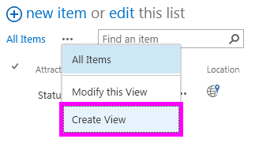
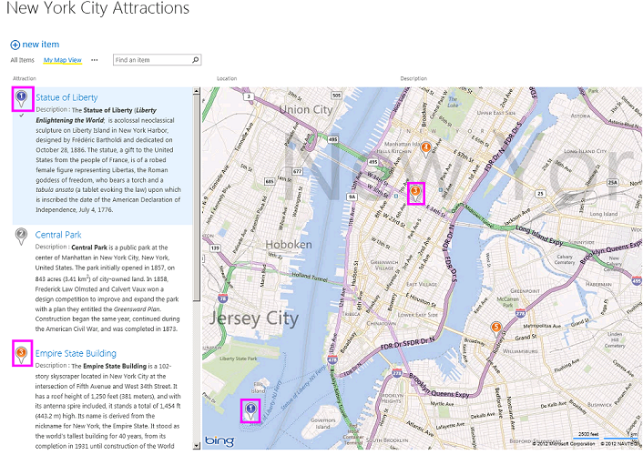
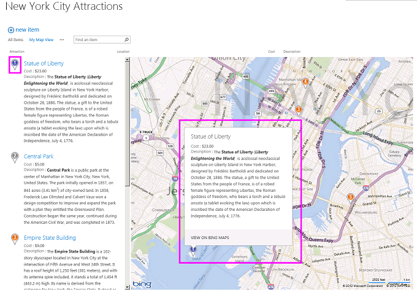

# <a name="create-a-map-view-for-the-geolocation-field-in-sharepoint"></a><span data-ttu-id="b5b53-102">Создание представления карты для поля "Географическое положение" в SharePoint</span><span class="sxs-lookup"><span data-stu-id="b5b53-102">Create a map view for the Geolocation field in SharePoint</span></span>
<span data-ttu-id="b5b53-103">Узнайте, как отобразить сведения о расположении с помощью представления карты в списках SharePoint.</span><span class="sxs-lookup"><span data-stu-id="b5b53-103">Learn how to display location information by using a map view in SharePoint lists.</span></span> <span data-ttu-id="b5b53-104">Можно создать представления карты вручную с помощью пользовательского интерфейса (UI), или программным путем с помощью нового типа поля **географического расположения** .</span><span class="sxs-lookup"><span data-stu-id="b5b53-104">You can create a map view manually via the SharePoint user interface (UI) or programmatically by using the new **Geolocation** field type.</span></span>
<span data-ttu-id="b5b53-105">SharePoint представлен новый тип поля с именем **географического расположения** , которая позволяет добавлять комментарии к списки SharePoint, содержащие сведения о расположении.</span><span class="sxs-lookup"><span data-stu-id="b5b53-105">SharePoint introduces a new field type named **Geolocation** that enables you to annotate SharePoint lists with location information.</span></span> <span data-ttu-id="b5b53-106">Например можно теперь список «расположения» и отображения Широта и долгота координаты через Bing Maps.</span><span class="sxs-lookup"><span data-stu-id="b5b53-106">For example, you can now make lists "location-aware" and display latitude and longitude coordinates through Bing Maps.</span></span> <span data-ttu-id="b5b53-107">Запись обычно рассматривается как канцелярской кнопки в представлении карты.</span><span class="sxs-lookup"><span data-stu-id="b5b53-107">An entry is typically seen as a pushpin on a map view.</span></span>
  
    
    

<span data-ttu-id="b5b53-108">Для отображения представления карты в списке SharePoint, необходимо использовать службы Bing Maps.</span><span class="sxs-lookup"><span data-stu-id="b5b53-108">To display a map view in a SharePoint list, you must use the Bing Maps services.</span></span> <span data-ttu-id="b5b53-109">Поля **географического расположения** недоступен, при создании списка с помощью пользовательского интерфейса.</span><span class="sxs-lookup"><span data-stu-id="b5b53-109">The **Geolocation** field is not available when you create a list by using the UI.</span></span> <span data-ttu-id="b5b53-110">Вместо этого в этом поле должен быть вставлен программными средствами.</span><span class="sxs-lookup"><span data-stu-id="b5b53-110">Instead, this field must be inserted programmatically.</span></span> <span data-ttu-id="b5b53-111">Сведения о способах отображения и программной работы с этим типом данных можно [интегрирование расположение и карты функциональные возможности в SharePoint](integrating-location-and-map-functionality-in-sharepoint.md).</span><span class="sxs-lookup"><span data-stu-id="b5b53-111">For information about how to render and work with this data type programmatically, see [Integrating location and map functionality in SharePoint](integrating-location-and-map-functionality-in-sharepoint.md).</span></span>
<span data-ttu-id="b5b53-112">Поля **географического расположения** и представления карты позволяют предоставить Пространственные контекста какие-либо сведения по интеграции данных из SharePoint в качества сопоставления в веб-серверы и мобильных приложений.</span><span class="sxs-lookup"><span data-stu-id="b5b53-112">The **Geolocation** field and the map view enable you to give spatial context to any information by integrating data from SharePoint into a mapping experience in web and mobile apps.</span></span> <span data-ttu-id="b5b53-113">В этой статье не приводятся сведения для визуализации поля **географического расположения** и даются рекомендации для разработчиков для создания мобильного приложения на основе расположения; оно содержит инструкции по созданию просмотра карт программными средствами и из пользовательского интерфейса SharePoint с помощью службы Bing Maps.</span><span class="sxs-lookup"><span data-stu-id="b5b53-113">This article does not explain how to render the **Geolocation** field or provide developer guidance for creating a location-based mobile application; it does provide instruction for creating map views programmatically and from the SharePoint UI by using Bing Maps.</span></span>
  
    
    

<span data-ttu-id="b5b53-114">Пакет MSI с именем SQLSysClrTypes.msi необходимо установить на каждый интерфейсный веб-сервер SharePoint для просмотра значения поля **географического расположения** или данных в виде списка.</span><span class="sxs-lookup"><span data-stu-id="b5b53-114">An MSI package named SQLSysClrTypes.msi must be installed on every SharePoint front-end web server to view the **Geolocation** field value or data in a list.</span></span> <span data-ttu-id="b5b53-115">Этот пакет устанавливает компоненты, которые реализуют новые типы идентификатор геометрии, geography и иерархии в SQL Server 2008.</span><span class="sxs-lookup"><span data-stu-id="b5b53-115">This package installs components that implement the new geometry, geography, and hierarchy ID types in SQL Server 2008.</span></span> <span data-ttu-id="b5b53-116">По умолчанию этот файл установлен для SharePoint Online.</span><span class="sxs-lookup"><span data-stu-id="b5b53-116">By default, this file is installed for SharePoint Online.</span></span> <span data-ttu-id="b5b53-117">Тем не менее он не установлен локальных развертываний SharePoint.</span><span class="sxs-lookup"><span data-stu-id="b5b53-117">However, it is not installed for an on-premises deployment of SharePoint.</span></span> <span data-ttu-id="b5b53-118">Необходимо быть членом группы администраторов фермы для выполнения этой операции.</span><span class="sxs-lookup"><span data-stu-id="b5b53-118">You must be a member of the Farm Administrators group to perform this operation.</span></span> <span data-ttu-id="b5b53-119">Загрузить SQLSysClrTypes.msi, можно в статье [Microsoft SQL Server 2008 R2 пакета дополнительных компонентов SP1](http://www.microsoft.com/en-us/download/details.aspx?id=26728) для SQL Server 2008 или [Пакета дополнительных компонентов Microsoft SQL Server 2012](http://www.microsoft.com/en-us/download/details.aspx?id=29065) для SQL Server 2012 в центре загрузки Майкрософт.</span><span class="sxs-lookup"><span data-stu-id="b5b53-119">To download SQLSysClrTypes.msi, see [Microsoft SQL Server 2008 R2 SP1 Feature Pack](http://www.microsoft.com/en-us/download/details.aspx?id=26728) for SQL Server 2008, or [Microsoft SQL Server 2012 Feature Pack](http://www.microsoft.com/en-us/download/details.aspx?id=29065) for SQL Server 2012 in the Microsoft Download Center.</span></span>
## <a name="prerequisites-for-creating-a-map-view"></a><span data-ttu-id="b5b53-120">Необходимые условия для создания представления карты</span><span class="sxs-lookup"><span data-stu-id="b5b53-120">Prerequisites for creating a map view</span></span>
<span data-ttu-id="b5b53-121"><a name="SP15CreatingMapViews_Preqs"> </a></span><span class="sxs-lookup"><span data-stu-id="b5b53-121"></span></span>


- <span data-ttu-id="b5b53-122">Доступ к списку SharePoint, имеющего достаточные права для создания представления.</span><span class="sxs-lookup"><span data-stu-id="b5b53-122">Access to a SharePoint list, with sufficient privileges to create a view.</span></span>
    
  
- <span data-ttu-id="b5b53-123">Список SharePoint, содержащий столбца **географического расположения**</span><span class="sxs-lookup"><span data-stu-id="b5b53-123">A SharePoint list that contains a **Geolocation** column</span></span>
    
  
- <span data-ttu-id="b5b53-124">Действительный ключ карт Bing на уровне фермы или веб-, который можно получить из  [Центр учетных записей карт Bing](http://www.bingmapsportal.com/)</span><span class="sxs-lookup"><span data-stu-id="b5b53-124">A valid Bing Maps key set at the farm or web level, which can be obtained from the  [Bing Maps Account Center](http://www.bingmapsportal.com/)</span></span>
    
    > <span data-ttu-id="b5b53-125">**Важные:** Вы несете ответственность за соблюдение сроками и условиями, которые применяются к использованию ключ Bing Maps и все необходимые условия для пользователей приложения о данных, передаваемых службы Bing Maps.</span><span class="sxs-lookup"><span data-stu-id="b5b53-125">**Important:** You are responsible for compliance with terms and conditions applicable to your use of the Bing Maps key, and any necessary disclosures to users of your application regarding data passed to the Bing Maps service.</span></span> 
- <span data-ttu-id="b5b53-126">Visual Studio 2012 или Visual Studio 2010</span><span class="sxs-lookup"><span data-stu-id="b5b53-126">Visual Studio 2012 or Visual Studio 2010</span></span>
    
  

## <a name="what-is-a-map-view"></a><span data-ttu-id="b5b53-127">Что такое представление карты</span><span class="sxs-lookup"><span data-stu-id="b5b53-127">What is a map view?</span></span>
<span data-ttu-id="b5b53-128"><a name="SP15CreatingMapViews_AMapView"> </a></span><span class="sxs-lookup"><span data-stu-id="b5b53-128"></span></span>

<span data-ttu-id="b5b53-129">Представления карты — это представление SharePoint, который отображает на карте (с данные, полученные от службы Bing Maps-службы), с помощью Широта и долгота записей из тип поля **географического расположения** .</span><span class="sxs-lookup"><span data-stu-id="b5b53-129">A map view is a SharePoint view that displays a map (with data obtained from the Bing Maps service), using longitude and latitude entries from the **Geolocation** field type.</span></span> <span data-ttu-id="b5b53-130">Если тип поля **географического расположения** доступен в списке SharePoint, представления карты могут создаваться программно или из пользовательского интерфейса SharePoint.</span><span class="sxs-lookup"><span data-stu-id="b5b53-130">When the **Geolocation** field type is available on the SharePoint list, a map view can be created either programmatically or from the SharePoint UI.</span></span> <span data-ttu-id="b5b53-131">В списке SharePoint расположение на карте корневых объектов на базе службы Bing Maps.</span><span class="sxs-lookup"><span data-stu-id="b5b53-131">In the list, SharePoint displays the location on a map powered by Bing Maps.</span></span> <span data-ttu-id="b5b53-132">В дополнение к этому новый тип представления с именем **Представления карты** отображает элементы списка в виде значков канцелярской кнопки на Bing Maps Ajax управления V7 с элементами списка как карточек в левой панели.</span><span class="sxs-lookup"><span data-stu-id="b5b53-132">In addition, a new view type named **Map View** displays the list items as pushpins on a Bing Maps Ajax control V7 with the list items as cards on the left pane.</span></span>
  
> [!NOTE]
> <span data-ttu-id="b5b53-133">Любой список SharePoint может иметь более двух **географического расположения** столбцов в нем; Нельзя добавить третьего столбца **географического расположения** в тот же список.</span><span class="sxs-lookup"><span data-stu-id="b5b53-133">Any SharePoint list can have maximum of two **Geolocation** columns in it; you won't be able to add a third **Geolocation** column in the same list.</span></span> <span data-ttu-id="b5b53-134">Представления карты может иметь только один столбец **географического расположения** .</span><span class="sxs-lookup"><span data-stu-id="b5b53-134">A map view can have only one **Geolocation** column.</span></span> <span data-ttu-id="b5b53-135">Можно создать несколько представлений карты с помощью разных столбцов **географического расположения** .</span><span class="sxs-lookup"><span data-stu-id="b5b53-135">You can create multiple map views with different **Geolocation** columns.</span></span>
  
    
    


## <a name="create-a-map-view-from-the-sharepoint-ui"></a><span data-ttu-id="b5b53-136">Создание представления карты из пользовательского интерфейса SharePoint</span><span class="sxs-lookup"><span data-stu-id="b5b53-136">Create a map view from the SharePoint UI</span></span>
<span data-ttu-id="b5b53-137"><a name="SP15CreatingMapViews_FromSharePointUI"> </a></span><span class="sxs-lookup"><span data-stu-id="b5b53-137"></span></span>

<span data-ttu-id="b5b53-138">Ниже приведены инструкции для создания представления карты из пользовательского интерфейса SharePoint.</span><span class="sxs-lookup"><span data-stu-id="b5b53-138">The following steps demonstrate how to create a map view from the SharePoint UI.</span></span>
  
    
    

1. <span data-ttu-id="b5b53-139">Откройте список SharePoint с помощью столбца **географического расположения** .</span><span class="sxs-lookup"><span data-stu-id="b5b53-139">Open the SharePoint list with **Geolocation** column.</span></span>
    
  
2. <span data-ttu-id="b5b53-140">Выберите **Создать представление** в меню ECB (редактирование блока элементов управления), как показано на рисунке 1.</span><span class="sxs-lookup"><span data-stu-id="b5b53-140">Choose **Create view** from the ECB (Edit Control Block) menu, as shown in Figure 1.</span></span>
    
   <span data-ttu-id="b5b53-141">**На рисунке 1. Создание представления в меню ECB**</span><span class="sxs-lookup"><span data-stu-id="b5b53-141">**Figure 1.Creating a view from the ECB menu**</span></span>

  

  
  

  

  
3. <span data-ttu-id="b5b53-143">На странице **выберите тип представления** выберите **Представления карты**, как показано на рисунке 2.</span><span class="sxs-lookup"><span data-stu-id="b5b53-143">On the **Choose a view type** page, choose **Map View**, as shown in Figure 2.</span></span>
    
   <span data-ttu-id="b5b53-144">**На рисунке 2. Выбор типа представления**</span><span class="sxs-lookup"><span data-stu-id="b5b53-144">**Figure 2. Choosing a view type**</span></span>

  

  
  

  

  
4. <span data-ttu-id="b5b53-146">Выбрав тип представления, можно выбрать различные поля для отображения в представлении карты, как показано на рисунке 3.</span><span class="sxs-lookup"><span data-stu-id="b5b53-146">After you choose a view type, you can select various fields to display in the map view, as shown in Figure 3.</span></span>
    
   <span data-ttu-id="b5b53-147">**На рисунке 3. Выбор поля для представления карты**</span><span class="sxs-lookup"><span data-stu-id="b5b53-147">**Figure 3. Choosing fields for a map view**</span></span>

  

  
  

    
    > [!NOTE]
    > <span data-ttu-id="b5b53-p106">[!Примечание] Для создания представления карты требуется по крайней мере один **Geolocation** поля. Нельзя выбрать несколько полей **Geolocation** для представления карты, хотя можно создать два разных карты представления, использующие два разных **Geolocation** поля.</span><span class="sxs-lookup"><span data-stu-id="b5b53-p106">At least one **Geolocation** field is required to create a map view. You cannot select multiple **Geolocation** fields for a map view, although you can create two different map views that use two different **Geolocation** fields.</span></span>
5. <span data-ttu-id="b5b53-p107">После добавления необходимых **Geolocation** поля и другие поля, вам требуется, нажмите **кнопку ОК**. Создается представление карты, как показано на рисунке 4.</span><span class="sxs-lookup"><span data-stu-id="b5b53-p107">After you add the required **Geolocation** field and any other field you need, choose **OK**. A map view is created, as shown in Figure 4.</span></span>
    
   <span data-ttu-id="b5b53-153">**На рисунке 4. Завершенное представление карты**</span><span class="sxs-lookup"><span data-stu-id="b5b53-153">**Figure 4. Completed map view**</span></span>

  

  
  

  

  

## <a name="create-a-map-view-programmatically"></a><span data-ttu-id="b5b53-155">Программное создание представления карты</span><span class="sxs-lookup"><span data-stu-id="b5b53-155">Create a map view programmatically</span></span>
<span data-ttu-id="b5b53-156"><a name="SP15CreatingMapViews_ByProgramatically"> </a></span><span class="sxs-lookup"><span data-stu-id="b5b53-156"></span></span>

<span data-ttu-id="b5b53-157">Выполните следующие действия для программного создания представления карты для списка SharePoint.</span><span class="sxs-lookup"><span data-stu-id="b5b53-157">Follow these steps to create a map view for a SharePoint list programmatically.</span></span>
  
    
    

1. <span data-ttu-id="b5b53-158">Запустите Visual Studio.</span><span class="sxs-lookup"><span data-stu-id="b5b53-158">Start Visual Studio.</span></span>
    
  
2. <span data-ttu-id="b5b53-p108">В строке меню выберите пункты **файл, создать проект**. Откроется диалоговое окно **Новый проект**.</span><span class="sxs-lookup"><span data-stu-id="b5b53-p108">On the menu bar, choose **File, New Project**. The **New Project** dialog box opens.</span></span>
    
  
3. <span data-ttu-id="b5b53-161">В диалоговом окне **Создать проект** выберите пункт **C#** в поле **Установленные шаблоны** и затем выберите шаблон **Консольное приложение**.</span><span class="sxs-lookup"><span data-stu-id="b5b53-161">In the **New Project** dialog box, choose **C#** in the **Installed Templates** box, and then choose the **Console Application** template.</span></span>
    
  
4. <span data-ttu-id="b5b53-162">Назовите проект и затем нажмите кнопку **ОК**.</span><span class="sxs-lookup"><span data-stu-id="b5b53-162">Give the project a name, and then choose the **OK** button.</span></span>
    
  
5. <span data-ttu-id="b5b53-p109">Visual Studio создает проект. Добавление ссылки на следующие сборки и нажмите **кнопку ОК**.</span><span class="sxs-lookup"><span data-stu-id="b5b53-p109">Visual Studio creates the project. Add a reference to the following assemblies, and choose **OK**.</span></span>
    
  - <span data-ttu-id="b5b53-165">Microsoft.SharePoint.Client.dll</span><span class="sxs-lookup"><span data-stu-id="b5b53-165">Microsoft.SharePoint.Client.dll</span></span>
    
  
  - <span data-ttu-id="b5b53-166">Microsoft.SharePoint.Client.Runtime.dll</span><span class="sxs-lookup"><span data-stu-id="b5b53-166">Microsoft.SharePoint.Client.Runtime.dll</span></span>
    
  
6. <span data-ttu-id="b5b53-167">В файле .cs по умолчанию добавьте директиву **using** следующим образом.</span><span class="sxs-lookup"><span data-stu-id="b5b53-167">In the default .cs file, add a **using** directive as follows.</span></span>
    
     `using Microsoft.SharePoint.Client;`
    
  
7. <span data-ttu-id="b5b53-168">Добавьте следующий код в метод **Main** в CS-файл.</span><span class="sxs-lookup"><span data-stu-id="b5b53-168">Add the following code to the **Main** method in the .cs file.</span></span>
    
    > [!NOTE]
    > <span data-ttu-id="b5b53-p110">[!Примечание] Перечислены JSLink, свойство не поддерживается в опросе или событий. Календарь SharePoint — это список событий.</span><span class="sxs-lookup"><span data-stu-id="b5b53-p110">The JSLink property is not supported on Survey or Events lists. A SharePoint calendar is an Events list.</span></span> 

```cs
  
class Program
    {
        static void Main(string[] args)
        {
            CreateMapView ();
            Console.WriteLine("A map view is created successfully");
        }
        private static void CreateMapView()
        { 
         // Replace <Site URL> and <List Title> with valid values.
            ClientContext context = new ClientContext("<Site Url>"); 
            List oList = context.Web.Lists.GetByTitle("<List Title>");
            ViewCreationInformation viewCreationinfo = new ViewCreationInformation();
         // Replace <View Name> with the name you want for your map view.
             viewCreationinfo.Title = "<View Name>";
             viewCreationinfo.ViewTypeKind = ViewType.Html;
             View oView = oList.Views.Add(viewCreationinfo);
             oView.JSLink = "mapviewtemplate.js";
            oView.Update();
            context.ExecuteQuery();
        } 
    }
```

8. <span data-ttu-id="b5b53-171">Замените  _<Site Url>_ и _<List Title>_ допустимые значения.</span><span class="sxs-lookup"><span data-stu-id="b5b53-171">Replace  _<Site Url>_ and _<List Title>_ with valid values.</span></span>
    
  
9. <span data-ttu-id="b5b53-p111">Перейдите к списку. Можно видеть только что созданный представление с именем, указанным в предыдущем примере кода.</span><span class="sxs-lookup"><span data-stu-id="b5b53-p111">Navigate to the list. You should be able to see a newly created view that has the name you specified in the preceding code.</span></span>
    
  

## <a name="understand-color-coded-pushpins-in-a-map-view"></a><span data-ttu-id="b5b53-174">Понять цветной значков канцелярской кнопки в представлении карты</span><span class="sxs-lookup"><span data-stu-id="b5b53-174">Understand color-coded pushpins in a map view</span></span>
<span data-ttu-id="b5b53-175"><a name="SP15CreatingMapViews_ColorCode"> </a></span><span class="sxs-lookup"><span data-stu-id="b5b53-175"></span></span>

<span data-ttu-id="b5b53-p112">Карты Просмотр providesthree цвета значков канцелярской кнопки (как показано на рисунке 5), каждая из которых содержит взаимодействие с пользователем различие. В левой области канцелярской кнопки на карте имеет цвет канцелярской кнопки совпавшего элемента.</span><span class="sxs-lookup"><span data-stu-id="b5b53-p112">A map view providesthree colors of pushpins (as shown in Figure 5), each of which provides a difference user experience. A pushpin on the map has the same color as the pushpin of the matching item in the left pane.</span></span>
  
    
    

- <span data-ttu-id="b5b53-178">**Оранжевый** Указывает, что поле **Geolocation** для элемента сопоставляется с помощью службы Bing Maps.</span><span class="sxs-lookup"><span data-stu-id="b5b53-178">**Orange** Indicates that the **Geolocation** field for the item is mapped with the Bing Maps services.</span></span>
    
  
- <span data-ttu-id="b5b53-p113">**Серый цвет** Указывает, что поле **Geolocation** для элемента будет пустым. Элемент не может быть сопоставлен с помощью службы Bing Maps, поэтому нет канцелярской кнопки для этого элемента отображается на карте.</span><span class="sxs-lookup"><span data-stu-id="b5b53-p113">**Grey** Indicates that the **Geolocation** field for the item is empty. The item cannot be mapped with Bing Maps services, so no pushpin for this item appears on the map.</span></span>
    
  
- <span data-ttu-id="b5b53-p114">**Синий** Когда пользователь наводит курсор элемента списка, изменения цвета канцелярской кнопки из оранжевый синий. Цвет канцелярской кнопки в левой области и соответствующие канцелярской кнопки на карте</span><span class="sxs-lookup"><span data-stu-id="b5b53-p114">**Blue** When a user hovers over a list item, the pushpin color changes from orange to blue. Both the pushpin in the left pane and the matching pushpin on the map change color</span></span>
    
  

<span data-ttu-id="b5b53-183">**На рисунке 5. Представления карты с помощью различных канцелярской кнопки цветов**</span><span class="sxs-lookup"><span data-stu-id="b5b53-183">**Figure 5. A map view with different pushpin colors**</span></span>

  
    
    

  
    
    

  
    
    
<span data-ttu-id="b5b53-p115">После создания представления карты, все элементы отображаются в виде значков канцелярской кнопки. Пользователь может получить дополнительные сведения об элементе навести указатель мыши на канцелярской кнопки, как показано на рисунке 6.</span><span class="sxs-lookup"><span data-stu-id="b5b53-p115">After you create a map view, all items appear as pushpins. The user can get more information about an item by hovering over a pushpin, as shown in Figure 6.</span></span>
  
    
    

<span data-ttu-id="b5b53-187">**На рисунке 6. Взаимодействие с пользователем значков канцелярской кнопки в представлении карты**</span><span class="sxs-lookup"><span data-stu-id="b5b53-187">**Figure 6. User experience of pushpins in a map view**</span></span>

  
    
    

  
    
    

  
    
    

  
    
    

  
    
    

## <a name="see-also"></a><span data-ttu-id="b5b53-189">См. также</span><span class="sxs-lookup"><span data-stu-id="b5b53-189">See also</span></span>
<span data-ttu-id="b5b53-190"><a name="SP15CreatingMapViews_AdditionalResources"> </a></span><span class="sxs-lookup"><span data-stu-id="b5b53-190"></span></span>


-  [<span data-ttu-id="b5b53-191">Интеграция расположение и карты функциональные возможности в SharePoint</span><span class="sxs-lookup"><span data-stu-id="b5b53-191">Integrating location and map functionality in SharePoint</span></span>](integrating-location-and-map-functionality-in-sharepoint.md)
    
  
-  [<span data-ttu-id="b5b53-192">Как программно добавить столбец "Географическое расположение" в список SharePoint</span><span class="sxs-lookup"><span data-stu-id="b5b53-192">How to: Add a Geolocation column to a list programmatically in SharePoint</span></span>](how-to-add-a-geolocation-column-to-a-list-programmatically-in-sharepoint.md)
    
  
-  [<span data-ttu-id="b5b53-193">Как: задать ключ карт Bing на уровне веб-серверы и фермы в SharePoint</span><span class="sxs-lookup"><span data-stu-id="b5b53-193">How to: Set the Bing Maps key at the web and farm level in SharePoint</span></span>](how-to-set-the-bing-maps-key-at-the-web-and-farm-level-in-sharepoint.md)
    
  
-  [<span data-ttu-id="b5b53-194">Как: интеграция карт с помощью приложения для Windows Phone и списки SharePoint</span><span class="sxs-lookup"><span data-stu-id="b5b53-194">How to: Integrate maps with Windows Phone apps and SharePoint lists</span></span>](how-to-integrate-maps-with-windows-phone-apps-and-sharepoint-lists.md)
    
  
-  [<span data-ttu-id="b5b53-195">Использование типа поля расположения SharePoint в мобильных приложениях</span><span class="sxs-lookup"><span data-stu-id="b5b53-195">Use the SharePoint location field type in mobile applications</span></span>](http://technet.microsoft.com/en-us/library/fp161355%28v=office.15%29.aspx)
    
  

