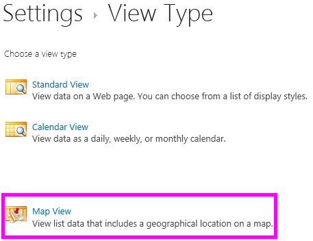

# <a name="create-a-map-view-for-the-geolocation-field-in-sharepoint"></a>Создание представления карты для поля географического расположения в SharePoint
Узнайте, как отобразить сведения о расположении с помощью представления карты в списках SharePoint. Можно создать представления карты вручную с помощью пользовательского интерфейса (UI), или программным путем с помощью нового типа поля **географического расположения** .
SharePoint представлен новый тип поля с именем **географического расположения** , которая позволяет добавлять комментарии к списки SharePoint, содержащие сведения о расположении. Например можно теперь список «расположения» и отображения Широта и долгота координаты через Bing Maps. Запись обычно рассматривается как канцелярской кнопки в представлении карты.
  
    
    

Для отображения представления карты в списке SharePoint, необходимо использовать службы Bing Maps. Поля **географического расположения** недоступен, при создании списка с помощью пользовательского интерфейса. Вместо этого в этом поле должен быть вставлен программными средствами. Сведения о способах отображения и программной работы с этим типом данных можно [интегрирование расположение и карты функциональные возможности в SharePoint](integrating-location-and-map-functionality-in-sharepoint.md).
Поля **географического расположения** и представления карты позволяют предоставить Пространственные контекста какие-либо сведения по интеграции данных из SharePoint в качества сопоставления в веб-серверы и мобильных приложений. В этой статье не приводятся сведения для визуализации поля **географического расположения** и даются рекомендации для разработчиков для создания мобильного приложения на основе расположения; оно содержит инструкции по созданию просмотра карт программными средствами и из пользовательского интерфейса SharePoint с помощью службы Bing Maps.
  
    
    

Пакет MSI с именем SQLSysClrTypes.msi необходимо установить на каждый интерфейсный веб-сервер SharePoint для просмотра значения поля **географического расположения** или данных в виде списка. Этот пакет устанавливает компоненты, которые реализуют новые типы идентификатор геометрии, geography и иерархии в SQL Server 2008. По умолчанию этот файл установлен для SharePoint Online. Тем не менее он не установлен локальных развертываний SharePoint. Необходимо быть членом группы администраторов фермы для выполнения этой операции. Загрузить SQLSysClrTypes.msi, можно в статье [Microsoft SQL Server 2008 R2 пакета дополнительных компонентов SP1](http://www.microsoft.com/en-us/download/details.aspx?id=26728) для SQL Server 2008 или [Пакета дополнительных компонентов Microsoft SQL Server 2012](http://www.microsoft.com/en-us/download/details.aspx?id=29065) для SQL Server 2012 в центре загрузки Майкрософт.
## <a name="prerequisites-for-creating-a-map-view"></a>Необходимые условия для создания представления карты
<a name="SP15CreatingMapViews_Preqs"> </a>


- Доступ к списку SharePoint, имеющего достаточные права для создания представления.
    
  
- Список SharePoint, содержащий столбца **географического расположения**
    
  
- Действительный ключ карт Bing на уровне фермы или веб-, который можно получить из  [Центр учетных записей карт Bing](http://www.bingmapsportal.com/)
    
    > **Важные:** Вы несете ответственность за соблюдение сроками и условиями, которые применяются к использованию ключ Bing Maps и все необходимые условия для пользователей приложения о данных, передаваемых службы Bing Maps. 
- Visual Studio 2012 или Visual Studio 2010
    
  

## <a name="what-is-a-map-view"></a>Что такое представление карты
<a name="SP15CreatingMapViews_AMapView"> </a>

Представления карты — это представление SharePoint, который отображает на карте (с данные, полученные от службы Bing Maps-службы), с помощью Широта и долгота записей из тип поля **географического расположения** . Если тип поля **географического расположения** доступен в списке SharePoint, представления карты могут создаваться программно или из пользовательского интерфейса SharePoint. В списке SharePoint расположение на карте корневых объектов на базе службы Bing Maps. В дополнение к этому новый тип представления с именем **Представления карты** отображает элементы списка в виде значков канцелярской кнопки на Bing Maps Ajax управления V7 с элементами списка как карточек в левой панели.
  
    
    

> **Примечание:** Любой список SharePoint может иметь более двух **географического расположения** столбцов в нем; Нельзя добавить третьего столбца **географического расположения** в тот же список. Представления карты может иметь только один столбец **географического расположения** . Можно создать несколько представлений карты с помощью разных столбцов **географического расположения** .
  
    
    


## <a name="create-a-map-view-from-the-sharepoint-ui"></a>Создание представления карты из пользовательского интерфейса SharePoint
<a name="SP15CreatingMapViews_FromSharePointUI"> </a>

Ниже приведены инструкции для создания представления карты из пользовательского интерфейса SharePoint.
  
    
    

1. Откройте список SharePoint с помощью столбца **географического расположения** .
    
  
2. Выберите **Создать представление** в меню ECB (редактирование блока элементов управления), как показано на рисунке 1.
    
   **На рисунке 1. Создание представления в меню ECB**

  

  
  

  

  
3. На странице **выберите тип представления** выберите **Представления карты**, как показано на рисунке 2.
    
   **На рисунке 2. Выбор типа представления**

  

  
  

  

  
4. Выбрав тип представления, можно выбрать различные поля для отображения в представлении карты, как показано на рисунке 3.
    
   **На рисунке 3. Выбор поля для представления карты**

  

  
  

    
    > **Примечание:** Для создания представления карты требуется по крайней мере один поля **географического расположения** . Нельзя выбрать несколько полей **географического расположения** для представления карты, хотя можно создать два разных карты представления, использующие два разных поля **географического расположения** .
5. После добавления необходимых **Geolocation** поля и другие поля, вам требуется, нажмите **кнопку ОК**. Создается представление карты, как показано на рисунке 4.
    
   **На рисунке 4. Завершенное представление карты**

  

  
  

  

  

## <a name="create-a-map-view-programmatically"></a>Программное создание представления карты
<a name="SP15CreatingMapViews_ByProgramatically"> </a>

Выполните следующие действия для программного создания представления карты для списка SharePoint.
  
    
    

1. Запустите Visual Studio.
    
  
2. В строке меню выберите пункты **файл, создать проект**. Откроется диалоговое окно **Новый проект**.
    
  
3. В диалоговом окне **Создать проект** выберите пункт **C#** в поле **Установленные шаблоны** и затем выберите шаблон **Консольное приложение**.
    
  
4. Назовите проект и затем нажмите кнопку **ОК**.
    
  
5. Visual Studio создает проект. Добавление ссылки на следующие сборки и нажмите **кнопку ОК**.
    
  - Microsoft.SharePoint.Client.dll
    
  
  - Microsoft.SharePoint.Client.Runtime.dll
    
  
6. В файле .cs по умолчанию добавьте директиву **using** следующим образом.
    
     `using Microsoft.SharePoint.Client;`
    
  
7. Добавьте следующий код в метод **Main** в CS-файл.
    
    > **Примечание:** Перечислены JSLink, свойство не поддерживается в опросе или событий. Календарь SharePoint — это список событий. 

```cs
  
class Program
    {
        static void Main(string[] args)
        {
            CreateMapView ();
            Console.WriteLine("A map view is created successfully");
        }
        private static void CreateMapView()
        { 
         // Replace <Site URL> and <List Title> with valid values.
            ClientContext context = new ClientContext("<Site Url>"); 
            List oList = context.Web.Lists.GetByTitle("<List Title>");
            ViewCreationInformation viewCreationinfo = new ViewCreationInformation();
         // Replace <View Name> with the name you want for your map view.
             viewCreationinfo.Title = "<View Name>";
             viewCreationinfo.ViewTypeKind = ViewType.Html;
             View oView = oList.Views.Add(viewCreationinfo);
             oView.JSLink = "mapviewtemplate.js";
            oView.Update();
            context.ExecuteQuery();
        } 
    }
```

8. Замените  _<Site Url>_ и _<List Title>_ допустимые значения.
    
  
9. Перейдите к списку. Можно видеть только что созданный представление с именем, указанным в предыдущем примере кода.
    
  

## <a name="understand-color-coded-pushpins-in-a-map-view"></a>Понять цветной значков канцелярской кнопки в представлении карты
<a name="SP15CreatingMapViews_ColorCode"> </a>

Карты Просмотр providesthree цвета значков канцелярской кнопки (как показано на рисунке 5), каждая из которых содержит взаимодействие с пользователем различие. В левой области канцелярской кнопки на карте имеет цвет канцелярской кнопки совпавшего элемента.
  
    
    

- **Оранжевый** Указывает, что поле **Geolocation** для элемента сопоставляется с помощью службы Bing Maps.
    
  
- **Серый цвет** Указывает, что поле **Geolocation** для элемента будет пустым. Элемент не может быть сопоставлен с помощью службы Bing Maps, поэтому нет канцелярской кнопки для этого элемента отображается на карте.
    
  
- **Синий** Когда пользователь наводит курсор элемента списка, изменения цвета канцелярской кнопки из оранжевый синий. Цвет канцелярской кнопки в левой области и соответствующие канцелярской кнопки на карте
    
  

**На рисунке 5. Представления карты с помощью различных канцелярской кнопки цветов**

  
    
    

  
    
    

  
    
    
После создания представления карты, все элементы отображаются в виде значков канцелярской кнопки. Пользователь может получить дополнительные сведения об элементе навести указатель мыши на канцелярской кнопки, как показано на рисунке 6.
  
    
    

**На рисунке 6. Взаимодействие с пользователем значков канцелярской кнопки в представлении карты**

  
    
    

  
    
    

  
    
    

  
    
    

  
    
    

## <a name="additional-resources"></a>Дополнительные ресурсы
<a name="SP15CreatingMapViews_AdditionalResources"> </a>


-  [Интеграция расположение и карты функциональные возможности в SharePoint](integrating-location-and-map-functionality-in-sharepoint.md)
    
  
-  [Как: Добавление столбца географического расположения списка программными средствами в SharePoint](how-to-add-a-geolocation-column-to-a-list-programmatically-in-sharepoint.md)
    
  
-  [Как: задать ключ карт Bing на уровне веб-серверы и фермы в SharePoint](how-to-set-the-bing-maps-key-at-the-web-and-farm-level-in-sharepoint.md)
    
  
-  [Как: интеграция карт с помощью приложения для Windows Phone и списки SharePoint](how-to-integrate-maps-with-windows-phone-apps-and-sharepoint-lists.md)
    
  
-  [Использование типа поля расположения SharePoint в мобильных приложениях](http://technet.microsoft.com/en-us/library/fp161355%28v=office.15%29.aspx)
    
  

