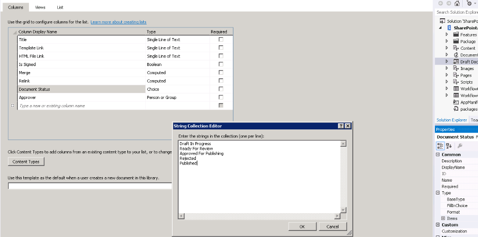
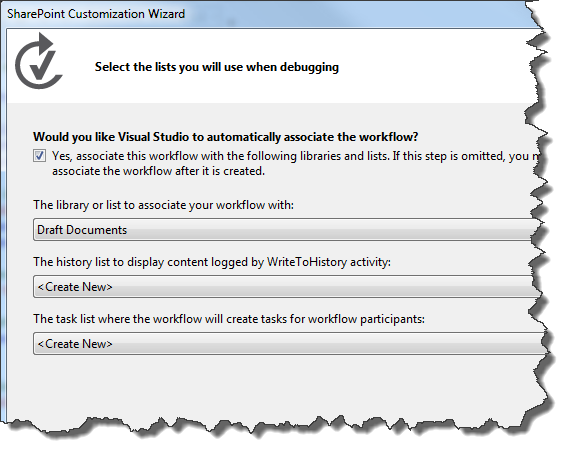
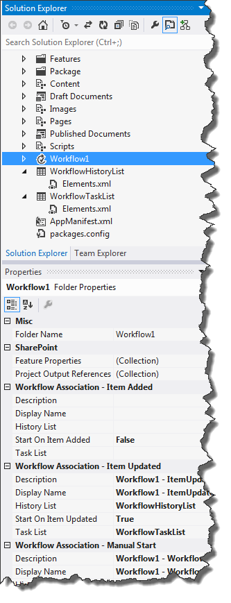
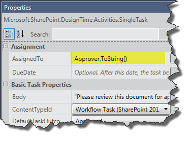
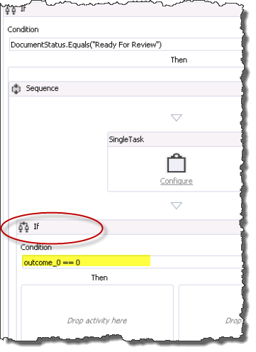
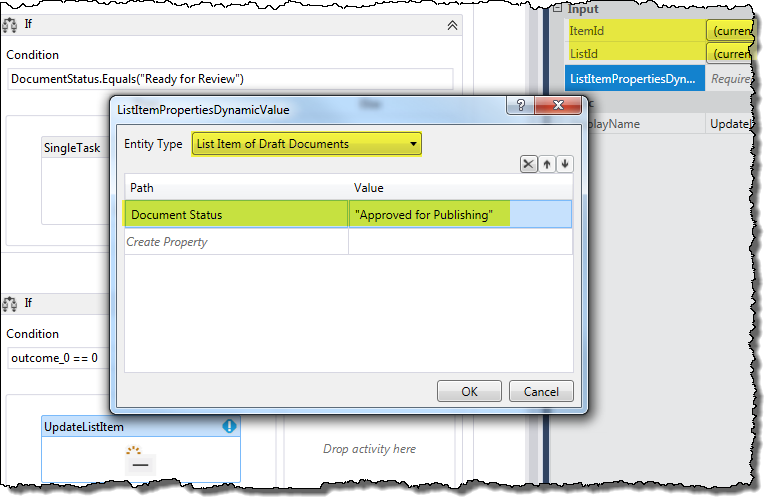
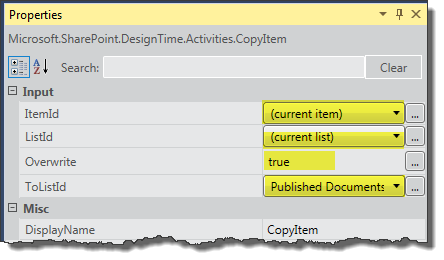
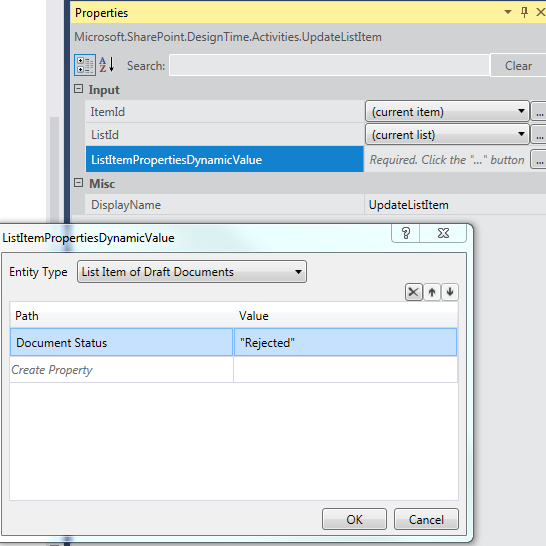

# <a name="create-a-sharepoint-workflow-app-using-visual-studio-2012"></a>Создание приложения рабочего процесса SharePoint с помощью Visual Studio 2012
Пройти через процесс создания рабочего процесса Надстройка SharePoint с помощью Microsoft Visual Studio 2012.
## <a name="prerequisites"></a>Необходимые условия
<a name="bmPreReq"> </a>

В этом сценарии разработки предполагает, что в ферме SharePoint и фермой диспетчера рабочих процессов версии 1.0 установлены и в сочетании. Эти две фермы может располагаться на том же или на отдельных серверах. Сценарий дальнейшей предполагает, что рабочий процесс разработки с удалением удаленно - то есть на компьютере, отдельно от одного из компьютеров сервера - и с помощью Microsoft Visual Studio 2012 или более поздней версии.
  
    
    

- На платформах сервера:
    
  - Windows Server 2008 R2.
    
  
  - Microsoft SharePoint
    
  
  - Workflow Manager 1.0
    
  
- На платформе разработки:
    
  - Microsoft Visual Studio 2012 или более поздней версии.
    
  
  - Инструменты разработчика Office для Visual Studio 2013.
    
    > [!NOTE]
    > [!Примечание] Инструменты разработчика Office для Visual Studio 2013 только в том случае, необходимых для использования Visual Studio 2012. Более поздние версии Visual Studio включают средства для разработчиков Office. Установка и настройка среды разработки рабочего процесса SharePoint можно найти следующее:
  
    
    

-  [Подготовка к Установка и настройка среды разработки рабочего процесса SharePoint](prepare-to-set-up-and-configure-a-sharepoint-workflow-development-environment.md)
    
  
-  [Настройка рабочих процессов в SharePoint](http://technet.microsoft.com/en-us/library/jj658586%28v=office.15%29)
    
  
-  [Серия: Установка и настройка рабочего процесса в SharePoint](http://technet.microsoft.com/en-us/library/dn201724%28v=office.15%29)
    
  

## <a name="get-started"></a>Начало работы
<a name="bmGetStarted"> </a>

Распространенные сценарии рабочего процесса в параметрах business — это процесс проверки и утверждения документов. В этом пошаговом руководстве создайте Надстройка SharePoint, который автоматизирует маршрутизации, уведомления и рабочий процесс утверждения или отклонения документа с помощью SharePoint. Мы создадим этот рабочий процесс, с помощью конструктора рабочих процессов SharePoint в Microsoft Visual Studio 2012.
  
    
    
Вот блок-схема, иллюстрирующая курс рабочий процесс, мы создадим.
  
    
    

**На рисунке 1. Блок-схема, изображающая рабочий процесс утверждения документа.**

  
    
    

  
    
    

  
    
    
Таким образом рабочий процесс выполняет следующие действия: 
  
    
    

  
    
    

1. Событие change документа, связанного с определенной библиотеке документов запускает экземпляр рабочего процесса.
    
  
2. Если состояние документа "В готов к рассмотрению", рабочий процесс назначает задачу готовые проверяющему, а затем отправляет уведомление по электронной почте о задаче проверяющий.
    
  
3. Если проверяющий не удается утвердить документ, остается файл документа в библиотеке документов черновиков. Тем не менее задайте для состояние документа «Отменен».
    
  
4. Если проверяющий утверждает документ, рабочий процесс копирует документ в библиотеку документов публикации. Исходный файл остается в библиотеке документов черновиков, но имеет статус «Опубликован».
    
  

    
> **Важные:** Прежде чем начать в этом пошаговом руководстве, убедитесь, что среда разработки корректной установке и конфигурации рабочего процесса. Для получения дополнительных сведений см. [Подготовка к Установка и настройка среды разработки рабочего процесса SharePoint](prepare-to-set-up-and-configure-a-sharepoint-workflow-development-environment.md). Кроме того убедитесь, что экземпляр, который вы можете создавать рабочие для SharePoint. Дополнительные сведения можно [Установить SharePoint](http://technet.microsoft.com/en-us/library/cc303424.aspx). 
  
    
    


## <a name="prepare-your-environment"></a>Подготовка среды
<a name="bmPrepare"> </a>

Первый шаг Подготовка сайте SharePoint с библиотеками документов, которые будут использовать рабочего процесса.
  
    
    

1. Запустите Visual Studio 2012 и создайте новый проект на основе шаблона **приложение для SharePoint** , как показано на рисунке 2.
    
    > [!NOTE]
    > [!Примечание] В этом пошаговом руководстве файл решения с именем «DocApprovalWorkflow1». Рекомендуется использовать таким же именем. Тем не менее если имя решения по-разному, убедитесь, что внесите необходимые изменения в дальнейшим инструкциям. 

   **На рисунке 2. Создание нового проекта в Visual Studio 2012**

  

  
  

  

  
2. На связанного сайта SharePoint создайте две новые библиотеки документов, выполнив следующие:
    
  - В **Обозревателе решений** щелкните правой кнопкой мыши на значок "DocApprovalWorkflow1" и выберите **Добавить** > **Создать элемент** и затем выберите **список**.
    
  
  - Итоговый **Мастер настройки SharePoint** введите "Черновик документы" в поле имя; Выберите пункт «Библиотеки документов» в раскрывающемся списке в разделе первого переключателя, как показано на рисунке 3. 
    
  
  - Нажмите кнопку **Далее**, а затем использовать параметры по умолчанию и нажмите кнопку **Готово**.
    
   **На рисунке 3. Мастер настройки SharePoint для настройки списка.**

  

  
  

  

  
3. Создайте второй библиотеки документов, используя те же действия как, за исключением имени этой второй библиотеки «Опубликованные документы».
    
  
4. Добавьте два настраиваемых столбцов **и** новые библиотеки документов, которые вы только что создали:
    
  - Создайте настраиваемый столбец с именем «Утверждающего» и сделайте его **лицу или группе** тип столбца списка.
    
  
  - Создайте настраиваемый столбец с именем «Состояние документа» и сделайте его столбец списка **выбора** введите (см).
    
  
5. В столбце **Состояние документа** добавьте пять параметров, развернув свойство **Type** в сетке свойств, а затем нажав кнопку с многоточием ( ****...) в свойства **Items** . Введите значения для выбора в поле, которое отображается, как показано на рисунке 4.
    
  - Черновик в процессе выполнения
    
  
  - Готово для проверки
    
  
  - Утверждено для публикации
    
  
  - Отклонено.
    
  
  - Опубликованные
    
  

   

  

  
  

  

  

## <a name="create-the-basic-workflow"></a>Создание базового рабочего процесса
<a name="bmCreateWorkflow"> </a>

Теперь мы готовы приступить к созданию рабочим процессом.
  
    
    

1. В Visual Studio Создание нового рабочего процесса, щелкнув правой кнопкой мыши на значок **DocApprovalWorkflow1** (в **Окне Обозреватель решений** ) и выбрав пункт **Добавить** > **Новый элемент**, а затем выбрав **рабочего процесса** (см).
    
   **На рисунке 5. Добавление нового элемента > мастер рабочего процесса.**

  

  
  

  

  
2. Имя рабочего процесса «DocumentApprovalWorkflow» и выберите **Рабочий процесс списка** как рабочего процесса введите (см).
    
   **На рисунке 6. Укажите имя рабочего процесса и тип.**

  

  
  

  

  
3. В окне **Мастер настройки SharePoint** выберите свяжите нового рабочего процесса с библиотекой документов черновиков; затем выбрать создать новый список журналов и новый список задач рабочего процесса, как показано на рисунке 7. Нажмите кнопку **Далее**.
    
   **На рисунке 7. Завершение работы мастера настройки SharePoint для нового рабочего процесса.**

  

  
  

  

  
4. Настройка рабочего процесса для автоматического запуска при изменении элемента в библиотеке документов черновиков. Также можно оставить флажок при ручном запуске рабочего процесса установлен; Это позволяет легко проверить рабочего процесса без необходимости изменить документ. В разделе на рисунке 8.
    
   **На рисунке 8. Настройка параметров активации для рабочего процесса.**

  

  
  

    
    > [!NOTE]
    > [!Примечание] Тип сопоставления рабочего процесса можно изменить после создания рабочего процесса с помощью сетки свойств с рабочим процессом, выбранного в **Обозревателе решений** (см). Нажмите кнопку **Готово**. 

   **На рисунке 9. Сетка свойств рабочего процесса.**

  

  
  

  

  
5. И, наконец настройте сервер SharePoint для управления исходящей электронной почты с помощью службы SMTP. Сведения содержатся в разделе [Настройка исходящей электронной почты для фермы SharePoint](http://technet.microsoft.com/en-us/library/cc263462.aspx). Это необходимо разрешить рабочего процесса, чтобы отправлять уведомления по электронной почте, относящиеся к задачам рабочего процесса.
    
  

## <a name="implement-the-workflow-logic"></a>Реализация логики рабочих процессов.
<a name="bmImplementLogic"> </a>

Теперь, когда у нас есть наш SharePoint Server, Настройка и наш базовый рабочий процесс, созданный, мы теперь разработка логики рабочего процесса.
  
    
    

1. Откройте конструктор рабочих процессов, дважды щелкнув элемент проекта рабочего процесса в **Окне Обозреватель решений**. Вы увидите поверхность конструктора рабочих процессов (и панель элементов рабочего процесса); Конструктор заполненный на этап начальной рабочего процесса с именем **последовательности**.
    
  
2. Наш первый шаг — это получить активности **LookupSPListItem** из панели элементов (см) и поместите его в рабочей области **последовательность** на поверхность конструктора. Это действие используется для получения состояния документа в любой момент времени активности **LookupSPListItem** возвращает как объект [DynamicValue](http://msdn.microsoft.com/en-us/library/windowsazure/microsoft.activities.dynamicvalue%28v=azure.10%29.aspx) , который содержит набор свойств элемента списка SharePoint как пары "ключ значение".
    
   **На рисунке 10. Действий lookupsplistitem.**

  

  
  

  

1. Чтобы настроить действие **LookupSPListItem**, выберите команду его в конструкторе, чтобы выбрать его. Это активирует сетки свойств для действия.
    
  
2. Использование полей с выбором в сетке свойств для настройки действий **LookupSPListItem** для использования "текущий элемент" для **ItemId** и "текущий список" в качестве **ListId**, как показано на рисунке 11.
    
   **На рисунке 11. Настройка свойств LookupSPListItem.**

  

  
  

  

  
3. В разделе действий **LookupSPListItem** щелкните ссылку **Получите свойства**. Это нужно выполнить два важных шагов для вас.
    
1. Во-первых, он создает переменную типа **DynamicValue** и связывает его выходной аргумент, (с именем _Result_) из **LookupSPListItem** действия. Свойства элемента списка, хранятся в переменной.
    
  
2. Во-вторых, добавляется новое действие с именем **GetDynamicValueProperties** (см) и устанавливает переменную только что созданный **DynamicValue** в качестве входного аргумента этого нового действия. Это действие позволяет извлечь свойства элемента списка из переменной **DynamicValue**.
    
  
4. Для действия **GetDynamicValueProperties** щелкните *Определение...*  , чтобы открыть диалоговое окно, которое позволяет выбрать свойства, которые вы хотите извлечь. В выберите пункт Свойства, ссылаться на рисунке 12, которая показана часть области конструирования объединено с открыть диалоговое окно **Свойства**.
    
   **На рисунке 12. Выбор DynamicValue свойства, которые вы хотите извлечь.**

  

  
  

  

1. **Тип сущности** выберите **Список элементов черновиков документов**.
    
  
2. В таблице данных, в столбце **путь** щелкните *Создать свойство*  , чтобы открыть поле со списком, который содержит свойства, доступные для элементов списка в библиотеке документов черновиков. Выберите **Состояние документа** в поле со списком.
    
  
3. В следующей строке в таблице данных нажмите кнопку  *Создать свойство*  еще раз; на этот раз выберите **утверждающий** в поле со списком.
    
  
4. Теперь щелкните ссылку **Заполнения переменных** в диалоговом окне. Это создает переменную соответствующего типа данных для каждой строки и назначает ее в столбце **Назначения для** таблицы данных, как показано на рисунке 13.
    
   **На рисунке 13. Получение состояния документа и утверждающих свойств.**

  

  
  

  

  
5. Теперь у нас есть список значений элементов, которые необходимо. Следующим шагом является настройка рабочего процесса для проверки, является ли документ «Готово для проверки» и выполните необходимые действия, когда это.
    
1. В панели элементов перетащите активность **If** на поверхность конструктора рабочих процессов. (Можно найти **If** активности в разделе **Поток управления** панели инструментов.)
    
  
2. Значение условие **If** `DocumentStatus.Equals("Ready for Review")`, как показано на рисунке 14.
    
   **На рисунке 14. Создание If/нажмите предложения WHERE для запуска задачи.**

  

  
  

  

  
3. Рассмотрим процедуру из раздела **SP - задач** из панели элементов перетащите действие **SingleTask** и поместите его в поле **Then** **If** действие. В результате настройки рабочего процесса таким образом, что **If** документ Готово для проверки, **Then**, он будет затем выполнения задачи.
    
  
6. Следующий шаг —, чтобы настроить только что созданный с помощью конфигурации диалоговом окне показано на рисунке 15.
    
   **На рисунке 15. Диалоговое окно настройки задачи.**

  

  
  

  

1. Во-первых мы назначить задачу на утверждение. Для этого щелкните ссылку **настроить** плитку **SingleTask** активности.
    
  
2. Установка **назначается:** поля «Утверждение».
    
  
3. Обратите внимание, что **задач заголовок:** поле автоматически заполняется «Задача рабочего процесса».
    
  
4. В **тело:** введите простое сообщение с инструкциями для утверждающего, такие как «ознакомьтесь с этот документ на утверждение для публикации.»
    
  
5. Нажмите **кнопку ОК**, чтобы сохранить.
    
  

    Обратите внимание на то, на этом этапе наличие ошибки проверки для **SingleTask** действия. С **SingleTask** плитку выбран просмотрите свойства **AssignedTo** в сетке свойств и обратите внимание на то, что она имеет значок ошибки. Наведите указатель мыши на имя свойства, чтобы увидеть подсказка с описанием проблемы. Видно, что свойство **AssignedTo** ожидает значение **String**; Тем не менее **утверждающий** переменная имеет тип данных **Int32**.
    
    Чтобы устранить эту ошибку, привести переменной с типом данных **String**, добавив к ". ToString() "«Утверждение» в **AssignedTo** строк на сетка свойств, как показано на рисунке 16.
    

   **На рисунке 16. Приведение «Утверждающего» значения к строковому типу данных в сетке свойств.**

  

  
  

    В текущий момент в этом пошаговом руководстве после создания и настройки задачи рабочего процесса, который выполняет две вещи: задает документа для анализа, но также отправляет несколько электронной почты для исполнителя задачи ("утверждающего" в данном случае) о том, ему, что задача назначена и ожидает действия.
    
  
7. Давайте взглянем на сетка свойств для действия **SingleTask**. Перейдите к нижней части сетки свойств и примечание в разделе **выходных данных** существует два свойства, **результат** и **TaskItemId**, которые являются выходные аргументы.
    
    Обратите внимание на имя переменной **результат**:  _outcome_0_ (или аналогичные). Эта переменная используется для проверки результат задачи - то есть ли утверждающему утверждения или отклонения документа.
    
    > [!NOTE]
    > [!Примечание] Выходной аргумент **результата** возвращает значение **Int32**, соответствующий индексу результата — то есть, **0** "Утверждено" и **1** для "Отменен". Эти целые числа — значения по умолчанию, предоставляемые в стандартной столбца сайта SharePoint, с именем «Результат задачи».
8. Теперь, чтобы рабочего процесса, чтобы проверить результат задачи, нужно добавить другие операции **If** и поместите его после действия **SingleTask**, но внутри области **Then**, как показано на рисунке 17. Установка **If** условие " `outcome_0 == 0`" сообщает нам утверждения документа.
    
   **На рисунке 17. Добавление действия IF для проверки состояния задания.**

  

  
  

  

  
9. Если утверждающий есть задач "Утверждено", мы обновить состояние документа на "Утверждено для публикации", а затем скопируйте файл документа в библиотеку документов публикации. Кроме того Если Утверждающий отклонил документа, необходимо установить состояние документа «Отменен».
    
1. В этом новое действие **If** перетащите действие **UpdateListItem** в поле **Then**.
    
  
2. Настройка **UpdateListItem** активности в его сетка свойств таким образом, что **ItemId** задано значение "(текущего элемента)" и **ListId** задано значение "(текущий список)", как показано на рисунке 18.
    
  
3. Рассмотрим процедуру с **UpdateListItem** выберите действие нажмите кнопку с многоточием ( ****...) рядом с полем **ListItemPropertiesDynamicValue** в сетке свойств. Откроется диалоговое окно, которое позволяет указать, какие свойства элемента списка, которую требуется обновить.
    
   **На рисунке 18. Установка свойств элемента для обновления в списке.**

  

  
  

  

  
4. В диалоговом окне используйте поле со списком Чтобы задать **Тип сущности** в **Список элементов черновиков документов** (как показано на рисунке 18). Затем в сетке данных нажмите кнопку **Создать свойство** и в раскрывающемся списке выберите "Состояние документа". Затем в столбце **значение** введите "Утверждено для публикации" (включая кавычки) и нажмите **кнопку ОК**.
    
  
10. В области **Then** текущей активности **If** перетащите действия **CopyItem** и поместите его непосредственно под действие **UpdateListItem**, как показано на рисунке 19.
    
   **На рисунке 19. Добавление действия CopyItem в рабочий процесс.**

  

  
  

    Затем щелкните Настройка свойств действия **CopyItem** в сетка свойств, как показано на рисунке 20. Значения свойств, выделены.
    

   **На рисунке 20. Настройка действия CopyItem.**

  

  
  

    
    > [!NOTE]
    > [!Примечание] В данном пошаговом руководстве мы будем предполагается, что все наших опубликованные документы поступают из библиотеки документов черновиков; Таким образом мы не нужно заниматься управление для файлов с одинаковыми именами. 
11. И, наконец нужно добавить действие для обработки в случае, когда проверяющий отклоняет документ. Для этого, добавив **UpdateListItem** активности в область **Else** нашей текущей активности **If**. Настройте действие **UpdateListItem** так же, как вы из предыдущего 9(c) шаг, за исключением того, что теперь нужно установить состояние документа на "Отклонено", как показано на рисунке 21.
    
   **На рисунке 21. Настройка свойств действия UpdateListItem для отклоненных документов.**

  

  
  

  

  
На этом завершается «Создание рабочего процесса утверждения документов SharePoint». Завершенный рабочий процесс показан на рисунке 22.
  
    
    

**На рисунке 22. Завершенная SharePoint рабочий процесс утверждения документа.**

  
    
    

  
    
    

  
    
    

  
    
    

  
    
    

## <a name="package-and-deploy-the-workflow"></a>Упаковка и развертывание рабочего процесса
<a name="bk_deploy"> </a>

Ниже перечислены ресурсы, которые обеспечивают руководство для упаковки и развертывания рабочего процесса как Надстройка SharePoint:
  
    
    

-  [Развертывание и установка приложений для SharePoint: методы и параметры](http://msdn.microsoft.com/en-us/library/fp179933.aspx)
    
  
-  [Публикация приложений для SharePoint](http://msdn.microsoft.com/en-us/library/jj164070.aspx)
    
  
-  [Как: Создание и развертывание декларативные рабочие процессы в изолированных решениях](http://msdn.microsoft.com/en-us/library/gg615452%28v=office.14%29.aspx) (С помощью SharePoint Designer 2013 )
    
  

> **Осторожность:** SharePoint надстройки, которая содержит интегрированной рабочие процессы (которые могут быть связаны со списками на родительский сайт) отличаются от приложений обычного рабочего процесса, изменив следующий тег значение **true** в `workflowmanifest.xml` файл в пакете приложения:
  
    
    


```XML

<SPIntegratedWorkflow xmlns="http://schemas.microsoft.com/sharepoint/2014/app/integratedworkflow">
    <IntegratedApp>true</IntegratedApp>
</SPIntegratedWorkflow>

```


## <a name="see-also"></a>См. также
<a name="bk_addresources"> </a>


-  [Рабочие процессы в SharePoint](workflows-in-sharepoint.md)
    
  
-  [Подготовка к Установка и настройка среды разработки рабочего процесса SharePoint](prepare-to-set-up-and-configure-a-sharepoint-workflow-development-environment.md)
    
  
-  [Рекомендации по разработке рабочих процессов SharePoint](sharepoint-workflow-development-best-practices.md)
    
  
-  [Разработка рабочих процессов в SharePoint с помощью Visual Studio](develop-sharepoint-workflows-using-visual-studio.md)
    
  

  
    
    

