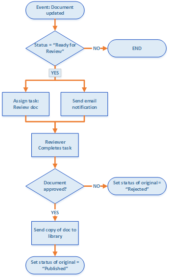
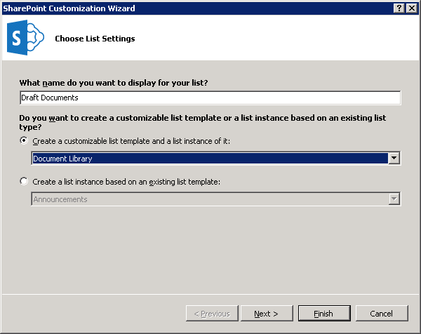
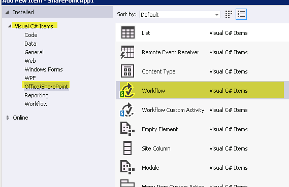
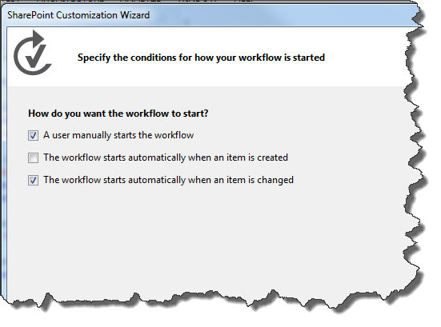
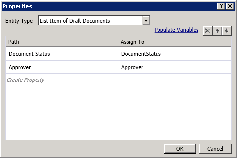
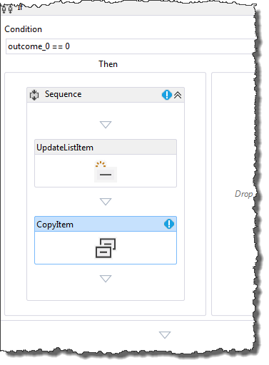
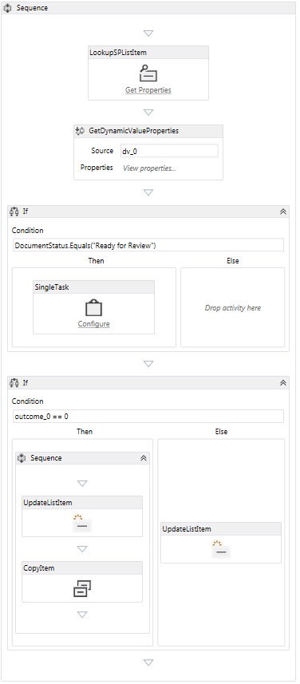

# <a name="create-a-sharepoint-workflow-app-using-visual-studio-2012"></a><span data-ttu-id="48983-102">Создание приложения рабочего процесса SharePoint с помощью Visual Studio 2012</span><span class="sxs-lookup"><span data-stu-id="48983-102">Create a SharePoint workflow app using Visual Studio 2012</span></span>
<span data-ttu-id="48983-103">Пройти через процесс создания рабочего процесса Надстройка SharePoint с помощью Microsoft Visual Studio 2012.</span><span class="sxs-lookup"><span data-stu-id="48983-103">Walk through the process of creating a workflow SharePoint Add-in using Microsoft Visual Studio 2012.</span></span>
## <a name="prerequisites"></a><span data-ttu-id="48983-104">Необходимые условия</span><span class="sxs-lookup"><span data-stu-id="48983-104">Prerequisites</span></span>
<span data-ttu-id="48983-105"><a name="bmPreReq"> </a></span><span class="sxs-lookup"><span data-stu-id="48983-105"><a name="bmPreReq"> </a></span></span>

<span data-ttu-id="48983-106">В этом сценарии разработки предполагает, что в ферме SharePoint и фермой диспетчера рабочих процессов версии 1.0 установлены и в сочетании.</span><span class="sxs-lookup"><span data-stu-id="48983-106">This development scenario presumes that a SharePoint farm and a Workflow Manager 1.0 farm are installed and paired.</span></span> <span data-ttu-id="48983-107">Эти две фермы может располагаться на том же или на отдельных серверах.</span><span class="sxs-lookup"><span data-stu-id="48983-107">These two farms can be located on the same or on separate server computers.</span></span> <span data-ttu-id="48983-108">Сценарий дальнейшей предполагает, что рабочий процесс разработки с удалением удаленно - то есть на компьютере, отдельно от одного из компьютеров сервера - и с помощью Microsoft Visual Studio 2012 или более поздней версии.</span><span class="sxs-lookup"><span data-stu-id="48983-108">The scenario further presumes that workflow development is taking place remotely - that is, on a computer separate from either of the server computers - and is using Microsoft Visual Studio 2012 or later.</span></span>
  
    
    

- <span data-ttu-id="48983-109">На платформах сервера:</span><span class="sxs-lookup"><span data-stu-id="48983-109">On the server platforms:</span></span>
    
  - <span data-ttu-id="48983-110">Windows Server 2008 R2.</span><span class="sxs-lookup"><span data-stu-id="48983-110">Windows Server 2008 R2.</span></span>
    
  
  - <span data-ttu-id="48983-111">Microsoft SharePoint</span><span class="sxs-lookup"><span data-stu-id="48983-111">Microsoft SharePoint</span></span>
    
  
  - <span data-ttu-id="48983-112">Workflow Manager 1.0</span><span class="sxs-lookup"><span data-stu-id="48983-112">Workflow Manager 1.0</span></span>
    
  
- <span data-ttu-id="48983-113">На платформе разработки:</span><span class="sxs-lookup"><span data-stu-id="48983-113">On the development platform:</span></span>
    
  - <span data-ttu-id="48983-114">Microsoft Visual Studio 2012 или более поздней версии.</span><span class="sxs-lookup"><span data-stu-id="48983-114">Microsoft Visual Studio 2012 or later.</span></span>
    
  
  - <span data-ttu-id="48983-115">Инструменты разработчика Office для Visual Studio 2013.</span><span class="sxs-lookup"><span data-stu-id="48983-115">Office Developer Tools for Visual Studio 2013.</span></span>
    
    > <span data-ttu-id="48983-116">**Примечание:** Office Developer Tools для Visual Studio 2013 только в том случае, необходимых для использования Visual Studio 2012.</span><span class="sxs-lookup"><span data-stu-id="48983-116">**Note:** Office Developer Tools for Visual Studio 2013 is only required when using Visual Studio 2012.</span></span> <span data-ttu-id="48983-117">Более поздние версии Visual Studio включают средства для разработчиков Office.</span><span class="sxs-lookup"><span data-stu-id="48983-117">Later versions of Visual Studio include the Office Developer Tools.</span></span> 
      > <span data-ttu-id="48983-118">Установка и настройка среды разработки рабочего процесса SharePoint можно найти следующее:</span><span class="sxs-lookup"><span data-stu-id="48983-118">For assistance setting up and configuring your SharePoint workflow development environment, see the following:</span></span>
  
    
    

-  [<span data-ttu-id="48983-119">Подготовка к Установка и настройка среды разработки рабочего процесса SharePoint</span><span class="sxs-lookup"><span data-stu-id="48983-119">Prepare to set up and configure a SharePoint workflow development environment</span></span>](prepare-to-set-up-and-configure-a-sharepoint-workflow-development-environment.md)
    
  
-  [<span data-ttu-id="48983-120">Настройка рабочих процессов в SharePoint</span><span class="sxs-lookup"><span data-stu-id="48983-120">Configure workflow in SharePoint</span></span>](http://technet.microsoft.com/ru-ru/library/jj658586%28v=office.15%29)
    
  
-  [<span data-ttu-id="48983-121">Серия: Установка и настройка рабочего процесса в SharePoint</span><span class="sxs-lookup"><span data-stu-id="48983-121">Video series: Install and configure Workflow in SharePoint</span></span>](http://technet.microsoft.com/ru-ru/library/dn201724%28v=office.15%29)
    
  

## <a name="get-started"></a><span data-ttu-id="48983-122">Начало работы</span><span class="sxs-lookup"><span data-stu-id="48983-122">Get started</span></span>
<span data-ttu-id="48983-123"><a name="bmGetStarted"> </a></span><span class="sxs-lookup"><span data-stu-id="48983-123"><a name="bmGetStarted"> </a></span></span>

<span data-ttu-id="48983-p103">Распространенные сценарии рабочего процесса в параметрах business — это процесс проверки и утверждения документов. В этом пошаговом руководстве создайте Надстройка SharePoint, который автоматизирует маршрутизации, уведомления и рабочий процесс утверждения или отклонения документа с помощью SharePoint. Мы создадим этот рабочий процесс, с помощью конструктора рабочих процессов SharePoint в Microsoft Visual Studio 2012.</span><span class="sxs-lookup"><span data-stu-id="48983-p103">A common workflow scenario in business settings is the document review and approval process. In this walkthrough, we create an SharePoint Add-in that automates the routing, notifications, and approval (or rejection) of a document using a SharePoint workflow. We create this workflow using the SharePoint workflow designer in Microsoft Visual Studio 2012.</span></span>
  
    
    
<span data-ttu-id="48983-127">Вот блок-схема, иллюстрирующая курс рабочий процесс, мы создадим.</span><span class="sxs-lookup"><span data-stu-id="48983-127">Here's a flowchart that depicts the course of the workflow we're going to create.</span></span>
  
    
    

<span data-ttu-id="48983-128">**На рисунке 1. Блок-схема, изображающая рабочий процесс утверждения документа.**</span><span class="sxs-lookup"><span data-stu-id="48983-128">**Figure 1. Flowchart depicting the document approval workflow.**</span></span>

  
    
    

  
    
    

  
    
    
<span data-ttu-id="48983-130">Таким образом рабочий процесс выполняет следующие действия:</span><span class="sxs-lookup"><span data-stu-id="48983-130">In summary, the workflow does the following:</span></span> 
  
    
    

  
    
    

1. <span data-ttu-id="48983-131">Событие change документа, связанного с определенной библиотеке документов запускает экземпляр рабочего процесса.</span><span class="sxs-lookup"><span data-stu-id="48983-131">A document change event associated with a specific document library launches the workflow instance.</span></span>
    
  
2. <span data-ttu-id="48983-132">Если состояние документа "В готов к рассмотрению", рабочий процесс назначает задачу готовые проверяющему, а затем отправляет уведомление по электронной почте о задаче проверяющий.</span><span class="sxs-lookup"><span data-stu-id="48983-132">If the document's status is set to "Ready For Review," the workflow assigns a task to a prearranged reviewer, then sends the reviewer an email notification about the task.</span></span>
    
  
3. <span data-ttu-id="48983-133">Если проверяющий не удается утвердить документ, остается файл документа в библиотеке документов черновиков. Тем не менее задайте для состояние документа «Отменен».</span><span class="sxs-lookup"><span data-stu-id="48983-133">If the reviewer fails to approve the document, the document file remains in the Draft Documents library; however, the document status is set to "Rejected."</span></span>
    
  
4. <span data-ttu-id="48983-p104">Если проверяющий утверждает документ, рабочий процесс копирует документ в библиотеку документов публикации. Исходный файл остается в библиотеке документов черновиков, но имеет статус «Опубликован».</span><span class="sxs-lookup"><span data-stu-id="48983-p104">If the reviewer approves the document, the workflow copies the document into a Published Documents library. The original file remains in the Draft Documents library, but its status is set to "Published."</span></span>
    
  

    
> <span data-ttu-id="48983-136">**Важные:** Прежде чем начать в этом пошаговом руководстве, убедитесь, что среда разработки корректной установке и конфигурации рабочего процесса.</span><span class="sxs-lookup"><span data-stu-id="48983-136">**Important:** Before you start this walkthrough, ensure that you have a properly installed and configured workflow development environment.</span></span> <span data-ttu-id="48983-137">Для получения дополнительных сведений см. [Подготовка к Установка и настройка среды разработки рабочего процесса SharePoint](prepare-to-set-up-and-configure-a-sharepoint-workflow-development-environment.md).</span><span class="sxs-lookup"><span data-stu-id="48983-137">For more information, see  [Prepare to set up and configure a SharePoint workflow development environment](prepare-to-set-up-and-configure-a-sharepoint-workflow-development-environment.md).</span></span> <span data-ttu-id="48983-138">Кроме того убедитесь, что экземпляр, который вы можете создавать рабочие для SharePoint.</span><span class="sxs-lookup"><span data-stu-id="48983-138">Also, ensure that you have a SharePoint instance that you can develop your workflow against.</span></span> <span data-ttu-id="48983-139">Дополнительные сведения можно [Установить SharePoint](http://technet.microsoft.com/ru-ru/library/cc303424.aspx).</span><span class="sxs-lookup"><span data-stu-id="48983-139">For more information, see  [Install SharePoint](http://technet.microsoft.com/ru-ru/library/cc303424.aspx).</span></span> 
  
    
    


## <a name="prepare-your-environment"></a><span data-ttu-id="48983-140">Подготовка среды</span><span class="sxs-lookup"><span data-stu-id="48983-140">Prepare your environment</span></span>
<span data-ttu-id="48983-141"><a name="bmPrepare"> </a></span><span class="sxs-lookup"><span data-stu-id="48983-141"><a name="bmPrepare"> </a></span></span>

<span data-ttu-id="48983-142">Первый шаг Подготовка сайте SharePoint с библиотеками документов, которые будут использовать рабочего процесса.</span><span class="sxs-lookup"><span data-stu-id="48983-142">The first step is preparing our SharePoint site with document libraries that our workflow will use.</span></span>
  
    
    

1. <span data-ttu-id="48983-143">Запустите Visual Studio 2012 и создайте новый проект на основе шаблона **приложение для SharePoint** , как показано на рисунке 2.</span><span class="sxs-lookup"><span data-stu-id="48983-143">Launch Visual Studio 2012 and create a new project using the **App for SharePoint** template, as depicted in Figure 2.</span></span>
    
    > <span data-ttu-id="48983-144">**Примечание:** В этом пошаговом руководстве файл решения с именем «DocApprovalWorkflow1».</span><span class="sxs-lookup"><span data-stu-id="48983-144">**Note:** In this walkthrough, the solution file is named "DocApprovalWorkflow1".</span></span> <span data-ttu-id="48983-145">Рекомендуется использовать таким же именем.</span><span class="sxs-lookup"><span data-stu-id="48983-145">It is recommended that you use the same name.</span></span> <span data-ttu-id="48983-146">Тем не менее если имя решения по-разному, убедитесь, что внесите необходимые изменения в дальнейшим инструкциям.</span><span class="sxs-lookup"><span data-stu-id="48983-146">However, if you name your solution differently, be sure that you make necessary adjustments in the instructions that follow.</span></span> 

   <span data-ttu-id="48983-147">**На рисунке 2. Создание нового проекта в Visual Studio 2012**</span><span class="sxs-lookup"><span data-stu-id="48983-147">**Figure 2. Create new project in Visual Studio 2012**</span></span>

  

  
  

  

  
2. <span data-ttu-id="48983-149">На связанного сайта SharePoint создайте две новые библиотеки документов, выполнив следующие:</span><span class="sxs-lookup"><span data-stu-id="48983-149">On your associated SharePoint site, create two new document libraries by doing the following:</span></span>
    
  - <span data-ttu-id="48983-150">В **Обозревателе решений** щелкните правой кнопкой мыши на значок "DocApprovalWorkflow1" и выберите **Добавить** > **Создать элемент** и затем выберите **список**.</span><span class="sxs-lookup"><span data-stu-id="48983-150">In **Solution Explorer**, right-click on the "DocApprovalWorkflow1" icon and select **Add** > **New Item** and then select **List**.</span></span>
    
  
  - <span data-ttu-id="48983-151">Итоговый **Мастер настройки SharePoint** введите "Черновик документы" в поле имя; Выберите пункт «Библиотеки документов» в раскрывающемся списке в разделе первого переключателя, как показано на рисунке 3.</span><span class="sxs-lookup"><span data-stu-id="48983-151">In the resulting **SharePoint Customization Wizard**, enter "Draft Documents" in the name field; then select "Document Library" in the drop-down under the first radio button, as depicted in Figure 3.</span></span> 
    
  
  - <span data-ttu-id="48983-152">Нажмите кнопку **Далее**, а затем использовать параметры по умолчанию и нажмите кнопку **Готово**.</span><span class="sxs-lookup"><span data-stu-id="48983-152">Click **Next**, then take default settings, and then click **Finish**.</span></span>
    
   <span data-ttu-id="48983-153">**На рисунке 3. Мастер настройки SharePoint для настройки списка.**</span><span class="sxs-lookup"><span data-stu-id="48983-153">**Figure 3. SharePoint customization wizard for List settings.**</span></span>

  

  
  

  

  
3. <span data-ttu-id="48983-155">Создайте второй библиотеки документов, используя те же действия как, за исключением имени этой второй библиотеки «Опубликованные документы».</span><span class="sxs-lookup"><span data-stu-id="48983-155">Create the second document library using the same steps as above, except name this second library "Published Documents".</span></span>
    
  
4. <span data-ttu-id="48983-156">Добавьте два настраиваемых столбцов **и** новые библиотеки документов, которые вы только что создали:</span><span class="sxs-lookup"><span data-stu-id="48983-156">Add two custom columns to **both** of the new document libraries that you just created:</span></span>
    
  - <span data-ttu-id="48983-157">Создайте настраиваемый столбец с именем «Утверждающего» и сделайте его **лицу или группе** тип столбца списка.</span><span class="sxs-lookup"><span data-stu-id="48983-157">Create a custom column named "Approver" and make it a **Person or Group** list column type.</span></span>
    
  
  - <span data-ttu-id="48983-158">Создайте настраиваемый столбец с именем «Состояние документа» и сделайте его столбец списка **выбора** введите (см).</span><span class="sxs-lookup"><span data-stu-id="48983-158">Create a custom column named "Document Status" and make it a **Choice** list column type (see Figure 4).</span></span>
    
  
5. <span data-ttu-id="48983-159">В столбце **Состояние документа** добавьте пять параметров, развернув свойство **Type** в сетке свойств, а затем нажав кнопку с многоточием ( ****...) в свойства **Items** .</span><span class="sxs-lookup"><span data-stu-id="48983-159">On the **Document Status** column, add five choices by expanding the **Type** property in the property grid, then clicking the ellipsis button ( **…**) on the **Items** property.</span></span> <span data-ttu-id="48983-160">Введите значения для выбора в поле, которое отображается, как показано на рисунке 4.</span><span class="sxs-lookup"><span data-stu-id="48983-160">Enter the choice values in the dialog box that appears, as shown in Figure 4.</span></span>
    
  - <span data-ttu-id="48983-161">Черновик в процессе выполнения</span><span class="sxs-lookup"><span data-stu-id="48983-161">Draft in Progress</span></span>
    
  
  - <span data-ttu-id="48983-162">Готово для проверки</span><span class="sxs-lookup"><span data-stu-id="48983-162">Ready for Review</span></span>
    
  
  - <span data-ttu-id="48983-163">Утверждено для публикации</span><span class="sxs-lookup"><span data-stu-id="48983-163">Approved for Publishing</span></span>
    
  
  - <span data-ttu-id="48983-164">Отклонено.</span><span class="sxs-lookup"><span data-stu-id="48983-164">Rejected</span></span>
    
  
  - <span data-ttu-id="48983-165">Опубликованные</span><span class="sxs-lookup"><span data-stu-id="48983-165">Published</span></span>
    
  

   

  

  
  

  

  

## <a name="create-the-basic-workflow"></a><span data-ttu-id="48983-167">Создание базового рабочего процесса</span><span class="sxs-lookup"><span data-stu-id="48983-167">Create the basic workflow</span></span>
<span data-ttu-id="48983-168"><a name="bmCreateWorkflow"> </a></span><span class="sxs-lookup"><span data-stu-id="48983-168"><a name="bmCreateWorkflow"> </a></span></span>

<span data-ttu-id="48983-169">Теперь мы готовы приступить к созданию рабочим процессом.</span><span class="sxs-lookup"><span data-stu-id="48983-169">Now we're ready to create the workflow itself.</span></span>
  
    
    

1. <span data-ttu-id="48983-170">В Visual Studio Создание нового рабочего процесса, щелкнув правой кнопкой мыши на значок **DocApprovalWorkflow1** (в **Окне Обозреватель решений** ) и выбрав пункт **Добавить** > **Новый элемент**, а затем выбрав **рабочего процесса** (см).</span><span class="sxs-lookup"><span data-stu-id="48983-170">In Visual Studio, create a new workflow by right-clicking on the **DocApprovalWorkflow1** icon (in **Solution Explorer**) and selecting **Add** > **New Item**, and then selecting **Workflow** (see Figure 5).</span></span>
    
   <span data-ttu-id="48983-171">**На рисунке 5. Добавление нового элемента > мастер рабочего процесса.**</span><span class="sxs-lookup"><span data-stu-id="48983-171">**Figure 5. Add New Item > Workflow wizard.**</span></span>

  

  
  

  

  
2. <span data-ttu-id="48983-173">Имя рабочего процесса «DocumentApprovalWorkflow» и выберите **Рабочий процесс списка** как рабочего процесса введите (см).</span><span class="sxs-lookup"><span data-stu-id="48983-173">When prompted, name the workflow "DocumentApprovalWorkflow" and select **List Workflow** as the workflow type (see Figure 6).</span></span>
    
   <span data-ttu-id="48983-174">**На рисунке 6. Укажите имя рабочего процесса и тип.**</span><span class="sxs-lookup"><span data-stu-id="48983-174">**Figure 6. Specify workflow name and type.**</span></span>

  

  
  

  

  
3. <span data-ttu-id="48983-p108">В окне **Мастер настройки SharePoint** выберите свяжите нового рабочего процесса с библиотекой документов черновиков; затем выбрать создать новый список журналов и новый список задач рабочего процесса, как показано на рисунке 7. Нажмите кнопку **Далее**.</span><span class="sxs-lookup"><span data-stu-id="48983-p108">In the **SharePoint Customization Wizard**, associate the new workflow with the Draft Document library; then, opt to create a new history list and a new workflow task list, as shown in Figure 7. Then click **Next**.</span></span>
    
   <span data-ttu-id="48983-178">**На рисунке 7. Завершение работы мастера настройки SharePoint для нового рабочего процесса.**</span><span class="sxs-lookup"><span data-stu-id="48983-178">**Figure 7. Completing the SharePoint Customization Wizard for the new workflow.**</span></span>

  

  
  

  

  
4. <span data-ttu-id="48983-p109">Настройка рабочего процесса для автоматического запуска при изменении элемента в библиотеке документов черновиков. Также можно оставить флажок при ручном запуске рабочего процесса установлен; Это позволяет легко проверить рабочего процесса без необходимости изменить документ. В разделе на рисунке 8.</span><span class="sxs-lookup"><span data-stu-id="48983-p109">Set the workflow to start automatically when an item in the Draft Documents library is changed. You can also leave the check box for manually starting the workflow selected; this allows you to easily test the workflow without needing to change a document. See Figure 8.</span></span>
    
   <span data-ttu-id="48983-183">**На рисунке 8. Настройка параметров активации для рабочего процесса.**</span><span class="sxs-lookup"><span data-stu-id="48983-183">**Figure 8. Set the activation parameters for the workflow.**</span></span>

  

  
  

    
    > <span data-ttu-id="48983-185">**Примечание:** Тип сопоставления рабочего процесса можно изменить после создания рабочего процесса с помощью сетки свойств с рабочим процессом, выбранного в **Обозревателе решений** (см).</span><span class="sxs-lookup"><span data-stu-id="48983-185">**Note:** You can change the workflow association type after the workflow has been created by using the property grid with the workflow selected in **Solution Explorer** (see Figure 9).</span></span> <span data-ttu-id="48983-186">Нажмите кнопку **Готово**.</span><span class="sxs-lookup"><span data-stu-id="48983-186">Then click **Finish**.</span></span> 

   <span data-ttu-id="48983-187">**На рисунке 9. Сетка свойств рабочего процесса.**</span><span class="sxs-lookup"><span data-stu-id="48983-187">**Figure 9. The workflow property grid.**</span></span>

  

  
  

  

  
5. <span data-ttu-id="48983-189">И, наконец настройте сервер SharePoint для управления исходящей электронной почты с помощью службы SMTP.</span><span class="sxs-lookup"><span data-stu-id="48983-189">Finally, configure your SharePoint Server to manage outgoing email using the SMTP service.</span></span> <span data-ttu-id="48983-190">Сведения содержатся в разделе [Настройка исходящей электронной почты для фермы SharePoint](http://technet.microsoft.com/ru-ru/library/cc263462.aspx).</span><span class="sxs-lookup"><span data-stu-id="48983-190">For instructions, see  [Configure outgoing email for a SharePoint farm](http://technet.microsoft.com/ru-ru/library/cc263462.aspx).</span></span> <span data-ttu-id="48983-191">Это необходимо разрешить рабочего процесса, чтобы отправлять уведомления по электронной почте, относящиеся к задачам рабочего процесса.</span><span class="sxs-lookup"><span data-stu-id="48983-191">This is necessary to allow the workflow to send email notifications related to workflow tasks.</span></span>
    
  

## <a name="implement-the-workflow-logic"></a><span data-ttu-id="48983-192">Реализация логики рабочих процессов.</span><span class="sxs-lookup"><span data-stu-id="48983-192">Implement the workflow logic</span></span>
<span data-ttu-id="48983-193"><a name="bmImplementLogic"> </a></span><span class="sxs-lookup"><span data-stu-id="48983-193"><a name="bmImplementLogic"> </a></span></span>

<span data-ttu-id="48983-194">Теперь, когда у нас есть наш SharePoint Server, Настройка и наш базовый рабочий процесс, созданный, мы теперь разработка логики рабочего процесса.</span><span class="sxs-lookup"><span data-stu-id="48983-194">Now that we have our SharePoint Server set up and our basic workflow created, we can now design the workflow logic.</span></span>
  
    
    

1. <span data-ttu-id="48983-p112">Откройте конструктор рабочих процессов, дважды щелкнув элемент проекта рабочего процесса в **Окне Обозреватель решений**. Вы увидите поверхность конструктора рабочих процессов (и панель элементов рабочего процесса); Конструктор заполненный на этап начальной рабочего процесса с именем **последовательности**.</span><span class="sxs-lookup"><span data-stu-id="48983-p112">Open the workflow designer by double-clicking on the workflow project item in **Solution Explorer**. You will see the workflow designer surface (and the workflow toolbox); the designer is populated with an initial workflow stage named **Sequence**.</span></span>
    
  
2. <span data-ttu-id="48983-p113">Наш первый шаг — это получить активности **LookupSPListItem** из панели элементов (см) и поместите его в рабочей области **последовательность** на поверхность конструктора. Это действие используется для получения состояния документа в любой момент времени активности **LookupSPListItem** возвращает как объект [DynamicValue](http://msdn.microsoft.com/ru-ru/library/windowsazure/microsoft.activities.dynamicvalue%28v=azure.10%29.aspx) , который содержит набор свойств элемента списка SharePoint как пары "ключ значение".</span><span class="sxs-lookup"><span data-stu-id="48983-p113">Our first step is to grab the **LookupSPListItem** activity from the toolbox (see Figure 10) and drop it in the **Sequence** stage on the designer surface. We use this activity to get the status of the document at any given time, which the **LookupSPListItem** activity returns as a [DynamicValue](http://msdn.microsoft.com/ru-ru/library/windowsazure/microsoft.activities.dynamicvalue%28v=azure.10%29.aspx) object that contains a set of SharePoint list item properties as key-value pairs.</span></span>
    
   <span data-ttu-id="48983-199">**На рисунке 10. Действий lookupsplistitem.**</span><span class="sxs-lookup"><span data-stu-id="48983-199">**Figure 10. LookupSPListItem activity selector.**</span></span>

  

  
  

  

1. <span data-ttu-id="48983-p114">Чтобы настроить действие **LookupSPListItem**, выберите команду его в конструкторе, чтобы выбрать его. Это активирует сетки свойств для действия.</span><span class="sxs-lookup"><span data-stu-id="48983-p114">To configure the **LookupSPListItem** activity, first click on it in the designer to select it. This activates the property grid for the activity.</span></span>
    
  
2. <span data-ttu-id="48983-203">Использование полей с выбором в сетке свойств для настройки действий **LookupSPListItem** для использования "текущий элемент" для **ItemId** и "текущий список" в качестве **ListId**, как показано на рисунке 11.</span><span class="sxs-lookup"><span data-stu-id="48983-203">Use the combo boxes in the property grid to configure the **LookupSPListItem** activity to use "current item" for **ItemId** and "current list" as **ListId**, as shown in Figure 11.</span></span>
    
   <span data-ttu-id="48983-204">**На рисунке 11. Настройка свойств LookupSPListItem.**</span><span class="sxs-lookup"><span data-stu-id="48983-204">**Figure 11. Configuring LookupSPListItem properties.**</span></span>

  

  
  

  

  
3. <span data-ttu-id="48983-p115">В разделе действий **LookupSPListItem** щелкните ссылку **Получите свойства**. Это нужно выполнить два важных шагов для вас.</span><span class="sxs-lookup"><span data-stu-id="48983-p115">On the **LookupSPListItem** activity tile, click the **Get Properties** link. This completes two important steps for you:</span></span>
    
1. <span data-ttu-id="48983-p116">Во-первых, он создает переменную типа **DynamicValue** и связывает его выходной аргумент, (с именем _Result_) из **LookupSPListItem** действия. Свойства элемента списка, хранятся в переменной.</span><span class="sxs-lookup"><span data-stu-id="48983-p116">First, it creates a variable of type **DynamicValue** and binds it to the out-argument (named _Result_) of the of the **LookupSPListItem** activity. Properties of the list item are stored in this variable.</span></span>
    
  
2. <span data-ttu-id="48983-p117">Во-вторых, добавляется новое действие с именем **GetDynamicValueProperties** (см) и устанавливает переменную только что созданный **DynamicValue** в качестве входного аргумента этого нового действия. Это действие позволяет извлечь свойства элемента списка из переменной **DynamicValue**.</span><span class="sxs-lookup"><span data-stu-id="48983-p117">Second, it adds a new activity named **GetDynamicValueProperties** (see Figure 12) and sets the newly created **DynamicValue** variable as the in-argument of this new activity. This activity lets you extract the list item properties from the **DynamicValue** variable.</span></span>
    
  
4. <span data-ttu-id="48983-p118">Для действия **GetDynamicValueProperties** щелкните *Определение...*  , чтобы открыть диалоговое окно, которое позволяет выбрать свойства, которые вы хотите извлечь. В выберите пункт Свойства, ссылаться на рисунке 12, которая показана часть области конструирования объединено с открыть диалоговое окно **Свойства**.</span><span class="sxs-lookup"><span data-stu-id="48983-p118">On the **GetDynamicValueProperties** activity, click on *Define…*  to open a dialog box that lets you pick the properties you wish to extract. In selecting properties, refer to Figure 12, which shows a portion of the designer surface merged with the open **Properties** dialog box.</span></span>
    
   <span data-ttu-id="48983-215">**На рисунке 12. Выбор DynamicValue свойства, которые вы хотите извлечь.**</span><span class="sxs-lookup"><span data-stu-id="48983-215">**Figure 12. Selecting the DynamicValue properties that you wish to extract.**</span></span>

  

  
  

  

1. <span data-ttu-id="48983-217">**Тип сущности** выберите **Список элементов черновиков документов**.</span><span class="sxs-lookup"><span data-stu-id="48983-217">For **Entity Type**, select **List Item of Draft Documents**.</span></span>
    
  
2. <span data-ttu-id="48983-p119">В таблице данных, в столбце **путь** щелкните *Создать свойство*  , чтобы открыть поле со списком, который содержит свойства, доступные для элементов списка в библиотеке документов черновиков. Выберите **Состояние документа** в поле со списком.</span><span class="sxs-lookup"><span data-stu-id="48983-p119">In the data grid, in the **Path** column, click *Create Property*  to open a combo box that contains available properties for list items in the Draft Documents library. Select **Document Status** from the combo box.</span></span>
    
  
3. <span data-ttu-id="48983-220">В следующей строке в таблице данных нажмите кнопку  *Создать свойство*  еще раз; на этот раз выберите **утверждающий** в поле со списком.</span><span class="sxs-lookup"><span data-stu-id="48983-220">On the next row in the data grid, click  *Create Property*  again; this time, select **Approver** from the combo box.</span></span>
    
  
4. <span data-ttu-id="48983-p120">Теперь щелкните ссылку **Заполнения переменных** в диалоговом окне. Это создает переменную соответствующего типа данных для каждой строки и назначает ее в столбце **Назначения для** таблицы данных, как показано на рисунке 13.</span><span class="sxs-lookup"><span data-stu-id="48983-p120">Now click the **Populate Variables** link on the dialog box. This creates a variable of the appropriate data type for each row and assigns it in the **Assign To** column of the data grid, as shown in Figure 13.</span></span>
    
   <span data-ttu-id="48983-223">**На рисунке 13. Получение состояния документа и утверждающих свойств.**</span><span class="sxs-lookup"><span data-stu-id="48983-223">**Figure 13. Get Document Status and Approver properties.**</span></span>

  

  
  

  

  
5. <span data-ttu-id="48983-p121">Теперь у нас есть список значений элементов, которые необходимо. Следующим шагом является настройка рабочего процесса для проверки, является ли документ «Готово для проверки» и выполните необходимые действия, когда это.</span><span class="sxs-lookup"><span data-stu-id="48983-p121">We now have the list item values that we need. Next step is to set up the workflow to check whether the document is "ready for review" and to take the appropriate action when it is.</span></span>
    
1. <span data-ttu-id="48983-p122">В панели элементов перетащите активность **If** на поверхность конструктора рабочих процессов. (Можно найти **If** активности в разделе **Поток управления** панели инструментов.)</span><span class="sxs-lookup"><span data-stu-id="48983-p122">From the toolbox, drag the **If** activity onto the workflow designer surface. (You'll find the **If** activity in the **Control Flow** section of the toolbox.)</span></span>
    
  
2. <span data-ttu-id="48983-229">Значение условие **If** `DocumentStatus.Equals("Ready for Review")`, как показано на рисунке 14.</span><span class="sxs-lookup"><span data-stu-id="48983-229">Set the **If** condition to `DocumentStatus.Equals("Ready for Review")`, as shown in Figure 14.</span></span>
    
   <span data-ttu-id="48983-230">**На рисунке 14. Создание If/нажмите предложения WHERE для запуска задачи.**</span><span class="sxs-lookup"><span data-stu-id="48983-230">**Figure 14. Creating an If/Then clause to trigger a task.**</span></span>

  

  
  

  

  
3. <span data-ttu-id="48983-p123">Рассмотрим процедуру из раздела **SP - задач** из панели элементов перетащите действие **SingleTask** и поместите его в поле **Then** **If** действие. В результате настройки рабочего процесса таким образом, что **If** документ Готово для проверки, **Then**, он будет затем выполнения задачи.</span><span class="sxs-lookup"><span data-stu-id="48983-p123">Next, from the **SP - Task** section of the toolbox, drag a **SingleTask** activity and drop it in the **Then** box of your **If** activity. In effect, you have configured the workflow such that **If** the document is ready for review, **Then** it will then complete this task.</span></span>
    
  
6. <span data-ttu-id="48983-234">Следующий шаг —, чтобы настроить только что созданный с помощью конфигурации диалоговом окне показано на рисунке 15.</span><span class="sxs-lookup"><span data-stu-id="48983-234">Our next step is to configure the task that we just created using the configuration dialog box, shown in Figure 15.</span></span>
    
   <span data-ttu-id="48983-235">**На рисунке 15. Диалоговое окно настройки задачи.**</span><span class="sxs-lookup"><span data-stu-id="48983-235">**Figure 15. Task configuration dialog box.**</span></span>

  

  
  

  

1. <span data-ttu-id="48983-p124">Во-первых мы назначить задачу на утверждение. Для этого щелкните ссылку **настроить** плитку **SingleTask** активности.</span><span class="sxs-lookup"><span data-stu-id="48983-p124">First, we assign the task to an approver. To do this, click the **Configure** link in the **SingleTask** activity tile.</span></span>
    
  
2. <span data-ttu-id="48983-239">Установка **назначается:** поля «Утверждение».</span><span class="sxs-lookup"><span data-stu-id="48983-239">Set the **Assigned to:** field to "Approver".</span></span>
    
  
3. <span data-ttu-id="48983-240">Обратите внимание, что **задач заголовок:** поле автоматически заполняется «Задача рабочего процесса».</span><span class="sxs-lookup"><span data-stu-id="48983-240">Notice that the **Task title:** field is automatically populated with "Workflow task".</span></span>
    
  
4. <span data-ttu-id="48983-241">В **тело:** введите простое сообщение с инструкциями для утверждающего, такие как «ознакомьтесь с этот документ на утверждение для публикации.»</span><span class="sxs-lookup"><span data-stu-id="48983-241">In the **Body:** field, enter a simple message with instructions for the approver, such as "Please review this document for approval to publish."</span></span>
    
  
5. <span data-ttu-id="48983-242">Нажмите **кнопку ОК**, чтобы сохранить.</span><span class="sxs-lookup"><span data-stu-id="48983-242">Click **OK** to save.</span></span>
    
  

    <span data-ttu-id="48983-p125">Обратите внимание на то, на этом этапе наличие ошибки проверки для **SingleTask** действия. С **SingleTask** плитку выбран просмотрите свойства **AssignedTo** в сетке свойств и обратите внимание на то, что она имеет значок ошибки. Наведите указатель мыши на имя свойства, чтобы увидеть подсказка с описанием проблемы. Видно, что свойство **AssignedTo** ожидает значение **String**; Тем не менее **утверждающий** переменная имеет тип данных **Int32**.</span><span class="sxs-lookup"><span data-stu-id="48983-p125">Notice that at this point you have a validation error on the **SingleTask** activity. With the **SingleTask** tile selected, look at the **AssignedTo** property in the property grid and note that it has an error icon. Hover over the property name to see a tooltip that describes the problem. We see that the **AssignedTo** property expects a **String** value; however, the **Approver** variable is of **Int32** data type.</span></span>
    
    <span data-ttu-id="48983-247">Чтобы устранить эту ошибку, привести переменной с типом данных **String**, добавив к ". ToString() "«Утверждение» в **AssignedTo** строк на сетка свойств, как показано на рисунке 16.</span><span class="sxs-lookup"><span data-stu-id="48983-247">To correct this error, cast the variable to a **String** data type by appending ".ToString()" to "Approver" in the **AssignedTo** row on the property grid, as shown in Figure 16.</span></span>
    

   <span data-ttu-id="48983-248">**На рисунке 16. Приведение «Утверждающего» значения к строковому типу данных в сетке свойств.**</span><span class="sxs-lookup"><span data-stu-id="48983-248">**Figure 16. Casting the "Approver" variable to string data type in the property grid.**</span></span>

  

  
  

    <span data-ttu-id="48983-250">В текущий момент в этом пошаговом руководстве после создания и настройки задачи рабочего процесса, который выполняет две вещи: задает документа для анализа, но также отправляет несколько электронной почты для исполнителя задачи ("утверждающего" в данном случае) о том, ему, что задача назначена и ожидает действия.</span><span class="sxs-lookup"><span data-stu-id="48983-250">At the present point in this walkthrough you have created and configured a workflow task that does two things: It sets a document to be reviewed, but also sends an email to the task assignee (the "Approver" in this case) notifying him or her that a task has been assigned and is waiting for actions.</span></span>
    
  
7. <span data-ttu-id="48983-p126">Давайте взглянем на сетка свойств для действия **SingleTask**. Перейдите к нижней части сетки свойств и примечание в разделе **выходных данных** существует два свойства, **результат** и **TaskItemId**, которые являются выходные аргументы.</span><span class="sxs-lookup"><span data-stu-id="48983-p126">Let's look at the property grid for the **SingleTask** activity. Scroll to the bottom of the property grid and note in the **Output** section there are two properties, **Outcome** and **TaskItemId**, which are out-arguments.</span></span>
    
    <span data-ttu-id="48983-p127">Обратите внимание на имя переменной **результат**:  _outcome_0_ (или аналогичные). Эта переменная используется для проверки результат задачи - то есть ли утверждающему утверждения или отклонения документа.</span><span class="sxs-lookup"><span data-stu-id="48983-p127">Note the name of the **Outcome** variable: _outcome_0_ (or similar). We use this variable to check the outcome of the task - that is, whether the approver has approved or rejected the document.</span></span>
    
    > <span data-ttu-id="48983-255">**Примечание:** Выходной аргумент **результата** возвращает значение типа **Int32** , соответствующий индексу результата - то есть, **0** «Утверждено» и " **1** " для «Отменен».</span><span class="sxs-lookup"><span data-stu-id="48983-255">**Note:** The **Outcome** out-argument returns an **Int32** value corresponding to the index of the outcome - that is, **0** for "Approved" and **1** for "Rejected".</span></span> <span data-ttu-id="48983-256">Эти целые числа — значения по умолчанию, предоставляемые в стандартной столбца сайта SharePoint, с именем «Результат задачи».</span><span class="sxs-lookup"><span data-stu-id="48983-256">These integers are the default values provided in the out-of-box SharePoint site column named "Task Outcome."</span></span>
8. <span data-ttu-id="48983-p129">Теперь, чтобы рабочего процесса, чтобы проверить результат задачи, нужно добавить другие операции **If** и поместите его после действия **SingleTask**, но внутри области **Then**, как показано на рисунке 17. Установка **If** условие " `outcome_0 == 0`" сообщает нам утверждения документа.</span><span class="sxs-lookup"><span data-stu-id="48983-p129">Now, in order for the workflow to check the outcome of the task, we need to add another **If** activity and place it following the **SingleTask** activity, but inside the **Then** area, as shown in Figure 17. Setting the **If** condition to " `outcome_0 == 0`" tells us whether the document was approved.</span></span>
    
   <span data-ttu-id="48983-259">**На рисунке 17. Добавление действия IF для проверки состояния задания.**</span><span class="sxs-lookup"><span data-stu-id="48983-259">**Figure 17. Adding the IF activity to check the task status.**</span></span>

  

  
  

  

  
9. <span data-ttu-id="48983-p130">Если утверждающий есть задач "Утверждено", мы обновить состояние документа на "Утверждено для публикации", а затем скопируйте файл документа в библиотеку документов публикации. Кроме того Если Утверждающий отклонил документа, необходимо установить состояние документа «Отменен».</span><span class="sxs-lookup"><span data-stu-id="48983-p130">If the approver has set the task to "Approved," we update the document status to "Approved for Publishing," then copy the document file to the Published Documents library. Alternatively, if the approver has rejected the document, we need to set the document status to "Rejected."</span></span>
    
1. <span data-ttu-id="48983-263">В этом новое действие **If** перетащите действие **UpdateListItem** в поле **Then**.</span><span class="sxs-lookup"><span data-stu-id="48983-263">In this new **If** activity, drag an **UpdateListItem** activity into the **Then** box.</span></span>
    
  
2. <span data-ttu-id="48983-264">Настройка **UpdateListItem** активности в его сетка свойств таким образом, что **ItemId** задано значение "(текущего элемента)" и **ListId** задано значение "(текущий список)", как показано на рисунке 18.</span><span class="sxs-lookup"><span data-stu-id="48983-264">Configure the **UpdateListItem** activity in its property grid such that **ItemId** is set to "(current item)" and **ListId** is set to "(current list)", as shown in Figure 18.</span></span>
    
  
3. <span data-ttu-id="48983-265">Рассмотрим процедуру с **UpdateListItem** выберите действие нажмите кнопку с многоточием ( ****...) рядом с полем **ListItemPropertiesDynamicValue** в сетке свойств.</span><span class="sxs-lookup"><span data-stu-id="48983-265">Next, with the **UpdateListItem** activity selected, click the ellipsis button ( **…**) adjacent to the **ListItemPropertiesDynamicValue** field in the property grid.</span></span> <span data-ttu-id="48983-266">Откроется диалоговое окно, которое позволяет указать, какие свойства элемента списка, которую требуется обновить.</span><span class="sxs-lookup"><span data-stu-id="48983-266">This action opens a dialog box that allows you to specify which list item properties you want to update.</span></span>
    
   <span data-ttu-id="48983-267">**На рисунке 18. Установка свойств элемента для обновления в списке.**</span><span class="sxs-lookup"><span data-stu-id="48983-267">**Figure 18. Setting the list item properties to update.**</span></span>

  

  
  

  

  
4. <span data-ttu-id="48983-p132">В диалоговом окне используйте поле со списком Чтобы задать **Тип сущности** в **Список элементов черновиков документов** (как показано на рисунке 18). Затем в сетке данных нажмите кнопку **Создать свойство** и в раскрывающемся списке выберите "Состояние документа". Затем в столбце **значение** введите "Утверждено для публикации" (включая кавычки) и нажмите **кнопку ОК**.</span><span class="sxs-lookup"><span data-stu-id="48983-p132">In the dialog box, first use the combo box to set **Entity Type** to **List Item of Draft Documents** (shown in Figure 18). Then, in the data grid, click **Create Property** and from the drop-down list select "Document Status." Then, under the **Value** column, type "Approved for Publication" (including quotation marks) and click **OK**.</span></span>
    
  
10. <span data-ttu-id="48983-272">В области **Then** текущей активности **If** перетащите действия **CopyItem** и поместите его непосредственно под действие **UpdateListItem**, как показано на рисунке 19.</span><span class="sxs-lookup"><span data-stu-id="48983-272">In the **Then** area of the current **If** activity, drag a **CopyItem** activity and place it directly below the **UpdateListItem** activity, as shown in Figure 19.</span></span>
    
   <span data-ttu-id="48983-273">**На рисунке 19. Добавление действия CopyItem в рабочий процесс.**</span><span class="sxs-lookup"><span data-stu-id="48983-273">**Figure 19. Adding a CopyItem activity to the workflow.**</span></span>

  

  
  

    <span data-ttu-id="48983-p133">Затем щелкните Настройка свойств действия **CopyItem** в сетка свойств, как показано на рисунке 20. Значения свойств, выделены.</span><span class="sxs-lookup"><span data-stu-id="48983-p133">Then, configure properties of the **CopyItem** activity in the property grid as depicted in Figure 20. Property values are highlighted.</span></span>
    

   <span data-ttu-id="48983-277">**На рисунке 20. Настройка действия CopyItem.**</span><span class="sxs-lookup"><span data-stu-id="48983-277">**Figure 20. Configuring the CopyItem activity.**</span></span>

  

  
  

    
    > <span data-ttu-id="48983-279">**Примечание:** В данном пошаговом руководстве мы будем предполагается, что все наших опубликованные документы поступают из библиотеки документов черновиков; Таким образом мы не нужно заниматься управление для файлов с одинаковыми именами.</span><span class="sxs-lookup"><span data-stu-id="48983-279">**Note:** For the purpose of this walkthrough we are going to assume that all of our published documents come out of the Draft Documents library; therefore, we do not need to worry about controlling for duplicate file names.</span></span> 
11. <span data-ttu-id="48983-p134">И, наконец нужно добавить действие для обработки в случае, когда проверяющий отклоняет документ. Для этого, добавив **UpdateListItem** активности в область **Else** нашей текущей активности **If**. Настройте действие **UpdateListItem** так же, как вы из предыдущего 9(c) шаг, за исключением того, что теперь нужно установить состояние документа на "Отклонено", как показано на рисунке 21.</span><span class="sxs-lookup"><span data-stu-id="48983-p134">Finally, we need to add an activity to handle the case where the reviewer rejects the document. We do this by adding an **UpdateListItem** activity to the **Else** area of our current **If** activity. Configure this **UpdateListItem** activity just as you did the prior one in step 9(c), except that now we want to set the document status to "Rejected," as shown in Figure 21.</span></span>
    
   <span data-ttu-id="48983-283">**На рисунке 21. Настройка свойств действия UpdateListItem для отклоненных документов.**</span><span class="sxs-lookup"><span data-stu-id="48983-283">**Figure 21. Configuring properties of UpdateListItem activity for rejected documents.**</span></span>

  

  
  

  

  
<span data-ttu-id="48983-p135">На этом завершается «Создание рабочего процесса утверждения документов SharePoint». Завершенный рабочий процесс показан на рисунке 22.</span><span class="sxs-lookup"><span data-stu-id="48983-p135">This completes "Creating a SharePoint document approval workflow." The completed workflow is shown in Figure 22.</span></span>
  
    
    

<span data-ttu-id="48983-287">**На рисунке 22. Завершенная SharePoint рабочий процесс утверждения документа.**</span><span class="sxs-lookup"><span data-stu-id="48983-287">**Figure 22. Completed SharePoint document approval workflow.**</span></span>

  
    
    

  
    
    

  
    
    

  
    
    

  
    
    

## <a name="package-and-deploy-the-workflow"></a><span data-ttu-id="48983-289">Упаковка и развертывание рабочего процесса</span><span class="sxs-lookup"><span data-stu-id="48983-289">Package and deploy the workflow</span></span>
<span data-ttu-id="48983-290"><a name="bk_deploy"> </a></span><span class="sxs-lookup"><span data-stu-id="48983-290"><a name="bk_deploy"> </a></span></span>

<span data-ttu-id="48983-291">Ниже перечислены ресурсы, которые обеспечивают руководство для упаковки и развертывания рабочего процесса как Надстройка SharePoint:</span><span class="sxs-lookup"><span data-stu-id="48983-291">Following are resources that provide guidance for packaging and deploying your workflow as an SharePoint Add-in:</span></span>
  
    
    

-  [<span data-ttu-id="48983-292">Развертывание и установка приложений для SharePoint: методы и параметры</span><span class="sxs-lookup"><span data-stu-id="48983-292">Deploying and installing apps for SharePoint: methods and options</span></span>](http://msdn.microsoft.com/ru-ru/library/fp179933.aspx)
    
  
-  [<span data-ttu-id="48983-293">Публикация приложений для SharePoint</span><span class="sxs-lookup"><span data-stu-id="48983-293">Publish apps for SharePoint</span></span>](http://msdn.microsoft.com/ru-ru/library/jj164070.aspx)
    
  
-  <span data-ttu-id="48983-294">[Как: Создание и развертывание декларативные рабочие процессы в изолированных решениях](http://msdn.microsoft.com/ru-ru/library/gg615452%28v=office.14%29.aspx) (С помощью SharePoint Designer 2013 )</span><span class="sxs-lookup"><span data-stu-id="48983-294">[How to: Create and Deploy Declarative Workflows in Sandboxed Solutions](http://msdn.microsoft.com/ru-ru/library/gg615452%28v=office.14%29.aspx) (Using SharePoint Designer 2013)</span></span>
    
  

> <span data-ttu-id="48983-295">**Осторожность:** SharePoint надстройки, которая содержит интегрированной рабочие процессы (которые могут быть связаны со списками на родительский сайт) отличаются от приложений обычного рабочего процесса, изменив следующий тег значение **true** в `workflowmanifest.xml` файл в пакете приложения:</span><span class="sxs-lookup"><span data-stu-id="48983-295">**Caution:** SharePoint Add-ins that contain integrated workflows (which can be associated with lists on the parent web) are differentiated from normal workflow apps by changing the following tag to **true** in the `workflowmanifest.xml` file in the app package:</span></span>
  
    
    


```XML

<SPIntegratedWorkflow xmlns="http://schemas.microsoft.com/sharepoint/2014/app/integratedworkflow">
    <IntegratedApp>true</IntegratedApp>
</SPIntegratedWorkflow>

```


## <a name="additional-resources"></a><span data-ttu-id="48983-296">Дополнительные ресурсы</span><span class="sxs-lookup"><span data-stu-id="48983-296">Additional resources</span></span>
<span data-ttu-id="48983-297"><a name="bk_addresources"> </a></span><span class="sxs-lookup"><span data-stu-id="48983-297"><a name="bk_addresources"> </a></span></span>


-  [<span data-ttu-id="48983-298">Рабочие процессы в SharePoint</span><span class="sxs-lookup"><span data-stu-id="48983-298">Workflows in SharePoint</span></span>](workflows-in-sharepoint.md)
    
  
-  [<span data-ttu-id="48983-299">Подготовка к Установка и настройка среды разработки рабочего процесса SharePoint</span><span class="sxs-lookup"><span data-stu-id="48983-299">Prepare to set up and configure a SharePoint workflow development environment</span></span>](prepare-to-set-up-and-configure-a-sharepoint-workflow-development-environment.md)
    
  
-  [<span data-ttu-id="48983-300">Рекомендации по разработке рабочих процессов SharePoint</span><span class="sxs-lookup"><span data-stu-id="48983-300">SharePoint workflow development best practices</span></span>](sharepoint-workflow-development-best-practices.md)
    
  
-  [<span data-ttu-id="48983-301">Разработка рабочих процессов в SharePoint с помощью Visual Studio</span><span class="sxs-lookup"><span data-stu-id="48983-301">Develop SharePoint workflows using Visual Studio</span></span>](develop-sharepoint-workflows-using-visual-studio.md)
    
  

  
    
    

