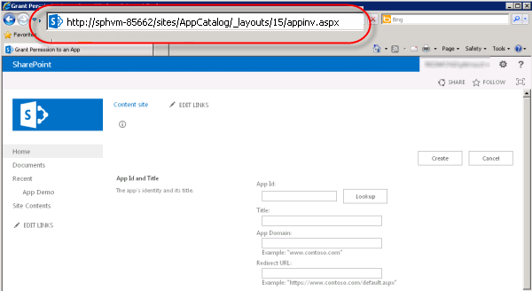
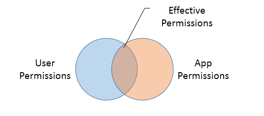

# <a name="create-a-workflow-with-elevated-permissions-by-using-the-sharepoint-workflow-platform"></a><span data-ttu-id="c2940-102">Создание рабочего процесса с повышенным уровнем разрешений при помощи платформы SharePoint Workflow</span><span class="sxs-lookup"><span data-stu-id="c2940-102">Create a workflow with elevated permissions by using the SharePoint Workflow platform</span></span>
<span data-ttu-id="c2940-103">Узнайте, как создать рабочий процесс с повышенным уровнем разрешений с помощью платформы рабочих процессов SharePoint.</span><span class="sxs-lookup"><span data-stu-id="c2940-103">Learn how to create a workflow with elevated permissions by using the SharePoint Workflow platform.</span></span>
## <a name="sharepoint-app-catalog-and-workflow"></a><span data-ttu-id="c2940-104">Каталог приложений SharePoint и рабочих процессов</span><span class="sxs-lookup"><span data-stu-id="c2940-104">SharePoint App Catalog and workflow</span></span>
<span data-ttu-id="c2940-105"><a name="section1"> </a></span><span class="sxs-lookup"><span data-stu-id="c2940-105"></span></span>

<span data-ttu-id="c2940-106">В этой статье описывается, как для создания рабочих процессов SharePoint, доступ к объектам в SharePoint, которые требуют повышенного уровня разрешений.</span><span class="sxs-lookup"><span data-stu-id="c2940-106">This article describes how to create SharePoint workflows that access objects in SharePoint that require elevated permissions.</span></span> <span data-ttu-id="c2940-107">Эти решения использовать две функции: предоставление разрешений для приложения рабочего процесса и переноса действий с помощью шаге приложения.</span><span class="sxs-lookup"><span data-stu-id="c2940-107">These solutions use two features: granting permissions to the workflow app and wrapping actions with the App Step.</span></span>
  
    
    

> <span data-ttu-id="c2940-108">**Важные:** В этой статье предполагается, что платформа рабочих процессов SharePoint установлено и настроено, и, что SharePoint будет настроен для приложения.</span><span class="sxs-lookup"><span data-stu-id="c2940-108">**Important:** This article assumes that the SharePoint Workflow platform has been installed and configured and that SharePoint has been configured for apps.</span></span> <span data-ttu-id="c2940-109">Дополнительные сведения о рабочих процессах SharePoint и приложений для SharePoint, включая установку и настройку, см [рабочего процесса в SharePoint](http://technet.microsoft.com/sharepoint/jj556245.aspx) и [Установка и управление приложениями для SharePoint](http://msdn.microsoft.com/library/733647a3-a5d3-475b-967d-3bb627c2a0c2.aspx).</span><span class="sxs-lookup"><span data-stu-id="c2940-109">For more information on SharePoint Workflow and apps for SharePoint, including installation and configuration, see  [Workflow in SharePoint](http://technet.microsoft.com/sharepoint/jj556245.aspx) and [Install and manage apps for SharePoint](http://msdn.microsoft.com/library/733647a3-a5d3-475b-967d-3bb627c2a0c2.aspx).</span></span> 
  
    
    


### <a name="overview-of-creating-a-workflow-with-elevated-permissions"></a><span data-ttu-id="c2940-110">Общие сведения о создании рабочего процесса с повышенными правами</span><span class="sxs-lookup"><span data-stu-id="c2940-110">Overview of creating a workflow with elevated permissions</span></span>

<span data-ttu-id="c2940-p103">Предположим, что администратор SharePoint вы хотели бы определить некоторые процессы для управления запросами пользователей к покупке соответствующих приложений в магазине Office. В случае простейшая вы хотите отправить сообщение подтверждения, когда пользователь запрашивает веб-приложения. Кроме того может также потребоваться добавление структуры в процесс утверждения запроса.</span><span class="sxs-lookup"><span data-stu-id="c2940-p103">Imagine that as a SharePoint administrator, you would like to define some processes for managing user requests for purchases of apps from the Office Store. In the simplest case you want to send an acknowledgment email when a user requests an app. In addition, you could also want to add structure to the request approval process.</span></span>
  
    
    
<span data-ttu-id="c2940-p104">По умолчанию рабочий процесс не имеет разрешений на доступ к запроса каталога приложений. Списки каталога в SharePoint необходимы разрешения владельца (полный доступ). Рабочие процессы обычно выполняются на уровне разрешений эквивалентна записи.</span><span class="sxs-lookup"><span data-stu-id="c2940-p104">By default, workflow does not have permissions to access the app request catalog. Catalog lists in SharePoint require owner (full control) permissions. Workflows generally run at permission level equivalent to write.</span></span> 
  
    
    
<span data-ttu-id="c2940-117">Чтобы устранить эту проблему, необходимо создать рабочий процесс с повышенными правами, выполните указанные ниже действия на сайте семейства веб-сайтов:</span><span class="sxs-lookup"><span data-stu-id="c2940-117">To solve this, you have to create a workflow with elevated permissions by doing the following in the Site Collection site:</span></span>
  
    
    

1. <span data-ttu-id="c2940-118">Чтобы разрешите рабочего процесса, чтобы использовать разрешения приложений.</span><span class="sxs-lookup"><span data-stu-id="c2940-118">Allow workflow to use app permissions.</span></span>
    
  
2. <span data-ttu-id="c2940-119">Предоставьте разрешение на полный доступ для рабочего процесса.</span><span class="sxs-lookup"><span data-stu-id="c2940-119">Grant full control permission to workflow.</span></span>
    
  
3. <span data-ttu-id="c2940-120">Разработка рабочего процесса, чтобы переносить действий внутри шага приложения.</span><span class="sxs-lookup"><span data-stu-id="c2940-120">Develop the workflow to wrap actions inside an App Step.</span></span>
    
  

### <a name="allowing-a-workflow-to-use-app-permissions-in-a-sharepoint-site"></a><span data-ttu-id="c2940-121">Разрешение рабочего процесса для использования разрешений приложения на сайте SharePoint</span><span class="sxs-lookup"><span data-stu-id="c2940-121">Allowing a workflow to use app permissions in a SharePoint site</span></span>

<span data-ttu-id="c2940-122">Первый шаг — это рабочий процесс использования разрешений приложения.</span><span class="sxs-lookup"><span data-stu-id="c2940-122">The first step is to allow workflow to use app permissions.</span></span> <span data-ttu-id="c2940-123">Настройка рабочего процесса для использования разрешений приложения на странице " **Параметры сайта** " на сайте SharePoint, где будет запускаться рабочий процесс.</span><span class="sxs-lookup"><span data-stu-id="c2940-123">You configure workflow to use app permissions on the **Site Settings** page of the SharePoint site where the workflow will run.</span></span> <span data-ttu-id="c2940-124">Следующая процедура настраивает сайт SharePoint, чтобы разрешить рабочего процесса для использования разрешений приложения.</span><span class="sxs-lookup"><span data-stu-id="c2940-124">The following procedure configures the SharePoint site to allow workflow to use app permissions.</span></span>
  
    
    

> <span data-ttu-id="c2940-125">**Важные:** Необходимо выполнить процедуру, пользователь, который имеет разрешения **Владельца веб-сайта** .</span><span class="sxs-lookup"><span data-stu-id="c2940-125">**Important:** The procedure must be completed by a user that has **Site Owner** permissions.</span></span>
  
    
    


### <a name="to-allow-workflow-to-use-app-permissions"></a><span data-ttu-id="c2940-126">Чтобы разрешить рабочего процесса, чтобы использовать разрешения приложений</span><span class="sxs-lookup"><span data-stu-id="c2940-126">To allow workflow to use app permissions</span></span>


1. <span data-ttu-id="c2940-127">Щелкните значок **Параметры**, как показано на рисунке.</span><span class="sxs-lookup"><span data-stu-id="c2940-127">Click the **Settings** icon as shown in the figure.</span></span>
    
   <span data-ttu-id="c2940-128">**Рисунок: Открытие на странице параметров сайта**</span><span class="sxs-lookup"><span data-stu-id="c2940-128">**Figure: Opening the Site Settings page**</span></span>

  

  
  

  

  
2. <span data-ttu-id="c2940-130">Переход к **параметрам сайта**.</span><span class="sxs-lookup"><span data-stu-id="c2940-130">Go to **Site Settings**.</span></span>
    
  
3. <span data-ttu-id="c2940-131">В разделе **Действия сайта** выберите **Управление возможностями сайта**.</span><span class="sxs-lookup"><span data-stu-id="c2940-131">In the **Site Actions** section, select **Manage site features**.</span></span>
    
  
4. <span data-ttu-id="c2940-132">Найдите функцию под названием **рабочие процессы могут использовать разрешения приложений**, как показано на рисунке и нажмите кнопку **активировать**.</span><span class="sxs-lookup"><span data-stu-id="c2940-132">Locate the feature called **Workflows can use app permissions**, as shown in the figure, and then click **Activate**.</span></span>
    
    > <span data-ttu-id="c2940-133">**Осторожность:** Этот компонент не будет активирован, если не правильно настроены платформа рабочих процессов SharePoint, а также приложений для SharePoint.</span><span class="sxs-lookup"><span data-stu-id="c2940-133">**Caution:** This feature will not activate unless you have properly configured the SharePoint Workflow platform and also apps for SharePoint.</span></span> 

   <span data-ttu-id="c2940-134">**Рисунок: Функции веб-сайтов, «Рабочие процессы могут использовать разрешения приложений»**</span><span class="sxs-lookup"><span data-stu-id="c2940-134">**Figure: The site feature, 'Workflows can use app permissions'**</span></span>

  

  
  

  

  

### <a name="granting-full-control-permission-to-a-workflow"></a><span data-ttu-id="c2940-136">Предоставление разрешения на полный доступ к рабочему процессу</span><span class="sxs-lookup"><span data-stu-id="c2940-136">Granting full control permission to a workflow</span></span>

<span data-ttu-id="c2940-p106">Рабочий процесс для правильной работы, его необходимо предоставить полный доступ на сайте. Описанные ниже предоставляется разрешение на полный доступ с рабочим процессом.</span><span class="sxs-lookup"><span data-stu-id="c2940-p106">In order for the workflow to function properly it must be granted full control in the site. The following procedure grants the full control permission to the workflow.</span></span>
  
    
    

> <span data-ttu-id="c2940-139">**Важные:** В процедуре предполагается следующее: > процедура должна быть выполнена пользователем, которая имеет **Владельца веб-сайта** разрешения. > рабочий процесс уже должны быть опубликованы на сайте SharePoint.</span><span class="sxs-lookup"><span data-stu-id="c2940-139">**Important:** The procedure assumes the following:>  The procedure must be completed by a user that has **Site Owner** permissions.>  The workflow must already be published to the SharePoint site.</span></span>
  
    
    


### <a name="to-grant-full-control-permission-to-a-workflow"></a><span data-ttu-id="c2940-140">Чтобы предоставить разрешение на полный доступ к рабочему процессу</span><span class="sxs-lookup"><span data-stu-id="c2940-140">To grant full control permission to a workflow</span></span>


1. <span data-ttu-id="c2940-141">Щелкните значок **Параметры**, как показано на рисунке.</span><span class="sxs-lookup"><span data-stu-id="c2940-141">Click the **Settings** icon as shown in the figure.</span></span>
    
   <span data-ttu-id="c2940-142">**Рисунок: Открытие на странице параметров сайта**</span><span class="sxs-lookup"><span data-stu-id="c2940-142">**Figure: Opening the Site Settings page**</span></span>

  

  
  

  

  
2. <span data-ttu-id="c2940-144">Переход к **параметрам сайта**.</span><span class="sxs-lookup"><span data-stu-id="c2940-144">Go to **Site Settings**.</span></span>
    
  
3. <span data-ttu-id="c2940-145">В разделе **пользователи и разрешения** выберите **разрешения для сайта приложения**.</span><span class="sxs-lookup"><span data-stu-id="c2940-145">In the **Users and Permissions** section, select **Site app permissions**.</span></span>
    
  
4. <span data-ttu-id="c2940-p107">Копирование разделе **клиента** **Идентификатора приложения**. Это идентификатор между последним "|" и "@" войти, как показано на рисунке.</span><span class="sxs-lookup"><span data-stu-id="c2940-p107">Copy the **client** section of the **App Identifier**. This is the identifier between the last "|" and the "@" sign, as shown in the figure.</span></span>
    
   <span data-ttu-id="c2940-148">**Рисунок: Выбор идентификатор приложения**</span><span class="sxs-lookup"><span data-stu-id="c2940-148">**Figure: Selecting the App Identifier**</span></span>

  

  
  

  

  
5. <span data-ttu-id="c2940-p108">Перейдите на страницу **предоставить разрешение на веб-приложения**. Это необходимо выполнить, перейдя appinv.aspx страницу сайта.</span><span class="sxs-lookup"><span data-stu-id="c2940-p108">Navigate to the **Grant permission to an app** page. This must be done by browsing to the appinv.aspx page of the site.</span></span>
    
    <span data-ttu-id="c2940-152">Пример: http://{hostname}/{the Collection}/_layouts/15/appinv.aspx сайта.</span><span class="sxs-lookup"><span data-stu-id="c2940-152">Example: http://{hostname}/{the Site Collection}/_layouts/15/appinv.aspx.</span></span> 
    
    > [!NOTE]
    > <span data-ttu-id="c2940-p109">[!Примечание] «Приложения» на этом этапе ссылается приложение рабочего процесса в общих параметров и не только определенных рабочего процесса. Отдельные рабочие процессы не может быть контролем доступа. При включении разрешения приложений можно включить для всех рабочих процессов в пределах семейства веб-сайтов.</span><span class="sxs-lookup"><span data-stu-id="c2940-p109">The 'app' in this step refers to the Workflow app in general and not just a specific workflow. Individual workflows cannot be access controlled. When you enable app permissions you are enabling for all workflows within the Site Collection.</span></span> 

    <span data-ttu-id="c2940-156">Дополнительные сведения о настройке рабочего процесса можно [статья блога из Sympraxis Consulting: циклический через контента в рабочий процесс сайта SharePoint](http://sympmarc.com/2016/01/14/looping-through-content-in-a-sharepoint-site-workflow-part-1-introduction)</span><span class="sxs-lookup"><span data-stu-id="c2940-156">For more information about setting up a workflow, see  [Blog article from Sympraxis Consulting: Looping Through Content in a SharePoint Site Workflow](http://sympmarc.com/2016/01/14/looping-through-content-in-a-sharepoint-site-workflow-part-1-introduction)</span></span>
    
    <span data-ttu-id="c2940-157">На следующем рисунке показан пример.</span><span class="sxs-lookup"><span data-stu-id="c2940-157">The following figure shows an example.</span></span>
    

 <span data-ttu-id="c2940-158">**Рисунок: Appinv.aspx страницы и пример URL-адреса**</span><span class="sxs-lookup"><span data-stu-id="c2940-158">**Figure: The appinv.aspx page and URL example**</span></span>

  

  
  

  
6. <span data-ttu-id="c2940-160">Вставьте идентификатор клиента в полеидентификатор **Приложения** и нажмите кнопку **подстановки**, как показано на рисунке.</span><span class="sxs-lookup"><span data-stu-id="c2940-160">Paste the client id in the **App Id** field and then click **Lookup**, as shown in the figure.</span></span>
    
  
7. <span data-ttu-id="c2940-161">Вставьте следующий **Запрос разрешений** XML, чтобы предоставить разрешение на полный доступ.</span><span class="sxs-lookup"><span data-stu-id="c2940-161">Paste the following **Permissions Request** XML to grant full control permission.</span></span>
    
``` xml 
<AppPermissionRequests>
    <AppPermissionRequest Scope="http://sharepoint/content/sitecollection/web" Right="FullControl" />
</AppPermissionRequests>

```


> <span data-ttu-id="c2940-162">**Осторожность:** Нет нет заполнители в значение **области** выше.</span><span class="sxs-lookup"><span data-stu-id="c2940-162">**Caution:** There are no placeholders in the **Scope** value above.</span></span> <span data-ttu-id="c2940-163">Это значения литерала.</span><span class="sxs-lookup"><span data-stu-id="c2940-163">It is a literal value.</span></span> <span data-ttu-id="c2940-164">Введите его так, как оно указано здесь.</span><span class="sxs-lookup"><span data-stu-id="c2940-164">Enter it exactly as it appears here.</span></span>

  <span data-ttu-id="c2940-165">На рисунке ниже показан пример завершенной страницы.</span><span class="sxs-lookup"><span data-stu-id="c2940-165">The following figure shows an example of the completed page.</span></span>
    

  <span data-ttu-id="c2940-166">**Рисунок: Поиск удостоверение приложения**</span><span class="sxs-lookup"><span data-stu-id="c2940-166">**Figure: Looking up an App Id**</span></span>

  

  


8. <span data-ttu-id="c2940-168">Нажмите кнопку **Создать**.</span><span class="sxs-lookup"><span data-stu-id="c2940-168">Click **Create**.</span></span>
    
  
9. <span data-ttu-id="c2940-p111">Вам будет затем предложено доверять этому приложению рабочего процесса, как показано на рисунке. Нажмите кнопку **Доверять**.</span><span class="sxs-lookup"><span data-stu-id="c2940-p111">You will then be asked to trust the Workflow app, as shown in the figure. Click **Trust It**.</span></span>
    
  <span data-ttu-id="c2940-171">**Рисунок: Доверять этому приложению рабочего процесса**</span><span class="sxs-lookup"><span data-stu-id="c2940-171">**Figure: Trust the Workflow app**</span></span>

  
  
### <a name="wrapping-actions-inside-an-app-step"></a><span data-ttu-id="c2940-173">Обтекание действия внутри шага приложения</span><span class="sxs-lookup"><span data-stu-id="c2940-173">Wrapping actions inside an App Step</span></span>

<span data-ttu-id="c2940-p112">Наконец необходимо перенести действия рабочего процесса внутри шага приложения. **Отправка сообщения электронной почты** действие внутри шага приложения переносится по указанные ниже действия. Рабочий процесс в этом примере отправляет сообщение электронной почты подтверждение из настраиваемого списка.</span><span class="sxs-lookup"><span data-stu-id="c2940-p112">Finally, you need to wrap the workflow actions inside an App Step. The following procedure wraps a **Send an Email** action inside an App Step. The workflow in this example sends an acknowledgement email message from a custom list.</span></span>
  
    
    

### <a name="to-wrap-actions-inside-an-app-step"></a><span data-ttu-id="c2940-177">Перенос действия внутри шага приложения</span><span class="sxs-lookup"><span data-stu-id="c2940-177">To wrap actions inside an App Step</span></span>


1. <span data-ttu-id="c2940-178">Откройте сайт каталога приложений в SharePoint Designer 2013.</span><span class="sxs-lookup"><span data-stu-id="c2940-178">Open the App Catalog site in SharePoint Designer 2013.</span></span>
    
  
2. <span data-ttu-id="c2940-p113">Создайте новый настраиваемый список, в которой будет выполняться рабочий процесс. В этом примере имя списка — **Ролик приложения**.</span><span class="sxs-lookup"><span data-stu-id="c2940-p113">Create a new Custom List on which to run the workflow. In this example the list name is **App Demo**.</span></span>
    
  
3. <span data-ttu-id="c2940-181">Щелкните **рабочие процессы** в окне навигации.</span><span class="sxs-lookup"><span data-stu-id="c2940-181">Click **Workflows** in the navigation window.</span></span>
    
  
4. <span data-ttu-id="c2940-182">Создайте новый рабочий процесс списка для списка ролика приложения, как показано на рисунке.</span><span class="sxs-lookup"><span data-stu-id="c2940-182">Create a new List Workflow for the App Demo list, as shown in the figure.</span></span>
    
  <span data-ttu-id="c2940-183">**Рисунок: Создать новый рабочий процесс списка**</span><span class="sxs-lookup"><span data-stu-id="c2940-183">**Figure: Create a new List workflow**</span></span>

  

  
  

  

  
5. <span data-ttu-id="c2940-185">Вставка **Шага приложения**, как показано на рисунке.</span><span class="sxs-lookup"><span data-stu-id="c2940-185">Insert an **App Step**, as shown in the figure.</span></span>
    
  <span data-ttu-id="c2940-186">**Рисунок: Добавить шаг приложения**</span><span class="sxs-lookup"><span data-stu-id="c2940-186">**Figure: Add an App Step**</span></span>

  

  
  

  

  
6. <span data-ttu-id="c2940-188">Вставка действие **отправки сообщения электронной почты** на **Шаге приложение**.</span><span class="sxs-lookup"><span data-stu-id="c2940-188">Insert a **Send an Email** action in the **App Step**.</span></span>
    
  
7. <span data-ttu-id="c2940-p114">Нажмите кнопку **Адресная книга**. В поле **Кому** выберите **подстановки в рабочем процессе для пользователя** и нажмите кнопку **Добавить**, как показано на рисунке.</span><span class="sxs-lookup"><span data-stu-id="c2940-p114">Click the **address book** button. In the **To** field select **Workflow lookup for a user** and click **add** as shown in the figure.</span></span>
    
  <span data-ttu-id="c2940-191">**Рисунок: Выберите подстановки в рабочем процессе для пользователя**</span><span class="sxs-lookup"><span data-stu-id="c2940-191">**Figure: Select Workflow lookup for a user**</span></span>

  
  

8. <span data-ttu-id="c2940-193">Введите **в поле** в качестве искомого значения, как показано на рисунке.</span><span class="sxs-lookup"><span data-stu-id="c2940-193">Enter the **Created By** field as the lookup value, as shown in the figure.</span></span>
    
  <span data-ttu-id="c2940-194">**Рисунок: Поиск диалоговое окно "пользователь"**</span><span class="sxs-lookup"><span data-stu-id="c2940-194">**Figure: Lookup for Person dialog box**</span></span>

  
  
9. <span data-ttu-id="c2940-196">Введите электронной почты из списка приложений ролика в тексте сообщения электронной почты.</span><span class="sxs-lookup"><span data-stu-id="c2940-196">Enter Email from App Demo list in the email message body.</span></span>
    
  
10. <span data-ttu-id="c2940-p115">Нажмите кнопку **ОК**, чтобы вернуться в рабочий процесс. Завершенные рабочего процесса показано на рисунке.</span><span class="sxs-lookup"><span data-stu-id="c2940-p115">Click **OK** to return to the workflow. The completed workflow is shown in the figure.</span></span>
    
  <span data-ttu-id="c2940-199">**Рисунок: Действие электронной почты на шаге приложения**</span><span class="sxs-lookup"><span data-stu-id="c2940-199">**Figure: Email action in App Step**</span></span>

  
    
11. <span data-ttu-id="c2940-201">Щелкните значок **Параметры рабочих процессов** на ленте, как показано на рисунке.</span><span class="sxs-lookup"><span data-stu-id="c2940-201">Click the **Workflow Settings** icon in the ribbon, as shown in the figure.</span></span>
    
  <span data-ttu-id="c2940-202">**Рисунок: Значок Параметры рабочих процессов на ленте**</span><span class="sxs-lookup"><span data-stu-id="c2940-202">**Figure: Workflow Settings icon in ribbon**</span></span>

  

  
  

  

  
12. <span data-ttu-id="c2940-204">Снимите флажок для **автоматического обновления состояние рабочего процесса для имени текущего стадию** и нажмите кнопку **Опубликовать**, как показано на рисунке.</span><span class="sxs-lookup"><span data-stu-id="c2940-204">Clear the check box next to **Automatic updates to workflow status to the current stage name**, and then click **Publish**, as shown in the figure.</span></span>
    
  <span data-ttu-id="c2940-205">**Рисунок: Снимите флажок Автоматические обновления, а затем опубликовать**</span><span class="sxs-lookup"><span data-stu-id="c2940-205">**Figure: Clear the automatic updates check mark and then publish**</span></span>

  

  
  


## <a name="understanding-how-it-works"></a><span data-ttu-id="c2940-207">Основные сведения о том, как он работает</span><span class="sxs-lookup"><span data-stu-id="c2940-207">Understanding how it works</span></span>
<span data-ttu-id="c2940-208"><a name="section2"> </a></span><span class="sxs-lookup"><span data-stu-id="c2940-208"></span></span>

<span data-ttu-id="c2940-p116">Чтобы понять, почему необходима повышение уровня разрешений для рабочего процесса, следует учитывайте, что значительно приведены характеристики рабочих процессов приложения для SharePoint и они те же правила авторизации моделью приложений. Настройки по умолчанию для рабочего процесса является действующие разрешения рабочего процесса пересечение разрешений пользователей и разрешения приложений, как показано на рисунке.</span><span class="sxs-lookup"><span data-stu-id="c2940-p116">To understand why elevating permissions for a workflow is required, consider that workflows are fundamentally apps for SharePoint and they follow the same authorization rules of the app model. The default configuration for workflow is that the effective permissions of the workflow are an intersection of user permissions and the app permissions, as shown in the figure.</span></span>
  
    
<span data-ttu-id="c2940-211">**На рисунке: Схема разрешения**</span><span class="sxs-lookup"><span data-stu-id="c2940-211">**Figure: Permissions diagram**</span></span>

  
    
    

  
    
    

  
    
    
<span data-ttu-id="c2940-p117">Есть две причины, почему необходимо повысить уровень разрешений для создания рабочего процесса в списке запрос приложения. Ниже приведены.</span><span class="sxs-lookup"><span data-stu-id="c2940-p117">There are two reasons why it is necessary to elevate permissions to create a workflow in the App Request list. These are:</span></span>
  
    
    

- <span data-ttu-id="c2940-215">По умолчанию рабочего процесса только есть разрешения на запись.</span><span class="sxs-lookup"><span data-stu-id="c2940-215">By default, workflow only has write permission.</span></span>
    
  
- <span data-ttu-id="c2940-216">Пользователь не имеет разрешений.</span><span class="sxs-lookup"><span data-stu-id="c2940-216">The user has no permissions.</span></span>
    
  
<span data-ttu-id="c2940-p118">Первый шаг для решения этой проблемы — разрешить приложению авторизуйте, используя только его удостоверение и игнорирование от пользователя. Это делается, включив функцию шаг приложения. Второй шаг предоставляется разрешение на полный доступ с рабочим процессом.</span><span class="sxs-lookup"><span data-stu-id="c2940-p118">The first step to solve this problem is to allow the application to authorize by using only its identity and ignoring that of the user. This is done by enabling the App Step feature. The second step grants full control permission to the workflow.</span></span> 
  
    
    
<span data-ttu-id="c2940-220">На следующем рисунке показан разрешения на изменение</span><span class="sxs-lookup"><span data-stu-id="c2940-220">The following diagram illustrates the change in permissions</span></span>
  
    
    

<span data-ttu-id="c2940-221">**На рисунке: Матрица разрешения**</span><span class="sxs-lookup"><span data-stu-id="c2940-221">**Figure: Permissions matrix**</span></span>

  
    
    

  
    
    

  
    
    

  
    
    

  
    
    

## <a name="see-also"></a><span data-ttu-id="c2940-223">См. также</span><span class="sxs-lookup"><span data-stu-id="c2940-223">See also</span></span>
<span data-ttu-id="c2940-224"><a name="section3"> </a></span><span class="sxs-lookup"><span data-stu-id="c2940-224"></span></span>


-  [<span data-ttu-id="c2940-225">Рабочий процесс в SharePoint</span><span class="sxs-lookup"><span data-stu-id="c2940-225">Workflow in SharePoint </span></span>](http://technet.microsoft.com/en-us/sharepoint/jj556245.aspx)
    
  
-  [<span data-ttu-id="c2940-226">Установка и управление приложениями для SharePoint</span><span class="sxs-lookup"><span data-stu-id="c2940-226">Install and manage apps for SharePoint</span></span>](http://msdn.microsoft.com/library/733647a3-a5d3-475b-967d-3bb627c2a0c2.aspx)
    
  
-  [<span data-ttu-id="c2940-227">Новые возможности рабочих процессов SharePoint</span><span class="sxs-lookup"><span data-stu-id="c2940-227">What's new in workflow in SharePoint</span></span>](http://msdn.microsoft.com/library/6ab8a28b-fa2f-4530-8b55-a7f663bf15ea.aspx)
    
  
-  [<span data-ttu-id="c2940-228">Начало работы с рабочими процессами SharePoint</span><span class="sxs-lookup"><span data-stu-id="c2940-228">Getting started with SharePoint workflow</span></span>](http://msdn.microsoft.com/library/cc73be76-a329-449f-90ab-86822b1c2ee8.aspx)
    
  
-  [<span data-ttu-id="c2940-229">Разработка рабочих процессов в SharePoint Designer и Visio</span><span class="sxs-lookup"><span data-stu-id="c2940-229">Workflow development in SharePoint Designer and Visio</span></span>](workflow-development-in-sharepoint-designer-and-visio.md)
    
  
-  [<span data-ttu-id="c2940-230">Краткий справочник по действиям рабочего процесса (платформа рабочих процессов в SharePoint)</span><span class="sxs-lookup"><span data-stu-id="c2940-230">Workflow actions quick reference (SharePoint Workflow platform)</span></span>](workflow-actions-quick-reference-sharepoint-workflow-platform.md)
    
  
-  [<span data-ttu-id="c2940-231">Статье блога группы разработчиков SharePoint Designer: рабочий процесс упаковки и развертывания сценарий</span><span class="sxs-lookup"><span data-stu-id="c2940-231">Blog article from the SharePoint Designer team: Workflow package and deploy scenario</span></span>](http://blogs.msdn.com/b/sharepointdesigner/archive/2012/08/30/packaging-list-site-and-reusable-workflow-and-how-to-deploy-the-package.aspx)
    
  
-  [<span data-ttu-id="c2940-232">Статья блога из Sympraxis Consulting: циклический через контента в рабочий процесс сайта SharePoint</span><span class="sxs-lookup"><span data-stu-id="c2940-232">Blog article from Sympraxis Consulting: Looping Through Content in a SharePoint Site Workflow</span></span>](http://sympmarc.com/2016/01/14/looping-through-content-in-a-sharepoint-site-workflow-part-1-introduction)
    
  

