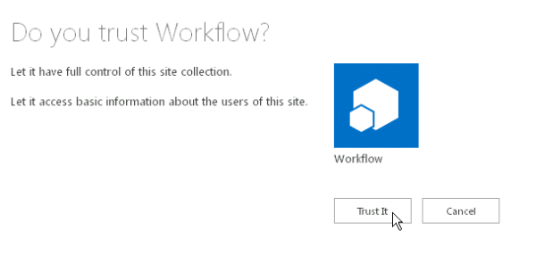
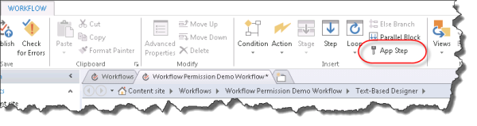
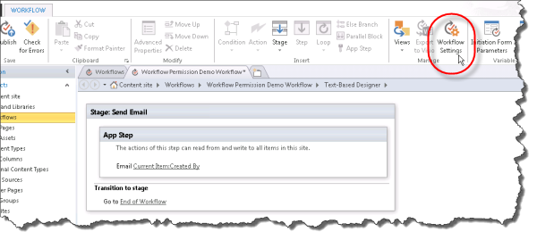
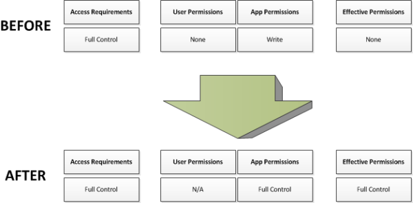

# <a name="create-a-workflow-with-elevated-permissions-by-using-the-sharepoint-workflow-platform"></a>Создание рабочего процесса с повышенным уровнем разрешений при помощи платформы SharePoint Workflow

<a name="section1"> </a>

В этой статье описывается, как для создания рабочих процессов SharePoint, доступ к объектам в SharePoint, которые требуют повышенного уровня разрешений. Эти решения использовать две функции: предоставление разрешений для приложения рабочего процесса и переноса действий с помощью шаге приложения.
  
> [!IMPORTANT] 
> В этой статье предполагается, что платформа рабочих процессов SharePoint установлено и настроено, и, что SharePoint будет настроен для надстроек. Для получения дополнительных сведений о рабочих процессах SharePoint и SharePoint надстроек, включая установку и настройку, посетите [рабочих процессов в SharePoint](workflows-in-sharepoint.md) и [Установка и управление ими надстройки SharePoint](../sp-add-ins/sharepoint-add-ins.md). 

Предположим, что администратор SharePoint необходимо определить некоторые действия по управлению запросов пользователей на покупку надстроек приложений из магазина Office. В простом случае необходимо отправить сообщение электронной почты подтверждения, когда пользователь запрашивает надстройки. Кроме того можно также добавление структуры в процесс утверждения запроса.
  
По умолчанию рабочий процесс не имеет разрешений на доступ в каталог приложений. Каталог списков в SharePoint требуются разрешения владельца (полный доступ). Рабочие процессы обычно выполняются на уровне разрешений, соответствует записи. 
  
Чтобы устранить эту проблему, необходимо создать рабочий процесс с повышенными правами, выполните указанные ниже действия на сайте семейства веб-сайтов:

1. Разрешить рабочего процесса, чтобы использовать надстройки разрешения.

2. Предоставить разрешение полного доступа к рабочему процессу.
 
3. Разработка рабочего процесса, чтобы переносить действий внутри шага приложения.

## <a name="allow-a-workflow-to-use-add-in-permissions-on-a-sharepoint-site"></a>Рабочий процесс использования надстройки разрешения на сайте SharePoint

Первый шаг — это рабочий процесс с помощью надстройки разрешений. Настройка рабочего процесса для использования надстройки разрешения на странице " **Параметры сайта** " на сайте SharePoint, где выполняется рабочий процесс. Следующая процедура настраивает рабочий процесс с помощью надстройки разрешений на сайте SharePoint.
  
> [!IMPORTANT] 
> [!Важно!] Необходимо выполнить процедуру, пользователь, имеющий разрешения **Владельца сайта**.

### <a name="to-allow-workflow-to-use-add-in-permissions"></a>Чтобы разрешить рабочего процесса для использования надстройки разрешения

1. Выберите значок « **Параметры** », как показано на рисунке, чтобы открыть страницу **параметров сайта** .

  

2. Переход к **параметрам сайта**.
 
3. В разделе **Действия сайта** выберите **Управление возможностями сайта**.

4. Найдите компонент **рабочих процессов можно использовать разрешения для приложений**, как показано на рисунке и затем нажмите кнопку **активировать**.
    
  > [!WARNING] 
  > Этот компонент не будет активирован, если не правильно настроены платформа рабочих процессов SharePoint и надстройки SharePoint. 

  
  

## <a name="grant-full-control-permission-to-a-workflow"></a>Предоставить разрешение "Полный доступ" для рабочего процесса

Для этого рабочего процесса для правильной его необходимо предоставить полный доступ на сайте. Следующая процедура предоставляет разрешение полного доступа к рабочему процессу.
  
> [!IMPORTANT] 
> [!Важно!] Необходимо выполнить процедуру, пользователь, имеющий разрешения **Владельца сайта**. Рабочий процесс уже должны быть опубликованы на сайте SharePoint.

### <a name="to-grant-full-control-permission-to-a-workflow"></a>Чтобы предоставить разрешение на полный доступ к рабочему процессу

1. Выберите значок « **Параметры** ».
 
  

2. Переход к **параметрам сайта**.    
  
3. В разделе **пользователи и разрешения** выберите **разрешения для сайта приложения**.    
  
4. Копирование разделе **клиента** **Идентификатора приложения**. Это идентификатор между последним "|" и "@" войти, как показано на рисунке.
    
  

5. Перейдите на страницу **Предоставление разрешений для приложения** . Это необходимо сделать, просмотрев имеющиеся appinv.aspx страницы сайта.
    
  Пример: `http://{hostname}/{the Site Collection}/_layouts/15/appinv.aspx`. 
    
  > [!NOTE]
  > На этом этапе «приложение» относится к надстройки рабочего процесса в общих параметров и не только определенного рабочего процесса. Отдельные рабочие процессы не могут быть контролем доступа. При включении разрешения надстройки включается для всех рабочих процессов в пределах семейства веб-сайтов. 

  Дополнительные сведения о настройке рабочего процесса можно [статья блога из Sympraxis Consulting: циклический через контента в рабочий процесс сайта SharePoint](http://sympmarc.com/series/looping-through-content-in-a-sharepoint-2013-site-workflow/)
    
  На следующем рисунке показан пример.
 
  

6. Вставьте идентификатор клиента в поле **Код приложения** , а затем выберите **подстановки**, как показано на предыдущем рисунке.

7. Вставьте следующий код в поле **XML запрашивать разрешения** , чтобы предоставить разрешение "Полный доступ" *(Примечание: этот блок кода обновлен на 12/29/17 для включения `AllowAppOnlyPolicy`)*.
    
  ```XML 
    <AppPermissionRequests AllowAppOnlyPolicy="true">
        <AppPermissionRequest Scope="http://sharepoint/content/sitecollection/web" Right="FullControl" />
    </AppPermissionRequests>

  ```

  > [!WARNING] 
  > Нет нет заполнители в значение **области действия** . Это значения литерала. Введите его так, как оно указано здесь.

  На следующем рисунке показан пример завершенных страницы _(Обратите внимание, что код, приведенный в области **XML запроса разрешений** не отражает последнее обновление для кода на шаге 7)_. 
  
  

8. Выберите **Создать**.
    
9. Затем следует доверять надстройкой рабочего процесса, как показано на следующем рисунке. Выберите **Доверять**.
    
  
  

## <a name="wrap-actions-inside-an-app-step"></a>Перенос действия внутри шага приложения

Наконец необходимо перенести действия рабочего процесса внутри шага приложения. **Отправка сообщения электронной почты** действие внутри шага приложения переносится по указанные ниже действия. Рабочий процесс в этом примере отправляет сообщение электронной почты подтверждение из настраиваемого списка.

### <a name="to-wrap-actions-inside-an-app-step"></a>Перенос действия внутри шага приложения

1. Откройте сайт каталога приложений в SharePoint Designer.    
  
2. Создайте новый настраиваемый список, для которого нужно запустить рабочий процесс. В этом примере имя списка — **Демонстрационная версия приложения**.    
  
3. Выберите **рабочие процессы** в окне навигации.    
  
4. Создание нового **Рабочего процесса списка** для списка **Демонстрационная версия приложения** , как показано на рисунке.

  

5. Вставка **Шага приложения**, как показано на рисунке.
    
  

6. Вставка действие **отправки сообщения электронной почты** на **Шаге приложение**.
 
7. Нажмите кнопку **адресной книги** . В **поле** Выбор **Поиска рабочего процесса для пользователя**и выберите команду **Добавить** , как показано на рисунке.

  
  
8. Введите **в поле** в качестве искомого значения, как показано на рисунке.

  
  
9. Введите **электронной почты** в списке **Демонстрационная версия приложения** в теле сообщения электронной почты.
     
10. Выберите **кнопку ОК** , чтобы вернуться в рабочий процесс. Завершенный рабочий процесс показан на рисунке.

  
    
11. Выберите значок **Параметры рабочих процессов** на ленте, как показано на рисунке.
    
  

12. Снимите флажок **автоматически обновлять состояние рабочего процесса на текущее имя рабочей области**и затем выберите **Опубликовать**.
    
  
  

<a name="section2"> </a>

## <a name="understand-how-it-works"></a>Понять, как это работает

Чтобы понять, почему повышению уровня разрешений для рабочего процесса является обязательным, необходимо учитывайте, что рабочие процессы — это базовая надстройки для SharePoint, и следуют в соответствии с правилами авторизации модели надстройки. Конфигурация по умолчанию для рабочего процесса является действующие разрешения рабочего процесса пересечения разрешения пользователей и разрешения надстройки, как показано на рисунке.
    

  
Две причины, почему это необходимо повысить уровень разрешений для создания рабочего процесса в список запросов приложений являются:

- По умолчанию рабочего процесса только есть разрешения на запись.

- Пользователь не имеет разрешений.
  
Первый шаг для решения этой проблемы — разрешить приложению авторизуйте, используя только его удостоверение и игнорирование от пользователя. Это делается, включив функцию шаг приложения. Второй шаг предоставляется разрешение на полный доступ с рабочим процессом. 
  
На следующем рисунке показано изменение разрешений.
  

  
<a name="section3"> </a>

## <a name="see-also"></a>См. также

- [Статье блога группы разработчиков SharePoint Designer: рабочий процесс упаковки и развертывания сценарий](https://blogs.msdn.microsoft.com/sharepointdesigner/2012/08/29/packaging-sharepoint-2013-list-site-and-reusable-workflow-and-how-to-deploy-the-package/)
- [Новые возможности рабочих процессов SharePoint](what-s-new-in-workflows-for-sharepoint.md)
- [Начало работы с рабочими процессами SharePoint](get-started-with-workflows-in-sharepoint.md) 
- [Справочник по действий рабочих процессов для SharePoint](workflow-actions-and-activities-reference-for-sharepoint.md)
- [Разработка рабочих процессов в SharePoint Designer и Visio](workflow-development-in-sharepoint-designer-and-visio.md)

    
