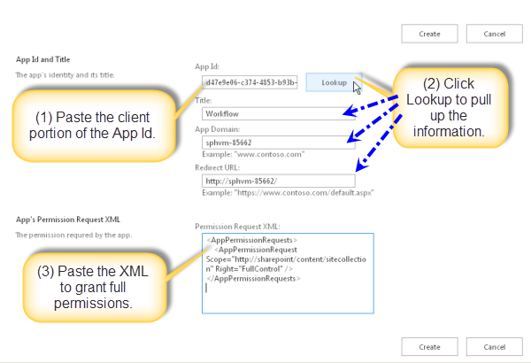
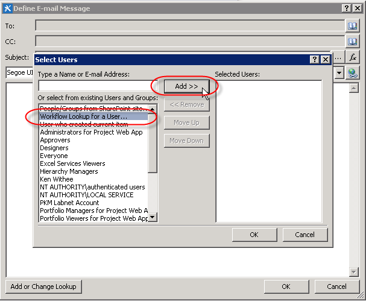
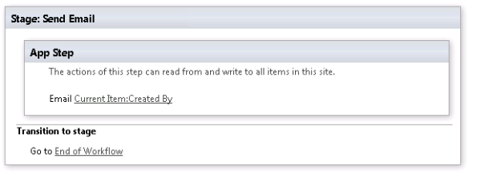
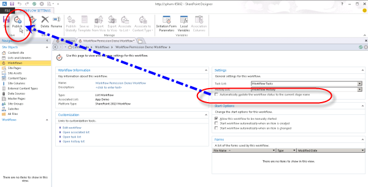

# <a name="create-a-workflow-with-elevated-permissions-by-using-the-sharepoint-workflow-platform"></a>Создание рабочего процесса с повышенным уровнем разрешений при помощи платформы SharePoint Workflow
Узнайте, как создать рабочий процесс с повышенным уровнем разрешений с помощью платформы рабочих процессов SharePoint.
## <a name="sharepoint-app-catalog-and-workflow"></a>Каталог приложений SharePoint и рабочих процессов
<a name="section1"> </a>

В этой статье описывается, как для создания рабочих процессов SharePoint, доступ к объектам в SharePoint, которые требуют повышенного уровня разрешений. Эти решения использовать две функции: предоставление разрешений для приложения рабочего процесса и переноса действий с помощью шаге приложения.
  
    
    

> **Важные:** В этой статье предполагается, что платформа рабочих процессов SharePoint установлено и настроено, и, что SharePoint будет настроен для приложения. Дополнительные сведения о рабочих процессах SharePoint и приложений для SharePoint, включая установку и настройку, см [рабочего процесса в SharePoint](http://technet.microsoft.com/sharepoint/jj556245.aspx) и [Установка и управление приложениями для SharePoint](http://msdn.microsoft.com/library/733647a3-a5d3-475b-967d-3bb627c2a0c2.aspx). 
  
    
    


### <a name="overview-of-creating-a-workflow-with-elevated-permissions"></a>Общие сведения о создании рабочего процесса с повышенными правами

Предположим, что администратор SharePoint вы хотели бы определить некоторые процессы для управления запросами пользователей к покупке соответствующих приложений в магазине Office. В случае простейшая вы хотите отправить сообщение подтверждения, когда пользователь запрашивает веб-приложения. Кроме того может также потребоваться добавление структуры в процесс утверждения запроса.
  
    
    
По умолчанию рабочий процесс не имеет разрешений на доступ к запроса каталога приложений. Списки каталога в SharePoint необходимы разрешения владельца (полный доступ). Рабочие процессы обычно выполняются на уровне разрешений эквивалентна записи. 
  
    
    
Чтобы устранить эту проблему, необходимо создать рабочий процесс с повышенными правами, выполните указанные ниже действия на сайте семейства веб-сайтов:
  
    
    

1. Чтобы разрешите рабочего процесса, чтобы использовать разрешения приложений.
    
  
2. Предоставьте разрешение на полный доступ для рабочего процесса.
    
  
3. Разработка рабочего процесса, чтобы переносить действий внутри шага приложения.
    
  

### <a name="allowing-a-workflow-to-use-app-permissions-in-a-sharepoint-site"></a>Разрешение рабочего процесса для использования разрешений приложения на сайте SharePoint

Первый шаг — это рабочий процесс использования разрешений приложения. Настройка рабочего процесса для использования разрешений приложения на странице " **Параметры сайта** " на сайте SharePoint, где будет запускаться рабочий процесс. Следующая процедура настраивает сайт SharePoint, чтобы разрешить рабочего процесса для использования разрешений приложения.
  
    
    

> **Важные:** Необходимо выполнить процедуру, пользователь, который имеет разрешения **Владельца веб-сайта** .
  
    
    


### <a name="to-allow-workflow-to-use-app-permissions"></a>Чтобы разрешить рабочего процесса, чтобы использовать разрешения приложений


1. Щелкните значок **Параметры**, как показано на рисунке.
    
   **Рисунок: Открытие на странице параметров сайта**

  

  
  

  

  
2. Переход к **параметрам сайта**.
    
  
3. В разделе **Действия сайта** выберите **Управление возможностями сайта**.
    
  
4. Найдите функцию под названием **рабочие процессы могут использовать разрешения приложений**, как показано на рисунке и нажмите кнопку **активировать**.
    
    > **Осторожность:** Этот компонент не будет активирован, если не правильно настроены платформа рабочих процессов SharePoint, а также приложений для SharePoint. 

   **Рисунок: Функции веб-сайтов, «Рабочие процессы могут использовать разрешения приложений»**

  

  
  

  

  

### <a name="granting-full-control-permission-to-a-workflow"></a>Предоставление разрешения на полный доступ к рабочему процессу

Рабочий процесс для правильной работы, его необходимо предоставить полный доступ на сайте. Описанные ниже предоставляется разрешение на полный доступ с рабочим процессом.
  
    
    

> **Важные:** В процедуре предполагается следующее: > процедура должна быть выполнена пользователем, которая имеет **Владельца веб-сайта** разрешения. > рабочий процесс уже должны быть опубликованы на сайте SharePoint.
  
    
    


### <a name="to-grant-full-control-permission-to-a-workflow"></a>Чтобы предоставить разрешение на полный доступ к рабочему процессу


1. Щелкните значок **Параметры**, как показано на рисунке.
    
   **Рисунок: Открытие на странице параметров сайта**

  

  
  

  

  
2. Переход к **параметрам сайта**.
    
  
3. В разделе **пользователи и разрешения** выберите **разрешения для сайта приложения**.
    
  
4. Копирование разделе **клиента** **Идентификатора приложения**. Это идентификатор между последним "|" и "@" войти, как показано на рисунке.
    
   **Рисунок: Выбор идентификатор приложения**

  

  
  

  

  
5. Перейдите на страницу **предоставить разрешение на веб-приложения**. Это необходимо выполнить, перейдя appinv.aspx страницу сайта.
    
    Пример: http://{hostname}/{the Collection}/_layouts/15/appinv.aspx сайта. 
    
    > [!NOTE]
    > [!Примечание] «Приложения» на этом этапе ссылается приложение рабочего процесса в общих параметров и не только определенных рабочего процесса. Отдельные рабочие процессы не может быть контролем доступа. При включении разрешения приложений можно включить для всех рабочих процессов в пределах семейства веб-сайтов. 

    Дополнительные сведения о настройке рабочего процесса можно [статья блога из Sympraxis Consulting: циклический через контента в рабочий процесс сайта SharePoint](http://sympmarc.com/2016/01/14/looping-through-content-in-a-sharepoint-site-workflow-part-1-introduction)
    
    На следующем рисунке показан пример.
    

 **Рисунок: Appinv.aspx страницы и пример URL-адреса**

  

  
  

  
6. Вставьте идентификатор клиента в полеидентификатор **Приложения** и нажмите кнопку **подстановки**, как показано на рисунке.
    
  
7. Вставьте следующий **Запрос разрешений** XML, чтобы предоставить разрешение на полный доступ.
    
``` xml 
<AppPermissionRequests>
    <AppPermissionRequest Scope="http://sharepoint/content/sitecollection/web" Right="FullControl" />
</AppPermissionRequests>

```


> **Осторожность:** Нет нет заполнители в значение **области** выше. Это значения литерала. Введите его так, как оно указано здесь.

  На рисунке ниже показан пример завершенной страницы.
    

  **Рисунок: Поиск удостоверение приложения**

  

  


8. Нажмите кнопку **Создать**.
    
  
9. Вам будет затем предложено доверять этому приложению рабочего процесса, как показано на рисунке. Нажмите кнопку **Доверять**.
    
  **Рисунок: Доверять этому приложению рабочего процесса**

  
  
### <a name="wrapping-actions-inside-an-app-step"></a>Обтекание действия внутри шага приложения

Наконец необходимо перенести действия рабочего процесса внутри шага приложения. **Отправка сообщения электронной почты** действие внутри шага приложения переносится по указанные ниже действия. Рабочий процесс в этом примере отправляет сообщение электронной почты подтверждение из настраиваемого списка.
  
    
    

### <a name="to-wrap-actions-inside-an-app-step"></a>Перенос действия внутри шага приложения


1. Откройте сайт каталога приложений в SharePoint Designer 2013.
    
  
2. Создайте новый настраиваемый список, в которой будет выполняться рабочий процесс. В этом примере имя списка — **Ролик приложения**.
    
  
3. Щелкните **рабочие процессы** в окне навигации.
    
  
4. Создайте новый рабочий процесс списка для списка ролика приложения, как показано на рисунке.
    
  **Рисунок: Создать новый рабочий процесс списка**

  

  
  

  

  
5. Вставка **Шага приложения**, как показано на рисунке.
    
  **Рисунок: Добавить шаг приложения**

  

  
  

  

  
6. Вставка действие **отправки сообщения электронной почты** на **Шаге приложение**.
    
  
7. Нажмите кнопку **Адресная книга**. В поле **Кому** выберите **подстановки в рабочем процессе для пользователя** и нажмите кнопку **Добавить**, как показано на рисунке.
    
  **Рисунок: Выберите подстановки в рабочем процессе для пользователя**

  
  

8. Введите **в поле** в качестве искомого значения, как показано на рисунке.
    
  **Рисунок: Поиск диалоговое окно "пользователь"**

  
  
9. Введите электронной почты из списка приложений ролика в тексте сообщения электронной почты.
    
  
10. Нажмите кнопку **ОК**, чтобы вернуться в рабочий процесс. Завершенные рабочего процесса показано на рисунке.
    
  **Рисунок: Действие электронной почты на шаге приложения**

  
    
11. Щелкните значок **Параметры рабочих процессов** на ленте, как показано на рисунке.
    
  **Рисунок: Значок Параметры рабочих процессов на ленте**

  

  
  

  

  
12. Снимите флажок для **автоматического обновления состояние рабочего процесса для имени текущего стадию** и нажмите кнопку **Опубликовать**, как показано на рисунке.
    
  **Рисунок: Снимите флажок Автоматические обновления, а затем опубликовать**

  

  
  


## <a name="understanding-how-it-works"></a>Основные сведения о том, как он работает
<a name="section2"> </a>

Чтобы понять, почему необходима повышение уровня разрешений для рабочего процесса, следует учитывайте, что значительно приведены характеристики рабочих процессов приложения для SharePoint и они те же правила авторизации моделью приложений. Настройки по умолчанию для рабочего процесса является действующие разрешения рабочего процесса пересечение разрешений пользователей и разрешения приложений, как показано на рисунке.
  
    
**На рисунке: Схема разрешения**

  
    
    

  
    
    

  
    
    
Есть две причины, почему необходимо повысить уровень разрешений для создания рабочего процесса в списке запрос приложения. Ниже приведены.
  
    
    

- По умолчанию рабочего процесса только есть разрешения на запись.
    
  
- Пользователь не имеет разрешений.
    
  
Первый шаг для решения этой проблемы — разрешить приложению авторизуйте, используя только его удостоверение и игнорирование от пользователя. Это делается, включив функцию шаг приложения. Второй шаг предоставляется разрешение на полный доступ с рабочим процессом. 
  
    
    
На следующем рисунке показан разрешения на изменение
  
    
    

**На рисунке: Матрица разрешения**

  
    
    

  
    
    

  
    
    

  
    
    

  
    
    

## <a name="see-also"></a>См. также
<a name="section3"> </a>


-  [Рабочий процесс в SharePoint](http://technet.microsoft.com/en-us/sharepoint/jj556245.aspx)
    
  
-  [Установка и управление приложениями для SharePoint](http://msdn.microsoft.com/library/733647a3-a5d3-475b-967d-3bb627c2a0c2.aspx)
    
  
-  [Новые возможности рабочих процессов SharePoint](http://msdn.microsoft.com/library/6ab8a28b-fa2f-4530-8b55-a7f663bf15ea.aspx)
    
  
-  [Начало работы с рабочими процессами SharePoint](http://msdn.microsoft.com/library/cc73be76-a329-449f-90ab-86822b1c2ee8.aspx)
    
  
-  [Разработка рабочих процессов в SharePoint Designer и Visio](workflow-development-in-sharepoint-designer-and-visio.md)
    
  
-  [Краткий справочник по действиям рабочего процесса (платформа рабочих процессов в SharePoint)](workflow-actions-quick-reference-sharepoint-workflow-platform.md)
    
  
-  [Статье блога группы разработчиков SharePoint Designer: рабочий процесс упаковки и развертывания сценарий](http://blogs.msdn.com/b/sharepointdesigner/archive/2012/08/30/packaging-list-site-and-reusable-workflow-and-how-to-deploy-the-package.aspx)
    
  
-  [Статья блога из Sympraxis Consulting: циклический через контента в рабочий процесс сайта SharePoint](http://sympmarc.com/2016/01/14/looping-through-content-in-a-sharepoint-site-workflow-part-1-introduction)
    
  

