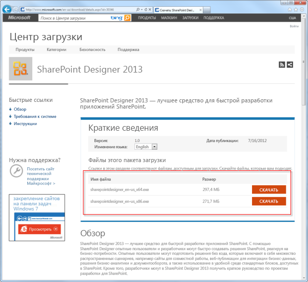
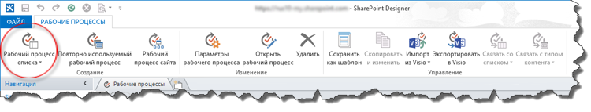
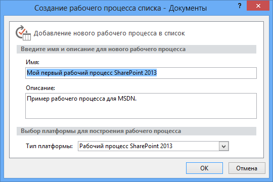
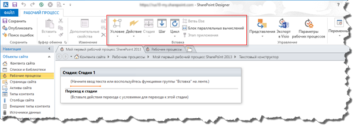

# Создание рабочего процесса с помощью SharePoint Designer 2013 и платформы SharePoint WorkflowCreating a workflow by using SharePoint Designer 2013 and the SharePoint Workflow platform
Узнайте, как установить, открыть и создать рабочий процесс с помощью SharePoint Designer 2013 и платформы SharePoint Workflow.Learn how to install, open, and create a workflow by using SharePoint Designer 2013 and the SharePoint Workflow platform. 
   

## Установка SharePoint Designer 2013Install SharePoint Designer 2013

SharePoint Designer 2013 можно скачать бесплатно. Чтобы скачать и установить SharePoint Designer 2013, выполните описанные ниже шаги.SharePoint Designer 2013 is a free download. To download and install SharePoint Designer 2013 follow these steps: 
  
    
    

### Чтобы установить SharePoint Designer 2013:To install SharePoint Designer 2013

1. Откройте свой веб-браузер и перейдите в Центр загрузки Майкрософт:  [http://www.microsoft.com/download](http://www.microsoft.com/download.aspx).Open your web browser and navigate to the Microsoft Download Center:  [http://www.microsoft.com/download](http://www.microsoft.com/download.aspx). 
    
  
2. Введите в поле поиска SharePoint Designer 2013.Type SharePoint Designer 2013 in the search field.
    
  
3. Щелкните ссылку "SharePoint Designer 2013".Click the link for "SharePoint Designer 2013". 
    
  
4. Ознакомьтесь с обзором, системными требованиями и инструкциями по установке. Убедитесь, что ваша система совместима.Read the overview, system requirements, and installation instructions. Make sure your system is compatible. 
    
  
5. Выберите 64-разрядный ( **x64**) или 32-разрядный ( **x86**) тип платформы, как показано на рисунке.Select your platform type: 64-bit ( **x64**) or 32-bit ( **x86**) as shown in the figure. 
    
  
6. Следуйте инструкции по установке SharePoint Designer 2013.Follow the instructions to install SharePoint Designer 2013.
    
  

**Рисунок. Страница загрузки SharePoint Designer 2013****Figure: SharePoint Designer 2013 download page**

  
    
    

  
    
    

  
    
    

  
    
    

  
    
    

## Открытие SharePoint Designer 2013 и подключение к сайту SharePointOpen SharePoint Designer 2013 and connect to a SharePoint site

SharePoint Designer 2013 устанавливается как приложение Office 2013. Чтобы открыть SharePoint Designer 2013 и подключиться к сайту SharePoint, выполните описанные ниже шаги.SharePoint Designer 2013 installs as an Office 2013 application. To open SharePoint Designer 2013 and connect to a SharePoint site follow these steps: 
  
    
    

### Чтобы открыть SharePoint Designer 2013 и подключиться к сайту SharePoint:To open SharePoint Designer 2013 and connect to a SharePoint site

1. Откройте SharePoint Designer 2013, выбрав его в меню **Пуск**. Нажмите значок **Пуск**, выберите пункт **Все программы**, а затем  **Microsoft Office 2013** и **SharePoint Designer 2013**.Open SharePoint Designer 2013 by selecting it on the **Start** menu. Click **Start** icon, click **All Programs**, click **Microsoft Office 2013**, and then click **SharePoint Designer 2013**. 
    
  
2. Щелкните **Открыть сайт** на начальной странице SharePoint Designer 2013.Click **Open Site** on the SharePoint Designer 2013 start page.
    
  
3. Введите сайт SharePoint, к которому хотите подключиться. Например, http://www.contoso.com/sites/a-sharepoint-site.Enter the SharePoint site that you want to connect to. For example, http://www.contoso.com/sites/a-sharepoint-site.
    
  
4. Нажмите кнопку **Открыть**, чтобы открыть веб-сайт.Click **Open** to open the site.
    
  
5. При необходимости введите свои учетные данные. (Если с компьютером, с которого вы выполнили вход, не интегрирована система безопасности, далее вам будет предложено ввести учетные данные.) Убедитесь, что вы используете учетные данные с правами доступа на сайт SharePoint.Enter your credentials, if prompted. (If security is not integrated with the computer you signed in on then you are prompted to enter your credentials.) Make sure to use credentials that have access to the SharePoint site.
    
  

## Создание рабочего процесса списка на основе платформы SharePoint WorkflowCreate a List workflow based on the SharePoint Workflow platform

SharePoint Designer 2013 можно использовать для многих важных задач. Панель навигации используется для переключения между различными аспектами SharePoint Designer 2013. Чтобы создать новый рабочий процесс списка на основе платформы SharePoint Workflow, выполните описанные ниже шаги.SharePoint Designer 2013 can be used for many important tasks. The navigational pane is used to switch between different aspects of SharePoint Designer 2013. To create a new List workflow based on the SharePoint Workflow platform, follow these steps:
  
    
    

### Чтобы создать рабочий процесс на основе платформы SharePoint Workflow:To create a workflow based on the SharePoint Workflow platform

1. Щелкните на панели навигации узел "Рабочие процессы".Click the Workflows node in the Navigation pane.
    
  
2. Щелкните выпадающее меню **Рабочий процесс списка** в разделе **Создание** ленты, как показано на рисунке.Click the **List Workflow** drop-down in the **New** section of the ribbon, as shown in the figure.
    
  
3. Выберите список, который нужно связать с новым рабочим процессом.Select the list that you want to associate with the new workflow.
    
  
4. В диалоговом окне **Создание рабочего процесса списка** введите название и описание рабочего процесса, а затем убедитесь, что **Тип платформы** установлен в **SharePoint Workflow**, как показано на рисунке.On the **Create List Workflow** dialog box, enter a name and description for the workflow and then make sure that the **Platform Type** is set to **SharePoint Workflow**, as shown in the figure.
    
    > **Примечание.** Если тип платформы "Рабочий процесс SharePoint" недоступен, то Workflow Manager не настроен для работы с фермой SharePoint.**Note** If you do not see SharePoint Workflow as an available platform type then Workflow Manager is not configured to work with the SharePoint Server 2013 farm. 
5. Нажмите кнопку **ОК**, чтобы создать рабочий процесс.Click **OK** to create the workflow.
    
  

**Рисунок. Кнопка на ленте для создания нового рабочего процесса списка****Figure: The ribbon button for creating a new list workflow**

  
    
    

  
    
    

  
    
    

  
    
    

  
    
    

**Рисунок. Диалоговое окно "Создание рабочего процесса списка"****Figure: Create List Workflow dialog box**

  
    
    

  
    
    

  
    
    

  
    
    

  
    
    
Теперь, когда рабочий процесс создан, вы можете добавлять к нему нужные действия, условия, стадии, шаги и циклы. Эти компоненты доступны на ленте SharePoint Designer 2013, как показано на рисунке.Now that the workflow is created, you can add Actions, Conditions, Stages, Steps, and Loops to build your workflow. These workflow components are available in the ribbon of SharePoint Designer 2013, as shown in the figure. 
  
    
    

**Рисунок. Элементы рабочего процесса для платформы SharePoint Workflow****Figure: Workflow items for the SharePoint Workflow platform**

  
    
    

  
    
    

  
    
    

    
> **Примечание.** Вышеописанная процедура используется для создания рабочего процесса списка.**Note:** The above procedure is used to create a List workflow. Рабочие процессы для повторного использования и сайтов можно создавать с применением одной и той же процедуры с описанным ниже изменением.A Reusable workflow or Site workflow can be created using the same procedure with the following modification. Вместо кнопки "Рабочий процесс списка" на ленте нажмите при создании рабочего процесса кнопку **Рабочий процесс для повторного использования** или **Рабочий процесс сайта**.The above procedure is used to create a List workflow. A Reusable workflow or Site workflow can be created using the same procedure with the following modification. Instead of selecting the List Workflow button in the ribbon select the **Reusable Workflow** or **Site Workflow** button when creating the workflow.
  
    
    

Дополнительные сведения о доступных компонентах для разработки рабочих процессов см. в статье [Краткий справочник по действиям рабочих процессов (платформа рабочих процессов SharePoint)](workflow-actions-quick-reference-sharepoint-workflow-platform.md).To learn more about the available components of workflow development, see  [Workflow actions quick reference (SharePoint Workflow platform)](workflow-actions-quick-reference-sharepoint-workflow-platform.md).
  
    
    

## Дополнительные ресурсыAdditional resources

-  [Новые возможности рабочих процессов SharePointWhat's new in workflow in SharePoint Server 2013](http://msdn.microsoft.com/library/6ab8a28b-fa2f-4530-8b55-a7f663bf15ea.aspx)
    
  
-  [Начало работы с рабочими процессами SharePointGetting started with SharePoint Server 2013 workflow](http://msdn.microsoft.com/library/cc73be76-a329-449f-90ab-86822b1c2ee8.aspx)
    
  
-  [Разработка рабочих процессов в SharePoint Designer и VisioWorkflow development in SharePoint Designer and Visio](workflow-development-in-sharepoint-designer-and-visio.md)
    
  

  
    
    

