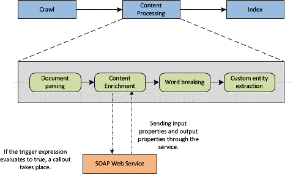

# <a name="custom-content-processing-with-the-content-enrichment-web-service-callout"></a><span data-ttu-id="43157-102">Нестандартная обработка контента с использованием выноски веб-службы "Обогащение контента"</span><span class="sxs-lookup"><span data-stu-id="43157-102">Custom content processing with the Content Enrichment web service callout</span></span>
<span data-ttu-id="43157-103">Узнайте о вызов повышения качества контента веб-службы в SharePoint, который позволяет разработчикам создавать внешние веб-службы для изменения управляемых свойств для обхода элементов во время обработки контента.</span><span class="sxs-lookup"><span data-stu-id="43157-103">Learn about the content enrichment web service callout in SharePoint that enables developers to create an external web service to modify managed properties for crawled items during content processing.</span></span>
<span data-ttu-id="43157-104">Поиск в SharePoint позволяет пользователям изменение управляемого свойства для обхода элементов перед их индексации путем вызова в работе веб-службе внешнего повышения качества контента.</span><span class="sxs-lookup"><span data-stu-id="43157-104">Search in SharePoint enables users to modify the managed properties of crawled items before they are indexed by calling out to an external content enrichment web service.</span></span> <span data-ttu-id="43157-105">Возможность изменения управляемых свойств для элементов во время обработки контента функция полезна, если для выполнения задач, таких как очистка данных, извлечение сущностей, классификации и тегов.</span><span class="sxs-lookup"><span data-stu-id="43157-105">The ability to modify managed properties for items during content processing is helpful when performing tasks such as data cleansing, entity extraction, classification, and tagging.</span></span>
  
    
    


<span data-ttu-id="43157-106">**На рисунке 1. Повышения качества контента в процессе обработки контента**</span><span class="sxs-lookup"><span data-stu-id="43157-106">**Figure 1. Content enrichment within content processing**</span></span>

  
    
    

  
    
    

  
    
    
<span data-ttu-id="43157-p102">На рисунке 1 показана часть процесса, который выполняется в компонент обработки контента. Веб-служба повышения качества контента — это служба на основе SOAP, можно создать для получения выноски от клиента веб-службы в компонент обработки контента. Основываясь на рисунке 1, клиент веб-службы , относится к оператор обогащение контента в компонент; обработки контентавеб-служба относится к реализации веб-служба SOAP.Веб-служба получает настраиваемые полезных данных из компонента обработки контента. Затем результирующий ответ от веб-службы объединяется для обхода элементов перед добавлением в индекс поиска.Клиент веб-службы для работы с управляемыми свойствами, которые можно настроить как входные свойства или свойства выходных данных. Входные свойства, передаются в веб-службе. Вывод свойств возвращаются веб-службой. Некоторые управляемые свойства являются скрытыми или доступны только для чтения и не может отправленных веб-службы или полученных от веб-службы. Сведения о том, как проверить, какие управляемые свойства доступны только для чтения в разделе  [Вывод списка всех только для чтения управляемых свойств для повышения качества контента веб-службы](#SP15contentprocess_read-only_managed_properties) .</span><span class="sxs-lookup"><span data-stu-id="43157-p102">Figure 1 shows a part of the process that takes place in the content processing component. The content enrichment web service is a SOAP-based service that you can create to receive a callout from the web service client inside the content processing component. Based on Figure 1, the web service client refers to the Content Enrichment operator inside the content processing component; theweb service refers to the SOAP web service that you implement.The web service receives a configurable payload from the content processing component. Then, the resulting response from the web service is merged into the crawled item before it is added to the search index. The web service client works with managed properties that you can configure as input properties or as output properties. Input properties are sent to the web service; output properties are returned by the web service. Certain managed properties are hidden or are read-only and can't be sent to the web service or received from the web service. See  [How to list all read-only managed properties for the Content Enrichment web service](#SP15contentprocess_read-only_managed_properties) for information about how to verify which managed properties are read-only.</span></span>
    
> <span data-ttu-id="43157-116">**Важные:** Действие выноски повышения качества контента можно настроить только с конечной одного веб-службы.</span><span class="sxs-lookup"><span data-stu-id="43157-116">**Important:** The content enrichment callout step can only be configured with a single web service endpoint.</span></span> <span data-ttu-id="43157-117">Любой тип отказоустойчивость или возможности для поддержки нескольких реализаций маршрутизации должны обрабатываться разработчиком, реализация веб-службы.</span><span class="sxs-lookup"><span data-stu-id="43157-117">Any kind of fault tolerance, or routing capabilities to support multiple implementations must be handled by the developer implementing the web service.</span></span> <span data-ttu-id="43157-118">Кроме того разработчик может иметь различные веб-службами, размещенных на разных конечные точки; Тем не менее в любой момент времени, можно использовать только один из этих конечных точек в конфигурации.</span><span class="sxs-lookup"><span data-stu-id="43157-118">In addition, the developer may have various web service implementations hosted at different endpoints; however, at any given time, only one of these endpoints can be used in the configuration.</span></span> 
  
    
    


## <a name="content-enrichment-web-service-contract"></a><span data-ttu-id="43157-119">Контракт службы web повышения качества контента</span><span class="sxs-lookup"><span data-stu-id="43157-119">Content enrichment web service contract</span></span>
<span data-ttu-id="43157-120"><a name="SP15webservcallout_enrich"> </a></span><span class="sxs-lookup"><span data-stu-id="43157-120"><a name="SP15webservcallout_enrich"> </a></span></span>

<span data-ttu-id="43157-p104">Клиент веб-службы — это клиент SOAP (версия 1.1) RPC с предварительно заданных поведение. Контракт службы web имеет следующие характеристики:</span><span class="sxs-lookup"><span data-stu-id="43157-p104">The web service client is a SOAP (version 1.1) RPC client with a predefined behavior. The web service contract has the following characteristics:</span></span>
  
    
    

- <span data-ttu-id="43157-123">Компонент обработки контента отправляет вызов SOAP RPC настраиваемая конечной точки по протоколу HTTP.</span><span class="sxs-lookup"><span data-stu-id="43157-123">The content processing component sends a SOAP RPC call to a configurable endpoint over HTTP.</span></span>
    
  
- <span data-ttu-id="43157-124">Полезные данные содержит массив объектов свойства.</span><span class="sxs-lookup"><span data-stu-id="43157-124">The payload contains an array of property objects.</span></span>
    
  
- <span data-ttu-id="43157-125">Веб-службы выполняет некоторые настраиваемой логики на массив объектов, свойств и возвращает массив объектов измененного или нового свойства.</span><span class="sxs-lookup"><span data-stu-id="43157-125">The web service performs some custom logic on the array of property objects, and returns an array of modified or new property objects.</span></span>
    
  
- <span data-ttu-id="43157-126">Веб-службы необходимо отправки ответа клиенту веб-службы в течение заданного периода ожидания.</span><span class="sxs-lookup"><span data-stu-id="43157-126">The web service must send a response to the web service client within a given timeout.</span></span>
    
  
- <span data-ttu-id="43157-p105">Нет определенных механизмов проверки подлинности и шифрования, поддерживаются как часть контракта. Тем не менее, можно применять собственные безопасности механизм транспорта.</span><span class="sxs-lookup"><span data-stu-id="43157-p105">No specific authentication or encryption mechanisms are supported as part of the contract. You can, however, apply your own security on the transport mechanism.</span></span>
    
  

## <a name="configuring-the-content-enrichment-web-service-client"></a><span data-ttu-id="43157-129">Настройка клиента повышения качества контента веб-службы</span><span class="sxs-lookup"><span data-stu-id="43157-129">Configuring the Content Enrichment web service client</span></span>
<span data-ttu-id="43157-130"><a name="content_enrichment_configuration"> </a></span><span class="sxs-lookup"><span data-stu-id="43157-130"><a name="content_enrichment_configuration"> </a></span></span>

<span data-ttu-id="43157-131">Чтобы настроить клиент веб-службы, используйте следующие командлеты Windows PowerShell:</span><span class="sxs-lookup"><span data-stu-id="43157-131">To configure the web service client, you use the following Windows PowerShell cmdlets:</span></span>
  
    
    

-  [<span data-ttu-id="43157-132">Get-SPEnterpriseSearchContentEnrichmentConfiguration</span><span class="sxs-lookup"><span data-stu-id="43157-132">Get-SPEnterpriseSearchContentEnrichmentConfiguration</span></span>](http://technet.microsoft.com/en-us/library/jj219783%28office.15%29.aspx)
    
  
-  [<span data-ttu-id="43157-133">Set-SPEnterpriseSearchContentEnrichmentConfiguration</span><span class="sxs-lookup"><span data-stu-id="43157-133">Set-SPEnterpriseSearchContentEnrichmentConfiguration</span></span>](http://technet.microsoft.com/en-us/library/jj219659%28office.15%29.aspx)
    
  
-  [<span data-ttu-id="43157-134">Remove-SPEnterpriseSearchContentEnrichmentConfiguration</span><span class="sxs-lookup"><span data-stu-id="43157-134">Remove-SPEnterpriseSearchContentEnrichmentConfiguration</span></span>](http://technet.microsoft.com/en-us/library/jj219742%28office.15%29.aspx)
    
  
-  [<span data-ttu-id="43157-135">Новый SPEnterpriseSearchContentEnrichmentConfiguration</span><span class="sxs-lookup"><span data-stu-id="43157-135">New-SPEnterpriseSearchContentEnrichmentConfiguration</span></span>](http://technet.microsoft.com/en-us/library/jj219502%28office.15%29.aspx)
    
  
<span data-ttu-id="43157-136">В таблице 1 перечислены свойства, которые можно настроить через Windows PowerShell командлеты, указанным выше.</span><span class="sxs-lookup"><span data-stu-id="43157-136">Table 1 lists the properties you can configure through the Windows PowerShell cmdlets mentioned previously.</span></span>
  
    
    

<span data-ttu-id="43157-137">**В таблице 1. Свойства, которые настраиваются для клиента с помощью командлетов Windows PowerShell**</span><span class="sxs-lookup"><span data-stu-id="43157-137">**Table 1. Properties that are configurable for the client by using Windows PowerShell cmdlets**</span></span>


|<span data-ttu-id="43157-138">**Свойство конфигурации**</span><span class="sxs-lookup"><span data-stu-id="43157-138">**Configuration property**</span></span>|<span data-ttu-id="43157-139">**Описание**</span><span class="sxs-lookup"><span data-stu-id="43157-139">**Description**</span></span>|<span data-ttu-id="43157-140">**Значение по умолчанию**</span><span class="sxs-lookup"><span data-stu-id="43157-140">**Default value**</span></span>|
|:-----|:-----|:-----|
|<span data-ttu-id="43157-141">**Endpoint**</span><span class="sxs-lookup"><span data-stu-id="43157-141">**Endpoint**</span></span> <br/> |<span data-ttu-id="43157-142">URL-адрес внешнего веб-службы.</span><span class="sxs-lookup"><span data-stu-id="43157-142">Specifies the URL of the external web service.</span></span>  <br/> |<span data-ttu-id="43157-143">empty</span><span class="sxs-lookup"><span data-stu-id="43157-143">Empty.</span></span>  <br/> |
|<span data-ttu-id="43157-144">**InputProperties**</span><span class="sxs-lookup"><span data-stu-id="43157-144">**InputProperties**</span></span> <br/> |<span data-ttu-id="43157-145">Управляемые свойства, которые получает внешние веб-службы.</span><span class="sxs-lookup"><span data-stu-id="43157-145">The managed properties that the external web service receives.</span></span>  <br/> |<span data-ttu-id="43157-146">empty</span><span class="sxs-lookup"><span data-stu-id="43157-146">Empty.</span></span>  <br/> |
|<span data-ttu-id="43157-147">**OutputProperties**</span><span class="sxs-lookup"><span data-stu-id="43157-147">**OutputProperties**</span></span> <br/> |<span data-ttu-id="43157-148">Управляемые свойства, возвращает внешних веб-службы.</span><span class="sxs-lookup"><span data-stu-id="43157-148">The managed properties that the external web service returns.</span></span>  <br/> |<span data-ttu-id="43157-149">empty</span><span class="sxs-lookup"><span data-stu-id="43157-149">Empty.</span></span>  <br/> |
|<span data-ttu-id="43157-150">**Timeout**</span><span class="sxs-lookup"><span data-stu-id="43157-150">**Timeout**</span></span> <br/> |<span data-ttu-id="43157-151">Количество времени до раз службы web извлечения в миллисекундах.</span><span class="sxs-lookup"><span data-stu-id="43157-151">The amount of time until the web service times out in milliseconds.</span></span>  <br/> <span data-ttu-id="43157-152">В зависимости от **FailureMode** элемент не удается обработать или предупреждения, записывается в журнал ULS.</span><span class="sxs-lookup"><span data-stu-id="43157-152">Depending on **FailureMode**, the item fails to be processed or a warning is written to the ULS log.</span></span> <br/> |<span data-ttu-id="43157-153">5000 миллисекунд; Допустимый диапазон [100, 30000].</span><span class="sxs-lookup"><span data-stu-id="43157-153">5000 milliseconds; Valid range [100, 30000].</span></span>  <br/> |
|<span data-ttu-id="43157-154">**SendRawData**</span><span class="sxs-lookup"><span data-stu-id="43157-154">**SendRawData**</span></span> <br/> |<span data-ttu-id="43157-155">Включает или отключает отправке необработанных данных в веб-службу.</span><span class="sxs-lookup"><span data-stu-id="43157-155">Enables or disables sending raw data to the web service.</span></span>  <br/> |<span data-ttu-id="43157-156">false</span><span class="sxs-lookup"><span data-stu-id="43157-156">False.</span></span>  <br/> |
|<span data-ttu-id="43157-157">**MaxRawDataSize**</span><span class="sxs-lookup"><span data-stu-id="43157-157">**MaxRawDataSize**</span></span> <br/> |<span data-ttu-id="43157-p106">Максимальный размер необработанных данных, отправляемых в веб-службу в килобайтах (КБ). Если двоичные данные элемента превышает это ограничение, элемент не отправляются. Это не запрещает **InputProperties** отправку и **OutputProperties** получению. </span><span class="sxs-lookup"><span data-stu-id="43157-p106">The maximum size of raw data sent to the web service in kilobytes (KB). If the binary data of an item exceeds this limit, the item is not sent. This does not prevent the **InputProperties** from being sent, and the **OutputProperties** from being received. </span></span><br/> |<span data-ttu-id="43157-161">5120 КБ.</span><span class="sxs-lookup"><span data-stu-id="43157-161">5120 kilobytes.</span></span>  <br/> |
|<span data-ttu-id="43157-162">**FailureMode**</span><span class="sxs-lookup"><span data-stu-id="43157-162">**FailureMode**</span></span> <br/> |<span data-ttu-id="43157-p107">Управляет поведением клиента веб-службы, при возникновении ошибки. Если **FailureMode** **ERROR**, всех проблем, возникающих при обработке повышения качества контента отправлять неудавшегося обратного вызова для этого конкретного элемента. </span><span class="sxs-lookup"><span data-stu-id="43157-p107">Controls the behavior of the web service client when errors occur. When **FailureMode** is set to **ERROR**, any problems that occur during content enrichment processing send a failed callback for that particular item.  </span></span><br/> <span data-ttu-id="43157-165">Если **FailureMode** **WARNING**, индексируются элемент без каких-либо изменений веб-службой и предупреждения, записывается в журнал ULS.</span><span class="sxs-lookup"><span data-stu-id="43157-165">When **FailureMode** is set to **WARNING**, the item is indexed, without any modifications by the web service and a warning is written to the ULS log.</span></span>  <br/> |<span data-ttu-id="43157-166">Ошибка</span><span class="sxs-lookup"><span data-stu-id="43157-166">Error.</span></span>  <br/> |
|<span data-ttu-id="43157-167">**DebugMode**</span><span class="sxs-lookup"><span data-stu-id="43157-167">**DebugMode**</span></span> <br/> |<span data-ttu-id="43157-p108">Режим, если параметр имеет значение **true** позволяет клиента повышения качества контента для отправки все управляемые свойства клиенту без ожидания все свойства в ответ. Все настроенные **Trigger** свойств, **InputProperties** и **OutputProperties** свойства игнорируются. </span><span class="sxs-lookup"><span data-stu-id="43157-p108">A mode that when set to **true** enables the content enrichment client to send all managed properties to the client without expecting any properties in return. Any configured **Trigger** property, **InputProperties** property, and **OutputProperties** property are ignored. </span></span><br/> |<span data-ttu-id="43157-170">false</span><span class="sxs-lookup"><span data-stu-id="43157-170">False.</span></span>  <br/> |
|<span data-ttu-id="43157-171">**Trigger**</span><span class="sxs-lookup"><span data-stu-id="43157-171">**Trigger**</span></span> <br/> |<span data-ttu-id="43157-p109">Предикат **Boolean**, который выполняется на всех элементов для обхода. Если предикат принимает значение **true**, эту запись отправляется в веб-службу. В противном случае элемент передается через в индекс поиска. </span><span class="sxs-lookup"><span data-stu-id="43157-p109">A **Boolean** predicate that is executed on every crawled item. If the predicate evaluates to **true**, the record is sent to the web service. Otherwise, the item is passed through to the search index. </span></span><br/> |<span data-ttu-id="43157-175">empty</span><span class="sxs-lookup"><span data-stu-id="43157-175">Empty.</span></span>  <br/> |
   

### <a name="how-to-list-all-read-only-managed-properties-for-the-content-enrichment-web-service"></a><span data-ttu-id="43157-176">Вывод списка всех только для чтения управляемых свойств для повышения качества контента веб-службы</span><span class="sxs-lookup"><span data-stu-id="43157-176">How to list all read-only managed properties for the Content Enrichment web service</span></span>
<span data-ttu-id="43157-177"><a name="SP15contentprocess_read-only_managed_properties"> </a></span><span class="sxs-lookup"><span data-stu-id="43157-177"><a name="SP15contentprocess_read-only_managed_properties"> </a></span></span>

<span data-ttu-id="43157-p110">Некоторые управляемые свойства доступны только для чтения и не может быть выходных данных из веб-службы. Эти свойства можно отобразить с помощью  [Get-SPEnterpriseSearchServiceApplication](http://technet.microsoft.com/en-us/library/ff608050%28office.15%29.aspx) и [Get-SPEnterpriseSearchMetadataManagedProperty](http://technet.microsoft.com/en-us/library/ff607560%28office.15%29.aspx)Windows PowerShell командлетов, показано в следующем примере:</span><span class="sxs-lookup"><span data-stu-id="43157-p110">Certain managed properties are read-only and cannot be output from the web service. These properties can be listed by using the  [Get-SPEnterpriseSearchServiceApplication](http://technet.microsoft.com/en-us/library/ff608050%28office.15%29.aspx) and [Get-SPEnterpriseSearchMetadataManagedProperty](http://technet.microsoft.com/en-us/library/ff607560%28office.15%29.aspx)Windows PowerShell cmdlets, shown in the following example:</span></span>
  
    
    

```

$ssa = Get-SPEnterpriseSearchServiceApplication
Get-SPEnterpriseSearchMetadataManagedProperty -SearchApplication $ssa  | ?{$_.IsReadOnly -or $_.MappingDisallowed -or $_.DeleteDisallowed}

```


## <a name="about-trigger-conditions-for-configuring-the-web-service-callout"></a><span data-ttu-id="43157-180">Об условиях запуска по настройке вызов веб-службы</span><span class="sxs-lookup"><span data-stu-id="43157-180">About trigger conditions for configuring the web service callout</span></span>
<span data-ttu-id="43157-181"><a name="SP15contentprocess_trigger"> </a></span><span class="sxs-lookup"><span data-stu-id="43157-181"><a name="SP15contentprocess_trigger"> </a></span></span>

<span data-ttu-id="43157-p111">Условие запуска - это выражение, которое используется для настройки вызов веб-службы. Если триггер условие имеет значение **true**, клиент веб-службы выполняет выноски для этой записи. Если триггер условие имеет значение **false**, клиент веб-службы не выполняет выноски и передает для обхода элементов в индекс поиска. Кроме того, если условие не триггер настроен; все элементы, передаются в веб-службы.</span><span class="sxs-lookup"><span data-stu-id="43157-p111">A trigger condition is an expression that is used to configure the web service callout. If a trigger condition evaluates to **true**, the web service client performs a callout for that record. If a trigger condition evaluates to **false**, the web service client does not perform a callout and passes the crawled item to the search index. Alternatively, if no trigger condition is configured; all items are sent to the web service.</span></span>
  
    
    
<span data-ttu-id="43157-p112">Условия запуска используйте язык выражений ссылаться на значения управляемого свойства. Операторы и функции в язык выражений можно использовать для создания простых и сложных триггер условий, можно определить, когда следует выполнить вызов веб-службы.</span><span class="sxs-lookup"><span data-stu-id="43157-p112">Trigger conditions use an expression language to refer to the values of managed properties. You can use the operators and functions in the expression language to build simple or complex trigger conditions so you can determine when to perform a web service callout.</span></span> 
  
    
    
<span data-ttu-id="43157-188">В таблице 2 приведены примеры условия запуска.</span><span class="sxs-lookup"><span data-stu-id="43157-188">Table 2 lists examples of trigger conditions.</span></span>
  
    
    

<span data-ttu-id="43157-189">**В таблице 2. Примеры условие триггер для настройки вызов повышения качества контента веб-службы**</span><span class="sxs-lookup"><span data-stu-id="43157-189">**Table 2. Trigger condition examples for configuring the Content Enrichment web service callout**</span></span>


|<span data-ttu-id="43157-190">**Выражение**</span><span class="sxs-lookup"><span data-stu-id="43157-190">**Expression**</span></span>|<span data-ttu-id="43157-191">**Описание**</span><span class="sxs-lookup"><span data-stu-id="43157-191">**Description**</span></span>|<span data-ttu-id="43157-192">**Требования**</span><span class="sxs-lookup"><span data-stu-id="43157-192">**Requirements**</span></span>|
|:-----|:-----|:-----|
|<span data-ttu-id="43157-193">MP1 > 2</span><span class="sxs-lookup"><span data-stu-id="43157-193">MP1 > 2</span></span>  <br/> |<span data-ttu-id="43157-194">Возвращает **true**, если значение управляемого свойства с именем MP1 больше 2.</span><span class="sxs-lookup"><span data-stu-id="43157-194">Returns **true** if the value of the managed property named MP1 is greater than 2.</span></span> <br/> |<span data-ttu-id="43157-195">MP1 должны иметь числовой тип.</span><span class="sxs-lookup"><span data-stu-id="43157-195">MP1 must have a numeric type.</span></span>  <br/> |
|<span data-ttu-id="43157-196">IsNull(MP2)</span><span class="sxs-lookup"><span data-stu-id="43157-196">IsNull(MP2)</span></span>  <br/> |<span data-ttu-id="43157-197">Возвращает **true**, если управляемое свойство с именем MP2 не отображается для элемента для обхода или empty и null.</span><span class="sxs-lookup"><span data-stu-id="43157-197">Returns **true** if the managed property named MP2 is not present for the crawled item or is empty/null.</span></span> <br/> |<span data-ttu-id="43157-198">MP2 может быть любого типа.</span><span class="sxs-lookup"><span data-stu-id="43157-198">MP2 can be of any type.</span></span>  <br/> |
|<span data-ttu-id="43157-199">StartsWith(MP1, "sample") и MP2! = 18</span><span class="sxs-lookup"><span data-stu-id="43157-199">StartsWith(MP1, "sample") AND MP2 != 18</span></span>  <br/> |<span data-ttu-id="43157-200">Возвращает **true**, если значение в управляемом свойстве MP1 начинается с "Пример" и значение управляемого свойства MP2 не 18.</span><span class="sxs-lookup"><span data-stu-id="43157-200">Returns **true** if the value in the managed property MP1 starts with "sample" and the value of managed property MP2 is not 18.</span></span> <br/> |<span data-ttu-id="43157-201">MP1 должен иметь тип **string** и MP2 должен быть числовым типом.</span><span class="sxs-lookup"><span data-stu-id="43157-201">MP1 must be of type **string** and MP2 must be a numeric type.</span></span> <br/> |
|<span data-ttu-id="43157-202">IsDay (MP1, 2009 г., 12, 24)</span><span class="sxs-lookup"><span data-stu-id="43157-202">IsDay(MP1, 2009, 12, 24)</span></span>  <br/> |<span data-ttu-id="43157-203">Проверяет, содержит ли управляемое свойство MP1 **DateTime** на 24 декабря 2009 г.</span><span class="sxs-lookup"><span data-stu-id="43157-203">Checks whether the managed property MP1 contains a **DateTime** that falls on December 24, 2009.</span></span> <br/> |<span data-ttu-id="43157-204">MP1 должен иметь тип **DateTime**.</span><span class="sxs-lookup"><span data-stu-id="43157-204">MP1 must be of type **DateTime**.</span></span>  <br/> |
   
<span data-ttu-id="43157-205">Элементы, которые могут использоваться в выражении триггер и список функций, поддерживаемых в разделе [триггер синтаксис выражений в SharePoint](trigger-expressions-syntax-in-sharepoint.md) .</span><span class="sxs-lookup"><span data-stu-id="43157-205">See  [Trigger expressions syntax in SharePoint](trigger-expressions-syntax-in-sharepoint.md) for the elements that can be used in a trigger expression and a list of supported functions.</span></span>
  
    
    

## <a name="implementing-the-content-enrichment-external-web-service"></a><span data-ttu-id="43157-206">Реализация повышения качества контента внешние веб-службы</span><span class="sxs-lookup"><span data-stu-id="43157-206">Implementing the Content Enrichment external web service</span></span>
<span data-ttu-id="43157-207"><a name="SP15contentprocess_implement"> </a></span><span class="sxs-lookup"><span data-stu-id="43157-207"><a name="SP15contentprocess_implement"> </a></span></span>

<span data-ttu-id="43157-208">Базовой реализации выполните следующие действия:</span><span class="sxs-lookup"><span data-stu-id="43157-208">For a basic implementation, do the following:</span></span> 
  
    
    

1. <span data-ttu-id="43157-209">Включите **Microsoft.Office.Server.Search.ContentProcessingEnrichment.dll**, расположенный в `C:\\Program Files\\Microsoft Office Servers\\15.0\\Search\\Applications\\External` в проект в качестве ссылки.</span><span class="sxs-lookup"><span data-stu-id="43157-209">Include the **Microsoft.Office.Server.Search.ContentProcessingEnrichment.dll** located in `C:\\Program Files\\Microsoft Office Servers\\15.0\\Search\\Applications\\External` in your project as a reference.</span></span>
    
  
2. <span data-ttu-id="43157-210">Реализация **IContentProcessingEnrichmentService** как веб-службы.</span><span class="sxs-lookup"><span data-stu-id="43157-210">Implement **IContentProcessingEnrichmentService** as a web service.</span></span>
    
  

## <a name="additional-resources"></a><span data-ttu-id="43157-211">Дополнительные ресурсы</span><span class="sxs-lookup"><span data-stu-id="43157-211">Additional resources</span></span>
<span data-ttu-id="43157-212"><a name="bk_addresources"> </a></span><span class="sxs-lookup"><span data-stu-id="43157-212"><a name="bk_addresources"> </a></span></span>


-  [<span data-ttu-id="43157-213">Настройка службы поиска в SharePoint</span><span class="sxs-lookup"><span data-stu-id="43157-213">Configure search in SharePoint</span></span>](configure-search-in-sharepoint.md)
    
  
-  [<span data-ttu-id="43157-214">Нестандартная обработка контента с использованием выноски веб-службы "Обогащение контента"</span><span class="sxs-lookup"><span data-stu-id="43157-214">Custom content processing with the Content Enrichment web service callout</span></span>](custom-content-processing-with-the-content-enrichment-web-service-callout.md)
    
  

