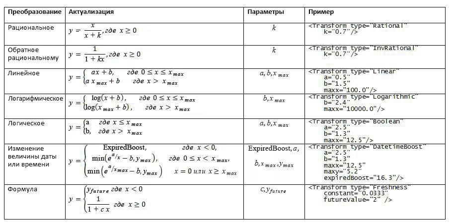
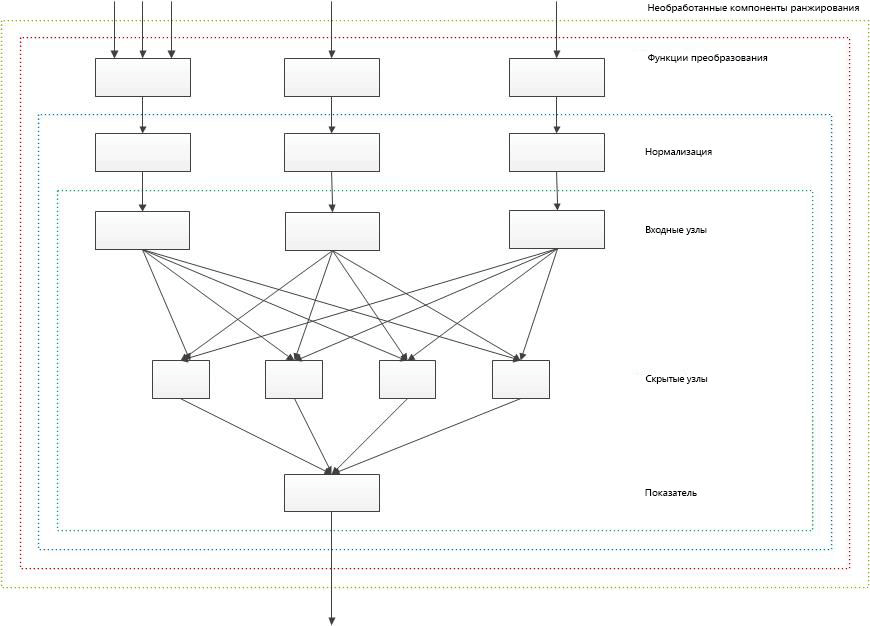

# <a name="customizing-ranking-models-to-improve-relevance-in-sharepoint"></a><span data-ttu-id="4c0e1-102">Настройка моделей ранжирования для улучшения релевантности в SharePoint</span><span class="sxs-lookup"><span data-stu-id="4c0e1-102">Customizing ranking models to improve relevance in SharePoint</span></span>
<span data-ttu-id="4c0e1-103">Повышение релевантности поиска путем настройки моделей ранжирования для точного вычисления ранга (степени релевантности) с помощью компонентов ранжирования в SharePoint.</span><span class="sxs-lookup"><span data-stu-id="4c0e1-103">Improve search relevance by customizing ranking models to calculate rank scores (relevance rank) accurately using rank features in SharePoint.</span></span>
<span data-ttu-id="4c0e1-104">Вы можете [сортировать результаты поиска в SharePoint](sorting-search-results-in-sharepoint.md) четырьмя способами, один из которых — по рангу.</span><span class="sxs-lookup"><span data-stu-id="4c0e1-104">You can  [sort search results in SharePoint](sorting-search-results-in-sharepoint.md) in four ways, one of which is by rank score.</span></span> <span data-ttu-id="4c0e1-105">При сортировке результатов поиска по рангу SharePoint помещает наиболее релевантные результаты в начале набора результатов.</span><span class="sxs-lookup"><span data-stu-id="4c0e1-105">When you sort search results by rank score, SharePoint places the most relevant results on top in the search result set.</span></span>
  
    
    

<span data-ttu-id="4c0e1-p102">Результат поиска является релевантным, если он получает высокий ранг  специальный числовой показатель, вычисляемый поисковой системой с помощью модели ранжирования. Модель ранжирования  это список этапов, содержащих наборы компонентов ранжирования. Модель ранжирования задает, как поисковая система вычисляет ранг релевантности, с помощью различных факторов, которые представлены в модели как компоненты ранжирования. К факторам вычисления ранга релевантности, помимо прочих, относятся следующие факторы:</span><span class="sxs-lookup"><span data-stu-id="4c0e1-p102">A search result is relevant if it receives a high rank score, which is a specific numeric score calculated by the search engine using a ranking model. A ranking model is a list of one or more rank stages that contain a set of rank features. The ranking model defines how the search engine calculates the relevance rank using various factors, which are represented in the ranking model as rank features. Factors used to calculate the relevance rank include, but are not limited to, the following:</span></span>
  
    
    


- <span data-ttu-id="4c0e1-110">Наличие терминов запросов в полнотекстовом индексе, в частности таких сведений, как заголовок и основной текст документа.</span><span class="sxs-lookup"><span data-stu-id="4c0e1-110">The appearance of query terms in the full-text index, which includes information such as a document's title and body.</span></span>
    
  
- <span data-ttu-id="4c0e1-111">Метаданные, связанные с определенным элементом, например тип файла документа или длина URL-адреса.</span><span class="sxs-lookup"><span data-stu-id="4c0e1-111">The metadata associated with a particular item, such as a document's file type or URL length.</span></span>
    
  
- <span data-ttu-id="4c0e1-112">Текст привязки, связанный с URL-ссылками, указывающими на определенный элемент.</span><span class="sxs-lookup"><span data-stu-id="4c0e1-112">The anchor text associated with URL links that point to a particular item.</span></span>
    
  
- <span data-ttu-id="4c0e1-113">Сведения о нажатиях элементов пользователями.</span><span class="sxs-lookup"><span data-stu-id="4c0e1-113">The information about user clicks for each item.</span></span>
    
  
- <span data-ttu-id="4c0e1-114">Расположение терминов запросов в основном тексте или заголовке документа.</span><span class="sxs-lookup"><span data-stu-id="4c0e1-114">The proximity of query terms in a document's body or title.</span></span>
    
  

## <a name="start-your-ranking-model-customization-based-on-a-sharepoint-ranking-model-template"></a><span data-ttu-id="4c0e1-115">Начало настройки модели ранжирования на основе шаблона модели ранжирования SharePoint</span><span class="sxs-lookup"><span data-stu-id="4c0e1-115">Start your ranking model customization based on a SharePoint ranking model template</span></span>
<span data-ttu-id="4c0e1-116"><a name="sp15_using_custom_ranking_model"> </a></span><span class="sxs-lookup"><span data-stu-id="4c0e1-116"><a name="sp15_using_custom_ranking_model"> </a></span></span>

<span data-ttu-id="4c0e1-117">Чтобы упростить настройку, для начала используйте одну из стандартных моделей ранжирования SharePoint в качестве шаблона.</span><span class="sxs-lookup"><span data-stu-id="4c0e1-117">To make your customization easier, start by using one of the default ranking models in SharePoint as a template.</span></span> <span data-ttu-id="4c0e1-118">Затем измените эту модель ранжирования в соответствии со своим набором данных.</span><span class="sxs-lookup"><span data-stu-id="4c0e1-118">Then, modify that ranking model to suit your data set.</span></span>
  
    
    
<span data-ttu-id="4c0e1-119">По умолчанию SharePoint предоставляет 14 моделей ранжирования.</span><span class="sxs-lookup"><span data-stu-id="4c0e1-119">SharePoint provides 14 ranking models by default.</span></span> <span data-ttu-id="4c0e1-120">В разделе [Что такое "модель ранжирования"?](http://technet.microsoft.com/library/7c8ddec1-c8ff-4a90-afae-387b27a653f1.aspx#Ranking_Models)</span><span class="sxs-lookup"><span data-stu-id="4c0e1-120">See  [What is a ranking model?](http://technet.microsoft.com/library/7c8ddec1-c8ff-4a90-afae-387b27a653f1.aspx#Ranking_Models)</span></span> <span data-ttu-id="4c0e1-121">(на сайте TechNet) представлены подробные сведения об этих моделях ранжирования и их назначении.</span><span class="sxs-lookup"><span data-stu-id="4c0e1-121">(on TechNet) for detailed information about these ranking models and their purpose.</span></span>
  
    
    

> <span data-ttu-id="4c0e1-122">**Важно!** Если установлен накопительный пакет обновления SharePoint за август 2013 г., рекомендуем использовать **модель ранжирования поиска с двумя линейными этапами** в качестве основы для пользовательской модели ранжирования.</span><span class="sxs-lookup"><span data-stu-id="4c0e1-122">**Important:** If you install the SharePoint cumulative update of August 2013, we recommend using the **Search Ranking Model with Two Linear Stages** as the base model for your custom ranking model.</span></span> <span data-ttu-id="4c0e1-123">**Модель ранжирования поиска с двумя линейными этапами** — это копия **стандартной модели поиска** с линейным вторым этапом вместо нейронной сети.</span><span class="sxs-lookup"><span data-stu-id="4c0e1-123">The **Search Ranking Model with Two Linear Stages** is a copy of the **Default Search Model** with a linear second stage instead of a neural network second stage.</span></span>
  
    
    

<span data-ttu-id="4c0e1-124">Для настройки моделей ранжирования используются следующие командлеты Windows PowerShell:</span><span class="sxs-lookup"><span data-stu-id="4c0e1-124">You use the following Windows PowerShell cmdlets to customize ranking models:</span></span>
  
    
    

-  [<span data-ttu-id="4c0e1-125">Get-SPEnterpriseSearchRankingModel</span><span class="sxs-lookup"><span data-stu-id="4c0e1-125">Get-SPEnterpriseSearchRankingModel</span></span>](http://technet.microsoft.com/ru-RU/library/ff607990.aspx)
    
  
-  [<span data-ttu-id="4c0e1-126">New-SPEnterpriseSearchRankingModel</span><span class="sxs-lookup"><span data-stu-id="4c0e1-126">New-SPEnterpriseSearchRankingModel</span></span>](http://technet.microsoft.com/ru-RU/library/ff607980.aspx)
    
  
-  [<span data-ttu-id="4c0e1-127">Remove-SPEnterpriseSearchRankingModel</span><span class="sxs-lookup"><span data-stu-id="4c0e1-127">Remove-SPEnterpriseSearchRankingModel</span></span>](http://technet.microsoft.com/ru-RU/library/ff608045.aspx)
    
  
-  [<span data-ttu-id="4c0e1-128">Set-SPEnterpriseSearchRankingModel</span><span class="sxs-lookup"><span data-stu-id="4c0e1-128">Set-SPEnterpriseSearchRankingModel</span></span>](http://technet.microsoft.com/ru-RU/library/ff607940.aspx)
    
  

### <a name="to-list-all-available-ranking-models"></a><span data-ttu-id="4c0e1-129">Получение списка всех доступных моделей ранжирования</span><span class="sxs-lookup"><span data-stu-id="4c0e1-129">To list all available ranking models</span></span>


1. <span data-ttu-id="4c0e1-130">Откройте Командная консоль SharePoint от имени администратора.</span><span class="sxs-lookup"><span data-stu-id="4c0e1-130">Open the SharePoint Management Shell as an Administrator.</span></span>
    
  
2. <span data-ttu-id="4c0e1-131">Запустите следующую последовательность командлетов Windows PowerShell.</span><span class="sxs-lookup"><span data-stu-id="4c0e1-131">Run the following sequence of Windows PowerShell cmdlets.</span></span>
    
```powershell
  
$ssa = Get-SPEnterpriseSearchServiceApplication -Identity "Search Service Application"
$owner = Get-SPenterpriseSearchOwner -Level ssa
Get-SPEnterpriseSearchRankingModel -SearchApplication $ssa -Owner $owner
```


### <a name="to-retrieve-a-default-ranking-model-to-use-as-a-template"></a><span data-ttu-id="4c0e1-132">Получение стандартной модели ранжирования в качестве шаблона</span><span class="sxs-lookup"><span data-stu-id="4c0e1-132">To retrieve a default ranking model to use as a template</span></span>


1. <span data-ttu-id="4c0e1-133">Откройте Командная консоль SharePoint от имени администратора.</span><span class="sxs-lookup"><span data-stu-id="4c0e1-133">Open the SharePoint Management Shell as an Administrator.</span></span>
    
  
2. <span data-ttu-id="4c0e1-134">Запустите следующую последовательность командлетов Windows PowerShell.  *filename.xml*   это имя файла, в котором нужно сохранить модель ранжирования.</span><span class="sxs-lookup"><span data-stu-id="4c0e1-134">Run the following sequence of Windows PowerShell cmdlets;  *filename.xml*  is the name of a file in which you want to save the ranking model.</span></span>
    
```powershell
  
$ssa = Get-SPEnterpriseSearchServiceApplication
$owner = Get-SPenterpriseSearchOwner -Level ssa
$defaultRankingModel = Get-SPEnterpriseSearchRankingModel -SearchApplication $ssa -Owner $owner | Where-Object { $_.IsDefault -eq $True }
$defaultRankingModel.RankingModelXML > filename.xml

```

<span data-ttu-id="4c0e1-135">Если установлено накопительное обновление SharePoint за август 2013 г., вы можете выполнить указанные ниже действия, чтобы получить модель ранжирования поиска с двумя линейными этапами для использования в качестве шаблона пользовательской модели.</span><span class="sxs-lookup"><span data-stu-id="4c0e1-135">If you install the SharePoint cumulative update of August 2013, you can use the following procedure to retrieve the search ranking model with two linear stages to use as a template for your custom ranking model.</span></span>
  
    
    

### <a name="to-retrieve-the-search-ranking-model-with-two-linear-stages-to-use-as-a-template"></a><span data-ttu-id="4c0e1-136">Получение модели ранжирования поиска с двумя линейными этапами в качестве шаблона</span><span class="sxs-lookup"><span data-stu-id="4c0e1-136">To retrieve the search ranking model with two linear stages to use as a template</span></span>


1. <span data-ttu-id="4c0e1-137">Откройте Командная консоль SharePoint от имени администратора.</span><span class="sxs-lookup"><span data-stu-id="4c0e1-137">Open the SharePoint Management Shell as an Administrator.</span></span>
    
  
2. <span data-ttu-id="4c0e1-138">Запустите следующую последовательность командлетов Windows PowerShell.  *filename.xml*   это имя файла, в котором нужно сохранить модель ранжирования.</span><span class="sxs-lookup"><span data-stu-id="4c0e1-138">Run the following sequence of Windows PowerShell cmdlets;  *filename.xml*  is the name of a file in which you want to save the ranking model.</span></span>
    
```powershell
  
$ssa = Get-SPEnterpriseSearchServiceApplication
$owner = Get-SPenterpriseSearchOwner -Level ssa 
$twoLinearStagesRankingModel = Get-SPEnterpriseSearchRankingModel -SearchApplication $ssa -Owner $owner -Identity 5E9EE87D-4A68-420A-9D58-8913BEEAA6F2 
$twoLinearStagesRankingModel.RankingModelXML > filename.xml

```


### <a name="to-deploy-a-custom-ranking-model"></a><span data-ttu-id="4c0e1-139">Развертывание пользовательской модели ранжирования</span><span class="sxs-lookup"><span data-stu-id="4c0e1-139">To deploy a custom ranking model</span></span>


1. <span data-ttu-id="4c0e1-p106">Скопируйте GUID нужной модели из списка доступных моделей ранжирования. Нужная последовательность командлетов Windows PowerShell описана в разделе  [Получение списка всех доступных моделей ранжирования](#sp15_list_available_ranking_models).</span><span class="sxs-lookup"><span data-stu-id="4c0e1-p106">From the list of available ranking models, copy the GUID of the ranking model that you want to use as a template. (See  [To list all available ranking models](#sp15_list_available_ranking_models) for the sequence of Windows PowerShell cmdlets to use.)</span></span>
    
  
2. <span data-ttu-id="4c0e1-142">Запустите следующую последовательность командлетов Windows PowerShell, используя GUID, скопированный на этапе 1, в качестве значения параметра  _<GUID>_.</span><span class="sxs-lookup"><span data-stu-id="4c0e1-142">Run the following sequence of Windows PowerShell cmdlets using the GUID copied in step 1 for  _<GUID>_.</span></span>
    
```powershell
  
$ssa = Get-SPEnterpriseSearchServiceApplication
$owner = Get-SPenterpriseSearchOwner -Level ssa
$rm = Get-SPEnterpriseSearchRankingModel -Identity <GUID> -SearchApplication $ssa -Owner $owner
$rm.RankingModelXML > myrm.xml 

```

3. <span data-ttu-id="4c0e1-p107">Отредактируйте файл  `myrm.xml` в редакторе XML. В качестве атрибутов **id** в элементе _RankModel2Stage_ и всех элементах _RankingModel2NN_ необходимо использовать новые значения GUID. Чтобы получить новое значение GUID, вы можете использовать следующую команду Windows PowerShell: `[guid]::NewGuid()`</span><span class="sxs-lookup"><span data-stu-id="4c0e1-p107">Edit the  `myrm.xml` file in an XML editor. You must use new GUID values for the **id** attributes in _RankModel2Stage_ element and all _RankingModel2NN_ elements. To get a new GUID value you can for example use the following Windows PowerShell command: `[guid]::NewGuid()`</span></span>
    
  
4. <span data-ttu-id="4c0e1-146">Создайте новую модель ранжирования с помощью командлета  [New-SPEnterpriseSearchRankingModel](http://technet.microsoft.com/ru-RU/library/ff607980.aspx), выполнив следующие команды.</span><span class="sxs-lookup"><span data-stu-id="4c0e1-146">Create a new ranking model with the  [New-SPEnterpriseSearchRankingModel](http://technet.microsoft.com/ru-RU/library/ff607980.aspx) cmdlet by running the following commands.</span></span>
    
```powershell
  
$myRankingModel = Get-Content .\\myrm.xml
$myRankingModel = [String]$myRankingModel
$ssa = Get-SPEnterpriseSearchServiceApplication
$owner = Get-SPenterpriseSearchOwner -Level ssa
$newrm = New-SPEnterpriseSearchRankingModel -SearchApplication $ssa -Owner $owner -RankingModelXML $myRankingModel
```


### <a name="rank-detail"></a><span data-ttu-id="4c0e1-147">Сведения о ранге</span><span class="sxs-lookup"><span data-stu-id="4c0e1-147">Rank detail</span></span>


> <span data-ttu-id="4c0e1-148">**Важно!** Мы предоставляем сведения о ранге и соответствующую страницу ExplainRank для вашего удобства и только с целью помочь вам в настройке и отладке ваших пользовательских моделей ранжирования.</span><span class="sxs-lookup"><span data-stu-id="4c0e1-148">**Important:** We provide the rank detail and the accompanying ExplainRank page as a convenience and only to assist you in tuning and debugging your own custom ranking models.</span></span> <span data-ttu-id="4c0e1-149">На содержимое сведений о ранге и соответствующую страницу ExplainRank не распространяется поддержка, и они могут меняться без уведомления с выходом будущих исправлений и обновлений программного обеспечения.</span><span class="sxs-lookup"><span data-stu-id="4c0e1-149">The contents of the rank detail and the accompanying ExplainRank page are not supported, and are subject to change without notice in future software patches and updates.</span></span> 
  
    
    

<span data-ttu-id="4c0e1-p109">Сведения о ранге  это XML-документ, содержащий сведения о вычислении ранга для отдельного элемента, который соответствует определенному запросу пользователя. Сведения о ранге хранятся в специальном управляемом свойстве под названием **rankdetail**.</span><span class="sxs-lookup"><span data-stu-id="4c0e1-p109">The rank detail is an XML document that provides detailed information about rank score calculation for a single item that matches a given user query. The rank detail is stored in a special managed property, called **rankdetail**.</span></span> 
  
    
    
<span data-ttu-id="4c0e1-p110">У каждого компонента ранжирования в модели есть отдельный узел XML в сведениях о ранге, где описывается вычисление ранга. Подробные сведения о ранге предоставляются только для запросов, результаты поиска по которым содержат не более 100 элементов.</span><span class="sxs-lookup"><span data-stu-id="4c0e1-p110">Each rank feature in a ranking model has a separate XML node in the rank detail that describes details of the rank score calculation. The rank detail is provided only for queries that have search results that don't exceed 100 items.</span></span>
  
    
    
<span data-ttu-id="4c0e1-154">Концептуально общий формат сведений о ранге имеет следующий вид.</span><span class="sxs-lookup"><span data-stu-id="4c0e1-154">Conceptually, the overall format of the rank detail looks like the following example.</span></span>
  
    
    


```xml

<rank_log version='15.0.0000.1000' id='[internal guid of ranking model used for calculation]' >
    <query tree='[representation of user query used for ranking]'/>
    <stage type='linear'>
        [Details of rank calculation of the first ranking stage. One XML node for each rank feature.]
        <stage_model>
            [Definition of the first stage of the ranking model]
        </stage_model>
    </stage>
    <stage type='neural_net' >
        [Details of rank calculation of the second ranking stage. One XML node for each rank feature.]
        <stage_model>
            [Definition of the second stage of the ranking model]
        </stage_model>
    </stage>
</rank_log>
```

<span data-ttu-id="4c0e1-155">Чтобы получить сведения о ранге, необходимо быть администратором приложения-службы поиска (SSA).</span><span class="sxs-lookup"><span data-stu-id="4c0e1-155">To retrieve the rank detail, you need to be the administrator of the Search service application (SSA).</span></span>
  
    
    

### <a name="to-retrieve-the-rank-detail"></a><span data-ttu-id="4c0e1-156">Получение сведений о ранге</span><span class="sxs-lookup"><span data-stu-id="4c0e1-156">To retrieve the rank detail</span></span>
<span data-ttu-id="4c0e1-157"><a name="sp15_list_available_ranking_models"> </a></span><span class="sxs-lookup"><span data-stu-id="4c0e1-157"><a name="sp15_list_available_ranking_models"> </a></span></span>

1. <span data-ttu-id="4c0e1-158">Откройте командную консоль SharePoint от имени администратора.</span><span class="sxs-lookup"><span data-stu-id="4c0e1-158">Open the SharePoint Management Shell as an Administrator.</span></span>
    
  
2. <span data-ttu-id="4c0e1-159">Запустите следующую последовательность командлетов Windows PowerShell, заменив параметры _<query_text>_ и _<url>_ фактическими значениями.</span><span class="sxs-lookup"><span data-stu-id="4c0e1-159">Run the following sequence of Windows PowerShell cmdlets, and substitute  _<query_text>_ and _<url>_ with actual values.</span></span>
    
```powershell
  
$app = Get-SPEnterpriseSearchServiceApplication
$searchAppProxy =  Get-spenterprisesearchserviceapplicationproxy | Where-Object { ($_.ServiceEndpointUri.PathAndQuery -like $app.Uri.PathAndQuery)}
$request = New-Object Microsoft.Office.Server.Search.Query.KeywordQuery($searchAppProxy)
$request.ResultTypes = [Microsoft.Office.Server.Search.Query.ResultType]::RelevantResults
$request.QueryText = "<query_text> AND path:""<url>"""
$request.SelectProperties.Add("rankdetail")
$searchexecutor = new-Object Microsoft.Office.Server.Search.Query.SearchExecutor 
$resultTables = $searchexecutor.ExecuteQuery($request) 
$resultTables[([Microsoft.Office.Server.Search.Query.ResultType]::RelevantResults)].Table

```


### <a name="understanding-the-rank-score-calculation-via-the-explainrank-page"></a><span data-ttu-id="4c0e1-160">Общие сведения о вычислении ранга на странице ExplainRank</span><span class="sxs-lookup"><span data-stu-id="4c0e1-160">Understanding the rank score calculation via the ExplainRank page</span></span>

<span data-ttu-id="4c0e1-161">SharePoint предоставляет страницу **ExplainRank**, расположенную в папке макетов (`<searchCenter>/_layouts/15/`).</span><span class="sxs-lookup"><span data-stu-id="4c0e1-161">SharePoint provides the **ExplainRank** page that is located in the layouts folder ( `<searchCenter>/_layouts/15/`).</span></span> <span data-ttu-id="4c0e1-162">На этой странице представлены подробные сведения о ранге для каждого компонента ранжирования в соответствии с поисковым запросом, ИД документа и необязательным ИД модели ранжирования.</span><span class="sxs-lookup"><span data-stu-id="4c0e1-162">This page contains detailed information on the rank score for each rank feature based on a given search query, a document ID, and an optional ranking model ID.</span></span> <span data-ttu-id="4c0e1-163">Эти сведения получаются и анализируются из сведений о ранге.</span><span class="sxs-lookup"><span data-stu-id="4c0e1-163">The information is obtained and parsed from the rank detail.</span></span>
  
    
    
<span data-ttu-id="4c0e1-164">Вы можете перейти на страницу **ExplainRank** по следующему URL-адресу:</span><span class="sxs-lookup"><span data-stu-id="4c0e1-164">You can access the **ExplainRank** page with the following URL:</span></span>
  
    
    
 `http://<searchCenter>/_layouts/15/ExplainRank.aspx?q={x}&amp;d={y}&amp;rm={z}`
  
    
    
<span data-ttu-id="4c0e1-165">Где:</span><span class="sxs-lookup"><span data-stu-id="4c0e1-165">Where:</span></span>
  
    
    

-  <span data-ttu-id="4c0e1-166">*x*   это поисковый запрос.</span><span class="sxs-lookup"><span data-stu-id="4c0e1-166">*x*  is the search query.</span></span>
    
  
-  <span data-ttu-id="4c0e1-167">*y*   это идентификатор документа.</span><span class="sxs-lookup"><span data-stu-id="4c0e1-167">*y*  is the document ID.</span></span>
    
  
-  <span data-ttu-id="4c0e1-p112">*z*   это необязательный идентификатор модели ранжирования. Если он не указан, используется модель ранжирования по умолчанию.</span><span class="sxs-lookup"><span data-stu-id="4c0e1-p112">*z*  is the optional ranking model ID. If no ranking model ID is provided, the default ranking model is used.</span></span>
    
  
<span data-ttu-id="4c0e1-170">Как и со сведениями о ранге, для просмотра страницы **ExplainRank** необходимо быть администратором приложения-службы поиска (SSA).</span><span class="sxs-lookup"><span data-stu-id="4c0e1-170">Just like with the rank detail, to view the **ExplainRank** page, you need to be the administrator of the Search service application (SSA).</span></span>
  
    
    

## <a name="tune-your-ranking-model-with-rank-features"></a><span data-ttu-id="4c0e1-171">Настройка модели с помощью компонентов ранжирования</span><span class="sxs-lookup"><span data-stu-id="4c0e1-171">Tune your ranking model with rank features</span></span>
<span data-ttu-id="4c0e1-172"><a name="sp15_rank_features"> </a></span><span class="sxs-lookup"><span data-stu-id="4c0e1-172"><a name="sp15_rank_features"> </a></span></span>

<span data-ttu-id="4c0e1-173">Компоненты ранжирования подобны ручкам управления моделью ранжирования.</span><span class="sxs-lookup"><span data-stu-id="4c0e1-173">Rank features work like tuning dials for a ranking model.</span></span> <span data-ttu-id="4c0e1-174">В следующих разделах описываются компоненты ранжирования, доступные в стандартной модели ранжирования SharePoint, и то, как они участвуют в вычислении степени релевантности.</span><span class="sxs-lookup"><span data-stu-id="4c0e1-174">The following sections describe the rank features that are available in the default SharePoint ranking model and how they contribute to relevance rank calculation.</span></span>
  
    
    

### <a name="bm25"></a><span data-ttu-id="4c0e1-175">BM25</span><span class="sxs-lookup"><span data-stu-id="4c0e1-175">BM25</span></span>

<span data-ttu-id="4c0e1-p114">Компонент ранжирования BM25 оценивает элементы по внешнему виду терминов запросов в полнотекстовом индексе. Входными данными компонента BM25 могут быть любые управляемые свойства полнотекстового индекса.</span><span class="sxs-lookup"><span data-stu-id="4c0e1-p114">The BM25 rank feature ranks items based on the appearance of query terms in the full-text index. The input to BM25 can be any of the managed properties in the full-text index.</span></span>
  
> [!NOTE]
> <span data-ttu-id="4c0e1-178">В этом контексте используется версия компонента ранжирования BM25 с полями, BM25F.</span><span class="sxs-lookup"><span data-stu-id="4c0e1-178">The BM25 rank feature used in this context is the fielded version, BM25F.</span></span> 
  
    
    

<span data-ttu-id="4c0e1-179">Компонент ранжирования BM25 вычисляет степень релевантности по приведенной ниже формуле.</span><span class="sxs-lookup"><span data-stu-id="4c0e1-179">The BM25 rank feature calculates the relevance rank score using the following formula.</span></span>
  
    
    

  
    
    

  
    
    
<span data-ttu-id="4c0e1-181">Где:</span><span class="sxs-lookup"><span data-stu-id="4c0e1-181">Where:</span></span>
  
    
    

-  <span data-ttu-id="4c0e1-182">_D_  это документ, представленный в виде списка текстовых полей, например заголовка или основного текста.</span><span class="sxs-lookup"><span data-stu-id="4c0e1-182">_D_ is a document, represented as a list of textual fields such as the title or body.</span></span>
    
  
-  <span data-ttu-id="4c0e1-183">_Q_  запрос пользователя, представленный в виде списка терминов запроса, _t_.</span><span class="sxs-lookup"><span data-stu-id="4c0e1-183">_Q_ is the user query, represented as a list of query terms, _t_.</span></span>
    
  
-  <span data-ttu-id="4c0e1-184">_S_ задает список полей, которые участвуют в ранжировании релевантности. Этот список задается в модели ранжирования.</span><span class="sxs-lookup"><span data-stu-id="4c0e1-184">_S_ defines the list of fields that contribute to relevance ranking; this list is defined by the ranking model.</span></span>
    
  
-  <span data-ttu-id="4c0e1-185">_w_f — это числовое значение, определяющее относительный вес поля _f_ ???</span><span class="sxs-lookup"><span data-stu-id="4c0e1-185">_w_f is a numeric value that defines the relative weight of the field _f_ ???</span></span> <span data-ttu-id="4c0e1-186">_S_. Это значение определяется моделью ранжирования.</span><span class="sxs-lookup"><span data-stu-id="4c0e1-186">_S_; this value is defined by the ranking model.</span></span>
    
  
-  <span data-ttu-id="4c0e1-187">_b_f — это числовое значение, определяющее нормализацию длины документа для каждого поля _f_ ???</span><span class="sxs-lookup"><span data-stu-id="4c0e1-187">_b_f is a numeric value that defines the document length normalization for each field _f_ ???</span></span> <span data-ttu-id="4c0e1-188">_S_.</span><span class="sxs-lookup"><span data-stu-id="4c0e1-188">_S_.</span></span>
    
  
-  <span data-ttu-id="4c0e1-189">_TF_f _(t,D)_ — это число вхождений термина запроса _t_ в поле _f_ документа _D_.</span><span class="sxs-lookup"><span data-stu-id="4c0e1-189">_TF_f _(t,D)_ is the number of occurrences of query term _t_ in the field _f_ of document _D_.</span></span>
    
  
-  <span data-ttu-id="4c0e1-190">_DL_f _(D)_  это общее количество слов в поле _f_ документа _D_.</span><span class="sxs-lookup"><span data-stu-id="4c0e1-190">_DL_f _(D)_ is the total number of words in field _f_ of document _D_.</span></span>
    
  
-  <span data-ttu-id="4c0e1-191">_N_  это общее количество документов в индексе.</span><span class="sxs-lookup"><span data-stu-id="4c0e1-191">_N_ is the total amount of documents in the index.</span></span>
    
  
-  <span data-ttu-id="4c0e1-192">_n_t это количество документов, содержащих термин  _t_ хотя бы в одном из свойств.</span><span class="sxs-lookup"><span data-stu-id="4c0e1-192">_n_t is an amount of documents that have term _t_ in at least one of their properties.</span></span>
    
  
-  <span data-ttu-id="4c0e1-193">_AVDL_f это среднее значение  _DL_f _(D)_ во всех проиндексированных документах.</span><span class="sxs-lookup"><span data-stu-id="4c0e1-193">_AVDL_f is the average _DL_f _(D)_ across all indexed documents.</span></span>
    
  
-  <span data-ttu-id="4c0e1-194">_k_1 это скалярный параметр. Его значение задается моделью ранжирования.</span><span class="sxs-lookup"><span data-stu-id="4c0e1-194">_k_1 is a scalar parameter; this value is defined by the ranking model.</span></span>
    
  
<span data-ttu-id="4c0e1-195">Управляемые свойства, используемые компонентом ранжирования BM25, необходимо сопоставить со стандартным полнотекстовым индексом в интерфейсе **Выбор дополнительных параметров поиска**.</span><span class="sxs-lookup"><span data-stu-id="4c0e1-195">You must map the managed properties used for the BM25 rank feature to the default full-text index in the **Choose advanced searchable settings** UI.</span></span>
  
    
    
<span data-ttu-id="4c0e1-196">В поисковом запросе из вычислений ранга релевантности исключаются термины, являющиеся частью следующих операторов:  `NOT(???)` в FQL, `NOT(???)` в KQL и `FILTER(???)` в FQL.</span><span class="sxs-lookup"><span data-stu-id="4c0e1-196">Within a user query, query terms that are part of the following operators are excluded from relevance rank calculations:  `NOT(???)` in FQL, `NOT(???)` in KQL, and `FILTER(???)` in FQL.</span></span>
  
    
    
<span data-ttu-id="4c0e1-197">Кроме того, из вычислений исключаются термины, входящие в область, например  `title:apple AND body:orange`.</span><span class="sxs-lookup"><span data-stu-id="4c0e1-197">In addition, query terms that are under scope, for example,  `title:apple AND body:orange`, are excluded from relevance rank calculations.</span></span>
  
    
    
 <span data-ttu-id="4c0e1-198">**Пример определения компонента ранжирования BM25**</span><span class="sxs-lookup"><span data-stu-id="4c0e1-198">**Example BM25 rank feature definition**</span></span>
  
    
    


```xml

<BM25Main name="ContentRank" k1="1">
    <Layer1Weights>
        <Weight>0.26236235707678</Weight>
    </Layer1Weights>
    <Properties>
        <Property name="body" w="0.019391078235467" b="0.44402228898786156" propertyName="body" />
        <Property name="Title" w="0.36096989709360422" b="0.38179554361297785" propertyName="Title" />
        <Property name="Author" w="0.15808522836934547" b="0.13896219383271818" propertyName="Author" />
        <Property name="Filename" w="0.15115036355698144" b="0.96245017871125826" propertyName="Filename" />
        <Property name="QLogClickedText" w="0.3092664171701901" b="0.056446823262849853" propertyName="QLogClickedText" />
        <Property name="AnchorText" w="0.021768362296187508" b="0.74173561196103566" propertyName="AnchorText" />
        <Property name="SocialTag" w="0.10217215754116529" b="0.55968554315932328" propertyName="SocialTag" />
    </Properties>
</BM25Main>
```

 <span data-ttu-id="4c0e1-199">**Пример сведений о ранге для компонента ранжирования BM25**</span><span class="sxs-lookup"><span data-stu-id="4c0e1-199">**Example rank detail for BM25 rank feature**</span></span>
  
    
    


```xml

<bm25 name='ContentRank'>
<schema pid_mapping='[1:content::7:%default] [2:content::1:%default] [3:content::5:%default] [56:content::2:%default] [100:content::3:link] [10:content::6:link] [264:content::14:link] ' pids_not_mapped=''/>
<query_term term='WORDS(content:integration, content:integrations, content:integrations)'>
    <index name='content' N='10035' n='8'
           avdl='1 2.98018 2.00427 1 1 2.39394 1 637.308 1 1 1 1 1 1 1 1 '>
        <group id='%default'
               ext_doc_id='55' int_doc_id='16' precalc='0' tf_prime='0.500486' weight='1'
               tf='0 1 1 0 0 0 0 11 0 0 0 0 0 0 0 0 '
               dl='0 4 9 0 0 2 0 1291 0 0 0 0 0 0 0 0 '/>
        <group id='link'/>
    </index>
    <rank score='2.37967' score_acc='2.37967' term_weight='7.13439'/>
</query_term>

<query_term term='WORDS(content:effort, content:efforts, content:efforts)'>
    <index name='content' N='10035' n='9'
           avdl='1 2.98018 2.00427 1 1 2.39394 1 637.308 1 1 1 1 1 1 1 1 '>
        <group id='%default'/>
        <group id='link'/>
    </index>
    <rank score='0' score_acc='2.37967' term_weight='7.01661'/>
</query_term>

<query_term term='PHRASE(content:fastserver, content:plugin)'>
    <index name='content' N='10035' n='3'
           avdl='1 2.98018 2.00427 1 1 2.39394 1 637.308 1 1 1 1 1 1 1 1 '>
        <group id='%default'
               ext_doc_id='55' int_doc_id='16' precalc='0' tf_prime='0.0399696' weight='1'
               tf='0 0 0 0 0 0 0 3 0 0 0 0 0 0 0 0 '
               dl='0 4 9 0 0 2 0 1291 0 0 0 0 0 0 0 0 '/>
        <group id='link'/>
    </index>
    <rank score='0.311896' score_acc='2.69157' term_weight='8.11522'/>
</query_term>
<final score='2.69157' transformed='2.69157' normalized='2.69157' hidden_nodes_adds='0.706166 '/>
</bm25>

```


#### <a name="weight-groups"></a><span data-ttu-id="4c0e1-200">Группы веса</span><span class="sxs-lookup"><span data-stu-id="4c0e1-200">Weight groups</span></span>

<span data-ttu-id="4c0e1-201">В пользовательской модели ранжирования может быть два или более управляемых свойства, сопоставленных с одной и той же группой веса в схеме поиска.</span><span class="sxs-lookup"><span data-stu-id="4c0e1-201">In a custom ranking model, you can have two or more managed properties that are mapped to the same weight group in the search schema.</span></span> <span data-ttu-id="4c0e1-202">В таких случаях содержимое этих управляемых свойств объединяется в полнотекстовый индекс и ранги не могут присваиваться отдельно при вычислении в компоненте BM25.</span><span class="sxs-lookup"><span data-stu-id="4c0e1-202">In such cases, content of these managed properties is combined in the full-text index and can't be ranked separately in BM25 calculation.</span></span> <span data-ttu-id="4c0e1-203">Это аналогично установке равных значений для параметров _w_f и _b_f в каждой группе управляемых свойств, сопоставленной с одной и той же группой веса в схеме поиска.</span><span class="sxs-lookup"><span data-stu-id="4c0e1-203">This effect is the same as setting equal values for the  _w_f and _b_f parameters within each group of managed properties, mapped to the same weight group in the search schema.</span></span> <span data-ttu-id="4c0e1-204">Во избежание этого сопоставляйте управляемые свойства с одной из 16 различных групп веса, доступных в схеме поиска.</span><span class="sxs-lookup"><span data-stu-id="4c0e1-204">To prevent this, map managed properties to one of the 16 different weight groups available in the search schema.</span></span>
  
    
    
<span data-ttu-id="4c0e1-p118">Группы веса также называют контекстом. Дополнительные сведения об отношениях между управляемым свойством и его контекстом см. в разделе  [Влияние на ранжирование результатов поиска с помощью схемы поиска](http://technet.microsoft.com/library/7c8ddec1-c8ff-4a90-afae-387b27a653f1.aspx#Ranking_Schema) (на сайте TechNet).</span><span class="sxs-lookup"><span data-stu-id="4c0e1-p118">Weight groups are also known as context. See  [Influencing the ranking of search results by using the search schema](http://technet.microsoft.com/library/7c8ddec1-c8ff-4a90-afae-387b27a653f1.aspx#Ranking_Schema) (on TechNet) for more information about the relationship between a managed property and its context.</span></span>
  
    
    

### <a name="static"></a><span data-ttu-id="4c0e1-207">Статическое</span><span class="sxs-lookup"><span data-stu-id="4c0e1-207">Static</span></span>

<span data-ttu-id="4c0e1-p119">Статический компонент ранжирования оценивает элементы по числовым управляемым свойствам, которые хранятся в индексе поиска. Числовые управляемые свойства, используемые для вычисления ранга релевантности в статических компонентах ранжирования, должны иметь тип  [Integer](https://msdn.microsoft.com/library/System.Integer.aspx) и атрибут [Refinable](https://msdn.microsoft.com/library/Microsoft.Office.Server.Search.Administration.ManagedProperty.Refinable.aspx) или [Sortable](https://msdn.microsoft.com/library/Microsoft.Office.Server.Search.Administration.ManagedProperty.Sortable.aspx) в схеме поиска. Многозначные управляемые свойства невозможно использовать в сочетании со статическим компонентом ранжирования.</span><span class="sxs-lookup"><span data-stu-id="4c0e1-p119">The static rank feature ranks items based on numeric managed properties that are stored in the search index. The numeric managed properties used for relevance rank calculation in static rank features must be of type  [Integer](https://msdn.microsoft.com/library/System.Integer.aspx) and set to [Refinable](https://msdn.microsoft.com/library/Microsoft.Office.Server.Search.Administration.ManagedProperty.Refinable.aspx) or [Sortable](https://msdn.microsoft.com/library/Microsoft.Office.Server.Search.Administration.ManagedProperty.Sortable.aspx) in the search schema. You can't use multivalued managed properties in combination with the static rank feature.</span></span>
  
    
    
<span data-ttu-id="4c0e1-p120">Прежде чем объединить статический компонент ранжирования с остальными компонентами ранжирования, необходима предварительная обработка каждого статического компонента путем простого преобразования. В таблице 1 перечислены все поддерживаемые функции преобразования.</span><span class="sxs-lookup"><span data-stu-id="4c0e1-p120">Before the static rank feature can be aggregated with other rank features, each static rank feature is preprocessed via a single transformation. Table 1 lists all supported transform functions.</span></span>
  
    
    

<span data-ttu-id="4c0e1-213">**Таблица 1. Поддерживаемые функции преобразования для компонентов ранжирования с учетом расположения и статических компонентов ранжирования**</span><span class="sxs-lookup"><span data-stu-id="4c0e1-213">**Table 1. Supported transform functions for the static and proximity rank features**</span></span>

    
    

  
    
    
 <span data-ttu-id="4c0e1-215">**Пример определения статического компонента ранжирования**</span><span class="sxs-lookup"><span data-stu-id="4c0e1-215">**Example static rank feature definition**</span></span>
  
    
    


```xml

<Static name="clickdistance" default="5" propertyName="clickdistance">
    <Transform type="InvRational" k="0.27618729159042193" />
    <Layer1Weights>
        <Weight>0.616326852981262</Weight>
    </Layer1Weights>
</Static>

```

 <span data-ttu-id="4c0e1-216">**Пример сведения о ранге для статического компонента ранжирования**</span><span class="sxs-lookup"><span data-stu-id="4c0e1-216">**Example rank detail for a static rank feature**</span></span>
  
    
    


```xml

<static_feature name='clickdistance' property_name='clickdistance'
    used_default='1' raw_value='5' raw_value_transformed='5' 
    transformed='0.420003' normalized='0.420003'
    hidden_nodes_adds='0.258859 '/>

```


### <a name="bucketed-static"></a><span data-ttu-id="4c0e1-217">Сегментированный статический компонент</span><span class="sxs-lookup"><span data-stu-id="4c0e1-217">Bucketed static</span></span>

<span data-ttu-id="4c0e1-p121">Сегментированный статический компонент ранжирования оценивает документы по типу файла и языку. Определение сегментированного статического компонента в модели ранжирования зависит от того, является ли компонент ранжирования частью линейной модели или нейронной сети. Приведенные ниже примеры относятся только к линейным моделям. Для нейронных сетей количество атрибутов  `<Add>` для каждого сегмента должно совпадать с количеством скрытых узлов нейронной сети.</span><span class="sxs-lookup"><span data-stu-id="4c0e1-p121">The bucketed static rank feature ranks documents based on their file type and language. The definition of a bucketed static rank feature within a ranking model depends on whether the rank feature is part of a linear model or a neural network. The following examples apply only to linear models. For neural networks, the number of  `<Add>` attributes for each bucket must match the number of hidden nodes in the neural network.</span></span>
  
    
    
<span data-ttu-id="4c0e1-p122">Управляемые свойства, используемые для вычисления ранга релевантности в сегментированных статических компонентах ранжирования, должны иметь тип  [Integer](https://msdn.microsoft.com/library/System.Integer.aspx) и атрибут [Refinable](https://msdn.microsoft.com/library/Microsoft.Office.Server.Search.Administration.ManagedProperty.Refinable.aspx) или [Sortable](https://msdn.microsoft.com/library/Microsoft.Office.Server.Search.Administration.ManagedProperty.Sortable.aspx) в схеме поиска. Многозначные управляемые свойства невозможно использовать в сочетании с сегментированным статическим компонентом ранжирования.</span><span class="sxs-lookup"><span data-stu-id="4c0e1-p122">The managed properties used for relevance rank calculation in bucketed static rank features must be of type  [Integer](https://msdn.microsoft.com/library/System.Integer.aspx) and set to [Refinable](https://msdn.microsoft.com/library/Microsoft.Office.Server.Search.Administration.ManagedProperty.Refinable.aspx) or [Sortable](https://msdn.microsoft.com/library/Microsoft.Office.Server.Search.Administration.ManagedProperty.Sortable.aspx) in the search schema. You can't use multivalued managed properties in combination with the bucketed static rank feature.</span></span>
  
    
    
 <span data-ttu-id="4c0e1-224">**Пример определения сегментированного статического компонента ранжирования для типа файла**</span><span class="sxs-lookup"><span data-stu-id="4c0e1-224">**Example bucketed static rank feature definition for file type**</span></span>
  
    
    
<span data-ttu-id="4c0e1-p123">С каждым документом связан тип файла, который компонент обработки содержимого определяет и сохраняет в индексе поиска как целое число от нуля. При использовании сегментированного статического компонента ранжирования для оценки документов по типу файла каждому типу документа назначается определенный показатель ранга релевантности. Например, в приведенном ниже определении сегмент **2** соответствует PPT-документу, а узел `<Add>0.680984743282165</Add>` задает дополнительные баллы ранга, которые добавляются к рангу релевантности всех PPT-документов.</span><span class="sxs-lookup"><span data-stu-id="4c0e1-p123">Every document has an associated file type that the content processing component detects and stores in the search index as a zero-based integer value. When you use the bucketed static rank feature to rank documents based on their file types, each document type is associated with a specific relevance rank score. For example, in the following definition, the bucket **2** corresponds to a .ppt document; the node `<Add>0.680984743282165</Add>` defines additional rank points that are added to the relevance rank scores for all .ppt documents.</span></span>
  
    
    


```xml

<BucketedStatic name="InternalFileType" default="0" propertyName="InternalFileType">
    <Bucket name="Html" value="0">
        <HiddenNodesAdds>
            <Add>0.464062832328107</Add>
        </HiddenNodesAdds>
    </Bucket>
    <Bucket name="Doc" value="1">
        <HiddenNodesAdds>
            <Add>0.551558196047853</Add>
        </HiddenNodesAdds>
    </Bucket>
    <Bucket name="Ppt" value="2">
        <HiddenNodesAdds>
            <Add>0.680984743282165</Add>
        </HiddenNodesAdds>
    </Bucket>
    <Bucket name="Xls" value="3">
        <HiddenNodesAdds>
            <Add>-0.143152682829863</Add>
        </HiddenNodesAdds>
    </Bucket>
    <Bucket name="Xml" value="4">
        <HiddenNodesAdds>
            <Add>-1.29219869408375</Add>
        </HiddenNodesAdds>
    </Bucket>
    <Bucket name="Txt" value="5">
        <HiddenNodesAdds>
            <Add>-0.456669562992298</Add>
        </HiddenNodesAdds>
    </Bucket>
    <Bucket name="ListItems" value="6">
        <HiddenNodesAdds>
            <Add>0.170944938307345</Add>
        </HiddenNodesAdds>
    </Bucket>
    <Bucket name="Message" value="7">
        <HiddenNodesAdds>
            <Add>-0.0666769377412764</Add>
        </HiddenNodesAdds>
    </Bucket>
    <Bucket name="Image" value="8">
        <HiddenNodesAdds>
            <Add>0.106988843357609</Add>
        </HiddenNodesAdds>
    </Bucket>
</BucketedStatic>
```

 <span data-ttu-id="4c0e1-228">**Пример определения сегментированного статического компонента ранжирования по языку документа**</span><span class="sxs-lookup"><span data-stu-id="4c0e1-228">**Example bucketed static rank feature definition for document language**</span></span>
  
    
    
<span data-ttu-id="4c0e1-p124">Компонент обработки содержимого определяет язык каждого документа автоматически, прежде чем добавлять его в индекс поиска. Используя сегментированный статический компонент ранжирования для оценки документов по языку, вы можете задать способ вычисления показателя ранга в зависимости от того, совпадает ли автоматически определенный язык документа с языком запроса.</span><span class="sxs-lookup"><span data-stu-id="4c0e1-p124">The content processing component detects the language for each document automatically before it's added to the search index. When you use the bucketed static rank feature to rank documents based on their language, you can define how to calculate the rank score based on whether the document's language that was automatically detected matches the query's language.</span></span>
  
    
    
<span data-ttu-id="4c0e1-231">Во время запроса сведения о языке пользователя записываются в поисковую систему в виде свойства запроса.</span><span class="sxs-lookup"><span data-stu-id="4c0e1-231">At query time, information about the user's language is written to the search engine as a query property.</span></span> 
  
    
    

### <a name="proximity"></a><span data-ttu-id="4c0e1-232">Компонент ранжирования с учетом расположения</span><span class="sxs-lookup"><span data-stu-id="4c0e1-232">Proximity</span></span>

<span data-ttu-id="4c0e1-233">Компонент ранжирования с учетом расположения ранжирует элементы в соответствии с расстоянием между терминами запроса в полнотекстовом индексе.</span><span class="sxs-lookup"><span data-stu-id="4c0e1-233">The proximity rank feature ranks items depending on the distance between query terms inside the full-text index.</span></span> <span data-ttu-id="4c0e1-234">Ранг повышается, если два термина запроса встречаются в одних и тех же управляемых свойствах в полнотекстовом индексе.</span><span class="sxs-lookup"><span data-stu-id="4c0e1-234">The rank score is boosted if two query terms appear in the same managed properties within the full-text index.</span></span> <span data-ttu-id="4c0e1-235">Вычисления с учетом расположения оказывают большую нагрузку на диск и ЦП, поэтому бонус за расстояние вычисляется только на втором этапе стандартной модели ранжирования (если он доступен).</span><span class="sxs-lookup"><span data-stu-id="4c0e1-235">Proximity calculations are expensive in terms of disk activity and CPU consumption; as a result, proximity boost is carried out only during the second stage of the default SharePoint rank model (if available).</span></span>
  
    
    
<span data-ttu-id="4c0e1-236">Вы можете оценить компонент ранжирования с учетом расположения с помощью различных параметров, контролируемых атрибутами, которые описываются в таблице 2.</span><span class="sxs-lookup"><span data-stu-id="4c0e1-236">You can evaluate the proximity rank feature by using several different options, controlled by attributes described in Table 2.</span></span>
  
    
    

<span data-ttu-id="4c0e1-237">**Таблица 2. Атрибуты, которые управляют оценкой компонентов ранжирования с учетом расположения**</span><span class="sxs-lookup"><span data-stu-id="4c0e1-237">**Table 2. Attributes that control evaluation of proximity rank features**</span></span>


|<span data-ttu-id="4c0e1-238">**Атрибуты**</span><span class="sxs-lookup"><span data-stu-id="4c0e1-238">**Attributes**</span></span>|<span data-ttu-id="4c0e1-239">**Описание**</span><span class="sxs-lookup"><span data-stu-id="4c0e1-239">**Description**</span></span>|
|:-----|:-----|
| `isExact=0` <br/> |<span data-ttu-id="4c0e1-240">В этом режиме алгоритм пытается определить минимальный размер подмножества терминов запросов в документе.</span><span class="sxs-lookup"><span data-stu-id="4c0e1-240">In this mode, the proximity algorithm attempts to find the minimal span (distance) of the subset of query terms in a document.</span></span>  <br/> <span data-ttu-id="4c0e1-p126">Алгоритм учитывает фрагменты с терминами запросов в том же порядке, в котором они встречаются в запросе пользователя. Если фрагмент для всех терминов запросов отсутствует, алгоритм ищет фрагменты, содержащие все термины, кроме одного. Этот процесс повторяется с уменьшением количества терминов, пока длина фрагмента не превысит значение  `maxMinSpan`.</span><span class="sxs-lookup"><span data-stu-id="4c0e1-p126">The proximity algorithm considers fragments that contain query terms in the same orders as they appear in the user query. If no fragment exists for all of the query terms, then the proximity algorithm considers fragments that contain all but one of the query terms. This process is iterated with the number of query terms reduced each time, until the length of the fragment exceeds  `maxMinSpan`.  </span></span><br/>  <span data-ttu-id="4c0e1-244">`maxMinSpan`  это атрибут компонента ранжирования с учетом расположения, который задает порог установки максимальной длины фрагмента.</span><span class="sxs-lookup"><span data-stu-id="4c0e1-244">`maxMinSpan` is an attribute within the proximity rank feature that specifies a threshold defining the maximum length of a fragment.</span></span> <br/> <span data-ttu-id="4c0e1-245">Идеальный фрагмент должен содержать все термины запросов и иметь длину меньше  `maxMinSpan`.</span><span class="sxs-lookup"><span data-stu-id="4c0e1-245">An ideal fragment is one that contains all query terms but is less than  `maxMinSpan`.</span></span>  <br/> |
| `isExact=1` <br/> |<span data-ttu-id="4c0e1-246">В этом режиме алгоритм пытается найти цельный отрывок документа, содержащий все термины (или фразу) запроса.</span><span class="sxs-lookup"><span data-stu-id="4c0e1-246">In this mode, the proximity algorithm attempts to find a consecutive snippet of document that contains all of the query terms (or query phrase).</span></span>  <br/> |
| `isDiscounted` <br/> |<span data-ttu-id="4c0e1-p127">Этот атрибут применим как к  `isExact=1`, так и к  `isExact=0`. Если атрибут  `isDiscounted` включен, значение расположения умножается на (количество вхождений лучшего фрагмента или точных совпадений), разделенное на (количество вхождений самого редкого термина запроса в данном контексте). </span><span class="sxs-lookup"><span data-stu-id="4c0e1-p127">This attribute is applicable to both  `isExact=1` and `isExact=0`. When  `isDiscounted` is enabled, the proximity value is multiplied by this fraction: (number of occurrences of the best fragment or exact hits) divided by (number of occurrences of the rarest query term in this context). </span></span><br/> |
| `proximity="complete"` <br/> |<span data-ttu-id="4c0e1-249">В этом режиме компонент повышает ранг только тех документов, где текст запроса встречается только в определенном управляемом свойстве.</span><span class="sxs-lookup"><span data-stu-id="4c0e1-249">In this mode, the proximity rank feature only boosts documents where the whole user query text occurs within a specific managed property.</span></span>  <br/> |
| `proximity="perfect"` <br/> |<span data-ttu-id="4c0e1-p128">Этот режим подобен режиму  `complete`. но применяется к коротким полям, например **title**. Компонент ранжирования с учетом расположения повышает ранг только тех документов, где текст запроса полностью совпадает со значением **title** в определенном управляемом свойстве. Если значение **title** содержит термины, не входящие в запрос, алгоритм не учитывает элемент. </span><span class="sxs-lookup"><span data-stu-id="4c0e1-p128">This mode is similar to  `complete` mode, but is applied to short fields, such as **title**. The proximity rank feature only boosts documents where the whole user query text matches an exact **title** within a specific managed property. If the **title** contains additional terms outside of the user query, the item isn't considered by the proximity algorithm. </span></span><br/> |
| `default` <br/> |<span data-ttu-id="4c0e1-p129">Этот атрибут применяется только к запросам, состоящим из одного термина. Для элементов, содержащих термин запроса, значение  `default` используется в качестве выходного показателя ранга для компонента ранжирования с учетом расположения.</span><span class="sxs-lookup"><span data-stu-id="4c0e1-p129">This attribute applies only to single-term queries. For items that contain the query term, the  `default` value is used as the rank score output by the proximity rank feature. </span></span><br/> <span data-ttu-id="4c0e1-p130"> Результат  `perfect` является исключением из этого правила. В случае получения результата `perfect` значение по умолчанию не используется. Вместо этого запросы, состоящие из одного термина, обрабатываются так же, как и остальные запросы. </span><span class="sxs-lookup"><span data-stu-id="4c0e1-p130">The  `perfect` proximity is an exception to this rule. For `perfect` proximity, the default value is never used. Instead, single-term queries are processed in the same way as other queries. </span></span><br/> |
   
 <span data-ttu-id="4c0e1-258">**Пример определения компонента ранжирования с учетом расположения**</span><span class="sxs-lookup"><span data-stu-id="4c0e1-258">**Example proximity rank feature definition**</span></span>
  
    
    
<span data-ttu-id="4c0e1-259">Приведенный ниже пример представляет собой фрагмент стандартной модели ранжирования SharePoint.</span><span class="sxs-lookup"><span data-stu-id="4c0e1-259">The following example is an excerpt from the default SharePoint rank model.</span></span> <span data-ttu-id="4c0e1-260">В этой модели компонент ранжирования с учетом расположения — лишь часть второго этапа вычислений, включающего нейронную сеть.</span><span class="sxs-lookup"><span data-stu-id="4c0e1-260">In this model, the proximity feature is only part of the second stage calculation, which involves a neural network.</span></span> <span data-ttu-id="4c0e1-261">Следовательно, пример содержит несколько элементов веса, `<LayerWeights>`, соответствующих числу нейронов на скрытом уровне нейронной сети.</span><span class="sxs-lookup"><span data-stu-id="4c0e1-261">Therefore, the example contains multiple weight elements,  `<LayerWeights>`, which correspond to the number of neurons in the hidden layer of the neural network.</span></span>
  
    
    


```xml

<MinSpan name="Title_MinSpanExactDiscounted" default="0.43654446989518952" maxMinSpan="1" isExact="1" isDiscounted="1" propertyName="Title">
    <Normalize SDev="0.20833333333333334" Mean="0.375" />
    <Transform type="Linear" a="1" b="0" maxx="10000" />
    <Layer1Weights>
        <Weight>0.0399835450090479</Weight>
        <Weight>-0.00693681478614802</Weight>
        <Weight>0.0286196612755843</Weight>
        <Weight>0.11775902923563</Weight>
        <Weight>0.0885860088190342</Weight>
        <Weight>0.102859503886488</Weight>
    </Layer1Weights>
</MinSpan>

```

<span data-ttu-id="4c0e1-262">Управляемые свойства, используемые в компонентах ранжирования с учетом расположения, необходимо сопоставить со стандартным полнотекстовым индексом в схеме поиска.</span><span class="sxs-lookup"><span data-stu-id="4c0e1-262">You must map the managed properties used in proximity rank features to the default full-text index in search schema.</span></span> 
  
    
    
 <span data-ttu-id="4c0e1-263">**Пример сведений о ранге для компонента ранжирования с учетом расположения**</span><span class="sxs-lookup"><span data-stu-id="4c0e1-263">**Example rank detail for proximity rank feature**</span></span>
  
    
    


```xml

<proximity_feature name='Title_MinSpanExactDiscounted' pid='2'
                   proximity_type='exact_discounted' 
                   used_default='0' raw_value='0' transformed='0'
                   normalized='-1.8' 
                   hidden_nodes_adds='-0.0719704 0.0124863 -0.0515154 -0.211966 -0.159455 -0.185147 ' />

```


### <a name="dynamic"></a><span data-ttu-id="4c0e1-264">Динамическая группа</span><span class="sxs-lookup"><span data-stu-id="4c0e1-264">Dynamic</span></span>

<span data-ttu-id="4c0e1-p132">Динамический компонент ранжирования оценивает элемент в зависимости от того, совпадает ли свойство запроса с определенным управляемым свойством. Если обнаружено совпадение, показатель ранга элемента умножается на определенное значение, чтобы выделить этот элемент. Атрибут веса используется для управления влиянием компонента на общий показатель ранга.</span><span class="sxs-lookup"><span data-stu-id="4c0e1-p132">The dynamic rank feature ranks an item depending on whether the query property matches a given managed property. If there is a match, the item's rank score is multiplied with a specific value to distinguish that particular item. The weight attribute is used to control how much this feature affects the overall rank score.</span></span>
  
> [!NOTE]
> <span data-ttu-id="4c0e1-268">Компонент динамического ранжирования не поддерживает настройку. Он предназначен только для внутреннего использования.</span><span class="sxs-lookup"><span data-stu-id="4c0e1-268">Note: The dynamic rank feature is not customizable; it's for internal use only.</span></span> <span data-ttu-id="4c0e1-269">Однако если установлено накопительное обновление SharePoint за август 2013 г., компонент ранжирования AnchortextComplete является настраиваемым динамическим компонентом, входящим в стандартную модель ранжирования.</span><span class="sxs-lookup"><span data-stu-id="4c0e1-269">However, if you install the SharePoint cumulative update of August 2013, the AnchortextComplete rank feature is a customizable dynamic rank feature that is part of the default ranking model.</span></span> 
  
    
    

 <span data-ttu-id="4c0e1-270">**Пример определения динамического компонента ранжирования**</span><span class="sxs-lookup"><span data-stu-id="4c0e1-270">**Example dynamic rank feature definition**</span></span>
  
    
    


```xml

<Dynamic name="AnchortextComplete" pid="501" default="0" property="AnchortextCompleteQueryProperty">
    <Transform type="Rational" k="0.91495552365614574" />
        <Layer1Weights>
            <Weight>0.715419978898093</Weight>
        </Layer1Weights>
</Dynamic>
```


### <a name="freshness"></a><span data-ttu-id="4c0e1-271">Компонент ранжирования по актуальности</span><span class="sxs-lookup"><span data-stu-id="4c0e1-271">Freshness</span></span>

<span data-ttu-id="4c0e1-p134">Стандартная модель ранжирования SharePoint не повышает ранг результатов поиска по их актуальности. Вы можете добавить эту возможность, создав новый статический компонент ранжирования, которые объединяет сведения из управляемого свойства **LastModifiedTime** со свойством запроса **DateTimeUtcNow**, используя функцию преобразования актуальности. Функция преобразования актуальности  это единственная функция преобразования, которую можно использовать для этого компонента ранжирования, так как она преобразует возраст элемента из внутреннего представления в дни.</span><span class="sxs-lookup"><span data-stu-id="4c0e1-p134">The default SharePoint ranking model doesn't boost the rank of search results based on their freshness. You can achieve this by adding a new static rank feature that combines information from the **LastModifiedTime** managed property with the **DateTimeUtcNow** query property, using the freshness transform function. The freshness transform function is the only transform that you can use for this freshness rank feature, because it converts the age of the item from an internal representation into days.</span></span>
  
    
    
<span data-ttu-id="4c0e1-275">Преобразование актуальности выполняется по следующей формуле:</span><span class="sxs-lookup"><span data-stu-id="4c0e1-275">The freshness transform is based on the following formula:</span></span>
  
    
    

  
    
    

  
    
    
<span data-ttu-id="4c0e1-277">Где:</span><span class="sxs-lookup"><span data-stu-id="4c0e1-277">Where:</span></span>
  
    
    

-  <span data-ttu-id="4c0e1-278">_c_ и _y_future определяются в модели ранжирования.</span><span class="sxs-lookup"><span data-stu-id="4c0e1-278">_c_ and _y_future are defined in the ranking model.</span></span>
    
  
-  <span data-ttu-id="4c0e1-279">_x_ это возраст элемента в днях.</span><span class="sxs-lookup"><span data-stu-id="4c0e1-279">_x_ is the age of an item in days.</span></span>
    
  
- <span data-ttu-id="4c0e1-280">Значение параметра _y_future задает бонус за актуальность для элементов, у которых значение свойства **LastModifiedTime** выше текущих даты и времени.</span><span class="sxs-lookup"><span data-stu-id="4c0e1-280">The value of  _y_future defines the freshness boost for items that have **LastModifiedTime** greater than the current date and time.</span></span>
    
  
 <span data-ttu-id="4c0e1-281">**Пример определения компонента ранжирования по актуальности**</span><span class="sxs-lookup"><span data-stu-id="4c0e1-281">**Example freshness rank feature definition**</span></span>
  
    
    


```xml

<Static name='freshboost' propertyName='LastModifiedTime' default='-1' convertPropertyToDatetime='1' rawValueTransform='compare' property='DateTimeUtcNow'>
    <Transform type="Freshness" constant="0.0333" futureValue="2" />
    <Layer1Weights>
        <Weight>1.0</Weight>
    </Layer1Weights>
</Static>
```

 <span data-ttu-id="4c0e1-282">**Пример сведений о ранге для компонента ранжирования по актуальности (возраст около 580 дней)**</span><span class="sxs-lookup"><span data-stu-id="4c0e1-282">**Example rank detail for freshness rank feature using an old document (approximately 580 days old)**</span></span>
  
    
    


```xml

<static_feature name='freshboost' property_name='LastModifiedTime' raw_value_transform='compare' used_default='0' property_value_found='1' property_value='9807115930137649186' raw_value='9.80661e+018' raw_value_transformed='-5.03135e+014' transformed='0.0490396' normalized='0.0490396' hidden_nodes_adds='0.0490396 '/>

```

 <span data-ttu-id="4c0e1-283">**Пример сведений о ранге для компонента ранжирования по актуальности с использованием нового документ (возраст <1 дня)**</span><span class="sxs-lookup"><span data-stu-id="4c0e1-283">**Example rank detail for freshness rank feature using a new document (<1 day old)**</span></span>
  
    
    


```xml

<static_feature name='freshboost' property_name='LastModifiedTime' raw_value_transform='compare' used_default='0' property_value_found='1' property_value='9807115934928966979' raw_value='9.80712e+018' raw_value_transformed='-2.55529e+011' transformed='0.990248' normalized='0.990248'hidden_nodes_adds='0.990248 '/>

```


## <a name="aggregation-of-rank-features"></a><span data-ttu-id="4c0e1-284">Объединение компонентов ранжирования</span><span class="sxs-lookup"><span data-stu-id="4c0e1-284">Aggregation of rank features</span></span>
<span data-ttu-id="4c0e1-285"><a name="sp15_aggregation_of_rank_features"> </a></span><span class="sxs-lookup"><span data-stu-id="4c0e1-285"><a name="sp15_aggregation_of_rank_features"> </a></span></span>

<span data-ttu-id="4c0e1-286">Модель ранжирования состоит из различных компонентов ранжирования, которые учитываются при вычислении ранга.</span><span class="sxs-lookup"><span data-stu-id="4c0e1-286">A ranking model consists of various rank features that are considered together to calculate a rank score.</span></span>
  
    
    

### <a name="two-stage-ranking-models"></a><span data-ttu-id="4c0e1-287">Двухуровневые модели ранжирования</span><span class="sxs-lookup"><span data-stu-id="4c0e1-287">Two-stage ranking models</span></span>

<span data-ttu-id="4c0e1-p135">Модель ранжирования может состоять из двух уровней. На первом уровне модель ранжирования применяет относительно простые компоненты, чтобы получить примерные ранги результатов. На втором уровне модель применяет дополнительные, более затратные компоненты к элементам с самыми высокими показателями ранга.</span><span class="sxs-lookup"><span data-stu-id="4c0e1-p135">A ranking model can have two rank stages. In the first stage, the ranking model applies relatively inexpensive rank features to get a gross ranking of the results. In the second stage, the ranking model applies additional and more expensive rank features to the items with the highest rank scores.</span></span>
  
    
    
<span data-ttu-id="4c0e1-291">Стандартная модель ранжирования SharePoint — пример двухэтапной модели ранжирования.</span><span class="sxs-lookup"><span data-stu-id="4c0e1-291">The SharePoint default ranking model is an example of two-stage ranking model.</span></span> <span data-ttu-id="4c0e1-292">Ее второй уровень работает с первыми 1000 элементами, которые получили самые высокие показатели ранга на первом уровне.</span><span class="sxs-lookup"><span data-stu-id="4c0e1-292">In this model, the second stage works with the top 1000 items with the highest rank score that result from the first stage.</span></span>
  
    
    
<span data-ttu-id="4c0e1-p137">По завершении процесса ранжирования на первом уровне поисковая система повторно сортирует все элементы, включая те, которые были исключены из второго уровня. Как правило, в результате этого элементы из второго уровня имеют более низкий ранг, чем элементы на первом уровне.</span><span class="sxs-lookup"><span data-stu-id="4c0e1-p137">When the ranking process in the first stage is complete, the search engine re-sorts all of the items, including the items that were excluded from the second stage. This usually results in items from the second stage having a lower rank score when compared to items in the first stage.</span></span>
  
    
    
<span data-ttu-id="4c0e1-p138">Тем не менее, чтобы обеспечить точную сортировку элементов, элементы из второго уровня должны иметь более высокий ранг, чем элементы первого уровня. Для этого повышаются показатели ранга на втором уровне. Поисковая система автоматически выполняет эти вычисления с помощью сочетания компонентов ранжирования.</span><span class="sxs-lookup"><span data-stu-id="4c0e1-p138">However, to ensure that the search engine re-sorts the items accurately, items from the second stage must have a higher rank score than items from the first stage. To solve this dilemma, the rank scores of the second stage are boosted. The search engine performs this calculation automatically, based on a combination of rank features.</span></span>
  
> [!NOTE]
> <span data-ttu-id="4c0e1-298">Если установлен накопительный пакет обновления SharePoint за август 2013 г., по умолчанию модель ранжирования предусматривает два этапа (сначала выполняется линейный анализ, а затем применяется нейронная сеть).</span><span class="sxs-lookup"><span data-stu-id="4c0e1-298">Note: If you install the SharePoint cumulative update of August 2013, the default ranking model uses a linear first stage and a neural network second stage.</span></span> <span data-ttu-id="4c0e1-299">**Модель ранжирования поиска с двумя этапами линейного анализа** — это копия **стандартной модели поиска** с двумя этапами линейного анализа.</span><span class="sxs-lookup"><span data-stu-id="4c0e1-299">**The Search Ranking Model with Two Linear Stages** is a copy of the **Default Search Model** with two linear stages.</span></span> <span data-ttu-id="4c0e1-300">Рекомендуем использовать эту модель в качестве основы для пользовательской модели ранжирования, так как линейную модель легче настраивать, чем модель с нейронной сетью.</span><span class="sxs-lookup"><span data-stu-id="4c0e1-300">We recommend using this model as the base model for your custom ranking model because it is easier to tune a linear model than a model containing a neural network.</span></span>
  
    
    


#### <a name="linear-model"></a><span data-ttu-id="4c0e1-301">Линейная модель</span><span class="sxs-lookup"><span data-stu-id="4c0e1-301">Linear model</span></span>

<span data-ttu-id="4c0e1-302">Линейная модель задает линейное сочетание показателей ранга из компонентов ранжирования.</span><span class="sxs-lookup"><span data-stu-id="4c0e1-302">The liner model defines a linear combination of rank scores from rank features.</span></span>
  
    
    
<span data-ttu-id="4c0e1-303">Показатель ранга, предоставляемый линейными моделями, вычисляется по следующей формуле:</span><span class="sxs-lookup"><span data-stu-id="4c0e1-303">The rank score provided by linear models is computed using the following formula:</span></span>
  
    
    

  
    
    

  
    
    

  
    
    

  
    
    
<span data-ttu-id="4c0e1-305">Где:</span><span class="sxs-lookup"><span data-stu-id="4c0e1-305">Where:</span></span>
  
    
    

-  <span data-ttu-id="4c0e1-306">_score_  это результат, возвращаемый линейной моделью.</span><span class="sxs-lookup"><span data-stu-id="4c0e1-306">_score_ is the output rank score produced by the linear model.</span></span>
    
  
-  <span data-ttu-id="4c0e1-307">_M_  это количество компонентов ранжирования без учета сегментированных статических компонентов.</span><span class="sxs-lookup"><span data-stu-id="4c0e1-307">_M_ is the number of rank features excluding bucketed static rank features.</span></span>
    
  
-  <span data-ttu-id="4c0e1-308">_K_  это количество сегментированных статических компонентов ранжирования.</span><span class="sxs-lookup"><span data-stu-id="4c0e1-308">_K_ is the number of bucketed static rank features.</span></span>
    
  
-  <span data-ttu-id="4c0e1-309">_f_j — это значение компонента _j_th после преобразования.</span><span class="sxs-lookup"><span data-stu-id="4c0e1-309">_f_j is the value of _j_th feature after transformation.</span></span>
    
  
-  <span data-ttu-id="4c0e1-310">_w_j — это значимый вес компонента _j_th для линейного сочетания.</span><span class="sxs-lookup"><span data-stu-id="4c0e1-310">_w_j is the contribution weight of _j_th feature to the linear combination.</span></span>
    
  

#### <a name="neural-network"></a><span data-ttu-id="4c0e1-311">Нейронная сеть</span><span class="sxs-lookup"><span data-stu-id="4c0e1-311">Neural network</span></span>

<span data-ttu-id="4c0e1-312">Нейронная сеть задает нелинейное сочетание показателей ранга из компонентов ранжирования.</span><span class="sxs-lookup"><span data-stu-id="4c0e1-312">The neural network defines a nonlinear combination of rank scores from rank features.</span></span> <span data-ttu-id="4c0e1-313">В настоящее время SharePoint поддерживает нейронные сети только с одним скрытым уровнем, содержащим до восьми нейронов.</span><span class="sxs-lookup"><span data-stu-id="4c0e1-313">Currently, SharePoint supports neural networks that are limited to one hidden layer with up to eight neurons.</span></span>
  
    
    
<span data-ttu-id="4c0e1-314">Показатель ранга, возвращаемый нейронной сетью, вычисляется по следующей формуле:</span><span class="sxs-lookup"><span data-stu-id="4c0e1-314">The ranking score produced by a neural network is computed using the following formula:</span></span>
  
    
    

  
    
    

  
    
    

  
    
    

  
    
    
<span data-ttu-id="4c0e1-316">Где:</span><span class="sxs-lookup"><span data-stu-id="4c0e1-316">Where:</span></span>
  
    
    

-  <span data-ttu-id="4c0e1-317">_score_  это показатель ранга, возвращаемый нейронной сетью.</span><span class="sxs-lookup"><span data-stu-id="4c0e1-317">_score_ is the output rank score produced by the neural network.</span></span>
    
  
-  <span data-ttu-id="4c0e1-318">_N_  это количество нейронов в скрытом слое нейронной сети.</span><span class="sxs-lookup"><span data-stu-id="4c0e1-318">_N_ is the number of neurons in the hidden layer of the neural network.</span></span>
    
  
-  <span data-ttu-id="4c0e1-319">_M_  это количество компонентов ранжирования без учета сегментированных статических компонентов.</span><span class="sxs-lookup"><span data-stu-id="4c0e1-319">_M_ is the number of rank features, excluding bucketed static rank features.</span></span>
    
  
-  <span data-ttu-id="4c0e1-320">_K_  это количество сегментированных статических компонентов ранжирования.</span><span class="sxs-lookup"><span data-stu-id="4c0e1-320">_K_ is the number of bucketed static rank features.</span></span>
    
  
-  <span data-ttu-id="4c0e1-321">_W_i — это значимый вес скрытого нейрона _i_th.</span><span class="sxs-lookup"><span data-stu-id="4c0e1-321">_W_i is the contribution weight of _i_th hidden neuron.</span></span>
    
  
-  <span data-ttu-id="4c0e1-322">_t_i — это пороговое значение скрытого нейрона _i_th.</span><span class="sxs-lookup"><span data-stu-id="4c0e1-322">_t_i is the threshold of _i_th hidden neuron.</span></span>
    
  
-  <span data-ttu-id="4c0e1-323">_W_i,j — это значимый вес компонента _j_th для скрытого нейрона _i_th.</span><span class="sxs-lookup"><span data-stu-id="4c0e1-323">_W_i,j is the contribution weight of _j_th feature to _i_th hidden neuron.</span></span>
    
  
-  <span data-ttu-id="4c0e1-324">_b_i,k — это добавление сегментированного статического компонента _k_th в скрытый нейрон _i_th.</span><span class="sxs-lookup"><span data-stu-id="4c0e1-324">_b_i,k is the addition from the _k_th bucketed static feature to _i_th hidden neuron.</span></span>
    
  
<span data-ttu-id="4c0e1-p141">Общая схема вычисления показателя ранга в двухслойной нейронной сети представлена на следующей диаграмме. В ней не учитывается сегментированный статический компонент ранжирования, который добавляет пользовательские значения непосредственно в скрытые узлы нейронных сетей без преобразования и нормализации.</span><span class="sxs-lookup"><span data-stu-id="4c0e1-p141">The overall schema of rank score computation with a two-layer neural network is represented in the following diagram. This diagram doesn't consider the bucketed static rank feature that contributes to neural networks by adding custom values directly into hidden nodes, without any transformation or normalization.</span></span>
  
    
    

<span data-ttu-id="4c0e1-327">**Рисунок 1. Общая схема вычисления показателя ранга в двухслойной нейронной сети**</span><span class="sxs-lookup"><span data-stu-id="4c0e1-327">**Figure 1. Overall schema of rank score computation with a two-layer neural network**</span></span>

  
    
    

  
    
    

  
    
    

  
    
    

  
    
    

## <a name="precalculation-in-bm25-and-static-rank-features"></a><span data-ttu-id="4c0e1-329">Предварительное вычисление в BM25 и статических компонентах ранжирования</span><span class="sxs-lookup"><span data-stu-id="4c0e1-329">Precalculation in BM25 and static rank features</span></span>
<span data-ttu-id="4c0e1-330"><a name="sp15_precalculation_BM25_static_rank_features"> </a></span><span class="sxs-lookup"><span data-stu-id="4c0e1-330"><a name="sp15_precalculation_BM25_static_rank_features"> </a></span></span>

<span data-ttu-id="4c0e1-p142">В модели ранжирования BM25 и статические компоненты ранжирования могут сократить задержку запросов для терминов, которые часто встречаются в запросах, с помощью предварительных вычислений. Это достигается за счет дополнительного индексирования, как в отношении дискового пространства, используемого индексом поиска, так и в отношении потребления ресурсов ЦП.</span><span class="sxs-lookup"><span data-stu-id="4c0e1-p142">In a ranking model, BM25 and static rank features can benefit from precalculations to improve query latency for query terms that frequently occur in items. This query latency improvement is achieved with the cost of additional indexing, both in terms of disk space used by the search index and CPU consumption.</span></span>
  
    
    
<span data-ttu-id="4c0e1-p143">Предварительные вычисления следует использовать только на первом уровне модели ранжирования. Если включить предварительные вычисления, сведения о ранге для первого уровня будут неполными.</span><span class="sxs-lookup"><span data-stu-id="4c0e1-p143">You should use precalculation only in the first stage of a ranking model. Consequently, if precalculation is enabled, the rank detail of the first stage will not be complete.</span></span>
  
    
    
<span data-ttu-id="4c0e1-p144">Чтобы включить предварительные вычисления, задайте для атрибута  `precalcEnabled` значение **1** в определении уровня ранжирования. В модели ранжирования можно использовать предварительные вычисления только один раз.</span><span class="sxs-lookup"><span data-stu-id="4c0e1-p144">To enable precalculation, set the  `precalcEnabled` attribute to **1** in the rank stage definition. You can only use precalculation once in a ranking model.</span></span>
  
    
    

## <a name="query-properties"></a><span data-ttu-id="4c0e1-337">Свойства запросов</span><span class="sxs-lookup"><span data-stu-id="4c0e1-337">Query properties</span></span>
<span data-ttu-id="4c0e1-338"><a name="sp15_query_properties_ranking"> </a></span><span class="sxs-lookup"><span data-stu-id="4c0e1-338"><a name="sp15_query_properties_ranking"> </a></span></span>

<span data-ttu-id="4c0e1-p145">Свойства запросов  это механизм ранжирования, который заполняет дополнительные сведения, полезные для вычисления ранга. Например, свойствами запросов могут быть время и дата выполнения запроса, необходимые компоненту ранжирования по актуальности. В таблице 3 перечислены свойства запросов, доступные для ранжирования. Настраивать свойства запросов невозможно.</span><span class="sxs-lookup"><span data-stu-id="4c0e1-p145">Query properties is a ranking mechanism that populates additional information useful for rank score calculation. For example, query properties can be the time and date when the query was run, which can be used by the freshness rank feature. Table 3 lists the query properties available for ranking. You can't configure query properties.</span></span>
  
    
    

<span data-ttu-id="4c0e1-343">**Таблица 3. Свойства запросов для ранжирования**</span><span class="sxs-lookup"><span data-stu-id="4c0e1-343">**Table 3. Query properties for ranking**</span></span>


|<span data-ttu-id="4c0e1-344">**Свойство запроса**</span><span class="sxs-lookup"><span data-stu-id="4c0e1-344">**Query property**</span></span>|<span data-ttu-id="4c0e1-345">**Описание**</span><span class="sxs-lookup"><span data-stu-id="4c0e1-345">**Description**</span></span>|
|:-----|:-----|
|<span data-ttu-id="4c0e1-346">AnchortextCompleteQueryProperty</span><span class="sxs-lookup"><span data-stu-id="4c0e1-346">AnchortextCompleteQueryProperty</span></span>  <br/> |<span data-ttu-id="4c0e1-347">Задает полный текст привязки.</span><span class="sxs-lookup"><span data-stu-id="4c0e1-347">Boosts complete anchor text.</span></span>  <br/> |
|<span data-ttu-id="4c0e1-348">DateTimeUtcNow</span><span class="sxs-lookup"><span data-stu-id="4c0e1-348">DateTimeUtcNow</span></span>  <br/> |<span data-ttu-id="4c0e1-p146">Текущие дата и время. Это свойство запроса может использовать компонент ранжирования по актуальности.</span><span class="sxs-lookup"><span data-stu-id="4c0e1-p146">Current date and time. This query property can be used by the freshness rank feature.</span></span>  <br/> |
|<span data-ttu-id="4c0e1-351">DetectedLanguageRanking</span><span class="sxs-lookup"><span data-stu-id="4c0e1-351">DetectedLanguageRanking</span></span>  <br/> |<span data-ttu-id="4c0e1-p147">Идентификатор языка запроса. Это свойство запроса используется компонентом ранжирования **DetectedLanguageRanking**.</span><span class="sxs-lookup"><span data-stu-id="4c0e1-p147">ID of the query language. This query property is used by the **DetectedLanguageRanking** rank feature. </span></span><br/> |
|<span data-ttu-id="4c0e1-354">PersonalizationData</span><span class="sxs-lookup"><span data-stu-id="4c0e1-354">PersonalizationData</span></span>  <br/> |<span data-ttu-id="4c0e1-355">Оценивает персонализированные данные.</span><span class="sxs-lookup"><span data-stu-id="4c0e1-355">Ranks personalized data.</span></span>  <br/> |
|<span data-ttu-id="4c0e1-356">RecommendedforQueryProperty</span><span class="sxs-lookup"><span data-stu-id="4c0e1-356">RecommendedforQueryProperty</span></span>  <br/> |<span data-ttu-id="4c0e1-357">Оценивает рекомендации.</span><span class="sxs-lookup"><span data-stu-id="4c0e1-357">Ranks recommendations.</span></span>  <br/> |
   

## <a name="example-1-basic-ranking-model-with-one-linear-stage-containing-a-single-static-rank-feature"></a><span data-ttu-id="4c0e1-358">Пример 1. Базовая модель ранжирования с одним линейным этапом, содержащим один статический компонент ранжирования</span><span class="sxs-lookup"><span data-stu-id="4c0e1-358">Example 1: Basic ranking model with one linear stage containing a single static rank feature</span></span>
<span data-ttu-id="4c0e1-359"><a name="sp15_example_1_ranking"> </a></span><span class="sxs-lookup"><span data-stu-id="4c0e1-359"><a name="sp15_example_1_ranking"> </a></span></span>

<span data-ttu-id="4c0e1-p148">Эта модель предполагает, что клиент создал управляемое свойство под названием **CustomRating**. Статический компонент ранжирования требует, чтобы параметр **CustomRating** имел тип [Integer](https://msdn.microsoft.com/library/System.Integer.aspx) и атрибут [Sortable](https://msdn.microsoft.com/library/Microsoft.Office.Server.Search.Administration.ManagedProperty.Sortable.aspx) или [Refinable](https://msdn.microsoft.com/library/Microsoft.Office.Server.Search.Administration.ManagedProperty.Refinable.aspx) в схеме поиска. Для каждого документа в наборе результатов показатель ранга, возвращаемый моделью ранжирования, равен значению параметра **CustomRating** для этого документа. Результат работы этой модель подобен сортировке всех результатов поиска по убыванию с помощью управляемого свойства **CustomRating**.</span><span class="sxs-lookup"><span data-stu-id="4c0e1-p148">This ranking model assumes that the customer has created a managed property named **CustomRating**. The static rank feature requires **CustomRating** to be of [Integer](https://msdn.microsoft.com/library/System.Integer.aspx) data type and to be configured as [Sortable](https://msdn.microsoft.com/library/Microsoft.Office.Server.Search.Administration.ManagedProperty.Sortable.aspx) or [Refinable](https://msdn.microsoft.com/library/Microsoft.Office.Server.Search.Administration.ManagedProperty.Refinable.aspx) in the search schema. For each document in the result set, the rank score produced by this ranking model is equal to the value of **CustomRating** for that document. The effect of this model is similar to sorting all search results, descending, with the **CustomRating** managed property.</span></span>
  
    
    

```xml

<?xml version="1.0"?>
<RankingModel2Stage name="RankModel1"
    description="Rank model -- example 1"
    id="D3FAF680-D213-4916-A95A-0409031643F8"
    xmlns="urn:Microsoft.Search.Ranking.Model.2NN">
    <RankingModel2NN id="619F2ECD-24F7-41CD-824C-234FC2EFDDCA" precalcEnabled="0" >
        <HiddenNodes count="1">
            <Thresholds>
                <Threshold>0</Threshold>
            </Thresholds>
            <Layer2Weights>
                <Weight>1</Weight>
            </Layer2Weights>
        </HiddenNodes>
        <RankingFeatures>
            <Static name="CustomRating" propertyName="CustomRating" default="0.0">
                <Transform type="Linear" a="1" b="0" maxx="1000"/>
                    <Layer1Weights>
                        <Weight>1.0</Weight>
                    </Layer1Weights>
            </Static>
        </RankingFeatures>
    </RankingModel2NN>
</RankingModel2Stage>
```


## <a name="example-2-more-complex-ranking-model-with-one-linear-stage-and-four-rank-features"></a><span data-ttu-id="4c0e1-364">Пример 2. Более сложная модель ранжирования с одним линейным уровнем и четырьмя компонентами ранжирования</span><span class="sxs-lookup"><span data-stu-id="4c0e1-364">Example 2: More complex ranking model with one linear stage and four rank features</span></span>
<span data-ttu-id="4c0e1-365"><a name="sp15_example_2_ranking"> </a></span><span class="sxs-lookup"><span data-stu-id="4c0e1-365"><a name="sp15_example_2_ranking"> </a></span></span>

<span data-ttu-id="4c0e1-366">Эта модель ранжирования с одним линейным уровнем содержит четыре компоненты ранжирования:</span><span class="sxs-lookup"><span data-stu-id="4c0e1-366">This ranking model with one linear stage contains these four rank features:</span></span> 
  
    
    

-  <span data-ttu-id="4c0e1-367">`BM25` Этот компонент ранжирования основан на управляемых свойствах **Title** и **body**. Атрибут  `w` для **title** задан так, чтобы совпадения терминов запросов в **Title** были вдвое важнее, чем совпадения терминов в **body**.</span><span class="sxs-lookup"><span data-stu-id="4c0e1-367">`BM25` This rank feature is based on managed properties **Title** and **body**; the  `w` attribute for **title** is set so that hits of query terms in **Title** are two times (2x) more important than hits of query terms in **body**.</span></span>
    
  
-  <span data-ttu-id="4c0e1-p149">`UrlDepth` Этот компонент ранжирования основан на управляемом свойстве **UrlDepth**, доступном по умолчанию в установках SharePoint. В URL-адресе документа **UrlDepth** содержит несколько обратных косых черт (\\). Обратное рациональное ( `InvRational`) преобразование обеспечивает более высокие показатели ранга для документов с короткими URL-адресами.</span><span class="sxs-lookup"><span data-stu-id="4c0e1-p149">`UrlDepth` This rank feature is based on the **UrlDepth** managed property, which is available by default in SharePoint installations. **UrlDepth** contains the number of backslashes (\\) in the URL of a document. The inverse rational ( `InvRational`) transform ensures that documents with shorter URLs receive higher rank scores.</span></span>
    
  
-  <span data-ttu-id="4c0e1-371">`TitleProximity` Этот компонент ранжирования повышает ранг документов, если некоторые из терминов запроса встречаются рядом друг с другом в свойстве **title** этих документов.</span><span class="sxs-lookup"><span data-stu-id="4c0e1-371">`TitleProximity` This rank feature boosts documents if some of the query terms occur close to each other in the **title** of these documents.</span></span>
    
  
-  <span data-ttu-id="4c0e1-p150">`InternalFileType` Этот компонент ранжирования повышает ранг документов типов HTML, DOC, XLS и PPT. имена сегментов в определении модели ранжирования приводятся только для удобочитаемости.</span><span class="sxs-lookup"><span data-stu-id="4c0e1-p150">`InternalFileType` This rank feature boosts documents of type HTML, DOC, XLS, or PPT. The names of the buckets in the definition of the rank model are provided for readability only.</span></span>
    
    > [!NOTE]
    > <span data-ttu-id="4c0e1-374">В управляемом свойстве `InternalFileType`, доступном по умолчанию, нулевое значение (`0`) используется для кодирования документов HTML, значение `1` — для DOC-файлов, значение `2` — для XLS-файлов и т. д.</span><span class="sxs-lookup"><span data-stu-id="4c0e1-374">Note: The  `InternalFileType` managed property, available by default, uses the value zero ( `0`) to encode HTML documents, value  `1` for DOC, value `2` for XLS and so on.</span></span> <span data-ttu-id="4c0e1-375">В определении стандартной модели ранжирования SharePoint представлен список всех типов файлов, используемых для управляемого свойства **FileType**.</span><span class="sxs-lookup"><span data-stu-id="4c0e1-375">See the definition of the Default SharePoint rank model for a list of all file types used for the **FileType** managed property.</span></span>

```xml

<?xml version="1.0"?>
<RankingModel2Stage name=" RankModel2"
                    description="Rank model -- example 2"
                    id="DE48A3A1-67CE-44A2-9712-E8A5128787CF"
                    xmlns="urn:Microsoft.Search.Ranking.Model.2NN">
    <RankingModel2NN id="A0A030D1-805D-437E-A001-CC151ED7473A" precalcEnabled="0">
        <HiddenNodes count="1">
            <Thresholds>
                <Threshold>0</Threshold>
            </Thresholds>
            <Layer2Weights>
                <Weight>1</Weight>
            </Layer2Weights>
        </HiddenNodes>
        <RankingFeatures>
            <BM25Main name="BM25" k1="1">
                <Layer1Weights>
                    <Weight>1</Weight>
                </Layer1Weights>
                <Properties>
                    <Property name="Title" propertyName="Title" w="2" b="0.5" />
                    <Property name="body" propertyName="body" w="1" b="0.5" />
                </Properties>
            </BM25Main>
            <Static name="UrlDepth" propertyName="UrlDepth" default="1">
                <Transform type="InvRational" k="1.5"/>
                <Layer1Weights>
                    <Weight>0.5</Weight>
                </Layer1Weights>
            </Static>
            <MinSpan name="TitleProximity" propertyName="Title" default="0" maxMinSpan="1" isExact="0" isDiscounted="0">
                <Normalize SDev="1" Mean="0"/>
                <Transform type="Linear" a="1" b="-0.5" maxx="2"/>
                <Layer1Weights>
                    <Weight>1.2</Weight>
                </Layer1Weights>
            </MinSpan>
            <BucketedStatic name="InternalFileType" propertyName="InternalFileType" default="0">
                <Bucket name="http" value="0">
                    <HiddenNodesAdds>
                        <Add>1.5</Add>
                    </HiddenNodesAdds>
                </Bucket>
                <Bucket name="doc" value="1">
                    <HiddenNodesAdds>
                        <Add>2.5</Add>
                    </HiddenNodesAdds>
                </Bucket>
                <Bucket name="ppt" value="2">
                    <HiddenNodesAdds>
                        <Add>0.5</Add>
                    </HiddenNodesAdds>
                </Bucket>
                <Bucket name="xls" value="3">
                    <HiddenNodesAdds>
                        <Add>-3.5</Add>
                    </HiddenNodesAdds>
                </Bucket>
            </BucketedStatic>
        </RankingFeatures>
    </RankingModel2NN>
</RankingModel2Stage>

```


## <a name="see-also"></a><span data-ttu-id="4c0e1-376">См. также</span><span class="sxs-lookup"><span data-stu-id="4c0e1-376">See also</span></span>
<span data-ttu-id="4c0e1-377"><a name="bk_addresources"> </a></span><span class="sxs-lookup"><span data-stu-id="4c0e1-377"><a name="bk_addresources"> </a></span></span>


-  [<span data-ttu-id="4c0e1-378">Поиск в SharePoint</span><span class="sxs-lookup"><span data-stu-id="4c0e1-378">Search in SharePoint</span></span>](search-in-sharepoint.md)
    
  
-  [<span data-ttu-id="4c0e1-379">Справочник по синтаксису языка запросов по ключевым словам (KQL)</span><span class="sxs-lookup"><span data-stu-id="4c0e1-379">Keyword Query Language (KQL) syntax reference</span></span>](keyword-query-language-kql-syntax-reference.md)
    
  
-  [<span data-ttu-id="4c0e1-380">Справочник по синтаксису языка запросов FAST (FQL)</span><span class="sxs-lookup"><span data-stu-id="4c0e1-380">FAST Query Language (FQL) syntax reference</span></span>](fast-query-language-fql-syntax-reference.md)
    
  
-  [<span data-ttu-id="4c0e1-381">Обзор ранжирования результатов поиска в SharePoint</span><span class="sxs-lookup"><span data-stu-id="4c0e1-381">Overview of search result ranking in SharePoint</span></span>](http://technet.microsoft.com/library/7c8ddec1-c8ff-4a90-afae-387b27a653f1.aspx)
    
  
-  [<span data-ttu-id="4c0e1-382">Создание пользовательской модели ранжирования с помощью приложения для настройки моделей ранжирования</span><span class="sxs-lookup"><span data-stu-id="4c0e1-382">Create a custom ranking model by using the Ranking Model Tuning App</span></span>](http://office.microsoft.com/en-us/office365-sharepoint-online-enterprise-help/create-a-custom-ranking-model-by-using-the-ranking-model-tuning-app-HA104104860.aspx?CTT=1)
    
  

  
    
    

