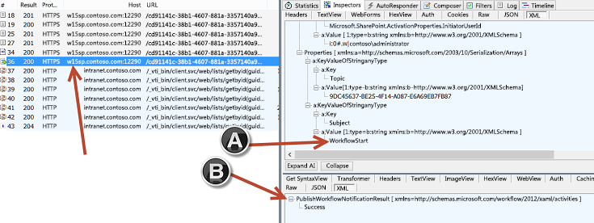
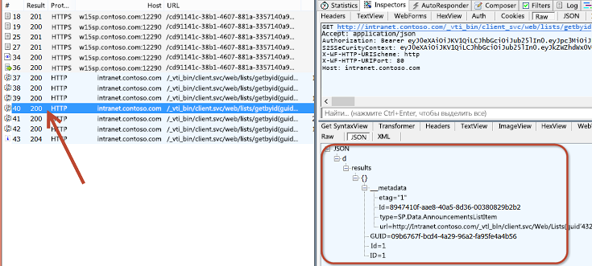
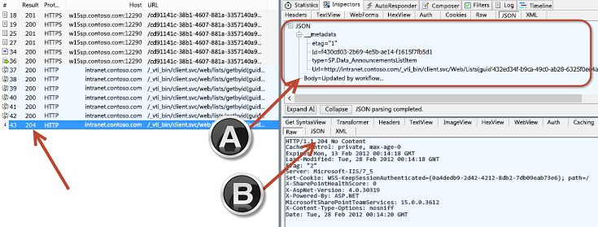

# <a name="debugging-sharepoint-workflows"></a><span data-ttu-id="b7fc7-102">Отладка рабочих процессов SharePoint</span><span class="sxs-lookup"><span data-stu-id="b7fc7-102">Debugging SharePoint workflows</span></span>
<span data-ttu-id="b7fc7-103">В этой статье описываются обработка рабочих процессов SharePoint и управление ими в Workflow Manager 1.0, а также способы отладки.</span><span class="sxs-lookup"><span data-stu-id="b7fc7-103">Demonstrates how SharePoint now relies on Workflow Manager 1.0 for all workflow processing and management, and demonstrates debugging options.</span></span>
 <span data-ttu-id="b7fc7-104">**Автор:** [Эндрю Коннел (Andrew Connell)](http://social.msdn.microsoft.com/profile/andrew%20connell%20%5bmvp%5d/), [www.AndrewConnell.com](http://www.andrewconnell.com)</span><span class="sxs-lookup"><span data-stu-id="b7fc7-104">**Provided by:** [Andrew Connell](http://social.msdn.microsoft.com/profile/andrew%20connell%20%5bmvp%5d/),  [www.AndrewConnell.com](http://www.andrewconnell.com)</span></span>
  
    

<span data-ttu-id="b7fc7-105">В SharePoint корпорация Майкрософт изменила подход к рабочим процессам по сравнению с предыдущими версиями.</span><span class="sxs-lookup"><span data-stu-id="b7fc7-105">Microsoft has taken a different approach to workflows in SharePoint than in previous versions of SharePoint.</span></span> <span data-ttu-id="b7fc7-106">Команда разработчиков рабочих процессов в сотрудничестве с командой разработчиков Azure создала новый продукт под названием Workflow Manager.</span><span class="sxs-lookup"><span data-stu-id="b7fc7-106">The workflow team worked with the Azure team to create a new product called Workflow Manager.</span></span> <span data-ttu-id="b7fc7-107">В Workflow Manager размещаются последняя версия среды выполнения Windows Workflow Foundation и все необходимые службы с высоким уровнем доступности и масштабируемости.</span><span class="sxs-lookup"><span data-stu-id="b7fc7-107">Workflow Manager hosts the latest version of the Windows Workflow Foundation runtime and all the necessary services in an available and scalable way.</span></span> <span data-ttu-id="b7fc7-108">Производительность и масштабируемость обеспечивает служебная шина Microsoft Azure. Этот диспетчер работает абсолютно одинаково в локальном развертывании и облаке, подобно Office 365.</span><span class="sxs-lookup"><span data-stu-id="b7fc7-108">It takes advantage of the Microsoft Azure Service Bus for performance and scalability, and when deployed, it runs exactly the same in an on-premises deployment as in the cloud, similar to Office 365.</span></span> <span data-ttu-id="b7fc7-109">Затем SharePoint подключается и настраивается, чтобы передать выполнение рабочих процессов и все сопутствующие задачи в ферму Workflow Manager.</span><span class="sxs-lookup"><span data-stu-id="b7fc7-109">SharePoint is then connected and configured to hand off all workflow execution and related tasks to the Workflow Manager farm.</span></span>
  
    
    
<span data-ttu-id="b7fc7-110">Для этого изменения архитектуры потребовались некоторые изменения в двух основных средствах разработки рабочих процессов (SharePoint Designer 2013 и Visual Studio 2012), с помощью которых пользователи создавали настраиваемые рабочие процессы.</span><span class="sxs-lookup"><span data-stu-id="b7fc7-110">This change in the architecture required some changes to the two primary workflow authoring tools (SharePoint Designer 2013 and Visual Studio 2012) customers used to create custom workflows.</span></span> <span data-ttu-id="b7fc7-111">Однако способы отладки, используемые разработчиками в SharePoint 2007 и SharePoint 2010, по-прежнему применимы.</span><span class="sxs-lookup"><span data-stu-id="b7fc7-111">However, the debugging techniques employed by developers in SharePoint 2007 and SharePoint 2010 still apply.</span></span> <span data-ttu-id="b7fc7-112">В новой архитектуре рабочие процессы, созданные с помощью SharePoint Designer 2013 или Visual Studio 2012, поддерживают использование Fiddler для отслеживания трафика между SharePoint и Workflow Manager.</span><span class="sxs-lookup"><span data-stu-id="b7fc7-112">The new architecture allows for a new option for workflows created using either SharePoint Designer 2013 or Visual Studio 2012 in that Fiddler can be used to monitor traffic between SharePoint and Workflow Manager.</span></span>
  
    
    

## <a name="sharepoint-workflow-debugging-overview"></a><span data-ttu-id="b7fc7-113">Общие сведения об отладке рабочих процессов SharePoint</span><span class="sxs-lookup"><span data-stu-id="b7fc7-113">SharePoint workflow debugging overview</span></span>

<span data-ttu-id="b7fc7-114">Отладка пользовательских рабочих процессов SharePoint похожа на отладку рабочих процессов предыдущих версий, в том числе SharePoint 2010 и SharePoint 2007.</span><span class="sxs-lookup"><span data-stu-id="b7fc7-114">Debugging custom workflows created for SharePoint resembles previous versions, including SharePoint 2010 and SharePoint 2007.</span></span> <span data-ttu-id="b7fc7-115">Доступные способы отладки зависят от того, какое средство используется для создания рабочего процесса (SharePoint Designer 2013 или Visual Studio 2012), и от типа развертывания SharePoint, например локального или Office 365 (размещаемого).</span><span class="sxs-lookup"><span data-stu-id="b7fc7-115">Some debugging options available will depend on the tool that is used to create the workflow (SharePoint Designer 2013 or Visual Studio 2012) and the kind of SharePoint deployment, such as on-premises or Office 365 (hosted).</span></span>
  
    
    
<span data-ttu-id="b7fc7-116">Разработчики рабочих процессов могут использовать четыре способа отладки:</span><span class="sxs-lookup"><span data-stu-id="b7fc7-116">There are four workflow debugging techniques that can be leveraged by workflow authors:</span></span>
  
    
    

- <span data-ttu-id="b7fc7-117">запись в журнал рабочего процесса;</span><span class="sxs-lookup"><span data-stu-id="b7fc7-117">Logging to the workflow history list</span></span>
    
  
- <span data-ttu-id="b7fc7-118">настройка точек останова;</span><span class="sxs-lookup"><span data-stu-id="b7fc7-118">Setting breakpoints</span></span>
    
  
- <span data-ttu-id="b7fc7-119">отправка сообщений отладки в консоль;</span><span class="sxs-lookup"><span data-stu-id="b7fc7-119">Sending debug messages to the console</span></span>
    
  
- <span data-ttu-id="b7fc7-120">мониторинг трафика между SharePoint и Workflow Manager с помощью Fiddler.</span><span class="sxs-lookup"><span data-stu-id="b7fc7-120">Monitoring traffic between SharePoint and Workflow Manager with Fiddler</span></span>
    
  
<span data-ttu-id="b7fc7-p105">У каждого способа есть свои преимущества и недостатки. Полезно иметь представление о возможностях двух средств разработки рабочих процессов (SharePoint Designer 2013 или Visual Studio 2012), а также типе развертывания рабочих процессов (локальное или в Office 365). В таблице ниже представлена матрица средств разработки, целей развертывания и способов, доступных в каждом сценарии.</span><span class="sxs-lookup"><span data-stu-id="b7fc7-p105">Each option has advantages and disadvantages. It helps to have an understanding of what is possible when using the two workflow authoring tools (SharePoint Designer 2013 or Visual Studio 2012), as well as the type of workflow deployment (on-premises or Office 365). The following table contains a matrix of authoring tools, deployment targets, and the options available in each scenario.</span></span>
  
    
    


||<span data-ttu-id="b7fc7-124">**Локальное развертывание SharePoint**</span><span class="sxs-lookup"><span data-stu-id="b7fc7-124">**SharePoint On-Premises**</span></span>|<span data-ttu-id="b7fc7-125">**SharePoint Online в Office 365**</span><span class="sxs-lookup"><span data-stu-id="b7fc7-125">**Office 365 SharePoint Online**</span></span>|
|:-----|:-----|:-----|
|<span data-ttu-id="b7fc7-126">SharePoint Designer 2013, SharePoint Online</span><span class="sxs-lookup"><span data-stu-id="b7fc7-126">SharePoint Designer 2013, SharePoint Online</span></span>  <br/> | <span data-ttu-id="b7fc7-127">Запись в журнал</span><span class="sxs-lookup"><span data-stu-id="b7fc7-127">Log to history list</span></span> <br/>  <span data-ttu-id="b7fc7-128">Fiddler</span><span class="sxs-lookup"><span data-stu-id="b7fc7-128">Fiddler</span></span> <br/> | <span data-ttu-id="b7fc7-129">Запись в журнал</span><span class="sxs-lookup"><span data-stu-id="b7fc7-129">Log to history list</span></span> <br/> |
|<span data-ttu-id="b7fc7-130">Visual Studio 2012</span><span class="sxs-lookup"><span data-stu-id="b7fc7-130">Visual Studio 2012</span></span>  <br/> | <span data-ttu-id="b7fc7-131">Запись в журнал</span><span class="sxs-lookup"><span data-stu-id="b7fc7-131">Log to history list</span></span> <br/>  <span data-ttu-id="b7fc7-132">Точки останова</span><span class="sxs-lookup"><span data-stu-id="b7fc7-132">Breakpoints</span></span> <br/>  <span data-ttu-id="b7fc7-133">Сообщения отладки в консоли</span><span class="sxs-lookup"><span data-stu-id="b7fc7-133">Console debug messages</span></span> <br/>  <span data-ttu-id="b7fc7-134">Fiddler</span><span class="sxs-lookup"><span data-stu-id="b7fc7-134">Fiddler</span></span> <br/> | <span data-ttu-id="b7fc7-135">Запись в журнал</span><span class="sxs-lookup"><span data-stu-id="b7fc7-135">Log to history list</span></span> <br/>  <span data-ttu-id="b7fc7-136">Точки останова</span><span class="sxs-lookup"><span data-stu-id="b7fc7-136">Breakpoints</span></span> <br/> |
   

## <a name="debugging-with-the-workflow-history-list"></a><span data-ttu-id="b7fc7-137">Отладка с помощью журнала рабочего процесса</span><span class="sxs-lookup"><span data-stu-id="b7fc7-137">Debugging with the workflow history list</span></span>

<span data-ttu-id="b7fc7-p106">Единственный способ отладки, доступный в каждом типе развертывания SharePoint,  запись сообщений в журнал рабочего процесса. Добавить строковое сообщение в список, который указан в сопоставлении рабочего процесса и является контейнером для всех сообщений журнала, можно с помощью действия **Записать в журнал** в SharePoint Designer 2013 или операции **WriteToHistory** в Visual Studio 2012. Эти строки могут быть простыми или составленными путем объединения значений переменных в рабочем процессе.</span><span class="sxs-lookup"><span data-stu-id="b7fc7-p106">The only debugging option that is available in every type of SharePoint deployment is writing log messages to the workflow history list. By using this method, you can use either the **Log to History List** action in SharePoint Designer 2013 or the **WriteToHistory** activity in Visual Studio 2012 to write a string message as a new item to the list, specified in the workflow association, which is the container for all history logging messages. These can be simple strings or constructed by concatenating the contents of variables within the workflow.</span></span>
  
    
    
<span data-ttu-id="b7fc7-p107">Отладка с помощью списка журнала не является идеальным решением, так как пользователям доступны сообщения. Поэтому после сеанса отладки и развертывания рабочего процесса в рабочей среде разработчик должен удалять эти сообщения, что создает дополнительный этап между отладкой и развертыванием. Тем не менее это единственный вариант, доступный в любом сценарии, независимо от средства, которое используется для создания рабочего процесса, и типа развертывания SharePoint.</span><span class="sxs-lookup"><span data-stu-id="b7fc7-p107">Using the history list as a debugging tool is not ideal because users can see the messages. Therefore, when the debugging session is complete and the workflow is used in production, the workflow developer will want to remove these messages, creating an additional step between debugging and deployment. Nonetheless, this is the only option available in any scenario, regardless of which tool is used to create the workflow or which type of SharePoint deployment.</span></span>
  
    
    

## <a name="debugging-using-visual-studio-2012-breakpoints"></a><span data-ttu-id="b7fc7-144">Отладка с помощью точек останова Visual Studio 2012</span><span class="sxs-lookup"><span data-stu-id="b7fc7-144">Debugging using Visual Studio 2012 breakpoints</span></span>

<span data-ttu-id="b7fc7-p108">Еще один способ отладки  использование точек останова. Точки останова доступны только для рабочих процессов, созданных с помощью Visual Studio 2012, так как в SharePoint Designer 2013 невозможно создавать точки останова и подключать отладчик к запущенному процессу. Эти функции доступны в локальных развертываниях SharePoint и размещаемых развертываниях, например Office 365. В этом сценарии можно задать точку останова для операции в рабочем процессе, а затем запустить процесс в режиме отладки.</span><span class="sxs-lookup"><span data-stu-id="b7fc7-p108">Another debugging option is to take advantage of breakpoints. Breakpoints are available only for workflows created using Visual Studio 2012, since SharePoint Designer 2013 has no capability to set breakpoints or to attach a debugger to the running process. These are available in both SharePoint on-premises and hosted deployments such as Office 365. In this scenario, you would set a breakpoint on an activity within the workflow and then start the workflow in debug mode.</span></span>
  
    
    

<span data-ttu-id="b7fc7-149">**Рисунок 1. Запуск рабочего процесса**</span><span class="sxs-lookup"><span data-stu-id="b7fc7-149">**Figure 1. Start the workflow**</span></span>

  
    
    

  
    
    

  
    
    
<span data-ttu-id="b7fc7-p109">Visual Studio развернет рабочий процесс в целевой среде SharePoint и подключит отладчик. Когда рабочий процесс достигает операции, для которой задана точка останова, фокус переключается на Visual Studio, после чего вы можете изучить значения переменных рабочего процесса и поочередно выполнить все операции из Visual Studio 2012, как показано на рисунке ниже.</span><span class="sxs-lookup"><span data-stu-id="b7fc7-p109">Visual Studio will deploy the workflow to the target SharePoint environment and attach a debugger. When the workflow process reaches the activity the breakpoint is set on, Visual Studio regains focus and lets you examine the values of workflow variables and step through each activity from Visual Studio 2012, as shown in the following figure.</span></span>
  
    
    

<span data-ttu-id="b7fc7-153">**Рис. 2. Точка останова рабочего процесса**</span><span class="sxs-lookup"><span data-stu-id="b7fc7-153">**Figure 2. Workflow breakpoint**</span></span>

  
    
    

  
    
    

  
    
    

  
    
    

  
    
    

## <a name="debugging-workflows-using-debug-messages-and-the-test-service-host"></a><span data-ttu-id="b7fc7-156">Отладка рабочих процессов с помощью сообщений отладки и узла тестовой службы</span><span class="sxs-lookup"><span data-stu-id="b7fc7-156">Debugging workflows using debug messages and the test service host</span></span>

<span data-ttu-id="b7fc7-p111">После интеграции SharePoint с Workflow Manager появились два новых способа отладки, доступные при создании рабочих процессов с помощью Visual Studio 2012 и их тестировании в локальном развертывании. Visual Studio 2012 включает операцию **WriteLine**, которая принимает в качестве входного параметра одно строковое сообщение.</span><span class="sxs-lookup"><span data-stu-id="b7fc7-p111">The introduction of Workflow Manager to the SharePoint workflow story introduces two new debugging opportunities available when you are creating custom workflows using Visual Studio 2012 and testing them in an on-premises deployment. Visual Studio 2012 includes a **WriteLine** activity that accepts a single string-based message as an input.</span></span>
  
    
    

<span data-ttu-id="b7fc7-159">**Рис. 3. Операция WriteLine**</span><span class="sxs-lookup"><span data-stu-id="b7fc7-159">**Figure 3. WriteLine activity**</span></span>

  
    
    

  
    
    

  
    
    
<span data-ttu-id="b7fc7-p113">Эта операция записывает сообщение подобно методу **System.Diagnostics.Debug.WriteLine()** в стандартном консольном приложении .NET для Windows. Средство разработки Workflow Manager 1.0 включает служебную программу консоли **Узел тестовой службы**, которую Visual Studio 2012 открывает при запуске нового сеанса отладки и тестировании в локальном развертывании SharePoint. Эта служебная программа, **Microsoft.Workflow.TestServiceHost.exe** в **C:\\Program Files (x86)\\Workflow Manager Tools\\1.0**, подключается к зарегистрированному экземпляру Workflow Manager и отслеживает сообщения, записанные с помощью операции **WriteLine**, как показано на рисунке ниже.</span><span class="sxs-lookup"><span data-stu-id="b7fc7-p113">This activity will write the message that resembles the **System.Diagnostics.Debug.WriteLine()** method in a standard .NET Windows Console Application. The Workflow Manager 1.0 development tool includes a console utility that is named the **Test Service Host** that Visual Studio 2012 will open when a new debugging session is started and when testing with an on-premises SharePoint deployment. This console utility, **Microsoft.Workflow.TestServiceHost.exe** found in **C:\\Program Files (x86)\\Workflow Manager Tools\\1.0**, attaches to the registered Workflow Manager instance and listens for messages written using the **WriteLine** activity, as shown in the following figure.</span></span>
  
    
    

<span data-ttu-id="b7fc7-165">**Рис. 4. Сообщения для операции WriteLine**</span><span class="sxs-lookup"><span data-stu-id="b7fc7-165">**Figure 4. Messages for WriteLine activity**</span></span>

  
    
    

  
    
    

  
    
    
<span data-ttu-id="b7fc7-p115">Эти сообщения похожи на комментарии к коду и сообщения отладки в консольном приложении. В отличие от записи в журнал рабочего процесса, эти сообщения не требуется удалять перед развертыванием в рабочей среде. Если служебная программа **Узел тестовой службы** не подключена к Workflow Manager, эти сообщения безопасны.</span><span class="sxs-lookup"><span data-stu-id="b7fc7-p115">These messages resemble code comments or debug messages in a console application. Unlike writing to the workflow history list, you don't need to remove these before deploying the workflow to production. Unless the **Test Service Host** utility is connected to Workflow Manager, the messages are harmless.</span></span>
  
    
    
<span data-ttu-id="b7fc7-p116">Этот способ отладки недоступен для рабочих процессов, созданных с помощью SharePoint Designer 2013, так как ни одно действие не соответствует операции **WriteLine**. К сожалению, этот способ отладки доступен только в локальных установках SharePoint, так как порт, используемый служебной программой "Узел тестовой службы" обычно недоступен за пределами локальной сети. Это также касается Office 365. Для подключения к Workflow Manager SharePoint использует те же порты, что и узел тестовой службы. Эти порты доступны только в доверенной сети. Однако это не означает, что вам необходимо изменять их рабочие процессы, что удалить операции **WriteLine** перед развертыванием Office 365. Их можно оставить в рабочем процессе, так как они не отображаются, если **узел тестовой службы** не подключен к Workflow Manager.</span><span class="sxs-lookup"><span data-stu-id="b7fc7-p116">This debugging option is not available for workflows created using SharePoint Designer 2013, because there is no action that maps to the **WriteLine** activity. Unfortunately, this debugging option is available only to SharePoint on-premises installations, since the port used by the Test Service Host utility is typically not publically accessible outside an on-premises network. This is also true for Office 365. The ports SharePoint uses to connect to Workflow Manager are the same ones used by the Test Service Host, and those are only accessible within the trusted network. However, this does not mean that you need to change their workflows to remove any **WriteLine** activities before deployment to Office 365. These activities can be left in the workflow as they are not seen unless the **Test Service Host** is connected to Workflow Manager.</span></span>
  
    
    

## <a name="debugging-using-fiddler-to-monitor-http-traffic"></a><span data-ttu-id="b7fc7-177">Отладка с помощью Fiddler для отслеживания трафика HTTP</span><span class="sxs-lookup"><span data-stu-id="b7fc7-177">Debugging using Fiddler to monitor HTTP traffic</span></span>

<span data-ttu-id="b7fc7-178">Последний способ отладки рабочих процессов SharePoint появился в результате изменения способа обработки рабочих процессов в текущей платформе.</span><span class="sxs-lookup"><span data-stu-id="b7fc7-178">The last debugging option for SharePoint workflows is a new addition for workflow developers due to the change in how workflows are handled in the current platform.</span></span> <span data-ttu-id="b7fc7-179">Как вы уже знаете, в SharePoint обработка всех рабочих процессов передается внешнему продукту — Workflow Manager 1.0.</span><span class="sxs-lookup"><span data-stu-id="b7fc7-179">Recall that in SharePoint, all workflow processing is handed off to an external product, Workflow Manager 1.0.</span></span> <span data-ttu-id="b7fc7-180">Если рабочему процессу необходимо взаимодействовать с SharePoint, например для обновления текущего состояния рабочего процесса, сбора данных элементов или пользователей на сайте SharePoint или работы с задачами, Workflow Manager использует REST API SharePoint для выполнения этих операций.</span><span class="sxs-lookup"><span data-stu-id="b7fc7-180">When a workflow has to communicate with SharePoint, such as updating the current state of the workflow, collecting data from items or users in a SharePoint site, or when working with tasks, Workflow Manager's activities leverage the SharePoint REST API to perform these operations.</span></span> <span data-ttu-id="b7fc7-181">SharePoint взаимодействует с Workflow Manager с помощью клиентской библиотеки, которая служит прокси-сервером для служб REST, предоставляемых программой Workflow Manager.</span><span class="sxs-lookup"><span data-stu-id="b7fc7-181">SharePoint communicates with Workflow Manager using a client library that serves as a proxy to REST services exposed by Workflow Manager.</span></span> <span data-ttu-id="b7fc7-182">Как SharePoint, так и Workflow Manager взаимодействуют друг с другом с помощью стандартных протоколов HTTP и HTTPS.</span><span class="sxs-lookup"><span data-stu-id="b7fc7-182">Both SharePoint and Workflow Manager communicate with one another using the standard HTTP and HTTPS protocols.</span></span>
  
    
    
<span data-ttu-id="b7fc7-p118">В этой архитектуре представлен новый способ отладки для разработчиков рабочих процессов. С помощью Fiddler, прокси-отладчика для HTTP, вы можете отслеживать все запросы и соответствующие ответы между двумя продуктами. Кроме того, с помощью Fiddler можно отслеживать и проверять все пользовательские службы, вызываемые пользовательскими рабочими процессами с помощью операции **HttpSend** в Visual Studio 2012 или соответствующего действия **Call HTTP Web Service** в SharePoint Designer 2013. Эта модель отладки также доступна независимо от средства, которое используется для создания рабочих процессов (SharePoint Designer 2013 или Visual Studio 2012).</span><span class="sxs-lookup"><span data-stu-id="b7fc7-p118">This architecture yields a new debugging option for workflow authors. By using the HTTP debugging proxy tool Fiddler, you can monitor every request and corresponding response between the two products. In addition, any custom services called by the custom workflows using the **HttpSend** activity in Visual Studio 2012 or corresponding **Call HTTP Web Service** action in SharePoint Designer 2013 can also be monitored and inspected by Fiddler. This debugging model is also available, regardless of the tool that you use to create custom workflows (SharePoint Designer 2013 or Visual Studio 2012).</span></span>
  
    
    
<span data-ttu-id="b7fc7-187">Этот способ недоступен только при тестировании рабочих процессов с помощью развертывания SharePoint в Office 365.</span><span class="sxs-lookup"><span data-stu-id="b7fc7-187">The only time this option is not available is when you are testing workflows using an Office 365 deployment of SharePoint.</span></span> <span data-ttu-id="b7fc7-188">Так как весь трафик между SharePoint и Workflow Manager находится на стороне сервера, невозможно подключиться к одному из серверов в Office 365 и запустить Fiddler из консоли.</span><span class="sxs-lookup"><span data-stu-id="b7fc7-188">Since all traffic between SharePoint and Workflow Manager occurs server-side, it is not possible to connect to one of the servers in Office 365 and start Fiddler from the console.</span></span>
  
    
    
<span data-ttu-id="b7fc7-189">При использовании этого нового способа вам доступны все данные об обработчике рабочих процессов, что было невозможно при разработке рабочих процессов в предыдущих версиях SharePoint.</span><span class="sxs-lookup"><span data-stu-id="b7fc7-189">This new option gives you transparency and insight into the workflow engine that was not possible when developing workflows in previous versions of SharePoint before SharePoint.</span></span> 
  
    
    
<span data-ttu-id="b7fc7-190">Например, при вызове веб-службы вам доступны необработанные отклики от Workflow Manager или SharePoint.</span><span class="sxs-lookup"><span data-stu-id="b7fc7-190">For example, you can see the raw responses coming back from Workflow Manager or SharePoint in a web service call.</span></span> <span data-ttu-id="b7fc7-191">В некоторых случаях Workflow Manager может отправить в отклике определенное сообщение об ошибке.</span><span class="sxs-lookup"><span data-stu-id="b7fc7-191">At times Workflow Manager may respond with a specific error message.</span></span> <span data-ttu-id="b7fc7-192">SharePoint включает понятные сообщения об ошибках, но они могут быть недостаточно подробными.</span><span class="sxs-lookup"><span data-stu-id="b7fc7-192">SharePoint includes user-friendly error messages but these may not be sufficiently specific.</span></span> <span data-ttu-id="b7fc7-193">С помощью Fiddler вы можете просмотреть подробное сообщение об ошибке, чтобы устранить проблему.</span><span class="sxs-lookup"><span data-stu-id="b7fc7-193">Using Fiddler, you can see the exact error message returned to help troubleshoot the issue.</span></span> 
  
    
    
<span data-ttu-id="b7fc7-p121">Кроме того, вы можете просмотреть ответ, полученный после успешного вызова веб-службы. При работе с веб-службами в рабочих процессах (независимо от средства разработки) необходимо знать точное имя свойства (и путь, если это комплексный ответ) для значения, включенного в ответ. С помощью Fiddler вы можете просмотреть полные данные об ответе.</span><span class="sxs-lookup"><span data-stu-id="b7fc7-p121">Another use case is examining the response from a successful web service call. When working with web services in workflows, regardless of the authoring tool, that you need to know the exact property name (and path if it is a complex response) for a value that is contained in a response. By using Fiddler, you can see the complete response data.</span></span>
  
    
    

### <a name="understanding-sharepoint-and-workflow-manager-for-debugging-with-fiddler"></a><span data-ttu-id="b7fc7-197">Общие сведения о SharePoint и диспетчере Workflow Manager для отладки с помощью Fiddler</span><span class="sxs-lookup"><span data-stu-id="b7fc7-197">Understanding SharePoint and Workflow Manager for debugging with Fiddler</span></span>

<span data-ttu-id="b7fc7-p122">Перед отладкой рабочих процессов в SharePoint и Workflow Manager 1.0 с помощью Fiddler необходимо выполнить некоторые действия по настройке в среде разработки. Прежде чем выполнять эти действия, полезно получить представление о принципе работы Fiddler и особенностях рабочих процессов в SharePoint.</span><span class="sxs-lookup"><span data-stu-id="b7fc7-p122">To debug workflows in SharePoint and Workflow Manager 1.0 with Fiddler, some configuration and setup steps must be performed in a developer environment before debugging. Before completing the steps, it helps to have an understanding of how Fiddler works and how workflows work in SharePoint.</span></span>
  
    
    

#### <a name="fiddler-can-only-inspect-traffic-from-the-local-server"></a><span data-ttu-id="b7fc7-200">Fiddler может проверять только трафик с локального сервера</span><span class="sxs-lookup"><span data-stu-id="b7fc7-200">Fiddler can only inspect traffic from the local server</span></span>

<span data-ttu-id="b7fc7-201">Fiddler может перехватывать и проверять только запросы с локального сервера, на котором он запущен.</span><span class="sxs-lookup"><span data-stu-id="b7fc7-201">The only traffic Fiddler can intercept and inspect are requests originating from the local server where Fiddler was started.</span></span> <span data-ttu-id="b7fc7-202">Это может создавать сложности при использовании Fiddler в качестве отладчика рабочих процессов SharePoint.</span><span class="sxs-lookup"><span data-stu-id="b7fc7-202">This can present a challenge when Fiddler is used as a debugging tool for SharePoint workflows.</span></span> 
  
    
    
<span data-ttu-id="b7fc7-203">Если SharePoint и Workflow Manager 1.0 установлены на разных серверах, а Fiddler запущен на сервере SharePoint Server, то в Fiddler будет отображаться только трафик из источника запроса в SharePoint.</span><span class="sxs-lookup"><span data-stu-id="b7fc7-203">If SharePoint and Workflow Manager 1.0 are installed on different servers and if Fiddler is started from SharePoint Server, the only traffic that Fiddler will display is the traffic where the request originated from SharePoint.</span></span> <span data-ttu-id="b7fc7-204">Исходящий трафик из Workflow Manager 1.0, даже если он предназначен для SharePoint Server, не будет перехватываться.</span><span class="sxs-lookup"><span data-stu-id="b7fc7-204">None of the traffic originating from Workflow Manager 1.0, even if it is targeted to the SharePoint Server, will be intercepted.</span></span>
  
    
    
<span data-ttu-id="b7fc7-205">Таким образом, отладка рабочих процессов становится проще, если SharePoint и Workflow Manager 1.0 установлены на одном сервере.</span><span class="sxs-lookup"><span data-stu-id="b7fc7-205">Therefore, when developing workflows, it is easier to debug them if both SharePoint and Workflow Manager 1.0 are installed on the same server.</span></span> <span data-ttu-id="b7fc7-206">Обратите внимание, что это не обязательно. Вы можете запускать Fiddler на серверах SharePoint Server и Workflow Manager, но отслеживать два экземпляра одного рабочего процесса на двух серверах будет сложнее.</span><span class="sxs-lookup"><span data-stu-id="b7fc7-206">Note that this is not a requirement; you can start Fiddler on both the SharePoint Server and Workflow Manager servers, although it is more complex to monitor two instances on two servers for the same workflow process.</span></span>
  
    
    

#### <a name="fiddler-can-only-inspect-traffic-from-the-current-logged-on-user"></a><span data-ttu-id="b7fc7-207">Fiddler может проверять только трафик от текущего пользователя</span><span class="sxs-lookup"><span data-stu-id="b7fc7-207">Fiddler can only inspect traffic from the current logged-on user</span></span>

 <span data-ttu-id="b7fc7-p126">Fiddler может перехватывать и проверять только трафик от текущего пользователя. Чтобы просмотреть трафик из SharePoint, необходимо войти в SharePoint Server с помощью учетной записи Windows, настроенной в качестве удостоверения пула приложений, в котором размещается веб-приложение для сайта SharePoint, который запускает рабочий процесс.</span><span class="sxs-lookup"><span data-stu-id="b7fc7-p126">Fiddler can only intercept and inspect traffic from the current logged-on user. To view traffic that originated from SharePoint, you must log on to SharePoint Server using the Windows account that is configured as the identity of the application pool that hosts the web application for the SharePoint site initiating the workflow.</span></span>
  
    
    
<span data-ttu-id="b7fc7-p127">Это также касается Workflow Manager. Чтобы перехватывать и проверять трафик из Workflow Manager, необходимо войти на сервер с помощью удостоверения Windows, настроенного во время подготовки фермы Workflow Manager в качестве учетной записи службы для Workflow Manager.</span><span class="sxs-lookup"><span data-stu-id="b7fc7-p127">The same is true with Workflow Manager. To intercept and inspect traffic that originates from Workflow Manager, you must log on to the server using the Windows identity configured during the provisioning of the Workflow Manager farm as the service account for Workflow Manager.</span></span>
  
    
    
<span data-ttu-id="b7fc7-212">Отладка рабочих процессов с помощью Fiddler становится еще проще, если Workflow Manager и SharePoint не только установлены и настроены на одном сервере, но и используют одно удостоверение Windows в качестве учетной записи службы.</span><span class="sxs-lookup"><span data-stu-id="b7fc7-212">When using Fiddler to debug workflows, it is easier to debug them if not only both Workflow Manager and SharePoint are installed and configured on the same server, but they also use the same Windows identity as the service account.</span></span> <span data-ttu-id="b7fc7-213">В этом случае Fiddler сможет перехватывать и проверять весь трафик из Workflow Manager и SharePoint.</span><span class="sxs-lookup"><span data-stu-id="b7fc7-213">All traffic from both Workflow Manager and SharePoint can then be intercepted and inspected by Fiddler.</span></span>
  
    
    

#### <a name="sharepoint-must-trust-fiddlers-certificate"></a><span data-ttu-id="b7fc7-214">SharePoint должен доверять сертификату Fiddler</span><span class="sxs-lookup"><span data-stu-id="b7fc7-214">SharePoint must trust Fiddler's certificate</span></span>

<span data-ttu-id="b7fc7-215">Чтобы использовать Fiddler для отладки рабочих процессов SharePoint, необходимо понимать, как обрабатывается зашифрованный трафик.</span><span class="sxs-lookup"><span data-stu-id="b7fc7-215">Before using Fiddler for debugging SharePoint workflows, you need to understand how encrypted traffic is handled.</span></span> <span data-ttu-id="b7fc7-216">Зашифрованный трафик по протоколу HTTP, также известный как HTTPS, реализуется путем шифрования данных с помощью закрытого ключа сертификата и отправки их получателю.</span><span class="sxs-lookup"><span data-stu-id="b7fc7-216">Encrypted traffic over HTTP, known as HTTPS, is implemented by using a certificate's private key to encrypt some data and then send it to another recipient.</span></span> <span data-ttu-id="b7fc7-217">У получателя есть открытый ключ сертификата, связанный с закрытым ключом.</span><span class="sxs-lookup"><span data-stu-id="b7fc7-217">The recipient has the certificate's public key that is paired with the private key.</span></span> <span data-ttu-id="b7fc7-218">Получив запрос, он может проверить отправителя, так как подпись зашифрованного содержимого совпадает с открытым ключом, только если оно было зашифровано с помощью закрытого ключа сертификата.</span><span class="sxs-lookup"><span data-stu-id="b7fc7-218">When a request is received by the recipient, the recipient can validate that the request came from the sender because the encrypted content's signature matches the public key, which can only be true if it was encrypted with the certificate's private key.</span></span>
  
    
    
<span data-ttu-id="b7fc7-219">Fiddler может перехватывать трафик HTTPS и расшифровывать его, представляя в понятном для пользователя формате.</span><span class="sxs-lookup"><span data-stu-id="b7fc7-219">Fiddler can intercept HTTPS traffic and be configured to decrypt it so it is in a human-readable format for inspection in the tool.</span></span> <span data-ttu-id="b7fc7-220">После отображения запроса Fiddler использует собственный сертификат для повторного шифрования трафика и его отправки получателю.</span><span class="sxs-lookup"><span data-stu-id="b7fc7-220">After displaying the request, Fiddler then uses its own certificate to re-encrypt the traffic and send it to the intended recipient.</span></span> <span data-ttu-id="b7fc7-221">Тем не менее это может вызвать проблему, так как теперь получатель получил исходный отклик, не защищенный с помощью сертификата исходного отправителя.</span><span class="sxs-lookup"><span data-stu-id="b7fc7-221">This can cause an issue, though, because now the recipient received the original response but it is not secured using the certificate from the original sender.</span></span> <span data-ttu-id="b7fc7-222">Это может создавать проблемы при отладке рабочих процессов SharePoint, так как SharePoint не доверяет сертификату Fiddler.</span><span class="sxs-lookup"><span data-stu-id="b7fc7-222">This can be an issue when debugging SharePoint workflows because Fiddler's certificate is not trusted by SharePoint.</span></span> <span data-ttu-id="b7fc7-223">Следовательно, чтобы использовать Fiddler для перехвата и проверки трафика HTTPS между SharePoint и Workflow Manager, среда SharePoint должна доверять сертификату Fiddler.</span><span class="sxs-lookup"><span data-stu-id="b7fc7-223">Therefore, in order to use Fiddler to intercept and inspect HTTPS traffic between SharePoint and Workflow Manager, the Fiddler certificate must be trusted by SharePoint.</span></span>
  
    
    

### <a name="configure-sharepoint-and-workflow-manager-10-for-workflow-debugging-with-fiddler"></a><span data-ttu-id="b7fc7-224">Настройка SharePoint и Workflow Manager 1.0 для отладки рабочих процессов с помощью Fiddler</span><span class="sxs-lookup"><span data-stu-id="b7fc7-224">Configure SharePoint and Workflow Manager 1.0 for workflow debugging with Fiddler</span></span>

<span data-ttu-id="b7fc7-225">В следующих разделах показано, как настроить Fiddler и SharePoint для отладки рабочих процессов.</span><span class="sxs-lookup"><span data-stu-id="b7fc7-225">The following sections explain how to configure Fiddler and SharePoint for workflow debugging.</span></span>
  
    
    

#### <a name="configure-the-net-framework-default-proxy-configuration"></a><span data-ttu-id="b7fc7-226">Настройка конфигурации прокси-сервера .NET Framework по умолчанию</span><span class="sxs-lookup"><span data-stu-id="b7fc7-226">Configure the .NET Framework default proxy configuration</span></span>

<span data-ttu-id="b7fc7-227">Для начала необходимо определить конфигурацию прокси-сервера по умолчанию для .NET Framework.</span><span class="sxs-lookup"><span data-stu-id="b7fc7-227">The first step is to first define the default proxy configuration for .NET Framework.</span></span> <span data-ttu-id="b7fc7-228">Эти изменения позволят Fiddler перехватывать трафик как из SharePoint, так и из Workflow Manager.</span><span class="sxs-lookup"><span data-stu-id="b7fc7-228">These changes will allow Fiddler to intercept the traffic coming from both SharePoint and the Workflow Manager.</span></span> <span data-ttu-id="b7fc7-229">Откройте файл **machine.config** в каждом из следующих расположений:</span><span class="sxs-lookup"><span data-stu-id="b7fc7-229">Open the **machine.config** file in both of the following locations:</span></span>
  
    
    

-  `%systemdrive%\\Windows\\Microsoft.NET\\Framework\\v4.0.30319\\Config\\machine.config`
    
  
-  `%systemdrive%\\Windows\\Microsoft.NET\\Framework64\\v4.0.30319\\Config\\machine.config`
    
  
<span data-ttu-id="b7fc7-230">Затем добавьте следующую разметку в конце каждого файла, непосредственно перед закрывающим элементом **<configuration>**:</span><span class="sxs-lookup"><span data-stu-id="b7fc7-230">Next, add the following markup to the bottom of each file, just before the closing **<configuration>** element:</span></span>
  
    
    


```xml

<system.net>
  <defaultProxy enabled="true">
    <proxy bypassonlocal="false" usesystemdefault="true" />
  </defaultProxy>
</system.net>
```

<span data-ttu-id="b7fc7-231">Сохраните изменения и закройте файлы.</span><span class="sxs-lookup"><span data-stu-id="b7fc7-231">Save the changes and close the files.</span></span>
  
    
    

#### <a name="configure-fiddler-to-intercept-and-inspect-https-traffic"></a><span data-ttu-id="b7fc7-232">Настройка перехвата и проверки трафика HTTPS в Fiddler</span><span class="sxs-lookup"><span data-stu-id="b7fc7-232">Configure Fiddler to intercept and inspect HTTPS traffic</span></span>

<span data-ttu-id="b7fc7-233">Далее необходимо настроить перехват зашифрованного трафика и его расшифровку для настройки.</span><span class="sxs-lookup"><span data-stu-id="b7fc7-233">The next step is to configure Fiddler to intercept encrypted traffic and decrypt it for configuration.</span></span>
  
    
    

1. <span data-ttu-id="b7fc7-234">Запустите Fiddler.</span><span class="sxs-lookup"><span data-stu-id="b7fc7-234">Start Fiddler.</span></span>
    
  
2. <span data-ttu-id="b7fc7-235">Если используется локальный файл HOSTS, убедитесь, что записи включены в Fiddler, выбрав в меню команду **Tools -> HOSTS** (Сервис -> УЗЛЫ).</span><span class="sxs-lookup"><span data-stu-id="b7fc7-235">If you are using the local HOSTS file, ensure that the entries are included in Fiddler by selecting the **Tools -> HOSTS** menu option.</span></span>
    
  
3. <span data-ttu-id="b7fc7-236">Установите флажок **Enable remapping of requests for one host to a different host or IP, overriding DNS** (Разрешить переназначение запросов одного узла запросам другого узла или IP-адреса в обход DNS).</span><span class="sxs-lookup"><span data-stu-id="b7fc7-236">Check the **Enable remapping of requests for one host to a different host or IP, overriding DNS**,</span></span>
    
  
4. <span data-ttu-id="b7fc7-237">Нажмите ссылку **Import Windows Hosts File** (Импортировать файл узлов Windows), а затем кнопку **Save** (Сохранить).</span><span class="sxs-lookup"><span data-stu-id="b7fc7-237">Click the **Import Windows Hosts File**, and then click the **Save** button.</span></span>
    
  

<span data-ttu-id="b7fc7-238">**Рис. 5. Переназначение узла**</span><span class="sxs-lookup"><span data-stu-id="b7fc7-238">**Figure 5. Host Remapping**</span></span>

  
    
    

  
    
    

  
    
    
<span data-ttu-id="b7fc7-241">Затем настройте подключение Fiddler.</span><span class="sxs-lookup"><span data-stu-id="b7fc7-241">Next, configure Fiddler's connection options.</span></span> 
  
    
    

  
    
    

1. <span data-ttu-id="b7fc7-242">Выберите в меню команду **Tools -> Fiddler Options** (Сервис -> Параметры Fiddler).</span><span class="sxs-lookup"><span data-stu-id="b7fc7-242">Select the **Tools -> Fiddler Options** menu option.</span></span>
    
  
2. <span data-ttu-id="b7fc7-243">Откройте вкладку **Connections** (Подключения).</span><span class="sxs-lookup"><span data-stu-id="b7fc7-243">Click the **Connections** tab.</span></span>
    
  
3. <span data-ttu-id="b7fc7-244">Снимите флажок **Chain to upstream gateway proxy** (Подключаться к вышестоящему прокси-серверу шлюза).</span><span class="sxs-lookup"><span data-stu-id="b7fc7-244">Clear the **Chain to upstream gateway proxy** selection.</span></span>
    
  
4. <span data-ttu-id="b7fc7-245">Установите флажки **Act as system proxy on startup** (Выполнять роль системного прокси-сервера при запуске) и **Monitor all connections** (Отслеживать все подключения), как показано на рисунке ниже.</span><span class="sxs-lookup"><span data-stu-id="b7fc7-245">Select the **Act as system proxy on startup** and **Monitor all connections** options, as shown in the following figure.</span></span>
    
   <span data-ttu-id="b7fc7-246">**Рис. 6. Параметры подключения Fiddler.**</span><span class="sxs-lookup"><span data-stu-id="b7fc7-246">**Figure 6. Fiddler connection options.**</span></span>

  

  
  

  

  
5. <span data-ttu-id="b7fc7-249">В диалоговом окне **Fiddler Options** (Параметры Fiddler) откройте вкладку **HTTPS**.</span><span class="sxs-lookup"><span data-stu-id="b7fc7-249">Select the **HTTPS** tab in the **Fiddler Options** dialog.</span></span>
    
  
6. <span data-ttu-id="b7fc7-250">Установите флажок **Capture HTTPS CONNECTs** (Захватывать подключения HTTPS).</span><span class="sxs-lookup"><span data-stu-id="b7fc7-250">Check the **Capture HTTPS CONNECTs**.</span></span>
    
  
7. <span data-ttu-id="b7fc7-251">Установите флажок **Decrypt HTTPS Traffic** (Расшифровывать трафик HTTPS).</span><span class="sxs-lookup"><span data-stu-id="b7fc7-251">Select **Decrypt HTTPS Traffic**.</span></span>
    
  
8. <span data-ttu-id="b7fc7-252">Выберите пункт **??? from all processes** (От всех процессов).</span><span class="sxs-lookup"><span data-stu-id="b7fc7-252">Select **??? from all processes**.</span></span>
    
  
9. <span data-ttu-id="b7fc7-253">Установите флажок **Ignore server certificate errors** (Игнорировать ошибки сертификатов).</span><span class="sxs-lookup"><span data-stu-id="b7fc7-253">Check **Ignore server certificate errors**.</span></span>
    
  
10. <span data-ttu-id="b7fc7-254">Нажмите кнопку **Export Root Certificate to Desktop** (Экспортировать корневой сертификат на рабочий стол).</span><span class="sxs-lookup"><span data-stu-id="b7fc7-254">Click the **Export Root Certificate to Desktop** button.</span></span>
    
  
11. <span data-ttu-id="b7fc7-255">Когда появится предупреждение, нажмите кнопку **Yes** (Да), чтобы **доверять корневому сертификату Fiddler**.</span><span class="sxs-lookup"><span data-stu-id="b7fc7-255">When prompted with a warning, click **Yes** to **Trust the Fiddler Root certificate**.</span></span>
    
  
<span data-ttu-id="b7fc7-256">Вы настроили доверие Windows (не SharePoint) к сертификату.</span><span class="sxs-lookup"><span data-stu-id="b7fc7-256">This process will configure Windows to trust the certificate, although SharePoint does not trust it yet.</span></span>
  
    
    

<span data-ttu-id="b7fc7-257">**Рис. 7. Вкладка "HTTPS"**</span><span class="sxs-lookup"><span data-stu-id="b7fc7-257">**Figure 7. HTTPS tab**</span></span>

  
    
    

  
    
    

  
> [!NOTE]
> <span data-ttu-id="b7fc7-260">Если появится предупреждение системы безопасности с указанием не доверять сертификату Fiddler, нажмите кнопку **Yes** (Да), чтобы продолжить установку сертификата.</span><span class="sxs-lookup"><span data-stu-id="b7fc7-260">**Note:** If a security WRning appears with a message instructing not to trust the Fiddler certificate, click Yes to continue installing the certificate.</span></span>
  
    
    

#### <a name="configure-sharepoint-to-trust-the-certificate"></a><span data-ttu-id="b7fc7-261">Настройка SharePoint на доверие сертификату</span><span class="sxs-lookup"><span data-stu-id="b7fc7-261">Configure SharePoint to trust the certificate</span></span>

<span data-ttu-id="b7fc7-262">Вам осталось лишь настроить доверие SharePoint к сертификату Fiddler, экспортированному на предыдущем этапе.</span><span class="sxs-lookup"><span data-stu-id="b7fc7-262">The last step is to configure SharePoint to trust the Fiddler certificate that was exported in the previous step.</span></span> 
  
    
    

1. <span data-ttu-id="b7fc7-263">Войдите от имени администратора фермы SharePoint.</span><span class="sxs-lookup"><span data-stu-id="b7fc7-263">Log on as a SharePoint farm administrator.</span></span>
    
  
2. <span data-ttu-id="b7fc7-264">Запустите командную консоль SharePoint.</span><span class="sxs-lookup"><span data-stu-id="b7fc7-264">Start the SharePoint Management Shell.</span></span>
    
  
3. <span data-ttu-id="b7fc7-265">Загрузите оснастку SharePoint.</span><span class="sxs-lookup"><span data-stu-id="b7fc7-265">Load the SharePoint Snap-In.</span></span>
    
```powershell
  
PS C:\\> Add-PSSnapIn Microsoft.SharePoint.PowerShell
```

4. <span data-ttu-id="b7fc7-266">Установите сертификат Fiddler с помощью служебной программы.</span><span class="sxs-lookup"><span data-stu-id="b7fc7-266">Use the certificate utility to install the Fiddler certificate.</span></span>
    
```powershell
  PS C:\\> $fidderCertificatePath = [full path to exported FiddlerRoot.cer certificate file]
PS C:\\> certutil.exe -addstore -enterprise -f -v root $fidderCertificatePath
PS C:\\> $fiddlerCertificate = Get-PfxCertificate -FilePath $fidderCertificatePath
PS C:\\> New-SPTrustedRootAuthority -Name "Fiddler" -Certificate $fiddlerCertificate

```

5. <span data-ttu-id="b7fc7-267">Запустите команду IISRESET, чтобы убедиться, что состояние доверия SharePoint к сертификату изменилось.</span><span class="sxs-lookup"><span data-stu-id="b7fc7-267">Run IISRESET to make sure that SharePoint picks up the certificate trust change.</span></span>
    
  

### <a name="walkthrough-debugging-a-sharepoint-workflow-with-fiddler"></a><span data-ttu-id="b7fc7-268">Пошаговое руководство. Отладка рабочего процесса SharePoint с помощью Fiddler</span><span class="sxs-lookup"><span data-stu-id="b7fc7-268">Walkthrough: Debugging a SharePoint workflow with Fiddler</span></span>

<span data-ttu-id="b7fc7-269">В этом простом пошаговом руководстве показано, как использовать Fiddler для отладки рабочего процесса SharePoint, созданного с помощью Visual Studio 2012.</span><span class="sxs-lookup"><span data-stu-id="b7fc7-269">This simple walkthrough demonstrates using Fiddler to debug a SharePoint workflow authored using Visual Studio 2012.</span></span> <span data-ttu-id="b7fc7-270">При запуске рабочий процесс получает идентификатор пользователя из поля настраиваемого списка.</span><span class="sxs-lookup"><span data-stu-id="b7fc7-270">When the workflow starts, it retrieves a customer ID from a field in a custom list.</span></span> <span data-ttu-id="b7fc7-271">Запрос с этим идентификатором отправляется в общедоступную службу для получения дополнительных сведений о пользователе.</span><span class="sxs-lookup"><span data-stu-id="b7fc7-271">This customer ID is used to query a publically accessible service to retrieve additional details about the customer.</span></span> <span data-ttu-id="b7fc7-272">Затем эти значения используются для обновления исходного элемента списка.</span><span class="sxs-lookup"><span data-stu-id="b7fc7-272">It then uses these values to update the original list item.</span></span> <span data-ttu-id="b7fc7-273">Этот рабочий процесс можно найти в следующем примере кода на сайте MSDN: [Рабочий процесс SharePoint: вызов внешней веб-службы](http://code.msdn.microsoft.com/officeapps/SharePoint-workflow-48ea87d4.aspx).</span><span class="sxs-lookup"><span data-stu-id="b7fc7-273">The workflow can be found in the following MSDN code sample:  [SharePoint Workflow: Call an External Web Service](http://code.msdn.microsoft.com/officeapps/SharePoint-workflow-48ea87d4.aspx).</span></span>
  
    
    
<span data-ttu-id="b7fc7-274">Ниже приведены условия использования этого пошагового руководства.</span><span class="sxs-lookup"><span data-stu-id="b7fc7-274">This walkthrough has the following prerequisites:</span></span>
  
    
    

- <span data-ttu-id="b7fc7-275">SharePoint и Workflow Manager 1.0 установлены на одном сервере.</span><span class="sxs-lookup"><span data-stu-id="b7fc7-275">SharePoint and Workflow Manager 1.0 are installed on the same server.</span></span>
    
  
- <span data-ttu-id="b7fc7-276">Удостоверение Windows **CONTOSO\\SP_Content** настроено для удостоверения пула приложений, в котором размещается веб-приложение, обслуживающее сайт SharePoint, который запускает рабочий процесс.</span><span class="sxs-lookup"><span data-stu-id="b7fc7-276">The Windows identity **CONTOSO\\SP_Content** is configured for the application pool identity that hosts the web application serving the SharePoint site that starts the workflow.</span></span>
    
  
- <span data-ttu-id="b7fc7-277">Для запуска рабочего процесса используется сайт SharePoint **http://intranet.contoso.com**.</span><span class="sxs-lookup"><span data-stu-id="b7fc7-277">The SharePoint site used to start the workflow is **http://intranet.contoso.com**</span></span>
    
  
- <span data-ttu-id="b7fc7-278">Конечная точка фермы Workflow Manager 1.0 — **w15sp.contoso.com**.</span><span class="sxs-lookup"><span data-stu-id="b7fc7-278">The Workflow Manager 1.0 farm endpoint is **w15sp.contoso.com**.</span></span>
    
  
- <span data-ttu-id="b7fc7-279">В SharePoint и Workflow Manager 1.0 разрешена авторизация OAuth через HTTP.</span><span class="sxs-lookup"><span data-stu-id="b7fc7-279">SharePoint and Workflow Manager 1.0 are configured to allow OAuth over HTTP.</span></span>
    
    > <span data-ttu-id="b7fc7-280">**Внимание!** Она никогда не используется на рабочем сервере (только для тестирования и отладки).</span><span class="sxs-lookup"><span data-stu-id="b7fc7-280">**Caution:** This should never be done on the production server, but only for testing and debugging.</span></span> 

1. <span data-ttu-id="b7fc7-281">Войдите на сервер, на котором установлены Workflow Manager и SharePoint с удостоверением Windows, настроенным в качестве учетной записи фермы Workflow Manager 1.0 и удостоверения пула приложений SharePoint.</span><span class="sxs-lookup"><span data-stu-id="b7fc7-281">Log on to the server where Workflow Manager and SharePoint are installed with the Windows identity configured as the Workflow Manager 1.0 farm account and SharePoint application pool identity.</span></span>
    
  
2. <span data-ttu-id="b7fc7-p136">Запустите Fiddler. Теперь он будет перехватывать трафик от текущего пользователя, но он может пропускать уже запущенные подключения или процессы. Чтобы Fiddler перехватывал трафик между Workflow Manager и SharePoint Server, перезапустите SharePoint (с помощью команды IISRESET) и Workflow Manager (остановив и заново запустив службу Windows **Workflow Manager Backend**). Для этого выполните указанные ниже команды в административной командной строке.</span><span class="sxs-lookup"><span data-stu-id="b7fc7-p136">Start Fiddler. While Fiddler will now intercept traffic from the current user, if there are any existing connections or processes running, Fiddler may miss those as it was not running when the connections were initially established. To force both Workflow Manager and SharePoint Server to recycle and have their traffic to each other get intercepted by Fiddler, recycle SharePoint by running an IISRESET and recycle Workflow Manager by stopping and starting the Windows service **Workflow Manager Backend**. This can be done with the following two commands at an administrative command prompt.</span></span>
    
```powershell  
PS C:\\> IISRESET
PS C:\\> net stop WorkflowServiceBackend
PS C:\\> net start WorkflowServiceBackend
```

3. <span data-ttu-id="b7fc7-286">Запустите рабочий процесс.</span><span class="sxs-lookup"><span data-stu-id="b7fc7-286">Start the workflow.</span></span>
    
  
<span data-ttu-id="b7fc7-287">Обратите внимание, что на приведенном ниже рисунке сеансы 18-36 созданы в SharePoint, а сеансы 37-43  в Workflow Manager.</span><span class="sxs-lookup"><span data-stu-id="b7fc7-287">In the figure below, notice that sessions #18-36 originated from SharePoint and sessions #37-43 originated from Workflow Manager.</span></span>
  
    
    

<span data-ttu-id="b7fc7-288">**Рис. 8. Запуск рабочего процесса**</span><span class="sxs-lookup"><span data-stu-id="b7fc7-288">**Figure 8. Starting the workflow**</span></span>

  
    
    

  
    
    

  
    
    
<span data-ttu-id="b7fc7-291">Обратите внимание, что в сеансе № 36 SharePoint отправляет компоненту Workflow Manager запрос на запуск рабочего процесса (отмечено буквой [A] на рисунке), а Workflow Manager отвечает (отмечено буквой [B] на рисунке) сообщением об успешном выполнении:</span><span class="sxs-lookup"><span data-stu-id="b7fc7-291">Notice that in session #36, SharePoint is requesting that Workflow Manager start a workflow (indicated as [A] in the figure) and Workflow Manager responds (indicated as [B] in the figure) with a "Success" message:</span></span>
  
    
    

<span data-ttu-id="b7fc7-292">**Рис. 9. Отклик с сообщением об успешном выполнении**</span><span class="sxs-lookup"><span data-stu-id="b7fc7-292">**Figure 9. "Success" message response**</span></span>

  
    
    

  
    
    

  
    
    
<span data-ttu-id="b7fc7-295">Во время сеанса 40 Workflow Manager получает код и GUID элемента списка из SharePoint.</span><span class="sxs-lookup"><span data-stu-id="b7fc7-295">Session #40 is where Workflow Manager is retrieving the list item ID and GUID from SharePoint.</span></span>
  
    
    

<span data-ttu-id="b7fc7-296">**Рис. 10. Получение кода и GUID элемента**</span><span class="sxs-lookup"><span data-stu-id="b7fc7-296">**Figure 10. Retrieving item ID and GUID**</span></span>

  
    
    

  
    
    

  
    
    
<span data-ttu-id="b7fc7-p140">Во время сеанса 43 Workflow Manager изменяет значение поля **Body** в элементе списка SharePoint, передавая объект Нотация объектов JavaScript (JSON) (отмечено буквой [A] на рисунке) в качестве полезной нагрузки. SharePoint отвечает кодом состояния HTTP 204, который означает, что запрос успешно обработан, но в ответе нет сообщения.</span><span class="sxs-lookup"><span data-stu-id="b7fc7-p140">Session #43 is where Workflow Manager is updating the list item in SharePoint with a new value for the announcement item's **Body** field by passing a JavaScript Object Notation (JSON) object (indicated as [A] in the figure) along as the payload. SharePoint responds with an HTTP status of 204, which indicates that it successfully processed the request, but there is no message in the response.</span></span>
  
    
    

<span data-ttu-id="b7fc7-301">**Рис. 11. Обновление элемента списка**</span><span class="sxs-lookup"><span data-stu-id="b7fc7-301">**Figure 11. Updating the list item**</span></span>

  
    
    

  
    
    

  
    
    

  
    
    

  
    
    

## <a name="conclusion"></a><span data-ttu-id="b7fc7-304">Заключение</span><span class="sxs-lookup"><span data-stu-id="b7fc7-304">Conclusion</span></span>

<span data-ttu-id="b7fc7-305">В выпуске SharePoint появился новый уровень абстрагирования рабочих процессов — Workflow Manager 1.0.</span><span class="sxs-lookup"><span data-stu-id="b7fc7-305">The workflow story in the SharePoint release introduced a new layer of abstraction, Workflow Manager 1.0.</span></span> <span data-ttu-id="b7fc7-306">Эта новая архитектура изменила способ обработки рабочих процессов.</span><span class="sxs-lookup"><span data-stu-id="b7fc7-306">This new architecture changed how workflows are processed.</span></span> <span data-ttu-id="b7fc7-307">Теперь SharePoint использует Workflow Manager 1.0 для обработки рабочих процессов и управления ими.</span><span class="sxs-lookup"><span data-stu-id="b7fc7-307">SharePoint now relies on Workflow Manager 1.0 for all workflow processing and management.</span></span>
  
    
    
<span data-ttu-id="b7fc7-308">При создании приложений и бизнес-процессов в рабочих процессах необходимо выполнять отладку.</span><span class="sxs-lookup"><span data-stu-id="b7fc7-308">One task you need to perform when creating custom applications and business processes in workflows is debugging your work.</span></span> <span data-ttu-id="b7fc7-309">В новой архитектуре рабочих процессов SharePoint представлены те же способы отладки, что и в предыдущих версиях SharePoint.</span><span class="sxs-lookup"><span data-stu-id="b7fc7-309">The new workflow architecture of SharePoint offers the same debugging options that existed in previous versions of SharePoint.</span></span> <span data-ttu-id="b7fc7-310">Кроме того, в ней представлены два новых способа, доступных при создании рабочих процессов с помощью новой архитектуры.</span><span class="sxs-lookup"><span data-stu-id="b7fc7-310">However, the new architecture offers two new options when creating custom workflows using the new architecture.</span></span> <span data-ttu-id="b7fc7-311">В этой статье мы рассмотрели как старые, так и новые способы отладки с использованием операции **WriteLine**, а также перехват и проверку трафика между SharePoint и Workflow Manager 1.0 с помощью Fiddler.</span><span class="sxs-lookup"><span data-stu-id="b7fc7-311">This article explained the legacy debugging options as well as the new options using the **WriteLine** activity and using Fiddler for intercepting and inspecting traffic between SharePoint and Workflow Manager 1.0.</span></span>
  
    
    

## <a name="see-also"></a><span data-ttu-id="b7fc7-312">См. также</span><span class="sxs-lookup"><span data-stu-id="b7fc7-312">See also</span></span>
<span data-ttu-id="b7fc7-313"><a name="bk_addresources"> </a></span><span class="sxs-lookup"><span data-stu-id="b7fc7-313"><a name="bk_addresources"> </a></span></span>


-  [<span data-ttu-id="b7fc7-314">Fiddler</span><span class="sxs-lookup"><span data-stu-id="b7fc7-314">Fiddler</span></span>](http://fiddler2.com/home)
    
  

  
    
    

