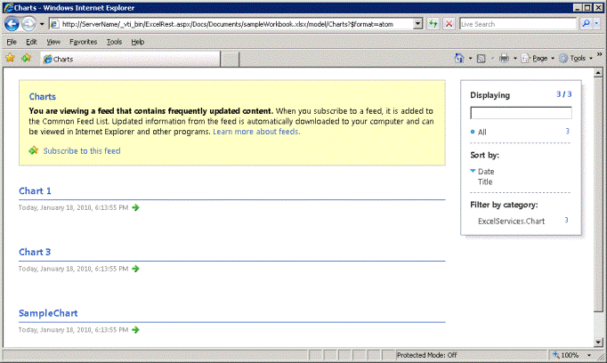

# <a name="discovery-in-excel-services-rest-api"></a><span data-ttu-id="5665b-102">Обнаружение в API REST служб Excel</span><span class="sxs-lookup"><span data-stu-id="5665b-102">Discovery in Excel Services REST API</span></span>

<span data-ttu-id="5665b-103">В этом разделе описываются механизмы обнаружения, встроенные в API-интерфейс RESTСлужбы Excel.</span><span class="sxs-lookup"><span data-stu-id="5665b-103">This topic discusses the discovery mechanisms built into the Excel Services REST API.</span></span>
  
> [!NOTE]
> <span data-ttu-id="5665b-104">API REST служб Excel применяется к SharePoint и SharePoint 2016 локально.</span><span class="sxs-lookup"><span data-stu-id="5665b-104">The Excel Services REST API applies to SharePoint and SharePoint 2016 on-premises.</span></span> <span data-ttu-id="5665b-105">Для учетных записей Office 365 для образования, Office 365 бизнес и Office 365 корпоративный используйте REST API Excel, входящие в состав конечной точки [Microsoft Graph](http://graph.microsoft.io/en-us/docs/api-reference/v1.0/resources/excel
).</span><span class="sxs-lookup"><span data-stu-id="5665b-105">For Office 365 Education, Business, and Enterprise accounts, use the Excel REST APIs that are part of the  [Microsoft Graph](http://graph.microsoft.io/en-us/docs/api-reference/v1.0/resources/excel
) endpoint.</span></span>
  
    
    


## <a name="discovery-base-url-and-discovery-example"></a><span data-ttu-id="5665b-106">Базовый URL-адрес обнаружения и пример обнаружения</span><span class="sxs-lookup"><span data-stu-id="5665b-106">Discovery Base URL and Discovery Example</span></span>

<span data-ttu-id="5665b-p102">Функция обнаружения позволяет разработчикам и пользователям обнаруживать содержимое книги вручную или программным способом. Механизм обнаружения предоставляется  [веб-каналом Atom (Возможно, на английском языке)](http://tools.ietf.org/html/rfc4287), который содержит сведения о ресурсах книги. С помощью функции обнаружения можно найти и просмотреть ресурсы книги. Ресурсами являются диапазоны, диаграммы, таблицы и сводные таблицы.</span><span class="sxs-lookup"><span data-stu-id="5665b-p102">Discovery enables developers and users to discover information about and the content of a workbook manually or programmatically. The discovery mechanism supplies the  [Atom](http://tools.ietf.org/html/rfc4287) feed that contains information about the resources in a workbook. By using discovery, you can explore and view the resources in the workbook. Resources that you can explore and access are ranges, charts, tables, and PivotTables.</span></span>
  
    
    
<span data-ttu-id="5665b-111">Ниже приведен пример URL-адреса REST конкретного элемента в книге.</span><span class="sxs-lookup"><span data-stu-id="5665b-111">Following is the construct of the REST URL to a specific element in a workbook:</span></span>
  
    
    


```

http://<ServerName>/_vti_bin/ExcelRest.aspx/<DocumentLibrary>/<FileName>/<ResourceLocation>
```

<span data-ttu-id="5665b-112">Как описано в разделе  [Структура базового URI и путь](basic-uri-structure-and-path.md), URL-адрес REST для доступа к книге **sampleWorkbook.xlsx** и просмотра диаграммы **SampleChart** выглядит следующим образом:</span><span class="sxs-lookup"><span data-stu-id="5665b-112">As described in the  [Basic URI Structure and Path](basic-uri-structure-and-path.md) topic, following is the REST URL to access a workbook named **sampleWorkbook.xlsx** and further view the chart called **SampleChart**:</span></span> 
  
    
    


```
http://<ServerName>/_vti_bin/ExcelRest.aspx/Docs/Documents/sampleWorkbook.xlsx/model/Charts('SampleChart')
```

<span data-ttu-id="5665b-113">Чтобы исследовать и просмотреть ресурсы рабочей книги с помощью функции обнаружения, перейдите на страницу модели с помощью URI, указанного в примере ниже.</span><span class="sxs-lookup"><span data-stu-id="5665b-113">To start and explore the resources in the workbook and view the resources by using discovery, go to the model page by using a URI that follows this example:</span></span>
  
    
    


```
http://<ServerName>/_vti_bin/ExcelRest.aspx/<DocumentLibrary>/<FileName>/model
```

<span data-ttu-id="5665b-114">Для книги "sampleWorkbook.xlsx" используйте следующий URI:</span><span class="sxs-lookup"><span data-stu-id="5665b-114">Using the "sampleWorkbook.xlsx" example, following is the URI:</span></span>
  
    
    


```
http://<ServerName>/_vti_bin/ExcelRest.aspx/Docs/Documents/sampleWorkbook.xlsx/model
```

<span data-ttu-id="5665b-115">Ниже показан пример страницы модели.</span><span class="sxs-lookup"><span data-stu-id="5665b-115">Following is a screen shot of the model page.</span></span>
  
    
    

<span data-ttu-id="5665b-116">**URL-адрес модели служб Excel REST**</span><span class="sxs-lookup"><span data-stu-id="5665b-116">**Excel Services REST model URL**</span></span>

  
    
    

  
    
    

  
    
    
<span data-ttu-id="5665b-p103">URL-адрес страницы модели — это место, с которого начинается обнаружение. На странице модели отображаются четыре коллекции ресурсов, которые в настоящее время поддерживают API-интерфейс REST Службы Excel. В состав коллекции ресурсов входят диапазоны, диаграммы, таблицы и сводные таблицы. Чтобы исследовать эти ресурсы в конкретной книге, щелкните ссылку **Диапазоны**, **Диаграммы**, **Таблицы** или **Сводные таблицы** на странице модели.</span><span class="sxs-lookup"><span data-stu-id="5665b-p103">The URL to the model page is where you start the discovery. The model page displays four resource collections that the Excel Services REST API currently supports. The resource collections are ranges, charts, tables, or PivotTables. You can explore those resources in a particular workbook by clicking **Ranges**, **Charts**, **Tables**, or **PivotTables** on the model page.</span></span>
  
    
    
<span data-ttu-id="5665b-122">Например, чтобы получить доступ к диаграмме в рабочей книге с помощью функции обнаружения, выполните следующие действия.</span><span class="sxs-lookup"><span data-stu-id="5665b-122">For example, to access the chart in the workbook by using discovery, do the following:</span></span> 
  
    
    

  
    
    

1. <span data-ttu-id="5665b-p104">На странице модели щелкните ссылку **Диаграммы**. Щелчок ссылки **Диаграммы** открывает другой веб-канал Atom со всеми диаграммами, доступными в книге sampleWorkbook.xlsx. Книга sampleWorkbook.xlsx содержит три диаграммы: **Chart 1**, **Chart 3** и **SampleChart**. Следовательно, в списке указаны три диаграммы, как показано на рисунке ниже.</span><span class="sxs-lookup"><span data-stu-id="5665b-p104">On the model page, click **Charts**. Clicking the **Charts** link brings another Atom feed—this resulting feed lists all the charts that are available in the sampleWorkbook.xlsx workbook. The sampleWorkbook.xlsx workbook contains three charts named **Chart 1**, **Chart 3**, and **SampleChart**. Therefore, three chart names are listed, as seen in the following screen shot.</span></span>
    
   <span data-ttu-id="5665b-127">**Список диаграмм обнаружения служб Excel REST**</span><span class="sxs-lookup"><span data-stu-id="5665b-127">**Excel Services REST discovery chart list**</span></span>

  

  
  

  

  
2. <span data-ttu-id="5665b-p105">На странице модели щелкните **SampleChart**. Откроется диаграмма **SampleChart**, расположенная в рабочей книге **sampleWorkbook.xlsx**, как показано на рисунке ниже.</span><span class="sxs-lookup"><span data-stu-id="5665b-p105">On the model page, click **SampleChart**. This displays the chart named **SampleChart** that resides in **sampleWorkbook.xlsx**, as shown in the following screen shot.</span></span> 
    
   <span data-ttu-id="5665b-131">**Просмотр графика с помощью службы REST**</span><span class="sxs-lookup"><span data-stu-id="5665b-131">**Viewing chart using REST**</span></span>

  

  
  

  

  
3. <span data-ttu-id="5665b-p106">Аналогичным образом при щелчке **Chart 1** или **Chart 3** откроются диаграммы с соответствующими именами. При выборе диаграммы **SampleChart** осуществляется переход по URL-адресу используемой диаграммы. URL-адрес диаграммы **SampleChart** показан в примере ниже (как он отображается на экране).</span><span class="sxs-lookup"><span data-stu-id="5665b-p106">Similarly, clicking **Chart 1** or **Chart 3** displays the chart with the corresponding name. Clicking **SampleChart** navigates to the actual chart URL. Following is the URL to the **SampleChart** image (as can be seen in the screen shot):</span></span>
    
```
  http://<ServerName>/_vti_bin/ExcelRest.aspx/Docs/Documents/sampleWorkbook.xlsx/model/Charts('SampleChart%20')?$format=image
```


## <a name="atom-feed"></a><span data-ttu-id="5665b-136">Веб-канал Atom</span><span class="sxs-lookup"><span data-stu-id="5665b-136">Atom Feed</span></span>

<span data-ttu-id="5665b-p107">Использование  [веб-канала Atom (Возможно, на английском языке)](http://tools.ietf.org/html/rfc4287), предоставляемого API-интерфейсом REST, — это простой способ получения требуемых данных. При просмотре исходного кода веб-страницы фактически вы просматриваете XML-код. Ниже приведен пример для диаграмм книги **sampleWorkbook.xlsx**.</span><span class="sxs-lookup"><span data-stu-id="5665b-p107">Using the  [Atom](http://tools.ietf.org/html/rfc4287) feed provided by the REST API gives you an easier way of getting to the data that you are interested in. If you view the source of the Web page, you get the XML. An example from the charts in **sampleWorkbook.xlsx** is shown below.</span></span>
  
    
    
<span data-ttu-id="5665b-p108">Как можно увидеть из XML-кода, веб-канал содержит доступные для обхода элементы, которые позволяют коду обнаруживать элементы в книге. Каждая запись веб-канала Atom соответствует диаграмме, к которой можно получить доступ. Такой же механизм используется для обнаружения диапазонов, таблиц и сводных таблиц.</span><span class="sxs-lookup"><span data-stu-id="5665b-p108">As can be seen in the XML, the feed contains traversable elements that enable code to discover what elements exist in the workbook. Each Atom entry corresponds to a chart that can be accessed. This same mechanism applies to discovering ranges, tables, and PivotTables.</span></span>
  
    
    


```XML
<?xml version="1.0" encoding="utf-8" standalone="yes"?>
<feed xmlns="http://www.w3.org/2005/Atom" xmlns:x="http://schemas.microsoft.com/office/2008/07/excelservices/rest" xmlns:d="http://schemas.microsoft.com/ado/2007/08/dataservice" xmlns:m="http://schemas.microsoft.com/ado/2007/08/dataservices/metadata">
  <title type="text">Charts</title>
  <id>http://ServerName/_vti_bin/ExcelRest.aspx/Docs/Documents/sampleWorkbook.xlsx/model/Charts</id>
  <updated>2010-01-19T19:32:53Z</updated>
  <author>
    <name />
  </author>
  <link rel="self" href="http://ServerName/_vti_bin/ExcelRest.aspx/Docs/Documents/sampleWorkbook.xlsx/model/Charts?$format=atom" title="Charts" />
  <entry>
    <category term="ExcelServices.Chart" scheme="http://schemas.microsoft.com/ado/2007/08/dataservices/scheme" />
    <title>Chart 1</title>
    <id>http://ServerName/_vti_bin/ExcelRest.aspx/Docs/Documents/sampleWorkbook.xlsx/model/Charts('Chart%201')</id>
    <updated>2010-01-19T19:32:53Z</updated>
    <author>
      <name />
    </author>
    <link rel="alternate" title="Chart 1" href="http://ServerName/_vti_bin/ExcelRest.aspx/Docs/Documents/sampleWorkbook.xlsx/model/Charts('Chart%201')?$format=image" />
    <content type="image/png" src="http://ServerName/_vti_bin/ExcelRest.aspx/Docs/Documents/sampleWorkbook.xlsx/model/Charts('Chart%201')?$format=image" />
  </entry>
  <entry>
    <category term="ExcelServices.Chart" scheme="http://schemas.microsoft.com/ado/2007/08/dataservices/scheme" />
    <title>Chart 3</title>
    <id>http://ServerName/_vti_bin/ExcelRest.aspx/Docs/Documents/sampleWorkbook.xlsx/model/Charts('Chart%203')</id>
    <updated>2010-01-19T19:32:53Z</updated>
    <author>
      <name />
    </author>
    <link rel="alternate" title="Chart 3" href="http://ServerName/_vti_bin/ExcelRest.aspx/Docs/Documents/sampleWorkbook.xlsx/model/Charts('Chart%203')?$format=image" />
    <content type="image/png" src="http://ServerName/_vti_bin/ExcelRest.aspx/Docs/Documents/sampleWorkbook.xlsx/model/Charts('Chart%203')?$format=image" />
  </entry>
  <entry>
    <category term="ExcelServices.Chart" scheme="http://schemas.microsoft.com/ado/2007/08/dataservices/scheme" />
    <title>SampleChart </title>
    <id>http://ServerName/_vti_bin/ExcelRest.aspx/Docs/Documents/sampleWorkbook.xlsx/model/Charts('SampleChart%20')</id>
    <updated>2010-01-19T19:32:53Z</updated>
    <author>
      <name />
    </author>
    <link rel="alternate" title="SampleChart" href="http://ServerName/_vti_bin/ExcelRest.aspx/Docs/Documents/sampleWorkbook.xlsx/model/Charts('SampleChart%20')?$format=image" />
    <content type="image/png" src="http://ServerName/_vti_bin/ExcelRest.aspx/Docs/Documents/sampleWorkbook.xlsx/model/Charts('SampleChart%20')?$format=image" />
  </entry>
</feed>
```


## <a name="see-also"></a><span data-ttu-id="5665b-143">См. также</span><span class="sxs-lookup"><span data-stu-id="5665b-143">See also</span></span>


#### <a name="concepts"></a><span data-ttu-id="5665b-144">Основные понятия</span><span class="sxs-lookup"><span data-stu-id="5665b-144">Concepts</span></span>


  
    
    
 [<span data-ttu-id="5665b-145">Ресурсы URI для интерфейса API REST служб Excel</span><span class="sxs-lookup"><span data-stu-id="5665b-145">Resources URI for Excel Services REST API</span></span>](resources-uri-for-excel-services-rest-api.md)
