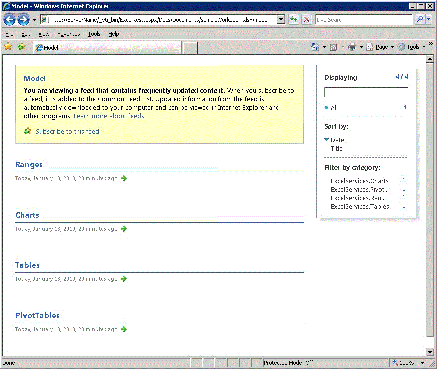

# <a name="discovery-in-excel-services-rest-api"></a>Обнаружение в API REST служб Excel

В этом разделе описываются механизмы обнаружения, встроенные в API-интерфейс RESTСлужбы Excel.
  
    
    


> **Примечание:** API REST служб Excel применяется к SharePoint и SharePoint 2016 локально. Для образовательных учреждений Office 365, бизнеса и корпоративных учетных записей используйте Excel API-интерфейсы REST, входящих в состав [Microsoft Graph](http://graph.microsoft.io/en-us/docs/api-reference/v1.0/resources/excel
> ) конечной точки.
  
    
    


## <a name="discovery-base-url-and-discovery-example"></a>Базовый URL-адрес обнаружения и пример обнаружения

Функция обнаружения позволяет разработчикам и пользователям обнаруживать содержимое книги вручную или программным способом. Механизм обнаружения предоставляется  [веб-каналом Atom (Возможно, на английском языке)](http://tools.ietf.org/html/rfc4287), который содержит сведения о ресурсах книги. С помощью функции обнаружения можно найти и просмотреть ресурсы книги. Ресурсами являются диапазоны, диаграммы, таблицы и сводные таблицы.
  
    
    
Ниже приведен пример URL-адреса REST конкретного элемента в книге.
  
    
    


```

http://<ServerName>/_vti_bin/ExcelRest.aspx/<DocumentLibrary>/<FileName>/<ResourceLocation>
```

Как описано в разделе  [Структура базового URI и путь](basic-uri-structure-and-path.md), URL-адрес REST для доступа к книге **sampleWorkbook.xlsx** и просмотра диаграммы **SampleChart** выглядит следующим образом: 
  
    
    


```
http://<ServerName>/_vti_bin/ExcelRest.aspx/Docs/Documents/sampleWorkbook.xlsx/model/Charts('SampleChart')
```

Чтобы исследовать и просмотреть ресурсы рабочей книги с помощью функции обнаружения, перейдите на страницу модели с помощью URI, указанного в примере ниже.
  
    
    


```
http://<ServerName>/_vti_bin/ExcelRest.aspx/<DocumentLibrary>/<FileName>/model
```

Для книги "sampleWorkbook.xlsx" используйте следующий URI:
  
    
    


```
http://<ServerName>/_vti_bin/ExcelRest.aspx/Docs/Documents/sampleWorkbook.xlsx/model
```

Ниже показан пример страницы модели.
  
    
    

**URL-адрес модели служб Excel REST**

  
    
    

  
    
    

  
    
    
URL-адрес страницы модели — это место, с которого начинается обнаружение. На странице модели отображаются четыре коллекции ресурсов, которые в настоящее время поддерживают API-интерфейс REST Службы Excel. В состав коллекции ресурсов входят диапазоны, диаграммы, таблицы и сводные таблицы. Чтобы исследовать эти ресурсы в конкретной книге, щелкните ссылку **Диапазоны**, **Диаграммы**, **Таблицы** или **Сводные таблицы** на странице модели.
  
    
    
Например, чтобы получить доступ к диаграмме в рабочей книге с помощью функции обнаружения, выполните следующие действия. 
  
    
    

  
    
    

1. На странице модели щелкните ссылку **Диаграммы**. Щелчок ссылки **Диаграммы** открывает другой веб-канал Atom со всеми диаграммами, доступными в книге sampleWorkbook.xlsx. Книга sampleWorkbook.xlsx содержит три диаграммы: **Chart 1**, **Chart 3** и **SampleChart**. Следовательно, в списке указаны три диаграммы, как показано на рисунке ниже.
    
   **Список диаграмм обнаружения служб Excel REST**

  

  
  

  

  
2. На странице модели щелкните **SampleChart**. Откроется диаграмма **SampleChart**, расположенная в рабочей книге **sampleWorkbook.xlsx**, как показано на рисунке ниже. 
    
   **Просмотр графика с помощью службы REST**

  

  
  

  

  
3. Аналогичным образом при щелчке **Chart 1** или **Chart 3** откроются диаграммы с соответствующими именами. При выборе диаграммы **SampleChart** осуществляется переход по URL-адресу используемой диаграммы. URL-адрес диаграммы **SampleChart** показан в примере ниже (как он отображается на экране).
    
```
  http://<ServerName>/_vti_bin/ExcelRest.aspx/Docs/Documents/sampleWorkbook.xlsx/model/Charts('SampleChart%20')?$format=image
```


## <a name="atom-feed"></a>Веб-канал Atom

Использование  [веб-канала Atom (Возможно, на английском языке)](http://tools.ietf.org/html/rfc4287), предоставляемого API-интерфейсом REST, — это простой способ получения требуемых данных. При просмотре исходного кода веб-страницы фактически вы просматриваете XML-код. Ниже приведен пример для диаграмм книги **sampleWorkbook.xlsx**.
  
    
    
Как можно увидеть из XML-кода, веб-канал содержит доступные для обхода элементы, которые позволяют коду обнаруживать элементы в книге. Каждая запись веб-канала Atom соответствует диаграмме, к которой можно получить доступ. Такой же механизм используется для обнаружения диапазонов, таблиц и сводных таблиц.
  
    
    


```XML
<?xml version="1.0" encoding="utf-8" standalone="yes"?>
<feed xmlns="http://www.w3.org/2005/Atom" xmlns:x="http://schemas.microsoft.com/office/2008/07/excelservices/rest" xmlns:d="http://schemas.microsoft.com/ado/2007/08/dataservice" xmlns:m="http://schemas.microsoft.com/ado/2007/08/dataservices/metadata">
  <title type="text">Charts</title>
  <id>http://ServerName/_vti_bin/ExcelRest.aspx/Docs/Documents/sampleWorkbook.xlsx/model/Charts</id>
  <updated>2010-01-19T19:32:53Z</updated>
  <author>
    <name />
  </author>
  <link rel="self" href="http://ServerName/_vti_bin/ExcelRest.aspx/Docs/Documents/sampleWorkbook.xlsx/model/Charts?$format=atom" title="Charts" />
  <entry>
    <category term="ExcelServices.Chart" scheme="http://schemas.microsoft.com/ado/2007/08/dataservices/scheme" />
    <title>Chart 1</title>
    <id>http://ServerName/_vti_bin/ExcelRest.aspx/Docs/Documents/sampleWorkbook.xlsx/model/Charts('Chart%201')</id>
    <updated>2010-01-19T19:32:53Z</updated>
    <author>
      <name />
    </author>
    <link rel="alternate" title="Chart 1" href="http://ServerName/_vti_bin/ExcelRest.aspx/Docs/Documents/sampleWorkbook.xlsx/model/Charts('Chart%201')?$format=image" />
    <content type="image/png" src="http://ServerName/_vti_bin/ExcelRest.aspx/Docs/Documents/sampleWorkbook.xlsx/model/Charts('Chart%201')?$format=image" />
  </entry>
  <entry>
    <category term="ExcelServices.Chart" scheme="http://schemas.microsoft.com/ado/2007/08/dataservices/scheme" />
    <title>Chart 3</title>
    <id>http://ServerName/_vti_bin/ExcelRest.aspx/Docs/Documents/sampleWorkbook.xlsx/model/Charts('Chart%203')</id>
    <updated>2010-01-19T19:32:53Z</updated>
    <author>
      <name />
    </author>
    <link rel="alternate" title="Chart 3" href="http://ServerName/_vti_bin/ExcelRest.aspx/Docs/Documents/sampleWorkbook.xlsx/model/Charts('Chart%203')?$format=image" />
    <content type="image/png" src="http://ServerName/_vti_bin/ExcelRest.aspx/Docs/Documents/sampleWorkbook.xlsx/model/Charts('Chart%203')?$format=image" />
  </entry>
  <entry>
    <category term="ExcelServices.Chart" scheme="http://schemas.microsoft.com/ado/2007/08/dataservices/scheme" />
    <title>SampleChart </title>
    <id>http://ServerName/_vti_bin/ExcelRest.aspx/Docs/Documents/sampleWorkbook.xlsx/model/Charts('SampleChart%20')</id>
    <updated>2010-01-19T19:32:53Z</updated>
    <author>
      <name />
    </author>
    <link rel="alternate" title="SampleChart" href="http://ServerName/_vti_bin/ExcelRest.aspx/Docs/Documents/sampleWorkbook.xlsx/model/Charts('SampleChart%20')?$format=image" />
    <content type="image/png" src="http://ServerName/_vti_bin/ExcelRest.aspx/Docs/Documents/sampleWorkbook.xlsx/model/Charts('SampleChart%20')?$format=image" />
  </entry>
</feed>
```


## <a name="see-also"></a>См. также


#### <a name="concepts"></a>Основные понятия


  
    
    
 [Ресурсы URI для интерфейса API REST служб Excel](resources-uri-for-excel-services-rest-api.md)
