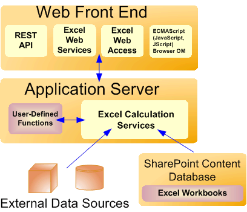

# Архитектура служб ExcelExcel Services Architecture

Службы Службы Excel входят в состав Microsoft SharePoint Server 2010. Службы Excel построены на базе технологий ASP.NET и SharePoint Foundation. Ниже перечислены ключевые компоненты Службы Excel.Excel Services is part of Microsoft SharePoint Server 2010. Excel Services is built on ASP.NET and SharePoint Foundation technologies. Following are the core components in Excel Services:
  
    
    

- Веб-клиент ExcelExcel Web Access
    
  
- Веб-службы ExcelExcel Web Services
    
  
- Пользовательские функции (UDF)User-defined functions (UDFs)
    
  
- ECMAScript (JavaScript, JScript)ECMAScript (JavaScript, JScript)
    
  
- Служба RESTRepresentational State Transfer (REST) service
    
  
- Службы вычислений ExcelExcel Calculation Services
    
> [!NOTE]
> [!Примечание] Microsoft Excel Online, частью Office Online также поддерживает книги Excel в браузере. Дополнительные сведения о Excel Online [Документация по Office Web Apps](https://technet.microsoft.com/en-us/library/ee855124.aspx)см.Microsoft Excel Online, part of Office Online, also supports Excel workbooks in the browser. For more information about Excel Online, see  [documentation about Office Web Apps](https://technet.microsoft.com/en-us/library/ee855124.aspx). 
  
    
    

Веб-клиент Excel, Веб-службы Excel, пользовательские функции, JavaScript, службу REST и Службы вычислений Excel можно разбить на две основные группы: компоненты на сервере переднего плана (который также называется интерфейсным веб-сервером) и компоненты на внутреннем сервере приложений. **Компоненты интерфейсного веб-сервера и внутреннего сервера приложений**The Excel Web Access, Excel Web Services, UDFs, JavaScript, the REST service, and Excel Calculation Services components can be divided into two major groups: the components on a front-end server (also known as the "Web front end") and the component on a back-end application server. **Components of a Web front end and a back-end application server**

  
    
    

  
    
    

  
    
    

  
    
    

  
    
    

## Интерфейсный веб-серверы и внутренние серверы приложенийWeb Front-End Servers and Back-End Application Servers

Веб-клиент Excel, Веб-службы Excel, пользовательские функции, JavaScript, службу REST и Службы вычислений Excel можно разбить на компоненты, размещенные на интерфейсном веб-сервере, и компоненты, размещенные на внутреннем сервере приложений. На интерфейсном веб-сервере размещаются Веб-клиент Excel, JavaScript, служба REST и Веб-службы Excel. Компонент Службы вычислений Excel размещаются на внутреннем сервере приложений вместе с добавленными администратором сборками пользовательских функций.The Excel Web Access, Excel Web Services, UDFs, JavaScript, the REST service, and Excel Calculation Services components can be divided into components on the Web front-end server and components that live on a back-end application server. The Web front end includes Excel Web Access, JavaScript, the REST service, and Excel Web Services. The Excel Calculation Services component resides on the back-end application server, alongside any UDF assemblies that an administrator has added.
  
    
    
В простейшей конфигурации SharePoint Server 2010 — один компьютер с приложением SharePoint Server 2010, установленным в режиме изолированной установки — все пять компонентов устанавливаются на один компьютер. Однако в типичной корпоративной среде с большим количеством пользователей компоненты интерфейсного веб-сервера и компоненты внутреннего сервера приложений устанавливаются на разные компьютеры в ферме. Это позволяет масштабировать интерфейсный веб-сервер независимо от внутреннего сервера приложений. Например, в зависимости от потребностей организации можно добавить дополнительные интерфейсные веб-серверы или внутренние серверы приложений.In the simplest configuration in SharePoint Server 2010—that is, a single computer running SharePoint Server 2010 as a stand-alone installation—all five components are installed on the same computer. However, in a typical enterprise environment with a large number of users, the components on the Web front-end server and the components on the back-end application server are on different computers in a farm configuration. It is possible to scale out the Web front-end server independently from the back-end application server. For example, you can have more Web front-end servers or more back-end application servers, depending on your organizational needs.
  
    
    
Сведения о топологии Службы Excel, масштабируемости, производительности и безопасности обратитесь к документации SharePoint Server 2010 на  [сайте TechNet](http://technet.microsoft.com/en-us/library/cc303422%28office.14%29.aspx).For information about Excel Services topology, scalability, performance, and security, see the SharePoint Server 2010 documentation on  [TechNet](http://technet.microsoft.com/en-us/library/cc303422%28office.14%29.aspx). 
  
    
    

## Веб-доступ ExcelExcel Web Access

Веб-клиент Excel — это страница средства просмотра и веб-часть Службы Excel, которую можно добавить на любую страницу веб-частей в SharePoint Server 2010. Веб-клиент Excel отображает (иными словами, создает HTML-код) на веб-странице интерактивные книги Excel, позволяя пользователю взаимодействовать с этими книгами и просматривать их. Веб-клиент Excel — это визуальный компонент Службы Excel, предназначенный для пользователей. Веб-клиент Excel, как и любую другую веб-часть, можно использовать в SharePoint Server 2010. Веб-клиент Excel не требует от пользователя установки на клиентском компьютере каких-либо компонентов.Excel Web Access is a viewer page and an Excel Services Web Part that you can add to any Web Parts page in SharePoint Server 2010. Excel Web Access renders (in other words, creates the HTML for) live Excel workbooks on a Web page, and enables the user to interact with those workbooks and explore them. Excel Web Access is the visible Excel Services component for the user. You can use Excel Web Access like any other Web Part in SharePoint Server 2010. Excel Web Access does not require the user to install anything on the client computer.
  
    
    
Свойства веб-части Excel Web Access можно также настроить.The Excel Web Access Web Part properties are also customizable. Для получения дополнительных сведений см **Microsoft.Office.Excel.Server.WebUI** пространства имен.For more information, see the **Microsoft.Office.Excel.Server.WebUI** namespace reference documentation.
  
    
    

## Веб-службы ExcelExcel Web Services

Веб-службы Excel — Службы Excel компонент, который позволяет получать доступ к его веб-службы. Вы можете создавать приложения, которые могут вызывать Веб-службы Excel для вычисления, задавать и извлекать значения из книг, а также обновлять подключения к внешним данным. Веб-службы Excel можно внедрить логики книги на сервере в приложения, автоматически обновить книг Excel и создание конкретного приложения пользовательских интерфейсов вокруг служба вычислений Excel на сервере.Excel Web Services is the Excel Services component that provides programmatic access to its Web service. You can develop applications that call Excel Web Services to calculate, set, and extract values from workbooks, and to refresh external data connections. By using Excel Web Services, you can incorporate server-side workbook logic into an application, automate the updating of Excel workbooks, and create application-specific user interfaces around server-side Excel calculation. 
  
> [!NOTE]
> [!Примечание] При внесении изменений в книгу — например, при задании значений диапазона с помощью Веб-службы Excel — эти изменения сохраняются в книге только во время текущего сеанса. Изменения не сохраняются и не вносятся в исходную книгу. По завершении текущего сеанса работы с книгой (например, при вызове метода **CloseWorkbook** либо по истечении времени сеанса) все внесенные изменения утрачиваются.> Если вы хотите сохранить изменения, внесенные в книгу, можно использовать метод **GetWorkbook** и затем сохраните книгу. Для получения дополнительных сведений см [Microsoft.Office.Excel.Server.WebServices](https://msdn.microsoft.com/library/Microsoft.Office.Excel.Server.WebServices.aspx) . Можно также откройте книгу в режиме редактирования и сохранить изменения.When you make changes to a workbook—for example, by setting values to a range by using Excel Web Services—the changes to the workbook are preserved only for that session. The changes are not saved or persisted back to the original workbook. When the current workbook session ends (for example, when you call the **CloseWorkbook** method, or when the session times out), the changes that you made are lost.> If you want to save changes that you make to a workbook, you can use the **GetWorkbook** method, and then save the workbook. For more information, see [Microsoft.Office.Excel.Server.WebServices](https://msdn.microsoft.com/library/Microsoft.Office.Excel.Server.WebServices.aspx) . You can also open the workbook in edit mode and save the changes.
  
    
    

Дополнительные сведения о Веб-службы Excel см. в разделе  [Excel Services Development Roadmap](excel-services-development-roadmap.md).For more information about Excel Web Services, see  [Excel Services Development Roadmap](excel-services-development-roadmap.md).
  
    
    

## Пользовательские функции (UDF)User-Defined Functions (UDFs)

Службы Excel Пользовательские функции позволяют использовать в ячейках формулы для вызова настраиваемых функций, написанных с помощью управляемого кода и развернутых в SharePoint Server 2010. Дополнительные сведения о пользовательских функциях в Службы Excel см. в разделе  [Understanding Excel Services UDFs](understanding-excel-services-udfs.md).Excel Services UDFs enable you to use formulas in a cell to call custom functions that are written in managed code and deployed to SharePoint Server 2010. For more information about UDFs in Excel Services, see  [Understanding Excel Services UDFs](understanding-excel-services-udfs.md).
  
    
    

## ECMAScript (JavaScript, JScript)ECMAScript (JavaScript, JScript)

Объектная модель JavaScript в Службы Excel позволяет разработчикам настраивать, автоматизировать и использовать на странице элемент управления веб-части Веб-клиент Excel. С помощью объектной модели JavaScript можно создавать гибридные веб-приложения и другие интегрированные решения, взаимодействующие с одним или несколькими элементами управления веб-части Веб-клиент Excel на странице или в **iframe** со сценарием на странице. Объектная модель также позволяет добавлять в книги и связанный с ними код дополнительные возможности.The JavaScript object model in Excel Services enables developers to customize, automate, and drive the Excel Web Access Web Part control on a page. By using the JavaScript object model, you can build mashups and other integrated solutions that interact with one or more Excel Web Access Web Part controls on a page or an **iframe** with script on the page. It also enables you to add more capabilities to your workbooks and code around them.
  
    
    
Дополнительные сведения об объектной модели JavaScript в Службы Excel справочная документация пространство имен  [Ewa](http://msdn.microsoft.com/library/6fe73191-3213-b986-1ad6-2c3b918a2241%28Office.15%29.aspx) см.For more information about the JavaScript object model in Excel Services, see the  [Ewa](http://msdn.microsoft.com/library/6fe73191-3213-b986-1ad6-2c3b918a2241%28Office.15%29.aspx) namespace reference documentation.
  
    
    

## API-интерфейс RESTREST API

API-Интерфейс REST в Службы Excel позволяет получить доступ к компонентам и элементам книги непосредственно через URL-адрес. URL-адрес содержит путь «метки», который является точкой входа на страницу ASPX, к месту расположения файла книги и путь к запрошенный элемент внутри книги.The REST API in Excel Services enables you to access workbook parts or elements directly through a URL. The URL contains a "marker" path, which is the entry point to an .aspx page, to the workbook file location, and to the path to the requested element inside the workbook. 
  
    
    
Механизмы обнаружения, встроенные в API-Интерфейс REST Службы Excel позволяет разработчикам и пользователей, для изучения содержимого книги, автоматически или вручную.The discovery mechanisms built into the Excel Services REST API enables developers and users to explore the content of a workbook manually or programmatically. 
  
    
    
Дополнительные сведения об API-Интерфейс REST в Службы Excel можно  [API REST служб Excel](excel-services-rest-api.md).For more information about the REST API in Excel Services, see  [Excel Services REST API](excel-services-rest-api.md). 
  
    
    

## Службы вычислений ExcelExcel Calculation Services

Службы Службы вычислений Excel предназначены для загрузки книг, выполнения вычислений, вызова настраиваемого кода (пользовательских функций) и обновления внешних данных. Для обеспечения интерактивности поддерживается состояние сеанса. Службы Службы вычислений Excel поддерживают сеанс, пока пользователь или вызывающая сторона взаимодействует с книгой. Сеанс завершается, когда вызывающая сторона завершает его явным образом или истекает время сеанса на сервере. Службы Службы Excel кэшируют открытые книги Excel, состояния вычисления и результаты запросов к внешним данным, что обеспечивает более высокую производительность при работе нескольких пользователей с одним набором книг.The role of Excel Calculation Services is to load workbooks, calculate workbooks, call custom code (UDFs), and refresh external data. It also maintains the session state for interactivity. Excel Calculation Services maintains a session for the duration of interactions with the same workbook by a user or caller. A session is closed when the caller explicitly closes it or when the session times out on the server. Excel Services caches the opened Excel workbooks, calculation states, and external data query results, for improved performance when multiple users access the same set of workbooks.
  
    
    

## Балансировка нагрузкиLoad-Balancing

В конфигурациях с несколькими серверами службы Службы Excel обеспечивают балансировку нагрузки при запросах к нескольким экземплярам Службы вычислений Excel в ферме. Если установлено несколько серверов приложений, службы Службы Excel обеспечивают балансировку нагрузки таким образом, чтобы ни один сервер приложений не был перегружен запросами.In multiple-server configurations, Excel Services load-balances requests across multiple Excel Calculation Services occurrences in a farm configuration. If your installation includes multiple application servers, Excel Services will balance the load in an attempt to help ensure that no single application server is overloaded by requests.
  
    
    
Администраторы могут настроить поведение при балансировке нагрузки.Administrators can configure the load-balancing behavior.
  
    
    

## См. такжеSee also

#### Основные понятияConcepts

  
    
    
 [Общие сведения о службах ExcelExcel Services Overview](excel-services-overview.md)
  
    
    
 [Excel Services Development RoadmapExcel Services Development Roadmap](excel-services-development-roadmap.md)
  
    
    
 [Поддерживаемые и неподдерживаемые возможностиSupported and Unsupported Features](supported-and-unsupported-features.md)
#### Другие ресурсыOther resources

  
    
    
 [Пошаговое руководство. Разработка настраиваемого приложения с помощью веб-служб ExcelWalkthrough: Developing a Custom Application Using Excel Web Services](walkthrough-developing-a-custom-application-using-excel-web-services.md)
