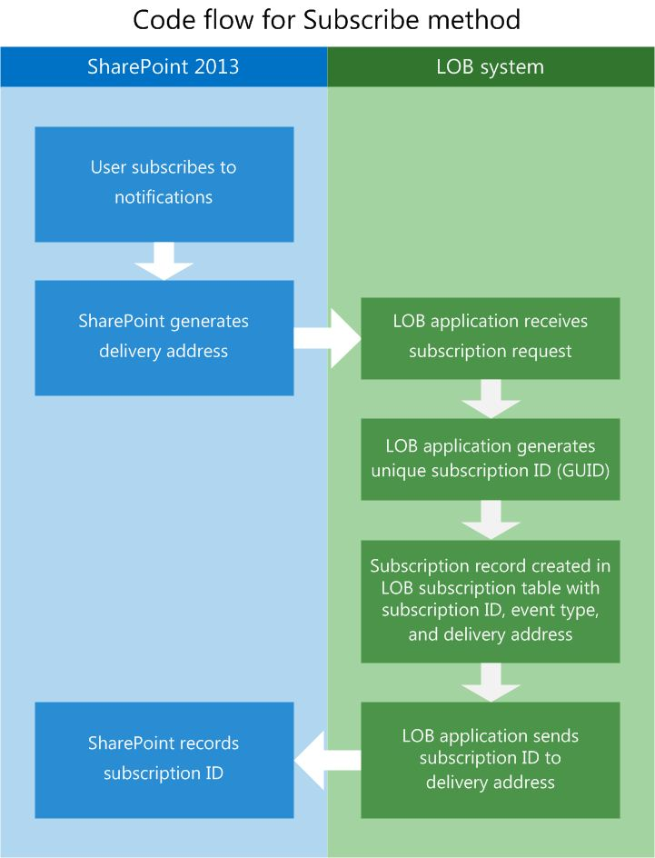
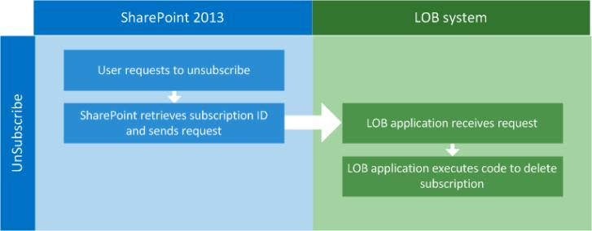

# <a name="external-events-and-alerts-in-sharepoint"></a>Внешние события и оповещения в SharePoint
Узнайте концепции создания приемников удаленных событий в SharePoint, которые можно присоединить к внешним спискам и выполнить при обновлении внешних данных, представляемых списком.
## <a name="what-are-event-receivers"></a>Что представляют собой приемники событий?
<a name="Externalevents_overview"> </a>

Приемник событий — это управляемого кода, реагирующего на запуск событиями, например добавление, перемещение, удаление, возврат и извлечение SharePoint. При возникновении этих событий и условий приемника событий, выполняется код, написанный для предоставления дополнительных функциональных возможностей. При настройке объектов SharePoint, такие как списки, рабочие процессы и компоненты, Ожидание этих событий они называются узлов событий. 
  
    
    
Приемники событий позволяют выполнять бизнес-логики при возникновении определенных событий. По сути это обработчики, где можно создать код, чтобы обрабатывать некоторые условия, сделать уведомлений, обновление других систем и т.д. При создании приемников событий создается библиотеки DLL. Можно поместить эту Библиотеку в глобальном кэше сборок, чтобы приемников событий, вызываются в ответ на изменения в внешней системы.
  
    
    
Следующий пример содержит приемник простой внешних событий в C#, который выполняется при добавлении нового элемента в список.
  
    
    


```cs

public class EntryContentEventReceiver : SPItemEventReceiver
{
   public override void ItemAdded(SPItemEventProperties properties)
   {
      base.ItemAdded(properties);

      // properties.ExternalNotificationMessage holds the message sent by the external 
      // system.
   }
```

Приемники событий внешнего можно расширить также работать с приемника событий сущности, а также как удаленных приемников событий развернут как службы на месте или в Microsoft Azure. 
  
    
    

## <a name="what-are-remote-event-receivers"></a>Что такое удаленные приемники событий?
<a name="WhatIsARemoteEventReceiver"> </a>

Удаленные приемники событий являются новыми для SharePoint. Традиционные решения SharePoint используйте приемника событий для обработки событий, таких как пользователи, создание и удаление списков и элементов списка. В SharePoint надстройки, используйте удаленного приемника событий для обработки событий, аналогичные. Удаленные приемники событий действуют подобно приемников событий регулярных, за исключением того, что удаленные приемники событий обработки событий, происходящих при надстройки SharePoint на другой системе с его узла веб-приложения.
  
    
    
Службы Business Connectivity Services (BCS) использует удаленных приемников событий подключенного к внешних списков и entities можно написать код, который может реагировать на изменения в данные, размещаемые во внешней системе.
  
    
    
Чтобы решить эту проблему, были добавлены два стереотипов схеме модели BDC: **EventSubscriber** и **EventUnsubscriber**.
  
    
    

> **Примечание:** Приемники событий не поддерживаются в изолированных решениях. 
  
    
    


## <a name="what-features-and-capabilities-does-the-new-external-event-receiver-infrastructure-provide"></a>Какие функции и возможности нового инфраструктура приемника внешних событий предоставляет?
<a name="FeaturesAddedWithRER"> </a>

По использованию и расширению возможностей приемника событий SharePoint, BCS имеет возможность добавления предупреждения, приемники событий внешний список и приемники сущности для предоставления расширенных функциональных возможностей.
  
    
    

- **Оповещения:** Оповещения были неотъемлемой частью SharePoint для нескольких версий, но до того времени SharePoint, они не будет работать с внешними списками. Теперь пользователь может создавать оповещения на внешний список, для которого отличается от оповещений для стандартного списка SharePoint.
    
  
- **Приемников событий внешнего списка:** Приемники событий теперь могут быть присоединены к внешним спискам так же, как они могут для Стандартные списки. Это обеспечивает механизм расширяемости, позволяющее создавать код, выполняемый на определенное время.
    
  
- **Приемников событий сущности:** Приемники событий сущности обеспечивают гибкость, позволяя создавать более надежный код, обеспечивающий других операций, например контекста пользователя, для фильтрации данных. Это позволяет лучше личной настройки и настройку безопасности.
    
  
Несколько интересных сценариев делает удаленных событий в SharePoint. Например возможно, «Продажи отслеживание потенциальных клиентов» приложение, которое позволяет получать уведомления при вводе нового сбыту в приложение внешнего интереса продажах. При вводе нового ведущего сотрудника отдела продаж через систему уведомлений, который является частью приложения интереса уведомляется SharePoint. SharePoint получает уведомления и затем создает новые задачи для указанного сотрудников отдела продаж к исполнению на каждый новый ведущий сотрудник. При настройке приложения запись ведущего сотрудника отдела продаж на внешнюю систему, чтобы отправить уведомление SharePoint при создании каждого нового интереса, SharePoint будет храниться полностью в актуальном состоянии.
  
    
    

## <a name="prerequisites-for-using-event-receivers-for-external-lists"></a>Необходимые условия для использования приемников событий для внешних списков
<a name="bkmk_Prerequisites"> </a>

Чтобы использовать приемники событий для внешних списков, вам необходимо следующее:
  
    
    

- SharePoint
    
  
- Visual Studio 2012
    
  
Дополнительные сведения о настройке среды разработки SharePoint видеть [настроить среду разработки, общие для SharePoint](set-up-a-general-development-environment-for-sharepoint.md).
  
    
    

## <a name="configure-the-external-system-to-notify-sharepoint-of-external-events"></a>Настройка внешней системы для уведомления SharePoint внешние события
<a name="Externalevents_components"> </a>

Для внешних событий для работы число компонентов нужно установить и настроить на узел SharePoint и внешняя система.
  
    
    
Необходимо настроить для внешней системы, чтобы его можно сделать следующее:
  
    
    

- **Определение при изменении базовых данных.** Для внешней системы, чтобы узнать, когда были внесены изменения необходимо создать механизм опроса для конкретных изменений. Это можно сделать с помощью запланированных служба, которая опрашивает источника данных через определенные интервалы времени.
    
  
- **Получения и записи запросов для подписки на уведомления об изменениях.** Реализация хранилища подписок, чтобы его можно хранить получателей уведомлений об изменении имеет во внешней системе. Самое простое решение, вероятно, — это таблица базы данных. В таблице (или выберите любой механизм) должны записать SubscriptionID, адрес доставки, тип события и имя сущности.
    
  
- **Регистрации уведомлений конечным точкам представлений состояния (REST).** Чтобы позволить SharePoint подписчики знать, что было изменено, внешняя система приложению необходимо отправить HTTP WebRequest на адрес доставки, записанные в хранилища подписок. Этот адрес доставки — это RESTful конечной точки, создаваемая программой SharePoint во время процесса подписки.
    
  

## <a name="configure-sharepoint-to-allow-communication-with-external-systems"></a>Настройка SharePoint, чтобы разрешить связь с внешними системами
<a name="bkmk_configureSP"> </a>

Чтобы разрешить связь с внешней системы, SharePoint должны быть настроены следующие:
  
    
    

- Модели BDC с **EventSubscriber** и **EventUnsubscriber** стереотипов настроены
    
  
- Приемники событий
    
  

### <a name="how-is-external-eventing-enabled"></a>Как включить внешние события

Можно включить внешние события в SharePoint через **Параметры сайта** или, добавив следующий код пользовательского компонента в проект
  
    
    

```XML

<ActivationDependency FeatureTitle="BCSEvents" FeatureId="60c8481d-4b54-4853-ab9f-ed7e1c21d7e4" />
```

Включается событий для внешней системы, когда SharePoint создает адрес доставки и отправляет его к внешней системе во время процесса подписки на.
  
    
    

## <a name="overall-flow-of-external-eventing-between-sharepoint-and-external-systems"></a>Общий поток внешние события между SharePoint и внешними системами
<a name="bkmk_overallflow"> </a>

На рисунке 1, обратите внимание, что состоит из трех различных шагов при использовании приемников событий внешнего: подписка, уведомления и отменить подписку.
  
    
    

**На рисунке 1 поток завершения данных для внешних уведомлений**

  
    
    

  
    
    

  
    
    

  
    
    

  
    
    

## <a name="eventsubscriber-subscribe-to-notifications"></a>EventSubscriber: подписки на уведомления
<a name="bkmk_eventsubscriber"> </a>

Для пользователя (объект SharePoint) для получения уведомлений при изменении базовых данных пользователю необходимо подписаться на уведомления для сущности. Для этого схемы модели BDC был расширен стереотипа **Subscribe**. Стереотипа **Subscribe** используемые SharePoint для внешней системы знать, что отправитель запрашивает уведомлений об изменениях в базовые данные.
  
    
    
На рисунке 2 показано обмен информацией между SharePoint и внешней системы во время процесса подписки на.
  
    
    

**На рисунке 2. Подписка Технологическая схема**

  
    
    

  
    
    

  
    
    
Ниже описаны общие поток в процедуре подписки.
  
    
    

  
    
    

1. **Пользователь запрашивает подписки для уведомлений.** Использование настраиваемого пользовательского интерфейса (кнопка на странице или ленты), SharePoint инициирует запрос на приложение внешней системе для уведомлений.
    
  
2. **SharePoint создает адрес доставки.** В ходе процесса подписки на SharePoint создает конечных точек REST, где доставки уведомлений.
    
  
3. **К внешней системе отправляется запрос подписки.** SharePoint инкапсулирует запросившей информации наряду с динамически созданные URL-адрес REST и отправляет веб-запрос к внешней системе.
    
  
4. **Внешняя система получает запрос.** Существуют разные возможности по внедрению хранилища подписок. В этом примере необходимо использовать таблицу базы данных SQL Server.
    
  
5. **Внешняя система генерирует subscriptionId.** Новые **subscriptionId** создается с помощью кода в приложении бизнес (LOB). **subscriptionId** должно быть идентификатором GUID.
    
  
6. **Внешняя система записывает подписки.** Приложение внешняя система записывает **subscriptionId**, адрес доставки, тип события и другие сведения, отправленные из SharePoint в хранилище данных подписки.
    
  
7. **Внешняя система отправляет subscriptionId SharePoint.** Для SharePoint для правильной маршрутизации обновлений, отправляемые с внешней системы **subscriptionId** отправляется SharePoint и SharePoint записывает эти данные в базе данных.
    
    Модели BDC работает на импорт функции **Subscribe**. Метаданные для функции импорта показано в следующем примере.
    


```XML
  FunctionImport
 
<EntityType Name="EntitySubscribe">
   <Key>
      <PropertyRef Name="SubscriptionId" />
   </Key>
   <Property Name="SubscriptionId" Type="Edm.Int32" Nullable="false" 
      p6:StoreGeneratedPattern="Identity" 
      xmlns:p6="http://schemas.microsoft.com/ado/2009/02/edm/annotation" />
   <Property Name="EntityName" Type="Edm.String" MaxLength="250" FixedLength="false" 
      Unicode="true" />
   <Property Name="DeliveryURL" Type="Edm.String" MaxLength="250" FixedLength="false" 
      Unicode="true" />
   <Property Name="EventType" Type="Edm.Int32" />
   <Property Name="UserId" Type="Edm.String" MaxLength="50" FixedLength="false" 
      Unicode="true" />
   <Property Name="SubscribeTime" Type="Edm.Binary" MaxLength="8" FixedLength="true" 
      p6:StoreGeneratedPattern="Computed" 
      xmlns:p6="http://schemas.microsoft.com/ado/2009/02/edm/annotation" />
   <Property Name="SelectColumns" Type="Edm.String" MaxLength="10" FixedLength="false" 
      Unicode="true" />
</EntityType>

```


### <a name="code-example-bdc-model-with-subscribe"></a>Пример кода: модели BDC с подписки на

Ниже приведен пример модели BDC с помощью метода **Subscribe** добавлена.
  
    
    

```XML

<Method Name="SubscribeCustomer" DefaultDisplayName="Customer Subscribe" IsStatic="true">
   <Properties>
     <Property Name="ODataEntityUrl" Type="System.String">/EntitySubscribes</Property>
     <Property Name="ODataHttpMethod" Type="System.String">POST</Property>
     <Property Name="ODataPayloadKind" Type="System.String">Entry</Property>
     <Property Name="ODataFormat" Type="System.String">application/atom+xml</Property>
     <Property Name="ODataServiceOperation" Type="System.Boolean">false</Property>
   </Properties>
   <AccessControlList>
      <AccessControlEntry Principal="NT Authority\\Authenticated Users">
         <Right BdcRight="Edit" />
         <Right BdcRight="Execute" />
         <Right BdcRight="SetPermissions" />
         <Right BdcRight="SelectableInClients" />
      </AccessControlEntry>
   </AccessControlList>
   <Parameters>
      <Parameter Direction="In" Name="@DeliveryURL">
         <TypeDescriptor TypeName="System.String" Name="DeliveryURL" >
            <Properties>
               <Property Name="IsDeliveryAddress" Type="System.Boolean">true</Property>
            </Properties>
         </TypeDescriptor>
      </Parameter>
      <Parameter Direction="In" Name="@EventType">
         <TypeDescriptor TypeName="System.Int32" Name="EventType" >
            <Properties>
               <Property Name="IsEventType" Type="System.Boolean">true</Property>
            </Properties>
         </TypeDescriptor>
      </Parameter>
      <Parameter Direction="In" Name="@EntityName">
         <TypeDescriptor TypeName="System.String" Name="EntityName" >
            <DefaultValues>
               <DefaultValue MethodInstanceName="SubscribeCustomer" 
                  Type="System.String">Customers</DefaultValue>
            </DefaultValues>
      </TypeDescriptor>
    </Parameter>
    <Parameter Direction="In" Name="@SelectColumns">
      <TypeDescriptor TypeName="System.String" Name="SelectColumns" >
        <DefaultValues>
          <DefaultValue MethodInstanceName="SubscribeCustomer" Type="System.String">*</DefaultValue>
        </DefaultValues>
      </TypeDescriptor>
    </Parameter>
    <Parameter Direction="Return" Name="SubscribeReturn">
      <TypeDescriptor Name="SubscribeReturnRootTd" TypeName="Microsoft.BusinessData.Runtime.DynamicType">
        <TypeDescriptors>
          <TypeDescriptor Name="SubscriptionId" TypeName="System.String" >
            <Properties>
              <Property Name="SubscriptionIdName" Type="System.String">Default</Property>
            </Properties>
            <Interpretation>
              <ConvertType LOBType="System.Int32" BDCType="System.String"/>
            </Interpretation>
          </TypeDescriptor>
          <TypeDescriptor Name="DeliveryURL" TypeName="System.String" />
          <TypeDescriptor Name="SelectColumns" TypeName="System.String" >
          </TypeDescriptor>
          <TypeDescriptor Name="EntityName" TypeName="System.String" />
          <TypeDescriptor Name="EventType" TypeName="System.Int32" />
          <TypeDescriptor Name="UserId" TypeName="System.String" />
          <!--TypeDescriptor Name="SubscribeTime" TypeName="System." /-->
        </TypeDescriptors>
      </TypeDescriptor>
    </Parameter>
  </Parameters>
  <MethodInstances>
    <MethodInstance Type="EventSubscriber" ReturnParameterName="SubscribeReturn" ReturnTypeDescriptorPath="SubscribeReturnRootTd" Default="true" Name="SubscribeCustomer" DefaultDisplayName="Customer Subscribe">
      <AccessControlList>
        <AccessControlEntry Principal="NT Authority\\Authenticated Users">
          <Right BdcRight="Edit" />
          <Right BdcRight="Execute" />
          <Right BdcRight="SetPermissions" />
          <Right BdcRight="SelectableInClients" />
        </AccessControlEntry>
      </AccessControlList>
    </MethodInstance>
  </MethodInstances>
</Method>
```

В таблице 1 перечислены важные атрибуты модели BDC, необходимые для стереотипа **Subscribe** работы.
  
    
    

**В таблице 1. Атрибуты модели BDC**


|**Атрибут**|**Описание**|
|:-----|:-----|
|**IsDeliveryAddress** <br/> |Флаг **Boolean**, используемый в **TypeDescriptor** указывает, является ли указанный адрес доставки для доставки уведомлений. <br/> |
|**IsEventType** <br/> |Флаг **Boolean**, используемый в **TypeDescriptor** указывает, является ли предоставленный тип события для использования в качестве типа события. Допустимые типы событий, **ItemAdded**, **ItemUpdated**, **ItemDeleted**и т. д. <br/> |
|**SubscriptionIdName** <br/> |Строка, используемая на **TypeDescriptor**, который представляет имя **subscriptionId** части. <br/> |
   

## <a name="notifications"></a>Уведомления
<a name="bkmk_notifications"> </a>

В SharePoint чтобы разрешить внешние источники данных для уведомления SharePoint при сведения во внешней системе, были ли изменены был улучшен инфраструктуру обработку событий. Затем когда SharePoint получает уведомление, приемники событий, связанных с внешним списком SharePoint или сущности может выполнять код для выполнения указанного действия.
  
    
    
При создании подписки во внешней системе требуется способ сообщить SharePoint о изменений, внесенных в конкретной сущности. Предполагается, что во внешней системе доставки уведомлений на адрес доставки в соответствии с требованиями SharePoint к внешней системе во время процесса подписки на использование формате OData Atom полезных данных.
  
    
    
На рисунке 3 показаны поток обмена данными между внешней системы и SharePoint, при добавлении новой записи данных во внешней системе.
  
    
    

**Процесс уведомления на рисунке 3**

  
    
    

  
    
    

  
    
    

  
    
    

1. **Новую запись добавляется к внешней системе.** В этом примере новая запись добавляется к внешней системе, с помощью пользовательского интерфейса приложения или непосредственно в базе данных.
    
  
2. **Внешней системы приложение получает уведомление об изменении.** Приложение внешней системы имеет будут получать уведомления об изменениях, происходящих в базовые данные. Существует несколько способов это сделать. Можно использовать SQL триггеров, которые запускаются при изменении данных на отдельных таблиц или создать механизм опроса для запроса хранилища данных для изменения. Существуют другие способы выполнения этой задачи, но каждая будет иметь оценку с повышения производительности.
    
  
3. **Внешняя система отправляет запрос уведомления SharePoint по адресу доставки.** Для передачи изменений, запрос формате Atom должен отправляться на адрес доставки, который хранится в хранилище подписки бизнес-приложения.
    
  

### <a name="notification-payload"></a>Полезные данные уведомления

Создание уведомлений, бизнес-системы имеет для создания полезных данных HTTP, который включает в себя полные сведения изменения элемента или идентификатор изменения элемента.
  
    
    

- **Удостоверений:** При отправке полезных данных как удостоверение, полезных данных должен иметь только сведения об идентификации измененный элемент. Например для клиента в сущности клиентов, полезные данные только будет содержать идентификатор клиента, который был изменен.
    
  
- **Полное элемента:** В этом случае полезных данных — это запись, который был изменен во внешней системе. В примере клиента включается запись всей измененных клиента.
    
  

> **Примечание:** Все элементы поддерживается только при использовании соединитель OData. 
  
    
    

Во время процесса подписки должен задаваться тип полезной нагрузки, отправляемого во внешней системе.
  
    
    
Ниже приведен пример свойства модели BDC, используемого для уведомлений.
  
    
    


```XML

<Property Name="NotificationParserType" Type="System.String">
   ODataEntryContentNotificationParser
</Property>

```

Если не указан, полезных данных по умолчанию является учетные данные.
  
    
    

### <a name="notification-delivery-address-virtual-address"></a>Адрес доставки уведомлений (виртуальный адрес)

Процесс подписки, запущенного из результаты SharePoint в виртуального адреса, создаваемого с SharePoint, позволяя точки входа для внешней системы для регистрации уведомлений. Адрес доставки используется во внешней системе для отправки этих уведомлений. Адрес доставки также передается внешней системы во время запроса подписки.
  
    
    

## <a name="eventunsubscriber-remove-subscription-from-the-notifications-list"></a>EventUnsubscriber: удаление подписки в списке уведомлений
<a name="bkmk_eventunsubscriber"> </a>

Операция **Unsubscribe** удаляет подписку в списке уведомлений.
  
    
    
 На рисунке 4 показано, что метод **UnSubscribe** намного проще. Так как идентификатор подписки отправлено обратно в SharePoint и SharePoint записать его, все, что требуется — отправить запрос отказа от подписки с идентификатором подписки на правильные.
  
    
    

**На рисунке 4 потока кода для метода отказа от подписки**

  
    
    

  
    
    

  
    
    

### <a name="bdc-model-for-unsubscribe"></a>Модели BDC для отказа от подписки

В следующем примере XML показано, как создать модели BDC, которая отменяет подписку из уведомления о событиях внешней системы.
  
    
    

```XML

<Method Name="UnSubscribeExpenseReport" DefaultDisplayName="ExpenseReport
    Unsubscribe">
    <Properties>
        <Property Name="ODataEntityUrl" Type="System.String">
            /Subscriptions(@ID)</Property>
        <Property Name="ODataHttpMethod" Type="System.String">DELETE</Property>
        <Property Name="ODataPayloadKind" Type="System.String">Property</Property>
        <Property Name="ODataServiceOperation" Type="System.Boolean">false</Property>
    </Properties>
    <AccessControlList>
        <AccessControlEntry Principal="NT Authority\\Authenticated Users">
            <Right BdcRight="Edit" />
            <Right BdcRight="Execute" />
            <Right BdcRight="SetPermissions" />
            <Right BdcRight="SelectableInClients" />
        </AccessControlEntry>
    </AccessControlList>
    <Parameters>
        <Parameter Name="@ID" Direction="In">
            <TypeDescriptor Name="ID" TypeName="System.Int32">
                <Properties>
                    <Property Name="SubscriptionIdName" Type="System.String">ID</Property>
                </Properties>
                <Interpretation>
                    <ConvertType LOBType="System.Int32" BDCType="System.String" />
                </Interpretation>
            </TypeDescriptor>
        </Parameter>
    </Parameters>
    <MethodInstances>
        <MethodInstance Name="UnSubscribeExpenseReport" DefaultDisplayName="ExpenseReport 
             Unsubscribe" Type="EventUnsubscriber" Default="true">
            <AccessControlList>
                <AccessControlEntry Principal="NT Authority\\Authenticated Users">
                    <Right BdcRight="Edit" />
                    <Right BdcRight="Execute" />
                    <Right BdcRight="SetPermissions" />
                    <Right BdcRight="SelectableInClients" />
                </AccessControlEntry>
            </AccessControlList>
        </MethodInstance>
    </MethodInstances>
</Method>


<Method IsStatic="false" Name="Unsubscribe">
    <AccessControlList>
        <AccessControlEntry Principal="NT AUTHORITY\\Authenticated Users">
            <Right BdcRight="Edit" />
            <Right BdcRight="Execute" />
            <Right BdcRight="SetPermissions" />
            <Right BdcRight="SelectableInClients" />
        </AccessControlEntry>
    </AccessControlList>
    <Parameters>
        <Parameter Direction="In" Name="subscriptionId">
            <TypeDescriptor TypeName="System.String" Name="subscriptionId" 
                IsSubscriptionId="true" />
         </Parameter>
    </Parameters>
    <MethodInstances>
        <MethodInstance Type="EventUnsubscriber" Default="true" Name="Unsubscribe" 
            DefaultDisplayName="UnSubscriber">
            <Properties>
                <Property Name="LastDesignedOfficeItemType" Type="System.String">None</Property>
            </Properties>
            <AccessControlList>
                <AccessControlEntry Principal=" NT AUTHORITY\\Authenticated Users ">
                    <Right BdcRight="Edit" />
                    <Right BdcRight="Execute" />
                    <Right BdcRight="SetPermissions" />
                    <Right BdcRight="SelectableInClients" />
                </AccessControlEntry>
            </AccessControlList>
        </MethodInstance>
    </MethodInstances>
</Method>

```


## <a name="code-example-attach-an-event-receiver-to-an-external-list"></a>Пример кода: подключение к внешнему списку приемника событий
<a name="AttachingRER"> </a>

В следующем коде приведен пример того, как для подключения к внешнему списку приемника событий. После подключения, приемник событий прослушивание уведомлений из внешней системы о обновления, добавления и удаления, которые выполняются на исходные данные.
  
    
    

```XML

private static void AddEventReceiver(string siteUrl, string listTitle)
{ 
   string assembly = "SampleEventReceiver, Culture=neutral, Version=1.0.0.0, 
      PublicKeyToken=1bfafa687d2e46a7";
   string className = "SampleEventReceiver.EntryContentEventReceiver"; 
   
   try
   {
      using (SPSite site = new SPSite(siteUrl)) 
      { 
         using (SPWeb web = site.OpenWeb()) 
         {
            SPList list = web.Lists[listTitle]; 
            list.EventReceivers.Add(SPEventReceiverType.ItemAdded, 
               assembly, className); 
         }
      }
   }
   catch (Exception e) 
   { 
      Console.WriteLine(e); 
   }
}

```


## <a name="beyond-the-basics-learn-more-about-using-external-event-receivers"></a>От простого к сложному: Дополнительные сведения об использовании приемников внешних событий
<a name="Externalevents_Learnmore"> </a>

Дополнительные сведения о внешние события и оповещения содержатся в следующих разделах.
  
    
    

**В таблице 2. Расширенные концепции для работы с приемниками внешних событий**


|**Статья**|**Описание**|
|:-----|:-----|
| [Как: создать службу данных OData для использования в качестве внешней системы BCS](how-to-create-an-odata-data-service-for-use-as-a-bcs-external-system.md) <br/> |Узнайте, как создать службу Интернет адресации Windows Communication Foundation (WCF), который используется для отправки уведомлений SharePoint при изменении базовых данных OData. Такие уведомления используются для активируют события, подключенные к внешним спискам.  <br/> |
   

## <a name="additional-resources"></a>Дополнительные ресурсы
<a name="Externalevents_Addres"> </a>


-  [Новые возможности служб Business Connectivity Services в SharePoint](what-s-new-in-business-connectivity-services-in-sharepoint.md)
    
  
-  [Business Connectivity Services в SharePoint](business-connectivity-services-in-sharepoint.md)
    
  
-  [Справочник по программистов Business Connectivity Services для SharePoint](business-connectivity-services-programmers-reference-for-sharepoint.md)
    
  
-  [Как: создание приемников внешних событий](how-to-create-external-event-receivers.md)
    
  

