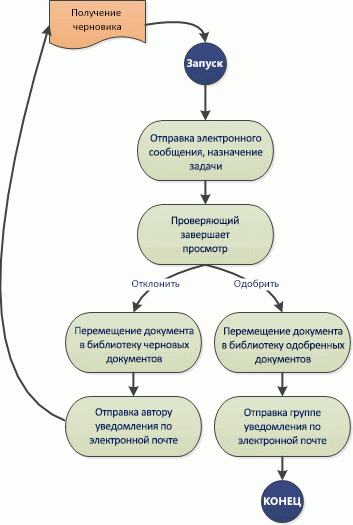
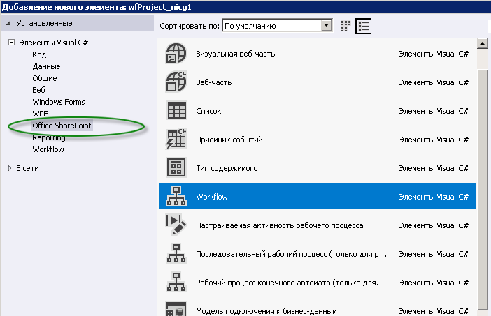
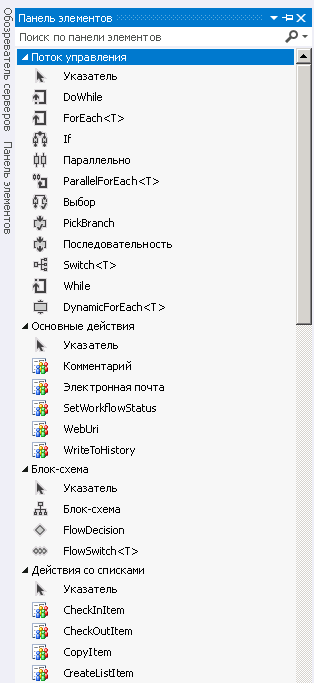

# Начало работы с рабочими процессами SharePointGet started with workflows in SharePoint
Информация о недавно разработанном Workflow Manager Client 1.0, который обеспечивает инфраструктуру для рабочих процессов в SharePoint и метод интеграции рабочих процессов SharePoint с новой Модель для надстроек SharePoint.Learn about the newly engineered Workflow Manager Client 1.0, which provides the infrastructure for workflows in SharePoint, and how SharePoint workflows are integrated with the new model for SharePoint Add-ins.
> **Важно!** Инструкции по установке и настройке SharePoint и Microsoft Azure см. в статье [Установка и настройка диспетчера рабочих процессов SharePoint](set-up-and-configure-sharepoint-workflow-manager.md).**Important** For instructions on setting up and configuring SharePoint Server 2013 and Microsoft Azure, see  [Set up and configure SharePoint Workflow Manager](set-up-and-configure-sharepoint-workflow-manager.md). 
  
    
    

## Обзор рабочего процесса в SharePointOverview of workflows in SharePoint

Рабочие процессы в SharePoint позволяют моделировать и автоматизировать бизнес-процессы. Эти процессы могут быть такими же простыми, как процесс утверждения документа одним утверждающим лицом (как показано на рис. 1), такими же сложными, как каталог товаров для клиентов, использующий вызовы веб-служб и поддержку базы данных, или такими же значительными, как практически любой структурированный бизнес-процесс, полный условий, циклов, входными данными пользователя, задачами и настраиваемыми действиями.Workflows in SharePoint allow you to model and automate business processes. These business processes can be as simple as a document approval process with a single approver (shown in Figure 1), as complex as customer-facing product catalog using web service calls and database support, or as formidable as virtually any structured business process, full of conditions, loops, user inputs, tasks, and custom actions.
  
    
    

**Рисунок 1. Простой рабочий процесс SharePoint****Figure 1. Simple SharePoint workflow**

  
    
    

  
    
    

  
    
    

  
    
    
SharePoint отмечает введение Workflow Manager Client 1.0 в качестве новой мощной платформы для рабочих процессов Visual Studio. Workflow Manager Client 1.0, созданный на Windows Workflow Foundation 4, имеет преимущества по сравнению с предыдущими версиями, которые отражают приверженность SharePoint к Модель для надстроек SharePoint и облачным вычислениям. Дополнительную информацию об этих изменениях можно посмотреть в статьях  [Что нового в рабочих процессах для SharePoint](what-s-new-in-workflows-for-sharepoint.md) и [Основные сведения о рабочих процессах в SharePoint](sharepoint-workflow-fundamentals.md).SharePoint marks the introduction of Workflow Manager Client 1.0 as the powerful new foundation for Visual Studio workflows. Build on Windows Workflow Foundation 4, Workflow Manager Client 1.0 provides advantages over previous versions that reflect the commitment of SharePoint to the model for SharePoint Add-ins and cloud-based computing. For details of these changes, see  [What's new in workflows for SharePoint](what-s-new-in-workflows-for-sharepoint.md) and [SharePoint workflow fundamentals](sharepoint-workflow-fundamentals.md).
  
    
    
Пожалуй, самым важным для разработчиков рабочих процессов является значительное усовершенствование и упрощение метода создания рабочих процессов. В настоящее время полностью декларативными (то есть на основе конструктора, а не кода) являются не только рабочие процессы, но и основные среды разработки рабочих процессов, такие как Visual Studio 2012 и SharePoint Designer 2013, которые были оптимизированы и упрощены.Perhaps most importantly for workflow authors, the way that your create workflows has been vastly improved and simplified. Not only are workflows now entirely declarative (that is, designer-based, no-code workflows), but the primary workflow authoring environments, both Visual Studio 2012 and SharePoint Designer 2013, have been simplified and streamlined.
  
    
    
Далее перечислены основные усовершенствования рабочих процессов в SharePoint. Более подробную информацию о новых возможностях рабочих процессов для SharePoint можно посмотреть в статье  [Что нового в рабочих процессах для SharePoint](what-s-new-in-workflows-for-sharepoint.md).The key enhancements to workflows in SharePoint include the following. For a more detail overview of what's new in workflows for SharePoint, see  [What's new in workflows for SharePoint](what-s-new-in-workflows-for-sharepoint.md).
  
    
    

- Расширенные возможности подключения к облачному выполнению рабочих процессов. В действительности в SharePoint между локальными рабочими процессами и рабочими процессами на основе Office 365 нет абсолютно никакой разницы.Enhanced connectivity to enable cloud-based execution of workflows. In fact, there is 100 percent parity in SharePoint between on-premises and Office 365 -based workflows.
    
  
- Рабочие процессы SharePoint 2010, которые включаются с помощью  [Взаимодействие рабочих процессов SharePoint ](sharepoint-workflow-fundamentals.md#bkm_InteropBridge), полностью совместимы в SharePoint.There is full interoperability in SharePoint with SharePoint 2010 workflows, which is enabled by using the  [SharePoint workflow interop ](sharepoint-workflow-fundamentals.md#bkm_InteropBridge).
    
  
- Расширенная выразительность разработки с помощью событий и действий Visual Studio, веб-служб и классических программных структур в декларативной среде без использования кода.Enhanced authoring expressiveness by using Visual Studio events and action, web services, and classic programming structures, all in a declarative, no-code environment.
    
  
- Масштабируемость и надежность, соответствующие требованиям для Office 365и модели облачных приложений.Scalability and robustness that is consistent with requirements for Office 365 and the Cloud App Model.
    
  
- Усовершенствованная надежность связи для повышения уровня высокофункциональных интегрированных систем. Возможность вызывать рабочие процессы и управлять или из любой внешней системы. Кроме того, рабочий процесс может выполнять вызовы веб-служб для любого потока или источника данных с помощью протоколов HTTP, SOAP, протокола передачи данных (OData) и представления репрезентативного состояния (REST).Enhanced connectivity to promote highly functional integrated systems. You can call and control your workflows from any external system. Additionally, your workflow can make web service calls to any stream or data source using common protocols like HTTP, SOAP, the Open Data protocol (OData), and Representational State Transfer (REST).
    
  
- Расширенные возможности разработки в SharePoint Designer 2013 для неспециалистов и возможность создания логики рабочих процессов в Visio.Enhanced authoring capabilities for the non-developer in SharePoint Designer 2013, and the ability to compose workflow logic in Visio.
    
  
- Улучшенная, но все же упрощенная разработка рабочих процессов в Visual Studio, включая поддержку для настраиваемых действий рабочих процессов, быстрая разработка в декларативной среде, развертка в один шаг и поддержка при разработке Надстройки SharePoint.Enhanced, and yet simplified, workflow development in Visual Studio, including support for custom workflow actions, rapid development in a declarative environment, single-step deployment, and support for developing SharePoint Add-ins.
    
  
- Полная поддержка для Надстройки SharePoint на базе рабочих процессов, где рабочие процессы выполняют функции среднего уровня управления бизнес-процессами.Full support for workflow-powered SharePoint Add-ins, where workflows function as the middle tier for business process management.
    
  

## Workflow Manager Client 1.0 и Модель для надстроек SharePointWorkflow Manager Client 1.0 and the model for SharePoint Add-ins

Visual Studio 2012 оптимизирован для разработки Надстройки SharePoint на основе рабочих процессов и использования огромной мощи и гибкости Модель для надстроек SharePoint. Вы можете использовать объектную модель рабочих процессов SharePoint, чтобы включить логику рабочих процессов в основу приложения SharePoint таким образом, что конечные пользователи будут взаимодействовать с поверхностью самого приложения, в то время как приложение будет работать за счет логики рабочих процессов.Visual Studio 2012 is optimized for developing workflow-driven SharePoint Add-ins and for exploiting the enormous power and flexibility of the model for SharePoint Add-ins. You can use the SharePoint workflow object model to enable workflow logic underneath a SharePoint app in such a way that end users experience the app surface itself while underneath the app is driven by your workflow logic.
  
    
    
Кроме того, Visual Studio 2012 идеально подходит для разработки Надстройки Office, которые могут запускать рабочие процессы изнутри приложения Microsoft Office.Additionally, Visual Studio 2012 is ideal for developing Office Add-ins, which can run workflows from inside a Microsoft Office application.
  
    
    

## Разработка рабочих процессов SharePointAuthoring SharePoint workflows

Существует две основные среды разработки для Workflow Manager Client 1.0: SharePoint Designer 2013 и Visual Studio. Кроме того, нетехнические работники могут использовать Visio, чтобы построить логику рабочего процесса, которую можно импортировать в SharePoint Designer и собрать в проект рабочего процесса SharePoint.There are two primary authoring environments for Workflow Manager Client 1.0: SharePoint Designer 2013 and Visual Studio. Additionally, non-technical information workers can use Visio to construct workflow logic that you can then import into SharePoint Designer and assemble into a SharePoint workflow project.
  
    
    
Тем не менее, основными средами разработки являются Visual Studio 2012 и SharePoint Designer 2013. Чтобы определить, какое из этих решений подойдет вам лучше всего, ознакомьтесь со сравнительной таблицей из раздела  [Сравнение SharePoint Designer с Visual Studio](develop-sharepoint-workflows-using-visual-studio.md#bkm_Comparing).However, the primary authoring environments are Visual Studio 2012 and SharePoint Designer 2013. To help you decide which of these best suits your needs, see the decision matrix in  [Comparing SharePoint Designer with Visual Studio](develop-sharepoint-workflows-using-visual-studio.md#bkm_Comparing).
  
    
    

## SharePoint Designer 2013 как средство разработки рабочих процессовSharePoint Designer 2013 as workflow authoring tool

Во многом SharePoint Designer 2013 является средством для разработки рабочих процессов SharePoint. Несмотря на то что некоторые расширенные задачи (например, создание дополнительных действий) требуют вмешательства со стороны разработчика с использованием Visual Studio, SharePoint Designer 2013 обеспечивает самый гибкий способ разработки рабочих процессов для самого широкого круга пользователей.In many respects, SharePoint Designer 2013 is the authoring tool of choice for SharePoint workflows. Although some advanced tasks (like creating custom actions, for example) require the intervention of a developer using Visual Studio, SharePoint Designer 2013 provides the most flexible access to workflow development to the widest range of workflow authors.
  
    
    

## Создание рабочего процесса с помощью Visual Studio 2012Create a workflow using Visual Studio 2012

Visual Studio 2012 имеет встроенные типы проектов рабочих процессов SharePoint. Чтобы создать проект рабочего процесса SharePoint в Visual Studio, выполните описанные ниже действия.Visual Studio 2012 has SharePoint workflow project types built in. To create a SharePoint workflow project in Visual Studio, follow these steps.
  
    
    

### Чтобы создать рабочий процесс с помощью Visual Studio:To create a workflow using Visual Studio

1. Откройте Visual Studio 2012 и создайте новый проект. В диалоговом окне **Создать проект** выберите пункт **Шаблоны**, **Visual C#**, **Office SharePoint**, **Решения SharePoint** и **Проект SharePoint**, как показано на рис. 2.Open Visual Studio 2012 and create a new project. In the **New Project** dialog box, choose **Templates**, **Visual C#**, **Office SharePoint**, **SharePoint Solutions**, and **SharePoint Project**, as shown in Figure 2.
    
   **Рисунок 2. Диалоговое окно "Создать проект"****Figure 2. New Project dialog box**

  

  
  

  

  
2. В созданном проекте выберите в меню **Проект** команду **Добавить новый элемент**, а затем выберите в разделе **Office SharePoint** пункт **Рабочий процесс**, как показано на рис. 3.With the project created, choose **Add New Item** on the **Project** menu, and then choose **Workflow** under the **Office SharePoint** item, as shown in Figure 3.
    
   **Рисунок 3. Диалоговое окно "Добавить новый элемент"****Figure 3. Add New Item dialog box**

  

  
  

  

  
3. После создания проекта рабочего процесса перед вами появится область конструктора для создания рабочего процесса. Среда разработки рабочего процесса содержит настраиваемую панель элементов с большим набором элементов разработки рабочего процесса.After the workflow project is created, you are presented with a designer surface on which to create your workflow. The workflow development environment includes a custom toolbox with a large palette of workflow authoring elements.
    
   **Рисунок 4. Панель инструментов разработки рабочего процесса в Visual Studio****Figure 4. Visual Studio workflow authoring toolbox**

  

  
  

  

  

## Дополнительные ресурсыAdditional resources

Более подробную информацию о **Надстройки SharePoint** можно найти в следующих статьях:For more information about **SharePoint Add-ins**, see the following:
  
    
    

-  [Надстройки SharePointSharePoint Add-ins](http://msdn.microsoft.com/library/cd1eda9e-8e54-4223-93a9-a6ea0d18df70%28Office.15%29.aspx)
    
  
-  [Что следует рассмотреть, прежде чем приступать к разработке надстроек SharePointThree ways to think about design options for SharePoint Add-ins](http://msdn.microsoft.com/library/0942fdce-3227-496a-8873-399fc1dbb72c%28Office.15%29.aspx)
    
  
-  [Важные аспекты архитектуры и разработки надстройки SharePointImportant aspects of the SharePoint Add-in architecture and development landscape](http://msdn.microsoft.com/library/ae96572b-8f06-4fd3-854f-fc312f7f2d88%28Office.15%29.aspx)
    
  
-  [Работа с внешними данными в SharePointWork with external data in SharePoint](http://msdn.microsoft.com/library/1534a5f4-1d83-45b4-9714-3a1995677d85%28Office.15%29.aspx)
    
  
Более подробную информацию о разработке рабочих процессов с использованием **Visual Studio 2012** и **SharePoint Designer 2013** можно найти в следующих статьях:For more information about developing workflows using **Visual Studio 2012** and **SharePoint Designer 2013**, see the following:
  
    
    

-  [Разработка рабочих процессов в SharePoint с помощью Visual StudioDevelop SharePoint workflows using Visual Studio](develop-sharepoint-workflows-using-visual-studio.md)
    
  
-  [Разработка рабочих процессов в SharePoint Designer и VisioWorkflow development in SharePoint Designer and Visio](workflow-development-in-sharepoint-designer-and-visio.md)
    
  
Более подобную информацию о Windows Workflow Foundation 4 можно найти в следующих статьях:For more information about Windows Workflow Foundation 4, see the following: 
  
    
    

-  
  [Краткое описание Windows Workflow Foundation (WF) в .NET 4 для разработчика](http://msdn.microsoft.com/ru-ru/library/ee342461.aspx)[A Developer's Introduction to Windows Workflow Foundation (WF) in .NET 4](http://msdn.microsoft.com/ru-ru/library/ee342461.aspx)
    
  
-  
  [Новые возможности в Windows Workflow Foundation](http://msdn.microsoft.com/ru-ru/library/dd489410%28v=vs.110%29.aspx)[What's New in Windows Workflow Foundation](http://msdn.microsoft.com/ru-ru/library/dd489410%28v=vs.110%29.aspx)
    
  
-  [Первые шаги с Windows Workflow FoundationBeginner's Guide to Windows Workflow Foundation](http://msdn.microsoft.com/en-us/netframework/first-steps-with-wf.aspx)
    
  
-  
  [Путь рабочего процесса. Общие сведения о Windows Workflow Foundation](http://msdn.microsoft.com/ru-ru/library/dd851337.aspx)[The Workflow Way: Understanding Windows Workflow Foundation](http://msdn.microsoft.com/ru-ru/library/dd851337.aspx)
    
  
-  
  [Общие сведения об обработчике правил для Windows Workflow Foundation](http://msdn.microsoft.com/ru-ru/library/dd554919.aspx)[Introduction to the Windows Workflow Foundation Rules Engine](http://msdn.microsoft.com/ru-ru/library/dd554919.aspx)
    
  
-  
  [Интеграция Windows Workflow Foundation и Windows Communication Foundation](http://msdn.microsoft.com/ru-ru/library/cc626077.aspx)[Windows Workflow Foundation integration with Windows Communication Foundation](http://msdn.microsoft.com/ru-ru/library/cc626077.aspx)
    
  

