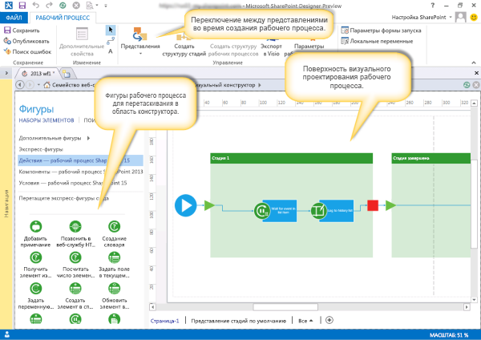

# Ознакомление с визуальным конструктором для рабочих процессов в SharePoint Designer 2013Getting familiar with Visual Designer for workflow in SharePoint Designer 2013
Изучите основные возможности визуального конструктора в SharePoint Designer 2013.Learn the basic features of the Visual Designer in SharePoint Designer 2013.
## Обзор визуального конструктора в SharePoint Designer 2013Overview of the Visual Designer in SharePoint Designer 2013

SharePoint Designer 2013 включает в себя новую поверхность разработки рабочего процесса  визуальный конструктор. С его помощью можно создавать рабочие процессы, перетаскивая фигур в область конструктора.SharePoint Designer 2013 includes a new workflow design surface called Visual Designer. You use Visual Designer to develop a workflow by dragging shapes onto the design surface.
  
    
    

> **Важно!** Для работы с визуальным конструктором приложение Visio профессиональный 2013 должно быть установлено на том же компьютере, что и SharePoint Designer 2013.**Important** In order to work with the Visual Designer, you must have Visio Professional 2013 installed on the same computer as SharePoint Designer 2013. If you do not have Visio installed you will receive an error, as shown in the figure. Если у вас не установлено приложение Visio, возникнет ошибка, как на приведенном ниже рисунке.In order to work with the Visual Designer, you must have vispro15short installed on the same computer as spd15short. If you do not have Visio installed you will receive an error, as shown in the figure. 
  
    
    

**Рисунок. Для работы с визуальным конструктором необходимо приложение Visio 2013 профессиональный****Figure: Visio 2013 Professional is required to work with Visual Designer**

  
    
    

  
    
    

  
    
    
Область **Фигуры** в левой части содержит фигуры рабочего процесса, которые можно перетаскивать в область конструктора для создания рабочего процесса. Ниже приведены три категории фигур, доступных для создания рабочего процесса.The **Shapes** pane on the left contains workflow shapes that you can drag to the design surface in order to create the workflow. Following are the three categories of shapes available for building a workflow.
  
    
    

- **Действия:** определенные действия, которые могут выполняться рабочим процессом. В числе примеров: вызов веб-службы HTTP, добавление комментария и обновление списка.**Actions:** Specific actions that can be performed by the workflow. Some examples include calling an HTTP web service, adding a comment, and updating a list.
    
  
- **Компоненты:** общие компоненты, которые можно добавить для реализации структурированной среды для действий рабочего процесса. В числе примеров: контейнер стадии, цикл с условиями и фигура начала рабочего процесса.**Components:** General components that can be added to provide a structured environment for workflow actions. Some examples include a stage container, a loop with conditions, and a start workflow shape.
    
  
- **Условия:** фигуры условной логики, которые можно использовать для предоставления пути рабочего процесса на основе определенных критериев. В числе примеров: проверка, равно ли одно значение другому, проверка того, является ли пользователь допустимым пользователем SharePoint, и проверка того, был ли элемент создан в определенном диапазоне дат.**Conditions:** Conditional logic shapes that can be used to provide a workflow path based on specific criteria. Some examples include checking if one value equals another value, checking if a person is a valid SharePoint user, and checking if an item is created within a specific date range.
    
  

    
> **Совет.** Полный список фигур, доступных в SharePoint Designer 2013, см. в статье [Фигуры в шаблонах рабочих процессов SharePoint Server в Visio](shapes-in-the-sharepoint-server-workflow-template-in-visio.md).**TIP** For a complete list of shapes available in SharePoint Designer 2013, see  [Shapes in the SharePoint Server workflow template in Visio](shapes-in-the-sharepoint-server-workflow-template-in-visio.md)
  
    
    

На этом рисунке показан рабочий процесс в визуальном конструкторе.The figure shows a workflow in Visual Designer.
  
    
    

**Визуальный конструктор в SharePoint Designer 2013****Visual Designer in SharePoint Designer 2013**

  
    
    

  
    
    

  
    
    

  
    
    

  
    
    

## Использование визуального конструктора в SharePointUsing the Visual Designer in SharePoint

Для доступа к визуальному конструктору в SharePoint Designer 2013 используется раскрывающееся меню "Представления" на вкладке **Рабочий процесс**. Существует три различных представления, которые можно использовать для создания рабочих процессов:The Visual Designer in SharePoint Designer 2013 is accessed through the Views drop-down menu of the **Workflow** tab. There are three different views that can be used for developing a workflow:
  
    
    

- **Текстовый конструктор:** текстовая среда разработки рабочих процессов.**Text-Based Designer:** A text-based workflow development environment.
    
  
- **Визуальный конструктор:** визуальная среда разработки рабочих процессов, где фигуры можно перетаскивать в область конструктора для создания рабочего процесса. (Требуется Visio профессиональный 2013.)**Visual Designer:** A visual workflow development environment where shapes can be dragged onto the design surface in order to develop the workflow. (Requires Visio Professional 2013)
    
  
- **Представление стадий:** высокоуровневое представление области визуального конструктора с отображением взаимодействия стадий рабочего процесса. Оно похоже на представление **визуального конструктора**, но без показа сведений на уровне фигур. (Требуется Visio профессиональный 2013.)**Stage View:** Provides a high-level view of the visual design surface by showing how stages of the workflow fit together. It is similar to the **Visual Designer** view but it does not show the shape-level detail. (Requires Visio Professional 2013)
    
  
Вы можете переключаться между **представлениями** в разделе **Управление** ленты **рабочего процесса**, как показано на рисунке.You can switch between **Views** in the **Manage** portion of the **Workflow** ribbon as shown in the figure.
  
    
    

**Переключение между представлениями конструктора в SharePoint Designer 2013****Switching between design views in SharePoint Designer 2013**

  
    
    

  
    
    

  
    
    
Рабочий процесс можно создать в текстовом конструкторе, визуальном конструкторе или используя оба средства. Например, если вы создаете рабочий процесс с помощью текстового конструктора, можно переключиться на представление визуального конструктора и продолжить создание того же рабочего процесса. Подобным образом можно также начать в визуальном конструкторе, а затем переключиться в текстовый конструктор и продолжить разработку. Перемещение между представлениями обеспечивает гибкость при создании рабочих процессов.A workflow can be developed in either the Text-Based Designer or the Visual Designer or both. For example, if you are developing a workflow by using the Text-Based Designer you can switch the view to the Visual Designer and continue to develop the same workflow. Likewise, you can also begin developing a workflow by using the Visual Designer and then switch the view to the Text-Based Designer and continue to develop the same workflow. Moving back and forth between views provides flexibility in workflow development.
  
    
    

## Дополнительные ресурсыAdditional resources

-  [Рабочий процесс в SharePointWorkflow in SharePoint ](http://technet.microsoft.com/en-us/sharepoint/jj556245.aspx)
    
  
-  [Новые возможности рабочих процессов SharePointWhat's new in workflow in SharePoint Server 2013](http://msdn.microsoft.com/library/6ab8a28b-fa2f-4530-8b55-a7f663bf15ea.aspx)
    
  
-  [Начало работы с рабочими процессами SharePointGetting started with SharePoint Server 2013 workflow](http://msdn.microsoft.com/library/cc73be76-a329-449f-90ab-86822b1c2ee8.aspx)
    
  
-  [Разработка рабочих процессов в SharePoint Designer и VisioWorkflow development in SharePoint Designer and Visio](workflow-development-in-sharepoint-designer-and-visio.md)
    
  
-  [Краткий справочник по действиям рабочего процесса (платформа рабочих процессов в SharePoint)Workflow actions quick reference (SharePoint Workflow platform)](workflow-actions-quick-reference-sharepoint-workflow-platform.md)
    
  

