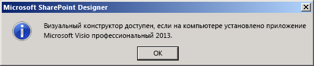

# Ознакомление с визуальным конструктором для рабочих процессов в SharePoint Designer 2013
Изучите основные возможности визуального конструктора в SharePoint Designer 2013.
## Обзор визуального конструктора в SharePoint Designer 2013

SharePoint Designer 2013 включает в себя новую поверхность разработки рабочего процесса  визуальный конструктор. С его помощью можно создавать рабочие процессы, перетаскивая фигур в область конструктора.
  
    
    

> **Важно!** Для работы с визуальным конструктором приложение Visio профессиональный 2013 должно быть установлено на том же компьютере, что и SharePoint Designer 2013. Если у вас не установлено приложение Visio, возникнет ошибка, как на приведенном ниже рисунке. 
  
    
    

**Рисунок. Для работы с визуальным конструктором необходимо приложение Visio 2013 профессиональный**

  
    
    

  
    
    

  
    
    
Область **Фигуры** в левой части содержит фигуры рабочего процесса, которые можно перетаскивать в область конструктора для создания рабочего процесса. Ниже приведены три категории фигур, доступных для создания рабочего процесса.
  
    
    

- **Действия:** определенные действия, которые могут выполняться рабочим процессом. В числе примеров: вызов веб-службы HTTP, добавление комментария и обновление списка.
    
  
- **Компоненты:** общие компоненты, которые можно добавить для реализации структурированной среды для действий рабочего процесса. В числе примеров: контейнер стадии, цикл с условиями и фигура начала рабочего процесса.
    
  
- **Условия:** фигуры условной логики, которые можно использовать для предоставления пути рабочего процесса на основе определенных критериев. В числе примеров: проверка, равно ли одно значение другому, проверка того, является ли пользователь допустимым пользователем SharePoint, и проверка того, был ли элемент создан в определенном диапазоне дат.
    
  

    
> **Совет.** Полный список фигур, доступных в SharePoint Designer 2013, см. в статье [Фигуры в шаблонах рабочих процессов SharePoint Server в Visio](shapes-in-the-sharepoint-server-workflow-template-in-visio.md).
  
    
    

На этом рисунке показан рабочий процесс в визуальном конструкторе.
  
    
    

**Визуальный конструктор в SharePoint Designer 2013**

  
    
    

  
    
    

  
    
    

  
    
    

  
    
    

## Использование визуального конструктора в SharePoint

Для доступа к визуальному конструктору в SharePoint Designer 2013 используется раскрывающееся меню "Представления" на вкладке **Рабочий процесс**. Существует три различных представления, которые можно использовать для создания рабочих процессов:
  
    
    

- **Текстовый конструктор:** текстовая среда разработки рабочих процессов.
    
  
- **Визуальный конструктор:** визуальная среда разработки рабочих процессов, где фигуры можно перетаскивать в область конструктора для создания рабочего процесса. (Требуется Visio профессиональный 2013.)
    
  
- **Представление стадий:** высокоуровневое представление области визуального конструктора с отображением взаимодействия стадий рабочего процесса. Оно похоже на представление **визуального конструктора**, но без показа сведений на уровне фигур. (Требуется Visio профессиональный 2013.)
    
  
Вы можете переключаться между **представлениями** в разделе **Управление** ленты **рабочего процесса**, как показано на рисунке.
  
    
    

**Переключение между представлениями конструктора в SharePoint Designer 2013**

  
    
    

  
    
    

  
    
    
Рабочий процесс можно создать в текстовом конструкторе, визуальном конструкторе или используя оба средства. Например, если вы создаете рабочий процесс с помощью текстового конструктора, можно переключиться на представление визуального конструктора и продолжить создание того же рабочего процесса. Подобным образом можно также начать в визуальном конструкторе, а затем переключиться в текстовый конструктор и продолжить разработку. Перемещение между представлениями обеспечивает гибкость при создании рабочих процессов.
  
    
    

## Дополнительные ресурсы

-  [Рабочий процесс в SharePoint](http://technet.microsoft.com/en-us/sharepoint/jj556245.aspx)
    
  
-  [Новые возможности рабочих процессов SharePoint](http://msdn.microsoft.com/library/6ab8a28b-fa2f-4530-8b55-a7f663bf15ea.aspx)
    
  
-  [Начало работы с рабочими процессами SharePoint](http://msdn.microsoft.com/library/cc73be76-a329-449f-90ab-86822b1c2ee8.aspx)
    
  
-  [Разработка рабочих процессов в SharePoint Designer и Visio](workflow-development-in-sharepoint-designer-and-visio.md)
    
  
-  [Краткий справочник по действиям рабочего процесса (платформа рабочих процессов в SharePoint)](workflow-actions-quick-reference-sharepoint-workflow-platform.md)
    
  

