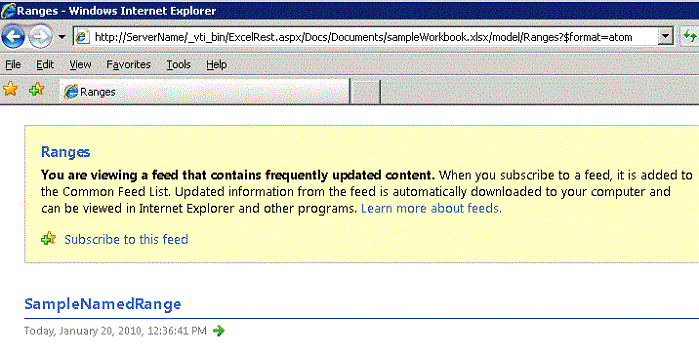
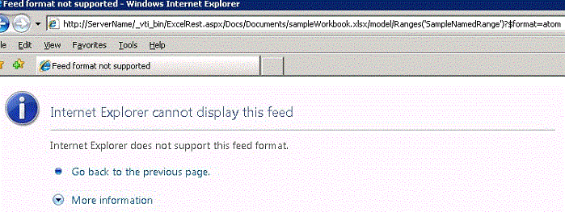

# <a name="getting-ranges-using-atom-feed-and-html-fragment"></a>Получение диапазонов с помощью канала Atom и HTML-фрагмента

В этом разделе описываются два способа доступа к диапазонов — канала Atom и HTML-фрагмента, с помощью API-Интерфейс REST в Службы Excel.
  
    
    


> **Примечание:** API REST служб Excel применяется к SharePoint и SharePoint 2016 локально. Для образовательных учреждений Office 365, бизнеса и корпоративных учетных записей используйте Excel API-интерфейсы REST, входящих в состав [Microsoft Graph](http://graph.microsoft.io/en-us/docs/api-reference/v1.0/resources/excel
> ) конечной точки.
  
    
    


## <a name="accessing-ranges"></a>Доступ к диапазонов

API-Интерфейс REST в Службы Excel поддерживает два механизма получение диапазонов. Первый используется главным образом для включения приложений для ко необработанные данные книги, то есть, чисел или значениями, полученными из листа. Второй — для получения фрагментов HTML из в браузере.
  
    
    
Как описано в разделе  [Обнаружение в API REST служб Excel](discovery-in-excel-services-rest-api.md) , — это URL-адрес REST на страницу модели с помощью обнаружения:
  
    
    


```

http://<ServerName>/_vti_bin/ExcelRest.aspx/<DocumentLibrary>/<FileName>/model
```

Таким образом, для книги с помощью файла имя сохраняется в **sampleWorkbook.xlsx** <code> http:// <i>\<ServerName\></i> </code>, вот URI на страницу модели:
  
    
    


```
http://<ServerName>/_vti_bin/ExcelRest.aspx/Docs/Documents/sampleWorkbook.xlsx/model
```

С помощью механизма обнаружения, описанных в  [Обнаружение в API REST служб Excel](discovery-in-excel-services-rest-api.md), если вы щелкаете канала на странице модели на сервере ( `http://` _<ServerName>_ `/_vti_bin/ExcelRest.aspx/Docs/Documents/sampleWorkbook.xlsx/model`), Atom **диапазонов** отображает страницу, которая отображает всех именованных диапазонов в книге. SampleWorkbook.xlsx содержит один именованный диапазон, **SampleNamedRange**, как показано на следующем снимке экрана: 
  
    
    

> **Важные:** Также можно указать произвольный диапазонов и не только диапазоны, возвращаемые обнаружения. Двоеточие «:» должен быть заменен «|». Использовать, например «A1 | G5» вместо «Запись a1: G5». 
  
    
    


> **Примечание:** Знаки, такие как «?» и «#» не поддерживаются. Для правильной ссылки имена листов, которые содержат специальные символы, основная рекомендация — это «see клиент Excel не» при обращении формулу для таблицы с помощью специальных символов и следуйте этого примера. 
  
    
    


**Обнаружение именованного диапазона REST служб Excel**

  
    
    

  
    
    

  
    
    

### <a name="accessing-ranges-by-using-an-atom-feed"></a>Доступ к диапазонов с помощью Atom веб-канала

Если **SampleNamedRange** нажмите на странице обнаружения диапазона, который последовательно выберите пункты следующий URL-адрес:
  
    
    

```
http://<ServerName>/_vti_bin/ExcelRest.aspx/Docs/Documents/sampleWorkbook.xlsx/model/Ranges('SampleNamedRange')?$format=atom
```

Обратите внимание, что в Internet Explorer страница с результатами выглядит как ошибка, как показано на следующем снимке экрана.
  
    
    

**Обнаружение диапазона REST служб Excel с использованием Atom**

  
    
    

  
    
    

  
    
    
Internet Explorer не удается показать одной операции элемента веб-канала Atom. Однако просмотр источник страницы показан XML-код, что веб-канала активности элемента содержит:
  
    
    


```XML
<?xml version="1.0" encoding="utf-8"?>
<entry xmlns:x="http://schemas.microsoft.com/office/2008/07/excelservices/rest" xmlns:d="http://schemas.microsoft.com/ado/2007/08/dataservice" xmlns:m="http://schemas.microsoft.com/ado/2007/08/dataservices/metadata" xmlns="http://www.w3.org/2005/Atom">
  <title type="text">SampleNamedRange</title>
  <id>http://ServerName/_vti_bin/ExcelRest.aspx/Docs/Documents/sampleWorkbook.xlsx/model/Ranges('SampleNamedRange')</id>
  <updated>2010-01-20T21:28:10Z</updated>
  <author>
    <name />
  </author>
  <link rel="self" href="http://ServerName/_vti_bin/ExcelRest.aspx/Docs/Documents/sampleWorkbook.xlsx/model/Ranges('SampleNamedRange')?$format=atom" title="SampleNamedRange" />
  <category term="ExcelServices.Range" scheme="http://schemas.microsoft.com/ado/2007/08/dataservices/scheme" />
  <content type="application/xml">
    <x:range name="SampleNamedRange">
      <x:row>
        <x:c>
          <x:fv>Performance</x:fv>
        </x:c>
        <x:c>
          <x:v>26</x:v>
          <x:fv>26</x:fv>
        </x:c>
        <x:c />
      </x:row>
      <x:row>
        <x:c>
          <x:fv>Employment</x:fv>
        </x:c>
        <x:c>
          <x:v>42</x:v>
          <x:fv>42</x:fv>
        </x:c>
        <x:c />
      </x:row>
      <x:row>
        <x:c>
          <x:fv>Earnings And Job Quality</x:fv>
        </x:c>
        <x:c>
          <x:v>22</x:v>
          <x:fv>22</x:fv>
        </x:c>
        <x:c />
      </x:row>
    ... XML truncated for brevity. 
      <x:row>
        <x:c>
          <x:fv>Innovation Assets</x:fv>
        </x:c>
        <x:c>
          <x:v>43</x:v>
          <x:fv>43</x:fv>
        </x:c>
        <x:c />
      </x:row>
      <x:row>
        <x:c />
        <x:c>
          <x:fv>State</x:fv>
        </x:c>
        <x:c />
      </x:row>
    </x:range>
  </content>
</entry>
```

Веб-канала активности элемент содержит XML, представляющий данные внутри диапазона. Ниже перечислены элементы XML интересов. 
  
    
    

- **<range>**Элемент range. Представляет контейнер возвращаемого диапазона.
    
  
- **<row>**Элемент row. Представляет каждую строку в диапазоне.
    
  
- **<c>**Элемент ячейки. Представляет каждой ячейки в строке.
    
  
- **<fv>**Элемент форматированное значение. Представляет значение формата в Excel. Если значение типа String в книге, элемент форматированное значение является единственным элементом в разделе **<c>**. 
    
  
- **<v>**Значение элемента. Представляет числовое значение. Если значение в ячейке номер, а не строкой, значение элемента содержит эти сведения.
    
  
С помощью XML предоставляет простой способ получения данных из диапазона Excel, которые можно использовать в приложении. 
  
    
    

### <a name="accessing-ranges-by-using-html"></a>Доступ к диапазонов с помощью HTML

Если вы откроете URL-адрес для доступа к именованному диапазону с помощью канала Atom, обратите внимание на то, что конечная часть URL-адрес содержит параметр с именем  `$format`, который имеет значение  `atom`. Кроме того, этот параметр может принимать значение  `html`. Если изменить значение  `atom` на `html`, URL-адрес возвращает фрагмент HTML-кода вместо канала Atom. Ниже приведен пример URL-адреса:
  
    
    

```

http://<ServerName>/_vti_bin/ExcelRest.aspx/Docs/Documents/sampleWorkbook.xlsx/model/Ranges('SampleNamedRange')?$format=html
```

В Internet Explorer странице выглядит примерно на следующем рисунке.
  
    
    

> **Примечание:** В этом HTML-код может использоваться непосредственно в элемент **IFRAME**или его можно использовать в JavaScript для создания более удобный. 
  
    
    


  
    
    

  
    
    

  
    
    

  
    
    

## <a name="see-also"></a>См. также


#### <a name="concepts"></a>Основные понятия


  
    
    
 [Ресурсы URI для интерфейса API REST служб Excel](resources-uri-for-excel-services-rest-api.md)
