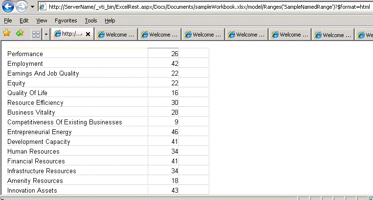

# <a name="getting-ranges-using-atom-feed-and-html-fragment"></a><span data-ttu-id="c575a-102">Получение диапазонов с помощью канала Atom и HTML-фрагмента</span><span class="sxs-lookup"><span data-stu-id="c575a-102">Getting Ranges Using Atom Feed and HTML Fragment</span></span>

<span data-ttu-id="c575a-103">В этом разделе описываются два способа доступа к диапазонов — канала Atom и HTML-фрагмента, с помощью API-Интерфейс REST в Службы Excel.</span><span class="sxs-lookup"><span data-stu-id="c575a-103">This topic describes two ways to access ranges—Atom feed and HTML fragment, by using the REST API in Excel Services.</span></span>
  
    
    


> <span data-ttu-id="c575a-104">**Примечание:** API REST служб Excel применяется к SharePoint и SharePoint 2016 локально.</span><span class="sxs-lookup"><span data-stu-id="c575a-104">**Note:** The Excel Services REST API applies to SharePoint and SharePoint 2016 on-premises.</span></span> <span data-ttu-id="c575a-105">Для образовательных учреждений Office 365, бизнеса и корпоративных учетных записей используйте Excel API-интерфейсы REST, входящих в состав [Microsoft Graph](http://graph.microsoft.io/ru-ru/docs/api-reference/v1.0/resources/excel
> ) конечной точки.</span><span class="sxs-lookup"><span data-stu-id="c575a-105">For Office 365 Education, Business, and Enterprise accounts, use the Excel REST APIs that are part of the  [Microsoft Graph](http://graph.microsoft.io/ru-ru/docs/api-reference/v1.0/resources/excel
) endpoint.</span></span>
  
    
    


## <a name="accessing-ranges"></a><span data-ttu-id="c575a-106">Доступ к диапазонов</span><span class="sxs-lookup"><span data-stu-id="c575a-106">Accessing Ranges</span></span>

<span data-ttu-id="c575a-p102">API-Интерфейс REST в Службы Excel поддерживает два механизма получение диапазонов. Первый используется главным образом для включения приложений для ко необработанные данные книги, то есть, чисел или значениями, полученными из листа. Второй — для получения фрагментов HTML из в браузере.</span><span class="sxs-lookup"><span data-stu-id="c575a-p102">The REST API in Excel Services supports two mechanisms for getting ranges. The first is used mainly to enable applications to get to the raw-data of a workbook, that is, the raw numbers or values from a worksheet. The second is to get HTML fragments from inside a browser.</span></span>
  
    
    
<span data-ttu-id="c575a-110">Как описано в разделе  [Обнаружение в API REST служб Excel](discovery-in-excel-services-rest-api.md) , — это URL-адрес REST на страницу модели с помощью обнаружения:</span><span class="sxs-lookup"><span data-stu-id="c575a-110">As described in the  [Discovery in Excel Services REST API](discovery-in-excel-services-rest-api.md) topic, the REST URL to the model page using discovery is:</span></span>
  
    
    


```

http://<ServerName>/_vti_bin/ExcelRest.aspx/<DocumentLibrary>/<FileName>/model
```

<span data-ttu-id="c575a-111">Таким образом, для книги с помощью файла имя сохраняется в **sampleWorkbook.xlsx** <code> http:// <i>\<ServerName\></i> </code>, вот URI на страницу модели:</span><span class="sxs-lookup"><span data-stu-id="c575a-111">Therefore, for a workbook with the file name **sampleWorkbook.xlsx** that is saved to <code>http://<i>\<ServerName\></i>/Docs/Documents/sampleWorkbook.xlsx</code>, following is the URI to the model page:</span></span>
  
    
    


```
http://<ServerName>/_vti_bin/ExcelRest.aspx/Docs/Documents/sampleWorkbook.xlsx/model
```

<span data-ttu-id="c575a-p103">С помощью механизма обнаружения, описанных в  [Обнаружение в API REST служб Excel](discovery-in-excel-services-rest-api.md), если вы щелкаете канала на странице модели на сервере ( `http://` _<ServerName>_ `/_vti_bin/ExcelRest.aspx/Docs/Documents/sampleWorkbook.xlsx/model`), Atom **диапазонов** отображает страницу, которая отображает всех именованных диапазонов в книге. SampleWorkbook.xlsx содержит один именованный диапазон, **SampleNamedRange**, как показано на следующем снимке экрана:</span><span class="sxs-lookup"><span data-stu-id="c575a-p103">Using the discovery mechanism described in  [Discovery in Excel Services REST API](discovery-in-excel-services-rest-api.md), if you click on the **Ranges** Atom feed on the model page on the server, ( `http://` _<ServerName>_ `/_vti_bin/ExcelRest.aspx/Docs/Documents/sampleWorkbook.xlsx/model`), it displays a page that shows all the named ranges in the workbook. The sampleWorkbook.xlsx contains one named range, **SampleNamedRange**, as shown in the following screen shot:</span></span> 
  
    
    

> <span data-ttu-id="c575a-114">**Важные:** Также можно указать произвольный диапазонов и не только диапазоны, возвращаемые обнаружения.</span><span class="sxs-lookup"><span data-stu-id="c575a-114">**Important:** You can also specify arbitrary ranges, and not just the ranges returned by discovery.</span></span> <span data-ttu-id="c575a-115">Двоеточие «:» должен быть заменен «|».</span><span class="sxs-lookup"><span data-stu-id="c575a-115">Colon ":" must be replaced with "|".</span></span> <span data-ttu-id="c575a-116">Использовать, например «A1 | G5» вместо «Запись a1: G5».</span><span class="sxs-lookup"><span data-stu-id="c575a-116">For example use "A1|G5" instead of "A1:G5".</span></span> 
  
    
    


> <span data-ttu-id="c575a-117">**Примечание:** Знаки, такие как «?» и «#» не поддерживаются.</span><span class="sxs-lookup"><span data-stu-id="c575a-117">**Note:** Characters like "?" and "#" are unsupported.</span></span> <span data-ttu-id="c575a-118">Для правильной ссылки имена листов, которые содержат специальные символы, основная рекомендация — это «see клиент Excel не» при обращении формулу для таблицы с помощью специальных символов и следуйте этого примера.</span><span class="sxs-lookup"><span data-stu-id="c575a-118">To correctly reference sheet names that contain special characters, the basic guideline is "see what the Excel client does" when referencing a formula to a sheet with special characters and follow that example.</span></span> 
  
    
    


<span data-ttu-id="c575a-119">**Обнаружение именованного диапазона REST служб Excel**</span><span class="sxs-lookup"><span data-stu-id="c575a-119">**Excel Services REST named range discovery**</span></span>

  
    
    

  
    
    

  
    
    

### <a name="accessing-ranges-by-using-an-atom-feed"></a><span data-ttu-id="c575a-121">Доступ к диапазонов с помощью Atom веб-канала</span><span class="sxs-lookup"><span data-stu-id="c575a-121">Accessing Ranges by Using an Atom Feed</span></span>

<span data-ttu-id="c575a-122">Если **SampleNamedRange** нажмите на странице обнаружения диапазона, который последовательно выберите пункты следующий URL-адрес:</span><span class="sxs-lookup"><span data-stu-id="c575a-122">If you click **SampleNamedRange** in the range discovery page, you navigate to the following URL:</span></span>
  
    
    

```
http://<ServerName>/_vti_bin/ExcelRest.aspx/Docs/Documents/sampleWorkbook.xlsx/model/Ranges('SampleNamedRange')?$format=atom
```

<span data-ttu-id="c575a-123">Обратите внимание, что в Internet Explorer страница с результатами выглядит как ошибка, как показано на следующем снимке экрана.</span><span class="sxs-lookup"><span data-stu-id="c575a-123">Note that, in Internet Explorer, the resulting page looks like an error, as shown in the following screen shot.</span></span>
  
    
    

<span data-ttu-id="c575a-124">**Обнаружение диапазона REST служб Excel с использованием Atom**</span><span class="sxs-lookup"><span data-stu-id="c575a-124">**Excel Services REST range discovery using Atom**</span></span>

  
    
    

  
    
    

  
    
    
<span data-ttu-id="c575a-p106">Internet Explorer не удается показать одной операции элемента веб-канала Atom. Однако просмотр источник страницы показан XML-код, что веб-канала активности элемента содержит:</span><span class="sxs-lookup"><span data-stu-id="c575a-p106">Internet Explorer cannot show a single-entry Atom feed item. But viewing the source of the page shows the XML that the feed item contains:</span></span>
  
    
    


```XML
<?xml version="1.0" encoding="utf-8"?>
<entry xmlns:x="http://schemas.microsoft.com/office/2008/07/excelservices/rest" xmlns:d="http://schemas.microsoft.com/ado/2007/08/dataservice" xmlns:m="http://schemas.microsoft.com/ado/2007/08/dataservices/metadata" xmlns="http://www.w3.org/2005/Atom">
  <title type="text">SampleNamedRange</title>
  <id>http://ServerName/_vti_bin/ExcelRest.aspx/Docs/Documents/sampleWorkbook.xlsx/model/Ranges('SampleNamedRange')</id>
  <updated>2010-01-20T21:28:10Z</updated>
  <author>
    <name />
  </author>
  <link rel="self" href="http://ServerName/_vti_bin/ExcelRest.aspx/Docs/Documents/sampleWorkbook.xlsx/model/Ranges('SampleNamedRange')?$format=atom" title="SampleNamedRange" />
  <category term="ExcelServices.Range" scheme="http://schemas.microsoft.com/ado/2007/08/dataservices/scheme" />
  <content type="application/xml">
    <x:range name="SampleNamedRange">
      <x:row>
        <x:c>
          <x:fv>Performance</x:fv>
        </x:c>
        <x:c>
          <x:v>26</x:v>
          <x:fv>26</x:fv>
        </x:c>
        <x:c />
      </x:row>
      <x:row>
        <x:c>
          <x:fv>Employment</x:fv>
        </x:c>
        <x:c>
          <x:v>42</x:v>
          <x:fv>42</x:fv>
        </x:c>
        <x:c />
      </x:row>
      <x:row>
        <x:c>
          <x:fv>Earnings And Job Quality</x:fv>
        </x:c>
        <x:c>
          <x:v>22</x:v>
          <x:fv>22</x:fv>
        </x:c>
        <x:c />
      </x:row>
    ... XML truncated for brevity. 
      <x:row>
        <x:c>
          <x:fv>Innovation Assets</x:fv>
        </x:c>
        <x:c>
          <x:v>43</x:v>
          <x:fv>43</x:fv>
        </x:c>
        <x:c />
      </x:row>
      <x:row>
        <x:c />
        <x:c>
          <x:fv>State</x:fv>
        </x:c>
        <x:c />
      </x:row>
    </x:range>
  </content>
</entry>
```

<span data-ttu-id="c575a-p107">Веб-канала активности элемент содержит XML, представляющий данные внутри диапазона. Ниже перечислены элементы XML интересов.</span><span class="sxs-lookup"><span data-stu-id="c575a-p107">The feed item contains XML that represents the data inside the range. Following are the XML elements of interest:</span></span> 
  
    
    

- <span data-ttu-id="c575a-130">**<range>**Элемент range.</span><span class="sxs-lookup"><span data-stu-id="c575a-130">**<range>** The range element.</span></span> <span data-ttu-id="c575a-131">Представляет контейнер возвращаемого диапазона.</span><span class="sxs-lookup"><span data-stu-id="c575a-131">Represents the container of the returned range.</span></span>
    
  
- <span data-ttu-id="c575a-132">**<row>**Элемент row.</span><span class="sxs-lookup"><span data-stu-id="c575a-132">**<row>** The row element.</span></span> <span data-ttu-id="c575a-133">Представляет каждую строку в диапазоне.</span><span class="sxs-lookup"><span data-stu-id="c575a-133">Represents each row in the range.</span></span>
    
  
- <span data-ttu-id="c575a-134">**<c>**Элемент ячейки.</span><span class="sxs-lookup"><span data-stu-id="c575a-134">**<c>** The cell element.</span></span> <span data-ttu-id="c575a-135">Представляет каждой ячейки в строке.</span><span class="sxs-lookup"><span data-stu-id="c575a-135">Represents each cell in a row.</span></span>
    
  
- <span data-ttu-id="c575a-136">**<fv>**Элемент форматированное значение.</span><span class="sxs-lookup"><span data-stu-id="c575a-136">**<fv>** The formatted value element.</span></span> <span data-ttu-id="c575a-137">Представляет значение формата в Excel.</span><span class="sxs-lookup"><span data-stu-id="c575a-137">Represents the value as it is formatted by Excel.</span></span> <span data-ttu-id="c575a-138">Если значение типа String в книге, элемент форматированное значение является единственным элементом в разделе **<c>**.</span><span class="sxs-lookup"><span data-stu-id="c575a-138">If the value is of type string in the workbook, the formatted value element is the only element under **<c>**.</span></span> 
    
  
- <span data-ttu-id="c575a-139">**<v>**Значение элемента.</span><span class="sxs-lookup"><span data-stu-id="c575a-139">**<v>** The value element.</span></span> <span data-ttu-id="c575a-140">Представляет числовое значение.</span><span class="sxs-lookup"><span data-stu-id="c575a-140">Represents a number value.</span></span> <span data-ttu-id="c575a-141">Если значение в ячейке номер, а не строкой, значение элемента содержит эти сведения.</span><span class="sxs-lookup"><span data-stu-id="c575a-141">If the value in the cell is a number instead of a string, the value element contains that information.</span></span>
    
  
<span data-ttu-id="c575a-142">С помощью XML предоставляет простой способ получения данных из диапазона Excel, которые можно использовать в приложении.</span><span class="sxs-lookup"><span data-stu-id="c575a-142">Using XML gives you an easier way to get data out of an Excel range so that you can use it in your application.</span></span> 
  
    
    

### <a name="accessing-ranges-by-using-html"></a><span data-ttu-id="c575a-143">Доступ к диапазонов с помощью HTML</span><span class="sxs-lookup"><span data-stu-id="c575a-143">Accessing Ranges by Using HTML</span></span>

<span data-ttu-id="c575a-p113">Если вы откроете URL-адрес для доступа к именованному диапазону с помощью канала Atom, обратите внимание на то, что конечная часть URL-адрес содержит параметр с именем  `$format`, который имеет значение  `atom`. Кроме того, этот параметр может принимать значение  `html`. Если изменить значение  `atom` на `html`, URL-адрес возвращает фрагмент HTML-кода вместо канала Atom. Ниже приведен пример URL-адреса:</span><span class="sxs-lookup"><span data-stu-id="c575a-p113">If you look at the URL to access a named range by using Atom feed, note that the final part of the URL contains a parameter called  `$format`, which is set to  `atom`. This parameter can also take the value of  `html`. If you change the  `atom` value to `html`, the URL returns an HTML fragment instead of an Atom feed. Following is an example of the URL:</span></span>
  
    
    

```

http://<ServerName>/_vti_bin/ExcelRest.aspx/Docs/Documents/sampleWorkbook.xlsx/model/Ranges('SampleNamedRange')?$format=html
```

<span data-ttu-id="c575a-148">В Internet Explorer странице выглядит примерно на следующем рисунке.</span><span class="sxs-lookup"><span data-stu-id="c575a-148">In Internet Explorer, the page looks similar to the following figure.</span></span>
  
    
    

> <span data-ttu-id="c575a-149">**Примечание:** В этом HTML-код может использоваться непосредственно в элемент **IFRAME**или его можно использовать в JavaScript для создания более удобный.</span><span class="sxs-lookup"><span data-stu-id="c575a-149">**Note:** This HTML can be directly consumed in an **IFRAME**, or it can be used in JavaScript to create a more seamless experience.</span></span> 
  
    
    


  
    
    

  
    
    

  
    
    

  
    
    

## <a name="see-also"></a><span data-ttu-id="c575a-151">См. также</span><span class="sxs-lookup"><span data-stu-id="c575a-151">See also</span></span>


#### <a name="concepts"></a><span data-ttu-id="c575a-152">Основные понятия</span><span class="sxs-lookup"><span data-stu-id="c575a-152">Concepts</span></span>


  
    
    
 [<span data-ttu-id="c575a-153">Ресурсы URI для интерфейса API REST служб Excel</span><span class="sxs-lookup"><span data-stu-id="c575a-153">Resources URI for Excel Services REST API</span></span>](resources-uri-for-excel-services-rest-api.md)
