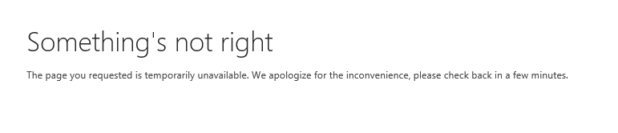
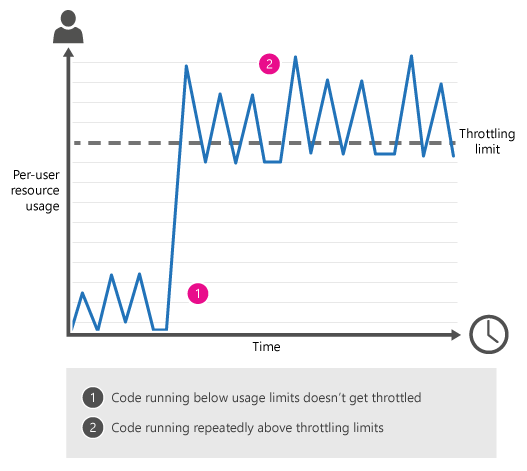
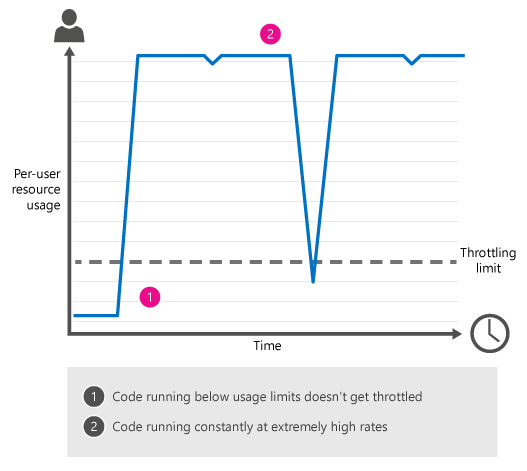

# <a name="avoid-getting-throttled-or-blocked-in-sharepoint-online"></a><span data-ttu-id="b0644-102">Избегайте начало регулирование или заблокированные в SharePoint Online</span><span class="sxs-lookup"><span data-stu-id="b0644-102">Avoid getting throttled or blocked in SharePoint Online</span></span>
<span data-ttu-id="b0644-103">Узнайте о регулирования в SharePoint Online и узнайте, как избежать регулирование или заблокирован.</span><span class="sxs-lookup"><span data-stu-id="b0644-103">Find out about throttling in SharePoint Online, and learn how to avoid being throttled or blocked.</span></span> <span data-ttu-id="b0644-104">Включает пример кода CSOM и REST, которые можно использовать для упрощения задачи.</span><span class="sxs-lookup"><span data-stu-id="b0644-104">Includes sample CSOM and REST code you can use to make your task easier.</span></span>

-  [<span data-ttu-id="b0644-105">Что такое регулирование?</span><span class="sxs-lookup"><span data-stu-id="b0644-105">What is throttling?</span></span>](how-to-avoid-getting-throttled-or-blocked-in-sharepoint-online.md#BKMK_Whatisthrottling)

-  [<span data-ttu-id="b0644-106">Общие сценарии регулирования в SharePoint Online</span><span class="sxs-lookup"><span data-stu-id="b0644-106">Common throttling scenarios in SharePoint Online</span></span>](how-to-avoid-getting-throttled-or-blocked-in-sharepoint-online.md#BKMK_Commonthrottlingscenarios)

-  [<span data-ttu-id="b0644-107">Почему не удается вы только что Расскажите мне точное ограничения полосы пропускания?</span><span class="sxs-lookup"><span data-stu-id="b0644-107">Why can't you just tell me the exact throttling limits?</span></span>](how-to-avoid-getting-throttled-or-blocked-in-sharepoint-online.md#BKMK_Whycantyoujusttellmetheexactthrottlinglimits)

-  [<span data-ttu-id="b0644-108">Рекомендации по обработке регулирования</span><span class="sxs-lookup"><span data-stu-id="b0644-108">Best practices to handle throttling</span></span>](how-to-avoid-getting-throttled-or-blocked-in-sharepoint-online.md#BKMK_Bestpracticestohandlethrottling)
    
- [<span data-ttu-id="b0644-109">Как для оформления трафик во избежание получения регулирование?</span><span class="sxs-lookup"><span data-stu-id="b0644-109">How to decorate your traffic to avoid getting throttled?</span></span>](how-to-avoid-getting-throttled-or-blocked-in-sharepoint-online.md#BKMK_DecorateSharePointOnlineThrottling)
  
-  [<span data-ttu-id="b0644-110">Примеры кода репозиториев CSOM: SharePoint Online регулирования</span><span class="sxs-lookup"><span data-stu-id="b0644-110">GitHub CSOM code samples: SharePoint Online Throttling</span></span>](how-to-avoid-getting-throttled-or-blocked-in-sharepoint-online.md#BKMK_GitHubCSOMandRESTcodesamplesSharePointOnlineThrottling)
    
  
-  [<span data-ttu-id="b0644-111">Что делать, если блокируются в SharePoint Online ?</span><span class="sxs-lookup"><span data-stu-id="b0644-111">What should you do if you get blocked in SharePoint Online?</span></span>](how-to-avoid-getting-throttled-or-blocked-in-sharepoint-online.md#BKMK_Whatshouldyoudoifyougetblocked)
    
  
-  [<span data-ttu-id="b0644-112">Дополнительные ресурсы</span><span class="sxs-lookup"><span data-stu-id="b0644-112">Additional resources</span></span>](how-to-avoid-getting-throttled-or-blocked-in-sharepoint-online.md#BKMK_Additionalresources)

<span data-ttu-id="b0644-p102">Не похоже на этом? Трассировка запускается процесс CSOM — например, для переноса файлов в SharePoint Online -, но оставьте начало регулирование. Или более того, вы получите полностью заблокировано. Что происходит и что можно сделать, чтобы сделать его остановить?</span><span class="sxs-lookup"><span data-stu-id="b0644-p102">Does this sound familiar? You're running a CSOM process - for example, to migrate files in SharePoint Online - but you keep getting throttled. Or even worse, you get completely blocked. What's going on and what can you do to make it stop?</span></span>
  
## <a name="what-is-throttling"></a><span data-ttu-id="b0644-117">Что такое регулирование?</span><span class="sxs-lookup"><span data-stu-id="b0644-117">What is throttling?</span></span>
<span data-ttu-id="b0644-118"><a name="BKMK_Whatisthrottling"> </a></span><span class="sxs-lookup"><span data-stu-id="b0644-118"><a name="BKMK_Whatisthrottling"> </a></span></span>

<span data-ttu-id="b0644-p103">для обеспечения оптимальной производительности и надежности службы SharePoint OnlineSharePoint Online использует регулирования. Пределы регулирования количество пользовательских действий или одновременных звонков (с скриптах или программах) для предотвращения чрезмерного использования ресурсов.</span><span class="sxs-lookup"><span data-stu-id="b0644-p103">SharePoint Online uses throttling to maintain optimal performance and reliability of the SharePoint Online service. Throttling limits the number of user actions or concurrent calls (by script or code) to prevent overuse of resources.</span></span>
  
<span data-ttu-id="b0644-p104">С другой стороны, очень редко пользователю получить ограничением в SharePoint Online. Службу надежную, и он предназначен для обработки очень большой поток. Если вы получите ограничением, 99% времени его из-за пользовательского кода. Это не означает, что не другие способы получения ограничением, только что они являются реже. Например включается 10 машины и иметь клиент синхронизации, перейдя на все 10. На каждом синхронизируйте 1 ТБ содержимого. Это получили бы вы регулирование.</span><span class="sxs-lookup"><span data-stu-id="b0644-p104">That said, it is extremely rare for a user to get throttled in SharePoint Online. The service is robust, and it is designed to handle very high volume. If you do get throttled, 99% of the time it is because of custom code. That doesn't mean that there aren't other ways to get throttled, just that they are less common. For example you spin up 10 machines and have a sync client going on all 10. On each sync 1TB of content. This would likely get you throttled.</span></span>
  


  
### <a name="what-happens-when-you-get-throttled-in-sharepoint-online"></a><span data-ttu-id="b0644-129">Что происходит при получения ограничением в SharePoint Online ?</span><span class="sxs-lookup"><span data-stu-id="b0644-129">What happens when you get throttled in SharePoint Online?</span></span>

<span data-ttu-id="b0644-p105">Когда пользователь превышает ограничения на использование, SharePoint Online регулировки все последующие запросы из этой учетной записи пользователя в течение короткого периода. Все действия пользователя подвергаются регулированию время повтора.</span><span class="sxs-lookup"><span data-stu-id="b0644-p105">When a user exceeds usage limits, SharePoint Online throttles any further requests from that user account for a short period. All user actions are throttled while the throttle is in effect.</span></span>
  
- <span data-ttu-id="b0644-132">Для запросов, которые пользователь должен выполнить непосредственно в браузере SharePoint Online перенаправляет пользователя на страницу регулирования сведения и запросы завершиться с ошибкой.</span><span class="sxs-lookup"><span data-stu-id="b0644-132">For requests that a user performs directly in the browser, SharePoint Online redirects you to the throttling information page, and the requests fail.</span></span>
  
- <span data-ttu-id="b0644-133">Для всех остальных запросах, включая вызовы REST или CSOM, SharePoint Online возвращает код состояния HTTP 429 ("слишком много запросов"), и запросы завершиться с ошибкой.</span><span class="sxs-lookup"><span data-stu-id="b0644-133">For all other requests, including CSOM or REST calls, SharePoint Online returns HTTP status code 429 ("Too many requests"), and the requests fail.</span></span>
  
<span data-ttu-id="b0644-p106">Если процесс оскорбительного продолжает превышает ограничения на использование, SharePoint Online может полностью заблокировать процесса; в этом случае может появиться код состояния HTTP 503 ("Служба недоступна"), и мы будем напоминания о том, блокировки в центре сообщений Office 365. Ниже показан сообщение об ошибке.</span><span class="sxs-lookup"><span data-stu-id="b0644-p106">If the offending process continues to exceed usage limits, SharePoint Online might completely block the process; in this case, you may see HTTP status code 503 ("Service unavailable"), and we'll notify you of the block in the Office 365 Message Center. The error message is shown below:</span></span>
      

      
<span data-ttu-id="b0644-137">503 Сервер недоступен, сообщение.</span><span class="sxs-lookup"><span data-stu-id="b0644-137">503 Server unavailable message.</span></span>

## <a name="common-throttling-scenarios-in-sharepoint-online"></a><span data-ttu-id="b0644-138">Общие сценарии регулирования в SharePoint Online</span><span class="sxs-lookup"><span data-stu-id="b0644-138">Common throttling scenarios in SharePoint Online</span></span>
<span data-ttu-id="b0644-139"><a name="BKMK_Commonthrottlingscenarios"> </a></span><span class="sxs-lookup"><span data-stu-id="b0644-139"><a name="BKMK_Commonthrottlingscenarios"> </a></span></span>

<span data-ttu-id="b0644-140">Самые распространенные причины регулирования в SharePoint Online пользователей являются клиентской объектной модели (CSOM) или представлений состояния (REST) кода, который выполняет слишком много действий слишком часто.</span><span class="sxs-lookup"><span data-stu-id="b0644-140">The most common causes of per-user throttling in SharePoint Online are client-side object model (CSOM) or Representational State Transfer (REST) code that performs too many actions too frequently.</span></span>
    

- <span data-ttu-id="b0644-141">**Случайные трафика**</span><span class="sxs-lookup"><span data-stu-id="b0644-141">**Sporadic traffic**</span></span>
    
    <span data-ttu-id="b0644-142">Не достаточно трафика в любой момент времени, но достаточно со временем, на котором запущен и выходить из нее, регулирование эпизодическое образом.</span><span class="sxs-lookup"><span data-stu-id="b0644-142">Not a lot of traffic at any one time, but enough over time that you run in and out of throttling in an episodic way.</span></span>
    
  - <span data-ttu-id="b0644-p107">Например, после перенос файлов SharePoint Online, можно запустить настраиваемый скрипт REST или CSOM обновление метаданных на файлы. Сценарий CSOM/REST выполняется обновление большое число файлов в очень высокая частота, который запускает регулирования. Аналогично графического пользовательского интерфейса автозаполнения, с помощью службы REST, выполнение слишком большого числа вызовов в списки во время работы каждого конечного пользователя, может вызвать появление регулирования, в зависимости от того, какие другие операции занимающих ресурсы в то же время.</span><span class="sxs-lookup"><span data-stu-id="b0644-p107">For example, after migrating files to SharePoint Online, you run a custom CSOM or REST script to update metadata on the files. The CSOM/REST script is updating a large number of files at a very high frequency, which triggers throttling. Similarly, an autocomplete UI widget using REST services, making too many calls to lists during each end user operation, may also cause throttling, depending on what other operations are consuming resources at the same time.</span></span>
    
  
  
- <span data-ttu-id="b0644-147">**Много избыточных элементов трафика**</span><span class="sxs-lookup"><span data-stu-id="b0644-147">**Overwhelming traffic**</span></span>
    
    <span data-ttu-id="b0644-148">Один процесс значительно превышает регулирования ограничения постоянно, в течение длительного времени.</span><span class="sxs-lookup"><span data-stu-id="b0644-148">A single process dramatically exceeds throttling limits, continually, over a long time period.</span></span>
    
  - <span data-ttu-id="b0644-p108">Веб-службы используются для формирования средство для синхронизации свойств профиля пользователя. Средство обновляет свойства профиля пользователя на основе сведений из бизнес-системы отдела кадров (HR) (LOB). Средство выполняет вызовы в слишком высокая частота.</span><span class="sxs-lookup"><span data-stu-id="b0644-p108">You used web services to build a tool to synchronize user profile properties. The tool updates user profile properties based on information from your line-of-business (LOB) human resources (HR) system. The tool makes calls at too high a frequency.</span></span>
  
  - <span data-ttu-id="b0644-p109">Запуске сценария нагрузочного тестирования на SharePoint Online и получение регулирование. Не допускается SharePoint Online нагрузочного тестирования.</span><span class="sxs-lookup"><span data-stu-id="b0644-p109">You're running a load-testing script on SharePoint Online and you get throttled. Load testing is not allowed on SharePoint Online.</span></span>
  
  - <span data-ttu-id="b0644-p110">Настроить сайта группы на SharePoint Online, например, путем добавления индикатор состояния на домашней странице. Этот индикатор состояния обновляет часто, которая приводит к слишком большого числа звонков в службу SharePoint Online страницы — это инициирующую регулирования.</span><span class="sxs-lookup"><span data-stu-id="b0644-p110">You customized your team site on SharePoint Online, for example, by adding a status indicator on the Home page. This status indicator updates frequently, which causes the page to make too many calls to the SharePoint Online service - this triggered throttling.</span></span>
    
  
  
## <a name="why-cant-you-just-tell-me-the-exact-throttling-limits"></a><span data-ttu-id="b0644-157">Почему не удается вы только что Расскажите мне точное ограничения полосы пропускания?</span><span class="sxs-lookup"><span data-stu-id="b0644-157">Why can't you just tell me the exact throttling limits?</span></span>
<span data-ttu-id="b0644-158"><a name="BKMK_Whycantyoujusttellmetheexactthrottlinglimits"> </a></span><span class="sxs-lookup"><span data-stu-id="b0644-158"><a name="BKMK_Whycantyoujusttellmetheexactthrottlinglimits"> </a></span></span>

<span data-ttu-id="b0644-p111">Настройка и публикация точное регулирование ограничивает очень просто звуки, но на самом деле это не лучший способ перехода. Мы постоянно отслеживать использование ресурсов на SharePoint Online. В зависимости от использования мы точной пороговые значения, поэтому пользователи могут использовать максимальное количество ресурсов без снижения надежности и производительности SharePoint Online. Вот почему это важно для вашего кода CSOM или REST для включения добавочного назад для обработки регулирования; Это позволяет максимально быстро запуск каждый день кода и пассивный режим «только что достаточно» позволяет коду, если достигает ограничения полосы пропускания. Примеры кода далее в этой статье показано, как использовать добавочного пассивный режим.</span><span class="sxs-lookup"><span data-stu-id="b0644-p111">Setting and publishing exact throttling limits sounds very straightforward, but in fact, it's not the best way to go. We continually monitor resource usage on SharePoint Online. Depending on usage, we fine-tune thresholds so users can consume the maximum number of resources without degrading the reliability and performance of SharePoint Online. That's why it's so important for your CSOM or REST code to include incremental back off to handle throttling; this lets your code run as fast as possible on any given day, and it lets your code back off "just enough" if it hits throttling limits. The code samples later in this article show you how to use incremental back off.</span></span>

## <a name="best-practices-to-handle-throttling"></a><span data-ttu-id="b0644-164">Рекомендации по обработке регулирования</span><span class="sxs-lookup"><span data-stu-id="b0644-164">Best practices to handle throttling</span></span>
<span data-ttu-id="b0644-165"><a name="BKMK_Bestpracticestohandlethrottling"> </a></span><span class="sxs-lookup"><span data-stu-id="b0644-165"><a name="BKMK_Bestpracticestohandlethrottling"> </a></span></span>

- <span data-ttu-id="b0644-166">Уменьшите количество операций в запросе</span><span class="sxs-lookup"><span data-stu-id="b0644-166">Reduce the number of operations per request</span></span>
    
- <span data-ttu-id="b0644-167">Уменьшить частоту звонков</span><span class="sxs-lookup"><span data-stu-id="b0644-167">Reduce the frequency of calls</span></span>
    
- <span data-ttu-id="b0644-168">Оформление трафика, поэтому мы знаем, которые (в разделе на трафик оформления рекомендация Подробнее об этом ниже)</span><span class="sxs-lookup"><span data-stu-id="b0644-168">Decorate your traffic so we know who you are (see section on traffic decoration best practice more on that below)</span></span>
    
<span data-ttu-id="b0644-169">При выполнении в регулирования, мы рекомендуем добавочного пассивный режим для уменьшения числа и частота вызовов до более регулировка отсутствует.</span><span class="sxs-lookup"><span data-stu-id="b0644-169">If you do run into throttling, we recommend incremental back off to reduce the number and frequency of calls until no more throttling occurs.</span></span>

<span data-ttu-id="b0644-p112">Между повторными попытками перед повторением для выполнения кода, который был регулирование ожидает добавочного пассивный использует постепенно больше времени. Примеры кода репозиториев, можно использовать далее в этой статье, записываются как методы расширения для добавления добавочного назад код.</span><span class="sxs-lookup"><span data-stu-id="b0644-p112">Incremental back off uses progressively longer waits between retries before trying again to run the code that was throttled. You can use the GitHub code samples, later in this article, written as extension methods, to add incremental back off to your code.</span></span>
    
<span data-ttu-id="b0644-p113">Резервное является быстрым способом для обработки ограничением, так как SharePoint Online по-прежнему производится для записи в журнал использования ресурсов во время применяется регулирование пользователя. Другими словами агрессивные повторных попыток работать в вы, потому что несмотря на то, что вызовы с ошибкой, они по-прежнему улучшаются от ограничения на использование. Быстрее пассивный режим, тем быстрее будет остановлено, превышающие ограничения на использование.</span><span class="sxs-lookup"><span data-stu-id="b0644-p113">Backing off is the fastest way to handle being throttled because SharePoint Online continues to log resource usage while a user is being throttled. In other words, aggressive retries work against you because even though the calls fail, they still accrue against your usage limits. The faster you back off, the faster you'll stop exceeding usage limits.</span></span> 

<span data-ttu-id="b0644-175">For information about ways to monitor your SharePoint Online activity, see  [Diagnosing performance issues with SharePoint Online](https://support.office.com/en-us/article/3c364f9e-b9f6-4da4-a792-c8e8c8cd2e86).</span><span class="sxs-lookup"><span data-stu-id="b0644-175">For information about ways to monitor your SharePoint Online activity, see  [Diagnosing performance issues with SharePoint Online](https://support.office.com/en-us/article/3c364f9e-b9f6-4da4-a792-c8e8c8cd2e86).</span></span>

<span data-ttu-id="b0644-176">For a broader discussion of throttling on the Microsoft Cloud, see  [Throttling Pattern](http://msdn.microsoft.com/library/4baf5af2-32fc-47ab-8569-3e5c59a5ebd5.aspx).</span><span class="sxs-lookup"><span data-stu-id="b0644-176">For a broader discussion of throttling on the Microsoft Cloud, see  [Throttling Pattern](http://msdn.microsoft.com/library/4baf5af2-32fc-47ab-8569-3e5c59a5ebd5.aspx).</span></span>

## <a name="how-to-decorate-your-http-traffic-to-avoid-throttling"></a><span data-ttu-id="b0644-177">Как для оформления http-трафика во избежание регулирование?</span><span class="sxs-lookup"><span data-stu-id="b0644-177">How to decorate your http traffic to avoid throttling?</span></span>
<span data-ttu-id="b0644-178"><a name="BKMK_DecorateSharePointOnlineThrottling"> </a></span><span class="sxs-lookup"><span data-stu-id="b0644-178"></span></span>

<span data-ttu-id="b0644-179">Для обеспечения высокого уровня доступности, может регулирование некоторых трафика.</span><span class="sxs-lookup"><span data-stu-id="b0644-179">To ensure and maintain high-availability, some traffic may be throttled.</span></span> <span data-ttu-id="b0644-180">Регулирование происходит при работоспособности системы — речь, а одно из условий, используемые для регулирования — оформления трафика, который влияет на непосредственно на определение приоритетов трафика.</span><span class="sxs-lookup"><span data-stu-id="b0644-180">Throttling happens when system health is at stake and one of the criteria used for throttling is traffic decoration, which impacts directly on the prioritization of the traffic.</span></span> <span data-ttu-id="b0644-181">Также внутреннего трафика приоритетов через трафика, который не параметризованные должным образом.</span><span class="sxs-lookup"><span data-stu-id="b0644-181">Well decorated traffic will be prioritized over traffic which is not properly decorated.</span></span>
 
<span data-ttu-id="b0644-182">Что такое определение упрощенного трафика?</span><span class="sxs-lookup"><span data-stu-id="b0644-182">What is definition of undecorated traffic?</span></span>

- <span data-ttu-id="b0644-183">Трафик упрощенного, если строка не AppID/AppTitle или агент пользователя в вызове API-Интерфейс REST или CSOM к SharePoint Online.</span><span class="sxs-lookup"><span data-stu-id="b0644-183">Traffic is undecorated if there is no AppID/AppTitle or User Agent string in CSOM or REST API call to SharePoint Online.</span></span>

<span data-ttu-id="b0644-184">Какие существуют рекомендации?</span><span class="sxs-lookup"><span data-stu-id="b0644-184">What are the recommendation?</span></span>

- <span data-ttu-id="b0644-185">При создании приложения, рекомендуется зарегистрировать и использовать AppID и AppTitle — это обеспечит наиболее возможности различных клиентов и наиболее путь для любого решения будущих проблем.</span><span class="sxs-lookup"><span data-stu-id="b0644-185">If you have created an application, recommendation is to register and use  AppID and AppTitle – This will ensure the best overall experience and best path for any future issue resolution.</span></span> <span data-ttu-id="b0644-186">Также включать данные строка агента пользователя как определено в следующем шаге.</span><span class="sxs-lookup"><span data-stu-id="b0644-186">Include also the User Agent string information as defined in following step.</span></span>

- <span data-ttu-id="b0644-187">Необходимо указать строка агента пользователя при вызове API SharePoint с помощью следующих соглашение об именовании</span><span class="sxs-lookup"><span data-stu-id="b0644-187">Make sure to include User Agent string in your API call to SharePoint with following naming convention</span></span>

| <span data-ttu-id="b0644-188">Тип</span><span class="sxs-lookup"><span data-stu-id="b0644-188">Type</span></span>  | <span data-ttu-id="b0644-189">Агент пользователя</span><span class="sxs-lookup"><span data-stu-id="b0644-189">User Agent</span></span>  | <span data-ttu-id="b0644-190">Описание</span><span class="sxs-lookup"><span data-stu-id="b0644-190">Description</span></span>   |
|---|---|---|
| <span data-ttu-id="b0644-191">Приложения независимых поставщиков программных Продуктов</span><span class="sxs-lookup"><span data-stu-id="b0644-191">ISV Application</span></span> | <span data-ttu-id="b0644-192">Независимых поставщиков программных Продуктов & #124; CompanyName & #124; AppName и версии</span><span class="sxs-lookup"><span data-stu-id="b0644-192">ISV&#124;CompanyName&#124;AppName/Version</span></span> | <span data-ttu-id="b0644-193">Определить в качестве независимых поставщиков программных Продуктов и включать название компании, имя приложения, разделенных символом конвейеризации, а затем добавляя номер версии, разделенных точкой с косой черты</span><span class="sxs-lookup"><span data-stu-id="b0644-193">Identify as ISV and include Company Name, App Name separated by a pipe character and then adding Version number separated with a slash character</span></span>  |
| <span data-ttu-id="b0644-194">Корпоративного приложения</span><span class="sxs-lookup"><span data-stu-id="b0644-194">Enterprise application</span></span> | <span data-ttu-id="b0644-195">NONISV & #124; CompanyName & #124; AppName и версии</span><span class="sxs-lookup"><span data-stu-id="b0644-195">NONISV&#124;CompanyName&#124;AppName/Version</span></span> | <span data-ttu-id="b0644-196">Определить в качестве NONISV и включать название компании, имя приложения, разделенных символом конвейеризации, а затем добавляя номер версии, разделенных точкой с косой черты</span><span class="sxs-lookup"><span data-stu-id="b0644-196">Identify as NONISV and include Company Name, App Name separated by a pipe character and then adding Version number separated with a slash character</span></span> |

- <span data-ttu-id="b0644-197">При создании собственного библиотеки JavaScript, которые используются для вызова API-интерфейсов SharePoint Online, убедитесь в том, включают сведения агента пользователя http-запрос и потенциально Регистрация веб-приложения также как приложение, где подходящее.</span><span class="sxs-lookup"><span data-stu-id="b0644-197">If you are building your own JavaScript libraries, which are used to call SharePoint Online APIs, make sure that you include the User Agent information to your http request and potentially register your web application also as an Application, where suitable.</span></span>

> [!NOTE]
> <span data-ttu-id="b0644-198">Формат строка агента пользователя ожидается выполните [RFC2616](http://www.ietf.org/rfc/rfc2616.txt), так что произведите выполните копирование выше рекомендации на правом разделителей.</span><span class="sxs-lookup"><span data-stu-id="b0644-198">Format of the  user agent string is expected to follow [RFC2616](http://www.ietf.org/rfc/rfc2616.txt), so please follow up on the above guidance on the right separators.</span></span> <span data-ttu-id="b0644-199">Также дает возможность добавлять существующие строка агента пользователя с запрошенные данные.</span><span class="sxs-lookup"><span data-stu-id="b0644-199">It is also fine to append existing user agent string with the requested information.</span></span>

### <a name="example-of-decorating-traffic-with-user-agent-when-using-client-side-object-model-csom"></a><span data-ttu-id="b0644-200">Пример оформления трафика с помощью агента пользователя, при использовании модели объектов со стороны клиента (CSOM)</span><span class="sxs-lookup"><span data-stu-id="b0644-200">Example of decorating traffic with User agent when using Client Side Object Model (CSOM)</span></span>

```cs
// Get access to source site
using (var ctx = new ClientContext("https://contoso.sharepoint.com/sites/team"))
{
    //Provide account and pwd for connecting to SharePoint Online
    var passWord = new SecureString();
    foreach (char c in pwd.ToCharArray()) passWord.AppendChar(c);
    ctx.Credentials = new SharePointOnlineCredentials("contoso@contoso.onmicrosoft.com", passWord);

    // Add our User Agent information
    ctx.ExecutingWebRequest += delegate (object sender, WebRequestEventArgs e)
    {
        e.WebRequestExecutor.WebRequest.UserAgent = "NONISV|Contoso|GovernanceCheck/1.0";
    };
                
    // Normal CSOM Call with custom User-Agent information
    Web site = ctx.Web;
    ctx.Load(site);
    ctx.ExecuteQuery();
}
```

### <a name="example-of-decorating-traffic-with-user-agent-when-using-rest-apis"></a><span data-ttu-id="b0644-201">Пример оформления трафика с помощью агента пользователя, при использовании API-интерфейсы REST</span><span class="sxs-lookup"><span data-stu-id="b0644-201">Example of decorating traffic with User agent when using REST APIs</span></span>

<span data-ttu-id="b0644-202">Следующий пример является форматом c#, но аналогичные сведения агента пользователя, рекомендуется использовать даже для библиотеки JavaScript, используемые на страницах SharePoint Online.</span><span class="sxs-lookup"><span data-stu-id="b0644-202">Following sample is in c# format, but the similar User Agent information is recommended to be used even for the JavaScript libraries used in the SharePoint Online pages.</span></span>

```cs
HttpWebRequest endpointRequest = (HttpWebRequest)HttpWebRequest.Create(sharepointUrl.ToString() + "/_api/web/lists");
endpointRequest.Method = "GET";
endpointRequest.UserAgent = "NONISV|Contoso|GovernanceCheck/1.0";
endpointRequest.Accept = "application/json;odata=verbose";
endpointRequest.Headers.Add("Authorization", "Bearer " + accessToken);
HttpWebResponse endpointResponse = (HttpWebResponse)endpointRequest.GetResponse();
```


## <a name="github-csom-code-samples-sharepoint-online-throttling"></a><span data-ttu-id="b0644-203">Примеры кода репозиториев CSOM: SharePoint Online регулирования</span><span class="sxs-lookup"><span data-stu-id="b0644-203">GitHub CSOM code samples: SharePoint Online Throttling</span></span>
<span data-ttu-id="b0644-204"><a name="BKMK_GitHubCSOMandRESTcodesamplesSharePointOnlineThrottling"> </a></span><span class="sxs-lookup"><span data-stu-id="b0644-204"></span></span>

 <span data-ttu-id="b0644-p117">[CoreThrottling](https://github.com/OfficeDev/PnP/tree/dev/Samples/Core.Throttling) в [Office 365 для разработчиков шаблонов и рекомендациям репозитория ](http://github.com/OfficeDev/PnP) приведен пример кода, в котором показывается добавочного пассивный метод. Эта технология требует минимальной изменений в коде.</span><span class="sxs-lookup"><span data-stu-id="b0644-p117">[CoreThrottling](https://github.com/OfficeDev/PnP/tree/dev/Samples/Core.Throttling) in the [Office 365 Developer Patterns and Practices repository ](http://github.com/OfficeDev/PnP) is a code sample that demonstrates the incremental back off technique. The technique requires minimal changes to your code.</span></span>
  
    
    
<span data-ttu-id="b0644-207">Прежде чем запускать этот пример кода:</span><span class="sxs-lookup"><span data-stu-id="b0644-207">Before you run this code sample:</span></span>
  
    
    

- <span data-ttu-id="b0644-208">Откройте **файл Program.cs** и введите следующие сведения в **методе**:</span><span class="sxs-lookup"><span data-stu-id="b0644-208">Open **Program.cs** and enter the following information in the **Main** method:</span></span>
    
  - <span data-ttu-id="b0644-209">Учетные данные учетной записи разработчика Office 365.</span><span class="sxs-lookup"><span data-stu-id="b0644-209">Your Office 365 Developer account credentials.</span></span>
    
  
  - <span data-ttu-id="b0644-210">URL-адрес вашего сайта разработчика Office 365.</span><span class="sxs-lookup"><span data-stu-id="b0644-210">The URL of your Office 365 Developer Site.</span></span>
    
  
  - <span data-ttu-id="b0644-211">Имя тестовой библиотеке документов на вашем сайте разработчика Office 365.</span><span class="sxs-lookup"><span data-stu-id="b0644-211">The name of a test document library on your Office 365 Developer Site.</span></span>
    
  
- <span data-ttu-id="b0644-212">В случае об ошибке, указывающее, является недопустимым, что файл **App.Config**, перейдите в **Окне Обозреватель решений** щелкните правой кнопкой мыши **файл App.config** и выберите команду **Исключить из проекта**.</span><span class="sxs-lookup"><span data-stu-id="b0644-212">If you receive an error stating that the **App.Config** file is invalid, go to **Solution Explorer**, right click **App.config**, and choose **Exclude From Project**.</span></span>
    
  
 <span data-ttu-id="b0644-p118">**Core.Throttling** работает как консольное приложение, с помощью политики авторизации только для пользователя, которая означает, что в этом примере кода используется разрешения текущего пользователя. В методе **Main** в файле Program.cs цикла while повторно создает вложенные папки в библиотеке документов, тестирования. Затем вызов **ctx. ExecuteQueryWithExponentialRetry**, который использует CSOM для выполнения метода **ExecuteQuery**. **ExecuteQueryWithExponentialRetry** — это метод расширения на объект [ClientContext](https://msdn.microsoft.com/library/office/microsoft.sharepoint.client.clientcontext%28v=office.15%29.aspx) и определены в **ClientContextExtension.cs**.</span><span class="sxs-lookup"><span data-stu-id="b0644-p118">**Core.Throttling** runs as a console application using a user-only authorization policy, which means this code sample uses the permissions of the current user. In the **Main** method in Program.cs, a while loop repeatedly creates new folders in the test document library. A call is then made to **ctx.ExecuteQueryWithExponentialRetry**, which uses CSOM to perform the **ExecuteQuery** method. **ExecuteQueryWithExponentialRetry** is an extension method on the [ClientContext](https://msdn.microsoft.com/library/office/microsoft.sharepoint.client.clientcontext%28v=office.15%29.aspx) object, and is defined in **ClientContextExtension.cs**.</span></span>
  

<span data-ttu-id="b0644-217">Если SharePoint Online регулировки оператор **ExecuteQuery**, **ExecuteQueryWithIncrementalRetry** запускает добавочного пассивный метод с:</span><span class="sxs-lookup"><span data-stu-id="b0644-217">If SharePoint Online throttles the **ExecuteQuery** statement, **ExecuteQueryWithIncrementalRetry** starts the incremental back off technique by:</span></span>

- <span data-ttu-id="b0644-p119">Перехват **веб-исключение** и проверке **HttpWebResponse.StatusCode**. Если SharePoint Online регулирование оператор **ExecuteQuery**, **HttpWebResponse.StatusCode** — 429.</span><span class="sxs-lookup"><span data-stu-id="b0644-p119">Catching a **WebException** and checking the **HttpWebResponse.StatusCode**. If SharePoint Online throttled the **ExecuteQuery** statement, the **HttpWebResponse.StatusCode** is 429.</span></span>

- <span data-ttu-id="b0644-220">Текущий поток приостанавливается для периода, указанного в **backoffInterval**.</span><span class="sxs-lookup"><span data-stu-id="b0644-220">The current thread is suspended for the period specified in **backoffInterval**.</span></span>

- <span data-ttu-id="b0644-p120">При возобновлении текущего потока **backoffInterval** удваивается и увеличивается количество повторных попыток выполнить ( **retryAttempts** ). С удвоения **backoffInterval** кода приостанавливается активности на длительный период времени перед повторным выполнением кода, который был применяется регулирование SharePoint Online.</span><span class="sxs-lookup"><span data-stu-id="b0644-p120">When the current thread resumes, the **backoffInterval** is doubled and the number of retries performed ( **retryAttempts** ) is incremented. By doubling **backoffInterval** your code suspends activity for a longer period of time before retrying the code that was throttled by SharePoint Online.</span></span>

- <span data-ttu-id="b0644-223">Процесс повторяется до оператора **ExecuteQuery** выполнена успешно, либо превысила число разрешенных повторов ( **retryCount** ).</span><span class="sxs-lookup"><span data-stu-id="b0644-223">The process is repeated until either the **ExecuteQuery** statement is successful, or the number of allowed retries ( **retryCount** ) is exceeded.</span></span>

### <a name="csom-code-sample-incremental-back-off-and-retry-calls-executequerywithincrementalretry-method-later-in-this-article"></a><span data-ttu-id="b0644-224">Пример кода CSOM: добавочного пассивный и повторите попытку (вызывает метод ExecuteQueryWithIncrementalRetry далее в этой статье)</span><span class="sxs-lookup"><span data-stu-id="b0644-224">CSOM Code sample: Incremental back off and retry (calls ExecuteQueryWithIncrementalRetry method, later in this article)</span></span>

```

using (var ctx = new ClientContext(serverUrl))
       {
           //Provide account and pwd for connecting to the source
           var passWord = new SecureString();
           foreach (char c in password.ToCharArray()) passWord.AppendChar(c);
           ctx.Credentials = new SharePointOnlineCredentials(login, passWord);
            try
           {
               int number = 0;
               // This loop will be executed 1000 times, which will cause throttling to occur
               while (number < 1000)
               {
                   // Try to create new folder based on Ticks to the given list as an example process
                   var folder = ctx.Site.RootWeb.GetFolderByServerRelativeUrl(listUrlName);
                   ctx.Load(folder);
                   folder = folder.Folders.Add(DateTime.Now.Ticks.ToString());
                   // Extension method for executing query with throttling checks
                   ctx.ExecuteQueryWithIncrementalRetry(5, 30000); //5 retries, with a base delay of 30 secs.
                   // Status indication for execution.
                   Console.WriteLine("CSOM request successful.");
                   // For loop handling.
                   number = number + 1;
               }
           }
           catch (MaximumRetryAttemptedException mex)
           {
               // Exception handling for the Maximum Retry Attempted
               Console.WriteLine(mex.Message);
           }
       }

```


### <a name="csom-code-sample-executequerywithincrementalretry-method"></a><span data-ttu-id="b0644-225">Пример кода CSOM: метод ExecuteQueryWithIncrementalRetry</span><span class="sxs-lookup"><span data-stu-id="b0644-225">CSOM Code sample: ExecuteQueryWithIncrementalRetry method</span></span>


```

public static void ExecuteQueryWithIncrementalRetry(this ClientContext context, int retryCount, int delay)
        {
            int retryAttempts = 0;
            int backoffInterval = delay;
            if (retryCount <= 0)
                throw new ArgumentException("Provide a retry count greater than zero.");
           if (delay <= 0)
                throw new ArgumentException("Provide a delay greater than zero.");
           while (retryAttempts < retryCount)
            {
                try
                {
                    context.ExecuteQuery();
                    return;
                }
                catch (WebException wex)
                {
                    var response = wex.Response as HttpWebResponse;
                    if (response != null &amp;&amp; response.StatusCode == (HttpStatusCode)429)
                    {
                        Console.WriteLine(string.Format("CSOM request exceeded usage limits. Sleeping for {0} seconds before retrying.", backoffInterval));
                        //Add delay.
                        System.Threading.Thread.Sleep(backoffInterval);
                        //Add to retry count and increase delay.
                        retryAttempts++;
                        backoffInterval = backoffInterval * 2;
                    }
                    else
                    {
                        throw;
                    }
                }
            }
            throw new MaximumRetryAttemptedException(string.Format("Maximum retry attempts {0}, have been attempted.", retryCount));
       }

```


## <a name="what-should-you-do-if-you-get-blocked-in-sharepoint-online"></a><span data-ttu-id="b0644-226">Что делать, если блокируются в SharePoint Online ?</span><span class="sxs-lookup"><span data-stu-id="b0644-226">What should you do if you get blocked in SharePoint Online?</span></span>
<span data-ttu-id="b0644-227"><a name="BKMK_Whatshouldyoudoifyougetblocked"> </a></span><span class="sxs-lookup"><span data-stu-id="b0644-227"></span></span>

<span data-ttu-id="b0644-p121">Блокировка — большой формы регулирования. Мы редко никогда не блокировать клиента, пока мы определим долгосрочного, очень чрезмерное количество трафика, которые может нарушить общее состояние службы SharePoint Online. Мы применить блоки для предотвращения снижения производительности и надежности SharePoint Online большой трафик. Блок - которого обычно размещается на уровне клиента — запрещает оскорбительного процесс до решить проблему. Если мы заблокировать подписки, необходимо выполнить действие, которое необходимо изменить оскорбительного процессов перед удалением блока.</span><span class="sxs-lookup"><span data-stu-id="b0644-p121">Blocking is the most extreme form of throttling. We rarely ever block a tenant, unless we detect long-term, extremely excessive traffic that may threaten the overall health of the SharePoint Online service. We apply blocks to prevent excessive traffic from degrading the performance and reliability of SharePoint Online. A block - which is usually placed at the tenancy level - prevents the offending process from running until you fix the problem. If we block your subscription, you must take action to modify the offending processes before the block can be removed.</span></span>
  
<span data-ttu-id="b0644-p122">Если мы заблокировать подписки, вы увидите код состояния HTTP 503, и мы будем напоминания о том, блокировки в центре сообщений Office 365. Сообщение описывает причину блокировки, представлены рекомендации о том, как устранить проблему, вызвавшей ошибку и вы узнаете, к кому обращаться для получения блока удалены.</span><span class="sxs-lookup"><span data-stu-id="b0644-p122">If we block your subscription, you'll see HTTP status code 503, and we'll notify you of the block in the Office 365 Message Center. The message describes what caused the block, provides guidance on how to resolve the offending issue, and tells you who to contact to get the block removed.</span></span>
  
## <a name="additional-resources"></a><span data-ttu-id="b0644-235">Дополнительные ресурсы</span><span class="sxs-lookup"><span data-stu-id="b0644-235">Additional resources</span></span>
<span data-ttu-id="b0644-236"><a name="BKMK_Additionalresources"> </a></span><span class="sxs-lookup"><span data-stu-id="b0644-236"></span></span>

-  [<span data-ttu-id="b0644-237">Diagnosing performance issues with SharePoint Online</span><span class="sxs-lookup"><span data-stu-id="b0644-237">Diagnosing performance issues with SharePoint Online</span></span>](https://support.office.com/en-us/article/3c364f9e-b9f6-4da4-a792-c8e8c8cd2e86)
  
-  [<span data-ttu-id="b0644-238">Capacity planning and load testing SharePoint Online</span><span class="sxs-lookup"><span data-stu-id="b0644-238">Capacity planning and load testing SharePoint Online</span></span>](http://msdn.microsoft.com/library/22fa7e7e-7554-4987-b56f-b39bbf303a0a.aspx)
  
-  [<span data-ttu-id="b0644-239">GitHub: Пример кода для регулирования SharePoint Online</span><span class="sxs-lookup"><span data-stu-id="b0644-239">GitHub: SharePoint Online Throttling code sample</span></span>](https://github.com/OfficeDev/PnP/tree/dev/Samples/Core.Throttling)
