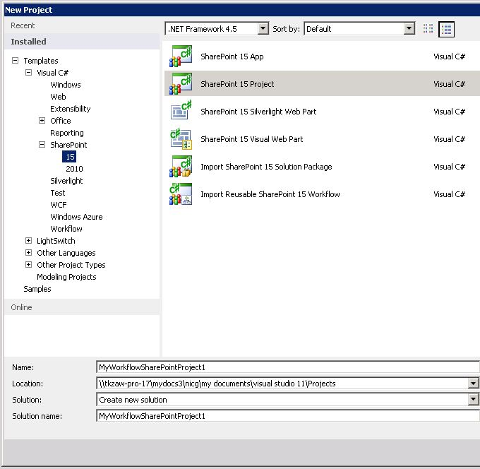
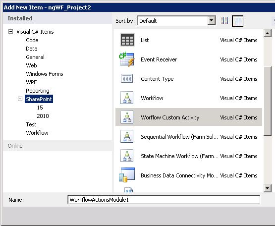
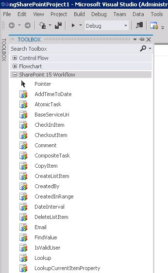
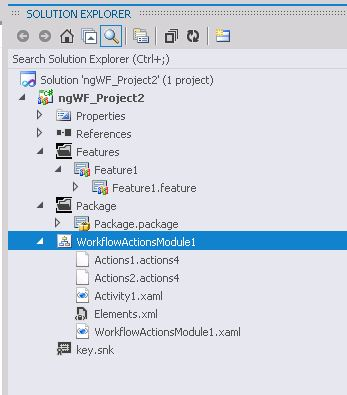

# Как: построение и развертывание настраиваемого действия рабочего процесса
Узнайте, как моделировать бизнес-процессы, требования которых не соблюдаются существующей библиотекой действий бизнес-процессов в SharePoint Designer, путем создания пользовательских бизнес-процессов в SharePoint.
SharePoint Designer предоставляет коллекцию действий рабочих процессов, которые доступны через пользовательский интерфейс конструктора рабочих процессов (пользовательский Интерфейс). Хотя диапазон действий рабочего процесса, включенные в SharePoint Designer) — это обширный, оно тем не менее конечное. В некоторых случаях может потребоваться модель с существующей библиотеки действий рабочего процесса, доступных в SharePoint Designer не выполняются, требования к бизнес-процесса.
  
    
    

Распознавание, что бизнес-процессов часто есть специализированные требования, SharePoint позволяет создавать настраиваемые действия рабочих процессов. Можно разрабатывать этих настраиваемых действий с помощью Visual Studio и затем создание пакета и их развертывание SharePoint. На этом этапе настраиваемое действие становится доступным для авторов рабочих процессов в SharePoint Designer, точно так же, как если бы между библиотека существующего действия. Эта возможность позволяет настраивать функциональные возможности среды разработки рабочего процесса в соответствии с любой из специализированных бизнес-процессов.
> **Примечание:** Обеспечивает пример демонстрирует создание настраиваемых действий. Образец, а также файл readme доступен здесь: [рабочего процесса SharePoint: Создание настраиваемого действия](http://code.msdn.microsoft.com/SharePoint-workflow-41e5c0f9) (http://code.msdn.microsoft.com/SharePoint-workflow-41e5c0f9).
  
    
    

## Основные сценарии для настраиваемые действия рабочих процессов

В следующей строке описательную регистрируются основного сценария для настраиваемые действия рабочих процессов.
  
    
    

1. Бизнес-аналитик или другие не технической информационных работников использует SharePoint Designer для создания рабочих процессов для моделирования внутренних бизнес-процесса — например, процесс утверждения документов. Тем не менее в этой компании последний этап процесса —, после окончательного утверждения для автоматически отправки документов на внешние принтер, который печатает и привязывает указанное число копий документа. 
    
  
2. Никаких действий рабочего процесса, который включен в SharePoint Designer 2013 поддерживает Отправка документа в внешнего принтера. Таким образом руководители компании решили инвестировать в поддержке этого настраиваемого действия (звонят его действие «Отправить файлы на принтер») для информационных работников компании.
    
  
3. Поставщики предоставляют доступ к печати веб-служб. Для капитализации, разработчик создает настраиваемое действие **Отправить файлы на принтер**, с именем **SendFilesToPrinter**. Разработчик создает — декларативный рабочий процесс активности. Кроме того, разработчик затем создает действия рабочего процесса для предоставления пользовательского интерфейса и перетащите действие в SharePoint Designer.
    
  
4. Разработчик пакеты **SendFilesToPrinter** активности и **Отправить файлы на принтер** действие в пакет (WSP-файл) файла решения SharePoint и развертывает его как компонент семейства сайтов в ферме SharePoint.
    
  
5. После функцию развернуть и активировать, информационных работников видит нового настраиваемого действия, **Отправить файлы на принтер** в SharePoint Designer пользовательского интерфейса, а также все действия, обычно содержат и можно использовать так же, как все остальные файлы.
    
  

## Общие сведения о настраиваемых действий

Действие, которое является оболочкой, выделяет функциональность базового действия в SharePoint Designer. Во время выполнения базового активности не действие, выполняется в Windows Server AppFabric. В этом случае необходимо действия абстракций только во время разработки базовых функций в рабочем процессе SharePoint Designer разработки среды (только элементы SharePoint Designer, с помощью интерфейса.
  
    
    
Как и все действия, настраиваемые действия — «уровня веб-сайта» — то есть, активирован на уровне веб-сайта SharePoint или экземпляра **SharePoint.SPWeb**.
  
    
    
Действия определяются в XML-файлы определений, которые имеют расширение имени файла .actions4. Базовый действие (или действия), с другой стороны, определенные в XAML-файл.
  
    
    

## Создание настраиваемых действий в Visual Studio 2012

Visual Studio 2012 теперь содержит тип элемента "пользовательского действия рабочего процесса" в проекты SharePoint. Тип элемента можно использовать для создания настраиваемого действия, который затем можно импортировать в качестве настраиваемого действия в SharePoint Designer 2013.
  
    
    

## Пример: Создание пакета и развертывание настраиваемого действия

### Создание настраиваемого действия рабочего процесса

1. Начните, открыв Visual Studio 2012 и создание нового проекта Visual C# типа **Проекта SharePoint**, как показано на рисунке 1.
    
   **Рис. 1. Диалоговое окно "Новый проект"**

  

  
  

  

  
2. В **Обозревателе решений** щелкните правой кнопкой мыши узел имя проекта и выберите команду **Добавить** **Новый элемент**. Откроется диалоговое окно **Добавление нового элемента**, как показано на рисунке 2.
    
   **На рисунке 2. Добавление нового элемента**

  

  
  

    
    
  
3. В диалоговом окне **Добавление нового элемента** выберите тип элемента **Настраиваемого действия рабочего процесса** и присвойте ему понятное имя. На рисунке называется «WorkflowActionsModule1». Нажмите кнопку **Добавить**. Создается новый элемент, а предоставляется в область конструирования активности.
    
  
4. Если вкладки панели **элементов** не отображается, щелкните ее для предоставления узлы элементов. Выберите узел **Рабочего процесса SharePoint** для отображения объектов разработки рабочего процесса. Существует представлением объектов в панель элементов рабочего процесса на рисунке 3.
    
   **На рисунке 3. Частичное представление панель инструментов рабочего процесса SharePoint**

  

  
  

    
    
  
5. Добавление нового действия (.actions4) и файлы действий (включающими) модуле рабочий процесс, при необходимости. Для добавления этих файлов, щелкните правой кнопкой мыши значок модуль действий в **Окне Обозреватель решений**, выберите команду **Добавить** и затем нажмите кнопку **Добавить действие** (для добавления нового файла action4) или **Новое действие** (Добавление нового действия).
    
  
После создания действия модуль и добавьте действие и файлы действий проект должен быть похож, depicted в на рисунке 5. Вы увидите один файл .actions4 для каждого действия, который вы добавили и один XAML-файл для каждого действия. Кроме того будут иметь старый файл Elements.xml и модуль XAML-файл.
  
    
    

**На рисунке 5. Модуль действия рабочего процесса в окне Обозреватель решений**

  
    
    

  
    
    

  
    
    
После создания вашего пользовательского действия рабочего процесса, вы можно упаковать и развернуть его. После развертывания, настраиваемого действия могут использоваться SharePoint Designer 2013 как настраиваемое действие.
  
    
    
Настраиваемые действия упакованных и развертываются как компоненты SharePoint в пакет (WSP-файл) файлы решения SharePoint. Пакет решения содержит модуль настраиваемых действий, которая представляет собой набор файлов, которые развертываются в SharePoint. В этом модуле может содержать любое число определений действий рабочего процесса, каждый из которых является XAML-файл. Модуль также содержит файлы действия (.actions4). Каждый файл действия содержит несколько действий, связанные с действиями в модуле или на собственный действия, которые доступны в установке SharePoint по умолчанию.
  
    
    
После файла пакета (WSP-файл) решений загружаться и активировать на целевой веб-сайт (то есть, семейство сайтов SharePoint), функции, содержащиеся в пакете, установленных и доступных для активации. После активации дополнительных действий они доступны для использования в рабочем процессе. 
  
    
    

## Обновление и удаление настраиваемых действий

После развертывания настраиваемого действия, можно обновить или удалить очень легко. Все, что вам нужно сделать — откройте проект активности в Visual Studio, внесите изменения, необходимо и затем создание пакета и снова развернуть как описано в предыдущей процедуре. Чтобы удалить настраиваемое действие, только что можно удалить компонента в конечное семейство веб-сайтов.
  
    
    

### Активация компонента

Активация компонента дополнительного действия в семейства веб-сайтов (то есть, экземпляра объекта **SPWeb** ) успешно только в том случае, если Azure / Workflow Manager Client 1.0 (модуль одним экземпляром рабочего процесса) правильно настроен. Следующие два советы, которые могут помочь обеспечить правильную настройку:
  
    
    

- Переход на страницу веб-узла и проверка того, что активации компонента, который содержит настраиваемое действие.
    
  
- Запроса к базе данных Workflow Manager Client 1.0, чтобы убедиться, что действие успешно развернуты.
    
  

## Дополнительные ресурсы

-  [Основные сведения о рабочих процессах в SharePoint](sharepoint-workflow-fundamentals.md)
    
  
-  [Справочник по действий рабочих процессов для SharePoint](workflow-actions-and-activities-reference-for-sharepoint.md)
    
  
-  [Разработка рабочих процессов в SharePoint с помощью Visual Studio](develop-sharepoint-workflows-using-visual-studio.md)
    
  

