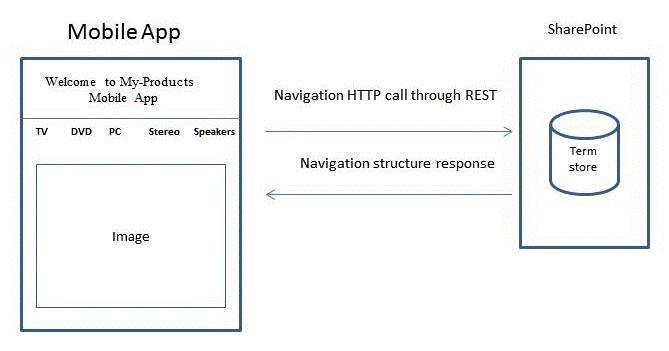
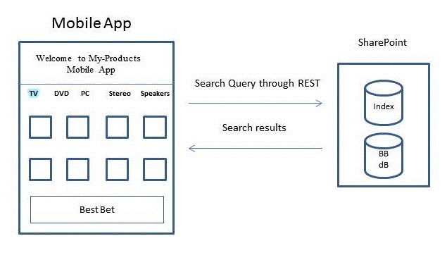
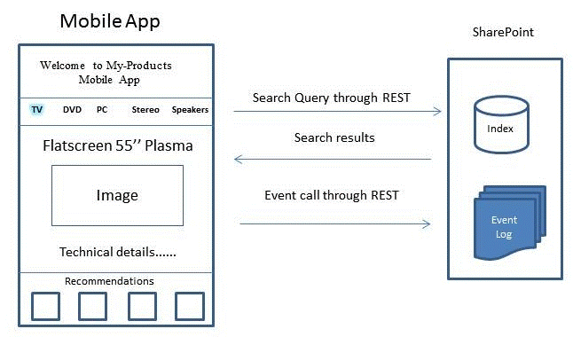

# <a name="build-search-driven-mobile-apps-with-the-navigation-and-event-logging-rest-interfaces"></a><span data-ttu-id="489c3-102">Создание на основе механизмов поиска мобильных приложений с помощью интерфейсов навигации и REST ведение журнала событий</span><span class="sxs-lookup"><span data-stu-id="489c3-102">Build search-driven mobile apps with the Navigation and Event Logging REST interfaces</span></span>

<span data-ttu-id="489c3-103">SharePoint представляется интерфейсы навигации и REST ведение журнала событий, позволяя создавать мобильного приложения для мобильных устройств, например телефонов и планшетные ПК под управлением операционных системах, отличных от Windows, управляемых с помощью поиска — например, Android и операций ввода-вывода.</span><span class="sxs-lookup"><span data-stu-id="489c3-103">SharePoint introduces the Navigation and Event Logging REST interfaces, enabling you to create a search-driven mobile app for mobile devices such as phones and tablets that run on operating systems other than Windows—for example, Android and iOS.</span></span>
## <a name="how-apps-work-with-the-product-catalog"></a><span data-ttu-id="489c3-104">Как работают приложения с каталогом продуктов</span><span class="sxs-lookup"><span data-stu-id="489c3-104">How apps work with the product catalog</span></span>
<span data-ttu-id="489c3-105"><a name="mobile_app_and_product_catalog"> </a></span><span class="sxs-lookup"><span data-stu-id="489c3-105"><a name="mobile_app_and_product_catalog"> </a></span></span>

<span data-ttu-id="489c3-p101">Каталог продуктов могут отображаться на мобильном устройстве различными способами. В большинстве случаев можно настроить канала мобильного устройства для каталога продуктов в среде SharePoint. Создание канала мобильного устройства можно настраивать внешний вид и функции, которая соответствует любого размера экрана на мобильном устройстве. Страница с результатами отображаются в. Формат ASPX, с помощью веб-браузера на мобильном устройстве. Структура страниц и его соответствующей логики обрабатывается на сервере под управлением SharePoint. С другой стороны созданных с помощью интерфейсов навигации и REST ведение журнала событий приложения на основе механизмов поиска и действует как сервер переднего плана перейдите структуры каталога продуктов.</span><span class="sxs-lookup"><span data-stu-id="489c3-p101">A product catalog can be displayed on a mobile device in different ways. Traditionally, you can configure a mobile channel for the product catalog within SharePoint. Creating a mobile channel enables you to tailor a look and feel that matches any screen size on a mobile device. The resulting page is viewed in .ASPX format using the web browser on the mobile device. The structure of the pages and its corresponding logic is handled by the server running SharePoint. In contrast, an app created with the Navigation and Event Logging REST interfaces is search-driven and acts as a front-end to navigate the product catalog structures.</span></span>
  
    
    
<span data-ttu-id="489c3-p102">Приложение не является отдельной программы, но работает с каталогом продуктов заданы в существующую установку SharePoint. Приложения могут динамическое обновление структуры переходов, если каталог продуктов был изменен в установленных SharePoint. Кроме того, установите переключатель в положение события, сделанные пользователем отправляются на сервере под управлением SharePoint для повышения общего качества рекомендации, сделанных с каталога продуктов.</span><span class="sxs-lookup"><span data-stu-id="489c3-p102">An app is not a stand-alone program, but works with a product catalog set up in an existing SharePoint installation. The app can update the navigation structure dynamically if the product catalog has changed in that particular SharePoint installation. In addition, click events made by the user are sent back to the server running SharePoint to improve the overall quality of recommendations made by the product catalog.</span></span>
  
    
    
<span data-ttu-id="489c3-p103">Приложение создает страниц, которые необходимы пользователю для просмотра каталог продуктов без использования веб-браузера. Главные страницы, макеты страниц и логику для создания страниц, чтобы просмотреть каталог продуктов загружаются на устройствах приложения; Эти страницы используются повторно, каждый раз, когда пользователь запускает приложение. При переходе каталог продуктов приложения одновременно создает структуру переходов и настраивает страницы. Чтобы заполнить соответствующие страницы с содержимым элемента, поисковых запросов, передаются в каталог продуктов в SharePoint. Соответствующие результаты поиска затем используется для заполнения страницы.</span><span class="sxs-lookup"><span data-stu-id="489c3-p103">The app constructs the pages needed by the user to view the product catalog without using a web browser. Master pages, page layouts, and logic to construct the pages to view the product catalog are downloaded onto devices as an app; these pages are reused whenever the user runs the app. While the user navigates the product catalog, the app simultaneously constructs a navigation structure and sets up the pages. To fill in relevant pages with item content, search queries are sent to the product catalog in SharePoint. The corresponding search results are then used to fill the pages.</span></span>
  
    
    

## <a name="example-create-a-search-driven-mobile-app-with-home-category-and-item-detail-pages"></a><span data-ttu-id="489c3-120">Пример: Создание мобильного приложения на основе механизмов поиска с домашней, категории, а элемент страницы сведений о</span><span class="sxs-lookup"><span data-stu-id="489c3-120">Example: Create a search-driven mobile app with home, category, and item detail pages</span></span>
<span data-ttu-id="489c3-121"><a name="example_search_driven_mobile_app"> </a></span><span class="sxs-lookup"><span data-stu-id="489c3-121"><a name="example_search_driven_mobile_app"> </a></span></span>

<span data-ttu-id="489c3-p104">Предположим, что у вас есть мобильного приложения с использованием трех типов страниц: домашней страницы, страницы категорий и страницы сведений о элемента. В следующих разделах, как использовать интерфейсы навигации, ведение журнала событий и поиска REST для создания страниц.</span><span class="sxs-lookup"><span data-stu-id="489c3-p104">Suppose you have a mobile app with three types of pages: a home page, category pages, and item detail pages. The following sections describe how the Navigation, Event Logging, and Search REST interfaces are used to create the pages.</span></span>
  
    
    

### <a name="home-page-for-a-search-driven-mobile-app"></a><span data-ttu-id="489c3-124">Домашняя страница для мобильного приложения на основе поиска</span><span class="sxs-lookup"><span data-stu-id="489c3-124">Home page for a search-driven mobile app</span></span>

<span data-ttu-id="489c3-p105">Обычно на **домашней** странице отображается при запуске приложения. На **домашней** странице содержит меню каталога продукции, какой-либо текст и Неподвижное изображение, как показано на рисунке 1.</span><span class="sxs-lookup"><span data-stu-id="489c3-p105">Typically the **Home** page is displayed when the app starts up. The **Home** page contains the product catalog menu, some text, and a static image, as shown in Figure 1.</span></span>
  
    
    

<span data-ttu-id="489c3-127">**На рисунке 1. Домашняя страница для мобильного приложения на основе поиска**</span><span class="sxs-lookup"><span data-stu-id="489c3-127">**Figure 1. Home page for a search-driven mobile app**</span></span>

  
    
    

  
    
    

  
    
    
<span data-ttu-id="489c3-p106">Для создания на этой странице, приложение отправляет навигации REST-вызов на сервер под управлением SharePoint запрашивает структуры переходов каталога продуктов. Затем приложение использует данные ответа для установки правильных таксономии или структуре меню и отображает имена правильный терминов для каталога продуктов. Дополнительное содержимое, такие как макет страницы, текст заголовка и статические изображения хранятся в самом приложении. При изменении таксономии в дальнейшем приложения могут обновиться REST навигации вызова при выполнении.</span><span class="sxs-lookup"><span data-stu-id="489c3-p106">To construct this page, the app sends a Navigation REST call to the server running SharePoint requesting the navigation structure of the product catalog. Next, the app uses the response data to set up the correct taxonomy or menu structure and displays the correct term names for the product catalog. Additional content such as page layout, title text, and static images are stored in the app itself. If the taxonomy is modified at a later time, the app can be updated with the Navigation REST call when it is run.</span></span>
  
    
    
<span data-ttu-id="489c3-133">Ниже приведен пример типичного вызовов REST навигации.</span><span class="sxs-lookup"><span data-stu-id="489c3-133">The following is an example of a typical Navigation REST call.</span></span>
  
    
    


```

GET http://server/_api/navigation/menustate?mapprovidername='GlobalNavigationSwitchableProvider'

```

<span data-ttu-id="489c3-134">Показано соответствующего ответа в  [Пример ответа для навигации REST вызываться для мобильного приложения](how-to-build-search-driven-mobile-apps-with-the-navigation-and-event-logging-res.md#response_navigation_rest).</span><span class="sxs-lookup"><span data-stu-id="489c3-134">A matching response is shown in  [Example response for a Navigation REST call for a mobile app](how-to-build-search-driven-mobile-apps-with-the-navigation-and-event-logging-res.md#response_navigation_rest).</span></span>
  
    
    

### <a name="category-page-for-a-search-driven-mobile-app"></a><span data-ttu-id="489c3-135">Страница категорий для мобильного приложения на основе поиска</span><span class="sxs-lookup"><span data-stu-id="489c3-135">Category page for a search-driven mobile app</span></span>

<span data-ttu-id="489c3-p107">На странице **категорий** отображается много элементов в выбранной категории. Обычно каждого элемента в категории могут быть представлены некоторые данные соответствующего элемента, такие как заголовок, изображения и цену. Эти данные собираются из каталога продуктов с помощью запроса поиска в службе REST поиска SharePoint, как показано на рисунке 2.</span><span class="sxs-lookup"><span data-stu-id="489c3-p107">The **Category** page displays many items in a selected category. Each item listed in a category can typically be represented by some relevant item data, such as title, an image, and price. This data is collected from the product catalog by using a search query through the SharePoint Search REST service as shown in Figure 2.</span></span>
  
    
    

<span data-ttu-id="489c3-139">**На рисунке 2. Страница категорий для мобильного приложения на основе поиска**</span><span class="sxs-lookup"><span data-stu-id="489c3-139">**Figure 2. Category page for a search-driven mobile app**</span></span>

  
    
    

  
    
    

  
    
    
<span data-ttu-id="489c3-141">При выборе одной из категорий на предыдущем рисунке, к примеру, **TV** страницы **категорий** отображается.</span><span class="sxs-lookup"><span data-stu-id="489c3-141">If you choose one of the categories in the previous diagram, for example, **TV**, a **Category** page appears.</span></span>
  
    
    
<span data-ttu-id="489c3-142">Ниже приведен пример типичного запроса поиска REST для получения содержимого для определенной категории.</span><span class="sxs-lookup"><span data-stu-id="489c3-142">The following is an example of a typical Search REST query to obtain content for a particular category.</span></span>
  
    
    


```

GET http://server/_api/search/query?querytext='owstaxidProductCatalogItemCategory:#0<TermGuid>'

```

<span data-ttu-id="489c3-143">В  [Пример ответа на запрос поиска REST для мобильного приложения](how-to-build-search-driven-mobile-apps-with-the-navigation-and-event-logging-res.md#response_search_rest)отображается соответствующего ответа.</span><span class="sxs-lookup"><span data-stu-id="489c3-143">A matching response is shown in  [Example response for a Search REST query for a mobile app](how-to-build-search-driven-mobile-apps-with-the-navigation-and-event-logging-res.md#response_search_rest).</span></span>
  
    
    
<span data-ttu-id="489c3-144">Компонент в SharePoint обработки запросов возвращает результаты поиска, которые содержат данные для определенной категории, и приложение отображает данные на странице " **категории** ".</span><span class="sxs-lookup"><span data-stu-id="489c3-144">The query processing component in SharePoint returns search results that contain data for a particular category, and the app presents the data in the **Category** page.</span></span> <span data-ttu-id="489c3-145">Если наиболее подходящего элемента, связанного с выбранной категории, компонент обработки запросов обнаруживает этого сопоставления и извлекает данные наиболее подходящий элемент из базы данных наиболее подходящего элемента, с меткой **BB** на схеме.</span><span class="sxs-lookup"><span data-stu-id="489c3-145">If there is a Best Bet associated with the selected category, the query processing component detects this association and extracts the Best Bet data from the Best Bet database, labeled **BB** in the diagram.</span></span> <span data-ttu-id="489c3-146">Результаты поиска нажмите mixed с результатами из базы данных наиболее подходящий элемент и отправляются обратно в приложение в таблице результатов.</span><span class="sxs-lookup"><span data-stu-id="489c3-146">The search results are then mixed with results from the Best Bet database and sent back to the app in a result table.</span></span> <span data-ttu-id="489c3-147">Приложение отвечает за извлечение различных частей результатов из таблицы и отображение наиболее подходящего элемента в выделенной папке.</span><span class="sxs-lookup"><span data-stu-id="489c3-147">The app is responsible for extracting the different parts of the results from the table and displaying the Best Bet in a dedicated location.</span></span>
  
    
    

### <a name="item-detail-pages-for-a-search-driven-mobile-app"></a><span data-ttu-id="489c3-148">Страницы сведений о элемента для мобильного приложения на основе поиска</span><span class="sxs-lookup"><span data-stu-id="489c3-148">Item detail pages for a search-driven mobile app</span></span>

<span data-ttu-id="489c3-p109">При выборе элемента в категории, откроется страница **сведений об элементе**. На этой странице элемент подробно с данными, такие как заголовок, изображения продуктов, технические описания, цены и сведения о доставке. Дополнительные рекомендации по или оценки, если он доступен, также отображаются. Для создания страницы **сведений об элементе**, приложение отправляет два запроса: один запрос для получения данных элемента, а второй запрос на получение рекомендации связанные с этого элемента, как показано на рисунке 3.</span><span class="sxs-lookup"><span data-stu-id="489c3-p109">If you select an item in a category, the **Item details** page appears. On this page, an item is described in detail with data such as title, product images, technical description, price, and delivery information. More recommendations or ratings, if available, are also displayed. To construct the **Item details** page, the app sends two queries: one query to retrieve item data and another query to receive recommendations related to that item, as shown in Figure 3.</span></span>
  
    
    

<span data-ttu-id="489c3-153">**На рисунке 3. Страница сведений об элементах для мобильного приложения на основе поиска**</span><span class="sxs-lookup"><span data-stu-id="489c3-153">**Figure 3. Item detail page for a search-driven mobile app**</span></span>

  
    
    

  
    
    

  
    
    
<span data-ttu-id="489c3-155">Ниже приведен пример типичного запроса поиска REST для получения содержимого для определенного элемента.</span><span class="sxs-lookup"><span data-stu-id="489c3-155">The following is an example of a typical Search REST query to obtain content for a particular item.</span></span>
  
    
    


```

GET http://server/_api/search/query?querytext='ProductCatalogItemNumberOWSTEXT:1234567'
```

<span data-ttu-id="489c3-p110">Рекомендации по вычисляются в SharePoint, не в самом приложении. Для создания рекомендации, основанные на события пользователя — не только в этот определенного приложения, но все события пользователя, собранные по каталогу продукции — приложение постоянно отправляет события пользователя, когда они возникают, обратно в каталог продуктов в SharePoint с помощью вызова события. Эти события пользователя хранятся в журнале событий и обрабатываются только как другой пользователь событий, связанных с элемента. Обратный вызов не отправляется приложения из каталога продуктов. Рекомендации по вычисляется доступны для приложения в службе REST поиска SharePoint.</span><span class="sxs-lookup"><span data-stu-id="489c3-p110">Recommendations are calculated in SharePoint, not in the app itself. To create recommendations based on user events—not only in this particular app but all user events that are collected by the product catalog—the app constantly sends user events, as they occur, back to the product catalog in SharePoint via an Event call. These user events are stored in the event log and processed only like other user events associated with that particular item. No callback is sent to the app from the product catalog. The recommendations calculated are available for the app through the SharePoint Search REST service.</span></span>
  
    
    
<span data-ttu-id="489c3-161">Пример типичного **POST** звонка для ведения журнала событий.</span><span class="sxs-lookup"><span data-stu-id="489c3-161">The following example shows a typical **POST** call for event logging.</span></span>
  
    
    


```
POST http://server/_api/events/logevent
{
      "usageEntry": {
            "__metadata": {
                  "type": "Microsoft.SharePoint.Administration.UsageEntry"
            },
            "EventTypeId": 1,
            "ItemId": "an item fb7c-4196-8123-e54eee5f4787",
            "ScopeId": "61141c0e-fb7c ",
            "Site": "61141c0e- 
-4196-8123-e54eee5f4787",
            "User": "johndoe"
      }
}
```

<span data-ttu-id="489c3-p111">Служба исходя из стандартных кодов возврата HTTP: ответ HTTP 200 указывает успешный запрос. Нет ответов из каталога продуктов для интерфейса REST ведения журнала событий.</span><span class="sxs-lookup"><span data-stu-id="489c3-p111">The service follows standard HTTP return codes: an HTTP 200 response indicates a successful request. There are no responses from the product catalog for the Event Logging REST interface.</span></span>
  
    
    

## <a name="example-response-for-a-navigation-rest-call-for-a-mobile-app"></a><span data-ttu-id="489c3-164">Пример ответа для навигации REST вызываться для мобильного приложения</span><span class="sxs-lookup"><span data-stu-id="489c3-164">Example response for a Navigation REST call for a mobile app</span></span>
<span data-ttu-id="489c3-165"><a name="response_navigation_rest"> </a></span><span class="sxs-lookup"><span data-stu-id="489c3-165"><a name="response_navigation_rest"> </a></span></span>


```

<?xml version="1.0" encoding="utf-8"?>
<d:MenuState xmlns:d="http://schemas.microsoft.com/ado/2007/08/dataservices" xmlns:m="http://schemas.microsoft.com/ado/2007/08/dataservices/metadata" xmlns:georss="http://www.georss.org/georss" xmlns:gml="http://www.opengis.net/gml" m:type="SP.MenuState">

  <d:FriendlyUrlPrefix>/sites/contoso/</d:FriendlyUrlPrefix>
  <d:Nodes>
    <d:element m:type="SP.MenuNode">
      <d:CustomProperties m:null="true" />
      <d:FriendlyUrlSegment>electronics</d:FriendlyUrlSegment>
      <d:Hidden m:type="Edm.Boolean">false</d:Hidden>
      <d:Key>16c4c3c8-0309-47f7-9d9b-17e699febce8</d:Key>
      <d:Nodes>
        <d:element m:type="SP.MenuNode">
          <d:CustomProperties m:null="true" />
          <d:FriendlyUrlSegment>audio</d:FriendlyUrlSegment>
          <d:Hidden m:type="Edm.Boolean">false</d:Hidden>
          <d:Key>3e2d5c67-3fad-4cfa-8e1c-8c74fdf3a34b</d:Key>
          <d:Nodes>
            <d:element m:type="SP.MenuNode">
              <d:CustomProperties m:null="true" />
              <d:FriendlyUrlSegment>car-audio</d:FriendlyUrlSegment>
              <d:Hidden m:type="Edm.Boolean">false</d:Hidden>
              <d:Key>e3d271a4-dcbf-464d-a557-23848ccaa54f</d:Key>
              <d:Nodes />
              <d:NodeType m:type="Edm.Int32">1</d:NodeType>
              <d:SimpleUrl></d:SimpleUrl>
              <d:Title>Car audio</d:Title>
            </d:element>
            <d:element m:type="SP.MenuNode">
              <d:CustomProperties m:null="true" />
              <d:FriendlyUrlSegment>headphones</d:FriendlyUrlSegment>
              <d:Hidden m:type="Edm.Boolean">false</d:Hidden>
              <d:Key>7ad146d0-61b5-4b55-9da0-db7eaaa20f4a</d:Key>
              <d:Nodes />
              <d:NodeType m:type="Edm.Int32">1</d:NodeType>
              <d:SimpleUrl></d:SimpleUrl>
              <d:Title>Headphones</d:Title>
            </d:element>
            <d:element m:type="SP.MenuNode">
              <d:CustomProperties m:null="true" />
              <d:FriendlyUrlSegment>mp3</d:FriendlyUrlSegment>
              <d:Hidden m:type="Edm.Boolean">false</d:Hidden>
              <d:Key>7387fe97-52fa-464b-878a-b05d04e7032e</d:Key>
              <d:Nodes />
              <d:NodeType m:type="Edm.Int32">1</d:NodeType>
              <d:SimpleUrl></d:SimpleUrl>
              <d:Title>MP3</d:Title>
            </d:element>
            <d:element m:type="SP.MenuNode">
              <d:CustomProperties m:null="true" />
              <d:FriendlyUrlSegment>speakers</d:FriendlyUrlSegment>
              <d:Hidden m:type="Edm.Boolean">false</d:Hidden>
              <d:Key>65da907c-9565-45f6-a278-cbce7f74ab3d</d:Key>
              <d:Nodes />
              <d:NodeType m:type="Edm.Int32">1</d:NodeType>
              <d:SimpleUrl></d:SimpleUrl>
              <d:Title>Speakers</d:Title>
            </d:element>
          </d:Nodes>
          <d:NodeType m:type="Edm.Int32">1</d:NodeType>
          <d:SimpleUrl></d:SimpleUrl>
          <d:Title>Audio</d:Title>
        </d:element>
      </d:Nodes>
      <d:NodeType m:type="Edm.Int32">1</d:NodeType>
      <d:SimpleUrl></d:SimpleUrl>
      <d:Title>Electronics</d:Title>
    </d:element>
  </d:Nodes>
  <d:SimpleUrl m:null="true" />
  <d:SPSitePrefix>/sites/contoso/</d:SPSitePrefix>
  <d:SPWebPrefix>/sites/contoso/</d:SPWebPrefix>
  <d:StartingNodeKey>2168423f-3fea-4324-a5cb-90be8f079750</d:StartingNodeKey>
  <d:StartingNodeTitle>contoso</d:StartingNodeTitle>
  <d:Version>2012-05-29T12:00:04.4747484Z</d:Version>
</d:MenuState>

```


## <a name="example-response-for-a-search-rest-query-for-a-mobile-app"></a><span data-ttu-id="489c3-166">Пример ответа на запрос поиска REST для мобильного приложения</span><span class="sxs-lookup"><span data-stu-id="489c3-166">Example response for a Search REST query for a mobile app</span></span>
<span data-ttu-id="489c3-167"><a name="response_search_rest"> </a></span><span class="sxs-lookup"><span data-stu-id="489c3-167"><a name="response_search_rest"> </a></span></span>


```

<d:query xmlns:d="http://schemas.microsoft.com/ado/2007/08/dataservices" xmlns:m="http://schemas.microsoft.com/ado/2007/08/dataservices/metadata" xmlns:georss="http://www.georss.org/georss" xmlns:gml="http://www.opengis.net/gml" m:type="Microsoft.Office.Server.Search.REST.SearchResult">
  <d:ElapsedTime m:type="Edm.Int32">4640</d:ElapsedTime>
  <d:PrimaryQueryResult m:type="Microsoft.Office.Server.Search.REST.QueryResult">
    <d:CustomResults m:null="true"/>
    <d:QueryId>7fea4ced-5789-4067-beab-8f807410b29e</d:QueryId>
    <d:QueryRuleId m:type="Edm.Guid">00000000-0000-0000-0000-000000000000</d:QueryRuleId>
    <d:RefinementResults m:null="true"/>
    <d:RelevantResults m:type="Microsoft.Office.Server.Search.REST.RelevantResults">
      <d:GroupTemplateId m:null="true"/>
      <d:ItemTemplateId m:null="true"/>
      <d:Properties>
        ...
      </d:Properties>
      <d:ResultTitle m:null="true"/>
      <d:ResultTitleUrl m:null="true"/>
      <d:RowCount m:type="Edm.Int32">10</d:RowCount>
      <d:Table m:type="SP.SimpleDataTable">
        <d:Rows>
          ...
        </d:Rows>
      </d:Table>
      <d:TotalRows m:type="Edm.Int32">2048964</d:TotalRows>
      <d:TotalRowsIncludingDuplicates m:type="Edm.Int32">2048964</d:TotalRowsIncludingDuplicates>
    </d:RelevantResults>
    <d:SpecialTermResults m:null="true"/>
  </d:PrimaryQueryResult>
  <d:Properties>
    ...
  </d:Properties>
  <d:SecondaryQueryResults m:null="true"/>
  <d:SpellingSuggestion/>
  <d:TriggeredRules>
  </d:TriggeredRules>
</d:query>
```


## <a name="additional-resources"></a><span data-ttu-id="489c3-168">Дополнительные ресурсы</span><span class="sxs-lookup"><span data-stu-id="489c3-168">Additional resources</span></span>
<span data-ttu-id="489c3-169"><a name="bk_addresources"> </a></span><span class="sxs-lookup"><span data-stu-id="489c3-169"><a name="bk_addresources"> </a></span></span>


-  [<span data-ttu-id="489c3-170">Построение приложений Windows Phone, обращающихся к SharePoint</span><span class="sxs-lookup"><span data-stu-id="489c3-170">Build Windows Phone apps that access SharePoint</span></span>](build-windows-phone-apps-that-access-sharepoint.md)
    
  
-  [<span data-ttu-id="489c3-171">Программирование с использованием службы SharePoint 2013 REST</span><span class="sxs-lookup"><span data-stu-id="489c3-171">Use OData query operations in SharePoint REST requests</span></span>](http://msdn.microsoft.com/library/d4b5c277-ed50-420c-8a9b-860342284b72%28Office.15%29.aspx)
    
  

