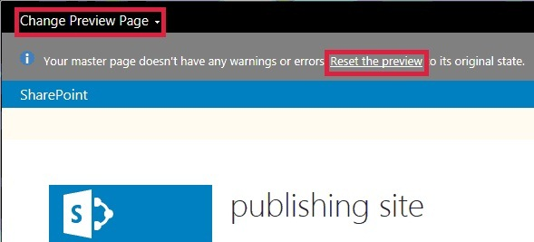

# Изменение страницы предварительного просмотра в диспетчере оформления SharePointChange the preview page in SharePoint Design Manager
Узнайте, как настроить, создать и изменить страницу предварительного просмотра в Дизайнере SharePoint.Learn how to set, create, and change the preview page in Design Manager in SharePoint.
Просмотр страницы — это страницу сайта, который используется для просмотра, как выглядит к проекту.The preview page is the page of your site that you use to see how your design looks. Можно задать предварительного просмотра страницы, чтобы быть конкретной страницы в пределах сайта или универсальные предварительного просмотра.You can set the preview page to be either a specific page within your site or a generic preview. Если универсальный предварительного просмотра, вы увидите главной страницы с заполнитель для содержимого.If you choose the generic preview, you'll see your master page with only a placeholder for content. Вы также увидите сообщение в заголовке, что для в настоящее время предварительного просмотра главной страницы без контента.You'll also see a message in the banner that you're currently previewing the master page without any content. При выборе конкретной страницы, вы увидите, что содержимого страницы визуализации с главной страницы и соответствующей страницы макета.If you choose a specific page, you'll see the page content rendered with the master page and the appropriate page layout.
  
    
    

Взаимодействие со страницей, можно сделать что-то, которое доставит SharePoint для выхода из области предварительного просмотра. Например при выборе **Сохранить** на ленте SharePoint сохраняет страницу и откроет live версии страницы. (Live версии страницы использует live главной страницы, не главной страницы, который вы разрабатываете.) Можно вернуться на страницу предварительного просмотра, выбрав **Сброс предварительного просмотра**.As you interact with the page, you might do something that causes SharePoint to move away from the preview. For example, if you select **Save** on the ribbon, SharePoint saves the page and then displays the live version of the page. (The live version of the page uses the live master page, not the master page that you are designing.) You can return to the preview page by choosing **Reset the preview**.
  
    
    

  
    
    

  
    
    

  
    
    

## Настройка страницы предварительного просмотра в диспетчере оформленияSet the preview page in Design Manager

Используйте эту процедуру, чтобы задать страницы предварительного просмотра.Use this procedure to set the preview page.
  
    
    

### Чтобы задать страницы предварительного просмотраTo set the preview page

1. Баннера в верхней части веб-браузер выберите **Страница изменения предварительного просмотра**.In the banner at the top of the web browser, choose **Change Preview Page**.
    
  
2. Нажмите кнопку **выбрать существующий**.Choose **Select Existing**.
    
  
3. Чтобы использовать универсальный Предварительный просмотр страницы, выберите **Универсальный предварительного просмотра**.To use a generic preview page, select **Generic Preview**.
    
  
4. Чтобы использовать определенную страницу в качестве страницы предварительного просмотра, выберите **URL-адрес** и введите URL-адрес страницы.To use a specific page as the preview page, select **URL** and enter the URL of the page.
    
  
5. Нажмите кнопку **ОК**.Choose **OK**.
    
  

## Создание новой страницы предварительного просмотра в диспетчере оформленияCreate a new preview page in Design Manager

Используйте эту процедуру для создания страницы и его настройка в качестве страницы предварительного просмотра.Use this procedure to create a page and set it as the preview page.
  
    
    

### Для создания новой страницы предварительного просмотраTo create a new preview page

1. Баннера в верхней части веб-браузер выберите **Страница изменения предварительного просмотра**.In the banner at the top of the web browser, choose **Change Preview Page**.
    
  
2. Нажмите кнопку **Создать**.Choose **Create New**.
    
  
3. Введите имя для этой страницы и нажмите кнопку **Создать**.Type a name for the page and then choose **Create**.
    
    Страница будет создана, и выполняются в представление, из которого можно добавить содержимое на новую страницу.The page is created, and you are taken to a view from which you can add content to the new page.
    
  

## Вернуться на страницу предварительного просмотра в диспетчере оформленияReturn to the preview page in Design Manager

Используйте эту процедуру, чтобы вернуться на страницу предварительного просмотра.Use this procedure to return to the preview page.
  
    
    

### Чтобы вернуться на страницу предварительного просмотраTo return to the preview page

- В сообщении в верхней части веб-браузер выберите **сбросить предварительного просмотра**.In the information message at the top of the web browser, select **Reset the preview**.
    
  

## Дополнительные ресурсыAdditional resources

-  [Главные страницы коллекции главных страниц и страниц макетов в SharePointMaster pages, the Master Page Gallery, and page layouts in SharePoint](master-pages-the-master-page-gallery-and-page-layouts-in-sharepoint.md)
    
  
-  [Разработка макета сайта в SharePointDevelop the site design in SharePoint](develop-the-site-design-in-sharepoint.md)
    
  
-  [Как сопоставить сетевой диск с коллекцией эталонных страниц SharePointHow to: Map a network drive to the SharePoint Master Page Gallery](how-to-map-a-network-drive-to-the-sharepoint-master-page-gallery.md)
    
  
-  [Каналы устройств в компоненте "Дизайнер" SharePointSharePoint Design Manager device channels](sharepoint-design-manager-device-channels.md)
    
  
-  [Дизайнер SharePoint изображенийSharePoint Design Manager image renditions](sharepoint-design-manager-image-renditions.md)
    
  

