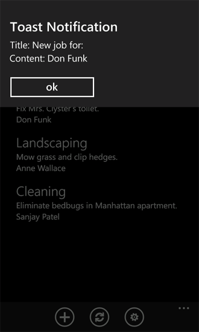
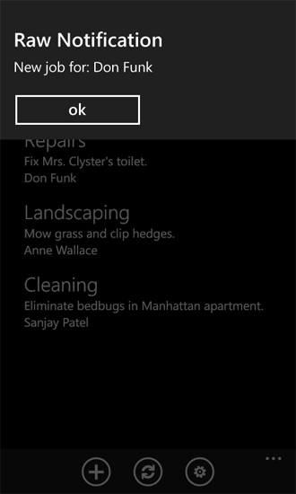

# <a name="how-to-configure-and-use-push-notifications-in-sharepoint-apps-for-windows-phone"></a><span data-ttu-id="65c70-102">Как: Настройка и использование push-уведомлений в приложениях SharePoint для Windows Phone</span><span class="sxs-lookup"><span data-stu-id="65c70-102">How to: Configure and use push notifications in SharePoint apps for Windows Phone</span></span>
<span data-ttu-id="65c70-p101">Создайте в SharePoint Server решение для отправки push-уведомлений и разработайте приложение Windows Phone для получения этих уведомлений. Использование службы Push-уведомления Майкрософт (MPNS), приложения для Windows Phone могут получать уведомления по Интернету событий, которые запускаются на Microsoft SharePoint Server. Приложение телефон не опроса сервера для изменения, например, элементов в виде списка, лежащие в основе приложение телефон. Приложения могут быть зарегистрированы на получение уведомлений с сервера, а приемника событий можно инициировать уведомление и отправьте его в получающей приложение для обработки. Ретрансляция push-уведомлений для устройств Windows Phone с MPNS.</span><span class="sxs-lookup"><span data-stu-id="65c70-p101">Create a solution in SharePoint Server for sending push notifications and develop a Windows Phone app for receiving the notifications. Using the Microsoft Push Notification Service (MPNS), Windows Phone apps can receive notifications through the Internet of events triggered on Microsoft SharePoint Server. The phone app doesn't have to poll the server for changes to, for example, the items in a list on which the phone app is based. The app can be registered to receive notifications from the server, and an event receiver can initiate a notification and send it to the receiving app for handling. The push notification is relayed to Windows Phone devices by MPNS.</span></span>
  
    
    

<span data-ttu-id="65c70-p102">Windows Phone 7 не поддерживает выполнение нескольких приложений одновременно. Кроме компонентов операционной системы Windows Phone () самой ОС только одно приложение может быть запущено на телефоне за раз. Событие, предназначенных для заданного телефона приложения могут возникать (например, например, для элемента списка добавленные в список), если приложение не запущены на переднем плане по телефону (то есть, когда приложение захороненные или закрытой). Можно разработать службы фона на телефоне с помощью периодических задач, который может проверить для изменения списка на сервере, но этот подход, потребляют ресурсы (например, пропускной способности и батарей мощность сети) на телефоне. С MPNS и компоненты, поддерживающие уведомлений, встроенные в ОС Windows Phone 7 телефона самого может получать уведомления, связанные с содержимым для данного приложения, даже если это приложение не запущены — и пользователь может предоставляется возможность запуска соответствующего приложения в ответ на уведомление. (Дополнительные сведения о push-уведомлений, см.  [Обзор Push уведомления для Windows Phone](http://msdn.microsoft.com/en-us/library/ff402558%28VS.92%29.aspx) в библиотеке MSDN.) В этом разделе создайте решение на сервере для отправки push-уведомлений в приложении phone на основании изменений в списке — это приложение на основе. Затем создается приложение телефона для получения этих уведомлений.</span><span class="sxs-lookup"><span data-stu-id="65c70-p102">Windows Phone 7 doesn't support running multiple apps simultaneously. Other than the components of the Windows Phone operating system (OS) itself, only one app can be running on the phone at a time. An event relevant to a given phone app might occur (such as, for example, a list item being added to a list) when the app isn't running in the foreground on the phone (that is, when the app is tombstoned or closed). You could develop a background service on the phone with a periodic task that might check for changes to the list on the server, but this approach would consume resources (such as network bandwidth and battery power) on the phone. With MPNS and the components that support notifications built into the Windows Phone 7 OS, the phone itself can receive a notification relevant to the context of a given app—even when that app isn't running—and the user can be given the opportunity to start the relevant app in response to the notification. (For more information about push notifications, see  [Push Notifications Overview for Windows Phone](http://msdn.microsoft.com/en-us/library/ff402558%28VS.92%29.aspx) in the MSDN Library.) In this topic, you create a server-side solution for sending push notifications to a phone app based on a change in the list on which the app is based. You will then create the phone app for receiving these notifications.</span></span>
  
    
    


## <a name="create-a-server-side-solution-to-send-push-notifications-based-on-a-list-item-event"></a><span data-ttu-id="65c70-115">Создание решения на сервере для отправки push-уведомления на основании события элемента списка</span><span class="sxs-lookup"><span data-stu-id="65c70-115">Create a server-side solution to send push notifications based on a list item event</span></span>
<span data-ttu-id="65c70-116"><a name="BKMK_ServerSideSolution"> </a></span><span class="sxs-lookup"><span data-stu-id="65c70-116"></span></span>

<span data-ttu-id="65c70-p103">Решение на сервере может быть развернут в объекте изолированной **SPWeb** приложение SharePoint или решение фермы SharePoint, представлена в виде пакета решения SharePoint (то есть, WSP-файл), содержащий компонент веб сайтов. В процедур, описанных в этом разделе будет разрабатываться простое решение SharePoint, который создает целевого списка для использования в приложении Windows Phone и, которая активирует механизм извещения уведомления на сервере. В разделе последующие будет разрабатывать приложения Windows Phone для получения уведомлений в решение на сервере.</span><span class="sxs-lookup"><span data-stu-id="65c70-p103">The server-side solution can be either a SharePoint app deployed in an isolated **SPWeb** object, or a SharePoint farm solution packaged as a SharePoint solution package (that is, a .wsp file) that contains a Web-scoped Feature. In the procedures in this section, you will develop a simple SharePoint solution that creates a target list to be used by a Windows Phone app and that activates the push notification mechanism on the server. In the subsequent section, you will develop the Windows Phone app for receiving notifications from the server-side solution.</span></span>
  
    
    

### <a name="to-create-the-server-side-project"></a><span data-ttu-id="65c70-120">Создание проекта на сервере</span><span class="sxs-lookup"><span data-stu-id="65c70-120">To create the server-side project</span></span>


1. <span data-ttu-id="65c70-121">Запустите Visual Studio 2012 с параметром **Запуск от имени администратора**.</span><span class="sxs-lookup"><span data-stu-id="65c70-121">Start Visual Studio 2012 by using the **Run as Administrator** option.</span></span>
    
  
2. <span data-ttu-id="65c70-122">Выберите **Файл**, **Создать**, **Проект**.</span><span class="sxs-lookup"><span data-stu-id="65c70-122">Choose **File**, **New**, **Project**.</span></span>
    
    <span data-ttu-id="65c70-123">Отобразится диалоговое окно **Новый проект**.</span><span class="sxs-lookup"><span data-stu-id="65c70-123">The **New Project** dialog box appears.</span></span>
    
  
3. <span data-ttu-id="65c70-124">В диалоговом окне **Новый проект** разверните узел **SharePoint** в разделе **Visual C#** и затем выберите узел **15**.</span><span class="sxs-lookup"><span data-stu-id="65c70-124">In the **New Project** dialog box, expand the **SharePoint** node under **Visual C#**, and then choose the **15** node.</span></span>
    
  
4. <span data-ttu-id="65c70-125">В области **Шаблоны** выберите **Проект SharePoint** и укажите имя проекта, такие asPushNotificationsList.</span><span class="sxs-lookup"><span data-stu-id="65c70-125">In the **Templates** pane, select **SharePoint Project** and specify a name for the project, such asPushNotificationsList.</span></span>
    
  
5. <span data-ttu-id="65c70-p104">Нажмите кнопку « **ОК** ». Откроется мастер настройки SharePoint. Мастер позволяет выбрать целевого объекта для разработки и отладки проекта и уровень доверия решения.</span><span class="sxs-lookup"><span data-stu-id="65c70-p104">Choose the **OK** button. The SharePoint Customization Wizard appears. This wizard enables you to select the target site for developing and debugging the project and the trust level of the solution.</span></span>
    
  
6. <span data-ttu-id="65c70-p105">Укажите URL-адрес сайта SharePoint Server. Выберите узел, который можно использовать в разработке приложения списка SharePoint для Windows Phone.</span><span class="sxs-lookup"><span data-stu-id="65c70-p105">Specify the URL of a SharePoint Server site. Select a site that you will be able to use later in the development of the SharePoint list app for Windows Phone.</span></span>
    
  
7. <span data-ttu-id="65c70-131">Выберите **Развернуть как решение фермы** и нажмите кнопку **Готово**, чтобы создать проект.</span><span class="sxs-lookup"><span data-stu-id="65c70-131">Select **Deploy as a farm solution**, and then click **Finish** to create the project.</span></span>
    
  
<span data-ttu-id="65c70-132">Затем добавьте файл класса в проект и создать несколько классов для инкапсуляции и управление push-уведомлений.</span><span class="sxs-lookup"><span data-stu-id="65c70-132">Next, add a class file to the project and create a couple of classes to encapsulate and manage push notifications.</span></span>
  
    
    

### <a name="to-create-the-classes-for-managing-push-notifications"></a><span data-ttu-id="65c70-133">Создание классов для управления push-уведомлениями</span><span class="sxs-lookup"><span data-stu-id="65c70-133">To create the classes for managing push notifications</span></span>


1. <span data-ttu-id="65c70-134">В **Обозревателе решений** выберите узел, представляющий проект (с именемPushNotificationsList , если вы следуете соглашению об именовании, которое используется в данном разделе).</span><span class="sxs-lookup"><span data-stu-id="65c70-134">In **Solution Explorer**, choose the node representing the project (named PushNotificationsList if you follow the naming convention used in these procedures).</span></span>
    
  
2. <span data-ttu-id="65c70-p106">В меню **Проект** выберите **Добавить класс**. Отобразится диалоговое окно **Добавление нового элемента** с выбранным шаблоном **Класс** C#.</span><span class="sxs-lookup"><span data-stu-id="65c70-p106">On the **Project** menu, choose **Add Class**. The **Add New Item** dialog box appears with the C# **Class** template already selected.</span></span>
    
  
3. <span data-ttu-id="65c70-p107">Укажите PushNotification.cs в качестве имени файла и нажмите кнопку **Добавить**. Файл класса добавляется в решение и открывается для редактирования.</span><span class="sxs-lookup"><span data-stu-id="65c70-p107">Specify PushNotification.cs as the name of the file and click **Add**. The class file is added to the solution and opened for editing.</span></span>
    
  
4. <span data-ttu-id="65c70-139">Замените содержимое файла следующим кодом.</span><span class="sxs-lookup"><span data-stu-id="65c70-139">Replace the contents of the file with the following code.</span></span>
    
```cs
  
using System;
using System.Collections.Generic;
using System.IO;
using System.Linq;
using System.Net;
using System.Text;
using Microsoft.SharePoint;

namespace PushNotificationsList
{
    internal static class WP7Constants
    {
        internal static readonly string[] WP_RESPONSE_HEADERS = 
            {
                "X-MessageID",
                "X-DeviceConnectionStatus",
                "X-SubscriptionStatus",
                "X-NotificationStatus"
            };
    }

    public enum TileIntervalValuesEnum
    {
        ImmediateTile = 1,
        Delay450SecondsTile = 11,
        Delay900SecondsTile = 21,
    }

    public enum ToastIntervalValuesEnum
    {
        ImmediateToast = 2,
        Delay450SecondsToast = 12,
        Delay900SecondsToast = 22,
    }

    public enum RawIntervalValuesEnum
    {
        ImmediateRaw = 3,
        Delay450SecondsRaw = 13,
        Delay900SecondsRaw = 23
    }

    public enum NotificationTypeEnum
    {
        Tile = 1,
        Toast = 2,
        Raw = 3
    }

    class PushNotification
    {
        public PushNotificationResponse PushToast(SPPushNotificationSubscriber subscriber, string toastTitle, string toastMessage, string toastParam, ToastIntervalValuesEnum intervalValue)
        {
            // Construct toast notification message from parameter values.
            string toastNotification = "<?xml version=\\"1.0\\" encoding=\\"utf-8\\"?>" +
            "<wp:Notification xmlns:wp=\\"WPNotification\\">" +
               "<wp:Toast>" +
                    "<wp:Text1>" + toastTitle + "</wp:Text1>" +
                    "<wp:Text2>" + toastMessage + "</wp:Text2>" +
                    "<wp:Param>" + toastParam + "</wp:Param>" +
               "</wp:Toast> " +
            "</wp:Notification>";

            return SendPushNotification(NotificationTypeEnum.Toast, subscriber, toastNotification, (int)intervalValue);
        }

        public PushNotificationResponse PushRaw(SPPushNotificationSubscriber subscriber, string rawMessage, RawIntervalValuesEnum intervalValue)
        {
            return SendPushNotification(NotificationTypeEnum.Raw, subscriber, rawMessage, (int)intervalValue);
        }

        private PushNotificationResponse SendPushNotification(NotificationTypeEnum notificationType, SPPushNotificationSubscriber subscriber, string message, int intervalValue)
        {
            // Create HTTP Web Request object.
            string subscriptionUri = subscriber.ServiceToken;
            HttpWebRequest sendNotificationRequest = (HttpWebRequest)WebRequest.Create(subscriptionUri);

            // MPNS expects a byte array, so convert message accordingly.
            byte[] notificationMessage = Encoding.Default.GetBytes(message);
            
            // Set the notification request properties.
            sendNotificationRequest.Method = WebRequestMethods.Http.Post;
            sendNotificationRequest.ContentLength = notificationMessage.Length;
            sendNotificationRequest.ContentType = "text/xml";
            sendNotificationRequest.Headers.Add("X-MessageID", Guid.NewGuid().ToString());

            switch (notificationType)
            {
                case NotificationTypeEnum.Tile:
                    sendNotificationRequest.Headers.Add("X-WindowsPhone-Target", "token");
                    break;
                case NotificationTypeEnum.Toast:
                    sendNotificationRequest.Headers.Add("X-WindowsPhone-Target", "toast");
                    break;
                case NotificationTypeEnum.Raw:
                    // A value for the X-WindowsPhone-Target header is not specified for raw notifications.
                    break;
            }            

            sendNotificationRequest.Headers.Add("X-NotificationClass", intervalValue.ToString());

            // Merge byte array payload with headers.
            using (Stream requestStream = sendNotificationRequest.GetRequestStream())
            {
                requestStream.Write(notificationMessage, 0, notificationMessage.Length);
            }

            string statCode = string.Empty;
            PushNotificationResponse notificationResponse;

            try
            {
                // Send the notification and get the response.
                HttpWebResponse response = (HttpWebResponse)sendNotificationRequest.GetResponse();
                statCode = Enum.GetName(typeof(HttpStatusCode), response.StatusCode);

                // Create PushNotificationResponse object.
                notificationResponse = new PushNotificationResponse((int)intervalValue, subscriber.ServiceToken);
                notificationResponse.StatusCode = statCode;
                foreach (string header in WP7Constants.WP_RESPONSE_HEADERS)
                {
                    notificationResponse.Properties[header] = response.Headers[header];
                }                
            }
            catch (Exception ex)
            {
                statCode = ex.Message;
                notificationResponse = new PushNotificationResponse((int)intervalValue, subscriber.ServiceToken);
                notificationResponse.StatusCode = statCode;
            }

            return notificationResponse;
        }
    }     

    /// <summary>
    /// Object used for returning notification request results.
    /// </summary>
    class PushNotificationResponse
    {
        private DateTime timestamp;
        private int notificationIntervalValue;
        private string statusCode = string.Empty;
        private string serviceToken;
        private Dictionary<string, string> properties;

        public PushNotificationResponse(int numericalIntervalValue, string srvcToken)
        {
            timestamp = DateTime.UtcNow;
            notificationIntervalValue = numericalIntervalValue;
            serviceToken = srvcToken;
            properties = new Dictionary<string, string>();
        }

        public DateTime TimeStamp
        {
            get { return timestamp; }
        }

        public int NotificationIntervalValue
        {
            get { return notificationIntervalValue; }
        }

        public string StatusCode
        {
            get { return statusCode; }
            set { statusCode = value; }
        }

        public string ServiceToken
        {
            get { return serviceToken; }
        }

        public Dictionary<string, string> Properties
        {
            get { return properties; }
        }
    }
}
```

5. <span data-ttu-id="65c70-140">Сохраните файл.</span><span class="sxs-lookup"><span data-stu-id="65c70-140">Save the file.</span></span>
    
  
<span data-ttu-id="65c70-p108">В этом коде методы **PushToast** и **PushRaw** принимать аргументы параметра, подходящую для заданного типа уведомлений для отправки, обработки этих аргументов и затем вызвать метод **SendPushNotification**, который не отправки уведомлений, с помощью службы Push-уведомления Майкрософт. (В этом примере кода метод для отправки уведомлений заголовков не реализован.) Класс **PushNotificationResponse** является просто механизм инкапсуляции результатов, полученных от запрос уведомления. Здесь класс добавляет некоторые данные на объект (приведения как объект **HttpWebResponse** ), возвращенный методом **GetResponse** объекта **HttpWebRequest**. Приемник событий, создаваемые в следующей процедуре использует этот класс **PushNotificationResponse** обновить список результатов уведомления на сервере.</span><span class="sxs-lookup"><span data-stu-id="65c70-p108">In this code, the **PushToast** and **PushRaw** methods take parameter arguments appropriate for the given type of notification to send, process those arguments, and then call the **SendPushNotification** method, which does the work of sending the notification using the Microsoft Push Notification Service. (In this sample code, a method for sending tile notifications has not been implemented.) The **PushNotificationResponse** class is simply a mechanism for encapsulating the result received from the notification request. Here, the class adds some information to the object (cast as an **HttpWebResponse** object) returned by the **GetResponse** method of the **HttpWebRequest** object. The event receiver you create in the following procedure uses this **PushNotificationResponse** class to update a notifications results list on the server.</span></span>
  
    
    
<span data-ttu-id="65c70-p109">Теперь создайте класс приемника событий, который будет отправлять push-уведомлений для устройств, которые зарегистрированы в качестве получателей их. (Привязка этот приемника событий в список заданий, созданный во время следующей процедуры будет.)</span><span class="sxs-lookup"><span data-stu-id="65c70-p109">Now create an event receiver class that will send push notifications to devices that have been registered to receive them. (You will bind this event receiver to the Jobs list that is created in a later procedure.)</span></span>
  
    
    

### <a name="to-create-the-event-receiver-class-for-a-list"></a><span data-ttu-id="65c70-147">Чтобы создать класс приемника событий для списка</span><span class="sxs-lookup"><span data-stu-id="65c70-147">To create the event receiver class for a list</span></span>


1. <span data-ttu-id="65c70-148">В **Обозревателе решений** выберите узел, представляющий проект.</span><span class="sxs-lookup"><span data-stu-id="65c70-148">In **Solution Explorer**, choose the node representing the project.</span></span>
    
  
2. <span data-ttu-id="65c70-p110">В меню **проект** выберите пункт **Добавление класса**. Откроется диалоговое окно **Добавление нового элемента** с шаблоном C# **класс** уже выбраны.</span><span class="sxs-lookup"><span data-stu-id="65c70-p110">On the **Project** menu, click **Add Class**. The **Add New Item** dialog box appears with the C# **Class** template already selected.</span></span>
    
  
3. <span data-ttu-id="65c70-p111">Укажите ListItemEventReceiver.cs в качестве имени файла и нажмите кнопку **Добавить**. Файл класса добавляется в решение и открывается для редактирования.</span><span class="sxs-lookup"><span data-stu-id="65c70-p111">Specify ListItemEventReceiver.cs as the name of the file and click **Add**. The class file is added to the solution and opened for editing.</span></span>
    
  
4. <span data-ttu-id="65c70-153">Замените содержимое файла следующим кодом.</span><span class="sxs-lookup"><span data-stu-id="65c70-153">Replace the contents of the file with the following code.</span></span>
    
```cs
  
using System;
using System.Security.Permissions;
using System.Text;
using Microsoft.SharePoint;
using Microsoft.SharePoint.Utilities;

namespace PushNotificationsList
{
    /// <summary>
    /// List Item Events
    /// </summary>
    public class ListItemEventReceiver : SPItemEventReceiver
    {
        internal static string ResultsList = "Push Notification Results";

        /// <summary>
        /// An item was added.
        /// </summary>
        public override void ItemAdded(SPItemEventProperties properties)
        {
            SPWeb spWeb = properties.Web;
            SPPushNotificationSubscriberCollection pushSubscribers = spWeb.PushNotificationSubscribers;
            PushNotification pushNotification = new PushNotification();

            SPListItem listItem = properties.ListItem;

            string jobAssignment = "[Unassigned]";

            // This event receiver is intended to be associated with a specific list,
            // but the list may not have an "AssignedTo" field, so using try/catch here.
            try
            {
                jobAssignment = listItem["AssignedTo"].ToString();
            }
            catch { }

            PushNotificationResponse pushResponse = null;

            foreach (SPPushNotificationSubscriber ps in pushSubscribers)
            {
                // Send a toast notification to be displayed on subscribed phones on which the app is not running.
                pushResponse = pushNotification.PushToast(ps, "New job for:", jobAssignment, string.Empty, ToastIntervalValuesEnum.ImmediateToast);
                UpdateNotificationResultsList(spWeb, ps.User.Name, pushResponse);

                // Also send a raw notification to be displayed on subscribed phones on which the app is running when the item is added.
                pushResponse = pushNotification.PushRaw(ps, string.Format("New job for: {0}", jobAssignment), RawIntervalValuesEnum.ImmediateRaw);
                UpdateNotificationResultsList(spWeb, ps.User.Name, pushResponse);
            }

            base.ItemAdded(properties);
        }

        private void UpdateNotificationResultsList(SPWeb spWeb, string subscriberName, PushNotificationResponse pushResponse)
        {
            SPList resultsList = spWeb.Lists.TryGetList(ResultsList);

            if (resultsList == null)
                return;

            try
            {
                SPListItem resultItem = resultsList.Items.Add();
                resultItem["Title"] = subscriberName;
                resultItem["Notification Time"] = pushResponse.TimeStamp;
                resultItem["Status Code"] = pushResponse.StatusCode;
                resultItem["Service Token"] = pushResponse.ServiceToken;

                StringBuilder builder = new StringBuilder();
                foreach (string key in pushResponse.Properties.Keys)
                {
                    builder.AppendFormat("{0}: {1}; ", key, pushResponse.Properties[key]);
                }
                resultItem["Headers"] = builder.ToString();

                resultItem["Interval Value"] = pushResponse.NotificationIntervalValue;
                resultItem.Update();
            }
            catch
            {
                // Could log to ULS here if adding list item fails.
            }
        }
    }
}
```

5. <span data-ttu-id="65c70-154">Сохраните файл.</span><span class="sxs-lookup"><span data-stu-id="65c70-154">Save the file.</span></span>
    
  
<span data-ttu-id="65c70-p112">В этом коде после добавления элемента в список, к которому сделана привязка приемника событий, push-уведомления отправляются подписчикам, зарегистрированные для получения уведомлений. Значение поля Кому назначено из элемента добавлен список включен в сообщение уведомления отправляются подписчикам. Всплывающее уведомление для значения параметра **toastTitle** (для метода **PushToast**, определенных в предыдущей процедуре) и параметр **toastMessage** устанавливаются. Эти значения соответствуют свойства **Text1** и **Text2** в XML-схему, определяющую всплывающим уведомлений.</span><span class="sxs-lookup"><span data-stu-id="65c70-p112">In this code, after an item is added to the list to which the event receiver is bound, push notifications are sent to subscribers that have registered to receive notifications. The value of the AssignedTo field from the added list item is included in the notification message sent to subscribers. For the toast notification, the values of the **toastTitle** parameter (for the **PushToast** method defined in the preceding procedure) and the **toastMessage** parameter are set. These values correspond to the **Text1** and **Text2** properties in the XML schema that defines toast notifications.</span></span>
  
    
    
<span data-ttu-id="65c70-p113">Пустая строка просто передается в качестве значения параметра **toastParam**, которой соответствует свойству **Param** в XML-схему для уведомлений всплывающего уведомления. Этот параметр может использоваться для указания, например, на страницу приложения phone следует открыть при нажатии кнопки уведомлений на телефоне. В примере приложения телефона, разработанных далее в этом разделе для получения этих уведомлений с сервера свойство **Param** не используется. Форма списка (List.xaml) в приложении просто открывается при нажатии кнопки уведомления.</span><span class="sxs-lookup"><span data-stu-id="65c70-p113">An empty string is simply being passed as the value of the **toastParam** parameter, which corresponds to the **Param** property in the XML schema for toast notifications. You could use this parameter to specify, for example, a page of the phone app to open when the user clicks the notification in the phone. In the sample phone app developed later in this topic for receiving these notifications from the server, the **Param** property is not used. The List form (List.xaml) in the app is simply opened when the user clicks the notification.</span></span>
  
    
    

> <span data-ttu-id="65c70-163">**Примечание:** Свойства **параметров** для уведомлений всплывающим поддерживается только в ОС Windows Phone 7.1 или более поздней версии.</span><span class="sxs-lookup"><span data-stu-id="65c70-163">**Note:** The **Param** property for toast notifications is supported only in Windows Phone OS version 7.1 or greater.</span></span>
  
    
    

<span data-ttu-id="65c70-164">Для необработанного уведомления в этом примере передается строка, содержащее значение поля Кому назначено из элемента добавлен список.</span><span class="sxs-lookup"><span data-stu-id="65c70-164">For the raw notification in this sample, a string is passed that contains the value of the AssignedTo field from the added list item.</span></span>
  
    
    
<span data-ttu-id="65c70-p114">Обратите внимание, что всплывающее уведомление будет отображаться на на рассылку телефоны (если не работает приложение телефон, для которого предназначено уведомления) и будет усечено сообщение, отображаемое при более приблизительно 41 символов. Необработанные уведомлений в MPNS не более 1024 байта (1 КБ). (Точное число знаков, которые могут быть отправлены зависит от типа кодировки, применяемой, такие как UTF-8). Плитка уведомления также могут быть ограничения на размер. Не удается отправить больших объемов данных с помощью любого из типов уведомлений. Рекомендации по использованию этих уведомлений не как механизм для передачи данных, но как способ отправки короткий на рассылку телефоны, таким образом, могут быть выполнены определенные действия на телефоне. Эти действия, такие как обновление списка на телефоне с данными на сервере, может включать в себя большие объемы данных, в зависимости от структуры приложения Windows Phone.</span><span class="sxs-lookup"><span data-stu-id="65c70-p114">Note that the toast notification will be displayed on subscribed phones (if the phone app for which the notification is intended is not running), and the message displayed will be truncated if it is longer than approximately 41 characters. Raw notifications in MPNS are limited to 1024 bytes (1 kilobyte). (The exact number of characters that can be sent depends on the kind of encoding used, such as UTF-8). Tile notifications are also subject to size limitations. Large amounts of data can't be sent using any of the notifications types. The best use of these notifications is not as a mechanism for transferring data, but as a way to send short messages to subscribed phones so that certain actions can be taken on the phone. Those actions, such as refreshing a list on the phone with data from the server, may involve larger amounts of data, depending on the design of the Windows Phone app.</span></span>
  
    
    
<span data-ttu-id="65c70-p115">Объект **PushNotificationResponse**, которое возвращается из запрос уведомления передается методу **UpdateNotificationResultsList**. Этот метод добавляет сведения о запросе в список SharePoint с именем результаты Push-уведомлений (если существует списка). Это просто демонстрационный одним из способов использования возвращенного объекта. Для более сложных используется в производственной решения можно размещать возвращенного объекта. К примеру, может изучить возвращенного объекта для определенного состояния коды при отправке уведомления для определенного пользователя (например, пользователь, предназначенный для назначения в поле Кому назначено) и выполните необходимые действия. В реальном приложении вероятно, не сохраните эти данные в виде списка на сервере. Данные, хранятся здесь помогут вам понять свойства, связанные с MPNS уведомления.</span><span class="sxs-lookup"><span data-stu-id="65c70-p115">The **PushNotificationResponse** object that is returned from a notification request is passed to the **UpdateNotificationResultsList** method. This method adds information about the request to a SharePoint list named Push Notification Results (if the list exists). This is simply a demonstration of one way to use the returned object. You can put the returned object to more sophisticated uses in a production solution. You might, for example, examine the returned object for particular status codes when a notification is sent to a given user (such as the user designated for the assignment in the AssignedTo field) and take the appropriate action. In a production application, you probably wouldn't store all of this information in a list on the server. The information is being stored here to help you understand the properties associated with MPNS notifications.</span></span>
  
    
    
<span data-ttu-id="65c70-p116">Создайте простой список SharePoint, с именем задания, содержащее категории заданий, описание задания и лицо, которому назначена задания. Кроме того создайте дополнительный список, с именем результаты Push-уведомления для хранения сведений о запросах уведомления отправляются подписчикам телефоны.</span><span class="sxs-lookup"><span data-stu-id="65c70-p116">Next, you create a simple SharePoint list, named Jobs, that contains a job category, a description of a job, and the person to whom the job is assigned. Also, you create an auxiliary list, named Push Notification Results, for storing information related to notification requests sent to subscribing phones.</span></span>
  
    
    
<span data-ttu-id="65c70-p117">В следующей процедуре создайте класс, **ListCreator**, включающий метод **CreateJobsList** для создания и настройки в списке заданий при активации решения на сервере. Класс также добавляет приемника событий **ItemAdded** (созданный ранее в класс **ListItemEventReceiver** ) в коллекцию **EventReceivers**, связанный со списком. Класс **ListCreator** также включает метод для создания списка Push-уведомлений результаты SharePoint.</span><span class="sxs-lookup"><span data-stu-id="65c70-p117">In the following procedure, you create a class, **ListCreator**, that includes a **CreateJobsList** method for creating and configuring the Jobs list when the solution is activated on the server. The class also adds the **ItemAdded** event receiver (created earlier in the **ListItemEventReceiver** class) to the **EventReceivers** collection associated with the list. The **ListCreator** class also includes a method for creating the Push Notification Results SharePoint list.</span></span>
  
    
    

### <a name="to-create-a-class-for-adding-and-configuring-the-lists"></a><span data-ttu-id="65c70-184">Создание класса для добавления и настройки списков</span><span class="sxs-lookup"><span data-stu-id="65c70-184">To create a class for adding and configuring the lists</span></span>


1. <span data-ttu-id="65c70-185">В **Обозревателе решений** выберите узел, представляющий проект (еще раз, именованныеPushNotificationsList Если вы следуете соглашению об именовании, которое используется в данном разделе).</span><span class="sxs-lookup"><span data-stu-id="65c70-185">In **Solution Explorer**, choose the node representing the project (again, named PushNotificationsList if you follow the naming convention used in these procedures).</span></span>
    
  
2. <span data-ttu-id="65c70-p118">В меню **проект** выберите пункт **Добавление класса**. Откроется диалоговое окно **Добавление нового элемента** с шаблоном C# **класс** уже выбраны.</span><span class="sxs-lookup"><span data-stu-id="65c70-p118">On the **Project** menu, click **Add Class**. The **Add New Item** dialog box appears with the C# **Class** template already selected.</span></span>
    
  
3. <span data-ttu-id="65c70-p119">Укажите ListCreator.cs в качестве имени файла и нажмите кнопку **Добавить**. Файл класса добавляется в решение и открывается для редактирования.</span><span class="sxs-lookup"><span data-stu-id="65c70-p119">Specify ListCreator.cs as the name of the file and click **Add**. The class file is added to the solution and opened for editing.</span></span>
    
  
4. <span data-ttu-id="65c70-190">Замените содержимое файла следующим кодом.</span><span class="sxs-lookup"><span data-stu-id="65c70-190">Replace the contents of the file with the following code.</span></span>
    
```cs
  
using System;
using System.Collections.Generic;
using System.Linq;
using System.Text;
using System.Xml;
using Microsoft.SharePoint;

namespace PushNotificationsList
{
    class ListCreator
    {
        internal void CreateJobsList(SPWeb spWeb)
        {
            string listTitle = "Jobs";
            string listDescription = "List of jobs and assignments.";
            Dictionary<string, SPFieldType> columns = new Dictionary<string, SPFieldType>();

            // The "Title" column will be added based on the GenericList template. That field
            // will be used as the category name for the job (e.g., Shopping), so only need to add
            // the remaining fields.
            columns.Add("Description", SPFieldType.Text);
            columns.Add("AssignedTo", SPFieldType.Text);

            // Creating list (or retrieving GUID for list if it already exists).
            Guid listId = CreateCustomList(spWeb, listTitle, listDescription, columns, false);
            if (listId.Equals(Guid.Empty))
                return;

            SPList list = spWeb.Lists[listId];

            // Add event receiver (if the current Jobs list is not already associated with the receiver).
            bool ReceiverExists = false;
            string receiverClassName = "PushNotificationsList.ListItemEventReceiver";

            for (int i = 0; i < list.EventReceivers.Count; i++)
            {
                SPEventReceiverDefinition rd = list.EventReceivers[i];
                if (rd.Class == receiverClassName &amp;&amp; rd.Type == SPEventReceiverType.ItemAdded)
                {
                    ReceiverExists = true;
                    break;
                }
            }

            if (ReceiverExists == false)
            {
                SPEventReceiverDefinition eventReceiver = list.EventReceivers.Add();
                // Must specify information here for this specific assembly.
                eventReceiver.Assembly = "PushNotificationsList,
                    Version=1.0.0.0, Culture=Neutral,
                    PublicKeyToken=[YOUR TOKEN VALUE HERE]";
                eventReceiver.Class = receiverClassName;
                eventReceiver.Name = "ItemAdded Event";
                eventReceiver.Type = SPEventReceiverType.ItemAdded;
                eventReceiver.SequenceNumber = 10000;
                eventReceiver.Synchronization = SPEventReceiverSynchronization.Synchronous;
                eventReceiver.Update();
            }
        }

        internal void CreateNotificationResultsList(SPWeb spWeb)
        {
            string listTitle = "Push Notification Results";
            string listDescription = "List for results from push notification operations.";

            Dictionary<string, SPFieldType> columns = new Dictionary<string, SPFieldType>();
            columns.Add("Notification Time", SPFieldType.Text);
            columns.Add("Status Code", SPFieldType.Text);
            columns.Add("Service Token", SPFieldType.Text);
            columns.Add("Headers", SPFieldType.Text);
            columns.Add("Interval Value", SPFieldType.Integer);

            // Creating the list for storing notification results.
            CreateCustomList(spWeb, listTitle, listDescription, columns, true);
        }

        /// <summary>
        /// Creates a SharePoint list (based on the Generic List template).
        /// </summary>
        /// <param name="spWeb">The target Web site for the list.</param>
        /// <param name="listTitle">The title of the list.</param>
        /// <param name="listDescription">A description for the list.</param>
        /// <param name="columns">A Dictionary object containing field names and types.</param>
        /// <param name="replaceExistingList">Indicates whether to overwrite an existing list of the same name on the site.</param>
        /// <returns>A GUID for the created (or existing) list.</returns>
        internal Guid CreateCustomList(SPWeb spWeb, string listTitle, string listDescription, Dictionary<string, SPFieldType> columns, bool replaceExistingList)
        {
            SPList list = spWeb.Lists.TryGetList(listTitle);

            if (list != null)
            {
                if (replaceExistingList == true)
                {
                    try
                    {
                        list.Delete();
                    }
                    catch
                    {
                        return Guid.Empty;
                    }
                }
                else
                {
                    return list.ID;
                }
            }

            try
            {
                Guid listId = spWeb.Lists.Add(listTitle, listDescription, SPListTemplateType.GenericList);
                list = spWeb.Lists[listId];
                SPView view = list.DefaultView;

                foreach (string key in columns.Keys)
                {
                    list.Fields.Add(key, columns[key], false);
                    view.ViewFields.Add(key);
                }
                
                list.Update();
                view.Update();

                return listId;
            }
            catch
            {
                return Guid.Empty;
            }
        }
    }
}
```


    Be sure to specify the appropriate Public Key Token value for particular your assembly. To add a tool to Visual Studio for getting the Public Key Token value for your assembly, see  [How to: Create a Tool to Get the Public Key of an Assembly](http://msdn.microsoft.com/en-us/library/ee539398.aspx) in the MSDN Library. Note that you will have to compile your project at least once to be able to get the Public Key Token value for your output assembly.
    
  
5. <span data-ttu-id="65c70-191">Сохраните файл.</span><span class="sxs-lookup"><span data-stu-id="65c70-191">Save the file.</span></span>
    
  
<span data-ttu-id="65c70-p120">В этом примере кода метод **CreateJobsList** класса **ListCreator** создает список (или получает список, если он существует на сервере) и связывает приемника событий, созданные в предыдущей процедуре, в список, добавив в класс **EventReceivers**, связанный со списком. Метод **CreateNotificationResultsList** создает список результатов Push-уведомлений.</span><span class="sxs-lookup"><span data-stu-id="65c70-p120">In this code, the **CreateJobsList** method of the **ListCreator** class creates the list (or gets the list if it exists on the server) and binds the event receiver created in an earlier procedure to the list by adding it to the **EventReceivers** class associated with the list. The **CreateNotificationResultsList** method creates the Push Notification Results list.</span></span>
  
    
    
<span data-ttu-id="65c70-p121">Рассмотрим добавления компонента в проект для выполнения операций инициализации на сервере при развертывании и активации решения. Добавление класса приемника событий в компонент для обработки событий, **FeatureActivated** и **FeatureDeactivating**.</span><span class="sxs-lookup"><span data-stu-id="65c70-p121">Next you add a Feature to your project in order to perform initialization operations on the server when your solution is deployed and activated. You add an event receiver class to the Feature to handle the **FeatureActivated** and **FeatureDeactivating** events.</span></span>
  
    
    

### <a name="to-add-a-feature-to-your-project"></a><span data-ttu-id="65c70-196">Добавление компонента в проект</span><span class="sxs-lookup"><span data-stu-id="65c70-196">To add a Feature to your project</span></span>


1. <span data-ttu-id="65c70-197">В Visual Studio 2012, в меню **Вид** выберите **Другие окна** и выберите **Обозреватель пакетов**.</span><span class="sxs-lookup"><span data-stu-id="65c70-197">In Visual Studio 2012, on the **View** menu, point to **Other Windows** and then click **Packaging Explorer**.</span></span>
    
  
2. <span data-ttu-id="65c70-p122">В окне **Обозреватель пакетов**, щелкните правой кнопкой мыши узел, представляющий проект и выберите команду **Добавить компонент**. Новая функция (с именем "Feature1" по умолчанию) добавляется в проект под узлом **функции** (в **Окне Обозреватель решений** ).</span><span class="sxs-lookup"><span data-stu-id="65c70-p122">In the **Packaging Explorer**, right-click the node representing your project and click **Add Feature**. A new Feature (named "Feature1" by default) is added to your project, under a **Features** node (in **Solution Explorer**).</span></span>
    
  
3. <span data-ttu-id="65c70-p123">Теперь в **Обозревателе решений** разверните узел **компоненты** и щелкните правой кнопкой мыши только что добавленный компонент (то есть, **Feature1** ) и нажмите кнопку **Добавить приемник событий**. Файл класса приемника событий (Feature1.EventReceiver.cs) добавляется в компонент и открывается для редактирования.</span><span class="sxs-lookup"><span data-stu-id="65c70-p123">Now, in **Solution Explorer**, under the **Features** node, right-click the newly added Feature (that is, **Feature1**), and click **Add Event Receiver**. An event receiver class file (Feature1.EventReceiver.cs) is added to the Feature and opened for editing.</span></span>
    
  
4. <span data-ttu-id="65c70-202">В реализации (обозначенного открывающих и закрывающих скобок) класса **Feature1EventReceiver** добавьте следующий код.</span><span class="sxs-lookup"><span data-stu-id="65c70-202">Within the implementation (demarcated by opening and closing braces) of the **Feature1EventReceiver** class, add the following code.</span></span>
    
```cs
  
internal const string PushNotificationFeatureId = "41E1D4BF-B1A2-47F7-AB80-D5D6CBBA3092";
```


    This string variable stores the identifier for the Push Notification Feature on the server.
    
    > **Tip:**
      > You can obtain a list of unique identifiers for the Features on a SharePoint Server by executing the following Windows PowerShell cmdlet: >  `Get-SPFeature | Sort -Property DisplayName`> The Push Notification Feature appears as "PhonePNSubscriber" in the results returned by this cmdlet. 
5. <span data-ttu-id="65c70-p124">Файл класса приемника событий создается с некоторые объявления метода по умолчанию для обработки событий компонента. Изначально объявления метода в файле закомментированы. Замените метод **FeatureActivated** в файл следующий код.</span><span class="sxs-lookup"><span data-stu-id="65c70-p124">The event receiver class file is created with some default method declarations for handling Feature events. The method declarations in the file are initially commented out. Replace the **FeatureActivated** method in the file with the following code.</span></span>
    
```cs
  public override void FeatureActivated(SPFeatureReceiverProperties properties)
{
    base.FeatureActivated(properties);
    SPWeb spWeb = (SPWeb)properties.Feature.Parent;

    ListCreator listCreator = new ListCreator();
    listCreator.CreateJobsList(spWeb);
    listCreator.CreateNotificationResultsList(spWeb);

    // Then activate the Push Notification Feature on the server.
    // The Push Notification Feature is not activated by default in a SharePoint Server installation.
    spWeb.Features.Add(new Guid(PushNotificationFeatureId), false);
}
```

6. <span data-ttu-id="65c70-205">Замените метод **FeatureDeactivating** в файл следующий код.</span><span class="sxs-lookup"><span data-stu-id="65c70-205">Replace the **FeatureDeactivating** method in the file with the following code.</span></span>
    
```cs
  
public override void FeatureDeactivating(SPFeatureReceiverProperties properties)
{
    base.FeatureDeactivating(properties);
    SPWeb spWeb = (SPWeb)properties.Feature.Parent;

    // Deactivate the Push Notification Feature on the server
    // when the PushNotificationsList Feature is deactivated.
    spWeb.Features.Remove(new Guid(PushNotificationFeatureId), false);
}
```

7. <span data-ttu-id="65c70-206">Сохраните файл.</span><span class="sxs-lookup"><span data-stu-id="65c70-206">Save the file.</span></span>
    
  
<span data-ttu-id="65c70-p125">В реализации обработчик события **FeatureActivated** создается экземпляр класса **ListCreator** и его **CreateJobsList** и **CreateNotificationResultsList** методы вызываются с помощью **SPWeb**, где развернуть и активировать компонент как расположение, в котором будут создаваться списков. Кроме того поскольку push notification функциональность не включена по умолчанию в стандартной установке SharePoint Server, обработчика событий Активация компонента Push-уведомлений на сервере. В обработчике событий **FeatureDeactivating** функциональные возможности push notification деактивирован, когда приложения были отключены. Нет необходимости обрабатывать это событие. Может или не может потребоваться отключение push-уведомлений на сервере при отключении приложения, в зависимости от условиях установки и ли других приложений в целевом веб-сайтов сделать используйте push-уведомлений.</span><span class="sxs-lookup"><span data-stu-id="65c70-p125">In the implementation of the **FeatureActivated** event handler here, an instance of the **ListCreator** class is instantiated and its **CreateJobsList** and **CreateNotificationResultsList** methods are called, using the **SPWeb** where the Feature is deployed and activated as the location in which the lists will be created. In addition, because push notification functionality is not enabled by default in a standard installation of SharePoint Server, the event handler activates the Push Notification Feature on the server. In the **FeatureDeactivating** event handler, push notification functionality is deactivated when the application has been deactivated. It isn't necessary to handle this event. You may or may not want to deactivate push notifications on the server when the application is deactivated, depending on the circumstances of your installation and whether other applications on the target site make use of push notifications.</span></span>
  
    
    

## <a name="create-a-windows-phone-sharepoint-list-app-to-receive-push-notifications"></a><span data-ttu-id="65c70-212">Создание приложения списка SharePoint для Windows Phone для приема push-уведомлений</span><span class="sxs-lookup"><span data-stu-id="65c70-212">Create a Windows Phone SharePoint list app to receive push notifications</span></span>
<span data-ttu-id="65c70-213"><a name="BKMK_NotificationPhoneApp"> </a></span><span class="sxs-lookup"><span data-stu-id="65c70-213"></span></span>

<span data-ttu-id="65c70-p126">В этом разделе создается приложение Windows Phone на основе шаблона приложения списка SharePoint для Windows Phone, указание список SharePoint, созданный в предыдущем разделе как целевого списка для приложения. Затем разрабатывать класс **Notifications** для подписки на push-уведомления, реализация обработчики для событий уведомления и хранения данных, связанных с уведомления на телефоне. Также добавьте XAML-страницы в приложении с помощью элементов управления, чтобы разрешить пользователям регистрации или отмены регистрации push-уведомлений.</span><span class="sxs-lookup"><span data-stu-id="65c70-p126">In this section, you create a Windows Phone app from the Windows Phone SharePoint List Application template, specifying the SharePoint list created in the preceding section as the target list for the app. You then develop a **Notifications** class for subscribing to push notifications, implementing handlers for notification events, and storing information related to notifications on the phone. You also add a XAML page to your app with controls to allow users to register or unregister for push notifications.</span></span>
  
    
    
<span data-ttu-id="65c70-217">Для выполнения процедур, описанных в этом разделе, сначала выполните действия, описанные в процедуре, описанной в [как: Создание приложения списка SharePoint для Windows Phone](how-to-create-a-windows-phone-sharepoint-list-app.md) для создания проекта Visual Studio с помощью шаблона приложения списка SharePoint для Windows Phone с помощью заданий список, созданный в предыдущем разделе в качестве целевого списка SharePoint для проекта.</span><span class="sxs-lookup"><span data-stu-id="65c70-217">To follow the procedures in this section, first perform the steps in the procedure described in  [How to: Create a Windows Phone SharePoint list app](how-to-create-a-windows-phone-sharepoint-list-app.md) to create a Visual Studio project from the Windows Phone SharePoint List Application template, using the Jobs list created in the preceding section as the target SharePoint list for the project.</span></span> <span data-ttu-id="65c70-218">В целях процедур, описанных в этом разделе предполагается, что имя, определенное для isSPListAppForNotifications проекта.</span><span class="sxs-lookup"><span data-stu-id="65c70-218">For the purposes of the procedures in this section, it is assumed that the name specified for the project isSPListAppForNotifications.</span></span>
  
    
    

### <a name="to-create-the-class-for-managing-subscriptions-and-received-notifications"></a><span data-ttu-id="65c70-219">Создание класса для управления подписками и принимаемыми уведомлениями</span><span class="sxs-lookup"><span data-stu-id="65c70-219">To create the class for managing subscriptions and received notifications</span></span>


1. <span data-ttu-id="65c70-220">В **Обозревателе решений** выберите узел, представляющий проект (с именемSPListAppForNotifications).</span><span class="sxs-lookup"><span data-stu-id="65c70-220">In **Solution Explorer**, choose the node representing the project (named SPListAppForNotifications).</span></span>
    
  
2. <span data-ttu-id="65c70-p128">В меню **проект** выберите пункт **Добавление класса**. Откроется диалоговое окно **Добавление нового элемента** с шаблоном C# **класс** уже выбраны.</span><span class="sxs-lookup"><span data-stu-id="65c70-p128">On the **Project** menu, click **Add Class**. The **Add New Item** dialog box appears with the C# **Class** template already selected.</span></span>
    
  
3. <span data-ttu-id="65c70-p129">Укажите «Notifications.cs» в качестве имени файла и нажмите кнопку **Добавить**. Файл класса добавляется в решение и открывается для редактирования.</span><span class="sxs-lookup"><span data-stu-id="65c70-p129">Specify "Notifications.cs" as the name of the file and click **Add**. The class file is added to the solution and opened for editing.</span></span>
    
  
4. <span data-ttu-id="65c70-225">Замените содержимое файла следующим кодом.</span><span class="sxs-lookup"><span data-stu-id="65c70-225">Replace the contents of the file with the following code.</span></span>
    
```cs
  
using System;
using System.Linq;
using System.Net;
using System.Windows;
using Microsoft.Phone.Notification;
using Microsoft.SharePoint.Client;
using System.Diagnostics;
using System.Collections.Generic;
using Microsoft.Phone.Shell;
using System.IO;
using System.IO.IsolatedStorage;

namespace SPListAppForNotifications
{
    public class Notifications
    {
        static HttpNotificationChannel httpChannel;
        private const string RegStatusKey = "RegistrationStatus";
        public static string DeviceAppIdKey = "DeviceAppInstanceId";
        public static string ChannelName = "JobsListNotificationChannel";
        public static ClientContext Context { get; set; }

        public static void OpenNotificationChannel(bool isInitialRegistration)
        {
            try
            {
                // Get channel if it was created in a previous session of the app.
                httpChannel = HttpNotificationChannel.Find(ChannelName);

                // If channel is not found, create one.
                if (httpChannel == null)
                {
                    httpChannel = new HttpNotificationChannel(ChannelName);

                    // Add event handlers. When the Open method is called, the ChannelUriUpdated event will fire.
                    // A call is made to the SubscribeToService method in the ChannelUriUpdated event handler.                    
                    AddChannelEventHandlers();
                    httpChannel.Open();
                }
                else
                {
                    // The channel exists and is already open. Add handlers for channel events.
                    // The ChannelUriUpdated event won't fire in this case.
                    AddChannelEventHandlers();

                    // If app instance is registering for first time
                    // (instead of just starting up again), then call SubscribeToService.
                    if (isInitialRegistration)
                    {
                        SubscribeToService();
                    }
                }
            }
            catch (Exception ex)
            {                
                ShowMessage(ex.Message, "Error Opening Channel");
                CloseChannel();
            }
        }

        private static void AddChannelEventHandlers()
        {
            httpChannel.ChannelUriUpdated += new EventHandler<NotificationChannelUriEventArgs>(httpChannel_ChannelUriUpdated);
            httpChannel.ErrorOccurred += new EventHandler<NotificationChannelErrorEventArgs>(httpChannel_ExceptionOccurred);
            httpChannel.ShellToastNotificationReceived += new EventHandler<NotificationEventArgs>(httpChannel_ShellToastNotificationReceived);
            httpChannel.HttpNotificationReceived += new EventHandler<HttpNotificationEventArgs>(httpChannel_HttpNotificationReceived);
        }

        private static void httpChannel_ChannelUriUpdated(object sender, NotificationChannelUriEventArgs e)
        {
            UpdateChannelUriOnServer();
            SubscribeToService();
        }

        private static void httpChannel_ExceptionOccurred(object sender, NotificationChannelErrorEventArgs e)
        {
            // Simply showing the exception error.
            ShowMessage(e.Message, "Channel Event Error");
        }

        static void httpChannel_ShellToastNotificationReceived(object sender, NotificationEventArgs e)
        {
            if (e.Collection != null)
            {
                Dictionary<string, string> collection = (Dictionary<string, string>)e.Collection;
                ShellToast toast = new ShellToast();
                toast.Title = collection["wp:Text1"];
                toast.Content = collection["wp:Text2"];

                // Note that the Show method for a toast notification won't
                // display the notification in the UI of the phone when the app
                // that calls the method is running (as the foreground app on the phone).
                // toast.Show();
               //Toast and Raw notification will be displayed if user is running the app. Be default only Toast notification
               // will be displayed when the app is tombstoned                                               

                // Showing the toast notification with the ShowMessage method.
                ShowMessage(string.Format("Title: {0}\\r\\nContent: {1}", toast.Title, toast.Content), "Toast Notification");
            }
        }

        static void httpChannel_HttpNotificationReceived(object sender, HttpNotificationEventArgs e)
        {
            Stream messageStream = e.Notification.Body;
            string message = string.Empty;

            // Replacing NULL characters in stream.
            using (var reader = new StreamReader(messageStream))
            {
                message = reader.ReadToEnd().Replace('\\0', ' ');
            }

            // Simply displaying the raw notification.
            ShowMessage(message, "Raw Notification");
        }

        private static void SubscribeToService()
        {
            Guid deviceAppInstanceId = GetSettingValue<Guid>(DeviceAppIdKey, false);

            Context.Load(Context.Web, w => w.Title, w => w.Description);

            PushNotificationSubscriber pushSubscriber = Context.Web.RegisterPushNotificationSubscriber(deviceAppInstanceId, httpChannel.ChannelUri.AbsoluteUri);

            Context.Load(pushSubscriber);

            Context.ExecuteQueryAsync
                (
                    (object sender, ClientRequestSucceededEventArgs args) =>
                        {
                            SetRegistrationStatus(true);

                            // Indicate that tile and toast notifications can be
                            // received by phone shell when phone app is not running.
                            if (!httpChannel.IsShellTileBound)
                                httpChannel.BindToShellTile();

                            if (!httpChannel.IsShellToastBound)
                                httpChannel.BindToShellToast();

                            ShowMessage(
                                string.Format("Subscriber successfully registered: {0}", pushSubscriber.User.LoginName),
                                "Success");
                        },
                    (object sender, ClientRequestFailedEventArgs args) =>
                        {
                            ShowMessage(args.Exception.Message, "Error Subscribing");
                        });
        }

        private static void UpdateChannelUriOnServer()
        {
            Guid deviceAppInstanceId = GetSettingValue<Guid>(DeviceAppIdKey, false);

            Context.Load(Context.Web, w => w.Title, w => w.Description);            

            PushNotificationSubscriber subscriber = Context.Web.GetPushNotificationSubscriber(deviceAppInstanceId);

            Context.Load(subscriber);

            Context.ExecuteQueryAsync(
                    (object sender1, ClientRequestSucceededEventArgs args1) =>
                    {
                        subscriber.ServiceToken = httpChannel.ChannelUri.AbsolutePath;
                        subscriber.Update();
                        Context.ExecuteQueryAsync(
                            (object sender2, ClientRequestSucceededEventArgs args2) =>
                                {
                                    ShowMessage("Channel URI updated on server.", "Success");
                                },
                            (object sender2, ClientRequestFailedEventArgs args2) =>
                                {
                                    ShowMessage(args2.Exception.Message, "Error Upating Channel URI");
                                });
                    },
                   (object sender1, ClientRequestFailedEventArgs args1) =>
                   {
                       // This condition can be ignored. Getting to this point means the subscriber
                       // doesn't yet exist on the server, so updating the Channel URI is unnecessary.
                       //ShowMessage("Subscriber doesn't exist on server.", "DEBUG");
                   });
        }

        public static void UnSubscribe()
        {
            Context.Load(Context.Web, w => w.Title, w => w.Description);
            Guid deviceAppInstanceId = GetSettingValue<Guid>(DeviceAppIdKey, false);

            Context.Web.UnregisterPushNotificationSubscriber(deviceAppInstanceId);

            Context.ExecuteQueryAsync
                (
                    (object sender, ClientRequestSucceededEventArgs args) =>
                    {
                        CloseChannel();
                        SetRegistrationStatus(false);
                        //SetInitializationStatus(false);
                        ShowMessage("Subscriber successfully unregistered.", "Success");
                    },
                    (object sender, ClientRequestFailedEventArgs args) =>
                    {
                        ShowMessage(args.Exception.Message, "Error Unsubscribing");
                    });
        }

        public static void ClearSubscriptionStore()
        {
            Context.Load(Context.Web, w => w.Title, w => w.Description);
            List subscriptionStore = Context.Web.Lists.GetByTitle("Push Notification Subscription Store");
            Context.Load(subscriptionStore);
            ListItemCollection listItems = subscriptionStore.GetItems(new CamlQuery());
            Context.Load(listItems);

            Context.ExecuteQueryAsync
                (
                    (object sender1, ClientRequestSucceededEventArgs args1) =>
                    {
                        foreach (ListItem listItem in listItems.ToList())
                        {
                            listItem.DeleteObject();                            
                        }                        
                        Context.ExecuteQueryAsync(
                                (object sender2, ClientRequestSucceededEventArgs args2) =>
                                {
                                    // Close channel if open and set registration status for current app instance.
                                    CloseChannel();
                                    SetRegistrationStatus(false);

                                    ShowMessage("Subscriber store cleared.", "Success");
                                },
                                (object sender2, ClientRequestFailedEventArgs args2) =>
                                {
                                    ShowMessage(args2.Exception.Message, "Error Deleting Subscribers");
                                });
                    },
                    (object sender1, ClientRequestFailedEventArgs args1) =>
                    {
                        ShowMessage(args1.Exception.Message, "Error Loading Subscribers List");
                    });
        }

        private static void CloseChannel()
        {
            if (httpChannel == null) return;
            try
            {
                httpChannel.UnbindToShellTile();
                httpChannel.UnbindToShellToast();
                httpChannel.Close();
            }
            catch (Exception ex)
            {
                ShowMessage(ex.Message, "Error Closing Channel");
            }
        }

        public static void SaveDeviceAppIdToStorage()
        {
            if (!IsolatedStorageSettings.ApplicationSettings.Contains(DeviceAppIdKey))
            {
                Guid DeviceAppId = Guid.NewGuid();
                SetSettingValue<Guid>(DeviceAppIdKey, DeviceAppId, false);
            }
        }

        public static bool GetRegistrationStatus()
        {
            bool status = GetSettingValue<bool>(RegStatusKey, false);
            return status;
        }

        private static void SetRegistrationStatus(bool isRegistered)
        {
            SetSettingValue<bool>(RegStatusKey, isRegistered, false);
        }

        private static T GetSettingValue<T>(string key, bool fromTransientStorage)
        {
            if (fromTransientStorage == false)
            {
                if (IsolatedStorageSettings.ApplicationSettings.Contains(key))
                    return (T)IsolatedStorageSettings.ApplicationSettings[key];
                return default(T);
            }

            if (PhoneApplicationService.Current.State.ContainsKey(key))
                return (T)PhoneApplicationService.Current.State[key];
            return default(T);
        }

        private static void SetSettingValue<T>(string key, T value, bool toTransientStorage)
        {
            if (toTransientStorage == false)
            {
                if (IsolatedStorageSettings.ApplicationSettings.Contains(key))
                    IsolatedStorageSettings.ApplicationSettings[key] = value;
                else
                    IsolatedStorageSettings.ApplicationSettings.Add(key, value);

                IsolatedStorageSettings.ApplicationSettings.Save();
            }
            else
            {
                if (PhoneApplicationService.Current.State.ContainsKey(key))
                    PhoneApplicationService.Current.State[key] = value;
                else
                    PhoneApplicationService.Current.State.Add(key, value);
            }
        }

        // Method for showing messages on UI thread coming from a different originating thread.
        private static void ShowMessage(string message, string caption)
        {
            Deployment.Current.Dispatcher.BeginInvoke(() =>
            {
                MessageBox.Show(message, caption, MessageBoxButton.OK);
            });
        }
    }
}
```

5. <span data-ttu-id="65c70-226">Сохраните файл.</span><span class="sxs-lookup"><span data-stu-id="65c70-226">Save the file.</span></span>
    
  
<span data-ttu-id="65c70-p130">В этом примере кода **OpenNotificationChannel** создает уведомления для получения уведомлений в MPNS. Обработчики событий подключены к объекту канала реагирования на события уведомления, а затем открытия канала. В этом примере реализуется события **HttpNotificationReceived** (для получения уведомлений о необработанных). Необработанные уведомления могут быть получены только при запуске приложения телефона. Обработчик для события **ShellToastNotificationReceived** (для получения уведомлений об всплывающего уведомления) также реализован здесь его применения. Плитка уведомления могут быть получены только при подписки приложение телефон не выполняется, поэтому нет необходимости для реализации обработчика событий в приложении для получения уведомлений об заголовков.</span><span class="sxs-lookup"><span data-stu-id="65c70-p130">In this code, the **OpenNotificationChannel** creates a notification channel for receiving notifications from MPNS. Event handlers are attached to the channel object for dealing with notification events, and then the channel is opened. In this sample, the **HttpNotificationReceived** event (for receiving raw notifications) is implemented. Raw notifications can be received only when the phone app is running. The handler for the **ShellToastNotificationReceived** event (for receiving toast notifications) is also implemented here to demonstrate its use. Tile notifications can be received only when the subscribing phone app is not running, so there's no need to implement an event handler in the app for receiving tile notifications.</span></span>
  
    
    
<span data-ttu-id="65c70-p131">Метод **SubscribeToService** выполняет метод **RegisterPushNotificationSubscriber** объекта **SPWeb** асинхронно (передачи значение, определяющее приложение телефон и значение URI связан с канала уведомлений) для регистрации в SharePoint Server для приема push-уведомлений. При успешном регистрации Windows Phone, имеет значение командной консоли для получения (и отображения) всплывающих и уведомления по каналу уведомление, зарегистрированных в SharePoint Server при самом приложении телефон не работает на плитке.</span><span class="sxs-lookup"><span data-stu-id="65c70-p131">The **SubscribeToService** method executes the **RegisterPushNotificationSubscriber** method of the **SPWeb** object asynchronously (passing a value to identify the phone app and a URI value associated with the notification channel) to register with the SharePoint Server to receive push notifications. If the registration is successful, the Windows Phone shell is set to receive (and display) toast and tile notifications on the particular notification channel registered with the SharePoint Server when the phone app itself is not running.</span></span>
  
    
    
<span data-ttu-id="65c70-p132">Метод **UnSubscribe** в этот код вызывает метод **UnregisterPushNotificationSubscriber** объекта SPWeb. Рекомендации по разработке приложений Windows Phone рекомендуем пользователям разрешено запрос для подписки на push-уведомления или нет. Во время следующей процедуры будет добавлен механизм пользователя для регистрации или отмены регистрации для уведомлений и текущем состоянии регистрации сохраняются между сеансами приложения, устраняя необходимость попросите для регистрации каждый раз при запуске приложения. Метод **GetRegistrationStatus** можно сделать доступной, чтобы приложение телефон можно определить ли пользователь был зарегистрирован (во время предыдущего сеанса) для приема push-уведомлений и впоследствии открытия канала уведомлений. **SaveDeviceAppIdToStorage** сохраняет идентификатор (представляются как код GUID) для экземпляра приложения на указанной Windows Phone для изолированного хранения.</span><span class="sxs-lookup"><span data-stu-id="65c70-p132">The **UnSubscribe** method in this code calls the **UnregisterPushNotificationSubscriber** method of the SPWeb object. The development guidelines for Windows Phone apps recommend that users be allowed to choose whether to subscribe to push notifications or not. In a later procedure, you will add a mechanism for the user to register or unregister for notifications and that registration state is preserved between sessions of the app, making it unnecessary to ask to register every time the app is started. The **GetRegistrationStatus** method is made available so that the phone app can determine whether the user has registered (in an earlier session) to receive push notifications and the notification channel is subsequently opened. The **SaveDeviceAppIdToStorage** saves the identifier (represented as a GUID) for the app instance on a given Windows Phone to isolated storage.</span></span>
  
    
    
<span data-ttu-id="65c70-p133">Метод **ClearSubscriptionStore** включен здесь в качестве демонстрации одним из способов очистки подписчики из хранилища подписок на SharePoint Server. Подписчики на push-уведомлений, хранятся в список SharePoint с именем «Хранилища подписок Push Notification». Кнопка для вызова этого метода в класс **Notifications** добавляется на страницу параметров уведомлений, добавлены в приложение во время следующей процедуры.</span><span class="sxs-lookup"><span data-stu-id="65c70-p133">The **ClearSubscriptionStore** method is included here as a demonstration of one way of clearing the subscribers from the subscription store on the SharePoint Server. Subscribers to push notifications are stored in a SharePoint list named "Push Notification Subscription Store". A button for calling this method of the **Notifications** class is added to the notifications settings page added to the app in a later procedure.</span></span>
  
    
    
<span data-ttu-id="65c70-p134">Обратите внимание на то, что операций на доступ к SharePoint Server для настройки параметров или подготовки уведомления (например, метод **RegisterPushNotificationSubscriber** ) может потребоваться времени в зависимости от условий сети и доступности сервера. Эти операции таким образом, выполняются асинхронно (в частности, с помощью метода **ExecuteQueryAsync** объекта **ClientContext** ) чтобы разрешить приложение для продолжения других процессов и поддержания пользовательского интерфейса реагирует на пользователя.</span><span class="sxs-lookup"><span data-stu-id="65c70-p134">Note that the operations that involve accessing the SharePoint Server to configure settings or prepare for notifications (such as the **RegisterPushNotificationSubscriber** method) can take time to complete, depending on the conditions of the network and the accessibility of the server. These operations are therefore executed asynchronously (specifically, by using the **ExecuteQueryAsync** method of a **ClientContext** object) to allow the app to continue other processes and to keep the UI responsive to the user.</span></span>
  
    
    
<span data-ttu-id="65c70-245">Теперь добавьте страницу приложения с элементами управления, которые позволяют пользователю зарегистрировать или отменить регистрацию в push-уведомлений с сервера.</span><span class="sxs-lookup"><span data-stu-id="65c70-245">Next, add a page to the app with controls that allow a user to register for or unregister from push notifications from the server.</span></span>
  
    
    

### <a name="to-add-a-notification-settings-page-to-the-app"></a><span data-ttu-id="65c70-246">Для добавления на страницу Параметры уведомлений для приложения</span><span class="sxs-lookup"><span data-stu-id="65c70-246">To add a notification settings page to the app</span></span>


1. <span data-ttu-id="65c70-247">В **Обозревателе решений** выберите узел, представляющий проект (с именемSPListAppForNotifications , если вы следуете соглашение об именовании в этих процедурах).</span><span class="sxs-lookup"><span data-stu-id="65c70-247">In **Solution Explorer**, choose the node representing the project (named SPListAppForNotifications if you follow the naming convention in these procedures).</span></span>
    
  
2. <span data-ttu-id="65c70-p135">В меню **проект** выберите команду **Добавить новый элемент**. Откроется диалоговое окно **Добавление нового элемента**.</span><span class="sxs-lookup"><span data-stu-id="65c70-p135">On the **Project** menu, click **Add New Item**. The **Add New Item** dialog box appears.</span></span>
    
  
3. <span data-ttu-id="65c70-p136">В области **Шаблоны** выберите шаблон **Страницы Книжная Windows Phone**. Укажите Settings.xaml в качестве имени файла для этой страницы и нажмите кнопку **Добавить**. Страница будет добавлен в проект и открыт для редактирования.</span><span class="sxs-lookup"><span data-stu-id="65c70-p136">In the **Templates** pane, choose **Windows Phone Portrait Page** template. SpecifySettings.xaml as the name of the file for the page and click **Add**. The page is added to the project and opened for editing.</span></span>
    
  
4. <span data-ttu-id="65c70-253">В представлении XAML для страницы замените содержимое между закрывающая скобка тега XML, который определяет элемент **PhoneApplicationPage** и закрывающего тега элемента ( `</phone:PhoneApplicationPage>`) следующую разметку.</span><span class="sxs-lookup"><span data-stu-id="65c70-253">In the XAML view for the page, replace the content between the closing bracket of the XML tag that defines the **PhoneApplicationPage** element and the closing tag of the element ( `</phone:PhoneApplicationPage>`), with the following markup.</span></span>
    
```
  
<Grid x:Name="LayoutRoot" Background="Transparent">
    <Grid.RowDefinitions>
        <RowDefinition Height="Auto"/>
        <RowDefinition Height="*"/>
    </Grid.RowDefinitions>

    <!--TitlePanel contains the name of the application and page title-->
    <StackPanel x:Name="TitlePanel" Grid.Row="0" Margin="12,17,0,28">
        <TextBlock x:Name="ApplicationTitle" Text="JOBS LIST" Style="{StaticResource PhoneTextNormalStyle}"/>
        <TextBlock x:Name="PageTitle" Text="Settings" Margin="9,-7,0,0" Style="{StaticResource PhoneTextTitle1Style}"/>
    </StackPanel>

    <!--ContentPanel - place additional content here-->
    <Grid x:Name="ContentPanel" Grid.Row="1" Margin="12,0,12,0">
        <StackPanel Margin="0,5,0,5">
            <StackPanel Orientation="Vertical" Margin="0,5,0,5">
                <TextBlock TextWrapping="Wrap" HorizontalAlignment="Center" Style="{StaticResource PhoneTextTitle2Style}">Notification Registration</TextBlock>
                <StackPanel Orientation="Vertical" Margin="0,5,0,5">
                    <TextBlock x:Name="txtRegistrationStatus" TextWrapping="Wrap" HorizontalAlignment="Center" Text="Registered: No" Style="{StaticResource PhoneTextAccentStyle}" Foreground="{StaticResource PhoneAccentBrush}" />
                    <Button x:Name="btnRegister" Content="Register" Height="71" Width="260" Click="OnRegisterButtonClick" />
                    <Button x:Name="btnUnregister" Content="Unregister" Height="71" Width="260" Click="OnUnregisterButtonClick" />
                </StackPanel>
            </StackPanel>
            <StackPanel Orientation="Vertical" Margin="0,5,0,5">
                <TextBlock TextWrapping="Wrap" HorizontalAlignment="Center" Style="{StaticResource PhoneTextTitle2Style}">Subscriber Management</TextBlock>
                <Button x:Name="btnDeleteSubscribers" Content="Delete Subscribers" Height="71" Width="260" Click="OnDeleteSubscribersButtonClick" />
            </StackPanel>
        </StackPanel>
    </Grid>
</Grid>
 
<!--Sample code showing usage of ApplicationBar-->
<phone:PhoneApplicationPage.ApplicationBar>
    <shell:ApplicationBar IsVisible="True" IsMenuEnabled="False">
        <shell:ApplicationBarIconButton x:Name="btnOK" IconUri="/Images/appbar.check.rest.png" Text="OK" Click="OnOKButtonClick" />
    </shell:ApplicationBar>
</phone:PhoneApplicationPage.ApplicationBar>
```

5. <span data-ttu-id="65c70-254">С помощью файла Settings.xaml, выбранного в **Обозревателе решений** нажмите клавишуF7Чтобы открыть файл его выделенным кодом Settings.xaml.cs, для редактирования.</span><span class="sxs-lookup"><span data-stu-id="65c70-254">With the Settings.xaml file selected in **Solution Explorer**, press F7 to open its associated code-behind file, Settings.xaml.cs, for editing.</span></span>
    
  
6. <span data-ttu-id="65c70-255">Замените содержимое файла кода следующим кодом.</span><span class="sxs-lookup"><span data-stu-id="65c70-255">Replace the contents of the code-behind file with the following code.</span></span>
    
```cs
  
using System;
using System.Collections.Generic;
using System.Linq;
using System.Net;
using System.Windows;
using Microsoft.Phone.Controls;
using Microsoft.SharePoint.Client;

namespace SPListAppForNotifications
{
    public partial class Settings : PhoneApplicationPage
    {
        private const string RegisteredYesText = "Registered: Yes";
        private const string RegisteredNoText = "Registered: No";

        public Settings()
        {
            InitializeComponent();
        }

        protected override void OnNavigatedTo(System.Windows.Navigation.NavigationEventArgs e)
        {
            this.txtRegistrationStatus.Text = (Notifications.GetRegistrationStatus()) ? RegisteredYesText : RegisteredNoText;
        }

        private void OnOKButtonClick(object sender, EventArgs e)
        {
            NavigationService.Navigate(new Uri("/Views/List.xaml", UriKind.Relative));
        }

        private void OnRegisterButtonClick(object sender, RoutedEventArgs e)
        {
            Notifications.OpenNotificationChannel(true);
            // Navigating back to List form. User will be notified when process is complete.
            NavigationService.Navigate(new Uri("/Views/List.xaml", UriKind.Relative));
        }

        private void OnUnregisterButtonClick(object sender, RoutedEventArgs e)
        {
            Notifications.UnSubscribe();
            // Navigating back to List form. User will be notified when process is complete.
            NavigationService.Navigate(new Uri("/Views/List.xaml", UriKind.Relative));
        }

        private void OnDeleteSubscribersButtonClick(object sender, RoutedEventArgs e)
        {            
            Notifications.ClearSubscriptionStore();
            // Navigating back to List form. User will be notified when process is complete.
            NavigationService.Navigate(new Uri("/Views/List.xaml", UriKind.Relative));
        }
    }
}
```

7. <span data-ttu-id="65c70-256">Сохраните файл.</span><span class="sxs-lookup"><span data-stu-id="65c70-256">Save the file.</span></span>
    
  
8. <span data-ttu-id="65c70-257">Чтобы добавить в проект файл значка (appbar.check.rest.png) для кнопки **ApplicationBar** (btnOK) указанной в файле Settings.xaml, выберите узел папки изображений в **Окне Обозреватель решений**.</span><span class="sxs-lookup"><span data-stu-id="65c70-257">To add to your project the image file (appbar.check.rest.png) for the **ApplicationBar** button (btnOK) declared in the Settings.xaml file, choose the Images folder node in **Solution Explorer**.</span></span>
    
  
9. <span data-ttu-id="65c70-p137">В меню **проект** выберите пункт **Добавить существующий элемент**. Откроется окно **Браузера файла**.</span><span class="sxs-lookup"><span data-stu-id="65c70-p137">On the **Project** menu, click **Add Existing Item**. A **File Browser** window opens.</span></span>
    
  
10. <span data-ttu-id="65c70-260">Перейдите к папке, в котором были установлены стандартные изображения значка Windows Phone по Windows Phone SDK 7.1.</span><span class="sxs-lookup"><span data-stu-id="65c70-260">Navigate to the folder in which the standard Windows Phone icon images were installed by the Windows Phone SDK 7.1.</span></span>
    
    > <span data-ttu-id="65c70-261">**Примечание:** Изображения с быстрое переднего плана и темный фон находятся в %PROGRAMFILES%(x86)\\пакеты SDK для Microsoft\\Windows Phone\\v7.1\\значки\\темный при установке пакета SDK.</span><span class="sxs-lookup"><span data-stu-id="65c70-261">**Note:** The images with a light foreground and a dark background are in %PROGRAMFILES%(x86)\\Microsoft SDKs\\Windows Phone\\v7.1\\Icons\\dark in a standard installation of the SDK.</span></span> 
11. <span data-ttu-id="65c70-p138">Выберите файл изображения, с именем appbar.check.rest.png и нажмите кнопку **Добавить**. Добавить изображение добавляется в проект в узле изображений.</span><span class="sxs-lookup"><span data-stu-id="65c70-p138">Choose the image file named appbar.check.rest.png and click **Add**. The image is added is added to the project under the Images node.</span></span>
    
  
12. <span data-ttu-id="65c70-264">В **Обозревателе решений** выберите файл изображения только что добавлен и в **Окно "Свойства"** для файла, задайте для свойства **Действие при построении** для файла изображения, "Содержимого" и задайте для свойства значение "Копировать, если новее" **Копировать в выходной каталог**.</span><span class="sxs-lookup"><span data-stu-id="65c70-264">In **Solution Explorer**, choose the image file just added and in the **Properties Window** for the file, set the **Build Action** property for the image file to "Content" and set the **Copy to Output Directory** property to "Copy if newer".</span></span>
    
  
<span data-ttu-id="65c70-p139">Теперь добавьте кнопку в форму списка (List.xaml) в проекте и реализации обработчика событий **Click** кнопки для перехода к странице параметров, созданных на предыдущем шаге. Также измените обработчик событий **OnViewModelInitialization** для открытия канала уведомлений (если пользователь выбрал для подписки на push-уведомлений).</span><span class="sxs-lookup"><span data-stu-id="65c70-p139">Next, add a button to the List form (List.xaml) in the project and implement the **Click** event handler of the button to navigate to the Settings page created in the preceding steps. Also modify the **OnViewModelInitialization** event handler to open a notification channel (if the user has chosen to subscribe to push notifications).</span></span>
  
    
    

### <a name="to-modify-the-list-form"></a><span data-ttu-id="65c70-267">Для изменения формы списка</span><span class="sxs-lookup"><span data-stu-id="65c70-267">To modify the List form</span></span>


1. <span data-ttu-id="65c70-p140">В **Обозревателе решений** выберите узел **представления**, дважды щелкните файл List.xaml. Файл открыт для редактирования.</span><span class="sxs-lookup"><span data-stu-id="65c70-p140">In **Solution Explorer**, under the **Views** node, double-click the List.xaml file. The file is opened for editing.</span></span>
    
  
2. <span data-ttu-id="65c70-270">Добавьте разметку, чтобы объявить дополнительные кнопки в элемент **ApplicationBar** в файле, как показано в следующем примере.</span><span class="sxs-lookup"><span data-stu-id="65c70-270">Add markup to declare an additional button in the **ApplicationBar** element of the file, as in the following example.</span></span>
    
```
  
...
    <phone:PhoneApplicationPage.ApplicationBar>
        <shell:ApplicationBar IsVisible="True" IsMenuEnabled="True">
            <shell:ApplicationBarIconButton x:Name="btnNew" 
                   IconUri="/Images/appbar.new.rest.png" Text="New" 
                    Click="OnNewButtonClick" />
            <shell:ApplicationBarIconButton x:Name="btnRefresh" 
                    IconUri="/Images/appbar.refresh.rest.png" Text="Refresh" IsEnabled="True" 
                    Click="OnRefreshButtonClick" />
            <shell:ApplicationBarIconButton x:Name="btnSettings" IconUri="/Images/appbar.feature.settings.rest.png" Text="Settings" IsEnabled="True" Click="OnSettingsButtonClick" />
        </shell:ApplicationBar>
    </phone:PhoneApplicationPage.ApplicationBar>
...
```

3. <span data-ttu-id="65c70-271">С помощью файла List.xaml, выбранного в **Обозревателе решений** нажмите клавишуF7Чтобы открыть файл его выделенным кодом List.xaml.cs, для редактирования.</span><span class="sxs-lookup"><span data-stu-id="65c70-271">With the List.xaml file selected in **Solution Explorer**, press F7 to open its associated code-behind file, List.xaml.cs, for editing.</span></span>
    
  
4. <span data-ttu-id="65c70-272">В блоке кода (обозначенного открывающих и закрывающих скобок), который реализует разделяемый класс **ListForm** добавьте следующий обработчик событий в файл.</span><span class="sxs-lookup"><span data-stu-id="65c70-272">Within the code block (demarcated by opening and closing braces) that implements the **ListForm** partial class, add the following event handler to the file.</span></span>
    
```cs
  
private void OnSettingsButtonClick(object sender, EventArgs e)
{
    NavigationService.Navigate(new Uri("/Settings.xaml", UriKind.Relative));
}
```

5. <span data-ttu-id="65c70-p141">Найдите в файле List.xaml.cs **OnViewModelInitialization** и добавьте вызов метода **OpenNotificationChannel** класса **Notifications**, созданной ранее. Измененные реализации обработчика должен выглядеть следующим образом.</span><span class="sxs-lookup"><span data-stu-id="65c70-p141">Locate the **OnViewModelInitialization** in the List.xaml.cs file and add a call to the **OpenNotificationChannel** method of the **Notifications** class created earlier. The modified implementation of the handler should resemble the following code.</span></span>
    
```cs
  
private void OnViewModelInitialization(object sender, InitializationCompletedEventArgs e)
{
    this.Dispatcher.BeginInvoke(() =>
    {
        //If initialization has failed, show error message and return
        if (e.Error != null)
        {
            MessageBox.Show(e.Error.Message, e.Error.GetType().Name, MessageBoxButton.OK);
            return;
        }

        App.MainViewModel.LoadData(((PivotItem)Views.SelectedItem).Name);
        this.DataContext = (sender as ListViewModel);
    });

    // Open notification channel here if user has chosen to subscribe to notifications.
    if (Notifications.GetRegistrationStatus() == true)
        Notifications.OpenNotificationChannel(false);
}
```

6. <span data-ttu-id="65c70-275">Сохраните файл.</span><span class="sxs-lookup"><span data-stu-id="65c70-275">Save the file.</span></span>
    
  
7. <span data-ttu-id="65c70-276">Чтобы добавить в проект файл значка (appbar.feature.settings.rest.png) для кнопки **ApplicationBar** (btnSettings) указанной в файле List.xaml, выберите узел папки изображений в **Окне Обозреватель решений**.</span><span class="sxs-lookup"><span data-stu-id="65c70-276">To add to your project the image file (appbar.feature.settings.rest.png) for the **ApplicationBar** button (btnSettings) declared in the List.xaml file, choose the Images folder node in **Solution Explorer**.</span></span>
    
  
8. <span data-ttu-id="65c70-p142">В меню **проект** выберите пункт **Добавить существующий элемент**. Откроется окно **Браузера файла**.</span><span class="sxs-lookup"><span data-stu-id="65c70-p142">On the **Project** menu, click **Add Existing Item**. A **File Browser** window opens.</span></span>
    
  
9. <span data-ttu-id="65c70-p143">Перейдите к папке, в котором были установлены стандартные изображения значка Windows Phone по Windows Phone SDK 7.1. (Примечание в предыдущей процедуре для расположения файлы изображений в стандартной установке пакета SDK.)</span><span class="sxs-lookup"><span data-stu-id="65c70-p143">Navigate to the folder in which the standard Windows Phone icon images were installed by the Windows Phone SDK 7.1. (See the note in the previous procedure for the location of the image files in a standard installation of the SDK.)</span></span>
    
  
10. <span data-ttu-id="65c70-p144">Выберите файл изображения, с именем appbar.feature.settings.rest.png и нажмите кнопку **Добавить**. Добавить изображение добавляется в проект в узле изображений.</span><span class="sxs-lookup"><span data-stu-id="65c70-p144">Choose the image file named appbar.feature.settings.rest.png and click **Add**. The image is added is added to the project under the Images node.</span></span>
    
  
11. <span data-ttu-id="65c70-283">В **Обозревателе решений** выберите файл изображения только что добавлен и в **Окно "Свойства"** для файла, задайте для свойства **Действие при построении** для файла изображения, "Содержимого" и задайте для свойства значение "Копировать, если новее" **Копировать в выходной каталог**.</span><span class="sxs-lookup"><span data-stu-id="65c70-283">In **Solution Explorer**, choose the image file just added and in the **Properties Window** for the file, set the **Build Action** property for the image file to "Content" and set the **Copy to Output Directory** property to "Copy if newer".</span></span>
    
  
<span data-ttu-id="65c70-284">И, наконец добавьте код в обработчик событий **Application_Launching** в файл App.xaml.cs, чтобы подготовить приложение для приема push-уведомлений, с помощью свойств и методов класса **Notifications**, созданной ранее.</span><span class="sxs-lookup"><span data-stu-id="65c70-284">Finally, add code to the **Application_Launching** event hander in the App.xaml.cs file to prepare the app for receiving push notifications, using properties and methods of the **Notifications** class created earlier.</span></span>
  
    
    

### <a name="to-add-code-to-the-appxamlcs-file"></a><span data-ttu-id="65c70-285">Добавление кода в файл App.xaml.cs</span><span class="sxs-lookup"><span data-stu-id="65c70-285">To add code to the App.xaml.cs file</span></span>


1. <span data-ttu-id="65c70-286">В **Обозревателе решений** выберите в разделе узел, представляющий проект, выберите файл App.xaml.</span><span class="sxs-lookup"><span data-stu-id="65c70-286">In **Solution Explorer**, under the node representing the project, choose the App.xaml file.</span></span>
    
  
2. <span data-ttu-id="65c70-287">КлавишиF7Чтобы открыть файл его выделенным кодом App.xaml.cs, для редактирования.</span><span class="sxs-lookup"><span data-stu-id="65c70-287">Press F7 to open its associated code-behind file, App.xaml.cs, for editing.</span></span>
    
  
3. <span data-ttu-id="65c70-p145">Найдите в файле **Application_Launching** обработчик событий. (Для новых проектов, созданных на основе шаблона приложения списка SharePoint для Windows Phone, входит в подписи для метода, который обрабатывает событие **Application_Launching** но не логика реализована в методе).</span><span class="sxs-lookup"><span data-stu-id="65c70-p145">Locate the **Application_Launching** event handler in the file. (For new projects created from the Windows Phone SharePoint List Application template, the signature for the method that handles the **Application_Launching** event is included but no logic is implemented in the method.)</span></span>
    
  
4. <span data-ttu-id="65c70-290">Замените обработчик событий **Application_Launching** следующий код.</span><span class="sxs-lookup"><span data-stu-id="65c70-290">Replace the **Application_Launching** event handler with the following code.</span></span>
    
```cs
  
private void Application_Launching(object sender, LaunchingEventArgs e)
{
    // Get set up for notifications.
    Notifications.Context = App.DataProvider.Context;
    Notifications.SaveDeviceAppIdToStorage();
}
```

5. <span data-ttu-id="65c70-291">Сохраните файл.</span><span class="sxs-lookup"><span data-stu-id="65c70-291">Save the file.</span></span>
    
  
<span data-ttu-id="65c70-292">Если выполните компиляцию проекта и развертывание приложения в эмуляторе Windows Phone для ее выполнения можно нажмите кнопку **Параметры** в **Строке приложения** для отображения страницы, из которого можно регистрировать push-уведомлений (рис. 1).</span><span class="sxs-lookup"><span data-stu-id="65c70-292">If you compile the project and deploy the app to the Windows Phone Emulator to run it, you can click the **Settings** button on the **Application Bar** to display a page from which you can register for push notifications (Figure 1).</span></span>
  
    
    

<span data-ttu-id="65c70-293">**На рисунке 1. Страница параметров для регистрации уведомлений**</span><span class="sxs-lookup"><span data-stu-id="65c70-293">**Figure 1. Settings page for notification registration**</span></span>

  
    
    

  
    
    

  
    
    
<span data-ttu-id="65c70-295">Если развернуть и активировать решение PushNotificationsList (разработанных в разделе [Создание решения на сервере для отправки push-уведомления на основании события элемента списка](#BKMK_ServerSideSolution) ранее в этом разделе) для вашей целевой SharePoint Server и регистрации с телефона для уведомлений прошла успешно, можно добавить элемент в список заданий на сервере и должно появиться обоих всплывающее уведомление (на рисунке 2) и , если приложение работает на телефоне при добавлении элемента в список необработанное уведомление (рис. 3).</span><span class="sxs-lookup"><span data-stu-id="65c70-295">If you have deployed and activated the PushNotificationsList solution (developed in the section [Create a server-side solution to send push notifications based on a list item event](#BKMK_ServerSideSolution) earlier in this topic) to your target SharePoint Server, and if registration from the phone for notifications is successful, you can add an item to the Jobs list on the server and you should receive both a toast notification (Figure 2) and, if the app is running on the phone when the item is added to the list, a raw notification (Figure 3).</span></span>
  
    
    

<span data-ttu-id="65c70-296">**На рисунке 2. Всплывающее уведомление (приложение выполняется)**</span><span class="sxs-lookup"><span data-stu-id="65c70-296">**Figure 2. Toast notification (app running)**</span></span>

  
    
    

  
    
    

  
    
    
<span data-ttu-id="65c70-p146">Сообщение, отображаемое при ваше приложение получено всплывающее уведомление о ходе выполнения зависит от того, как обработчик событий **ShellToastNotificationReceived** реализован в вашем приложении. В классе **Notifications** этот образец заголовка и содержимого сообщения просто отображаются для пользователя.</span><span class="sxs-lookup"><span data-stu-id="65c70-p146">The message displayed when your app received a toast notification while it's running depends on how you've implemented the **ShellToastNotificationReceived** event handler in your app. In the **Notifications** class for this sample, the title and content of the message are simply displayed to the user.</span></span>
  
    
    

<span data-ttu-id="65c70-300">**На рисунке 3. Необработанное уведомление**</span><span class="sxs-lookup"><span data-stu-id="65c70-300">**Figure 3. Raw notification**</span></span>

  
    
    

  
    
    

  
    
    
<span data-ttu-id="65c70-302">Если приложение не работает, когда элемент добавляется в список, телефон по-прежнему должны отображать всплывающее уведомление (на рисунке 4).</span><span class="sxs-lookup"><span data-stu-id="65c70-302">If the app is not running when the item is added to the list, the phone should still display a toast notification (Figure 4).</span></span>
  
    
    

<span data-ttu-id="65c70-303">**На рисунке 4. Всплывающее уведомление (приложение не выполняется)**</span><span class="sxs-lookup"><span data-stu-id="65c70-303">**Figure 4. Toast notification (app not running)**</span></span>

  
    
    

  
    
    

  
    
    
<span data-ttu-id="65c70-p147">При добавлении элемента в список SharePoint заданий, код в приемник, связанный со списком пытается отправлять уведомления, используя MPNS для событий подписка телефоны, но в зависимости от того, в сети и других факторов, заданным уведомление может не будет приниматься телефон. На сервере, особенно значений столбцов код состояния и заголовки, чтобы определить состояние и результаты, связанные с отдельными уведомлений, можно найти в списке результатов Push-уведомлений.</span><span class="sxs-lookup"><span data-stu-id="65c70-p147">When you add an item to the Jobs SharePoint list, the code in the event receiver associated with the list attempts to send notifications using MPNS to subscribed phones, but, depending on network conditions and other factors, a given notification may not be received by a phone. You can look at the Push Notification Results list on the server, especially the values in the Status Code and Headers columns, to determine the status and results related to individual notifications.</span></span>
  
    
    

## <a name="additional-resources"></a><span data-ttu-id="65c70-307">Дополнительные ресурсы</span><span class="sxs-lookup"><span data-stu-id="65c70-307">Additional resources</span></span>
<span data-ttu-id="65c70-308"><a name="SP15Configurepushnot_addlresources"> </a></span><span class="sxs-lookup"><span data-stu-id="65c70-308"></span></span>


-  [<span data-ttu-id="65c70-309">Построение приложений Windows Phone, обращающихся к SharePoint</span><span class="sxs-lookup"><span data-stu-id="65c70-309">Build Windows Phone apps that access SharePoint</span></span>](build-windows-phone-apps-that-access-sharepoint.md)
    
  
-  [<span data-ttu-id="65c70-310">Push-уведомлений Обзор для Windows Phone</span><span class="sxs-lookup"><span data-stu-id="65c70-310">Push Notifications Overview for Windows Phone</span></span>](http://msdn.microsoft.com/en-us/library/ff402558%28VS.92%29.aspx)
    
  
-  [<span data-ttu-id="65c70-311">Как: Настройка среды разработки мобильных приложений для SharePoint</span><span class="sxs-lookup"><span data-stu-id="65c70-311">How to: Set up an environment for developing mobile apps for SharePoint</span></span>](how-to-set-up-an-environment-for-developing-mobile-apps-for-sharepoint.md)
    
  
-  [<span data-ttu-id="65c70-312">Windows Phone SDK 8.0</span><span class="sxs-lookup"><span data-stu-id="65c70-312">Windows Phone SDK 8.0</span></span>](http://www.microsoft.com/en-us/download/details.aspx?id=35471)
    
  
-  [<span data-ttu-id="65c70-313">Пакет SDK Microsoft SharePoint для Windows Phone 8</span><span class="sxs-lookup"><span data-stu-id="65c70-313">Microsoft SharePoint SDK for Windows Phone 8</span></span>](http://www.microsoft.com/en-us/download/details.aspx?id=36818)
    
  
-  [<span data-ttu-id="65c70-314">Пакет SDK для Windows Phone 7.1</span><span class="sxs-lookup"><span data-stu-id="65c70-314">Windows Phone SDK 7.1</span></span>](http://www.microsoft.com/en-us/download/details.aspx?id=27570)
    
  
-  [<span data-ttu-id="65c70-315">Пакет SDK Microsoft SharePoint для Windows Phone 7.1</span><span class="sxs-lookup"><span data-stu-id="65c70-315">Microsoft SharePoint SDK for Windows Phone 7.1</span></span>](http://www.microsoft.com/en-us/download/details.aspx?id=30476)
    
  

