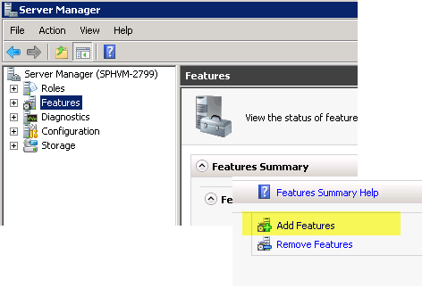

# <a name="configure-msmq-for-sharepoint-workflows"></a>Настройка MSMQ для рабочих процессов SharePoint

Сведения о настройке очередей сообщений Microsoft (MSMQ) в SharePoint для поддержки асинхронные события системы обмена сообщениями в рабочих процессах SharePoint. 

## <a name="enabling-msmq"></a>Включение MSMQ

MSMQ — это компонент Windows Server, которые можно включить на компьютере SharePoint Server, чтобы разрешить асинхронные события системы обмена сообщениями в рабочих процессах SharePoint. Чтобы обеспечить поддержку асинхронные события системы обмена сообщениями, необходимо включить MSMQ на компьютере SharePoint Server.
  
    
    
MSMQ предоставляется как «Функция» в Windows Server. Чтобы включить MSMQ, выполните следующие действия.
  
    
    

> **Важные:** Снимки экрана, включены приходятся на Windows Server 2008 R2. Пользовательский Интерфейс может отличаться от эта функция включена в Windows Server 2012. 
  
    
    


1. На компьютере SharePoint Server откройте **Диспетчер сервера**.
    
  
2. В левой области выберите значок **функции**, а затем выберите **Добавить компоненты**, как показано на рисунке 1.
    
   **Рис. 1. Добавление функции очереди сообщений.**

  

  
  

  

  
3. В окне **Мастер добавления компонентов**, который отображается выберите **Очередь сообщений**. Оставьте значения по умолчанию и затем нажмите кнопку **Далее**, а затем нажмите кнопку **установить**.
    
  
4. Теперь необходимо перезагрузить компьютер.
    
  
5. После перезапуска, откройте **Диспетчер сервера**, а затем откройте значок " **Очередь сообщений** " в панели слева. Обратите внимание на то, что она теперь содержит **Очереди сообщений** папки и вложенные папки, как показано на рисунке 2.
    
    > **Примечание:** В Windows Server 2012 очереди не содержатся в **Диспетчер сервера**. Вместо этого перейдите в раздел **Управление компьютером**, а затем выберите **службы и приложения**. 
6. Выберите подкаталог **Частные очереди**. Это каталог, в котором хранятся сообщения события рабочего процесса.
    
   **На рисунке 2. Очередь сообщений компонент, добавленный в диспетчер сервера.**

  

  
  

    
    
    
    > **Примечание:** При первом добавлении средства **Очередей сообщений** , **Частные очереди** папка пуста. Тем не менее после запуска рабочего процесса, активируется по событию (или активировать по SharePoint, выполняется событие контента изменения рабочего процесса) выполняется заполнение папку **Частные очереди** , как показано на рисунке 2.
7. Чтобы завершить установку, необходимо установить свойство **SPWorkflowServiceApplicationProxy.AllowQueue** для **true** с помощью сценария Windows PowerShell. В **командной консоли администрирования SharePoint**, выполните следующие действия:
    
```
  
$proxy = Get-SPWorkflowServiceApplicationProxy
$proxy.AllowQueue = $true;
$proxy.Update();

```


## <a name="troubleshooting-msmq"></a>Устранение неполадок MSMQ

Центр разработчиков Windows предоставляет подробную документацию MSMQ. Ниже перечислены некоторые полезные ресурсы.
  
    
    

-  [Об очереди сообщений](http://msdn.microsoft.com/en-us/library/windows/desktop/ms706032%28v=vs.85%29.aspx)
    
  
-  [Справочник по очереди сообщений](http://msdn.microsoft.com/en-us/library/windows/desktop/ms700112%28v=vs.85%29.aspx)
    
  
-  [Очередь сообщений об ошибках и коды информации](http://msdn.microsoft.com/en-us/library/windows/desktop/ms700106%28v=vs.85%29.aspx)
    
  

## <a name="additional-resources"></a>Дополнительные ресурсы
<a name="bk_addresources"> </a>


-  [Очередь сообщений (MSMQ)](http://msdn.microsoft.com/en-us/library/windows/desktop/ms711472%28v=vs.85%29.aspx)
    
  

  
    
    

