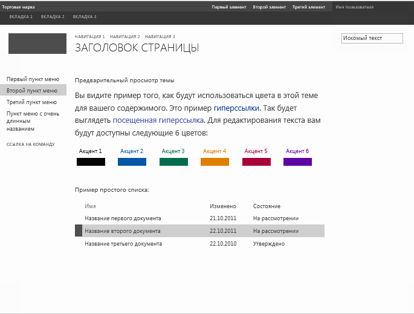

# <a name="create-a-master-page-preview-file-in-sharepoint"></a><span data-ttu-id="eb376-102">Создание файла предварительного просмотра эталонной страницы в SharePoint</span><span class="sxs-lookup"><span data-stu-id="eb376-102">How to: Create a master page preview file in SharePoint</span></span>

<span data-ttu-id="eb376-103">Узнайте, как создавать файлы предварительного просмотра эталонных страниц, которые используются при работе с темами SharePoint для предварительного просмотра выбранных компонентов темы.</span><span class="sxs-lookup"><span data-stu-id="eb376-103">Learn how to create master page preview files that are used in the SharePoint theming experience to display a preview of selected theme components.</span></span>

<span data-ttu-id="eb376-104">Мастер **изменения внешнего вида** служит отправной точкой для начала работы с темами в SharePoint.</span><span class="sxs-lookup"><span data-stu-id="eb376-104">The **Change the look** wizard is the entry point to the SharePoint theming experience.</span></span> <span data-ttu-id="eb376-105">Коллекция макетов — это первая страница мастера **изменения внешнего вида**. В ней отображается эскизное представление доступных макетов.</span><span class="sxs-lookup"><span data-stu-id="eb376-105">Design gallery The design gallery is the first page in the Change the look wizard. The design gallery shows a thumbnail view of available designs.</span></span> <span data-ttu-id="eb376-106">Пользователям предлагается выбрать макет сайта и перейти на следующую страницу для его дальнейшей настройки.</span><span class="sxs-lookup"><span data-stu-id="eb376-106">Users select a design for their site and then continue to the next page where they can customize the design.</span></span> <span data-ttu-id="eb376-107">Перед тем как применить выбранный макет к своему сайту, можно воспользоваться функцией предварительного просмотра.</span><span class="sxs-lookup"><span data-stu-id="eb376-107">Users can then preview the site before applying the design to their site.</span></span> <span data-ttu-id="eb376-108">Файл предварительного просмотра эталонной страницы используется для создания эскиза и просмотра изображений.</span><span class="sxs-lookup"><span data-stu-id="eb376-108">The master page preview file is used to generate the thumbnail and preview images.</span></span> <span data-ttu-id="eb376-109">Если эталонная страница не содержит файл предварительного просмотра, она не подходит для работы с темой.</span><span class="sxs-lookup"><span data-stu-id="eb376-109">If a master page does not have a corresponding preview file, it cannot be used in the theming experience.</span></span>
  
    
    

<span data-ttu-id="eb376-110">Дополнительные сведения см. в статье  [Общие сведения о темах для SharePoint](themes-overview-for-sharepoint.md).</span><span class="sxs-lookup"><span data-stu-id="eb376-110">For more information, see  [Themes overview for SharePoint](themes-overview-for-sharepoint.md).</span></span>
## <a name="core-concepts-to-know-for-working-with-master-page-preview-files"></a><span data-ttu-id="eb376-111">Базовые концепции для работы с файлами предварительного просмотра эталонных страниц</span><span class="sxs-lookup"><span data-stu-id="eb376-111">Core concepts to know for working with master page preview files</span></span>
<span data-ttu-id="eb376-112"><a name="Introduction"> </a></span><span class="sxs-lookup"><span data-stu-id="eb376-112"><a name="Introduction"> </a></span></span>

<span data-ttu-id="eb376-113">В таблице 1 перечислены статьи, посвященные базовым концепциями для работы с файлами предварительного просмотра эталонных страниц.</span><span class="sxs-lookup"><span data-stu-id="eb376-113">Table 1 lists articles that can help you understand the core concepts for working with master page preview files.</span></span>
  
    
    

<span data-ttu-id="eb376-114">**Таблица 1. Базовые концепции для работы с файлами предварительного просмотра эталонных страниц**</span><span class="sxs-lookup"><span data-stu-id="eb376-114">**Table 1. Core concepts for working with master page preview files**</span></span>


|<span data-ttu-id="eb376-115">**Название статьи**</span><span class="sxs-lookup"><span data-stu-id="eb376-115">**Article Title**</span></span>|<span data-ttu-id="eb376-116">**Описание**</span><span class="sxs-lookup"><span data-stu-id="eb376-116">**Description**</span></span>|
|:-----|:-----|
| [<span data-ttu-id="eb376-117">Общие сведения о темах для SharePoint</span><span class="sxs-lookup"><span data-stu-id="eb376-117">Themes overview for SharePoint</span></span>](themes-overview-for-sharepoint.md) <br/> |<span data-ttu-id="eb376-118">Сведения о работе с темами в SharePoint.</span><span class="sxs-lookup"><span data-stu-id="eb376-118">Learn about the theming experience in SharePoint.</span></span>  <br/> |
| [<span data-ttu-id="eb376-119">Выбор темы для сайта публикации</span><span class="sxs-lookup"><span data-stu-id="eb376-119">Choose a theme for your publishing site</span></span>](http://office.microsoft.com/ru-RU/office365-sharepoint-online-enterprise-help/choose-a-theme-for-your-publishing-site-HA102891580.aspx) <br/> |<span data-ttu-id="eb376-120">Узнайте, как изменить внешний вид и функции сайта SharePoint с помощью мастера **изменения внешнего вида**.</span><span class="sxs-lookup"><span data-stu-id="eb376-120">Learn how to change the look and feel of a SharePoint site by using the **Change the look** wizard.</span></span> <br/> |
   

## <a name="what-is-a-master-page-preview-file"></a><span data-ttu-id="eb376-121">Что такое файл предварительного просмотра эталонной страницы?</span><span class="sxs-lookup"><span data-stu-id="eb376-121">What is a master page preview file?</span></span>
<span data-ttu-id="eb376-122"><a name="section1"> </a></span><span class="sxs-lookup"><span data-stu-id="eb376-122"><a name="section1"> </a></span></span>

<span data-ttu-id="eb376-p102">Файлы предварительного просмотра эталонных страниц (файлы предварительного просмотра)  это специально отформатированные файлы с разделами для палитры цветов и схемы шрифтов по умолчанию, CSS и HTML с токенами. Файл предварительного просмотра эталонной страницы должен иметь такое же имя (за исключением расширения файла), что и соответствующая эталонная страница. Например, если у вас есть эталонная страница с именем article.master, соответствующий файл предварительного просмотра будет иметь имя article.preview. Эталонные страницы и файлы их предварительного просмотра хранятся в коллекции эталонных страниц.</span><span class="sxs-lookup"><span data-stu-id="eb376-p102">Master page preview files (.preview files) are specially formatted files that have sections for default color palette, default font scheme, tokenized CSS, and tokenized HTML. The master page preview file must use the same name (excluding the extension) as the corresponding master page. For example, if you have a master page named article.master, the corresponding master page preview file is named article.preview. Master pages and master page previews are stored in the Master Page Gallery.</span></span>
  
    
    
<span data-ttu-id="eb376-127">Файл предварительного просмотра эталонной страницы имеет следующую структуру:</span><span class="sxs-lookup"><span data-stu-id="eb376-127">A master page preview file has the following structure:</span></span>
  
    
    


```HTML
Default color palette
[SECTION]
Default font scheme
[SECTION]
CSS
[SECTION]
HTML
```

<span data-ttu-id="eb376-128">В файле предварительного просмотра эталонной страницы:</span><span class="sxs-lookup"><span data-stu-id="eb376-128">In the master page preview file:</span></span>
  
    
    

-  <span data-ttu-id="eb376-p103">_Палитра цветов по умолчанию_  это файл SPCOLOR в коллекции тем (http:// _ИмяСемействаСайтов_/_catalogs/theme/15/), который нужно использовать по умолчанию. Палитра цветов по умолчанию соответствует цветам, которые используются на эталонной странице в состоянии по умолчанию, то есть прежде чем пользователь выберет палитру цветов в мастере **изменения внешнего вида**.</span><span class="sxs-lookup"><span data-stu-id="eb376-p103">_Default color palette_ is the .spcolor file in the Theme Gallery (http:// _SiteColltionName_/_catalogs/theme/15/) that you want to use as the default. The default color palette corresponds to the colors that are used in the master page in its default state. That is, before a user has selected a color palette in the **Change the look** wizard.</span></span>
    
  
-  <span data-ttu-id="eb376-p104">_Схема шрифтов по умолчанию_  это файл SPFONT в коллекции тем (http:// _ИмяСемействаСайтов_/_catalogs/theme/15/), который нужно использовать по умолчанию. Схема шрифтов по умолчанию соответствует шрифтам, используемым на эталонной странице в состоянии по умолчанию, то есть прежде чем пользователь выберет схему шрифтов в мастере **изменения внешнего вида**.</span><span class="sxs-lookup"><span data-stu-id="eb376-p104">_Default font scheme_ is the .spfont file in the Theme Gallery (http:// _SiteCollectionName_/_catalogs/theme/15/) that you want to use as the default. The default font scheme corresponds to the fonts that are used in the master page in its default state. That is, before a user has selected a font scheme in the **Change the look** wizard.</span></span>
    
  
-  <span data-ttu-id="eb376-p105">_CSS_  это раздел, содержащий каскадные таблицы стилей (CSS). Все классы CSS должны иметь приставку[ID]. В следующем примере показан фрагмент раздела CSS в файле предварительного просмотра эталонных страниц.</span><span class="sxs-lookup"><span data-stu-id="eb376-p105">_CSS_ is the section that contains cascading style sheets (CSS). All CSS classes must be prefixed with[ID]. The following example shows a portion of the CSS section in a master page preview file.</span></span>
    
```
  
[ID] #dgp-pageContainer
{
    background-color: [T_THEME_COLOR_PAGEBACKGROUND];
    color: [T_THEME_COLOR_BODYTEXT];
    width: 100%;
    height:100%;     
    background-image: url('[T_IMAGE]');       
    background-size: cover;
    font-family: [T_BODY_FONT];   
}
```

-  <span data-ttu-id="eb376-138">_HTML_ — это раздел HTML, в котором определяется структура HTML для предварительного просмотра.</span><span class="sxs-lookup"><span data-stu-id="eb376-138">_HTML_ is the HTML section that defines the HTML structure of the preview.</span></span>
    
> [!NOTE]
> <span data-ttu-id="eb376-139">Все значения измерения в файле предварительного просмотра эталонной страницы должны быть относительными.</span><span class="sxs-lookup"><span data-stu-id="eb376-139">Note: All dimension values should be specified as relative units in the master page preview file.</span></span> <span data-ttu-id="eb376-140">Например, значения измерения могут быть указаны в виде процентов или единиц измерения "em".</span><span class="sxs-lookup"><span data-stu-id="eb376-140">For example, dimension values can be specified as a percent or as an em measurement.</span></span> <span data-ttu-id="eb376-141">Дополнительные сведения о единицах измерения печатных строк см. в разделе [5.1.1. Длина относительно шрифта: единицы em, ex, ch и rem](http://www.w3.org/TR/2012/WD-css3-values-20120308/#font-relative-lengths) в рабочей версии модуля "Значения и единицы CSS W3C" (уровень 3).</span><span class="sxs-lookup"><span data-stu-id="eb376-141">For more information about em measurements, see section  [5.1.1. Font-relative lengths: the 'em', 'ex', 'ch', 'rem' units](http://www.w3.org/TR/2012/WD-css3-values-20120308/#font-relative-lengths) in the W3C CSS Values and Units Module Level 3 Working Draft.</span></span>
  
    
    

<span data-ttu-id="eb376-p107">В файлах предварительного просмотра эталонных страниц используются маркеры. Маркеры  это строковые значения, которые будут заменены текстом, значениями цветов или значениями шрифтов на созданной предварительной странице. В следующих разделах описываются доступные маркеры и их использование.</span><span class="sxs-lookup"><span data-stu-id="eb376-p107">Tokens are used throughout the master page preview file. Tokens are string values that will be replaced with text, color values, or font values in the generated preview. The following sections describe the available tokens and how they are used.</span></span>
  
    
    

### <a name="miscellaneous-tokens"></a><span data-ttu-id="eb376-145">Дополнительные маркеры</span><span class="sxs-lookup"><span data-stu-id="eb376-145">Miscellaneous tokens</span></span>

<span data-ttu-id="eb376-146">Дополнительные маркеры заменяются при предварительном просмотре указанными значениями ширины и высоты.</span><span class="sxs-lookup"><span data-stu-id="eb376-146">The miscellaneous tokens are replaced with specified height and width values in the preview.</span></span>
  
    
    

<span data-ttu-id="eb376-147">**Таблица 2. Дополнительные маркеры**</span><span class="sxs-lookup"><span data-stu-id="eb376-147">**Table 2. Miscellaneous tokens**</span></span>


|<span data-ttu-id="eb376-148">**Имя маркера**</span><span class="sxs-lookup"><span data-stu-id="eb376-148">**Token Name**</span></span>|<span data-ttu-id="eb376-149">**Описание**</span><span class="sxs-lookup"><span data-stu-id="eb376-149">**Description**</span></span>|
|:-----|:-----|
|<span data-ttu-id="eb376-150">[T_HEIGHT]</span><span class="sxs-lookup"><span data-stu-id="eb376-150">[T_HEIGHT]</span></span>  <br/> |<span data-ttu-id="eb376-151">Высота окна предварительного просмотра.</span><span class="sxs-lookup"><span data-stu-id="eb376-151">The height of the preview.</span></span>  <br/> |
|<span data-ttu-id="eb376-152">[T_WIDTH]</span><span class="sxs-lookup"><span data-stu-id="eb376-152">[T_WIDTH]</span></span>  <br/> |<span data-ttu-id="eb376-153">Ширина окна предварительного просмотра.</span><span class="sxs-lookup"><span data-stu-id="eb376-153">The width of the preview.</span></span>  <br/> |
|<span data-ttu-id="eb376-154">[T_IMAGE]</span><span class="sxs-lookup"><span data-stu-id="eb376-154">[T_IMAGE]</span></span>  <br/> |<span data-ttu-id="eb376-155">URL-адрес необязательного фонового изображения.</span><span class="sxs-lookup"><span data-stu-id="eb376-155">The URL of an optional background image.</span></span>  <br/> |
|<span data-ttu-id="eb376-156">[T_IMGHEIGHT]</span><span class="sxs-lookup"><span data-stu-id="eb376-156">[T_IMGHEIGHT]</span></span>  <br/> |<span data-ttu-id="eb376-157">Высота изображения, если она требуется.</span><span class="sxs-lookup"><span data-stu-id="eb376-157">The height of the image, if needed.</span></span>  <br/> |
|<span data-ttu-id="eb376-158">[T_IMGWIDTH]</span><span class="sxs-lookup"><span data-stu-id="eb376-158">[T_IMGWIDTH]</span></span>  <br/> |<span data-ttu-id="eb376-159">Ширина изображения, если она требуется.</span><span class="sxs-lookup"><span data-stu-id="eb376-159">The width of the image, if needed.</span></span>  <br/> |
   

### <a name="color-tokens"></a><span data-ttu-id="eb376-160">Маркеры цвета</span><span class="sxs-lookup"><span data-stu-id="eb376-160">Color tokens</span></span>

<span data-ttu-id="eb376-p108">Маркеры цвета заменяются в изображении предварительного просмотра значениями цветов. В таблице 3 описываются два формата маркеров цвета. Замените  _ПозицияЦвета_ именем позиции цвета. Маркеры цвета должны быть в верхнем регистре (например, [T_THEME_COLOR_PAGEBACKGROUND]). Список доступных маркеров цвета см. в разделе [Сопоставление цветовых слотов](color-palettes-and-fonts-in-sharepoint.md#colorSlots) статьи [Цветовые палитры и шрифты в SharePoint](color-palettes-and-fonts-in-sharepoint.md).</span><span class="sxs-lookup"><span data-stu-id="eb376-p108">Color tokens are replaced with color values in the preview image. Table 3 describes two formats for color tokens. Replace  _ColorSlot_ with the annotation name of the color slot. The color tokens must be uppercase (for example, [T_THEME_COLOR_PAGEBACKGROUND]). To see the list of available color tokens, see the [Color slot mapping](color-palettes-and-fonts-in-sharepoint.md#colorSlots) section in [Color palettes and fonts in SharePoint](color-palettes-and-fonts-in-sharepoint.md).</span></span>
  
    
    

<span data-ttu-id="eb376-166">**Таблица 3. Маркеры цвета**</span><span class="sxs-lookup"><span data-stu-id="eb376-166">**Table 3. Color tokens**</span></span>


|<span data-ttu-id="eb376-167">**Имя маркера**</span><span class="sxs-lookup"><span data-stu-id="eb376-167">**Token Name**</span></span>|<span data-ttu-id="eb376-168">**Описание**</span><span class="sxs-lookup"><span data-stu-id="eb376-168">**Description**</span></span>|
|:-----|:-----|
|<span data-ttu-id="eb376-169">[T_THEME_COLOR_ _ПозицияЦвета_]</span><span class="sxs-lookup"><span data-stu-id="eb376-169">[T_THEME_COLOR_ _ColorSlot_]</span></span>  <br/> |<span data-ttu-id="eb376-170">Используйте этот формат, если вам нужно значение цвета позиции.</span><span class="sxs-lookup"><span data-stu-id="eb376-170">Use this format if you want the color value of the color slot.</span></span>  <br/> |
|<span data-ttu-id="eb376-171">[T_THEME_COLOR_ _ПозицияЦвета__AA]</span><span class="sxs-lookup"><span data-stu-id="eb376-171">[T_THEME_COLOR_ _ColorSlot__AA]</span></span>  <br/> |<span data-ttu-id="eb376-p109">Используйте этот формат, если вам нужно 8-значное шестнадцатеричное значение позиции цвета. Этот формат полезен для фильтрующих значений, позволяющих управлять прозрачностью и градиентами в Internet Explorer.</span><span class="sxs-lookup"><span data-stu-id="eb376-p109">Use this format if you want the 8-digit hexadecimal value of the color slot. This format is useful for filter values to enable opacity and gradients in Internet Explorer.</span></span>  <br/> |
   

### <a name="font-tokens"></a><span data-ttu-id="eb376-174">Маркеры шрифтов</span><span class="sxs-lookup"><span data-stu-id="eb376-174">Font tokens</span></span>

<span data-ttu-id="eb376-175">Маркеры шрифтов заменяются в изображении предварительного просмотра значениями шрифтов.</span><span class="sxs-lookup"><span data-stu-id="eb376-175">The font tokens are replaced with font values in the preview image.</span></span>
  
    
    

- <span data-ttu-id="eb376-176">[T_ _ИмяПозиции__FONT]</span><span class="sxs-lookup"><span data-stu-id="eb376-176">[T_ _SlotName__FONT]</span></span>
    
  
<span data-ttu-id="eb376-p110">Замените  _ИмяПозиции_ именем позиции шрифта. Маркеры шрифтов должны быть в верхнем регистре (например, [T_BODY_FONT]). Список позиций шрифтов и мест страницы, где они используются, см. в разделе [Слоты шрифтов](color-palettes-and-fonts-in-sharepoint.md#fontSlot) статьи [Цветовые палитры и шрифты в SharePoint](color-palettes-and-fonts-in-sharepoint.md).</span><span class="sxs-lookup"><span data-stu-id="eb376-p110">Replace  _SlotName_ with the name of the font slot. The font tokens must be uppercase (for example, [T_BODY_FONT]).To see the list of font slots and where they are used in a page, see the [Font slots](color-palettes-and-fonts-in-sharepoint.md#fontSlot) section in [Color palettes and fonts in SharePoint](color-palettes-and-fonts-in-sharepoint.md).</span></span>
  
    
    

### <a name="text-content-tokens"></a><span data-ttu-id="eb376-179">Маркеры текстового контента</span><span class="sxs-lookup"><span data-stu-id="eb376-179">Text content tokens</span></span>

<span data-ttu-id="eb376-p111">Маркеры, перечисленные в таблице 4, используются в разделе HTML файла предварительного просмотра эталонной страницы. Маркеры заменяются примером текста в изображении предварительного просмотра в коллекции макетов. Пример текста показан на том же языке, что и остальные элементы сайта.</span><span class="sxs-lookup"><span data-stu-id="eb376-p111">The tokens listed in Table 4 are used in the HTML section of the master page preview file. The tokens are replaced with sample text in the preview image in the design gallery. The sample text is shown in the same language as the rest of the site.</span></span>
  
    
    

<span data-ttu-id="eb376-183">**Таблица 4. Маркеры текстового контента**</span><span class="sxs-lookup"><span data-stu-id="eb376-183">**Table 4. Text content tokens**</span></span>


|<span data-ttu-id="eb376-184">**Имя маркера**</span><span class="sxs-lookup"><span data-stu-id="eb376-184">**Token Name**</span></span>|<span data-ttu-id="eb376-185">**Описание**</span><span class="sxs-lookup"><span data-stu-id="eb376-185">**Description**</span></span>|
|:-----|:-----|
|<span data-ttu-id="eb376-186">[BRANDSTRING]</span><span class="sxs-lookup"><span data-stu-id="eb376-186">[BRANDSTRING]</span></span>  <br/> |<span data-ttu-id="eb376-p112">Фирменный текст, который отображается на странице. В предустановленных темах он отображается в левом верхнем углу с надписью "Марка".</span><span class="sxs-lookup"><span data-stu-id="eb376-p112">The brand text that appears on the page. In the preinstalled themes, it appears on the top-left corner "Brand".</span></span>  <br/> |
|<span data-ttu-id="eb376-189">[SUITELINK1]</span><span class="sxs-lookup"><span data-stu-id="eb376-189">[SUITELINK1]</span></span>  <br/> <span data-ttu-id="eb376-190">[SUITELINK2]</span><span class="sxs-lookup"><span data-stu-id="eb376-190">[SUITELINK2]</span></span>  <br/> <span data-ttu-id="eb376-191">[SUITELINK3]</span><span class="sxs-lookup"><span data-stu-id="eb376-191">[SUITELINK3]</span></span>  <br/> |<span data-ttu-id="eb376-p113">Ссылки, которые отображаются в комплексной панели. См. "Первый элемент", "Второй элемент", "Третий элемент" на рисунке 1.</span><span class="sxs-lookup"><span data-stu-id="eb376-p113">The suite links that appear in the suite bar. See "First Item", "Second Item", "Third Item" in Figure 1.</span></span>  <br/> |
|<span data-ttu-id="eb376-194">[WELCOME]</span><span class="sxs-lookup"><span data-stu-id="eb376-194">[WELCOME]</span></span>  <br/> |<span data-ttu-id="eb376-p114">Текст имени пользователя. См. "Имя пользователя" на рисунке 1.</span><span class="sxs-lookup"><span data-stu-id="eb376-p114">The user name text. See "User Name" in Figure 1.</span></span>  <br/> |
|<span data-ttu-id="eb376-197">[RIBBONTAB1]</span><span class="sxs-lookup"><span data-stu-id="eb376-197">[RIBBONTAB1]</span></span>  <br/> <span data-ttu-id="eb376-198">[RIBBONTAB2]</span><span class="sxs-lookup"><span data-stu-id="eb376-198">[RIBBONTAB2]</span></span>  <br/> <span data-ttu-id="eb376-199">[RIBBONTAB3]</span><span class="sxs-lookup"><span data-stu-id="eb376-199">[RIBBONTAB3]</span></span>  <br/> |<span data-ttu-id="eb376-p115">Имена вкладок ленты. См. "ВКЛАДКА 1", "ВКЛАДКА 2", "ВКЛАДКА 3" на рисунке 1.</span><span class="sxs-lookup"><span data-stu-id="eb376-p115">The names of ribbon tabs. See "TAB 1", "TAB 2", "TAB 3" in Figure 1.</span></span>  <br/> |
|<span data-ttu-id="eb376-202">[SEARCHBOX]</span><span class="sxs-lookup"><span data-stu-id="eb376-202">[SEARCHBOX]</span></span>  <br/> |<span data-ttu-id="eb376-p116">Текст в поле поиска. См. "Текст поиска" на рисунке 1.</span><span class="sxs-lookup"><span data-stu-id="eb376-p116">The text inside the search box. See "Search text" in Figure 1.</span></span>  <br/> |
|<span data-ttu-id="eb376-205">[TN1]</span><span class="sxs-lookup"><span data-stu-id="eb376-205">[TN1]</span></span>  <br/> <span data-ttu-id="eb376-206">[TN2]</span><span class="sxs-lookup"><span data-stu-id="eb376-206">[TN2]</span></span>  <br/> <span data-ttu-id="eb376-207">[TN3]</span><span class="sxs-lookup"><span data-stu-id="eb376-207">[TN3]</span></span>  <br/> |<span data-ttu-id="eb376-p117">Элементы горизонтальной навигации. "НАВИГАЦИЯ 1", "НАВИГАЦИЯ 2", "НАВИГАЦИЯ 3".</span><span class="sxs-lookup"><span data-stu-id="eb376-p117">The horizontal navigation items. "NAVIGATION 1", "NAVIGATION 2", "NAVIGATION 3".</span></span>  <br/> |
|<span data-ttu-id="eb376-210">[TITLE]</span><span class="sxs-lookup"><span data-stu-id="eb376-210">[TITLE]</span></span>  <br/> |<span data-ttu-id="eb376-p118">Заголовок страницы. "Заголовок страницы".</span><span class="sxs-lookup"><span data-stu-id="eb376-p118">The page title. "Page Title".</span></span>  <br/> |
|<span data-ttu-id="eb376-213">[QL1]</span><span class="sxs-lookup"><span data-stu-id="eb376-213">[QL1]</span></span>  <br/> <span data-ttu-id="eb376-214">[QL2]</span><span class="sxs-lookup"><span data-stu-id="eb376-214">[QL2]</span></span>  <br/> <span data-ttu-id="eb376-215">[QL3]</span><span class="sxs-lookup"><span data-stu-id="eb376-215">[QL3]</span></span>  <br/> <span data-ttu-id="eb376-216">[QL4]</span><span class="sxs-lookup"><span data-stu-id="eb376-216">[QL4]</span></span>  <br/> |<span data-ttu-id="eb376-p119">Элементы вертикальной навигации. "Первый элемент меню", "Второй элемент меню", "Третий элемент меню".</span><span class="sxs-lookup"><span data-stu-id="eb376-p119">The vertical navigation items. "First menu item", "Second menu item", "Third menu item".</span></span>  <br/> |
|<span data-ttu-id="eb376-219">[QLADD]</span><span class="sxs-lookup"><span data-stu-id="eb376-219">[QLADD]</span></span>  <br/> |<span data-ttu-id="eb376-p120">Ссылка под элементами вертикальной навигации. См. "КОМАНДНАЯ ССЫЛКА" на рисунке 1.</span><span class="sxs-lookup"><span data-stu-id="eb376-p120">The link below the vertical navigation items. See "COMMAND LINK" in Figure 1.</span></span>  <br/> |
|<span data-ttu-id="eb376-222">[CA TABLE HEADER]</span><span class="sxs-lookup"><span data-stu-id="eb376-222">[CA TABLE HEADER]</span></span>  <br/> |<span data-ttu-id="eb376-p121">Заголовок над текстом страницы. На рис. 1 это "Добро пожаловать в предварительный просмотр вашей темы!".</span><span class="sxs-lookup"><span data-stu-id="eb376-p121">The heading above the page text. In Figure 1, "Welcome to the preview of your theme!".</span></span>  <br/> |
|<span data-ttu-id="eb376-225">[CA TABLE DESCRIPTION]</span><span class="sxs-lookup"><span data-stu-id="eb376-225">[CA TABLE DESCRIPTION]</span></span>  <br/> |<span data-ttu-id="eb376-p122">Текст описания. На рис. 1 это "Вы смотрите на пример использования цветов в этой теме для вашего контента. Это пример...".</span><span class="sxs-lookup"><span data-stu-id="eb376-p122">The description text. In Figure 1, "You are looking at an example of how the colors will be used in this theme for your content. This is an example of a…".</span></span>  <br/> |
|<span data-ttu-id="eb376-229">[CA ACCENT COLORS]</span><span class="sxs-lookup"><span data-stu-id="eb376-229">[CA ACCENT COLORS]</span></span>  <br/> |<span data-ttu-id="eb376-230">Список цветов и блоков акцентов.</span><span class="sxs-lookup"><span data-stu-id="eb376-230">The list of accent colors and blocks.</span></span>  <br/> |
|<span data-ttu-id="eb376-231">[CA LIST TITLE]</span><span class="sxs-lookup"><span data-stu-id="eb376-231">[CA LIST TITLE]</span></span>  <br/> |<span data-ttu-id="eb376-p123">Заголовок списка. На рис. 1 это "Пример списка".</span><span class="sxs-lookup"><span data-stu-id="eb376-p123">The heading of the list. In Figure 1, "Example of a list".</span></span>  <br/> |
|<span data-ttu-id="eb376-234">[CA TABLE]</span><span class="sxs-lookup"><span data-stu-id="eb376-234">[CA TABLE]</span></span>  <br/> |<span data-ttu-id="eb376-235">Пример списка.</span><span class="sxs-lookup"><span data-stu-id="eb376-235">The sample list.</span></span>  <br/> |
|<span data-ttu-id="eb376-236">[SITETITLE]</span><span class="sxs-lookup"><span data-stu-id="eb376-236">[SITETITLE]</span></span>  <br/> |<span data-ttu-id="eb376-p124">Заголовок сайта. См. "Заголовок сайта" на рисунке 1.</span><span class="sxs-lookup"><span data-stu-id="eb376-p124">The title of the site. See "Site Title" in Figure 1.</span></span>  <br/> |
   

<span data-ttu-id="eb376-239">**Рисунок 1. Предустановленная тема с примером текста**</span><span class="sxs-lookup"><span data-stu-id="eb376-239">**Figure 1. Preinstalled theme with sample text**</span></span>

  
    
    

  
    
    

  
    
    

  
    
    

  
    
    

## <a name="create-a-master-page-preview-file"></a><span data-ttu-id="eb376-241">Создание файла просмотра для эталонной страницы</span><span class="sxs-lookup"><span data-stu-id="eb376-241">Create a master page preview file</span></span>
<span data-ttu-id="eb376-242"><a name="section2"> </a></span><span class="sxs-lookup"><span data-stu-id="eb376-242"><a name="section2"> </a></span></span>

<span data-ttu-id="eb376-243">Чтобы создать файл предварительного просмотра эталонной страницы, используйте имеющийся предварительный просмотр эталонной страницы в качестве отправной точки.</span><span class="sxs-lookup"><span data-stu-id="eb376-243">To create a master page preview file, use an existing master page preview as a starting point.</span></span>
  
    
    

### <a name="to-create-a-master-page-preview"></a><span data-ttu-id="eb376-244">Создание предварительного просмотра эталонной страницы</span><span class="sxs-lookup"><span data-stu-id="eb376-244">To create a master page preview</span></span>


1. <span data-ttu-id="eb376-p125">Создайте копию файла предварительного просмотра эталонной страницы. SharePoint включает файлы oslo.preview и seattle.preview.</span><span class="sxs-lookup"><span data-stu-id="eb376-p125">Make a copy of a master page preview. SharePoint includes oslo.preview and seattle.preview.</span></span>
    
  
2. <span data-ttu-id="eb376-p126">Переименуйте копию файла предварительного просмотра согласно соответствующей эталонной странице. Например, если эталонная страница называется article.master, переименуйте файл предварительного просмотра в article.preview.</span><span class="sxs-lookup"><span data-stu-id="eb376-p126">Rename the copy of the master page preview to match its corresponding master page. For example, if your master page is named article.master, rename the master page preview article.preview.</span></span>
    
  
3. <span data-ttu-id="eb376-p127">С помощью редактора HTML отредактируйте файл предварительного просмотра эталонной страницы. Обновите файл в соответствии с макетом и внешним видом эталонной страницы.</span><span class="sxs-lookup"><span data-stu-id="eb376-p127">Use an HTML editor to edit the master page preview file. Update the file to reflect the layout and appearance of your master page.</span></span>
    
    > <span data-ttu-id="eb376-251">**Совет.** В файле предварительного просмотра эталонной страницы значения размеров указываются в виде процентов.</span><span class="sxs-lookup"><span data-stu-id="eb376-251">**Tip:** Dimension values are specified as percentages in the master page preview file.</span></span> <span data-ttu-id="eb376-252">В приведенном ниже примере показан один способ преобразования абсолютного размера (в пикселях) в относительный (в процентах).</span><span class="sxs-lookup"><span data-stu-id="eb376-252">The following example shows one method for converting an absolute measurement (pixels) into a relative measurement (percentage).</span></span> <span data-ttu-id="eb376-253">Допустим, используется браузер размером 1024 x 768.</span><span class="sxs-lookup"><span data-stu-id="eb376-253">Assume you have a browser size of 1024x768.</span></span> <span data-ttu-id="eb376-254">Если высота элемента эталонной страницы составляет 32 пикселя, а родительским элементом является основной текст страницы, то для вычисления процента необходимо разделить высоту элемента на высоту браузера.</span><span class="sxs-lookup"><span data-stu-id="eb376-254">If the master page has an element height of 32 pixels and the parent element is the body of the page, you calculate the percentage by dividing the element height by the browser height.</span></span> <span data-ttu-id="eb376-255">Относительный размер составляет 4 % (32/768).</span><span class="sxs-lookup"><span data-stu-id="eb376-255">The relative measurement is 4%(32/768).</span></span> 
4. <span data-ttu-id="eb376-256">Отправьте файл предварительного просмотра эталонной страницы в коллекцию эталонных страниц.</span><span class="sxs-lookup"><span data-stu-id="eb376-256">Upload the master page preview file to the Master Page Gallery.</span></span>
    
  
5. <span data-ttu-id="eb376-257">С помощью **мастера изменения внешнего вида** протестируйте предварительный просмотр эталонной страницы с содержимым вашего сайта.</span><span class="sxs-lookup"><span data-stu-id="eb376-257">Use the **Change the look** wizard to test the master page preview with your site content.</span></span>
    
    > [!NOTE]
    > <span data-ttu-id="eb376-258">Вы также можете создать оформление с использованием новой эталонной страницы, добавив элемент в список "Варианты оформления".</span><span class="sxs-lookup"><span data-stu-id="eb376-258">Note: You can also create a design that uses the new master page by adding an item to the Composed Looks list.</span></span> <span data-ttu-id="eb376-259">Оно будет доступно в коллекции вариантов оформления (на первой странице **мастера изменения внешнего вида**).</span><span class="sxs-lookup"><span data-stu-id="eb376-259">The design will be available in the design gallery (the first page of the **Change the look** wizard).</span></span> <span data-ttu-id="eb376-260">Дополнительные сведения см. в разделе [Развертывание темы с помощью пользовательского интерфейса](how-to-deploy-a-custom-theme-in-sharepoint.md#section2) статьи [Инструкции. Развертывание настраиваемой темы в SharePoint](how-to-deploy-a-custom-theme-in-sharepoint.md).</span><span class="sxs-lookup"><span data-stu-id="eb376-260">For more information, see the [Deploy a theme by using the user interface](how-to-deploy-a-custom-theme-in-sharepoint.md#section2) procedure in [How to: Deploy a custom theme in SharePoint](how-to-deploy-a-custom-theme-in-sharepoint.md).</span></span> 

6. <span data-ttu-id="eb376-261">По мере необходимости повторите действия 3–5.</span><span class="sxs-lookup"><span data-stu-id="eb376-261">Repeat steps 3 to 5, as necessary.</span></span>
    
  

## <a name="see-also"></a><span data-ttu-id="eb376-262">См. также</span><span class="sxs-lookup"><span data-stu-id="eb376-262">See also</span></span>
<span data-ttu-id="eb376-263"><a name="bk_addresources"> </a></span><span class="sxs-lookup"><span data-stu-id="eb376-263"><a name="bk_addresources"> </a></span></span>


-  [<span data-ttu-id="eb376-264">Разработка макета сайта в SharePoint</span><span class="sxs-lookup"><span data-stu-id="eb376-264">Develop the site design in SharePoint</span></span>](develop-the-site-design-in-sharepoint.md)
    
  
-  [<span data-ttu-id="eb376-265">Инструкции. Развертывание пользовательской темы в SharePoint</span><span class="sxs-lookup"><span data-stu-id="eb376-265">How to: Deploy a custom theme in SharePoint</span></span>](how-to-deploy-a-custom-theme-in-sharepoint.md)
    
  
-  [<span data-ttu-id="eb376-266">Цветовые палитры и шрифты в SharePoint</span><span class="sxs-lookup"><span data-stu-id="eb376-266">Color palettes and fonts in SharePoint</span></span>](color-palettes-and-fonts-in-sharepoint.md)
    
  
-  [<span data-ttu-id="eb376-267">Блог команды разработчиков SharePoint. Свой собственный стиль с помощью тем SharePoint</span><span class="sxs-lookup"><span data-stu-id="eb376-267">SharePoint Team Blog: Show off your style with SharePoint theming</span></span>](http://blogs.office.com/b/sharepoint/archive/2012/10/29/show-off-your-style-with-sharepoint-theming.aspx)
    
  

