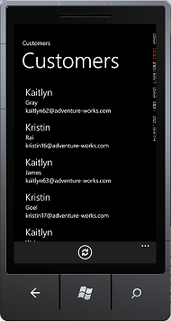

# Создание в SharePoint мобильного приложения, содержащего данные из внешнего источника

Узнайте, как создать простое приложение мобильных устройств в SharePoint, который содержит данные из внешнего источника данных с помощью служб Business Connectivity Services, подключение к внешнему списку.
SharePoint позволяет создавать приложения для мобильных устройств, имеющие доступ к внешним данным из баз данных, корпоративных приложений и служб Web 2.0, с помощью служб Business Connectivity Services. Можно также указать полный взаимодействия с внешними данными, включая возможностью обратной записи с мобильного устройства. Это делается путем создания приложения, которые подключаются к внешним спискам, которые представляют собой особый тип списков в SharePoint, которые основаны на внешние типы контента и содержат данные из внешней системы. Новый шаблон списка SharePoint для Windows Phone в Visual Studio 2010 позволяет вам быстро и легко создавать приложения для Windows Phone, которое подключается к внешним спискам. Например можно создавать приложения для Windows phone, которое переводит каталог продуктов для список в SharePoint на номер телефона для сотрудников отдела продаж. В этом разделе показано, как создать приложение Windows Phone, которое отображает внешних данных из учебной базы данных "Борей" с помощью подключения к внешнему списку в SharePoint. Обратите внимание на то, что в этом примере внешний список подключается к базе данных Northwind, с помощью настраиваемой службы OData; Тем не менее можно подключиться к непосредственно баз данных, а также все внешние системы, поддерживаемый Business Connectivity Services с помощью внешних списков. С помощью нового шаблона списка SharePoint в Visual Studio можно создать мобильного приложения, который можно получить доступ к внешнему списку на сайте SharePoint. В этой статье приводятся пошаговые процедуры, которая начинается с Отправка внешних модели службы подключения к бизнес-данных (BDC) и заканчивается на тестирование нового мобильного приложения.
  
    
    

> **Важные:** При разработке приложения для Windows Phone 8, должны использовать Visual Studio Express 2012 г., а не в Visual Studio 2010 Express. За исключением среды разработки все сведения в этой статье применимы к созданию приложений для Windows Phone 8 и Windows Phone 7. > Для получения дополнительных сведений см [как: Настройка среды разработки мобильных приложений для SharePoint](how-to-set-up-an-environment-for-developing-mobile-apps-for-sharepoint.md). 
  
    
    

## Необходимые условия для создания мобильного приложения, которое содержит внешние данные

- Для установки SharePoint с правами администратора для загрузки модели BDC для базы данных Northwind и сайта SharePoint, где вы создаете внешний список
    
  
- Microsoft Visual Studio Express с новыми шаблонами телефонов SharePoint из [Пакета SDK Microsoft SharePoint для Windows Phone 7.1](http://www.microsoft.com/en-us/download/details.aspx?id=30476)
    
  
- Модели BDC для нашего exampleNorthwind_oData.bdmc (загрузить из [SharePoint: создание простой внешний список телефонных приложения](http://code.msdn.microsoft.com/sharepoint/SharePoint-Create-a-88800202))
    
  
- Для установки SharePoint с правами администратора для загрузки модели BDC для базы данных Northwind и сайта SharePoint, где вы создаете внешний список
    
  

## Шаг 1: Отправка метаданных модели BDC

Модели BDC — это основной Business Connectivity Services. Это XML-файл, использующий структур данных, таких как **сущности** (внешнего типа контента) и **метод** для абстрактного сложных сведения о внешней системе. Он будет создан при создании внешнего типа контента с помощью SharePoint Designer и для некоторых типов данных такие источники .NET и OData, вам необходимо создать модель BDC вручную или с помощью Visual Studio. При отправке модели BDC в хранилище метаданных BDC, с помощью центра администрирования SharePoint внешних типов контента, определенных в модели можно использовать для создания внешних списков в SharePoint, которые представляют списки, отображающие данные из связанного внешней системы. На этом этапе будет передачи данных "Борей" пример BDC модели в хранилище метаданных с помощью центра администрирования SharePoint.
  
    
    

1. Перейдите в центр администрирования.
    
  
2. Выберите **Управление приложениями**, а затем выберите **Управление приложениями-службами**.
    
  
3. На странице приложения-службы выберите **Службы подключения к бизнес-данным**.
    
  
4. На ленте в приложении-службе BDC выберите команду **Импорт**.
    
  
5. На странице "Импорт модели BDC" выберите **Служба подключения к бизнес-данным**.
    
  
6. На ленте в приложении-службе BDC выберите команду **Импорт**.
    
  
7. На странице "Импорт модели BDC" нажмите кнопку **Обзор**.
    
  
8. В диалоговом окне **выбрать файл для загрузки** перейдите к файлу Northwind_oData.bdcm и нажмите кнопку **Открыть**.
    
  
9. После импорта файла нажмите кнопку « **ОК** ».
    
  

## Шаг 2: Предоставление разрешений

Далее необходимо задать разрешения для модели BDC, чтобы указать, кто может выполнять методы, описанные в этой модели. Этот шаг является обязательным. Рекомендуется предоставить определенные разрешения для каждого пользователя или группы, которое должно их, таким образом, что учетные данные полностью предоставления минимальных прав, необходимых для выполнения необходимых задач. Дополнительные сведения о настройке разрешений см служба подключения к бизнес разрешения в  [Общие сведения о безопасности служб Business Connectivity Services (SharePoint Server 2010)](http://technet.microsoft.com/en-us/library/ee661740.aspx). На этом этапе предоставить разрешение на свой адрес выполнение методов, описанных в модели BDC образец данных "Борей".
  
    
    

1. Перейдите в центр администрирования.
    
  
2. Выберите **Управление приложениями**, а затем выберите **Управление приложениями-службами**.
    
  
3. На странице приложения-службы выберите **Службы подключения к бизнес-данным**.
    
  
4. На ленте выберите из раскрывающегося списка в группе **представление** **Моделей BDC**.
    
  
5. В списке моделей BDC наведите указатель мыши на Northwind_oData.bdcm и выберите команду **Задать разрешения**, как показано на рисунке 1.
    
   **На рисунке 1. Выбор разрешений для модели BDC**

  

  
  

  

  
6. В диалоговом окне **Задать разрешения для объекта** нажмите кнопку **Обзор**.
    
  
7. В диалоговом окне **Выбор пользователей и групп** выполните поиск учетной записи и нажмите кнопку « **ОК** ».
    
  
8. Выберите разрешения для **редактирования**, **выполнение**, **Доступно для выбора в клиентах** и **Задание разрешений**, как показано на рисунке 2.
    
   **На рисунке 2. Настройка разрешений объектов**

  

  
  

  

  
9. Нажмите кнопку **ОК**.
    
  
10. На ленте выберите **Внешние типы контента** из раскрывающегося списка в группе **представление**.
    
  
11. В списке внешние типы контента наведите указатель мыши на **клиента** и выберите **Задание разрешений**.
    
  
12. В диалоговом окне **Задать разрешения для объекта** нажмите кнопку **Обзор** и поиска для вашей учетной записи.
    
  
13. В диалоговом окне **Задать разрешения для объекта** последовательно выберите пункты **Добавить** и выберите разрешения для **редактирования**, **выполнение**, **Доступно для выбора в клиентах** и **Задание разрешений**.
    
  
14. Убедитесь, что установлен флажок **Распространить разрешения**.
    
  
15. Нажмите кнопку **ОК**.
    
  

## Шаг 3: Создание внешнего списка

Теперь, когда отправлен модели BDC и установка разрешений, можно создать внешний список на основе внешнего типа контента, определенных в модели BDC. На этом этапе создается внешний список на основе клиента внешнего типа контента определенных в модели Northwind BDC, загруженный в  [Шаг 1: Отправка метаданных модели BDC](how-to-create-a-mobile-app-in-sharepoint-that-contains-data-from-an-externa.md#HowToCreateSimpleExternalListBasedPhoneApp_Step1).
  
    
    

1. Перейдите на сайт SharePoint, где будут нового списка.
    
  
2. На домашней странице веб-узла выберите **Дополнительные**.
    
  
3. На странице "приложения" выберите **Добавить приложение**.
    
  
4. На странице Добавить страницу приложения наведите указатель мыши на **Внешний список** и выберите команду **добавить его**.
    
  
5. В диалоговом окне **Добавление внешнего списка** введите имя, напримерклиентов в поле **имя**.
    
  
6. В поле **Внешний тип контента** укажите источник внешних данных, который загрузил на шаге 1.
    
  
7. Нажмите кнопку **ОК**.
    
  
8. На странице "приложения" выберите **Список клиентов** для просмотра списка.
    
  

## Шаг 4: Создание мобильного приложения на основе шаблона приложения списка SharePoint для Windows Phone

Внешний список готов, и теперь можно создать приложение Windows Phone 7, которое подключается к внешнему списку, созданной на  [Шаг 3: Создание внешнего списка](how-to-create-a-mobile-app-in-sharepoint-that-contains-data-from-an-externa.md#HowToCreateSimpleExternalListBasedPhoneApp_Step3) и отображения данных клиента из базы данных Northwind.
  
    
    

1. Запустите Visual Studio 2010, экспресс-выпуск.
    
  
2. В строке меню щелкните **файл**, **Создать проект**. Откроется диалоговое окно **Новый проект**.
    
  
3. В диалоговом окне **Создать проект** выберите **Visual C#**, выберите **Silverlight для Windows Phone** и затем выберите **Приложения списка SharePoint для Windows Phone**.
    
  
4. Укажите имя для проекта. В этом примере используется CustomerApp как показано на рисунке 3.
    
   **На рисунке 3. Выбор шаблона приложения списка SharePoint для Windows Phone в Visual Studio**

  

  
  

  

  
5. Нажмите кнопку **ОК**.
    
  
6. В окне **Мастера приложений для телефона SharePoint** введите URL-адрес сайта SharePoint, в котором вы создали внешнего списка.
    
  
7. Выберите в списке **клиентов** и нажмите кнопку **Далее**.
    
  
8. На экране **Выбор представления** выберите **Клиента чтение списка** и нажмите кнопку **Далее**.
    
  
9. На экране **Выбор операции** выберите **отображения** и нажмите кнопку **Далее**.
    
  
10. На экране **Выбор поля** выберите поля, которые требуется использовать или отображать в мобильного приложения и нажмите кнопку **Далее**.
    
  
11. На экране **Поля заказа** изменить порядок полей, если необходимо и нажмите кнопку **Готово**.
    
  
12. Теперь успешно ли создан приложение, которое подключается к внешнему списку.
    
  

## Запуск и тестирование приложения

Теперь, когда приложение будет готово для запуска, можно проверить его использование эмулятора телефона.
  
    
    

1. В Visual Studio выберите **Отладка** и затем выберите команду **Начать отладку** или нажмите клавишу F5.
    
  
2. При появлении запроса вход с помощью же имя пользователя и пароль, который использовался для входа на сайт SharePoint. Убедитесь, что у вас есть права администратора.
    
  
3. Просмотрите этот список клиентов, как показано на рисунке 4.
    
   **На рисунке 4. Мобильное приложение отображение внешнего списка SharePoint**

  

  
  
> [!NOTE]
> [!Примечание] При использовании мастера шаблон списка SharePoint для создания мобильного приложения для внешнего списка, имеются поля только для чтения, код, созданный с помощью мастера не позволяет пользователям создавать или изменять элементы. 
  
    
    

## См. также

  
    
    

-  [Построение приложений Windows Phone, обращающихся к SharePoint](build-windows-phone-apps-that-access-sharepoint.md)
    
  
-  [Обзор шаблонов приложений Windows Phone SharePoint в Visual Studio](overview-of-windows-phone-sharepoint-application-templates-in-visual-studio.md)
    
  
-  [Как: Создание внешних списков в SharePoint](http://msdn.microsoft.com/en-us/library/ee558778.aspx)
    
  
-  [Как: Создание приложения списка Windows Phone SharePoint](how-to-create-a-windows-phone-sharepoint-list-app.md)
    
  
-  [Как: Настройка среды разработки мобильных приложений для SharePoint](how-to-set-up-an-environment-for-developing-mobile-apps-for-sharepoint.md)
    
  
-  [Пакет SDK для Windows Phone 7.1](http://www.microsoft.com/en-us/download/details.aspx?id=27570)
    
  
-  [Пакет SDK Microsoft SharePoint для Windows Phone 7.1](http://www.microsoft.com/en-us/download/details.aspx?id=30476)
    
  

