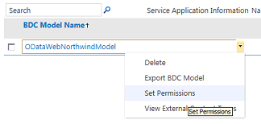

# Создание мобильного приложения в SharePoint, который содержит данные из внешнего источника данныхCreate a mobile app in SharePoint that contains data from an external data source

Узнайте, как создать простое приложение мобильных устройств в SharePoint, который содержит данные из внешнего источника данных с помощью служб Business Connectivity Services, подключение к внешнему списку.Learn how to create a simple mobile app in SharePoint that contains data from external data source by using Business Connectivity Services and connecting to an external list.
SharePoint позволяет создавать приложения для мобильных устройств, имеющие доступ к внешним данным из баз данных, корпоративных приложений и служб Web 2.0, с помощью служб Business Connectivity Services.SharePoint enables you to build mobile applications that can access external data from databases, enterprise applications, and Web 2.0 services using Business Connectivity Services. Можно также указать полный взаимодействия с внешними данными, включая возможностью обратной записи с мобильного устройства.You can also provide complete interaction with the external data including write-back capabilities from your mobile device. Это делается путем создания приложения, которые подключаются к внешним спискам, которые представляют собой особый тип списков в SharePoint, которые основаны на внешние типы контента и содержат данные из внешней системы.You do this by creating apps that connect to external lists, which are a special type of lists in SharePoint that are based on external content types and contain data from an external system. Новый шаблон списка SharePoint для Windows Phone в Visual Studio 2010 позволяет вам быстро и легко создавать приложения для Windows Phone, которое подключается к внешним спискам.The new Windows Phone SharePoint List template in Visual Studio 2010 Express enables you to quickly and easily create apps for the Windows Phone that connects to external lists. Например можно создавать приложения для Windows phone, которое переводит каталог продуктов для список в SharePoint на номер телефона для сотрудников отдела продаж.For example, you can build a Windows phone app that brings the product catalog for an inventory list in SharePoint to the phone for the sales people. В этом разделе показано, как создать приложение Windows Phone, которое отображает внешних данных из учебной базы данных "Борей" с помощью подключения к внешнему списку в SharePoint.This topic shows how to create a Windows Phone app that displays external data from the Northwind sample database by connecting to an external list in SharePoint. Обратите внимание на то, что в этом примере внешний список подключается к базе данных Northwind, с помощью настраиваемой службы OData; Тем не менее можно подключиться к непосредственно баз данных, а также все внешние системы, поддерживаемый Business Connectivity Services с помощью внешних списков.Notice that in this example, the external list connects to the Northwind database using a custom OData service; however, it's possible to connect to databases directly as well as any external system that is supported by Business Connectivity Services, using external lists. С помощью нового шаблона списка SharePoint в Visual Studio можно создать мобильного приложения, который можно получить доступ к внешнему списку на сайте SharePoint.With the new SharePoint List template in Visual Studio, you can create a mobile app that can access an external list on a SharePoint site. В этой статье приводятся пошаговые процедуры, которая начинается с Отправка внешних модели службы подключения к бизнес-данных (BDC) и заканчивается на тестирование нового мобильного приложения.This article provides a step-by-step procedure that begins with uploading an external Business Data Connectivity (BDC) service model and ends with testing your new mobile app.
  
    
    

> **Важные:** При разработке приложения для Windows Phone 8, должны использовать Visual Studio Express 2012 г., а не в Visual Studio 2010 Express.**Important:** If you are developing an app for Windows Phone 8, you must use Visual Studio Express 2012 instead of Visual Studio 2010 Express. За исключением среды разработки все сведения в этой статье применимы к созданию приложений для Windows Phone 8 и Windows Phone 7.Except for the development environment, all information in this article applies to creating apps for both Windows Phone 8 and Windows Phone 7. > Для получения дополнительных сведений см [как: Настройка среды разработки мобильных приложений для SharePoint](how-to-set-up-an-environment-for-developing-mobile-apps-for-sharepoint.md).> For more information, see  [How to: Set up an environment for developing mobile apps for SharePoint](how-to-set-up-an-environment-for-developing-mobile-apps-for-sharepoint.md). 
  
    
    

## Необходимые условия для создания мобильного приложения, которое содержит внешние данныеPrerequisites for creating a mobile app that contains external data

- Для установки SharePoint с правами администратора для загрузки модели BDC для базы данных Northwind и сайта SharePoint, где вы создаете внешний списокA SharePoint installation with administrative privileges to upload the BDC model for the Northwind database and a SharePoint site where you create the external list
    
  
- Microsoft Visual Studio Express с новыми шаблонами телефонов SharePoint из [Пакета SDK Microsoft SharePoint для Windows Phone 7.1](http://www.microsoft.com/en-us/download/details.aspx?id=30476)Microsoft Visual Studio Express with the new SharePoint phone templates from  [Microsoft SharePoint SDK for Windows Phone 7.1](http://www.microsoft.com/en-us/download/details.aspx?id=30476)
    
  
- Модели BDC для нашего exampleNorthwind_oData.bdmc (загрузить из [SharePoint: создание простой внешний список телефонных приложения](http://code.msdn.microsoft.com/sharepoint/SharePoint-Create-a-88800202))The BDC model for our exampleNorthwind_oData.bdmc (download from  [SharePoint: Create a simple external list-based phone app](http://code.msdn.microsoft.com/sharepoint/SharePoint-Create-a-88800202))
    
  
- Для установки SharePoint с правами администратора для загрузки модели BDC для базы данных Northwind и сайта SharePoint, где вы создаете внешний списокA SharePoint installation with administrative privileges to upload the BDC model for the Northwind database and a SharePoint site where you create the external list
    
  

## Шаг 1: Отправка метаданных модели BDCStep 1: Upload a BDC metadata model

Модели BDC — это основной Business Connectivity Services. Это XML-файл, использующий структур данных, таких как **сущности** (внешнего типа контента) и **метод** для абстрактного сложных сведения о внешней системе. Он будет создан при создании внешнего типа контента с помощью SharePoint Designer и для некоторых типов данных такие источники .NET и OData, вам необходимо создать модель BDC вручную или с помощью Visual Studio. При отправке модели BDC в хранилище метаданных BDC, с помощью центра администрирования SharePoint внешних типов контента, определенных в модели можно использовать для создания внешних списков в SharePoint, которые представляют списки, отображающие данные из связанного внешней системы. На этом этапе будет передачи данных "Борей" пример BDC модели в хранилище метаданных с помощью центра администрирования SharePoint.A BDC model is the core of Business Connectivity Services. It's an XML file that uses data structures such as **Entity** (external content type) and **Method** to abstract out complex details about the external system. It's auto-generated when you create an external content type using SharePoint Designer and for some data source types such .NET and OData sources, you need to create the BDC model manually or by using Visual Studio. When you upload a BDC model to the BDC metadata store using SharePoint Central Administration, the external content types defined in the model can be used to create external lists in SharePoint which are lists that display data from the underlying external system. In this step, you'll upload the Northwind sample BDC model to the Metadata Store using SharePoint Central Administration.
  
    
    

1. Перейдите в центр администрирования.Navigate to Central Administration.
    
  
2. Выберите **Управление приложениями**, а затем выберите **Управление приложениями-службами**.Choose **Application Management**, and then choose **Manage Service Applications**.
    
  
3. На странице приложения-службы выберите **Службы подключения к бизнес-данным**.On the Service Application page, choose **Business Data Connectivity Service**.
    
  
4. На ленте в приложении-службе BDC выберите команду **Импорт**.On the ribbon in the BDC Service application, choose **Import**.
    
  
5. На странице "Импорт модели BDC" выберите **Служба подключения к бизнес-данным**.On the Import BDC Model page, choose **Business Data Connectivity Service**.
    
  
6. На ленте в приложении-службе BDC выберите команду **Импорт**.On the ribbon in the BDC Service application, choose **Import**.
    
  
7. На странице "Импорт модели BDC" нажмите кнопку **Обзор**.On the Import BDC Model page, choose **Browse**.
    
  
8. В диалоговом окне **выбрать файл для загрузки** перейдите к файлу Northwind_oData.bdcm и нажмите кнопку **Открыть**.In the **Choose a File to upload** dialog box, browse to the Northwind_oData.bdcm file, and then choose **Open**.
    
  
9. После импорта файла нажмите кнопку « **ОК** ».After the file is imported, choose the **OK** button.
    
  

## Шаг 2: Предоставление разрешенийStep 2: Grant permissions

Далее необходимо задать разрешения для модели BDC, чтобы указать, кто может выполнять методы, описанные в этой модели. Этот шаг является обязательным. Рекомендуется предоставить определенные разрешения для каждого пользователя или группы, которое должно их, таким образом, что учетные данные полностью предоставления минимальных прав, необходимых для выполнения необходимых задач. Дополнительные сведения о настройке разрешений см служба подключения к бизнес разрешения в  [Общие сведения о безопасности служб Business Connectivity Services (SharePoint Server 2010)](http://technet.microsoft.com/en-us/library/ee661740.aspx). На этом этапе предоставить разрешение на свой адрес выполнение методов, описанных в модели BDC образец данных "Борей".Next you need to set permissions on the BDC model to specify who can execute the methods described in the model. This is a required step. We recommend that you give specific permissions to each user or group that needs them, in such a way that the credentials provide the least privilege necessary to perform the needed tasks. For more information about setting permissions, see Business Connectivity Service permissions overview in  [Business Connectivity Services security overview (SharePoint Server 2010)](http://technet.microsoft.com/en-us/library/ee661740.aspx). In this step, you give permission to yourself to execute the methods described in the Northwind sample BDC model.
  
    
    

1. Перейдите в центр администрирования.Navigate to Central Administration.
    
  
2. Выберите **Управление приложениями**, а затем выберите **Управление приложениями-службами**.Choose **Application Management**, and then choose **Manage Service Applications**.
    
  
3. На странице приложения-службы выберите **Службы подключения к бизнес-данным**.On the Service Application page, choose **Business Data Connectivity Service**.
    
  
4. На ленте выберите из раскрывающегося списка в группе **представление** **Моделей BDC**.In the ribbon, choose **BDC Models** from the drop-down list in the **View** group.
    
  
5. В списке моделей BDC наведите указатель мыши на Northwind_oData.bdcm и выберите команду **Задать разрешения**, как показано на рисунке 1.In the list of BDC models, hover over Northwind_oData.bdcm and choose **Set Permissions**, as shown in Figure 1.
    
   **На рисунке 1. Выбор разрешений для модели BDC****Figure 1. Choosing permissions for BDC model**

  

  
  

  

  
6. В диалоговом окне **Задать разрешения для объекта** нажмите кнопку **Обзор**.In the **Set Object Permissions** dialog box, choose the **Browse** button.
    
  
7. В диалоговом окне **Выбор пользователей и групп** выполните поиск учетной записи и нажмите кнопку « **ОК** ».In the **Select People and Groups** dialog box, search for your account and choose the **OK** button.
    
  
8. Выберите разрешения для **редактирования**, **выполнение**, **Доступно для выбора в клиентах** и **Задание разрешений**, как показано на рисунке 2.Select the permissions for **Edit**, **Execute**, **Selectable In Clients**, and **Set Permissions**, as shown in Figure 2.
    
   **На рисунке 2. Настройка разрешений объектов****Figure 2. Setting object permissions**

  

  
  

  

  
9. Нажмите кнопку **ОК**.Choose the **OK** button.
    
  
10. На ленте выберите **Внешние типы контента** из раскрывающегося списка в группе **представление**.In the ribbon, select **External Content Types** from the drop-down list in the **View** group.
    
  
11. В списке внешние типы контента наведите указатель мыши на **клиента** и выберите **Задание разрешений**.In the list of external content types, hover over **Customer**, and then choose **Set Permissions**.
    
  
12. В диалоговом окне **Задать разрешения для объекта** нажмите кнопку **Обзор** и поиска для вашей учетной записи.In the **Set Object Permissions** dialog box, choose the **Browse** button and search for your account.
    
  
13. В диалоговом окне **Задать разрешения для объекта** последовательно выберите пункты **Добавить** и выберите разрешения для **редактирования**, **выполнение**, **Доступно для выбора в клиентах** и **Задание разрешений**.In the **Set Object Permissions** dialog box, choose **Add** and select the permissions for **Edit**, **Execute**, **Selectable In Clients**, and **Set Permissions**.
    
  
14. Убедитесь, что установлен флажок **Распространить разрешения**.Ensure that the **Propagate Permissions** box is selected.
    
  
15. Нажмите кнопку **ОК**.Choose the **OK** button.
    
  

## Шаг 3: Создание внешнего спискаStep 3: Create an external list

Теперь, когда отправлен модели BDC и установка разрешений, можно создать внешний список на основе внешнего типа контента, определенных в модели BDC. На этом этапе создается внешний список на основе клиента внешнего типа контента определенных в модели Northwind BDC, загруженный в  [Шаг 1: Отправка метаданных модели BDC](how-to-create-a-mobile-app-in-sharepoint-that-contains-data-from-an-externa.md#HowToCreateSimpleExternalListBasedPhoneApp_Step1).Now that you've uploaded the BDC model and set permissions, you can create an external list based on the external content type defined in the BDC model. In this step, you will create an external list based on the Customer external content type defined in the Northwind BDC model you uploaded in  [Step 1: Upload a BDC metadata model](how-to-create-a-mobile-app-in-sharepoint-that-contains-data-from-an-externa.md#HowToCreateSimpleExternalListBasedPhoneApp_Step1).
  
    
    

1. Перейдите на сайт SharePoint, где будут нового списка.Navigate to the SharePoint site where you want the new list.
    
  
2. На домашней странице веб-узла выберите **Дополнительные**.On the home page of the site, choose **More**.
    
  
3. На странице "приложения" выберите **Добавить приложение**.On the Apps page, choose **Add an App**.
    
  
4. На странице Добавить страницу приложения наведите указатель мыши на **Внешний список** и выберите команду **добавить его**.On the Add an App page, hover over **External List** and choose **Add it**.
    
  
5. В диалоговом окне **Добавление внешнего списка** введите имя, напримерклиентов в поле **имя**.In the **Adding an External List** dialog box, enter a name such asCustomers in the **Name** field.
    
  
6. В поле **Внешний тип контента** укажите источник внешних данных, который загрузил на шаге 1.In the **External Content Type** box, specify the external data source that you uploaded in step 1.
    
  
7. Нажмите кнопку **ОК**.Choose the **OK** button.
    
  
8. На странице "приложения" выберите **Список клиентов** для просмотра списка.On the Apps page, choose **Customers List** to view the list.
    
  

## Шаг 4: Создание мобильного приложения на основе шаблона приложения списка SharePoint для Windows PhoneStep 4: Create a mobile app using the Windows Phone SharePoint List Application template

Внешний список готов, и теперь можно создать приложение Windows Phone 7, которое подключается к внешнему списку, созданной на  [Шаг 3: Создание внешнего списка](how-to-create-a-mobile-app-in-sharepoint-that-contains-data-from-an-externa.md#HowToCreateSimpleExternalListBasedPhoneApp_Step3) и отображения данных клиента из базы данных Northwind.Your external list is ready and you can now create a Windows Phone 7 app that connects to the external list you created in  [Step 3: Create an external list](how-to-create-a-mobile-app-in-sharepoint-that-contains-data-from-an-externa.md#HowToCreateSimpleExternalListBasedPhoneApp_Step3) and display Customer data from the Northwind database.
  
    
    

1. Запустите Visual Studio 2010, экспресс-выпуск.Start Visual Studio 2010 Express.
    
  
2. В строке меню щелкните **файл**, **Создать проект**. Откроется диалоговое окно **Новый проект**.On the menu bar, choose **File**, **New Project**. The **New Project** dialog box opens.
    
  
3. В диалоговом окне **Создать проект** выберите **Visual C#**, выберите **Silverlight для Windows Phone** и затем выберите **Приложения списка SharePoint для Windows Phone**.In the **New Project** dialog box, choose **Visual C#**, choose **Silverlight for Windows Phone**, and then choose **Windows Phone SharePoint List Application**.
    
  
4. Укажите имя для проекта. В этом примере используется CustomerApp как показано на рисунке 3.Specify a name for the project. We use CustomerApp in this example, as shown in Figure 3.
    
   **На рисунке 3. Выбор шаблона приложения списка SharePoint для Windows Phone в Visual Studio****Figure 3. Selecting the Windows Phone SharePoint List Application template in Visual Studio**

  

  
  

  

  
5. Нажмите кнопку **ОК**.Choose the **OK** button.
    
  
6. В окне **Мастера приложений для телефона SharePoint** введите URL-адрес сайта SharePoint, в котором вы создали внешнего списка.In the **SharePoint Phone Application Wizard**, enter the URL of the SharePoint site in which you created the external list.
    
  
7. Выберите в списке **клиентов** и нажмите кнопку **Далее**.Choose the **Customers** list, and choose **Next**.
    
  
8. На экране **Выбор представления** выберите **Клиента чтение списка** и нажмите кнопку **Далее**.On the **Choose Views** screen, select **Customer Read List** and choose **Next**.
    
  
9. На экране **Выбор операции** выберите **отображения** и нажмите кнопку **Далее**.On the **Choose Operations** screen, choose **Display**, and then choose **Next**.
    
  
10. На экране **Выбор поля** выберите поля, которые требуется использовать или отображать в мобильного приложения и нажмите кнопку **Далее**.On the **Choose Fields** screen, select the fields you want to use or display in your mobile app, and then choose **Next**.
    
  
11. На экране **Поля заказа** изменить порядок полей, если необходимо и нажмите кнопку **Готово**.On the **Order Fields** screen, reorder the fields if needed, and then choose **Finish**.
    
  
12. Теперь успешно ли создан приложение, которое подключается к внешнему списку.You've now successfully created the app that connects to the external list.
    
  

## Запуск и тестирование приложенияRun and test your app

Теперь, когда приложение будет готово для запуска, можно проверить его использование эмулятора телефона.Now that the app is ready to run, you can test it using phone emulator.
  
    
    

1. В Visual Studio выберите **Отладка** и затем выберите команду **Начать отладку** или нажмите клавишу F5.In Visual Studio, choose **Debug**, and then choose **Start Debugging**, or press F5.
    
  
2. При появлении запроса вход с помощью же имя пользователя и пароль, который использовался для входа на сайт SharePoint. Убедитесь, что у вас есть права администратора.When prompted, log in by using the same username and password that you used to log in to the SharePoint site. Ensure that you have admin rights.
    
  
3. Просмотрите этот список клиентов, как показано на рисунке 4.Scroll through the resulting Customers list, as shown in Figure 4.
    
   **На рисунке 4. Мобильное приложение отображение внешнего списка SharePoint****Figure 4. Mobile app displaying SharePoint external list**

  

  
  

  

  

> **Примечание:** При использовании мастера шаблон списка SharePoint для создания мобильного приложения для внешнего списка, имеются поля только для чтения, код, созданный с помощью мастера не позволяет пользователям создавать или изменять элементы.**Note:** When you use the SharePoint List Template wizard to create a mobile app for an external list that has read-only fields, the code that is generated by the wizard does not allow users to create or edit items. 
  
    
    

## Дополнительные ресурсыAdditional resources

  
    
    

-  [Построение приложений Windows Phone, обращающихся к SharePointBuild Windows Phone apps that access SharePoint](build-windows-phone-apps-that-access-sharepoint.md)
    
  
-  [Обзор шаблонов приложений Windows Phone SharePoint в Visual StudioOverview of Windows Phone SharePoint application templates in Visual Studio](overview-of-windows-phone-sharepoint-application-templates-in-visual-studio.md)
    
  
-  [Как: Создание внешних списков в SharePointHow to: Create External Lists in SharePoint](http://msdn.microsoft.com/en-us/library/ee558778.aspx)
    
  
-  [Как: Создание приложения списка Windows Phone SharePointHow to: Create a Windows Phone SharePoint list app](how-to-create-a-windows-phone-sharepoint-list-app.md)
    
  
-  [Как: Настройка среды разработки мобильных приложений для SharePointHow to: Set up an environment for developing mobile apps for SharePoint](how-to-set-up-an-environment-for-developing-mobile-apps-for-sharepoint.md)
    
  
-  [Пакет SDK для Windows Phone 7.1Windows Phone SDK 7.1](http://www.microsoft.com/en-us/download/details.aspx?id=27570)
    
  
-  [Пакет SDK Microsoft SharePoint для Windows Phone 7.1Microsoft SharePoint SDK for Windows Phone 7.1](http://www.microsoft.com/en-us/download/details.aspx?id=30476)
    
  

