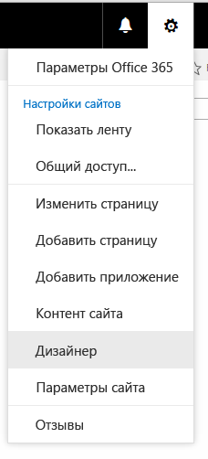

# <a name="how-to-create-a-page-layout-in-sharepoint"></a><span data-ttu-id="29af2-102">Инструкции. Создание макета страницы в SharePoint</span><span class="sxs-lookup"><span data-stu-id="29af2-102">How to: Create a page layout in SharePoint</span></span>
<span data-ttu-id="29af2-p101">При построении макета страницы с помощью Дизайнера создаются два файла: ASPX-файл, который использует SharePoint, и HTML-версия этого макета, которую можно изменять в редакторе HTML. HTML-файл и макет страницы связаны друг с другом, поэтому при каждом редактировании и сохранении HTML-файла изменения синхронизируются со связанным макетом страницы.</span><span class="sxs-lookup"><span data-stu-id="29af2-p101">When you use Design Manager to create a page layout, two files are created: an .aspx file that SharePoint uses, and an HTML version of that page layout that you can edit in your HTML editor. The HTML file and page layout are associated, so that whenever you edit and save the HTML file, your changes are synced to the associated page layout.</span></span>
## <a name="introduction-to-page-layouts"></a><span data-ttu-id="29af2-105">Общие сведения о макетах страниц</span><span class="sxs-lookup"><span data-stu-id="29af2-105">Introduction to page layouts</span></span>
<span data-ttu-id="29af2-106"><a name="Introduction"> </a></span><span class="sxs-lookup"><span data-stu-id="29af2-106"></span></span>

<span data-ttu-id="29af2-p102">При построении макета страницы с помощью Дизайнера создаются два файла: ASPX-файл, который использует SharePoint, и HTML-версия этого макета, которую можно изменять в редакторе HTML. HTML-файл и макет страницы связаны друг с другом, поэтому при каждом редактировании и сохранении HTML-файла изменения синхронизируются со связанным макетом страницы.</span><span class="sxs-lookup"><span data-stu-id="29af2-p102">When you use Design Manager to create a page layout, two files are created: an .aspx file that SharePoint uses, and an HTML version of that page layout that you can edit in your HTML editor. The HTML file and page layout are associated, so that whenever you edit and save the HTML file, your changes are synced to the associated page layout.</span></span>
  
    
    
<span data-ttu-id="29af2-p103">При создании эталонной страницы вы отправляете HTML-файл и преобразуете его непосредственно в эталонную страницу. Однако преобразовать HTML-файл в макет страницы аналогичным образом не удастся, так как основное назначение макета страницы  содержать в себе поля страницы, которые должны добавляться при создании макета страницы в Дизайнере.</span><span class="sxs-lookup"><span data-stu-id="29af2-p103">When you create a master page, you upload and convert an HTML file directly into a master page. But, unlike a master page, you do not directly convert an HTML file into a page layout. This is because the primary purpose of a page layout is to contain page fields, and these page fields must get added when the page layout is created in Design Manager.</span></span>
  
    
    
<span data-ttu-id="29af2-112">При создании макета страницы:</span><span class="sxs-lookup"><span data-stu-id="29af2-112">When you create a page layout:</span></span>
  
    
    

- <span data-ttu-id="29af2-113">В коллекции эталонных страниц создаются ASPX-файл и HTML-файл с одинаковыми именами.</span><span class="sxs-lookup"><span data-stu-id="29af2-113">An .aspx file and an HTML file with the same name are created in the Master Page Gallery.</span></span>
    
  
- <span data-ttu-id="29af2-114">В ASPX-файл добавляется вся разметка, необходимая SharePoint, поэтому макет страницы отображается правильно.</span><span class="sxs-lookup"><span data-stu-id="29af2-114">All markup required by SharePoint is added to the .aspx file so that the page layout renders correctly.</span></span>
    
  
- <span data-ttu-id="29af2-115">Другая разметка, например комментарии, теги **<div>**, фрагменты кода и заполнители контента, добавляются в HTML-файл.</span><span class="sxs-lookup"><span data-stu-id="29af2-115">Other markup such as comments, **<div>** tags, snippets, and content placeholders are added to the HTML file.</span></span>
    
  
- <span data-ttu-id="29af2-p104">Поля страницы, уникальные для типа контента, добавляются на макет страницы автоматически. Другие поля страницы можно добавить на ленте в коллекции фрагментов кода.</span><span class="sxs-lookup"><span data-stu-id="29af2-p104">Page fields unique to the content type are added automatically to the page layout. Other page fields are available to be added from the ribbon in the Snippet Gallery.</span></span>
    
  
- <span data-ttu-id="29af2-p105">HTML- и ASPX-файлы связаны, поэтому при сохранении HTML-файла любые дальнейшие изменения синхронизируются с ASPX-файлом. Другая разметка, например комментарии, теги **<div>**, фрагменты коды и заполнители контента, добавляется в файл.</span><span class="sxs-lookup"><span data-stu-id="29af2-p105">The HTML file and the .aspx file are associated, so that any later edits to the HTML file are synced to the .aspx file whenever the HTML file is saved. Other markup such as comments, **<div>** tags, snippets, and content placeholders are added to the HTML file.</span></span>
    
  

> <span data-ttu-id="29af2-120">**Примечание.** Синхронизация выполняется только в одном направлении.</span><span class="sxs-lookup"><span data-stu-id="29af2-120">**Note:** The syncing goes in one direction only.</span></span> <span data-ttu-id="29af2-121">Изменения макета HTML-страницы будут синхронизированы со связанным ASPX-файлом, однако если вы изменяете непосредственно ASPX-файл, внесенные изменения не будут синхронизированы с HTML-файлом.</span><span class="sxs-lookup"><span data-stu-id="29af2-121">Note The syncing goes in one direction only. Changes to the HTML page layout are synced to the associated .aspx file, but if you choose to edit the .aspx file directly, those changes are not synced to the HTML file. Every HTML page layout (and every HTML master page) has a property named Associated File that is set to True by default, which creates the association and syncing between files.</span></span> <span data-ttu-id="29af2-122">Для каждого макета HTML-страницы (и для каждой эталонной HTML-страницы) предусмотрено свойство **Связанный файл**, для которого по умолчанию задано значение **True**. Это свойство устанавливает связь между файлами и отвечает за их синхронизацию.</span><span class="sxs-lookup"><span data-stu-id="29af2-122">Note The syncing goes in one direction only. Changes to the HTML page layout are synced to the associated .aspx file, but if you choose to edit the .aspx file directly, those changes are not synced to the HTML file. Every HTML page layout (and every HTML master page) has a property named **Associated File** that is set to **True** by default, which creates the association and syncing between files.</span></span>
  
    
    

<span data-ttu-id="29af2-p107">Например, если у вас есть пара связанных файлов (HTML и ASPX) и вы редактируете ASPX-файл, не нарушая связь, внесенные изменения будут сохранены, но вы не сможете отметить или опубликовать этот файл, то есть по большому счету эти изменения не сохраняются. Любые изменения в файле HTML перезаписывают ASPX-файл. Если вы отметите или опубликуете HTML-файл, то его изменения перезапишут любые изменения, которые были сделаны в ASPX-файле. Изменения, внесенные в ASPX-файл, будут утрачены.</span><span class="sxs-lookup"><span data-stu-id="29af2-p107">For example, if you have a pair of associated files (HTML and .aspx) and you edit the .aspx file without breaking the association,the .aspx file changesare saved, but you can't check in or publish the .aspx file, so those changes are not saved in a meaningful way. Any changes to the HTML file override the .aspx file. If you check in or publish the HTML file, the HTML file changes override any changes that were made to the .aspx file. The .aspx file changes are lost.</span></span>
  
    
    
<span data-ttu-id="29af2-p108">Если вы являетесь разработчиком и вам удобно работать с ASP.NET, вы можете разорвать связь и работать только с ASPX-файлами. Чтобы разорвать связь между HTML- и ASPX-файлами, в Дизайнере выберите для HTML-файла команду **Изменить свойства** и снимите флажок напротив пункта **Связанный файл**. Позже вы можете вновь связать эти файлы, изменив свойства и установив флажок. В этом случае изменения, сохраненные в HTML-файле, вновь перезапишут ASPX-файл.</span><span class="sxs-lookup"><span data-stu-id="29af2-p108">If you're a developer comfortable working with ASP.NET, you can choose to work only with the .aspx file by breaking the association between the files. To break the association between the HTML file and .aspx file, in Design Manager, choose **Edit Properties** for the HTML file, and then clear the **Associated File** check box. You can later re-associate the files by editing the properties and selecting this check box, in which case changes saved in the HTML file will again overwrite the .aspx file.</span></span>
  
    
    

## <a name="understanding-the-relationship-between-page-fields-and-a-content-type"></a><span data-ttu-id="29af2-130">Общие сведения о связи между полями страницы и типом контента</span><span class="sxs-lookup"><span data-stu-id="29af2-130">Understanding the relationship between page fields and a content type</span></span>
<span data-ttu-id="29af2-131"><a name="UnderstandingPageFields"> </a></span><span class="sxs-lookup"><span data-stu-id="29af2-131"></span></span>

<span data-ttu-id="29af2-p109">Каждый макет страницы связан с типом контента, обычно одним из типов в группе "Макет страницы". Например, тип контента "Страницы статьи" связан с макетом страницы "Страницы статьи", они оба включены в веб-сайт публикации.</span><span class="sxs-lookup"><span data-stu-id="29af2-p109">Every page layout is associated with a content type, typically one of the content types in the Page Layout group. For example, the Article Page content type that is associated with the Article Page page layout, both of which are included in a publishing site.</span></span>
  
    
    
<span data-ttu-id="29af2-p110">Тип контента состоит из столбцов сайта, которые вместе определяют схему допустимых типов данных. Вы можете сказать, что столбцы сайта являются уникальными для текущего типа контента, так как столбец "Источник" пустой (это значит, что данные столбцы сайта определены текущим типом контента и не наследуются от родительского типа контента).</span><span class="sxs-lookup"><span data-stu-id="29af2-p110">A content type is made of site columns, which together define a schema of allowed data types. You can tell that site columns are unique to the current content type because the Source column is blank—this means that these site columns are defined by the current content type, and are not inherited from a parent content type.</span></span>
  
    
    
<span data-ttu-id="29af2-p111">Для любого заданного макета страницы столбцы сайта, образующие тип контента, непосредственно соответствуют полям страницы, которые доступны для данного макета страницы. Первая группа полей страницы на ленте  это поля страницы, которые автоматически добавляются на макет страницы при его создании. SharePoint добавляет эти поля автоматически, так как они являются уникальными для этого типа контента, и поэтому, вероятно, эти поля были созданы специально для того, чтобы использоваться макетом страницы в отличие от общих метаданных SharePoint.</span><span class="sxs-lookup"><span data-stu-id="29af2-p111">For any given page layout, the site columns that make up the content type correspond directly to the page fields that are available for that page layout. The first group of page fields on the ribbon is page fields that get automatically added to the page layout when you create it. SharePoint adds these fields automatically because they're unique to this content type, and so it's likely that these fields were created specifically to be used by the page layout, as opposed to being general SharePoint metadata.</span></span>
  
    
    
<span data-ttu-id="29af2-139">Перед тем как создать макет страницы в Дизайнере, возможно, вам потребуется создать тип контента, который определяет поля страницы для макета страницы.</span><span class="sxs-lookup"><span data-stu-id="29af2-139">Before you create a page layout in Design Manager, you may first have to create a content type that defines the page fields that you want for that page layout</span></span>
  
    
    

## <a name="understanding-the-relationship-between-content-placeholders-on-a-page-layout-and-master-page"></a><span data-ttu-id="29af2-140">Общие сведения о связи между заполнителями контента на макете страницы и на эталонной странице</span><span class="sxs-lookup"><span data-stu-id="29af2-140">Understanding the relationship between content placeholders on a page layout and master page</span></span>
<span data-ttu-id="29af2-141"><a name="UnderstandingContentPlaceholders"> </a></span><span class="sxs-lookup"><span data-stu-id="29af2-141"></span></span>

<span data-ttu-id="29af2-p112">Для корректного отображения макет страницы и эталонная страница должны иметь одинаковый набор заполнителей контента. Это просто, если для создания эталонных страниц и макетов страниц вы используете Дизайнера, так как при создании файлов в каждый из них добавляется правильный набор заполнителей контента. Это гарантирует работу каждого макета страницы по каждому каналу, который используется различными эталонными страницами. Вам не нужно знать о большинстве этих заполнителях контента или работать с ними. Они требуются SharePoint для правильного отображения страницы.</span><span class="sxs-lookup"><span data-stu-id="29af2-p112">A page layout and a master page must have the identical set of content placeholders for the page layout to render correctly. This is not a problem if you use Design Manager to create master pages and page layouts, because the correct set of content placeholders is added to every file when you create it. This ensures that every page layout works across every channel that uses a different master page. You don't have to know about or work with most of these content placeholders. They exist because they're required by SharePoint to render the page correctly.</span></span>
  
    
    
<span data-ttu-id="29af2-p113">Однако, если вы изменяете макет HTML-страницы и вручную добавляете заполнитель контента, вам следует добавить такой же заполнитель контента на каждую эталонную страницу, которая требуется для работы с данным макетом страницы. Подобный случай не является общим.</span><span class="sxs-lookup"><span data-stu-id="29af2-p113">But, if you edit an HTML page layout and manually add a content placeholder, you should add that same content placeholder to every master page that needs to work with that page layout. This is not a common scenario.</span></span>
  
    
    
<span data-ttu-id="29af2-149">Если для создания макетов страниц и эталонных страниц вы используете Дизайнера, то наиболее общим случаем станет работа только со следующими заполнителями контента:</span><span class="sxs-lookup"><span data-stu-id="29af2-149">If you're using Design Manager to create page layouts and master pages, the most common scenario is that you're working with only the following content placeholders:</span></span>
  
    
    

- <span data-ttu-id="29af2-p114">**PlaceHolderMain**. Эталонная страница содержит заполнитель контента с  `ID="PlaceholderMain"`, который содержит тег **DefaultContentBlock** **<div>** с желтым полем, который показывает, что **Эта область будет заполнена контентом, созданным в макетах страниц**. Не вводите ничего внутри этого заполнителя на эталонной странице. Макет страницы содержит заполнитель контента с таким же идентификатором. Поместите разметку внутри этого заполнителя в макете страницы, разметка за пределами заполнителя недопустима. Идентификаторы данных двух заполнителей ( **PlaceholderMain**) должны совпадать.</span><span class="sxs-lookup"><span data-stu-id="29af2-p114">**PlaceHolderMain** The master page contains a content placeholder with `ID="PlaceholderMain"`, which contains the **DefaultContentBlock** **<div>** tag with the yellow box that shows **This area will be filled in by content you create in your page layouts.** You should not put any content inside this placeholder on the master page. The page layout contains a content placeholder with the same ID. You should put markup only inside this placeholder, and put no markup outside this placeholder, on a page layout. The IDs for the two placeholders ( **PlaceholderMain**) should match.</span></span>
    
  
- <span data-ttu-id="29af2-p115">**PlaceHolderAdditionalPageHead**. При работе с макетом страницы элементы в тег **<head>** обычно не вводятся. Вместо этого элементы добавляются в заполнитель контента с помощью `id="PlaceHolderAdditionalPageHead"`. При отображении страницы содержимого в браузере этот дополнительный заголовок страницы добавляется в конец заголовка эталонной страницы.</span><span class="sxs-lookup"><span data-stu-id="29af2-p115">**PlaceHolderAdditionalPageHead** When you work with a page layout, you typically don't insert elements into the **<head>** tag of the page layout. Instead, you add elements to the content placeholder with `id="PlaceHolderAdditionalPageHead"`. When a content page is rendered in the browser, this additional page head gets merged into the end of the head of the master page.</span></span> 
    
  

## <a name="create-a-page-layout"></a><span data-ttu-id="29af2-158">Создание макета страницы</span><span class="sxs-lookup"><span data-stu-id="29af2-158">Create a page layout</span></span>
<span data-ttu-id="29af2-159"><a name="CreatePageLayout"> </a></span><span class="sxs-lookup"><span data-stu-id="29af2-159"></span></span>

<span data-ttu-id="29af2-160">Сначала необходимо узнать, какой тип контента и макет страницы будут связаны с макетом страницы.</span><span class="sxs-lookup"><span data-stu-id="29af2-160">Before you begin, you need to know which content type and master page the page layout will be associated with.</span></span>
  
    
    

### <a name="to-create-a-page-layout"></a><span data-ttu-id="29af2-161">Чтобы создать макет страницы:</span><span class="sxs-lookup"><span data-stu-id="29af2-161">To create a page layout</span></span>


1. <span data-ttu-id="29af2-162">Перейдите на сайт публикации.</span><span class="sxs-lookup"><span data-stu-id="29af2-162">Browse to your publishing site.</span></span>
    
  
2. <span data-ttu-id="29af2-163">В правом верхнем углу страницы щелкните значок шестеренки и выберите **Дизайнер**.</span><span class="sxs-lookup"><span data-stu-id="29af2-163">In the upper-right corner of the page, choose the gear icon, and then choose **Design Manager**.</span></span>
    
   <span data-ttu-id="29af2-164">**Меню настроек**</span><span class="sxs-lookup"><span data-stu-id="29af2-164">**Gear icon menu**</span></span>

  

  
  

  

  
3. <span data-ttu-id="29af2-167">В Дизайнере в левой области панели навигации выберите команду **Изменить макеты страниц**.</span><span class="sxs-lookup"><span data-stu-id="29af2-167">In Design Manager, in the left navigation pane, choose **Edit Page Layouts**.</span></span>
    
  
4. <span data-ttu-id="29af2-168">Выберите пункт **Создать макет страницы**.</span><span class="sxs-lookup"><span data-stu-id="29af2-168">Choose **Create a page layout**.</span></span>
    
  
5. <span data-ttu-id="29af2-169">В диалоговом окне **Создание макета страницы** укажите имя для макета страницы.</span><span class="sxs-lookup"><span data-stu-id="29af2-169">In the **Create a Page Layout** dialog box, enter a name for your page layout.</span></span>
    
  
6. <span data-ttu-id="29af2-170">Выберите эталонную страницу.</span><span class="sxs-lookup"><span data-stu-id="29af2-170">Select a master page.</span></span>
    
    <span data-ttu-id="29af2-p117">Выбранная эталонная страница должна отобразиться в окне предварительного просмотра для данного макета страницы. Эта эталонная страницы также определяет заполнители контента, которые добавляются к макету страницы.</span><span class="sxs-lookup"><span data-stu-id="29af2-p117">The master page that you choose here will be shown in the preview for this page layout. This master page also determines what content placeholders get added to the page layout.</span></span>
    
    > <span data-ttu-id="29af2-173">**Примечание.** После выбора эталонной страницы вы не сможете выполнять предварительный просмотр макета страницы с другой эталонной страницей, даже если примените к действующему сайту другую эталонную страницу.</span><span class="sxs-lookup"><span data-stu-id="29af2-173">**Note** After you choose this master page, you cannot preview the page layout with a different master page, even after you apply a different master page to the live site.</span></span> 
7. <span data-ttu-id="29af2-p118">Выберите тип контента. Он определяет поля, которые будут доступны для данного макета страницы в коллекции фрагментов кода.</span><span class="sxs-lookup"><span data-stu-id="29af2-p118">Select a content type. The content type for this page layout determines what page fields will be available for this page layout in the Snippet Gallery.</span></span>
    
  
8. <span data-ttu-id="29af2-176">Нажмите кнопку **OK**.</span><span class="sxs-lookup"><span data-stu-id="29af2-176">Choose **OK**.</span></span>
    
    <span data-ttu-id="29af2-177">На этой стадии SharePoint создает HTML- и ASPX-файлы с одинаковыми именами.</span><span class="sxs-lookup"><span data-stu-id="29af2-177">At this point, SharePoint creates an HTML file and an .aspx file with the same name.</span></span>
    
    <span data-ttu-id="29af2-178">Теперь в Дизайнере для вашего HTML-файла отображается столбец "Состояние", который показывает один из двух возможных состояний:</span><span class="sxs-lookup"><span data-stu-id="29af2-178">In Design Manager, your HTML file now appears with a Status column that shows one of two possible statuses:</span></span>
    
  - <span data-ttu-id="29af2-179">**Предупреждения и ошибки**.</span><span class="sxs-lookup"><span data-stu-id="29af2-179">**Warnings and Errors**</span></span>
    
  
  - <span data-ttu-id="29af2-180">**Преобразование выполнено успешно**.</span><span class="sxs-lookup"><span data-stu-id="29af2-180">**Conversion successful**</span></span>
    
  
9. <span data-ttu-id="29af2-181">Щелкните ссылку в столбце "Состояние", чтобы выполнить предварительный просмотр файла и просмотреть ошибки или предупреждения, касающиеся эталонной страницы.</span><span class="sxs-lookup"><span data-stu-id="29af2-181">Click the link in the Status column to preview the file and to view any errors or warnings about the master page.</span></span>
    
    <span data-ttu-id="29af2-p119">Страница предварительного просмотра  это страница динамического просмотра макета страницы на стороне сервера. Верхняя часть области предварительного просмотра отображает предупреждения или ошибки, которые необходимо устранить, отредактировав HTML-файл в редакторе HTML. Для того чтобы во время предварительного просмотра макет страницы отображался правильно, все ошибки должны быть устранены.</span><span class="sxs-lookup"><span data-stu-id="29af2-p119">The preview page is a live server-side preview of your page layout. The top of the preview displays any warnings or errors that you may have to resolve by editing the HTML file in an HTML editor. Errors must be fixed before the preview will display the page layout correctly.</span></span>
    
    <span data-ttu-id="29af2-185">Более подробную информацию об устранении ошибок и предупреждений можно узнать в статье  [Как: Устранение ошибок и предупреждения при предварительном просмотре страницы в SharePoint](how-to-resolve-errors-and-warnings-when-previewing-a-page-in-sharepoint.md).</span><span class="sxs-lookup"><span data-stu-id="29af2-185">For more information about resolving errors and warnings, see  [How to: Resolve errors and warnings when previewing a page in SharePoint](how-to-resolve-errors-and-warnings-when-previewing-a-page-in-sharepoint.md).</span></span>
    
    <span data-ttu-id="29af2-186">Более подробную информацию о предварительном просмотре макета страницы можно узнать в статье  [Способ: изменение страницы предварительного просмотра в диспетчере оформления SharePoint](how-to-change-the-preview-page-in-sharepoint-design-manager.md).</span><span class="sxs-lookup"><span data-stu-id="29af2-186">For more information about previewing the page layout, see  [How to: Change the preview page in SharePoint Design Manager](how-to-change-the-preview-page-in-sharepoint-design-manager.md).</span></span>
    
    <span data-ttu-id="29af2-p120">В правом верхнем углу страницы предварительного просмотра также содержится ссылка **Фрагменты кода**. При переходе по этой ссылке откроется коллекция фрагментов кода, которая позволяет заменять элементы управления макета в своем конструкторе на динамические элементы управления SharePoint. Дополнительную информацию можно узнать в статье  [Фрагменты кода дизайнер SharePoint](sharepoint-design-manager-snippets.md).</span><span class="sxs-lookup"><span data-stu-id="29af2-p120">The preview page also contains a **Snippets** link in the upper-right corner. This link opens the Snippet Gallery, where you can begin replacing mockup controls in your design with dynamic SharePoint controls. For more information, see [SharePoint Design Manager snippets](sharepoint-design-manager-snippets.md).</span></span>
    
  
10. <span data-ttu-id="29af2-p121">Для устранения ошибок с помощью HTML-редактора откройте и измените HTML-файл на подключенном диске на стороне сервера. Каждый раз при сохранении HTML-файла, все изменения синхронизируется со связанным ASPX-файлом.</span><span class="sxs-lookup"><span data-stu-id="29af2-p121">To fix any errors, edit the HTML file that resides directly on the server by using an HTML editor to open and edit the HTML file in the mapped drive. Each time you save the HTML file, any changes are synced to the associated .aspx file.</span></span>
    
  
11. <span data-ttu-id="29af2-p122">Во время предварительного просмотра макета страницы отображаются поля страницы, которые были автоматически добавлены в макет страницы. Эти поля  это столбцы сайта, уникальные для текущего типа контента. Теперь вы можете задать стиль для макета шаблона в соответствии с вашими исходными макетами.</span><span class="sxs-lookup"><span data-stu-id="29af2-p122">The preview of the page layout shows the page fields that were added automatically to the page layout. These page fields are site columns that are unique to the current content type. Now you are ready to style the page layout according to your original HTML mockups.</span></span>
    
  

## <a name="determine-where-the-styles-for-a-page-layout-should-go"></a><span data-ttu-id="29af2-195">Определение места выполнения стилей для макета страницы</span><span class="sxs-lookup"><span data-stu-id="29af2-195">Determine where the styles for a page layout should go</span></span>
<span data-ttu-id="29af2-196"><a name="WhereStyles"> </a></span><span class="sxs-lookup"><span data-stu-id="29af2-196"></span></span>

<span data-ttu-id="29af2-p123">При создании HTML-макетов для своего веб-сайта у вас могут быть HTML-файлы, которые представляют различные классы страниц, например страница статьи или страница сведений об элементе, содержащая веб-части для отображения сведений об одном элементе из каталога. После создания макета страницы, которая представляет этот класс страниц, вы можете перенести стили из своего HTML-макета в HTML-версию своего макета страницы.</span><span class="sxs-lookup"><span data-stu-id="29af2-p123">When you create HTML mockups for your site, you may have HTML files that represent different classes of pages, such as an article page or an item details page that contains a Web Part to display the details of a single item from a catalog. After you create the page layout that represents that class of pages, you're ready to transfer the styles from your HTML mockup to the HTML version of your page layout.</span></span>
  
    
    
<span data-ttu-id="29af2-p124">Вы можете просто поместить стили для одной или нескольких макетов страниц в одну таблицу стилей, на которую ссылается эталонная страница. Однако если вы захотите уменьшить размер таблицы CSS, которая загружается для каждого файла, вы также можете использовать различные таблицы стилей для различных макетов страниц. При этом важно знать, что таблицу стилей нельзя помещать в тег **<head>** макета страницы. Вместо этого ссылка должна вести к заполнителю контента с именем **PlaceHolderAdditionalPageHead**.</span><span class="sxs-lookup"><span data-stu-id="29af2-p124">You can simply put the styles for one or more page layouts into the same style sheet that the master page links to. But, if you want to minimize the weight of the CSS that is loaded per page, you can also use different style sheets for different page layouts. When you do this, it's important to know that a link to a style sheet cannot go in the **<head>** tag of a page layout. Instead, the link must go in the content placeholder named **PlaceHolderAdditionalPageHead**.</span></span> 
  
    
    

> <span data-ttu-id="29af2-203">**Примечание.** В этом шаблоне атрибут `ms-design-css-conversion="no"` исключает таблицу стилей из темы.</span><span class="sxs-lookup"><span data-stu-id="29af2-203">**Note** In this markup, the attribute  `ms-design-css-conversion="no"` excludes the style sheet from theming. Also, the link to the style sheet should appear after the lines commented <!--SPM.</span></span> <span data-ttu-id="29af2-204">Кроме того, ссылка на таблицу стилей должна находиться после строк с комментарием **<!--SPM**.</span><span class="sxs-lookup"><span data-stu-id="29af2-204">Note In this markup, the attribute   excludes the style sheet from theming. Also, the link to the style sheet should appear after the lines commented **<!--SPM**.</span></span> 
  
    
    


```HTML

<!--MS:<asp:ContentPlaceHolder id="PlaceHolderAdditionalPageHead" runat="server">-->
            <!--SPM:<%@Register Tagprefix="SharePoint" Namespace="Microsoft.SharePoint.WebControls" Assembly="Microsoft.SharePoint, Version=15.0.0.0, Culture=neutral, PublicKeyToken=71e9bce111e9429c"%>-->
            <!--SPM:<%@Register Tagprefix="Publishing" Namespace="Microsoft.SharePoint.Publishing.WebControls" Assembly="Microsoft.SharePoint.Publishing, Version=15.0.0.0, Culture=neutral, PublicKeyToken=71e9bce111e9429c"%>-->
<link href="MyPageLayout.css" rel="stylesheet" type="text/css" ms-design-css-conversion="no" />
        <!--ME:</asp:ContentPlaceHolder>-->

```

<span data-ttu-id="29af2-205">Когда посетитель сайта просматривает страницы, которые используют этот макет, этот дополнительный заголовок страницы добавляется в конец заголовка эталонной страницы, поэтому стили макета страницы применяются после стилей эталонной страницы.</span><span class="sxs-lookup"><span data-stu-id="29af2-205">When a site visitor browses a page that uses this page layout, this additional page head gets merged into the end of the head of the master page—so, styles for the page layout are applied after styles for the master page.</span></span>
  
    
    
<span data-ttu-id="29af2-p126">В этом случае каждый макет страницы может иметь собственную таблицу стилей. Например, тег **<div>** с `id="xyz"` может находиться в одном макете страницы, расположенном слева, и в другом макете страницы, расположенном справа.</span><span class="sxs-lookup"><span data-stu-id="29af2-p126">In this way, each page layout can have its own style sheet. For example, you can have a **<div>** with `id="xyz"` in one page layout that appears on the left, and in another page layout appears on the right.</span></span>
  
    
    
<span data-ttu-id="29af2-p127">Каждый макет страницы может также иметь одну или несколько таблиц стилей, специфических для каналов устройства. Например, вам может понадобиться макет страницы для телефонов, который отличается от макета, предназначенного для компьютеров. Для этого вы можете включить один или несколько панелей каналов устройств внутри **PlaceHolderAdditionalPageHead**, где каждая панель канала включает ссылку на таблицу стилей со специфическими для канала стилями. Таким образом, например, **<div>** с `id="abc"` может отображать крупный текст на одном канале и мелкий  на другом.</span><span class="sxs-lookup"><span data-stu-id="29af2-p127">Each page layout can also have one or more device channel-specific style sheets. For example, you might want a page layout to have a layout for phones that is different from the desktop layout. To do this, you can include one or more device channel panels inside **PlaceHolderAdditionalPageHead**, where each channel panel includes a link to a style sheet with channel-specific styles. This way, for example, a **<div>** with `id="abc"` can display large text in one channel and small text in a different channel.</span></span>
  
    
    
<span data-ttu-id="29af2-212">Ниже приведены несколько распространенных способов размещения ссылок на таблицу стилей для макетов страниц.</span><span class="sxs-lookup"><span data-stu-id="29af2-212">The following are some common scenarios for where to put the style sheet links for page layouts.</span></span>
  
    
    

### <a name="link-to-styles-from-a-master-page"></a><span data-ttu-id="29af2-213">Ссылка на стили из эталонной страницы</span><span class="sxs-lookup"><span data-stu-id="29af2-213">Link to styles from a master page</span></span>

<span data-ttu-id="29af2-p128">Самый простой способ  включить стили для одного или нескольких макетов страниц в состав одной таблицы стилей, на которую ссылается эталонная страница. В эталонной странице поместите ссылку на CSS-файл непосредственно перед закрывающим тегом **</head>**, чтобы он перезаписал таблицы стилей SharePoint по умолчанию, например corev15.css.</span><span class="sxs-lookup"><span data-stu-id="29af2-p128">The simplest scenario is to include styles for one or more page layouts in the same style sheet that the master page links to. In the master page, place the link to the .css file just before the closing **</head>** tag, so that it overrides the default SharePoint style sheets such as corev15.css.</span></span>
  
    
    

```HTML

<head>
…
<link rel="stylesheet" type="text/css" href="MyStyleSheet.css" />
</head>

```


### <a name="link-to-styles-from-a-page-layout"></a><span data-ttu-id="29af2-216">Ссылка на стили из макета страницы</span><span class="sxs-lookup"><span data-stu-id="29af2-216">Link to styles from a page layout</span></span>

<span data-ttu-id="29af2-p129">Если вы хотите сократить размер таблицы CSS, которая загружается с каждым файлом, вы можете создать отдельные CSS-файлы для каждого макета страницы. В этом случае стили для макета страницы перейдут в заполнитель контента с именем **PlaceHolderAdditionalPageHead**.</span><span class="sxs-lookup"><span data-stu-id="29af2-p129">If you want to minimize the weight of CSS that gets loaded with each page, you can have separate CSS files for each page layout. In this scenario, the styles for a page layout go in the content placeholder named **PlaceHolderAdditionalPageHead**.</span></span>
  
    
    

```HTML

<!--MS:<asp:ContentPlaceHolder id="PlaceHolderAdditionalPageHead" runat="server">-->
            <!--SPM:<%@Register Tagprefix="SharePoint" Namespace="Microsoft.SharePoint.WebControls" Assembly="Microsoft.SharePoint, Version=15.0.0.0, Culture=neutral, PublicKeyToken=71e9bce111e9429c"%>-->
            <!--SPM:<%@Register Tagprefix="Publishing" Namespace="Microsoft.SharePoint.Publishing.WebControls" Assembly="Microsoft.SharePoint.Publishing, Version=15.0.0.0, Culture=neutral, PublicKeyToken=71e9bce111e9429c"%>-->
<link href="MyPageLayout.css" rel="stylesheet" type="text/css" ms-design-css-conversion="no" />
        <!--ME:</asp:ContentPlaceHolder>-->

```


### <a name="link-to-styles-in-the-page-layout-per-device-channel"></a><span data-ttu-id="29af2-219">Ссылка на стили в макете страницы по каналам устройств</span><span class="sxs-lookup"><span data-stu-id="29af2-219">Link to styles in the page layout per device channel</span></span>

<span data-ttu-id="29af2-p130">Если у вас есть несколько каналов устройств, вероятно, вы захотите, чтобы макеты страниц для различных каналов отображались по-разному. В этом случае укажите один или несколько панелей каналов устройств внутри **PlaceHolderAdditionalPageHead**, а затем на каждую панель каналов поместите ссылку на специфичные для каналов CSS-файлы.</span><span class="sxs-lookup"><span data-stu-id="29af2-p130">If you have different device channels, you likely want your page layouts to render differently for different channels. In this scenario, you include one or more device channel panels inside **PlaceHolderAdditionalPageHead**, and then include a link to channel-specific CSS files inside each channel panel.</span></span>
  
    
    

```HTML

<!--MS:<asp:ContentPlaceHolder id="PlaceHolderAdditionalPageHead" runat="server">-->
<div data-name="DeviceChannelPanel">
    <!--CS: Start Device Channel Panel Snippet-->
    <!--SPM:<%@Register Tagprefix="Publishing" Namespace="Microsoft.SharePoint.Publishing.WebControls" Assembly="Microsoft.SharePoint.Publishing, Version=15.0.0.0, Culture=neutral, PublicKeyToken=71e9bce111e9429c"%>-->
    <!--MS:<Publishing:DeviceChannelPanel runat="server" IncludedChannels="Channel1">-->
…..
<link rel="stylesheet" type="text/css" href="MyStyleSheet.css" ms-design-css-conversion="no" />
    <!--ME:</Publishing:DeviceChannelPanel>-->
    <!--CE: End Device Channel Panel Snippet-->
</div><div data-name="DeviceChannelPanel">
    <!--CS: Start Device Channel Panel Snippet-->
    <!--SPM:<%@Register Tagprefix="Publishing" Namespace="Microsoft.SharePoint.Publishing.WebControls" Assembly="Microsoft.SharePoint.Publishing, Version=15.0.0.0, Culture=neutral, PublicKeyToken=71e9bce111e9429c"%>-->
    <!--MS:<Publishing:DeviceChannelPanel runat="server" IncludedChannels="Channel2">-->
…..
<link rel="stylesheet" type="text/css" href="CSS5.css" />
    <!--ME:</Publishing:DeviceChannelPanel>-->
    <!--CE: End Device Channel Panel Snippet-->
</div>

```


## <a name="understanding-the-markup-in-the-html-page-layout"></a><span data-ttu-id="29af2-222">Общие сведения о разметке в макете HTML-страницы</span><span class="sxs-lookup"><span data-stu-id="29af2-222">Understanding the markup in the HTML page layout</span></span>
<span data-ttu-id="29af2-223"><a name="UnderstandMarkup"> </a></span><span class="sxs-lookup"><span data-stu-id="29af2-223"></span></span>

<span data-ttu-id="29af2-p131">При создании макета страницы создается ASPX-файл, который используется SharePoint, а в HTML-версию макета страницы добавляется несколько HTML-разметок. Когда вы редактируете макет HTML-страницы в HTML-редакторе, полезно понимать назначение некоторых из этих разметок. Большая ее часть похожа на разметку, которая добавляется в эталонную HTML-страницу. Более подробную информацию можно узнать в статье  [Инструкции. Преобразование HTML-файла в эталонную страницу SharePoint](how-to-convert-an-html-file-into-a-master-page-in-sharepoint.md).</span><span class="sxs-lookup"><span data-stu-id="29af2-p131">When you create a page layout, an .aspx file gets created that SharePoint uses, and some HTML markup gets added to the HTML version of the page layout. When you edit the HTML page layout in your HTML editor, it might be helpful to understand the purpose of some of this markup. Most of it is similar to the markup that gets added to an HTML master page. For more information, see  [How to: Convert an HTML file into a master page in SharePoint](how-to-convert-an-html-file-into-a-master-page-in-sharepoint.md).</span></span>
  
    
    
<span data-ttu-id="29af2-p132">Разметка, которая является уникальной для макетов страниц,  это поля страниц, добавленные на макет страницы на основе типа контента, с которым связан макет страницы. Поля страницы появляются внутри заполнителя страницы с  `id="PlaceHolderMain"`. Например, следующая разметка для **PlaceHolderMain** содержит два поля страницы, которые представляют поля **Title** и **Page Image** из связанного типа контента.</span><span class="sxs-lookup"><span data-stu-id="29af2-p132">The markup that is unique to page layouts is page fields that are added to the page layout based on the content type that the page layout is associated with. Page fields appear inside the content placeholder with  `id="PlaceHolderMain"`. For example, the following markup for **PlaceHolderMain** contains two page fields that represent the **Title** and **Page Image** fields from the associated content type.</span></span>
  
    
    


```HTML

<!--MS:<asp:ContentPlaceHolder ID="PlaceHolderMain" runat="server">-->
            <div>
                <!--CS: Start Page Field: Title Snippet-->
                <!--SPM:<%@Register Tagprefix="PageFieldTextField" Namespace="Microsoft.SharePoint.WebControls" Assembly="Microsoft.SharePoint, Version=15.0.0.0, Culture=neutral, PublicKeyToken=71e9bce111e9429c"%>-->
                <!--SPM:<%@Register Tagprefix="Publishing" Namespace="Microsoft.SharePoint.Publishing.WebControls" Assembly="Microsoft.SharePoint.Publishing, Version=15.0.0.0, Culture=neutral, PublicKeyToken=71e9bce111e9429c"%>-->
                <!--MS:<Publishing:EditModePanel runat="server" CssClass="edit-mode-panel">-->
                    <!--MS:<PageFieldTextField:TextField FieldName="fa564e0f-0c70-4ab9-b863-0177e6ddd247" runat="server">-->
                    <!--ME:</PageFieldTextField:TextField>-->
                <!--ME:</Publishing:EditModePanel>-->
                <!--CE: End Page Field: Title Snippet-->
            </div>
            <div>
                <!--CS: Start Page Field: Page Image Snippet-->
                <!--SPM:<%@Register Tagprefix="PageFieldRichImageField" Namespace="Microsoft.SharePoint.Publishing.WebControls" Assembly="Microsoft.SharePoint.Publishing, Version=15.0.0.0, Culture=neutral, PublicKeyToken=71e9bce111e9429c"%>-->
                <!--MS:<PageFieldRichImageField:RichImageField FieldName="3de94b06-4120-41a5-b907-88773e493458" runat="server">-->
                    <!--PS: Start of READ-ONLY PREVIEW (do not modify)--><div id="ctl02_label" style="display:none">Page Image</div><div id="ctl02__ControlWrapper_RichImageField" class="ms-rtestate-field" style="display:inline" aria-labelledby="ctl02_label"><div align="left" class="ms-formfieldcontainer"><div class="ms-formfieldlabelcontainer" nowrap="nowrap"><span class="ms-formfieldlabel" nowrap="nowrap">Page Image</span></div><div class="ms-formfieldvaluecontainer"><div class="ms-rtestate-field"></div></div></div></div><!--PE: End of READ-ONLY PREVIEW-->
                <!--ME:</PageFieldRichImageField:RichImageField>-->
                <!--CE: End Page Field: Page Image Snippet-->
            </div>
        <!--ME:</asp:ContentPlaceHolder>-->

```


## <a name="additional-resources"></a><span data-ttu-id="29af2-231">Дополнительные ресурсы</span><span class="sxs-lookup"><span data-stu-id="29af2-231">Additional resources</span></span>
<span data-ttu-id="29af2-232"><a name="AdditionalResources"> </a></span><span class="sxs-lookup"><span data-stu-id="29af2-232"></span></span>


-  [<span data-ttu-id="29af2-233">Обзор Дизайнера в SharePoint</span><span class="sxs-lookup"><span data-stu-id="29af2-233">Overview of Design Manager in SharePoint</span></span>](overview-of-design-manager-in-sharepoint.md)
    
  
-  [<span data-ttu-id="29af2-234">Инструкции. Преобразование HTML-файла в эталонную страницу SharePoint</span><span class="sxs-lookup"><span data-stu-id="29af2-234">How to: Convert an HTML file into a master page in SharePoint</span></span>](how-to-convert-an-html-file-into-a-master-page-in-sharepoint.md)
    
  
-  [<span data-ttu-id="29af2-235">Фрагменты кода дизайнер SharePoint</span><span class="sxs-lookup"><span data-stu-id="29af2-235">SharePoint Design Manager snippets</span></span>](sharepoint-design-manager-snippets.md)
    
  

