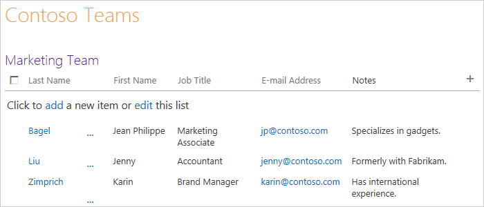
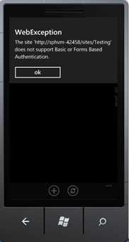
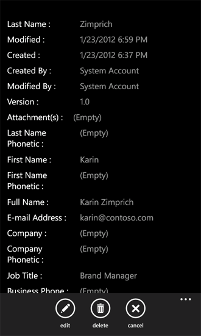

# Создание приложения списка SharePoint для Windows Phone
Создайте приложение Windows Phone в Visual Studio на основе шаблона приложения списка SharePoint для Windows Phone. Установка пакета SDK Windows Phone SharePoint предоставляет два шаблона приложения SharePoint для Windows Phone в Visual Studio 2010 или Visual Studio 2010 Express для Windows Phone. (  [Как: Настройка среды разработки мобильных приложений для SharePoint](how-to-set-up-an-environment-for-developing-mobile-apps-for-sharepoint.md)см). На основе шаблона приложения списка SharePoint для Windows Phone, можно следуйте указаниям мастера для создания функциональные приложения Windows Phone, которые можно получить доступ к и работы с данными в списке SharePoint.

> **Важные:** При разработке приложения для Windows Phone 8, должны использовать Visual Studio Express 2012 г., а не в Visual Studio 2010 Express. За исключением среды разработки все сведения в этой статье применимы к созданию приложений для Windows Phone 8 и Windows Phone 7. > Для получения дополнительных сведений см [как: Настройка среды разработки мобильных приложений для SharePoint](how-to-set-up-an-environment-for-developing-mobile-apps-for-sharepoint.md). 

## Создание приложения списка Windows Phone SharePoint

В приложении Windows Phone SharePoint списка можно получить доступ к большая часть списков, доступных в Надстройки SharePoint. Для целей, поставленных в этом примере приложения Windows Phone мы используем списков SharePoint с образцами данных из для вымышленной компании Contoso, Ltd. Для действия, чтобы создать первый итерации этого приложения списка SharePoint мы используем в список контактов SharePoint, который содержит сведения о членах группы маркетинга в компании Contoso, как показано на рисунке 1.
  
    
    

**На рисунке 1. Список контактов для отдела маркетинга Contoso**

  
    
    

  
    
    

  
    
    

### Создание приложения списка Windows Phone SharePoint

1. Запустите Visual Studio 2010 с параметром **Запуск от имени администратора**.
    
  
2. Выберите **Файл**, **Создать**, **Проект**. 
    
    Отобразится диалоговое окно **Новый проект**.
    
  
3. В диалоговом окне **Новый проект** разверните узел **Visual C#** и затем выберите узел **Silverlight для окна телефона**. (Убедитесь, что требуемой версии .NET Framework 4.)
    
    > [!NOTE]
    > [!Примечание] Шаблоны, устанавливаемые пакетом SDK SharePoint для Windows Phone, работают только в проектах C#. Эти шаблоны недоступны для проектов Visual Basic. 

4. В области **Шаблоны** выберите шаблон **Приложения списка SharePoint для Windows Phone** и назначьте проекту имя, напримерContosoSPListApp.
    
  
5. При запуске **Мастера приложений для телефона SharePoint**, может возникнуть ошибка, показано на рисунке 2. Эта ошибка происходит, когда учетная запись разработчик использует во время выполнения **Мастера приложений для телефона SharePoint** не имеет разрешений.
    
   **На рисунке 2. Сообщение об ошибке мастера SPList**

  

  
  

    Можно устранить эту ошибку, предоставляя ее недостаточно прав для учетной записи, с которым он работает мастера SPList. Повторно запустите **Мастер Splist** после присваивается достаточных прав.
    
  
6. Нажмите кнопку « **ОК** ». Откроется **Мастер приложений SharePoint телефона**. Используйте этот мастер для выбора списка SharePoint и настройка свойств этого списка, чтобы определить, как оно отображается в приложении Windows Phone.
    
  
7. Укажите URL-адрес конечного сайта SharePoint в сети (то есть для локальной установки SharePoint Server ).
    
  
8. Выберите **Поиск списков**. Если учетная запись, под которой выполняются Visual Studio имеет доступ к сайту указанный целевой, **Мастера приложений для телефона SharePoint** отображаются списки, доступные на этом узле.
    
  
9. Выберите один из доступных списков, например, в список контактов (как показано с демонстрационными данными в настраиваемое представление на рис. 1).
    
  
10. Нажмите кнопку **Далее**. Мастер отображает доступные представления, связанного с выбранного списка.
    
    Представления, отображаемые в мастере — эти представления, которые были созданы пользователями (или подготовить к работе с SharePoint Server ) и его связи с указанной списка на сервере. Некоторые списки SharePoint, имеют только один Просмотр, связанные с ними по умолчанию. В список контактов по умолчанию, связанного с представлением всех контактов. Список извещений, по умолчанию, связанного с представлением всех элементов. Списки задач, по умолчанию связан с шесть представления, включая все задачи представление и представление активных задач. Для каждого представления, выбранного на этом этапе в мастере элемент управления **PivotItem**, которая добавляется в элемент управления **Pivot** в XAML, определяющий пользовательский Интерфейс приложения Windows Phone.
    
  
11. Установите флажок рядом с каждым представлением, которое вы хотите включить в свое приложение Windows Phone.
    
  
12. Нажмите кнопку **Далее**. Мастер отображает доступные действия для выбранного списка в приложении Windows Phone.
    
    Доступны **New**, **отображаемое**, **Изменение** и **Удаление**. Если необходимо иметь возможность изменения и удаления элементов списка в приложении, необходимо выбрать операции **отображения** на этом этапе в мастере. (Флажки для операций, **Изменение** и **Удаление** отключены, если не выбран операции **отображения** ).
    
  
13. Установите флажок рядом с каждой действие, которое должно иметь недоступны для выбранного списка в приложении Windows Phone.
    
  
14. Нажмите кнопку **Далее**. Мастер отображает поля, связанные с выбранного списка на сайте SharePoint.
    
    > [!NOTE]
    > [!Примечание] Настраиваемое поле не будет доступно для выбора из мастера создания списка SharePoint для мобильных устройств. Тем не менее можно написать пользовательский код для доступа к любого настраиваемого поля. Поле не может быть связана с типом контента. Тем не менее если различные типы контента включены для списка, все поля будут доступны для разработчиков для использования в своих приложениях телефона. 

15. Установите флажок рядом с пунктом каждого поля, которые необходимо включить в список, как оно будет отображаться в приложении Windows Phone.
    
    > [!NOTE]
    > [!Примечание] Список полей, заданные в SharePoint Server как сведения о необходимости установки выбраны уже; они не может быть снят в мастере. 

16. Нажмите кнопку **Далее**. Мастер предоставит вам возможность упорядочить выбранные ранее поля.
    
  
17. Упорядочьте поля в соответствии со своими потребностями, выбирая отдельные поля и перемещая их выше или ниже в списке с помощью стрелок.
    
  
18. Нажмите кнопку **Готово**. Visual Studio создаст необходимые файлы для проекта и откроет файл List.xaml для редактирования.
    
  

## Запустите приложение Windows Phone, созданных с помощью мастера приложений SharePoint телефона

Можно создать проект, созданный с помощью **Мастера приложений для телефона SharePoint**, как создавать простые, но функциональные приложения списка Windows Phone SharePoint. Мы можем изменить и разработка приложения дальнейшей, но, пока пользователь может коснитесь (или, в эмуляторе Windows Phone, нажмите кнопку) элемент заданного списка и приложение отображает все поля, связанный с этим элементом (поля, выбранные в мастере для включения в приложение). Пользователь также можно добавлять элементы, удаление элементов списка и изменить значения полей для элементов списка. Вход в систему несколько пользователей в одном приложении не поддерживается. Тем не менее разработчик можно написать код, завершите сеанс текущего пользователя, когда другой пользователь попытается войти в одном мобильного приложения.
  
    
    
Цель развертывания для решения по умолчанию имеет значение эмулятора Windows Phone. Можно запустить проект в Visual Studio как есть (при нажатии клавиши F5 для запуска проекта в контексте отладчик или нажав сочетание клавиш CTRL + F5 для запуска проекта без отладки). Запуск эмулятора Windows Phone, ОС Windows Phone и развернуть в эмуляторе и работы приложения. При запуске с кодом, созданного с помощью мастера при запуске приложения списка SharePoint в эмуляторе, выводится запрос учетных данных для указанного списка SharePoint на целевом сайте. Укажите учетные данные учетной записи, имеющей достаточные разрешения для доступа к списку и выберите команду **Вход в систему** в эмуляторе. На главную страницу приложения Windows Phone (определяется с помощью файла List.xaml в проекте) отображается в эмуляторе. В зависимости от выбранных полей и порядке, в котором были введены для тех полях на предыдущих шагах вы должны увидеть элементы из указанного списка. На основе данных в список, представленный на рисунке 1, вы увидите список элементов в эмуляторе, как показано на рисунке 3.
  
    
    

**На рисунке 3. Элементы списка SharePoint в приложении Windows Phone**

  
    
    

  
    
    

  
    
    
При выполнении приложения Windows Phone, может возникнуть ошибка проверки подлинности, показано на рисунке 4. Это вызвано тем, что мобильного приложения SharePoint требуется **Обычная проверка подлинности форм**; Это не включена по умолчанию.
  
    
    

**На рисунке 4. Ошибка проверки подлинности приложения Windows Phone**

  
    
    

  
    
    

  
    
    
Можно устранить эту ошибку, Выбор метода **проверки подлинности базовой формы** из центра администрирования.
  
    
    

### Для включения проверки подлинности базовой формы

1. Перейдите в **Центр администрирования**; Убедитесь, что имеются права администратора на сервере.
    
  
2. Выберите пункт **Управление веб-приложениями** в разделе **Управление приложениями**.
    
  
3. Выберите веб-приложения (на котором имеется свой сайт SharePoint, который вы получаете доступ к мобильного приложения).
    
  
4. Выберите **Поставщики проверки подлинности** с помощью ленты.
    
  
5. Выберите **Поставщики проверки подлинности** с помощью ленты.
    
  
6. В диалоговом окне **Поставщика проверки подлинности** выберите команду Изменение параметров проверки подлинности **по умолчанию**.
    
  
7. В окне **Изменение параметров проверки подлинности** модели выберите **Простая проверка подлинности** в разделе типы **Проверки подлинности на основе утверждений**.
    
  
Если вы свое приложение Windows Phone на основе данных из списка контактов, как показано на рисунке 1, можно выбрать элемент списка и приложение отображает страницу представления (определяется DisplayForm.xaml в проекте) элемента отображение всех полей, доступных для элемента в приложении, как показано на рисунке 5. (В данном примере все поля, связанные со списком контактов SharePoint были выбраны в мастере приложений SharePoint телефона и хранения по умолчанию порядка полей).
  
    
    

**На рисунке 5. Представление DisplayForm элемента списка контактов**

  
    
    

  
    
    

  
    
    
Обратите внимание, **Изменение** и **Удаление** кнопки на панели приложения в эту страницу приложения. Эти операции для вас реализуются методы в Microsoft.SharePoint.Phone.Application.dll (по одной из библиотек, установленных с пакет SDK для Windows Phone SharePoint). Если нажмите кнопку **Изменить**, отображается элемент управления **Page** Windows Phone (то есть объект, полученные из класса, наследуемого от класса **Microsoft.Phone.Controls.PhoneApplicationPage** ). Если изменение полей и нажмите кнопку **Отправить** на странице, в приложение выполняется метод **UpdateItem** базового класса **EditItemViewModelBase** (, в конечном счете, выполняет метод **Update** объекта **ListItem** из объектной модели клиента SharePoint Silverlight) для сохранения изменений в список SharePoint.
  
    
    

## См. также

-  [Построение приложений Windows Phone, обращающихся к SharePoint](build-windows-phone-apps-that-access-sharepoint.md)
    
  
-  [Как: Настройка среды разработки мобильных приложений для SharePoint](how-to-set-up-an-environment-for-developing-mobile-apps-for-sharepoint.md)
    
  
-  [Windows Phone SDK 8.0](http://www.microsoft.com/en-us/download/details.aspx?id=35471)
    
  
-  [Пакет SDK Microsoft SharePoint для Windows Phone 8](http://www.microsoft.com/en-us/download/details.aspx?id=36818)
    
  
-  [Пакет SDK для Windows Phone 7.1](http://www.microsoft.com/en-us/download/details.aspx?id=27570)
    
  
-  [Пакет SDK Microsoft SharePoint для Windows Phone 7.1](http://www.microsoft.com/en-us/download/details.aspx?id=30476)
    
  

