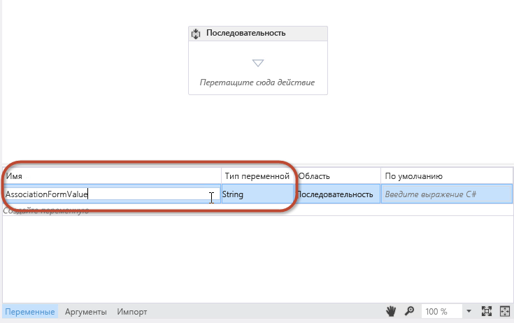
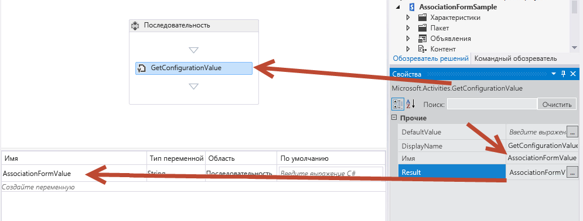
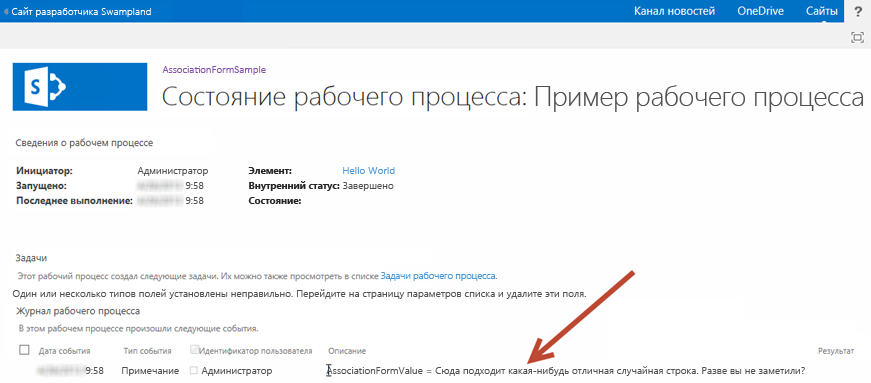
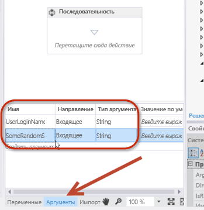
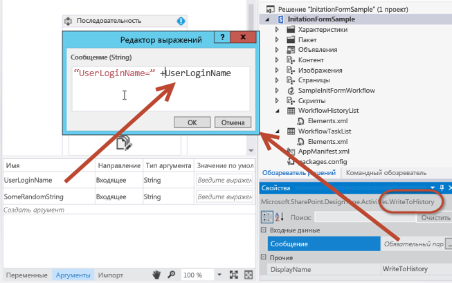
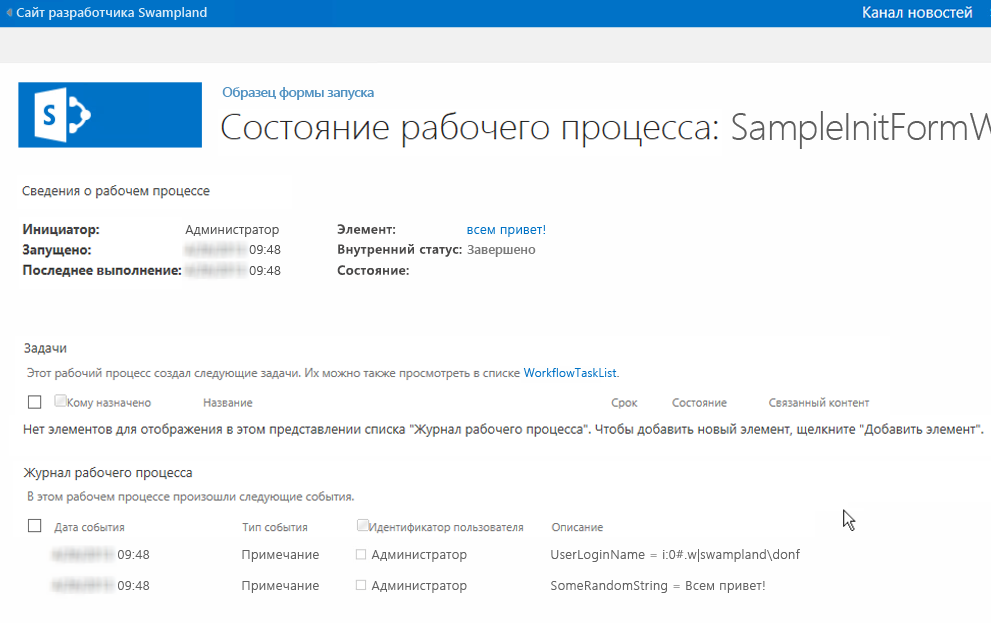

# <a name="create-custom-sharepoint-workflow-forms-with-visual-studio-2012"></a>Создание настраиваемых форм рабочих процессов SharePoint с помощью Visual Studio 2012

Представление форм рабочих процессов в SharePoint. При написании этой статьи использовались Инструменты разработчика Office для Visual Studio 2012 и SharePoint с общедоступным обновлением за март 2013 г. Все представленные в этой статье сведения применимы как к локальным развертываниям SharePoint, так и к Office 365.

**Автор:** [Эндрю Коннел (Andrew Connell)](http://social.msdn.microsoft.com/profile/andrew%20connell%20%5bmvp%5d/), [www.AndrewConnell.com](http://www.andrewconnell.com)

С момента выпуска Microsoft SharePoint 2007 платформа SharePoint поддерживает рабочие процессы для автоматизации бизнес-процессов. Платформа рабочих процессов SharePoint основана на Windows Workflow Foundation, части .NET Framework. Хотя Workflow Foundation предоставляет множество возможностей для создания настраиваемых рабочих процессов и управления автоматизированными бизнес-процессами, в SharePoint также добавлена возможность интеграции конечных пользователей, которая реализуется в виде двух частей: 
- **задачи**, назначаемые пользователям и группам, которых рабочие процессы могут создавать и отслеживать;

- **формы**, которые собирают данные от пользователей, если рабочие процессы связаны с типом контента (например, сайтом, списком или библиотекой) или если запускается рабочий процесс.
    
  

## <a name="workflow-forms-in-sharepoint-2007-and-sharepoint-2010"></a>Формы рабочих процессов в SharePoint 2007 и SharePoint 2010
<a name="sec1"> </a>

В каждой версии SharePoint Server 2007 и SharePoint 2010 рабочие процессы совершенствовались. В частности, корпорация Майкрософт добавила в SharePoint 2010 такие возможности, как связывание рабочих процессов с сайтами. Также были улучшены средства создания рабочих процессов, SharePoint Designer 2010 и Visual Studio 2010, по сравнению с их предшественниками. Однако в SharePoint реализация задач и форм рабочих процессов осталась практически без изменений.
  
    
    
До выпуска SharePoint разработчики могли создавать формы рабочих процессов двумя способами. В SharePoint 2007 формы InfoPath и веб-формы ASP.NET были равноправными решениями. У каждого из них были свои преимущества и недостатки. В SharePoint 2010 разработчикам рекомендовалось использовать веб-формы ASP.NET, так как именно их создавали инструменты разработчика SharePoint в Visual Studio 2010 при использовании шаблонов элементов проекта, представляющих собой формы рабочих процессов сопоставления и запуска, но их реализация была практически такой же, как в SharePoint 2007.
  
    
    

## <a name="changes-to-workflow-forms-in-sharepoint"></a>Изменения форм рабочих процессов в SharePoint
<a name="sec2"> </a>

В SharePoint появились новые архитектура и платформа рабочих процессов, отражающие некоторые фундаментальные перемены в том, как мы видим SharePoint. Основное изменение заключается в том, что обработчик среды выполнения SharePoint больше не управляет рабочими процессами в SharePoint и не запускает их. Вместо этого в SharePoint используется новый компонент под названием Workflow Manager, в котором размещаются среда выполнения Windows Workflow Foundation и необходимые службы для Workflow Foundation. Важно, что Workflow Manager работает за пределами SharePoint. При публикации рабочего процесса или запуске нового экземпляра опубликованного рабочего процесса SharePoint сообщает об этом компоненту Workflow Manager, который затем обрабатывает эпизоды рабочего процесса. Если рабочему процессу необходим доступ к сведениям в SharePoint, таким как свойства элементов списков или пользователей, он выполняет проверку подлинности пользователя с помощью модели авторизации OAuth и использует для взаимодействия интерфейсы REST API, появившиеся с выпуском SharePoint.
  
    
    
В этом выпуске SharePoint также изменилось общее направление модификации платформы SharePoint, но на самом деле это изменение началось еще с SharePoint 2010 и изолированных решений. В SharePoint корпорация Майкрософт добавила функции, которые переместили модификации с сервера SharePoint Server в клиентский браузер или другие внешние ресурсы. Эти функции включают новую модель приложений SharePoint, поддержку назначения удостоверений приложениям, проверку подлинности с помощью модели авторизации OAuth, а также улучшения клиентской объектной модели (CSOM) и интерфейсов REST API.
  
    
    
Как это влияет на формы рабочих процессов? Помните, что с момента выпуска SharePoint 2010 корпорация Майкрософт рекомендует разработчикам использовать веб-формы ASP.NET при создании форм в рабочих процессах, разрабатываемых с помощью Visual Studio. Конечно, при использовании этого подхода требуется серверный код для обработки формы и обеспечения взаимодействия между формой и обработчиком рабочих процессов. Однако в SharePoint это возможно только при разработке в стиле решений (то есть развертывании WSP-пакетов). Новая модель приложений SharePoint не позволяет серверному коду выполняться в процессе SharePoint.
  
    
    
Чтобы устранить это ограничение, корпорация Майкрософт расширила модель CSOM, включив в нее API для взаимодействия с обработчиком рабочих процессов. Чтобы подключить ферму SharePoint к ферме Workflow Manager, необходимо установить клиент Workflow Manager на серверах SharePoint. Этот компонент выступает в качестве прокси-сервера, через который SharePoint взаимодействует с фермой Workflow Manager. По сути, API CSOM служб рабочих процессов — это клиентский компонент, используемый для взаимодействия с новым обработчиком рабочих процессов. Дополнительные сведения о модели CSOM для служб рабочих процессов SharePoint см. в статье [Работа с клиентской объектной моделью для служб рабочих процессов SharePoint](working-with-the-sharepoint-workflow-services-client-side-object-model.md).
  
    
    
В чем же заключается польза для форм рабочих процессов SharePoint? При разработке рабочих процессов SharePoint с помощью Visual Studio 2012 для создания форм рабочих процессов используются веб-формы ASP.NET. Вы можете развернуть эти формы в качестве решения SharePoint или (это важно) внутри него. Так вы получите доступ ко всем серверным элементам управления, уже развернутым на нем, например веб-элементам управления ASP.NET и другим полезным (а иногда необходимым) элементам SharePoint. Вы также можете использовать новую модель CSOM служб рабочих процессов для выполнения всех необходимых задач из форм сопоставления и запуска, включая следующие:
  
    
    

- создание списков задач и журнала рабочих процессов;
    
  
- создание сопоставлений рабочих процессов для сайта, списка или библиотеки документов;
    
  
- запуск нового экземпляра существующего сопоставления рабочего процесса.
    
  
Модель CSOM служб рабочих процессов очень надежна и предоставляет много свободы для инноваций в рабочих процессах как из браузера, так и с удаленного компьютера.
  
    
    

## <a name="workflow-forms-available-in-sharepoint-sever-2013"></a>Формы рабочих процессов, доступные в SharePoint Server 2013
<a name="sec3"> </a>

До выпуска SharePoint существовало три типа настраиваемых форм рабочих процессов, которые можно создавать: формы **запуска**, **сопоставления** и **редактирования задач**. Формы редактирования задач больше не рассматриваются как решение для настраиваемых форм. Уменьшение роли форм для редактирования задач началось с SharePoint 2010, так как в инструментах разработчика SharePoint для Visual Studio 2010 отсутствовал элемент проекта для форм задач. Вместо этого для отображения задач использовались формы отображения и редактирования списков.
  
    
    
В SharePoint усовершенствована работа с задачами рабочих процессов. Теперь вы можете создавать кнопки исходов для определенных сценариев. Вы также можете настраивать отображение и поведение определенных столбцов в элементах задач с помощью клиентской обработки (CSR), появившейся в SharePoint. Обратите внимание, что для CSR используется код JavaScript, выполняемый в клиенте. Эти темы рассматриваются в статье [Работа с задачами в рабочих процессах SharePoint с помощью Visual Studio 2012](working-with-tasks-in-sharepoint-workflows-using-visual-studio-2012.md). Вы также можете найти дополнительные сведения в статье [Настройка представления списка в надстройках для SharePoint с использованием способа отображения на стороне клиента](http://msdn.microsoft.com/library/8d5cabb2-70d0-46a0-bfe0-9e21f8d67d86%28Office.15%29.aspx).
  
    
    

### <a name="understanding-workflow-initiation-forms"></a>Общие сведения о формах запуска рабочих процессов

Форма запуска открывается, когда пользователь вручную запускает рабочий процесс, определение которого связано с формой. После запуска отображается форма запуска, и пользователя просят ввести данные, необходимые рабочему процессу. Например, пользователь может ввести обоснование утверждения новых деловых расходов.
  
    
    
Важно помнить, что формы запуска отображаются только при ручном запуске рабочего процесса. Рабочие процессы, настроенные для автоматического запуска, не открывают форму запуска при инициации. Это может вызывать сложности для рабочих процессов, которые ожидают передачи данных из формы. Следует помнить, что если рабочие процессы настроены для автоматического запуска и рабочий процесс требует ввода данных, следует использовать формы сопоставления, а не запуска.
  
    
    

### <a name="understanding-workflow-association-forms"></a>Общие сведения о формах сопоставления рабочего процесса

Формы сопоставления отображаются администраторам, когда они решают добавить (или сопоставить) рабочий процесс в определенный список или библиотеку документов. Формы сопоставления позволяют администратору указать параметры, значения по умолчанию и другие данные для рабочего процесса, который применяется к элементам списка или библиотеке.
  
    
    
С помощью формы сопоставления по умолчанию администратор может выбрать определение рабочего процесса, ввести отображаемое имя сопоставления, указать списки, которые будут контейнерами для любых задач и элементов списка журналов, созданных рабочим процессом, выбранном в сопоставлении, а также указать условия, при которых рабочий процесс можно запуститься, например вручную или автоматически, при создании или обновлении элементов списка или библиотеки.
  
    
    
Вы также можете создавать настраиваемые формы. При наличии настраиваемой формы сопоставления в определении рабочего процесса SharePoint перенаправляет пользователя на настраиваемую форму после завершения обработки формы по умолчанию. Используйте настраиваемую форму для сбора сведений о конфигурации, которые могут потребоваться рабочему процессу, например для вызова внешней веб-службы, которой требуется проверить подлинность вызывающего или передать уникальный ключ API для доступа. Сведения подобного рода разработчики не хотят жестко кодировать в рабочем процессе. Такой сценарий возможен, если рабочий процесс входит в состав приложения, которое продается в магазине SharePoint. В этом случае каждому клиенту требуется собственная учетная запись в удаленной службе. Такие данные можно запросить у пользователя при создании сопоставления рабочего процесса.
  
    
    
Другая распространенная ситуация  необходимость собирать сведения, которые обычно отправляет инициатор для рабочих процессов, запускающихся автоматически. Как объяснялось ранее, формы запуска отображаются, только если они активируются вручную. С другой стороны, если рабочие процессы настроены для автоматического запуска, а рабочий процесс ожидает ввода данных в некоторых полях формы, рекомендуется использовать настраиваемую форму сопоставления. 
  
    
    
В форме запуска эти значения по умолчанию отображаются при запуске рабочего процесса вручную. При автоматическом запуске рабочий процесс может обнаружить, что данные не были переданы из формы запуска, и вернуться к значениям, указанным в форме сопоставления.
  
    
    

## <a name="walkthrough-create-and-deploy-a-custom-association-form"></a>Инструкции. Создание и развертывание настраиваемой формы сопоставления
<a name="sec4"> </a>

В этом пошаговом руководстве мы покажем, как создать настраиваемую форму сопоставления и использовать ее для сбора сведений, которые затем передаются в рабочий процесс. Перед началом работы убедитесь, что у вас есть доступ к сайту разработчика SharePoint.
  
    
    

### <a name="create-the-custom-association-form"></a>Создание настраиваемой формы сопоставления


1. Создание настраиваемого рабочего процесса с помощью Visual Studio 2012. 
    
  
2. В Visual Studio создайте проект приложения SharePoint и настройте для него размещение в SharePoint.
    
  
3. Добавьте в проект новый список **Announcement**. Он будет сопоставлен с рабочим процессом, а события в списке будет активировать рабочий процесс.
    
  
4. Добавьте элемент рабочего процесса в проекта, щелкнув правой кнопкой проект в **обозревателе решений** и последовательно выбрав **Добавить** и **Новый элемент**. В диалоговом окне **Добавление нового элемента** выберите элемент **Рабочий процесс** в категории **Office и SharePoint**. Введите "SampleWorkflow" в качестве имени и нажмите кнопку **Далее**. При появлении запроса в мастере настройки SharePoint настройте новый элемент как **Рабочий процесс списка**.
    
  
5. На следующей странице **мастера настройки SharePoint**, как показано на рис. 1., можно автоматически создать сопоставление рабочего процесса. Однако при создании настраиваемых форм сопоставления этот вариант **не** следует использовать. Снимите соответствующий флажок и нажмите кнопку **Готово**.
    
   **Рис. 1. Снимите флажок для автоматического сопоставления рабочего процесса.**

  

  
  

  

  
6. Добавьте в проект форму Visual Studio, щелкнув правой кнопкой мыши элемент рабочего процесса в **обозревателе решений** и последовательно выбрав **Добавить** и **Новый элемент**. 
    
    Последний шаг важен, поскольку на нем вы указываете в диалоговом окне **Добавление нового элемента**, что контекст  это элемент рабочего процесса. Из-за этого в диалоговом окне **Добавление нового элемента** отображаются два шаблона элементов проекта форм (формы запуска и формы сопоставления), как показано на рис. 2.
    

   **Рис. 2. Выбор шаблона формы сопоставления.**

  

  
  

  

  
7. Выберите элемент **Форма сопоставления рабочего процесса** и удалите "1" из имени поля. Нажмите кнопку "Добавить", чтобы завершить процесс.
    
  

### <a name="update-html-and-javascript-in-the-default-association-form"></a>Обновление HTML и JavaScript в форме сопоставления по умолчанию

После добавления новой формы в проект Visual Studio автоматически открывает ее. На этом этапе вам потребуется выполнить два действия с формой, чтобы сделать ее совместимым с рабочим процессом:
  
    
    

- Обновите HTML-форму для отображения элементов данных, которые необходимо запросить у пользователя, а также указать, как форма будет отрисовываться.
    
  
- Обновите JavaScript по умолчанию, чтобы получать значения из обновленной формы и сопоставить имена свойств с именами аргументов, которые вы создали в рабочем процессе.
    
  

1. Откройте форму, чтобы просмотреть код.
    
  
2. Найдите серверный элемент управления, показанный в следующем фрагменте кода:
    
```
  
<WorkflowServices:WorkflowAssociationFormContextControl ID="WorkflowAssociationFormContextControl1" runat="server" />
```


    This server control performs two important tasks. First, it adds the JavaScript libraries needed by the association form. Second, it takes the form values that were submitted by the preceding form and writes them to the page as hidden HTML input controls. The preceding page was the default SharePoint association form, the one where the user specified the workflow definition, association name, workflow task and history list, and the start options. This form used an HTTP POST to move to the custom association form that has been added to the workflow. Because it is an HTTP POST, the values are not accessible in the form, since all custom logic must be implemented without server-side code. Therefore SharePoint provides this server control to extract those values from the HTTP request pipeline and add them to this page.
    
  
3. Прокрутите исходный файл вниз, пока не найдете пример таблицы HTML, и замените его на следующий код:
    
```XML
  <table>
    <tr>
      <td colspan="2">
        String:<br /><textarea id="strInput" rows="1" columns="50"/>
      </td>
    </tr>
    <tr>
        <td><button id="Save" onclick="return runAssocWFTask()">Save</button></td>
        <td><button id="Cancel" onclick="location.href = cancelRedirectUrl; return false;">Cancel</button></td>
    </tr>
</table>

```


    This table displays a simple HTML textbox which is used to pass information into the workflow association. Note that the form has two buttons These buttons are used to save or cancel the workflow. When you click the **Save** button, the workflow calls the JavaScript function, **runAssocWfTask()**, which is located a few lines farther down in the source file. We need to modify that next.
    
  

### <a name="update-the-workflow-services-jsom-to-create-the-workflow-association"></a>Обновление модели JSOM служб рабочих процессов для создания сопоставления рабочих процессов

Сразу после раздела форм HTML в исходном файле находится блок кода _ecmascriptshort_ длиной около 200 строк. В этом блоке кода иллюстрируется реализация нового API клиентской объектной модели JavaScript (JSOM) для служб рабочих процессов в SharePoint. В большинстве случаев этот код JavaScript следует оставлять без изменений, так как он выполняет некоторые важные задачи:
  
    
    

- определяет, следует ли создавать новый связанный список задач рабочего процесса и, если это так, создает его;
    
  
- определяет, следует ли создать список журнала сопоставленного рабочего процесса и, если это так, создает его;
    
  
- создает сопоставление рабочего процесса с указанным именем, определением рабочего процесса, параметрами запуска и связанными списками.
    
  
Особое внимание следует уделить при создании настраиваемых форм сопоставления, в которых значения собираются и передаются в новое сопоставление. Мы рассмотрим это в следующей процедуре.
  
    
    

1. В блоке скрипта JSOM сопоставления рабочего процесса найдите функцию JavaScript, **associateWF()**.
    
  
2. В блоке для этой функции найдите строку, которая определяет новый массив с именем **metadata**: 
  
    
    
 `var metadata = new Object();`
    
  
3. Добавьте коллекцию пар "имя-значение", представляющих поля формы, которые следует передать в SharePoint. Для настраиваемой формы в этом руководстве вам понадобится приведенный ниже код JavaScript, поэтому измените блок, который задает переменную **metadata**, как показано ниже:
    
```XML
  
var strInputValue = document.getElementById("strInput").value;
if (strInputValue) {
  metadata['AssociationFormValue'] = strInputValue;
}
```

4. На этом этапе настраиваемая форма сопоставления завершена.
    
  

### <a name="consume-the-association-form-values-in-the-workflow"></a>Использование значений формы сопоставления в рабочем процессе

После завершения формы необходимо настроить рабочий процесс, чтобы использовать значения, переданные из формы сопоставления. Они передаются как значения конфигурации. Чтобы получить значение, используйте специальное действие для извлечения значения конфигурации из метаданных сопоставления рабочего процесса и сохраните его в переменной для дальнейшего использования.
  
    
    

1. Откройте рабочий процесс в Visual Studio, перейдите на вкладку **Переменные** и создайте строковую переменную с именем **AssociationFormValue**, как показано на рисунке 3.
    
   **Рис. 3. Создание переменной AssociationFormValue.**

  

  
  

  

  
2. Перетащите действие **GetConfigurationValue** в область конструктора рабочих процессов и присвойте свойству **Name** имя свойства метаданных, которое используется в форме, как показано на рис. 4.
    
   **Рис. 4.**

  

  
  

  

  
3. Присвойте свойству **Result** имя переменной, как показано на рис. 4.
    
    Это действие извлекает значение свойства **AssociationFormValue** из метаданных рабочего процесса и сохраняет его в локальной переменной. Чтобы просмотреть содержимое переменной, добавьте действие **WriteToHistory** в действия рабочий процесс и задайте свойство **Message**, чтобы записать значение переменной в журнал.
    
  
4. Вы выполнили все действия, необходимые для связи значений формы с рабочим процессом. Сохраните изменения и проверьте форму.
    
  

### <a name="test-the-custom-association-form"></a>Тестирование настраиваемой формы сопоставления


1. Для тестирования рабочего процесса нажмите клавишу **F5** или кнопку **Начать** в Visual Studio. В этом руководстве предполагается, что используется локальная установка SharePoint, поэтому Visual Studio запускает узел службы тестирования диспетчера рабочих процессов и развертывает рабочий процесс на сайте разработчика.
    
  
2. Чтобы создать сопоставление, перейдите к списку **Announcements**, затем на ленте откройте вкладку **Список** и нажмите кнопку **Параметры рабочих процессов**, а затем щелкните ссылку **Добавить рабочий процесс**. После этого появится форма сопоставления SharePoint.
    
  
3. В форме сопоставления выберите нужный рабочий процесс и присвойте ему имя.
    
  
4. Выберите параметры для создания списков задач и журнала, запуска рабочего процесса вручную и нажмите кнопку **Далее**.
    
  
5. Поскольку вы указали настраиваемую форму сопоставления в определении рабочего процесса, откроется форма, показанная на рис. 5.
    
   **Рис. 5. Настраиваемая форма сопоставления рабочего процесса.**

  

  
  

  

  
6. Введите значение в поле формы и нажмите кнопку **Save**. После этого будет создано сопоставление, а пользовательское значение будет сохранено в метаданных сопоставления рабочего процесса.
    
  
7. Чтобы проверить, может ли рабочий процесс извлечь значение из параметров конфигурации, вернитесь к списку **Announcements** и создайте элемент. Затем запустите рабочий процесс вручную. Перейдите на страницу состояния экземпляра рабочего процесса элемента и убедитесь, что значение записано в журнал, как показано на рис. 6.
    
   **Рис. 6. Страница состояния рабочего процесса.**

  

  
  

  

  

## <a name="walkthrough-creating-a-custom-initiation-form"></a>Инструкции. Создание настраиваемой формы запуска
<a name="sec4"> </a>

В этом руководстве показано, как создать настраиваемую форму сопоставления и с ее помощью получить сведения от пользователя, когда рабочий процесс запускается вручную.
  
    
    

### <a name="create-a-new-workflow-project"></a>Создание проекта рабочего процесса


1. Начните с создания настраиваемого рабочего процесса с помощью Visual Studio 2012, убедившись, что у вас есть доступ к сайту разработчика SharePoint.
    
  
2. Создайте проект SharePoint, настроенный как размещаемое в SharePoint приложение.
    
  
3. Добавьте в проект новый список **Announcement**. Мы будем использовать этот список как контейнер для элементов, которые мы используем для запуска рабочего процесса.
    
  
4. Затем добавьте элемент рабочего процесса в проект, щелкнув правой кнопкой мыши значок проекта в **обозревателе решений** и последовательно выбрав **Добавить** и **Новый элемент**. Затем в диалоговом окне **Добавление нового элемента** выберите элемент **Рабочий процесс**.
    
  
5. Введите для нового рабочего процесса имя "SampleInitFormWorkflow", а затем нажмите кнопку **Далее**.
    
  
6. При появлении запроса сделайте новый элемент рабочего процесса **рабочим процессом списка**, сопоставленным со списком **Announcements**. Настройка рабочий процесс для запуска вручную. (Обратите внимание, что форма запуска не отображается, если рабочий процесс запускается автоматически.)
    
  
7. На данном этапе проект отображается в **обозревателе решений**, как показано на рис. 7. Обратите внимание, что некоторые элементы, такие как **WorkflowHistoryList** и **WorkflowTaskList**, были добавлены автоматически при создании сопоставления.
    
   **Рис. 7. Внешний вид проекта в обозревателе решений.**

  

  
  

  

  

### <a name="add-arguments-to-collect-initiation-form-values"></a>Добавление аргументов для сбора значений формы запуска

Форма запуска рабочего процесса запрашивает у пользователям два типа данных, необходимых для запуска рабочего процесса: случайную строку, а также пользователя, который выбирается с помощью средства выбора людей. Для этого необходимо настроить два аргумента, значения которых API CSOM служб рабочих процессов возьмет из формы после ее отправки.
  
    
    

1. В конструкторе рабочих процессов откройте вкладку **Аргументы** в нижней части экрана и создайте два аргумента, как показано на рис. 8. Назовите их **UserLoginName** и **SomeRandomString**. 
    
   **Рис. 8. Настройка аргументов формы запуска.**

  

  
  

  

  
2. Для обоих аргументов задайте **Тип аргумента** как **String** и **Направление** как **In**, как показано на рис. 8.
    
    Свойство **Direction** можно представить как свойство класса .NET. Если в качестве направления задано **In**, у свойства будет открытый метод **Set**, но закрытый метод **Get**. Если направление задано как **Out**, у свойства будет открытый метод **Get**, но закрытый метод **Set**. Наконец, если установлено значение **In/Out**, оба метода **Get** и **Set** будут открытыми.
    
  
3. Чтобы просмотреть содержимое этих двух аргументов, добавьте пару действий **WriteToHistory** в рабочий процесс и настройте каждое из них для записи содержимого аргументов в список журнала.
    
    Эти аргументы можно использовать так же, как и переменные, но следует помнить, что при установке значения параметра **Направление** вы определяете возможность их чтения и записи. На рис. 9 показано, как одно из этих действий может выглядеть после настройки:
    

   **Рис. 9. Настройка действий WriteToHistory для тестирования аргументов**

  

  
  

  

  

### <a name="add-the-initiation-form-project-item"></a>Добавление элемента проекта формы запуска

После настройки рабочего процесса для приема двух входных аргументов из формы следующий шаг  добавление формы в проект.
  
    
    

1. Щелкните правой кнопкой мыши элемент рабочего процесса в **обозревателе решений** и последовательно выберите **Добавить** и **Новый элемент**.
    
  
2. Выберите элемент проекта **Форма запуска рабочего процесса** и удалите число "1" из имени формы, чтобы имя приняло вид "InitForm.aspx", а затем нажмите кнопку **Добавить**. После этого Visual Studio добавит новую ASPX-страницу в модуль **Страницы**, который уже присутствует в дереве проекта. Это гарантирует, что форма будет размещена во вложенной папке **Страницы** в приложении. Visual Studio также изменит свойства элемента рабочего процесса.
    
  
3. Выберите элемент рабочего процесса **SimpleInitFormWorkflow** в **обозревателе решений** и в таблице **Свойства** обратите внимание на то, какие свойства в форме запуска были установлены. Одно из них указывает на относительный путь сайта формы, добавленной в модуль **Страницы**.
    
  

### <a name="review-and-update-the-default-initiation-form"></a>Просмотр и обновление формы запуска по умолчанию

После добавления новой формы запуска в проект Visual Studio 2012 открывается автоматически. Как и для формы сопоставления, эта новая форма запуска должна выполнить две задачи:
  
    
    

- обновить HTML-форму для указания элементов данных, которые необходимо получить у пользователя, а также указать, как форма будет отображаться;
    
  
- Обновите блок JavaScript по умолчанию, чтобы получать значения, введенные пользователем, из обновленной формы и сопоставить имена свойств с именами аргументов, которые мы создали в рабочем процессе.
    
> [!NOTE]
> Обратите внимание на то, что в исходном файле первый заполнитель содержимого ASP.NET, **PlaceHolderAdditionalPageHead**, содержит ссылки на библиотеку CSOM служб рабочих процессов (**sp.workflowservices.js**) и основные библиотеки CSOM SharePoint (**sp.js** и **sp.runtime.js**). Сразу после этого раздела кода находится комментарий на стороне сервера с закомментированным примечанием. Помните, что это примечание, показанное на рис. 10, не имеет для нас значения, и его следует игнорировать.
  
    
    


**Рис. 10. Игнорируемый комментарий к коду.**

  
    
    

  
    
    

  
    
    

### <a name="update-the-html-form"></a>Обновление HTML-формы


1. Прокрутите файл кода формы вниз, пока не дойдете до заполнителя контента ASP.NET с именем  `PlaceHolderMain`. Обратите внимание, что первая часть этого раздела содержит HTML-таблицу с тремя полями формы. Нам понадобятся только два.
    
  
2. Обновите эту таблицу HTML, заменив ее на следующий код:
    
```
  
<table>
  <tr>
    <td>
      String:<br />
      <input type="text" id="strInput" />
    </td>
  </tr>
  <tr>
    <td>
      User Picker:<br />
      <SharePoint:PeopleEditor AllowEmpty="false" ValidatorEnabled="true" MultiSelect="false" ID="peoplePicker" runat="server" />
    </td>
  </tr>
  <tr>
    <td>
      <input type="button" name="startWorkflowButton" value="Start" onclick="StartWorkflow()" />
      <input type="button" name="cancelButton" value="Cancel" onclick="RedirFromInitForm()" />
      <br />
    </td>
  </tr>
</table>

```

Теперь таблица содержит два элемента управления для ввода. Первый из них представляет собой стандартное текстовое поле HTML с идентификатором **strInput**. Второй — средство выбора людей SharePoint с идентификатором **peoplePicker**. Последний является серверным элементом управления. Однако его разрешается размещать на странице, так как он был развернут на каждом компьютере с SharePoint. Более того, в верхней части формы запуска есть ссылка на этот элемент управления.
  
    
    
Обратите внимание на две кнопки на форме, **Начать** (startWorkflowButton) и **Отмена** (cancelButton). Если нажать кнопку "Начать", будет вызвана функция **StartWorkflow()**JavaScript. Она расположена в блоке скрипта далее в форме, ее мы изменим следующей.
  
    
    

### <a name="update-the-jsom-code-block-to-start-the-workflow"></a>Обновление блока кода JSOM для запуска рабочего процесса


1. Найдите блок кода JavaScript, который следует сразу же после модифицированной нами HTML-таблицы. В основном, мы оставим код в этом блоке без изменений.
    
    Этот код демонстрирует огромные возможности и гибкость, предоставляемые интерфейсом API JSOM служб рабочих процессов, который был реализован в SharePoint. На высоком уровне код выполняет указанные ниже действия.
    
  
2. Найдите следующую строку кода: `var wfParams = new Object();`
    
  
3. Сразу после нее замените существующий код на собственный, чтобы извлечь значения из двух полей HTML-формы, которые мы создали несколько секунд назад: **strInput** и **peoplePicker**. Для этого добавьте следующую ссылку на библиотеку jQuery в элемент **PlaceHolderAdditionalPageHead** в HTML-разметке. Это упростит извлечение значений из формы.
    
```
  
<script type="text/javascript" src="../Scripts/jquery-1.8.2.min.js"></script>
```

4. Теперь вернитесь к части блока JSOM, в которой параметры извлекаются из формы. Замените существующий код JavaScript на следующий:
    
```
  var wfParams = new Object();
// get people picker value
var html = $("ctl00_PlaceHolderMain_peoplePicker_upLevelDiv");
wfParams['UserLoginName'] = $("#divEntityData", html).attr("key");

// get string input
var strInputValue = $("strInput").value;
wfParams['SomeRandomString'] = strInputValue

```

5. Сохраните изменения.
    
  
Код, который мы изменили в предыдущей процедуре, выполняет большой объем работы.
  
    
    

- Код получает следующие три параметра из строки запроса URL-адрес:
    
  - идентификатор элемента, с которым будет сопоставлен новый экземпляр рабочего процесса, сохраненный в переменной JavaScript, **[itemId]**;
    
  
  - идентификатор сопоставления рабочего процесса для текущего сайта, списка или библиотеки документов, сохраненный в переменной JavaScript, **[subscriptionId]**;
    
  
  - URL-адрес, с которого перешел пользователь, сохраненный в переменной JavaScript, **[redirectUrl]**. По этому адресу пользователь будет перенаправлен после заполнения формы и запуска рабочего процесса.
    
  
- Код создает массив свойств, отправляемых рабочему процессу, который хранится в переменной JavaScript, **[wfParams]**. Эти значения требуется получить из формы. Это второе обязательное действие, необходимое для изменения настраиваемой формы запуска.
    
  
- Код получает ссылки на контекст клиента SharePoint CSOM, а также необходимые службы рабочих процессов.
    
  
- После подключения скрипта к службе подписок служб рабочих процессов (ссылка указана в переменной **[subscriptionService]** ), он выполняет одно из следующих действий:
    
  
- 
  - если скрипт получил идентификатор элемента из строки запроса на первом шаге, запускается новый экземпляр рабочего процесса для указанного элемента списка с помощью вызова функции **[startWorkflowOnListItem()]** из экземпляра служб рабочих процессов;
    
  
  - если идентификатор не найден, новый экземпляр рабочего процесса запускается на текущем сайте путем вызова функции **[startWorkflow()]** из экземпляра служб рабочих процессов.
    
  

### <a name="test-the-custom-initiation-form"></a>Тестирование настраиваемой формы запуска

Для тестирования рабочего процесса нажмите клавишу F5 или кнопку **Начать** в Visual Studio 2012. Если тестирование выполняется в локальной установке SharePoint, Visual Studio 2012 запускает узел службы тестирования диспетчера рабочих процессов и развертывает рабочий процесс на сайте разработчика. Через некоторое время откроется сайт разработчика.
  
    
    
Перейдите к списку **Announcements** и создайте элемент. После этого запустите настраиваемый рабочий процесс.
  
    
    
Поскольку определение рабочего процесса содержит ссылку на форму запуска, пользователь сначала переходит на эту форму. Заполните запрашиваемые значения, а затем нажмите кнопку **Начать**. Это активирует код JavaScript на странице, который запустит экземпляр рабочего процесса, как показано на рис. 11.
  
    
    

**Рис. 11. Запуск рабочего процесса.**

  
    
    

  
    
    

  
    
    
После запуска рабочего процесса пользователь перенаправляется на исходную странице. Дайте рабочему процессу немного времени для запуска, а затем вернитесь к элементу и просмотрите страницу состояния экземпляра рабочего процесса. Обратите внимание на то, что список журнала содержит значения, введенные на форме и переданные в SharePoint, когда экземпляр рабочего процесса был создан с помощью JSOM служб рабочих процессов.
  
    
    

**Рис. 12. После завершения рабочего процесса.**

  
    
    

  
    
    

  
    
    

  
    
    

  
    
    

## <a name="conclusion"></a>Заключение
<a name="sec6"> </a>

В SharePoint появилась несколько улучшений рабочих процессов. В этой статье подробно описываются изменения, связанные с формами рабочих процессов и вызванные изменениями архитектуры рабочих процессов в SharePoint. В этой статье также показано, как создавать настраиваемые формы сопоставления и запуска, позволяющие обеспечить соответствие строгим требованиям к автоматизации современных бизнес-процессов с помощью Visual Studio 2012.
  
    
    

## <a name="see-also"></a>См. также
<a name="sec7"> </a>


-  [Формы сопоставления и запуска рабочих процессов (SharePoint Foundation)](http://msdn.microsoft.com/ru-RU/library/office/ms481192%28v=office.14%29.aspx)
    
  
-  [Работа с клиентской объектной моделью служб рабочих процессов в SharePoint](working-with-the-sharepoint-workflow-services-client-side-object-model.md)
    
  
-  [Настройка представления списка в надстройках для SharePoint с использованием способа отображения на стороне клиента](http://msdn.microsoft.com/library/8d5cabb2-70d0-46a0-bfe0-9e21f8d67d86%28Office.15%29.aspx)
    
  

