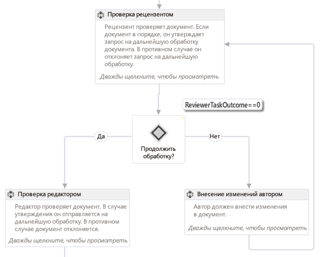
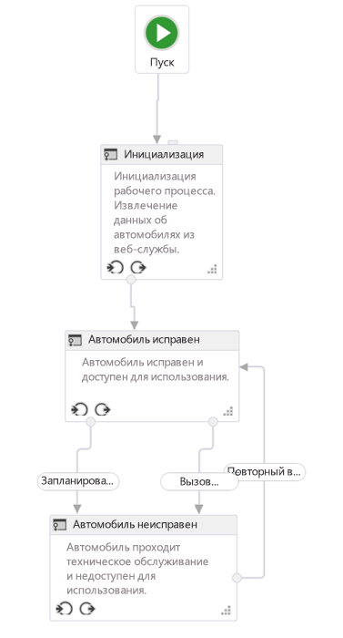
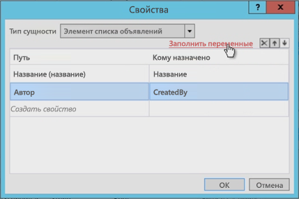
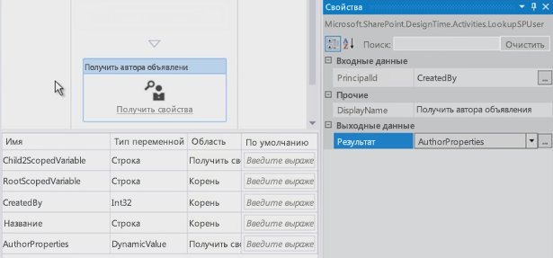
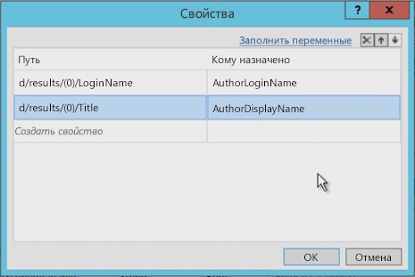

# Создание рабочих процессов в SharePoint с помощью Visual StudioCreate SharePoint workflows using Visual Studio

Ознакомьтесь с основами создания рабочего процесса SharePoint на новой платформе рабочих процессов SharePoint.Learn the basics of creating a SharePoint workflow in the new SharePoint workflow platform. Provided by:Andrew Connell,  AndrewConnell.com

**Автор:** [Andrew Connell](http://social.msdn.microsoft.com/profile/andrew%20connell%20%5bmvp%5d/), [AndrewConnell.com](http://www.andrewconnell.com)**Provided by:** [Andrew Connell](http://social.msdn.microsoft.com/profile/andrew%20connell%20%5bmvp%5d/),  [AndrewConnell.com](http://www.andrewconnell.com)

> [!NOTE]
> Эта статья сопровождается полным примером кода, который можно использовать при изучении этой статьи или как отправную точку для собственных проектом рабочих процессов SharePoint. Скачать код можно здесь: ССЫЛКА.This article is accompanied by an end-to-end code sample that you can use to follow the article, or as a starter for your own SharePoint workflow projects. You can find the downloadable code here: LINK. 
    
Корпорация Майкрософт применила к рабочим процессам в SharePoint не такой подход, как в предыдущих версиях. Теперь рабочие процессы SharePoint основаны на Windows Workflow Foundation 4, а их выполнение управляется новым компонентом под названием Workflow Manager, который запускается независимо от SharePoint.Workflow Manager выступает в роли ведущего приложения с высоким уровнем доступа и масштабирования для среды выполнения Windows Workflow Foundation и всех необходимых служб. Он использует служебную шину для обеспечения производительности и масштабируемости, а при развертывании выполняется в локальной среде так же, как и в облачной службе, например Office 365, поскольку он поручает выполнение всех рабочих процессов и сопутствующие задачи ферме Workflow Manager.Резкое изменение архитектуры рабочих процессов потребовало некоторых изменений двух основных средств создания настраиваемых рабочих процессов  Visual Studio и SharePoint Designer. В этой статье рассматривается использование Visual Studio 2012 в качестве средства создания настраиваемых рабочих процессов для использования в развертываниях **sp15allshort**  локальных или Office 365Microsoft has taken a very different approach to workflows in SharePoint than in previous versions. SharePoint workflows are now based on Windows Workflow Foundation 4, and their execution is driven by a new component called Workflow Manager, which runs externally to SharePoint.Workflow Manager serves the role as host for the Windows Workflow Foundation runtime and all the necessary services in a highly available and scalable way. It leverages Service Bus for performance and scalability, and when deployed it runs exactly the same in an on-premises deployment as when deployed to a cloud-based service, such as Office 365, because it is configured to hand off all workflow execution and related tasks to the Workflow Manager farm.The dramatic change in the workflow architecture required some changes to the two primary workflow authoring tools for creating custom workflows - Visual Studio and SharePoint Designer. This article will explore using Visual Studio 2012 as your workflow authoring tool to create custom workflows for use in **sp15allshort** deployments - either on-premises or Office 365 deployments

## Типы рабочих процессов в Visual Studio 2012Types of workflows in Visual Studio 2012

Хотя SharePoint Designer 2013 может создавать только рабочие процессы, состоящие их этапов, Visual Studio поддерживает еще один полезный тип рабочего процесса: процесс конечного автомата. Фактически, среды разработки рабочих процессов Visual Studio 2012 (и Visual Studio 2013) поддерживают создание трех типов рабочих процессов: последовательных, блок-схем и конечных автоматов.While SharePoint Designer 2013 can only create workflows comprised of stages, Visual Studio supports another powerful type of workflow: the state machine workflow. Effectively, then, the Visual Studio 2012 (and Visual Studio 2013) workflow development environments support three types of workflow authoring: sequential, flowchart, and state machine.
  
    
    

### ПоследовательныеSequential

Последовательный рабочий процесс следует определенному пути. Он может включать ветки решений и циклы или не иметь конечной точки, но в процессе разработки легко отслеживается предсказуемый путь. На самом деле с этого начинаются все рабочие процессы при использовании шаблона проекта **Рабочий процесс** в Visual Studio.A sequential workflow is one that follows a specific path. There may be decision branches, loops, and the workflow may not have a termination point, but it is easy to follow the predictable path in the design process. In fact, is how all workflows start out when you are using the **Workflow** project template in Visual Studio.
  
    
    
Последовательный рабочий процесс содержит одно действие **Последовательность**, которое может включать любое число действий. Некоторые из них могут быть действиями **Последовательность**, которые используются, чтобы сгруппировать серию этапов меньшего размера.A sequential workflow contains a single **Sequence** activity and then any number of activities within it. Some of these could be other **Sequence** activities that you use to group together a series of smaller steps.
  
    
    

### Блок-схемаFlowchart

В окне блок-схемы путь выполнения может переходить в различные разделы рабочего процесса в зависимости от указанных условий, как показано на рис. 1. Действие блок-схемы, а также связанные с ним действия FlowDecision и FlowSwitch, обычно помещаются внутри действия Sequence и выполняются либо как традиционное выражение **if**, либо как выражение **switch** в распространенных языках программирования.In flowchart workflow, the execution pathway can transition to different sections of the workflow according to conditions that you specify, as shown in the Figure 1. The flowchart activity, along with the associated FlowDescision and FlowSwitch activity, are typically placed within a Sequence activity and act like either a traditional **if** statement, or like **switch** statement in common programming languages.
  
    
    
Конструкция этапов в рабочем процессе SharePoint Designer 2013 основана на принципе блок-схемы. Рабочие процессы этих типов, в отличие от последовательных, не следуют предопределенному пути. Вместо этого путь выполнения рабочего процесса определяется событиями в ходе рабочего процесса.The stage construct within a SharePoint Designer 2013 based workflow is based on the principles of a flowchart. These types of workflows, unlike a sequential workflow, do not have a prescribed path in which they follow. Rather the things that happen during the workflow dictate the path the workflow follows.
  
    
    

**Рисунок 1. Окно блок-схемы в Visual Studio 2012****Figure 1. Flowchart workflow in Visual Studio 2012**

  
    
    

  
    
    

  
> [!NOTE]
> Вы можете найти рабочий процесс, представленный на рис. 1, в примере [SharePoint: рабочий процесс утверждения с использованием настраиваемой формы запуска](http://code.msdn.microsoft.com/officeapps/SharePoint-Approval-f5ac5eb2) на сайте MSDN.Note: You can find the workflow depicted in Figure 1 as a workflow sample on MSDN here:  [SharePoint: Approval workflow that uses a custom initiation form](http://code.msdn.microsoft.com/officeapps/SharePoint-Approval-f5ac5eb2). 
  
    
    

### Конечный автоматState machine

Рабочие процессы конечного автомата, как и рабочие процессы блок-схем, обычно не следуют определенному пути выполнения. Вместо этого они состоят из одного или нескольких состояний, как показано на рис. 2.State machine workflows, like flowchart workflows, do not typically follow a specific path of execution. Rather, they consist of two or more states as shown in Figure 2. 
  
    
    

**Рисунок 2. Рабочий процесс конечного автомата в Visual Studio 2012****Figure 2. State machine workflow in Visual Studio 2012**

  
    
    

  
    
    

  
> [!NOTE]
> Рабочий процесс, представленный на рис. 1, можно найти в примере [SharePoint: переключение состояний рабочих процессов в зависимости от действий и событий](http://code.msdn.microsoft.com/officeapps/SharePoint-Route-25a25d87) на сайте MSDN.Note: You can find the workflow depicted in Figure 1 as a workflow sample on MSDN here:  [SharePoint: Route workflows to states depending on actions and events](http://code.msdn.microsoft.com/officeapps/SharePoint-Route-25a25d87). 
  
    
    

Каждое состояние можно рассматривать как рабочий процесс меньшего размера, который содержит несколько действий. Определенные действия могут запускаться, когда рабочий процесс переходит в некоторое состояние. Самое интересное в конечных автоматах  возможность задавать переходы. У каждого состояния может быть один или несколько переходов, которые сообщают подсистеме рабочих процессов, как переходить от одного состояния к другому.Think of each state as a smaller workflow that contains multiple workflow activities. You can set specific activities to start when the workflow enters or exits a given state. What really makes state machines interesting is the transitions that you can define. Each state can have one or more transitions that tell the workflow engine how to move from one state to another state. 
  
    
    
Рабочий процесс конечного автомата всегда находится в одном из состояний. Переход заставляет триггер рабочего процесса менять состояние. Многие люди предпочитают рабочие процессы конечного автомата остальным типам рабочих процессов, поскольку они позволяют более точно отражать реальные бизнес-процессы. Тем не менее, такие рабочие процессы могут быстро усложняться.The workflow is always going to be in one of the states in a state machine workflow. A transition will dictate the trigger for the workflow to move from one state to another. Many people favor state machine workflows over the other types of workflows because they can be made to more closely mirror real world business processes. However these types of workflows can get complicated quickly.
  
    
    

## Интерфейс разработки рабочих процессов Visual Studio 2012Visual Studio 2012 workflow development interface

При добавлении нового рабочего процесса к проекту SharePoint шаблон добавляет одно действие Sequence, которое выступает в роли основного контейнера. Если вам нужно создать рабочий процесс блок-схемы или конечного автомата, просто удалите это действие и перетащите действие StateMachine или Flowchart на рабочую область конструирования.When adding a new workflow to a SharePoint project, the template adds a single Sequence activity which serves as the main container. If you want to create a flowchart or state machine workflow simply delete this default activity and drag either a StateMachine or Flowchart activity onto the design surface.
  
    
    
Прежде чем создавать настраиваемый рабочий процесс, разработчикам нужно иметь хорошее представление об окнах инструментов и рабочей области конструирования, которые предоставляет Visual Studio 2012. Многие элементы встречаются довольно часто, как показано на рис. 3:Before building a custom workflow, developers should have a good understanding on the tool windows and design surface that Visual Studio 2012 provides. Many of the elements are quite common, as shown in Figure 3:
  
    
    

**Рисунок 3. Интерфейс создания рабочих процессов Visual Studio 2012****Figure 3. Visual Studio 2012 workflow authoring interface**

  
    
    

  
    
    

  
    
    
Интерфейс разработки рабочих процессов (то есть конструктор рабочих процессов) включает следующие основные элементы:The workflow development interface - that is, the workflow designer - has the following key elements:
  
    
    

  
    
    

1. **Обозреватель решений** представляет проект в виде дерева файлов.**Solution Explorer** displays your project as a file tree.
    
  
2. **Панель элементов рабочего процесса** содержит все действия, из которых можно собрать рабочий процесс. Их необходимо перетащить с панели элементов на рабочую область конструирования.**Workflow toolbox** contains all of the activities that you can use to assemble a workflow. You drag and drop from the toolbox to the designer surface.
    
  
3. **Область конструктора рабочих процессов** используется для сборки и соединения элементов рабочего процесса.**Workflow designer surface** is where you assemble and link the workflow elements.
    
  
4. **Таблица свойств** показывает свойства выбранного действия или элемента в **обозревателе решений**. Она позволяет задавать и изменять значения свойств.**Property grid** displays properties of a selected activity or item in **Solution Explorer**. Use this to set or change property values.
    
  
5. **Область вывода** содержит сведения об элементах действия рабочего процесса  переменных, аргументах и импорте.**Output pane** displays information about workflow activity elements - variables, arguments, and import.
    
  
6. **Вкладки иерархической навигации** позволяет приближать и удалять различные части создаваемого рабочего процесса.**Breadcrumb navigation tabs** allows you to zoom in and out on various portions of a workflow under development.
    
  
**Область вывода** (№ 5 на рис. 3) важна, поскольку она позволяет просмотреть все переменные рабочего процесса в текущей области. Выбор области работает так же, как и в обычном объектно-ориентированном программировании: переменная в корне доступна всем областям нижних уровней (например, методам в классе), но переменная в области более низкого уровня (например, метод в классе) доступна только в этой области и ее дочерних областях, но не в параллельных и родительских областях.The **Output pane** (#5 in Figure 3) is important because it allows you to see all of the variables in your workflow at the current scope. Scoping works the same way as it does in standard programming object oriented design: a variable scoped at the root is accessible to all lower scopes (such as methods within a class), but a variable within a lower scope (such as a method in a class) is only accessible within that scope and its children, but not parallel or parent scopes.
  
    
    
Щелкните вкладку **Аргументы**, чтобы просмотреть список аргументов, которые используются для передачи значений в рабочий процесс, например аргументов, переданных из формы инфляции.Click on the **Arguments** tab to see a list of the arguments that are used to pass values into the workflow, such as those passed from an initiation form.
  
    
    

## Создание настраиваемого рабочего процессаHow to create a custom workflow

Чтобы создать настраиваемый рабочий процесс с помощью Visual Studio 2012 или более поздней версии, вам необходим доступ к сайту разработчика SharePoint. Для данного примера рекомендуется использовать локальную установку SharePoint. Это вызвано тем, что рабочие процессы, тестируемые локально, могут записывать данные отладки в служебную программу Test Service Host с помощью действия **WriteLine**. Эта программа входит в состав Инструменты разработчика Office для Visual Studio 2013  части стандартной установки Visual Studio 2012 и более поздних версий в редакциях Professional, Premium и Ultimate.To create a custom workflow using Visual Studio 2012 or later, ensure that you have access to a SharePoint developer site. For this walkthrough, it is recommended that you use a local SharePoint installation. This is because workflows tested locally can write debugging information to the Test Service Host console utility using the **WriteLine** activity. This utility is included with the Office Developer Tools for Visual Studio 2013, which are part of the default installation of Visual Studio 2012 and later in the Professional, Premium, and Ultimate editions.
  
    
    

### Создание нового проекта приложенияCreate a new app project

1. Создайте в Visual Studio новый проект Надстройки SharePoint и настройте его как приложение, размещаемое в SharePoint.In Visual Studio, create a new SharePoint Add-ins project and configure it to be a SharePoint-hosted app.
    
  
2. Добавьте к этому проекту новый экземпляр списка **Объявление**. Мы используем этот список как контейнер для элементов, которые будут использоваться для тестирования рабочего процесса.In this project, add a new **Announcement** list instance. We use this list as a container for items that we are going to use to test the workflow.
    
  
3. Добавьте элемент рабочего процесса к проекту, щелкнув правой кнопкой мыши значок проекта в **обозревателе решений** и последовательно выбрав команды **Добавить** и **Создать элемент**.Add a workflow item to the project by right-clicking the project icon in **Solution Explorer** and selecting **Add**, then **New Item**.
    
  
4. В диалоговом окне **Добавление нового элемента** выберите элемент проекта **Рабочий процесс** в категории **Office/SharePoint** и назовите его "Мой первый рабочий процесс". Нажмите кнопку **Далее**.In the **Add New Item** dialog box, select the **Workflow** project item from the **Office/SharePoint** category and name it "My First Workflow". Click **Next**.
    
  
5. Когда в **мастере настройки SharePoint** потребуется указать имя, оставьте имя по умолчанию и сделайте его **рабочим процессом списка**. Нажмите кнопку **Далее**.When prompted by the **SharePoint Customization Wizard** for a name, leave the default, then set it to be a **List Workflow**. Click **Next**.
    
  
6. На следующей странице мастера установите флажок для создания сопоставления, а затем выберите только что созданный список **Объявления**, а затем выберите команду **<Create New>** для необходимых списков журнала рабочего процесса и задач, после чего нажмите кнопку **Далее**.On the next page of the wizard, check the box to create an association, then select the **Announcements** list that we just created; select **<Create New>** for the required workflow history and task lists and then click **Next**.
    
  
7. На последней странице мастера установите флажок, чтобы запускать рабочий процесс вручную, а затем нажмите кнопку **Готово**. Visual Studio автоматически добавит необходимые элементы к проекту и загрузит файл Workflow.xaml в конструктор, как показано на рис. 4.On the final page of the wizard, check the box to start the workflow manually, leaving the two automatic start options unchecked; then click **Finish**. Visual Studio automatically adds the required elements to the project and loads the Workflow.xaml file into the designer, as shown in Figure 4.
    
   **Рис 4. Область конструктора по умолчанию после добавления элемента рабочего процесса****Figure 4. Default designer surface after adding the workflow item**

  

  
  

  

  

### Организация этапов рабочего процессаOrganize workflow steps

Для автоматизации определенного бизнес-процесса можно использовать любое число действий, объединенных в этап, или **Sequence**. Тем не менее, если сгруппировать слишком много действий в один объект **Sequence**, рабочий процесс станет сложным для понимания и отладки. Аналогично, в обычных языках программирования не рекомендуется слишком длинные и сложные методы. Вместо этого следует группировать действия, которые вместе выполняют определенную задачу.To automate a given business process, workflows can contain any number of activities that you group together into a step, or **Sequence**. However, if you group too many of these activities in a single **Sequence**, the workflow becomes cluttered and difficult to follow and debug. This is similar to how in a common programming language it is ill-advised to create extremely long and complex methods. Instead, you should group activities that work together to perform a specific task in a common sequence.
  
    
    
Пример рабочего процесса иллюстрирует методику сегментирования рабочих процессов. В области конструктора нового проекта добавьте к существующему действию Sequence два новых действия Sequence и назовите их "Дочерняя последовательность 1" и "Дочерняя последовательность 2", как показано на рис. 5. Кроме того, хотя это не показано на рис. 5, измените имя исходного действия Sequence на "Корневая".This workflow sample will illustrate this practice of segmenting your workflows. In your new project, on the designer surface, to the existing default Sequence activity, add two new Sequence activities and rename them "Child Sequence 1" and Child Sequence 2", as depicted in Figure 5. Also (though not shown in Figure 5), change the name of the original Sequence activity to "Root".
  
    
    

**Рисунок 5. Добавление дочерних последовательностей к последовательности по умолчанию (корневой)****Figure 5. Adding child sequences to the default, or root, sequence**

  
    
    

  
    
    

  
    
    

  
    
    

  
    
    

### Комментирование рабочего процесса с помощью заметокComment your workflow using annotations

При использовании распространенного языка программирования, например C#, VB.NET или C++ вы можете комментировать код с помощью соответствующих обозначений. Комментирование кода важно для тестирования и поддержания базы кода. Visual Studio также позволяет комментировать разработку рабочего процесса с помощью функции **annotations**.When using a common programming language like C#, VB.NET, or C++, you can comment your code by using appropriate comment specifiers. Commenting code is important for testing and maintaining a code base. Well, Visual Studio allows you also comment your workflow development by providing a feature called **annotations**.
  
    
    
Вы можете комментировать действие рабочего процесса, выделив его, а затем выбрав команды **Заметки** и **Добавить заметку**. Небольшой значок в виде обратных угловых скобок справа от заголовка действия обозначает, что к нему есть заметка. Наведите указатель на значок или щелкните его, чтобы увидеть сообщение (как показано на рис. 6). Вы можете закрепить заметку, чтобы она всегда была видна, как показано на рис. 6.You can comment a given workflow activity by selecting the activity, the selecting **Annotations**, then **Add Annotation**. A small icon of inverted chevrons on the right side of the activity's title bar signals that it has an annotation. Hover over or click on the icon to see the message (shown in Figure 6). You have the option to pin the annotation to the activity so it is always visible, as shown in Figure 6. 
  
    
    

**Рисунок 6. Заметка к действию****Figure 6. Annotation on an activity**

  
    
    

  
    
    

  
    
    

  
    
    

  
    
    

### Получение значений из элементов спискаObtain values from list items

Распространенная задача при создании рабочих процессов  получение свойств элемента списка. Для этого используется действие **LookupSPListItem**. Оно совершает вызов веб-службы, используя API REST SharePoint для поиска сведений об элементе списка. В следующей процедуре показано, как это сделать:A common task you will encounter when creating workflows is getting properties of a list item. To accomplish this task, use the **LookupSPListItem** activity. What this activity does is make a web service call using the SharePoint REST API to lookup information on the list item. The following procedure shows how to do this:
  
    
    
Для начала перетащите действие **LookupSPListItem** с панели элементов на действие **Дочерняя последовательность 1**.First, drag a **LookupSPListItem** activity from the toolbox and drop it in the **Child Sequence 1** activity.
  
    
    
После добавления действия в конструктор необходимо задать пару свойств: **ListId** и **ItemId**. Эти свойства позволяют искать сведения в любом списке, но если использовать ссылки на **текущий список** и **текущий элемент**, Workflow Manager будет определять эти значения автоматически.After adding the activity to the designer, you have to set a couple of properties: **ListId** and **ItemId**. These properties can be set to lookup information in any list, but using the shortcuts for **current list** and **current item** tell Workflow Manager to figure these values out automatically.
  
    
    
Так как мы совершаем вызов веб-службы, возвращаемое из этого действия значение, отраженное свойством **Result**, имеет тип **DynamicValue**. Следовательно, нам необходимо переменная того же типа для хранения выходного значения вызова. На самом деле это очень просто сделать: нажав ссылку **Получить свойства** в действии **LookupSPListItem**, вы сделаете большую часть работы автоматически:Because we are making a web service call, the return value from this activity, reflected in the **Result** property, is of type **DynamicValue**. Therefore, we need a variable of that data type in which to store the output output of the web service call. This is actually pretty easy to do because clicking the **Get Properties** link in the **LookupSPListItem** activity much of this automatically:
  
    
    

- Для начала создается новая переменная типа **DynamicValue**.First, it creates a new variable of type **DynamicValue**.
    
  
- Затем новая переменная назначается источником для свойства **Result** в действии **LookupSPListItem**.Next, it sets this new variable to be the source for the **Result** property on the **LookupSPListItem** activity.
    
  
- Затем действие **GetDynamicValueProperties** добавляется к рабочему процессу, чтобы из переменной можно было получить значение.It then adds a **GetDynamicValueProperties** activity to the workflow so that we can retrieve the value from the variable.
    
  
- Напоследок переменная сопоставляется со свойством **Source** действия **GetDynamicValueProperties**.Finally, it binds the variable to the **Source** property on the **GetDynamicValueProperties** activity.
    
  
Конечно, все это можно сделать вручную, но инструменты упрощают процесс. При необходимости вы можете изменить имена переменных.Of course, you could have done all of this manually, but the tools simplify the process. If necessary, you can change the names of the variables.
  
    
    
Конечно, наша цель  получить некоторые значения из элемента списка, который вызвал рабочий процесс. В столбце "Кому назначено" значения этих свойств сопоставляются с ранее созданными переменными. Кроме того, можно использовать ссылку "Заполнить переменные", чтобы создать переменные автоматически.The point, of course, is to get some values from the list item that triggered the workflow: Now the Assigned To column is where the values of these properties are bound to variables previously created or use the Populate Variables link that will create the variables automatically.
  
    
    

1. В свойстве **Properties** действия **GetDynamicValueProperties** нажмите кнопку с многоточием [**...**], чтобы открыть диалоговое окно **Свойства**, показанное на рис. 7.On the **Properties** property on the **GetDynamicValueProperties** activity, click on the ellipses button [ **???**] to open the **Properties** dialog box, shown in Figure 7.
    
   **Рис. 7. Извлечение значений с помощью диалогового окна "Свойства"****Figure 7. Extract values using the Properties dialog box**

  

  
  

  

  
2. Затем измените **Тип сущности** в соответствии с типом элемента. В данном случае это **Элемент списка "Объявления"**.Next change the **Entity Type** to match the type of the item; in this case it is the **List Item of Announcements** list item.
    
  
3. Выберите два получаемых свойства: поля **Title** и **Created By**.Select the two properties to retrieve: the **Title** and **Created By** fields.
    
  
4. В столбце **Кому назначено** эти свойства сопоставляются с созданными переменными. Кроме того, можно использовать ссылку **Заполнить переменные**, которая назначает переменные автоматически.The **Assign To** column is where you bind these properties to the variables that we created. Alternatively, you can use the **Populate Variables** link, which assigns the variables automatically.
    
  
Обратите внимание, что на рис. 7 инструмент создал переменные и даже правильно сопоставил типы данных. Кроме того, обратите внимание, что поле **Кем создано** является целым числом. Пользователю нет смысла показывать номер автора, не правда ли? Мы исправим это немного позже.Notice in Figure 7 how the tool created the variables and even matched the data types correctly. Also notice how the **Created By** field is an integer. It is not really useful to show the user a number for the author is it? This will be addressed later in the workflow.
  
    
    

### Получение свойств пользователейGet user properties

Еще одна распространенная задача при разработке рабочих процессов  поиск пользователей. Например, в данный момент наш рабочий процесс знает, кто создал элемент объявления, но только по его идентификатору. Это идентификатор пользователя, который был добавлен в **список данных пользователей** на сайте, являющийся кэшированной копией данных профиля. На самом деле нам нужны его имя или логин.Another common task in custom workflow development is looking up users. For instance, our workflow currently knows who created the announcement item, but only knows them by their ID. This ID is the ID of the user that has been added to the site's **User Information List**, which is a cached copy of their profile information. What is really desired is their name or login name.
  
    
    
Чтобы получить сведения о пользователей, сделайте следующее:To get user information, do the following:
  
    
    

1. Замените имя первой последовательности (**Дочерняя последовательность 1**) на "Получение свойств элемента", а второй — на "Получение свойств автора".Rename our first sequence ( **Child Sequence 1**) to "Get Item Properties" and name the second sequence to "Get Author Properties".
    
    > [!NOTE]
    > Убедитесь, что областью действия переменной с идентификатором пользователя является весь рабочий процесс, а не только последовательность, с которой мы работали.Note: Make certain the variable that contains the user ID is scoped to the whole workflow and not just to the sequence we were working on. Давайте изменим область действия переменной, как показано на рис. 8.Let's change the scope of the variable now, as shown in Figure 8. 

   **Рис. 8. Изменение области действия переменных****Figure 8. Changing the scope of variables**

  

  
  

  

  
2. Теперь, чтобы получить данные пользователя, перетащите действие **LookupSpUser** в рабочий процесс и измените его имя на "Получение автора объявления". Это действие вызовет API REST SharePoint и передаст определенный идентификатор. Проверьте внешний вид службы REST с помощью браузера, перейдя по адресу `http://../_api/web/SiteUsers`. Запишите или запомните возвращенные свойства, поскольку они скоро потребуются.Now, to get the user information, drag-and-drop a **LookupSpUser** activity in the workflow and rename it to "Get Announcement Author". This activity will call the SharePoint REST API and pass in a specific ID. Verify what the REST service looks like by using the browser and navigating to `http://../_api/web/SiteUsers`. Take notice of the properties returned, too, as we will need these in a moment.
    
  
3. Обратите внимание, что у каждого пользователя есть определенный URL-адрес, который включает его идентификатор для получения данных пользователя. Кроме того, обратите внимание, что действие, скорее всего, вызывает оператор службы **GetUserById** и передает идентификатор пользователя для поиска. Для этого настройте свойство **PrincipalId** действия **LookupSPUser**, чтобы оно было переменной **CreatedBy**  номером автора объявления.Notice that each user has a specific URL that includes their ID to get the user information. Also notice that the activity is likely calling the **GetUserById** service operator and passing in the ID of the user to lookup. Pass this in by specifying the **PrincipalId** property of the **LookupSPUser** activity to be the **CreatedBy** variable, which is the integer of the author of the announcement item.
    
  
4. Как и действие **LookupSPListItem**, действие **LookupSPUser** возвращает значение типа **DynamicValue**, поэтому необходимо создать переменную этого типа и сопоставить ее с нашим ответом, а затем привязать эту переменную к свойствам **Result** действия **LookupSPUser**, как показано на рис. 9.Just like the **LookupSPListItem** activity, the **LookupSPUser** activity returns a value of type **DynamicValue**, so create a variable of that type to associate with our response and then bind this variable to the **Result** properties of the **LookupSPUser** activity, as shown in Figure 9.
    
   **Рисунок 9. Обновление вывода действия LookupSPUser****Figure 9. Updating the output of the LookupSPUser activity**

  

  
  

  

  
5. Как мы уже делали раньше, используйте действие **GetDynamicValueProperties**, чтобы извлечь результаты из значения **AuthorProperties**. Тем не менее, на этот раз обратите внимание, что у **Entity Type** нет параметров, которые можно задать. Это не проблема, ведь фактический ответ веб-службы с **LookupSPUser** можно увидеть в браузере. Для этого введите путь к нужному свойству (в данном случае  `d/results/(0)/LoginName`), а затем введите еще один, чтобы получить отображаемое имя автора, как показано на рис. 10.As we did earlier, use a **GetDynamicValueProperties** activity to pull the results out of the **AuthorProperties** value. However, notice this time around that the **Entity Type** does not have an option that we can set. This is not a problem, because the actual web service response the **LookupSPUser** can be seen in the browser. To see it, enter the path to the property you are looking for, which, in this case is `d/results/(0)/LoginName`; then, enter another to get the display name of the author, as shown in Figure 10.
    
   **Рисунок 10. Получение значений из действия LookupSPUser****Figure 10. Retrieving values from the LookupSPUser activity**

  

  
  

  

  

### Проверка рабочего процессаTest the workflow

В завершение испытаем рабочий процесс. Для начала добавьте два действия **WriteLine**. Они позволяют показывать содержимое наших двух переменных. При тестировании рабочего процесса служебная программа Test Service Host будет выводить на экран два значения, как показано на рис. 11.Finally, let's test the workflow. Start by adding two **WriteLine** activities. These allow us to show the contents of our two variables. When testing the workflow, the Test Service Host console utility will write out the two values as shown in Figure 11.
  
    
    

**Рисунок 11. Тестирование с помощью консоли Test Service Host****Figure 11. Test using Test Service Host Console**

  
    
    

  
    
    

  
    
    

  
    
    

  
    
    

## ЗаключениеConclusion

В начале этой статьи мы рассмотрели различные типы рабочих процессов, которые можно создать с помощью Visual Studio 2012, а затем для SharePoint, подключенной к ферме диспетчера рабочих процессов. Затем мы показали, как создать рабочий процесс, который не только собирает значения из элемента списка, который вызвал рабочий процесс, но и выполняет такие распространенные действия, как получение логина и отображаемого имени пользователя с помощью действия **LookupSPUser**. Кроме того, в этой статье упоминается несколько хороших методик для организации рабочих процессов и добавления заметок.This article first explained the different types of workflows that can be created using Visual Studio 2012 and later for SharePoint when it has been connected to a Workflow Manager farm. Next it demonstrated how to create a workflow that not only collected values from the list item that triggered the workflow, but it also demonstrated how to perform a common task such as obtaining a user's login name and display name using the **LookupSPUser** activity. In addition, the article touched on a few good practices for keeping workflows organized and adding comments using annotations.
  
    
    

## См. такжеSee also

-  [Рабочие процессы в SharePointWorkflows in SharePoint](workflows-in-sharepoint.md)
    
  
-  [Рекомендации по разработке рабочих процессов SharePointSharePoint workflow development best practices](sharepoint-workflow-development-best-practices.md)
    
  
-  [Примеры рабочих процессов SharePointSharePoint workflow samples](sharepoint-workflow-samples.md)
    
  

  
    
    

